# 🎼 ADS Homework A02 - Regression and Classification
**Applied Data Science Course**

[](PASTE_YOUR_COLAB_URL_HERE)
[](https://github.com/MaximumAsp66915/Applied_Data_Science_Course/blob/main/ADS_A02/notebooks/02_Main_Analysis.ipynb)

## Neutral😐, Hated👎, Loved❤️, Controversial🔥 

Welcome to the modeling segment of the notebook! Everything prior to this section consisted of our data collection, EDA, cleaning, and preprocessing steps. 

Now, with our dataset thoroughly prepped and well-understood, we are going to test some ML algorithms to predict outputs efficiently. 📈


## 🎯 Sections Overview

### 1️⃣ 📈 Regression Methods
> Train and evaluate varying regressor models (Linear Regression, Kernel Regression, Ridge, LASSO) to predict continuous targets. Analyze their differences with metrics like MSE, MAE, R², and MAPE.
- *(Predicting continuous values)*

### 2️⃣ 🟢🔴 Binary Classification Methods
> Predict binary classes through Logistic Regression, Support Vector Machines (Linear & Kernel), KNN, Decision Trees, and Random Forests. We will explore threshold behavior using ROC Curves.
- *(Classifying into 2 distinct groups)*

### 3️⃣ 🎨 Multiclass Classification Methods
> Step beyond binary classes and explore multi-class target classification using algorithms like Multiclass SVM, Multiclass Logistic Regressions, Decision Trees, KNN, and advanced ensemble Boosting models (XGBoost, LightGBM, AdaBoost, CatBoost).
- *(Exploring larger dimension categorizations)*

### 4️⃣ 🤔 Challenging Questions
> Gain a deeper theoretical understanding by breaking down concepts like Bias-Variance Trade-off, Regularization (L1 vs L2), PR vs ROC curves, overfitting scenarios, and evaluating class imbalances.
- *(Testing our conceptual understanding!)*


Let's dive in! 🏄‍♂️

---


### 📚 Importation of the libraries:


```python
import pandas as pd
import numpy as np

import matplotlib.pyplot as plt
import seaborn as sns
import plotly.express as px
import plotly.graph_objects as go

import matplotlib.colors as colors
from matplotlib.colors import ListedColormap
from sklearn import tree


import re
import sys
import os

# Ignore traditional warnings to keep the notebook clean and focused on results
import warnings
warnings.filterwarnings('ignore')

# --- Scikit-Learn Preprocessing & Metrics ---
from sklearn.model_selection import train_test_split, cross_val_score, GridSearchCV
from sklearn.preprocessing import StandardScaler, MinMaxScaler, LabelEncoder, OneHotEncoder


# --- Feature Selection ---
from sklearn.feature_selection import SelectKBest, mutual_info_regression, mutual_info_classif


# Regression Metrics
from sklearn.metrics import mean_squared_error, mean_absolute_error, r2_score, mean_absolute_percentage_error
# Classification Metrics
from sklearn.metrics import accuracy_score, precision_score, recall_score, f1_score, confusion_matrix, classification_report, roc_curve, auc, roc_auc_score, log_loss, precision_recall_fscore_support


# --- Regression Algorithms ---
from sklearn.linear_model import LinearRegression, Ridge, Lasso
from sklearn.kernel_ridge import KernelRidge
from sklearn.tree import DecisionTreeRegressor
from sklearn.preprocessing import PolynomialFeatures


# --- Classification Algorithms ---
from sklearn.linear_model import LogisticRegression
from sklearn.svm import SVC
from sklearn.neighbors import KNeighborsClassifier
from sklearn.tree import DecisionTreeClassifier
from sklearn.ensemble import RandomForestClassifier, AdaBoostClassifier


# --- Multiclass Classifiers ---
from sklearn.multiclass import OneVsRestClassifier, OneVsOneClassifier


# --- Boosting Frameworks ---
from catboost import CatBoostClassifier
from xgboost import XGBClassifier
from lightgbm import LGBMClassifier


# Set visual styles
sns.set_theme(style="whitegrid", palette="muted")
plt.rcParams['figure.figsize'] = (10, 6)

print("Libraries imported successfully!")
```

    Libraries imported successfully!


## 🧐 Data Reading
First, we load the processed datasets . We have three main files: `tracks.csv`, `artists.csv`, and `users.csv`.
> These data have been processed in the previous assignment and they are kept inside 
> ```
> ls ../data/raw
> ```


```python
TRACKS_PATH = '../data/raw/tracks.csv'
ARTISTS_PATH = '../data/raw/artists.csv'
USERS_PATH = '../data/raw/users.csv'

try:
    df_tracks = pd.read_csv(TRACKS_PATH)
    df_artists = pd.read_csv(ARTISTS_PATH)
    df_users = pd.read_csv(USERS_PATH)
    
    
    print("✅ Data loaded successfully!\n")
    
    print(f"🎵 Tracks Dataset: {df_tracks.shape[0]} rows, {df_tracks.shape[1]} columns")
    print("Column names:")
    for col in df_tracks.columns:
        print(f"  - {col}")
    print("🔍 Tracks dataset preview:")
    display(df_tracks.head())
    
    print(f"🎤 Artists Dataset: {df_artists.shape[0]} rows, {df_artists.shape[1]} columns")
    print("Column names:")
    for col in df_artists.columns:
        print(f"  - {col}")
    print("🔍 Artists dataset preview:")
    display(df_artists.head())
    
    print(f"👤 Users Dataset: {df_users.shape[0]} rows, {df_users.shape[1]} columns\n")
    print("Column names:")
    for col in df_users.columns:
        print(f"  - {col}")
    print("🔍 Users dataset preview:")
    display(df_users.head())
    
except FileNotFoundError:
    print("⚠️ Raw datasets not found in '../data/raw/'.")
```

    ✅ Data loaded successfully!
    
    🎵 Tracks Dataset: 10725 rows, 13 columns
    Column names:
      - track_id
      - track_name
      - artist_names
      - artist_count
      - total_likes
      - total_dislikes
      - total_reactions
      - likes
      - dislikes
      - reactions
      - sender_chat_ids
      - sender_usernames
      - num_senders
    🔍 Tracks dataset preview:


<div>
<style scoped>
    .dataframe tbody tr th:only-of-type {
        vertical-align: middle;
    }

    .dataframe tbody tr th {
        vertical-align: top;
    }

    .dataframe thead th {
        text-align: right;
    }
</style>
<table border="1" class="dataframe">
  <thead>
    <tr style="text-align: right;">
      <th></th>
      <th>track_id</th>
      <th>track_name</th>
      <th>artist_names</th>
      <th>artist_count</th>
      <th>total_likes</th>
      <th>total_dislikes</th>
      <th>total_reactions</th>
      <th>likes</th>
      <th>dislikes</th>
      <th>reactions</th>
      <th>sender_chat_ids</th>
      <th>sender_usernames</th>
      <th>num_senders</th>
    </tr>
  </thead>
  <tbody>
    <tr>
      <th>0</th>
      <td>1</td>
      <td>everyday is christmas</td>
      <td>sia</td>
      <td>1</td>
      <td>0</td>
      <td>0</td>
      <td>0</td>
      <td>NaN</td>
      <td>NaN</td>
      <td>NaN</td>
      <td>0</td>
      <td>NaN</td>
      <td>1</td>
    </tr>
    <tr>
      <th>1</th>
      <td>2</td>
      <td>drive you insane</td>
      <td>daniel di angelo</td>
      <td>1</td>
      <td>0</td>
      <td>0</td>
      <td>0</td>
      <td>NaN</td>
      <td>NaN</td>
      <td>NaN</td>
      <td>0</td>
      <td>NaN</td>
      <td>1</td>
    </tr>
    <tr>
      <th>2</th>
      <td>3</td>
      <td>shabaye khat khati</td>
      <td>poori</td>
      <td>1</td>
      <td>1</td>
      <td>0</td>
      <td>1</td>
      <td>519</td>
      <td>NaN</td>
      <td>519:5</td>
      <td>0</td>
      <td>NaN</td>
      <td>1</td>
    </tr>
    <tr>
      <th>3</th>
      <td>4</td>
      <td>flawless</td>
      <td>the neighbourhood</td>
      <td>1</td>
      <td>7</td>
      <td>1</td>
      <td>8</td>
      <td>569, 76, 593, 442, 623, 230, 594</td>
      <td>161</td>
      <td>569:4, 76:4, 593:4, 442:4, 623:4‍5, 161:-2, 23...</td>
      <td>0, 8169944569</td>
      <td>reggiegrumpyblack</td>
      <td>2</td>
    </tr>
    <tr>
      <th>4</th>
      <td>5</td>
      <td>i'm good (blue)</td>
      <td>david guetta, bebe rexha</td>
      <td>2</td>
      <td>1</td>
      <td>0</td>
      <td>1</td>
      <td>35</td>
      <td>NaN</td>
      <td>35:4</td>
      <td>0</td>
      <td>NaN</td>
      <td>1</td>
    </tr>
  </tbody>
</table>
</div>


    🎤 Artists Dataset: 3912 rows, 9 columns
    Column names:
      - artist_id
      - artist_name
      - num_likes
      - num_dislikes
      - num_reactions
      - num_comments
      - likes
      - dislikes
      - reactions
    🔍 Artists dataset preview:


<div>
<style scoped>
    .dataframe tbody tr th:only-of-type {
        vertical-align: middle;
    }

    .dataframe tbody tr th {
        vertical-align: top;
    }

    .dataframe thead th {
        text-align: right;
    }
</style>
<table border="1" class="dataframe">
  <thead>
    <tr style="text-align: right;">
      <th></th>
      <th>artist_id</th>
      <th>artist_name</th>
      <th>num_likes</th>
      <th>num_dislikes</th>
      <th>num_reactions</th>
      <th>num_comments</th>
      <th>likes</th>
      <th>dislikes</th>
      <th>reactions</th>
    </tr>
  </thead>
  <tbody>
    <tr>
      <th>0</th>
      <td>1</td>
      <td>sia</td>
      <td>105</td>
      <td>1</td>
      <td>39</td>
      <td>0</td>
      <td>248, 65, 424, 734, 252, 311, 447, 490, 86, 255...</td>
      <td>424, 477</td>
      <td>111:4, 119:4, 477:4, 160:4, 608:4, 695:4, 111:...</td>
    </tr>
    <tr>
      <th>1</th>
      <td>2</td>
      <td>daniel di angelo</td>
      <td>0</td>
      <td>0</td>
      <td>0</td>
      <td>0</td>
      <td>NaN</td>
      <td>NaN</td>
      <td>NaN</td>
    </tr>
    <tr>
      <th>2</th>
      <td>3</td>
      <td>poori</td>
      <td>8</td>
      <td>0</td>
      <td>0</td>
      <td>0</td>
      <td>519, 40, 458, 56, 346, 70, 228, 311</td>
      <td>311</td>
      <td>NaN</td>
    </tr>
    <tr>
      <th>3</th>
      <td>4</td>
      <td>the neighbourhood</td>
      <td>388</td>
      <td>34</td>
      <td>333</td>
      <td>0</td>
      <td>363, 39, 519, 266, 783, 320, 327, 252, 661, 73...</td>
      <td>161, 161, 161, 161, 161, 161, 161, 161, 161, 1...</td>
      <td>329:4, 707:1, 214:4, 442:4, 598:4, 593:4, 772:...</td>
    </tr>
    <tr>
      <th>4</th>
      <td>5</td>
      <td>david guetta</td>
      <td>7</td>
      <td>0</td>
      <td>4</td>
      <td>0</td>
      <td>35, 196, 490, 707, 324, 594, 724</td>
      <td>490</td>
      <td>707:4, 324:5, 594:5, 724:5</td>
    </tr>
  </tbody>
</table>
</div>


    👤 Users Dataset: 783 rows, 31 columns
    
    Column names:
      - user_id
      - chat_id
      - username
      - uploaded_tracks
      - liked_tracks
      - disliked_tracks
      - reacted_tracks
      - num_likes
      - num_dislikes
      - num_reactions
      - likes_received
      - dislikes_received
      - reactions_received
      - num_likes_received
      - num_dislikes_received
      - num_reactions_received
      - liked_users
      - disliked_users
      - reacted_users
      - num_liked_users
      - num_disliked_users
      - num_reacted_users
      - users_liked
      - users_disliked
      - users_reacted
      - num_users_liked
      - num_users_disliked
      - num_users_reacted
      - first_name
      - last_name
      - language
    🔍 Users dataset preview:


<div>
<style scoped>
    .dataframe tbody tr th:only-of-type {
        vertical-align: middle;
    }

    .dataframe tbody tr th {
        vertical-align: top;
    }

    .dataframe thead th {
        text-align: right;
    }
</style>
<table border="1" class="dataframe">
  <thead>
    <tr style="text-align: right;">
      <th></th>
      <th>user_id</th>
      <th>chat_id</th>
      <th>username</th>
      <th>uploaded_tracks</th>
      <th>liked_tracks</th>
      <th>disliked_tracks</th>
      <th>reacted_tracks</th>
      <th>num_likes</th>
      <th>num_dislikes</th>
      <th>num_reactions</th>
      <th>...</th>
      <th>num_reacted_users</th>
      <th>users_liked</th>
      <th>users_disliked</th>
      <th>users_reacted</th>
      <th>num_users_liked</th>
      <th>num_users_disliked</th>
      <th>num_users_reacted</th>
      <th>first_name</th>
      <th>last_name</th>
      <th>language</th>
    </tr>
  </thead>
  <tbody>
    <tr>
      <th>0</th>
      <td>1</td>
      <td>274199889</td>
      <td>amiraliyaz</td>
      <td>705, 3088, 67, 3376, 2551, 4125, 4126, 4171, 5...</td>
      <td>1039, 5999, 6138, 3221</td>
      <td>6717, 6749</td>
      <td>1039:4, 5999:4, 6138:4, 3221:4, 6717:-2, 6749:-2</td>
      <td>4</td>
      <td>2</td>
      <td>6</td>
      <td>...</td>
      <td>5</td>
      <td>486, 655, 725, 303, 122, 311, 346, 40, 568, 64...</td>
      <td>477</td>
      <td>486:5, 655:5, 725:2, 303:2, 655:5, 122:5, 311:...</td>
      <td>37</td>
      <td>1</td>
      <td>55</td>
      <td>Amirali</td>
      <td>Yazdiani_F</td>
      <td>en</td>
    </tr>
    <tr>
      <th>1</th>
      <td>2</td>
      <td>764686177</td>
      <td>bieyti</td>
      <td>9900</td>
      <td>8723, 8760, 9491, 9515, 9190, 9541, 498, 9546,...</td>
      <td>10293</td>
      <td>8723:4‍5, 8760:4‍5, 9491:4, 9515:4‍5, 9190:4‍5...</td>
      <td>40</td>
      <td>1</td>
      <td>41</td>
      <td>...</td>
      <td>33</td>
      <td>94, 141, 112, 609, 608, 720, 309, 648, 220, 61...</td>
      <td>NaN</td>
      <td>94:4, 141:4, 112:4, 609:4, 608:4, 720:4, 309:4...</td>
      <td>11</td>
      <td>0</td>
      <td>11</td>
      <td>Behina</td>
      <td>NaN</td>
      <td>en</td>
    </tr>
    <tr>
      <th>2</th>
      <td>3</td>
      <td>7137193964</td>
      <td>NaN</td>
      <td>NaN</td>
      <td>1407, 2234, 2472, 2550, 2652, 2686, 820, 3133</td>
      <td>NaN</td>
      <td>1407:4‍5, 2234:4, 2472:4‍5, 2550:4‍5, 2652:5, ...</td>
      <td>8</td>
      <td>0</td>
      <td>8</td>
      <td>...</td>
      <td>7</td>
      <td>NaN</td>
      <td>NaN</td>
      <td>NaN</td>
      <td>0</td>
      <td>0</td>
      <td>0</td>
      <td>NaN</td>
      <td>NaN</td>
      <td>en</td>
    </tr>
    <tr>
      <th>3</th>
      <td>4</td>
      <td>1105712231</td>
      <td>Amin_Behtooei</td>
      <td>1950, 2016, 2061, 2132, 2204, 2272, 922, 2432,...</td>
      <td>857, 1717, 1977, 2025, 2030, 2049, 2056, 2058,...</td>
      <td>NaN</td>
      <td>857:4, 1717:5, 1977:4, 2025:4‍5, 2030:4‍5, 204...</td>
      <td>276</td>
      <td>0</td>
      <td>279</td>
      <td>...</td>
      <td>105</td>
      <td>775, 43, 548, 41, 7, 29, 567, 311, 25, 40, 255...</td>
      <td>160</td>
      <td>775:4‍5, 43:4‍5, 548:4‍5, 41:4‍5, 7:4‍5, 29:4‍...</td>
      <td>92</td>
      <td>1</td>
      <td>170</td>
      <td>Amin Behtooei</td>
      <td>NaN</td>
      <td>en</td>
    </tr>
    <tr>
      <th>4</th>
      <td>5</td>
      <td>1379319065</td>
      <td>DibaHemmati</td>
      <td>4396</td>
      <td>NaN</td>
      <td>NaN</td>
      <td>NaN</td>
      <td>0</td>
      <td>0</td>
      <td>0</td>
      <td>...</td>
      <td>0</td>
      <td>371</td>
      <td>NaN</td>
      <td>371:1</td>
      <td>1</td>
      <td>0</td>
      <td>1</td>
      <td>Diba</td>
      <td>Hemmati</td>
      <td>en</td>
    </tr>
  </tbody>
</table>
<p>5 rows × 31 columns</p>
</div>


---


## 1️⃣ 📈 Regression Methods

In this section, we will define a continuous target variable from our dataset and evaluate baseline to advanced regression models.

**Models Included:**
*   Implementing **Linear Regression**, **Kernel Regression**, **Ridge**, and **LASSO**.
*   Justifying the usage of evaluation metrics: **MSE, MAE, MAPE,** and **R² Score**.
*   Brief discussions interpreting model preference and the **Kernel Trick**.


### 🧹Special Preprocessing for Regression Methods...


```python
if ".." not in sys.path:
    sys.path.append("..")

from src.preprocessing.regression_prep import prepare_regression_data

REG_OUTPUT_DIR = '../data/processed/'

df_reg_tracks, df_reg_artists, df_reg_users = prepare_regression_data(
    TRACKS_PATH, 
    ARTISTS_PATH, 
    USERS_PATH, 
    REG_OUTPUT_DIR
)

print("✅ Data successfully engineered for Regression and saved to disk!\n")
print(f"📈 Regression Tracks: {df_reg_tracks.shape[0]} rows, {df_reg_tracks.shape[1]} columns")
display(df_reg_tracks.head(3))
display(df_reg_tracks.info())

print(f"📈 Regression Artists: {df_reg_artists.shape[0]} rows, {df_reg_artists.shape[1]} columns")
display(df_reg_artists.head(3))
display(df_reg_artists.info())

print(f"📈 Regression Users: {df_reg_users.shape[0]} rows, {df_reg_users.shape[1]} columns")
display(df_reg_users.head(3))
display(df_reg_users.info())

```

    ✅ Data successfully engineered for Regression and saved to disk!
    
    📈 Regression Tracks: 10725 rows, 5 columns


<div>
<style scoped>
    .dataframe tbody tr th:only-of-type {
        vertical-align: middle;
    }

    .dataframe tbody tr th {
        vertical-align: top;
    }

    .dataframe thead th {
        text-align: right;
    }
</style>
<table border="1" class="dataframe">
  <thead>
    <tr style="text-align: right;">
      <th></th>
      <th>track_id</th>
      <th>num_senders</th>
      <th>total_reactions</th>
      <th>artist_ids</th>
      <th>sender_ids</th>
    </tr>
  </thead>
  <tbody>
    <tr>
      <th>0</th>
      <td>1</td>
      <td>1</td>
      <td>0</td>
      <td>1</td>
      <td>612</td>
    </tr>
    <tr>
      <th>1</th>
      <td>2</td>
      <td>1</td>
      <td>0</td>
      <td>2</td>
      <td>612</td>
    </tr>
    <tr>
      <th>2</th>
      <td>3</td>
      <td>1</td>
      <td>1</td>
      <td>3</td>
      <td>612</td>
    </tr>
  </tbody>
</table>
</div>


    <class 'pandas.DataFrame'>
    RangeIndex: 10725 entries, 0 to 10724
    Data columns (total 5 columns):
     #   Column           Non-Null Count  Dtype
    ---  ------           --------------  -----
     0   track_id         10725 non-null  int64
     1   num_senders      10725 non-null  int64
     2   total_reactions  10725 non-null  int64
     3   artist_ids       10725 non-null  str  
     4   sender_ids       10725 non-null  str  
    dtypes: int64(3), str(2)
    memory usage: 419.1 KB


    None


    📈 Regression Artists: 3912 rows, 4 columns


<div>
<style scoped>
    .dataframe tbody tr th:only-of-type {
        vertical-align: middle;
    }

    .dataframe tbody tr th {
        vertical-align: top;
    }

    .dataframe thead th {
        text-align: right;
    }
</style>
<table border="1" class="dataframe">
  <thead>
    <tr style="text-align: right;">
      <th></th>
      <th>artist_id</th>
      <th>num_likes</th>
      <th>num_dislikes</th>
      <th>num_reactions</th>
    </tr>
  </thead>
  <tbody>
    <tr>
      <th>0</th>
      <td>1</td>
      <td>105</td>
      <td>1</td>
      <td>39</td>
    </tr>
    <tr>
      <th>1</th>
      <td>2</td>
      <td>0</td>
      <td>0</td>
      <td>0</td>
    </tr>
    <tr>
      <th>2</th>
      <td>3</td>
      <td>8</td>
      <td>0</td>
      <td>0</td>
    </tr>
  </tbody>
</table>
</div>


    <class 'pandas.DataFrame'>
    RangeIndex: 3912 entries, 0 to 3911
    Data columns (total 4 columns):
     #   Column         Non-Null Count  Dtype
    ---  ------         --------------  -----
     0   artist_id      3912 non-null   int64
     1   num_likes      3912 non-null   int64
     2   num_dislikes   3912 non-null   int64
     3   num_reactions  3912 non-null   int64
    dtypes: int64(4)
    memory usage: 122.4 KB


    None


    📈 Regression Users: 783 rows, 14 columns


<div>
<style scoped>
    .dataframe tbody tr th:only-of-type {
        vertical-align: middle;
    }

    .dataframe tbody tr th {
        vertical-align: top;
    }

    .dataframe thead th {
        text-align: right;
    }
</style>
<table border="1" class="dataframe">
  <thead>
    <tr style="text-align: right;">
      <th></th>
      <th>user_id</th>
      <th>num_likes</th>
      <th>num_dislikes</th>
      <th>num_reactions</th>
      <th>num_likes_received</th>
      <th>num_dislikes_received</th>
      <th>num_reactions_received</th>
      <th>num_liked_users</th>
      <th>num_disliked_users</th>
      <th>num_reacted_users</th>
      <th>num_users_liked</th>
      <th>num_users_disliked</th>
      <th>num_users_reacted</th>
      <th>num_uploaded_tracks</th>
    </tr>
  </thead>
  <tbody>
    <tr>
      <th>0</th>
      <td>1</td>
      <td>4</td>
      <td>2</td>
      <td>6</td>
      <td>58</td>
      <td>1</td>
      <td>60</td>
      <td>4</td>
      <td>1</td>
      <td>5</td>
      <td>37</td>
      <td>1</td>
      <td>55</td>
      <td>15</td>
    </tr>
    <tr>
      <th>1</th>
      <td>2</td>
      <td>40</td>
      <td>1</td>
      <td>41</td>
      <td>11</td>
      <td>0</td>
      <td>11</td>
      <td>29</td>
      <td>1</td>
      <td>33</td>
      <td>11</td>
      <td>0</td>
      <td>11</td>
      <td>1</td>
    </tr>
    <tr>
      <th>2</th>
      <td>3</td>
      <td>8</td>
      <td>0</td>
      <td>8</td>
      <td>0</td>
      <td>0</td>
      <td>0</td>
      <td>6</td>
      <td>0</td>
      <td>7</td>
      <td>0</td>
      <td>0</td>
      <td>0</td>
      <td>0</td>
    </tr>
  </tbody>
</table>
</div>


    <class 'pandas.DataFrame'>
    RangeIndex: 783 entries, 0 to 782
    Data columns (total 14 columns):
     #   Column                  Non-Null Count  Dtype
    ---  ------                  --------------  -----
     0   user_id                 783 non-null    int64
     1   num_likes               783 non-null    int64
     2   num_dislikes            783 non-null    int64
     3   num_reactions           783 non-null    int64
     4   num_likes_received      783 non-null    int64
     5   num_dislikes_received   783 non-null    int64
     6   num_reactions_received  783 non-null    int64
     7   num_liked_users         783 non-null    int64
     8   num_disliked_users      783 non-null    int64
     9   num_reacted_users       783 non-null    int64
     10  num_users_liked         783 non-null    int64
     11  num_users_disliked      783 non-null    int64
     12  num_users_reacted       783 non-null    int64
     13  num_uploaded_tracks     783 non-null    int64
    dtypes: int64(14)
    memory usage: 85.8 KB


    None


### #️⃣ Mathematical Aggregation of String Columns

Now that we have successfully isolated our regression variables, we still face an issue with the datasets: features like `artist_ids` and `sender_ids` are string combinations, not trainable numeric values.

Therefore, we will computationally iterate over these string identities, map each of them back to their master records across our `reg_users` and `reg_artists` tables, and aggregate those features together. The string arrays will be dropped entirely favoring these new quantitative aggregations.


```python
from src.preprocessing.regression_feature_engineering import aggregate_track_features

# Overwrite df_reg_tracks with the 

# rically aggregated attributes
df_reg_tracks = aggregate_track_features(df_reg_tracks, df_reg_artists, df_reg_users)

# Tests for trimming parameters which resulted in keeping all of them provides best results:
#
# df_reg_tracks = df_reg_tracks.drop(columns=['artists_total_reactions', 'senders_total_reactions', 'senders_total_reactions_received', 'senders_total_reacted_users', 'senders_total_users_reacted'])
# df_reg_tracks = df_reg_tracks.drop(columns=['artists_total_likes', 'senders_total_likes', 'senders_total_likes_received', 'senders_total_liked_users', 'senders_total_users_liked', 'artists_total_dislikes', 'senders_total_dislikes', 'senders_total_dislikes_received', 'senders_total_disliked_users', 'senders_total_users_disliked'])
# df_reg_tracks = df_reg_tracks.drop(columns=['artists_total_dislikes', 'senders_total_dislikes', 'senders_total_dislikes_received', 'senders_total_disliked_users', 'senders_total_users_disliked'])
# df_reg_tracks = df_reg_tracks.drop(columns=['artists_total_likes', 'senders_total_likes', 'senders_total_likes_received', 'senders_total_liked_users', 'senders_total_users_liked'])

df_reg_tracks.to_csv(REG_OUTPUT_DIR + 'reg_tracks.csv', index=False)

print(f"✅ Aggregation complete! String arrays dynamically dissolved into usable numbers.")
print(f"📈 New Track Dimensions: {df_reg_tracks.shape[0]} rows, {df_reg_tracks.shape[1]} columns")
display(df_reg_tracks.head(10))
display(df_reg_tracks.info())
```

    ✅ Aggregation complete! String arrays dynamically dissolved into usable numbers.
    📈 New Track Dimensions: 10725 rows, 19 columns


<div>
<style scoped>
    .dataframe tbody tr th:only-of-type {
        vertical-align: middle;
    }

    .dataframe tbody tr th {
        vertical-align: top;
    }

    .dataframe thead th {
        text-align: right;
    }
</style>
<table border="1" class="dataframe">
  <thead>
    <tr style="text-align: right;">
      <th></th>
      <th>track_id</th>
      <th>num_senders</th>
      <th>total_reactions</th>
      <th>artists_total_likes</th>
      <th>artists_total_dislikes</th>
      <th>artists_total_reactions</th>
      <th>senders_total_likes</th>
      <th>senders_total_dislikes</th>
      <th>senders_total_reactions</th>
      <th>senders_total_likes_received</th>
      <th>senders_total_dislikes_received</th>
      <th>senders_total_reactions_received</th>
      <th>senders_total_liked_users</th>
      <th>senders_total_disliked_users</th>
      <th>senders_total_reacted_users</th>
      <th>senders_total_users_liked</th>
      <th>senders_total_users_disliked</th>
      <th>senders_total_users_reacted</th>
      <th>senders_total_uploaded_tracks</th>
    </tr>
  </thead>
  <tbody>
    <tr>
      <th>0</th>
      <td>1</td>
      <td>1</td>
      <td>0</td>
      <td>105</td>
      <td>1</td>
      <td>39</td>
      <td>0</td>
      <td>0</td>
      <td>0</td>
      <td>10</td>
      <td>0</td>
      <td>10</td>
      <td>0</td>
      <td>0</td>
      <td>0</td>
      <td>7</td>
      <td>0</td>
      <td>10</td>
      <td>100</td>
    </tr>
    <tr>
      <th>1</th>
      <td>2</td>
      <td>1</td>
      <td>0</td>
      <td>0</td>
      <td>0</td>
      <td>0</td>
      <td>0</td>
      <td>0</td>
      <td>0</td>
      <td>10</td>
      <td>0</td>
      <td>10</td>
      <td>0</td>
      <td>0</td>
      <td>0</td>
      <td>7</td>
      <td>0</td>
      <td>10</td>
      <td>100</td>
    </tr>
    <tr>
      <th>2</th>
      <td>3</td>
      <td>1</td>
      <td>1</td>
      <td>8</td>
      <td>0</td>
      <td>0</td>
      <td>0</td>
      <td>0</td>
      <td>0</td>
      <td>10</td>
      <td>0</td>
      <td>10</td>
      <td>0</td>
      <td>0</td>
      <td>0</td>
      <td>7</td>
      <td>0</td>
      <td>10</td>
      <td>100</td>
    </tr>
    <tr>
      <th>3</th>
      <td>4</td>
      <td>2</td>
      <td>8</td>
      <td>388</td>
      <td>34</td>
      <td>333</td>
      <td>933</td>
      <td>18</td>
      <td>1020</td>
      <td>899</td>
      <td>24</td>
      <td>937</td>
      <td>167</td>
      <td>6</td>
      <td>403</td>
      <td>157</td>
      <td>3</td>
      <td>389</td>
      <td>161</td>
    </tr>
    <tr>
      <th>4</th>
      <td>5</td>
      <td>1</td>
      <td>1</td>
      <td>7</td>
      <td>0</td>
      <td>4</td>
      <td>0</td>
      <td>0</td>
      <td>0</td>
      <td>10</td>
      <td>0</td>
      <td>10</td>
      <td>0</td>
      <td>0</td>
      <td>0</td>
      <td>7</td>
      <td>0</td>
      <td>10</td>
      <td>100</td>
    </tr>
    <tr>
      <th>5</th>
      <td>6</td>
      <td>2</td>
      <td>0</td>
      <td>189</td>
      <td>7</td>
      <td>98</td>
      <td>465</td>
      <td>0</td>
      <td>493</td>
      <td>557</td>
      <td>2</td>
      <td>573</td>
      <td>102</td>
      <td>0</td>
      <td>217</td>
      <td>129</td>
      <td>2</td>
      <td>293</td>
      <td>182</td>
    </tr>
    <tr>
      <th>6</th>
      <td>7</td>
      <td>1</td>
      <td>0</td>
      <td>0</td>
      <td>0</td>
      <td>0</td>
      <td>0</td>
      <td>0</td>
      <td>0</td>
      <td>10</td>
      <td>0</td>
      <td>10</td>
      <td>0</td>
      <td>0</td>
      <td>0</td>
      <td>7</td>
      <td>0</td>
      <td>10</td>
      <td>100</td>
    </tr>
    <tr>
      <th>7</th>
      <td>8</td>
      <td>1</td>
      <td>0</td>
      <td>9</td>
      <td>0</td>
      <td>0</td>
      <td>0</td>
      <td>0</td>
      <td>0</td>
      <td>10</td>
      <td>0</td>
      <td>10</td>
      <td>0</td>
      <td>0</td>
      <td>0</td>
      <td>7</td>
      <td>0</td>
      <td>10</td>
      <td>100</td>
    </tr>
    <tr>
      <th>8</th>
      <td>9</td>
      <td>4</td>
      <td>19</td>
      <td>105</td>
      <td>1</td>
      <td>39</td>
      <td>945</td>
      <td>3</td>
      <td>1013</td>
      <td>1646</td>
      <td>20</td>
      <td>1686</td>
      <td>220</td>
      <td>3</td>
      <td>456</td>
      <td>415</td>
      <td>6</td>
      <td>852</td>
      <td>330</td>
    </tr>
    <tr>
      <th>9</th>
      <td>10</td>
      <td>4</td>
      <td>15</td>
      <td>43</td>
      <td>0</td>
      <td>32</td>
      <td>856</td>
      <td>0</td>
      <td>896</td>
      <td>1194</td>
      <td>6</td>
      <td>1224</td>
      <td>227</td>
      <td>0</td>
      <td>429</td>
      <td>338</td>
      <td>4</td>
      <td>678</td>
      <td>202</td>
    </tr>
  </tbody>
</table>
</div>


    <class 'pandas.DataFrame'>
    RangeIndex: 10725 entries, 0 to 10724
    Data columns (total 19 columns):
     #   Column                            Non-Null Count  Dtype
    ---  ------                            --------------  -----
     0   track_id                          10725 non-null  int64
     1   num_senders                       10725 non-null  int64
     2   total_reactions                   10725 non-null  int64
     3   artists_total_likes               10725 non-null  int64
     4   artists_total_dislikes            10725 non-null  int64
     5   artists_total_reactions           10725 non-null  int64
     6   senders_total_likes               10725 non-null  int64
     7   senders_total_dislikes            10725 non-null  int64
     8   senders_total_reactions           10725 non-null  int64
     9   senders_total_likes_received      10725 non-null  int64
     10  senders_total_dislikes_received   10725 non-null  int64
     11  senders_total_reactions_received  10725 non-null  int64
     12  senders_total_liked_users         10725 non-null  int64
     13  senders_total_disliked_users      10725 non-null  int64
     14  senders_total_reacted_users       10725 non-null  int64
     15  senders_total_users_liked         10725 non-null  int64
     16  senders_total_users_disliked      10725 non-null  int64
     17  senders_total_users_reacted       10725 non-null  int64
     18  senders_total_uploaded_tracks     10725 non-null  int64
    dtypes: int64(19)
    memory usage: 1.6 MB


    None


*⚡️ Dataset is now ready to GO...*

### 🚂 Preparing the Data for Modeling

Now we will define our features (`X`) and our continuous target (`y`). Our target will be `total_reactions`.
We are going to  split the data into training and testing sets, followed by robust feature scaling to avoid data leakage.


```python
# We drop 'track_id' as it's an identifier, and 'total_reactions' is our target.
X = df_reg_tracks.drop(columns=['track_id', 'total_reactions'])
y = df_reg_tracks['total_reactions']

# Train/Test Split (80% Train, 20% Test)
X_train, X_test, y_train, y_test = train_test_split(X, y, test_size=0.2, random_state=42)

# Scale the Data
scaler = StandardScaler()
X_train_scaled = scaler.fit_transform(X_train)
X_test_scaled = scaler.transform(X_test) # Transform only to prevent leakage!

print(f"✅ Data splitting & scaling complete!")
print(f"Train shapes - X: {X_train_scaled.shape}, y: {y_train.shape}")
print(f"Test shapes  - X: {X_test_scaled.shape}, y: {y_test.shape}")

from sklearn.metrics import mean_squared_log_error, median_absolute_error, root_mean_squared_error

regression_results = {}

# Helper function
def evaluate_regression(model_name, y_true, y_pred):
    mse = mean_squared_error(y_true, y_pred)
    mae = mean_absolute_error(y_true, y_pred)
    mape = mean_absolute_percentage_error(y_true, y_pred)
    r2 = r2_score(y_true, y_pred)
    
    # MSLE/RMSLE requires non-negative predictions. Let's clip to 0 for log metric robustness.
    y_pred_clipped = np.maximum(y_pred, 0)
    rmsle = np.sqrt(mean_squared_log_error(y_true, y_pred_clipped))
    med_ae = median_absolute_error(y_true, y_pred)
    
    regression_results[model_name] = {'MSE': mse, 'MAE': mae, 'MAPE': mape, 'R2': r2, 'RMSLE': rmsle, 'MedAE': med_ae}

    df_cumulative = pd.DataFrame(regression_results).T
    
    # summary table
    styled_table = df_cumulative.style.format({
        'MSE': '{:.4f}',
        'MAE': '{:.4f}',
        'MAPE': '{:.2e}',
        'RMSLE': '{:.4f}',
        'MedAE': '{:.4f}',
        'R² Score': '{:.4f}'
    })
    
    display(styled_table)

def plot_actual_vs_predicted(model_name, actuals, predictions):
    """ Helper function to plot line graphs for regression arrays clearly """
    
    actuals = np.array(actuals)
    predictions = np.array(predictions)
    
    # Sort 
    sorted_indices = np.argsort(actuals)
    actuals_sorted = actuals[sorted_indices]
    predictions_sorted = predictions[sorted_indices]

    x_vals = np.arange(0, len(actuals_sorted), 1)

    plt.figure(figsize=(15, 6))
    plt.scatter(x_vals, actuals_sorted, c='b', s=2, alpha=0.6, label='Actual Reactions')
    plt.scatter(x_vals, predictions_sorted, c='r', s=2, alpha=0.4, label='Predicted Reactions')

    plt.title(f'{model_name}: Actual vs. Predicted Total Reactions', fontsize=16)
    plt.ylabel('Total Reactions', fontsize=12)
    plt.xlabel('Track Index (Sorted by Actual Popularity)', fontsize=12)
    plt.legend(fontsize=12, loc='upper left')
    plt.grid(True, linestyle='--', alpha=0.3)
    plt.show()


```

    ✅ Data splitting & scaling complete!
    Train shapes - X: (8580, 17), y: (8580,)
    Test shapes  - X: (2145, 17), y: (2145,)


### 1.1 Linear Regression


```python
# --- Linear Regression ---
lr_model = LinearRegression()
lr_model.fit(X_train_scaled, y_train)
```


<style>#sk-container-id-1 {
  /* Definition of color scheme common for light and dark mode */
  --sklearn-color-text: #000;
  --sklearn-color-text-muted: #666;
  --sklearn-color-line: gray;
  /* Definition of color scheme for unfitted estimators */
  --sklearn-color-unfitted-level-0: #fff5e6;
  --sklearn-color-unfitted-level-1: #f6e4d2;
  --sklearn-color-unfitted-level-2: #ffe0b3;
  --sklearn-color-unfitted-level-3: chocolate;
  /* Definition of color scheme for fitted estimators */
  --sklearn-color-fitted-level-0: #f0f8ff;
  --sklearn-color-fitted-level-1: #d4ebff;
  --sklearn-color-fitted-level-2: #b3dbfd;
  --sklearn-color-fitted-level-3: cornflowerblue;
}

#sk-container-id-1.light {
  /* Specific color for light theme */
  --sklearn-color-text-on-default-background: black;
  --sklearn-color-background: white;
  --sklearn-color-border-box: black;
  --sklearn-color-icon: #696969;
}

#sk-container-id-1.dark {
  --sklearn-color-text-on-default-background: white;
  --sklearn-color-background: #111;
  --sklearn-color-border-box: white;
  --sklearn-color-icon: #878787;
}

#sk-container-id-1 {
  color: var(--sklearn-color-text);
}

#sk-container-id-1 pre {
  padding: 0;
}

#sk-container-id-1 input.sk-hidden--visually {
  border: 0;
  clip: rect(1px 1px 1px 1px);
  clip: rect(1px, 1px, 1px, 1px);
  height: 1px;
  margin: -1px;
  overflow: hidden;
  padding: 0;
  position: absolute;
  width: 1px;
}

#sk-container-id-1 div.sk-dashed-wrapped {
  border: 1px dashed var(--sklearn-color-line);
  margin: 0 0.4em 0.5em 0.4em;
  box-sizing: border-box;
  padding-bottom: 0.4em;
  background-color: var(--sklearn-color-background);
}

#sk-container-id-1 div.sk-container {
  /* jupyter's `normalize.less` sets `[hidden] { display: none; }`
     but bootstrap.min.css set `[hidden] { display: none !important; }`
     so we also need the `!important` here to be able to override the
     default hidden behavior on the sphinx rendered scikit-learn.org.
     See: https://github.com/scikit-learn/scikit-learn/issues/21755 */
  display: inline-block !important;
  position: relative;
}

#sk-container-id-1 div.sk-text-repr-fallback {
  display: none;
}

div.sk-parallel-item,
div.sk-serial,
div.sk-item {
  /* draw centered vertical line to link estimators */
  background-image: linear-gradient(var(--sklearn-color-text-on-default-background), var(--sklearn-color-text-on-default-background));
  background-size: 2px 100%;
  background-repeat: no-repeat;
  background-position: center center;
}

/* Parallel-specific style estimator block */

#sk-container-id-1 div.sk-parallel-item::after {
  content: "";
  width: 100%;
  border-bottom: 2px solid var(--sklearn-color-text-on-default-background);
  flex-grow: 1;
}

#sk-container-id-1 div.sk-parallel {
  display: flex;
  align-items: stretch;
  justify-content: center;
  background-color: var(--sklearn-color-background);
  position: relative;
}

#sk-container-id-1 div.sk-parallel-item {
  display: flex;
  flex-direction: column;
}

#sk-container-id-1 div.sk-parallel-item:first-child::after {
  align-self: flex-end;
  width: 50%;
}

#sk-container-id-1 div.sk-parallel-item:last-child::after {
  align-self: flex-start;
  width: 50%;
}

#sk-container-id-1 div.sk-parallel-item:only-child::after {
  width: 0;
}

/* Serial-specific style estimator block */

#sk-container-id-1 div.sk-serial {
  display: flex;
  flex-direction: column;
  align-items: center;
  background-color: var(--sklearn-color-background);
  padding-right: 1em;
  padding-left: 1em;
}


/* Toggleable style: style used for estimator/Pipeline/ColumnTransformer box that is
clickable and can be expanded/collapsed.
- Pipeline and ColumnTransformer use this feature and define the default style
- Estimators will overwrite some part of the style using the `sk-estimator` class
*/

/* Pipeline and ColumnTransformer style (default) */

#sk-container-id-1 div.sk-toggleable {
  /* Default theme specific background. It is overwritten whether we have a
  specific estimator or a Pipeline/ColumnTransformer */
  background-color: var(--sklearn-color-background);
}

/* Toggleable label */
#sk-container-id-1 label.sk-toggleable__label {
  cursor: pointer;
  display: flex;
  width: 100%;
  margin-bottom: 0;
  padding: 0.5em;
  box-sizing: border-box;
  text-align: center;
  align-items: center;
  justify-content: center;
  gap: 0.5em;
}

#sk-container-id-1 label.sk-toggleable__label .caption {
  font-size: 0.6rem;
  font-weight: lighter;
  color: var(--sklearn-color-text-muted);
}

#sk-container-id-1 label.sk-toggleable__label-arrow:before {
  /* Arrow on the left of the label */
  content: "▸";
  float: left;
  margin-right: 0.25em;
  color: var(--sklearn-color-icon);
}

#sk-container-id-1 label.sk-toggleable__label-arrow:hover:before {
  color: var(--sklearn-color-text);
}

/* Toggleable content - dropdown */

#sk-container-id-1 div.sk-toggleable__content {
  display: none;
  text-align: left;
  /* unfitted */
  background-color: var(--sklearn-color-unfitted-level-0);
}

#sk-container-id-1 div.sk-toggleable__content.fitted {
  /* fitted */
  background-color: var(--sklearn-color-fitted-level-0);
}

#sk-container-id-1 div.sk-toggleable__content pre {
  margin: 0.2em;
  border-radius: 0.25em;
  color: var(--sklearn-color-text);
  /* unfitted */
  background-color: var(--sklearn-color-unfitted-level-0);
}

#sk-container-id-1 div.sk-toggleable__content.fitted pre {
  /* unfitted */
  background-color: var(--sklearn-color-fitted-level-0);
}

#sk-container-id-1 input.sk-toggleable__control:checked~div.sk-toggleable__content {
  /* Expand drop-down */
  display: block;
  width: 100%;
  overflow: visible;
}

#sk-container-id-1 input.sk-toggleable__control:checked~label.sk-toggleable__label-arrow:before {
  content: "▾";
}

/* Pipeline/ColumnTransformer-specific style */

#sk-container-id-1 div.sk-label input.sk-toggleable__control:checked~label.sk-toggleable__label {
  color: var(--sklearn-color-text);
  background-color: var(--sklearn-color-unfitted-level-2);
}

#sk-container-id-1 div.sk-label.fitted input.sk-toggleable__control:checked~label.sk-toggleable__label {
  background-color: var(--sklearn-color-fitted-level-2);
}

/* Estimator-specific style */

/* Colorize estimator box */
#sk-container-id-1 div.sk-estimator input.sk-toggleable__control:checked~label.sk-toggleable__label {
  /* unfitted */
  background-color: var(--sklearn-color-unfitted-level-2);
}

#sk-container-id-1 div.sk-estimator.fitted input.sk-toggleable__control:checked~label.sk-toggleable__label {
  /* fitted */
  background-color: var(--sklearn-color-fitted-level-2);
}

#sk-container-id-1 div.sk-label label.sk-toggleable__label,
#sk-container-id-1 div.sk-label label {
  /* The background is the default theme color */
  color: var(--sklearn-color-text-on-default-background);
}

/* On hover, darken the color of the background */
#sk-container-id-1 div.sk-label:hover label.sk-toggleable__label {
  color: var(--sklearn-color-text);
  background-color: var(--sklearn-color-unfitted-level-2);
}

/* Label box, darken color on hover, fitted */
#sk-container-id-1 div.sk-label.fitted:hover label.sk-toggleable__label.fitted {
  color: var(--sklearn-color-text);
  background-color: var(--sklearn-color-fitted-level-2);
}

/* Estimator label */

#sk-container-id-1 div.sk-label label {
  font-family: monospace;
  font-weight: bold;
  line-height: 1.2em;
}

#sk-container-id-1 div.sk-label-container {
  text-align: center;
}

/* Estimator-specific */
#sk-container-id-1 div.sk-estimator {
  font-family: monospace;
  border: 1px dotted var(--sklearn-color-border-box);
  border-radius: 0.25em;
  box-sizing: border-box;
  margin-bottom: 0.5em;
  /* unfitted */
  background-color: var(--sklearn-color-unfitted-level-0);
}

#sk-container-id-1 div.sk-estimator.fitted {
  /* fitted */
  background-color: var(--sklearn-color-fitted-level-0);
}

/* on hover */
#sk-container-id-1 div.sk-estimator:hover {
  /* unfitted */
  background-color: var(--sklearn-color-unfitted-level-2);
}

#sk-container-id-1 div.sk-estimator.fitted:hover {
  /* fitted */
  background-color: var(--sklearn-color-fitted-level-2);
}

/* Specification for estimator info (e.g. "i" and "?") */

/* Common style for "i" and "?" */

.sk-estimator-doc-link,
a:link.sk-estimator-doc-link,
a:visited.sk-estimator-doc-link {
  float: right;
  font-size: smaller;
  line-height: 1em;
  font-family: monospace;
  background-color: var(--sklearn-color-unfitted-level-0);
  border-radius: 1em;
  height: 1em;
  width: 1em;
  text-decoration: none !important;
  margin-left: 0.5em;
  text-align: center;
  /* unfitted */
  border: var(--sklearn-color-unfitted-level-3) 1pt solid;
  color: var(--sklearn-color-unfitted-level-3);
}

.sk-estimator-doc-link.fitted,
a:link.sk-estimator-doc-link.fitted,
a:visited.sk-estimator-doc-link.fitted {
  /* fitted */
  background-color: var(--sklearn-color-fitted-level-0);
  border: var(--sklearn-color-fitted-level-3) 1pt solid;
  color: var(--sklearn-color-fitted-level-3);
}

/* On hover */
div.sk-estimator:hover .sk-estimator-doc-link:hover,
.sk-estimator-doc-link:hover,
div.sk-label-container:hover .sk-estimator-doc-link:hover,
.sk-estimator-doc-link:hover {
  /* unfitted */
  background-color: var(--sklearn-color-unfitted-level-3);
  border: var(--sklearn-color-fitted-level-0) 1pt solid;
  color: var(--sklearn-color-unfitted-level-0);
  text-decoration: none;
}

div.sk-estimator.fitted:hover .sk-estimator-doc-link.fitted:hover,
.sk-estimator-doc-link.fitted:hover,
div.sk-label-container:hover .sk-estimator-doc-link.fitted:hover,
.sk-estimator-doc-link.fitted:hover {
  /* fitted */
  background-color: var(--sklearn-color-fitted-level-3);
  border: var(--sklearn-color-fitted-level-0) 1pt solid;
  color: var(--sklearn-color-fitted-level-0);
  text-decoration: none;
}

/* Span, style for the box shown on hovering the info icon */
.sk-estimator-doc-link span {
  display: none;
  z-index: 9999;
  position: relative;
  font-weight: normal;
  right: .2ex;
  padding: .5ex;
  margin: .5ex;
  width: min-content;
  min-width: 20ex;
  max-width: 50ex;
  color: var(--sklearn-color-text);
  box-shadow: 2pt 2pt 4pt #999;
  /* unfitted */
  background: var(--sklearn-color-unfitted-level-0);
  border: .5pt solid var(--sklearn-color-unfitted-level-3);
}

.sk-estimator-doc-link.fitted span {
  /* fitted */
  background: var(--sklearn-color-fitted-level-0);
  border: var(--sklearn-color-fitted-level-3);
}

.sk-estimator-doc-link:hover span {
  display: block;
}

/* "?"-specific style due to the `<a>` HTML tag */

#sk-container-id-1 a.estimator_doc_link {
  float: right;
  font-size: 1rem;
  line-height: 1em;
  font-family: monospace;
  background-color: var(--sklearn-color-unfitted-level-0);
  border-radius: 1rem;
  height: 1rem;
  width: 1rem;
  text-decoration: none;
  /* unfitted */
  color: var(--sklearn-color-unfitted-level-1);
  border: var(--sklearn-color-unfitted-level-1) 1pt solid;
}

#sk-container-id-1 a.estimator_doc_link.fitted {
  /* fitted */
  background-color: var(--sklearn-color-fitted-level-0);
  border: var(--sklearn-color-fitted-level-1) 1pt solid;
  color: var(--sklearn-color-fitted-level-1);
}

/* On hover */
#sk-container-id-1 a.estimator_doc_link:hover {
  /* unfitted */
  background-color: var(--sklearn-color-unfitted-level-3);
  color: var(--sklearn-color-background);
  text-decoration: none;
}

#sk-container-id-1 a.estimator_doc_link.fitted:hover {
  /* fitted */
  background-color: var(--sklearn-color-fitted-level-3);
}

.estimator-table {
    font-family: monospace;
}

.estimator-table summary {
    padding: .5rem;
    cursor: pointer;
}

.estimator-table summary::marker {
    font-size: 0.7rem;
}

.estimator-table details[open] {
    padding-left: 0.1rem;
    padding-right: 0.1rem;
    padding-bottom: 0.3rem;
}

.estimator-table .parameters-table {
    margin-left: auto !important;
    margin-right: auto !important;
    margin-top: 0;
}

.estimator-table .parameters-table tr:nth-child(odd) {
    background-color: #fff;
}

.estimator-table .parameters-table tr:nth-child(even) {
    background-color: #f6f6f6;
}

.estimator-table .parameters-table tr:hover {
    background-color: #e0e0e0;
}

.estimator-table table td {
    border: 1px solid rgba(106, 105, 104, 0.232);
}

/*
    `table td`is set in notebook with right text-align.
    We need to overwrite it.
*/
.estimator-table table td.param {
    text-align: left;
    position: relative;
    padding: 0;
}

.user-set td {
    color:rgb(255, 94, 0);
    text-align: left !important;
}

.user-set td.value {
    color:rgb(255, 94, 0);
    background-color: transparent;
}

.default td {
    color: black;
    text-align: left !important;
}

.user-set td i,
.default td i {
    color: black;
}

/*
    Styles for parameter documentation links
    We need styling for visited so jupyter doesn't overwrite it
*/
a.param-doc-link,
a.param-doc-link:link,
a.param-doc-link:visited {
    text-decoration: underline dashed;
    text-underline-offset: .3em;
    color: inherit;
    display: block;
    padding: .5em;
}

/* "hack" to make the entire area of the cell containing the link clickable */
a.param-doc-link::before {
    position: absolute;
    content: "";
    inset: 0;
}

.param-doc-description {
    display: none;
    position: absolute;
    z-index: 9999;
    left: 0;
    padding: .5ex;
    margin-left: 1.5em;
    color: var(--sklearn-color-text);
    box-shadow: .3em .3em .4em #999;
    width: max-content;
    text-align: left;
    max-height: 10em;
    overflow-y: auto;

    /* unfitted */
    background: var(--sklearn-color-unfitted-level-0);
    border: thin solid var(--sklearn-color-unfitted-level-3);
}

/* Fitted state for parameter tooltips */
.fitted .param-doc-description {
    /* fitted */
    background: var(--sklearn-color-fitted-level-0);
    border: thin solid var(--sklearn-color-fitted-level-3);
}

.param-doc-link:hover .param-doc-description {
    display: block;
}

.copy-paste-icon {
    background-image: url();
    background-repeat: no-repeat;
    background-size: 14px 14px;
    background-position: 0;
    display: inline-block;
    width: 14px;
    height: 14px;
    cursor: pointer;
}
</style><body><div id="sk-container-id-1" class="sk-top-container"><div class="sk-text-repr-fallback"><pre>LinearRegression()</pre><b>In a Jupyter environment, please rerun this cell to show the HTML representation or trust the notebook. <br />On GitHub, the HTML representation is unable to render, please try loading this page with nbviewer.org.</b></div><div class="sk-container" hidden><div class="sk-item"><div class="sk-estimator fitted sk-toggleable"><input class="sk-toggleable__control sk-hidden--visually" id="sk-estimator-id-1" type="checkbox" checked><label for="sk-estimator-id-1" class="sk-toggleable__label fitted sk-toggleable__label-arrow"><div><div>LinearRegression</div></div><div><a class="sk-estimator-doc-link fitted" rel="noreferrer" target="_blank" href="https://scikit-learn.org/1.8/modules/generated/sklearn.linear_model.LinearRegression.html">?<span>Documentation for LinearRegression</span></a><span class="sk-estimator-doc-link fitted">i<span>Fitted</span></span></div></label><div class="sk-toggleable__content fitted" data-param-prefix="">
        <div class="estimator-table">
            <details>
                <summary>Parameters</summary>
                <table class="parameters-table">
                  <tbody>

        <tr class="default">
            <td><i class="copy-paste-icon"
                 onclick="copyToClipboard('fit_intercept',
                          this.parentElement.nextElementSibling)"
            ></i></td>
            <td class="param">
        <a class="param-doc-link"
            rel="noreferrer" target="_blank" href="https://scikit-learn.org/1.8/modules/generated/sklearn.linear_model.LinearRegression.html#:~:text=fit_intercept,-bool%2C%20default%3DTrue">
            fit_intercept
            <span class="param-doc-description">fit_intercept: bool, default=True<br><br>Whether to calculate the intercept for this model. If set<br>to False, no intercept will be used in calculations<br>(i.e. data is expected to be centered).</span>
        </a>
    </td>
            <td class="value">True</td>
        </tr>


        <tr class="default">
            <td><i class="copy-paste-icon"
                 onclick="copyToClipboard('copy_X',
                          this.parentElement.nextElementSibling)"
            ></i></td>
            <td class="param">
        <a class="param-doc-link"
            rel="noreferrer" target="_blank" href="https://scikit-learn.org/1.8/modules/generated/sklearn.linear_model.LinearRegression.html#:~:text=copy_X,-bool%2C%20default%3DTrue">
            copy_X
            <span class="param-doc-description">copy_X: bool, default=True<br><br>If True, X will be copied; else, it may be overwritten.</span>
        </a>
    </td>
            <td class="value">True</td>
        </tr>


        <tr class="default">
            <td><i class="copy-paste-icon"
                 onclick="copyToClipboard('tol',
                          this.parentElement.nextElementSibling)"
            ></i></td>
            <td class="param">
        <a class="param-doc-link"
            rel="noreferrer" target="_blank" href="https://scikit-learn.org/1.8/modules/generated/sklearn.linear_model.LinearRegression.html#:~:text=tol,-float%2C%20default%3D1e-6">
            tol
            <span class="param-doc-description">tol: float, default=1e-6<br><br>The precision of the solution (`coef_`) is determined by `tol` which<br>specifies a different convergence criterion for the `lsqr` solver.<br>`tol` is set as `atol` and `btol` of :func:`scipy.sparse.linalg.lsqr` when<br>fitting on sparse training data. This parameter has no effect when fitting<br>on dense data.<br><br>.. versionadded:: 1.7</span>
        </a>
    </td>
            <td class="value">1e-06</td>
        </tr>


        <tr class="default">
            <td><i class="copy-paste-icon"
                 onclick="copyToClipboard('n_jobs',
                          this.parentElement.nextElementSibling)"
            ></i></td>
            <td class="param">
        <a class="param-doc-link"
            rel="noreferrer" target="_blank" href="https://scikit-learn.org/1.8/modules/generated/sklearn.linear_model.LinearRegression.html#:~:text=n_jobs,-int%2C%20default%3DNone">
            n_jobs
            <span class="param-doc-description">n_jobs: int, default=None<br><br>The number of jobs to use for the computation. This will only provide<br>speedup in case of sufficiently large problems, that is if firstly<br>`n_targets > 1` and secondly `X` is sparse or if `positive` is set<br>to `True`. ``None`` means 1 unless in a<br>:obj:`joblib.parallel_backend` context. ``-1`` means using all<br>processors. See :term:`Glossary <n_jobs>` for more details.</span>
        </a>
    </td>
            <td class="value">None</td>
        </tr>


        <tr class="default">
            <td><i class="copy-paste-icon"
                 onclick="copyToClipboard('positive',
                          this.parentElement.nextElementSibling)"
            ></i></td>
            <td class="param">
        <a class="param-doc-link"
            rel="noreferrer" target="_blank" href="https://scikit-learn.org/1.8/modules/generated/sklearn.linear_model.LinearRegression.html#:~:text=positive,-bool%2C%20default%3DFalse">
            positive
            <span class="param-doc-description">positive: bool, default=False<br><br>When set to ``True``, forces the coefficients to be positive. This<br>option is only supported for dense arrays.<br><br>For a comparison between a linear regression model with positive constraints<br>on the regression coefficients and a linear regression without such constraints,<br>see :ref:`sphx_glr_auto_examples_linear_model_plot_nnls.py`.<br><br>.. versionadded:: 0.24</span>
        </a>
    </td>
            <td class="value">False</td>
        </tr>

                  </tbody>
                </table>
            </details>
        </div>
    </div></div></div></div></div><script>function copyToClipboard(text, element) {
    // Get the parameter prefix from the closest toggleable content
    const toggleableContent = element.closest('.sk-toggleable__content');
    const paramPrefix = toggleableContent ? toggleableContent.dataset.paramPrefix : '';
    const fullParamName = paramPrefix ? `${paramPrefix}${text}` : text;

    const originalStyle = element.style;
    const computedStyle = window.getComputedStyle(element);
    const originalWidth = computedStyle.width;
    const originalHTML = element.innerHTML.replace('Copied!', '');

    navigator.clipboard.writeText(fullParamName)
        .then(() => {
            element.style.width = originalWidth;
            element.style.color = 'green';
            element.innerHTML = "Copied!";

            setTimeout(() => {
                element.innerHTML = originalHTML;
                element.style = originalStyle;
            }, 2000);
        })
        .catch(err => {
            console.error('Failed to copy:', err);
            element.style.color = 'red';
            element.innerHTML = "Failed!";
            setTimeout(() => {
                element.innerHTML = originalHTML;
                element.style = originalStyle;
            }, 2000);
        });
    return false;
}

document.querySelectorAll('.copy-paste-icon').forEach(function(element) {
    const toggleableContent = element.closest('.sk-toggleable__content');
    const paramPrefix = toggleableContent ? toggleableContent.dataset.paramPrefix : '';
    const paramName = element.parentElement.nextElementSibling
        .textContent.trim().split(' ')[0];
    const fullParamName = paramPrefix ? `${paramPrefix}${paramName}` : paramName;

    element.setAttribute('title', fullParamName);
});


/**
 * Adapted from Skrub
 * https://github.com/skrub-data/skrub/blob/403466d1d5d4dc76a7ef569b3f8228db59a31dc3/skrub/_reporting/_data/templates/report.js#L789
 * @returns "light" or "dark"
 */
function detectTheme(element) {
    const body = document.querySelector('body');

    // Check VSCode theme
    const themeKindAttr = body.getAttribute('data-vscode-theme-kind');
    const themeNameAttr = body.getAttribute('data-vscode-theme-name');

    if (themeKindAttr && themeNameAttr) {
        const themeKind = themeKindAttr.toLowerCase();
        const themeName = themeNameAttr.toLowerCase();

        if (themeKind.includes("dark") || themeName.includes("dark")) {
            return "dark";
        }
        if (themeKind.includes("light") || themeName.includes("light")) {
            return "light";
        }
    }

    // Check Jupyter theme
    if (body.getAttribute('data-jp-theme-light') === 'false') {
        return 'dark';
    } else if (body.getAttribute('data-jp-theme-light') === 'true') {
        return 'light';
    }

    // Guess based on a parent element's color
    const color = window.getComputedStyle(element.parentNode, null).getPropertyValue('color');
    const match = color.match(/^rgb\s*\(\s*(\d+)\s*,\s*(\d+)\s*,\s*(\d+)\s*\)\s*$/i);
    if (match) {
        const [r, g, b] = [
            parseFloat(match[1]),
            parseFloat(match[2]),
            parseFloat(match[3])
        ];

        // https://en.wikipedia.org/wiki/HSL_and_HSV#Lightness
        const luma = 0.299 * r + 0.587 * g + 0.114 * b;

        if (luma > 180) {
            // If the text is very bright we have a dark theme
            return 'dark';
        }
        if (luma < 75) {
            // If the text is very dark we have a light theme
            return 'light';
        }
        // Otherwise fall back to the next heuristic.
    }

    // Fallback to system preference
    return window.matchMedia('(prefers-color-scheme: dark)').matches ? 'dark' : 'light';
}


function forceTheme(elementId) {
    const estimatorElement = document.querySelector(`#${elementId}`);
    if (estimatorElement === null) {
        console.error(`Element with id ${elementId} not found.`);
    } else {
        const theme = detectTheme(estimatorElement);
        estimatorElement.classList.add(theme);
    }
}

forceTheme('sk-container-id-1');</script></body>


```python
def cap_vector(input_vec,max_val,min_val):
  output_vec = np.maximum(min_val,input_vec)
  output_vec = np.minimum(max_val,output_vec)

  return output_vec
```


```python
y_pred_lr = lr_model.predict(X_test_scaled)
evaluate_regression("Linear Regression", y_test, y_pred_lr)
```


<style type="text/css">
</style>
<table id="T_e9284">
  <thead>
    <tr>
      <th class="blank level0" >&nbsp;</th>
      <th id="T_e9284_level0_col0" class="col_heading level0 col0" >MSE</th>
      <th id="T_e9284_level0_col1" class="col_heading level0 col1" >MAE</th>
      <th id="T_e9284_level0_col2" class="col_heading level0 col2" >MAPE</th>
      <th id="T_e9284_level0_col3" class="col_heading level0 col3" >R2</th>
      <th id="T_e9284_level0_col4" class="col_heading level0 col4" >RMSLE</th>
      <th id="T_e9284_level0_col5" class="col_heading level0 col5" >MedAE</th>
    </tr>
  </thead>
  <tbody>
    <tr>
      <th id="T_e9284_level0_row0" class="row_heading level0 row0" >Linear Regression</th>
      <td id="T_e9284_row0_col0" class="data row0 col0" >19.0116</td>
      <td id="T_e9284_row0_col1" class="data row0 col1" >3.0971</td>
      <td id="T_e9284_row0_col2" class="data row0 col2" >1.80e+15</td>
      <td id="T_e9284_row0_col3" class="data row0 col3" >0.520247</td>
      <td id="T_e9284_row0_col4" class="data row0 col4" >0.7497</td>
      <td id="T_e9284_row0_col5" class="data row0 col5" >2.3612</td>
    </tr>
  </tbody>
</table>


**Let's check the training result as visual plot:**


```python
plot_actual_vs_predicted("Linear Regression", y_test, y_pred_lr)
```


    
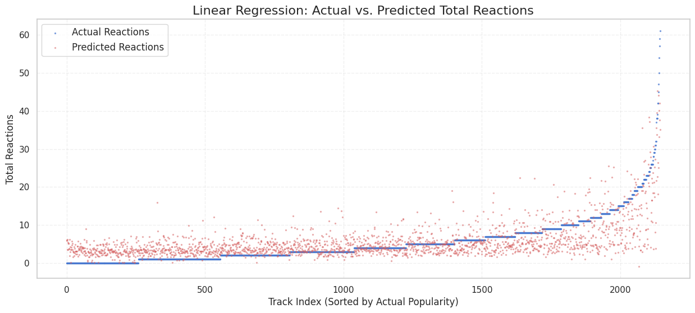
    


**💪 Let's check the importance of each column as a visual plot to have better understanding of the progress:**


```python
linear_weights = lr_model.coef_

fig, ax = plt.subplots(figsize=(20,10))
y_pos = np.arange(0,len(linear_weights),1)
labels = list(X.columns)

hbars = ax.barh(y_pos, linear_weights, align='center')
ax.set_yticks(y_pos)
ax.set_yticklabels(labels)
ax.invert_yaxis()  # labels read top-to-bottom
ax.set_xlabel('Weights')
ax.set_title("Linear Regression: Importance of each column from the algorithm's point of view")

plt.show()

#Source: Lab Session 6
```


    
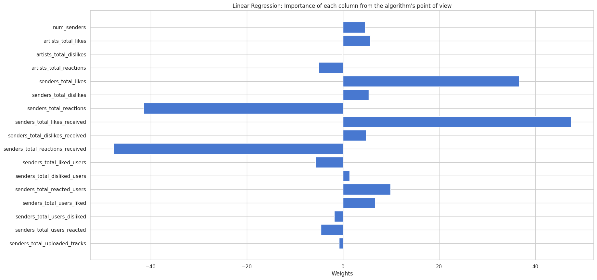
    


#### Transforming to Polynomial Regression:


```python
poly = PolynomialFeatures(degree=2)
X_train_transformed_poly = poly.fit_transform(X_train)
X_test_transformed_poly = poly.transform(X_test)

print(X_train_transformed_poly.shape)
```

    (8580, 171)


*So we have got 171 features out of 17 features, but how many of them are actually useful ❓*


```python
feature_selector = SelectKBest(score_func=mutual_info_regression, k = 'all').fit(X_train_transformed_poly,y_train)

feature_scores = feature_selector.scores_
plt.figure(figsize=(15,6))
plt.plot(np.cumsum(np.sort(np.abs(feature_scores))[::-1])/sum(np.abs(feature_scores)),lw=5)
plt.xlabel('Number of Features')
plt.ylabel('Cumulative percetnage of feature scores')
```


    Text(0, 0.5, 'Cumulative percetnage of feature scores')


    
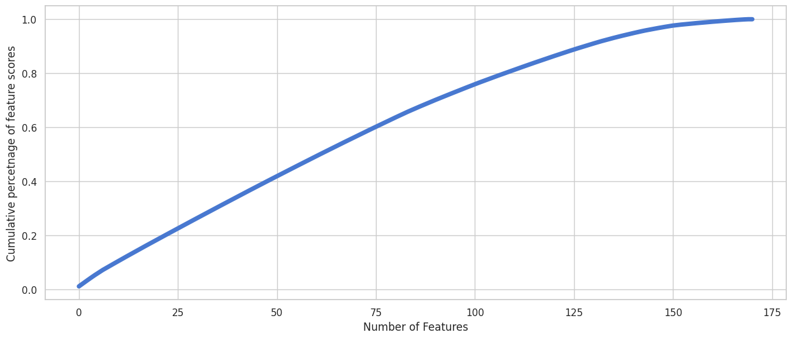
    


From the above plot it seems that 150 features are good to go but let's test it:


```python
no_features = []
scores = []

for k in [100,110,120,130,135,140,150,160,170]:

    # Select best features
    selector = SelectKBest(mutual_info_regression, k = k)
    selector.fit(X_train_transformed_poly, y_train)
    X_train_transformed = selector.transform(X_train_transformed_poly)
    X_test_transform = selector.transform(X_test_transformed_poly)

    # Create the model
    model = LinearRegression()
    model.fit(X_train_transformed, y_train)
    no_features.append(k)
    predicted_results = cap_vector(model.predict(X_test_transform),100000,0)
    r2_test = r2_score(y_test, predicted_results)
    scores.append(r2_test)


# Plot the results
plt.figure(figsize=(20,8))
plt.plot(no_features,scores,lw=5)
plt.xlabel('Number of features')
plt.ylabel('R^2')
plt.show()
```


    
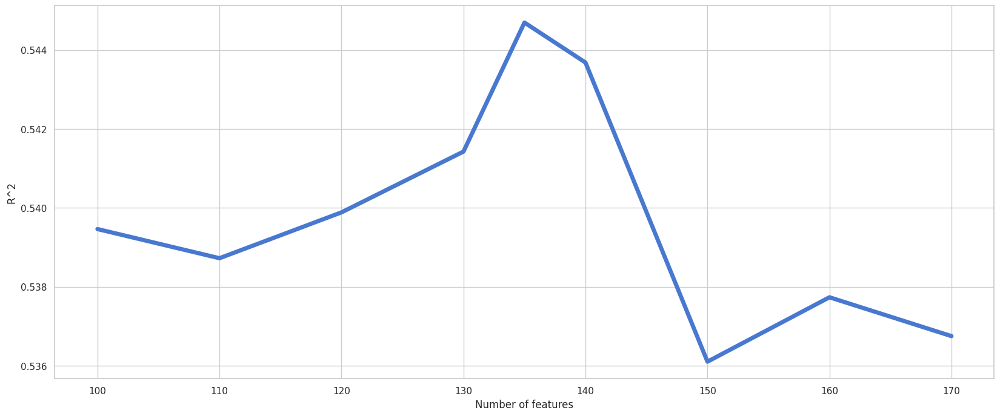
    


**So according to results we go with `k=140` as our optimal choice.**


```python
selector = SelectKBest(mutual_info_regression, k = 140)
selector.fit(X_train_transformed_poly, y_train)
X_train_transformed = selector.transform(X_train_transformed_poly)
X_test_transform = selector.transform(X_test_transformed_poly)

# --- Linear Regression ---
lr_model = LinearRegression()
lr_model.fit(X_train_transformed, y_train)
```


<style>#sk-container-id-2 {
  /* Definition of color scheme common for light and dark mode */
  --sklearn-color-text: #000;
  --sklearn-color-text-muted: #666;
  --sklearn-color-line: gray;
  /* Definition of color scheme for unfitted estimators */
  --sklearn-color-unfitted-level-0: #fff5e6;
  --sklearn-color-unfitted-level-1: #f6e4d2;
  --sklearn-color-unfitted-level-2: #ffe0b3;
  --sklearn-color-unfitted-level-3: chocolate;
  /* Definition of color scheme for fitted estimators */
  --sklearn-color-fitted-level-0: #f0f8ff;
  --sklearn-color-fitted-level-1: #d4ebff;
  --sklearn-color-fitted-level-2: #b3dbfd;
  --sklearn-color-fitted-level-3: cornflowerblue;
}

#sk-container-id-2.light {
  /* Specific color for light theme */
  --sklearn-color-text-on-default-background: black;
  --sklearn-color-background: white;
  --sklearn-color-border-box: black;
  --sklearn-color-icon: #696969;
}

#sk-container-id-2.dark {
  --sklearn-color-text-on-default-background: white;
  --sklearn-color-background: #111;
  --sklearn-color-border-box: white;
  --sklearn-color-icon: #878787;
}

#sk-container-id-2 {
  color: var(--sklearn-color-text);
}

#sk-container-id-2 pre {
  padding: 0;
}

#sk-container-id-2 input.sk-hidden--visually {
  border: 0;
  clip: rect(1px 1px 1px 1px);
  clip: rect(1px, 1px, 1px, 1px);
  height: 1px;
  margin: -1px;
  overflow: hidden;
  padding: 0;
  position: absolute;
  width: 1px;
}

#sk-container-id-2 div.sk-dashed-wrapped {
  border: 1px dashed var(--sklearn-color-line);
  margin: 0 0.4em 0.5em 0.4em;
  box-sizing: border-box;
  padding-bottom: 0.4em;
  background-color: var(--sklearn-color-background);
}

#sk-container-id-2 div.sk-container {
  /* jupyter's `normalize.less` sets `[hidden] { display: none; }`
     but bootstrap.min.css set `[hidden] { display: none !important; }`
     so we also need the `!important` here to be able to override the
     default hidden behavior on the sphinx rendered scikit-learn.org.
     See: https://github.com/scikit-learn/scikit-learn/issues/21755 */
  display: inline-block !important;
  position: relative;
}

#sk-container-id-2 div.sk-text-repr-fallback {
  display: none;
}

div.sk-parallel-item,
div.sk-serial,
div.sk-item {
  /* draw centered vertical line to link estimators */
  background-image: linear-gradient(var(--sklearn-color-text-on-default-background), var(--sklearn-color-text-on-default-background));
  background-size: 2px 100%;
  background-repeat: no-repeat;
  background-position: center center;
}

/* Parallel-specific style estimator block */

#sk-container-id-2 div.sk-parallel-item::after {
  content: "";
  width: 100%;
  border-bottom: 2px solid var(--sklearn-color-text-on-default-background);
  flex-grow: 1;
}

#sk-container-id-2 div.sk-parallel {
  display: flex;
  align-items: stretch;
  justify-content: center;
  background-color: var(--sklearn-color-background);
  position: relative;
}

#sk-container-id-2 div.sk-parallel-item {
  display: flex;
  flex-direction: column;
}

#sk-container-id-2 div.sk-parallel-item:first-child::after {
  align-self: flex-end;
  width: 50%;
}

#sk-container-id-2 div.sk-parallel-item:last-child::after {
  align-self: flex-start;
  width: 50%;
}

#sk-container-id-2 div.sk-parallel-item:only-child::after {
  width: 0;
}

/* Serial-specific style estimator block */

#sk-container-id-2 div.sk-serial {
  display: flex;
  flex-direction: column;
  align-items: center;
  background-color: var(--sklearn-color-background);
  padding-right: 1em;
  padding-left: 1em;
}


/* Toggleable style: style used for estimator/Pipeline/ColumnTransformer box that is
clickable and can be expanded/collapsed.
- Pipeline and ColumnTransformer use this feature and define the default style
- Estimators will overwrite some part of the style using the `sk-estimator` class
*/

/* Pipeline and ColumnTransformer style (default) */

#sk-container-id-2 div.sk-toggleable {
  /* Default theme specific background. It is overwritten whether we have a
  specific estimator or a Pipeline/ColumnTransformer */
  background-color: var(--sklearn-color-background);
}

/* Toggleable label */
#sk-container-id-2 label.sk-toggleable__label {
  cursor: pointer;
  display: flex;
  width: 100%;
  margin-bottom: 0;
  padding: 0.5em;
  box-sizing: border-box;
  text-align: center;
  align-items: center;
  justify-content: center;
  gap: 0.5em;
}

#sk-container-id-2 label.sk-toggleable__label .caption {
  font-size: 0.6rem;
  font-weight: lighter;
  color: var(--sklearn-color-text-muted);
}

#sk-container-id-2 label.sk-toggleable__label-arrow:before {
  /* Arrow on the left of the label */
  content: "▸";
  float: left;
  margin-right: 0.25em;
  color: var(--sklearn-color-icon);
}

#sk-container-id-2 label.sk-toggleable__label-arrow:hover:before {
  color: var(--sklearn-color-text);
}

/* Toggleable content - dropdown */

#sk-container-id-2 div.sk-toggleable__content {
  display: none;
  text-align: left;
  /* unfitted */
  background-color: var(--sklearn-color-unfitted-level-0);
}

#sk-container-id-2 div.sk-toggleable__content.fitted {
  /* fitted */
  background-color: var(--sklearn-color-fitted-level-0);
}

#sk-container-id-2 div.sk-toggleable__content pre {
  margin: 0.2em;
  border-radius: 0.25em;
  color: var(--sklearn-color-text);
  /* unfitted */
  background-color: var(--sklearn-color-unfitted-level-0);
}

#sk-container-id-2 div.sk-toggleable__content.fitted pre {
  /* unfitted */
  background-color: var(--sklearn-color-fitted-level-0);
}

#sk-container-id-2 input.sk-toggleable__control:checked~div.sk-toggleable__content {
  /* Expand drop-down */
  display: block;
  width: 100%;
  overflow: visible;
}

#sk-container-id-2 input.sk-toggleable__control:checked~label.sk-toggleable__label-arrow:before {
  content: "▾";
}

/* Pipeline/ColumnTransformer-specific style */

#sk-container-id-2 div.sk-label input.sk-toggleable__control:checked~label.sk-toggleable__label {
  color: var(--sklearn-color-text);
  background-color: var(--sklearn-color-unfitted-level-2);
}

#sk-container-id-2 div.sk-label.fitted input.sk-toggleable__control:checked~label.sk-toggleable__label {
  background-color: var(--sklearn-color-fitted-level-2);
}

/* Estimator-specific style */

/* Colorize estimator box */
#sk-container-id-2 div.sk-estimator input.sk-toggleable__control:checked~label.sk-toggleable__label {
  /* unfitted */
  background-color: var(--sklearn-color-unfitted-level-2);
}

#sk-container-id-2 div.sk-estimator.fitted input.sk-toggleable__control:checked~label.sk-toggleable__label {
  /* fitted */
  background-color: var(--sklearn-color-fitted-level-2);
}

#sk-container-id-2 div.sk-label label.sk-toggleable__label,
#sk-container-id-2 div.sk-label label {
  /* The background is the default theme color */
  color: var(--sklearn-color-text-on-default-background);
}

/* On hover, darken the color of the background */
#sk-container-id-2 div.sk-label:hover label.sk-toggleable__label {
  color: var(--sklearn-color-text);
  background-color: var(--sklearn-color-unfitted-level-2);
}

/* Label box, darken color on hover, fitted */
#sk-container-id-2 div.sk-label.fitted:hover label.sk-toggleable__label.fitted {
  color: var(--sklearn-color-text);
  background-color: var(--sklearn-color-fitted-level-2);
}

/* Estimator label */

#sk-container-id-2 div.sk-label label {
  font-family: monospace;
  font-weight: bold;
  line-height: 1.2em;
}

#sk-container-id-2 div.sk-label-container {
  text-align: center;
}

/* Estimator-specific */
#sk-container-id-2 div.sk-estimator {
  font-family: monospace;
  border: 1px dotted var(--sklearn-color-border-box);
  border-radius: 0.25em;
  box-sizing: border-box;
  margin-bottom: 0.5em;
  /* unfitted */
  background-color: var(--sklearn-color-unfitted-level-0);
}

#sk-container-id-2 div.sk-estimator.fitted {
  /* fitted */
  background-color: var(--sklearn-color-fitted-level-0);
}

/* on hover */
#sk-container-id-2 div.sk-estimator:hover {
  /* unfitted */
  background-color: var(--sklearn-color-unfitted-level-2);
}

#sk-container-id-2 div.sk-estimator.fitted:hover {
  /* fitted */
  background-color: var(--sklearn-color-fitted-level-2);
}

/* Specification for estimator info (e.g. "i" and "?") */

/* Common style for "i" and "?" */

.sk-estimator-doc-link,
a:link.sk-estimator-doc-link,
a:visited.sk-estimator-doc-link {
  float: right;
  font-size: smaller;
  line-height: 1em;
  font-family: monospace;
  background-color: var(--sklearn-color-unfitted-level-0);
  border-radius: 1em;
  height: 1em;
  width: 1em;
  text-decoration: none !important;
  margin-left: 0.5em;
  text-align: center;
  /* unfitted */
  border: var(--sklearn-color-unfitted-level-3) 1pt solid;
  color: var(--sklearn-color-unfitted-level-3);
}

.sk-estimator-doc-link.fitted,
a:link.sk-estimator-doc-link.fitted,
a:visited.sk-estimator-doc-link.fitted {
  /* fitted */
  background-color: var(--sklearn-color-fitted-level-0);
  border: var(--sklearn-color-fitted-level-3) 1pt solid;
  color: var(--sklearn-color-fitted-level-3);
}

/* On hover */
div.sk-estimator:hover .sk-estimator-doc-link:hover,
.sk-estimator-doc-link:hover,
div.sk-label-container:hover .sk-estimator-doc-link:hover,
.sk-estimator-doc-link:hover {
  /* unfitted */
  background-color: var(--sklearn-color-unfitted-level-3);
  border: var(--sklearn-color-fitted-level-0) 1pt solid;
  color: var(--sklearn-color-unfitted-level-0);
  text-decoration: none;
}

div.sk-estimator.fitted:hover .sk-estimator-doc-link.fitted:hover,
.sk-estimator-doc-link.fitted:hover,
div.sk-label-container:hover .sk-estimator-doc-link.fitted:hover,
.sk-estimator-doc-link.fitted:hover {
  /* fitted */
  background-color: var(--sklearn-color-fitted-level-3);
  border: var(--sklearn-color-fitted-level-0) 1pt solid;
  color: var(--sklearn-color-fitted-level-0);
  text-decoration: none;
}

/* Span, style for the box shown on hovering the info icon */
.sk-estimator-doc-link span {
  display: none;
  z-index: 9999;
  position: relative;
  font-weight: normal;
  right: .2ex;
  padding: .5ex;
  margin: .5ex;
  width: min-content;
  min-width: 20ex;
  max-width: 50ex;
  color: var(--sklearn-color-text);
  box-shadow: 2pt 2pt 4pt #999;
  /* unfitted */
  background: var(--sklearn-color-unfitted-level-0);
  border: .5pt solid var(--sklearn-color-unfitted-level-3);
}

.sk-estimator-doc-link.fitted span {
  /* fitted */
  background: var(--sklearn-color-fitted-level-0);
  border: var(--sklearn-color-fitted-level-3);
}

.sk-estimator-doc-link:hover span {
  display: block;
}

/* "?"-specific style due to the `<a>` HTML tag */

#sk-container-id-2 a.estimator_doc_link {
  float: right;
  font-size: 1rem;
  line-height: 1em;
  font-family: monospace;
  background-color: var(--sklearn-color-unfitted-level-0);
  border-radius: 1rem;
  height: 1rem;
  width: 1rem;
  text-decoration: none;
  /* unfitted */
  color: var(--sklearn-color-unfitted-level-1);
  border: var(--sklearn-color-unfitted-level-1) 1pt solid;
}

#sk-container-id-2 a.estimator_doc_link.fitted {
  /* fitted */
  background-color: var(--sklearn-color-fitted-level-0);
  border: var(--sklearn-color-fitted-level-1) 1pt solid;
  color: var(--sklearn-color-fitted-level-1);
}

/* On hover */
#sk-container-id-2 a.estimator_doc_link:hover {
  /* unfitted */
  background-color: var(--sklearn-color-unfitted-level-3);
  color: var(--sklearn-color-background);
  text-decoration: none;
}

#sk-container-id-2 a.estimator_doc_link.fitted:hover {
  /* fitted */
  background-color: var(--sklearn-color-fitted-level-3);
}

.estimator-table {
    font-family: monospace;
}

.estimator-table summary {
    padding: .5rem;
    cursor: pointer;
}

.estimator-table summary::marker {
    font-size: 0.7rem;
}

.estimator-table details[open] {
    padding-left: 0.1rem;
    padding-right: 0.1rem;
    padding-bottom: 0.3rem;
}

.estimator-table .parameters-table {
    margin-left: auto !important;
    margin-right: auto !important;
    margin-top: 0;
}

.estimator-table .parameters-table tr:nth-child(odd) {
    background-color: #fff;
}

.estimator-table .parameters-table tr:nth-child(even) {
    background-color: #f6f6f6;
}

.estimator-table .parameters-table tr:hover {
    background-color: #e0e0e0;
}

.estimator-table table td {
    border: 1px solid rgba(106, 105, 104, 0.232);
}

/*
    `table td`is set in notebook with right text-align.
    We need to overwrite it.
*/
.estimator-table table td.param {
    text-align: left;
    position: relative;
    padding: 0;
}

.user-set td {
    color:rgb(255, 94, 0);
    text-align: left !important;
}

.user-set td.value {
    color:rgb(255, 94, 0);
    background-color: transparent;
}

.default td {
    color: black;
    text-align: left !important;
}

.user-set td i,
.default td i {
    color: black;
}

/*
    Styles for parameter documentation links
    We need styling for visited so jupyter doesn't overwrite it
*/
a.param-doc-link,
a.param-doc-link:link,
a.param-doc-link:visited {
    text-decoration: underline dashed;
    text-underline-offset: .3em;
    color: inherit;
    display: block;
    padding: .5em;
}

/* "hack" to make the entire area of the cell containing the link clickable */
a.param-doc-link::before {
    position: absolute;
    content: "";
    inset: 0;
}

.param-doc-description {
    display: none;
    position: absolute;
    z-index: 9999;
    left: 0;
    padding: .5ex;
    margin-left: 1.5em;
    color: var(--sklearn-color-text);
    box-shadow: .3em .3em .4em #999;
    width: max-content;
    text-align: left;
    max-height: 10em;
    overflow-y: auto;

    /* unfitted */
    background: var(--sklearn-color-unfitted-level-0);
    border: thin solid var(--sklearn-color-unfitted-level-3);
}

/* Fitted state for parameter tooltips */
.fitted .param-doc-description {
    /* fitted */
    background: var(--sklearn-color-fitted-level-0);
    border: thin solid var(--sklearn-color-fitted-level-3);
}

.param-doc-link:hover .param-doc-description {
    display: block;
}

.copy-paste-icon {
    background-image: url();
    background-repeat: no-repeat;
    background-size: 14px 14px;
    background-position: 0;
    display: inline-block;
    width: 14px;
    height: 14px;
    cursor: pointer;
}
</style><body><div id="sk-container-id-2" class="sk-top-container"><div class="sk-text-repr-fallback"><pre>LinearRegression()</pre><b>In a Jupyter environment, please rerun this cell to show the HTML representation or trust the notebook. <br />On GitHub, the HTML representation is unable to render, please try loading this page with nbviewer.org.</b></div><div class="sk-container" hidden><div class="sk-item"><div class="sk-estimator fitted sk-toggleable"><input class="sk-toggleable__control sk-hidden--visually" id="sk-estimator-id-2" type="checkbox" checked><label for="sk-estimator-id-2" class="sk-toggleable__label fitted sk-toggleable__label-arrow"><div><div>LinearRegression</div></div><div><a class="sk-estimator-doc-link fitted" rel="noreferrer" target="_blank" href="https://scikit-learn.org/1.8/modules/generated/sklearn.linear_model.LinearRegression.html">?<span>Documentation for LinearRegression</span></a><span class="sk-estimator-doc-link fitted">i<span>Fitted</span></span></div></label><div class="sk-toggleable__content fitted" data-param-prefix="">
        <div class="estimator-table">
            <details>
                <summary>Parameters</summary>
                <table class="parameters-table">
                  <tbody>

        <tr class="default">
            <td><i class="copy-paste-icon"
                 onclick="copyToClipboard('fit_intercept',
                          this.parentElement.nextElementSibling)"
            ></i></td>
            <td class="param">
        <a class="param-doc-link"
            rel="noreferrer" target="_blank" href="https://scikit-learn.org/1.8/modules/generated/sklearn.linear_model.LinearRegression.html#:~:text=fit_intercept,-bool%2C%20default%3DTrue">
            fit_intercept
            <span class="param-doc-description">fit_intercept: bool, default=True<br><br>Whether to calculate the intercept for this model. If set<br>to False, no intercept will be used in calculations<br>(i.e. data is expected to be centered).</span>
        </a>
    </td>
            <td class="value">True</td>
        </tr>


        <tr class="default">
            <td><i class="copy-paste-icon"
                 onclick="copyToClipboard('copy_X',
                          this.parentElement.nextElementSibling)"
            ></i></td>
            <td class="param">
        <a class="param-doc-link"
            rel="noreferrer" target="_blank" href="https://scikit-learn.org/1.8/modules/generated/sklearn.linear_model.LinearRegression.html#:~:text=copy_X,-bool%2C%20default%3DTrue">
            copy_X
            <span class="param-doc-description">copy_X: bool, default=True<br><br>If True, X will be copied; else, it may be overwritten.</span>
        </a>
    </td>
            <td class="value">True</td>
        </tr>


        <tr class="default">
            <td><i class="copy-paste-icon"
                 onclick="copyToClipboard('tol',
                          this.parentElement.nextElementSibling)"
            ></i></td>
            <td class="param">
        <a class="param-doc-link"
            rel="noreferrer" target="_blank" href="https://scikit-learn.org/1.8/modules/generated/sklearn.linear_model.LinearRegression.html#:~:text=tol,-float%2C%20default%3D1e-6">
            tol
            <span class="param-doc-description">tol: float, default=1e-6<br><br>The precision of the solution (`coef_`) is determined by `tol` which<br>specifies a different convergence criterion for the `lsqr` solver.<br>`tol` is set as `atol` and `btol` of :func:`scipy.sparse.linalg.lsqr` when<br>fitting on sparse training data. This parameter has no effect when fitting<br>on dense data.<br><br>.. versionadded:: 1.7</span>
        </a>
    </td>
            <td class="value">1e-06</td>
        </tr>


        <tr class="default">
            <td><i class="copy-paste-icon"
                 onclick="copyToClipboard('n_jobs',
                          this.parentElement.nextElementSibling)"
            ></i></td>
            <td class="param">
        <a class="param-doc-link"
            rel="noreferrer" target="_blank" href="https://scikit-learn.org/1.8/modules/generated/sklearn.linear_model.LinearRegression.html#:~:text=n_jobs,-int%2C%20default%3DNone">
            n_jobs
            <span class="param-doc-description">n_jobs: int, default=None<br><br>The number of jobs to use for the computation. This will only provide<br>speedup in case of sufficiently large problems, that is if firstly<br>`n_targets > 1` and secondly `X` is sparse or if `positive` is set<br>to `True`. ``None`` means 1 unless in a<br>:obj:`joblib.parallel_backend` context. ``-1`` means using all<br>processors. See :term:`Glossary <n_jobs>` for more details.</span>
        </a>
    </td>
            <td class="value">None</td>
        </tr>


        <tr class="default">
            <td><i class="copy-paste-icon"
                 onclick="copyToClipboard('positive',
                          this.parentElement.nextElementSibling)"
            ></i></td>
            <td class="param">
        <a class="param-doc-link"
            rel="noreferrer" target="_blank" href="https://scikit-learn.org/1.8/modules/generated/sklearn.linear_model.LinearRegression.html#:~:text=positive,-bool%2C%20default%3DFalse">
            positive
            <span class="param-doc-description">positive: bool, default=False<br><br>When set to ``True``, forces the coefficients to be positive. This<br>option is only supported for dense arrays.<br><br>For a comparison between a linear regression model with positive constraints<br>on the regression coefficients and a linear regression without such constraints,<br>see :ref:`sphx_glr_auto_examples_linear_model_plot_nnls.py`.<br><br>.. versionadded:: 0.24</span>
        </a>
    </td>
            <td class="value">False</td>
        </tr>

                  </tbody>
                </table>
            </details>
        </div>
    </div></div></div></div></div><script>function copyToClipboard(text, element) {
    // Get the parameter prefix from the closest toggleable content
    const toggleableContent = element.closest('.sk-toggleable__content');
    const paramPrefix = toggleableContent ? toggleableContent.dataset.paramPrefix : '';
    const fullParamName = paramPrefix ? `${paramPrefix}${text}` : text;

    const originalStyle = element.style;
    const computedStyle = window.getComputedStyle(element);
    const originalWidth = computedStyle.width;
    const originalHTML = element.innerHTML.replace('Copied!', '');

    navigator.clipboard.writeText(fullParamName)
        .then(() => {
            element.style.width = originalWidth;
            element.style.color = 'green';
            element.innerHTML = "Copied!";

            setTimeout(() => {
                element.innerHTML = originalHTML;
                element.style = originalStyle;
            }, 2000);
        })
        .catch(err => {
            console.error('Failed to copy:', err);
            element.style.color = 'red';
            element.innerHTML = "Failed!";
            setTimeout(() => {
                element.innerHTML = originalHTML;
                element.style = originalStyle;
            }, 2000);
        });
    return false;
}

document.querySelectorAll('.copy-paste-icon').forEach(function(element) {
    const toggleableContent = element.closest('.sk-toggleable__content');
    const paramPrefix = toggleableContent ? toggleableContent.dataset.paramPrefix : '';
    const paramName = element.parentElement.nextElementSibling
        .textContent.trim().split(' ')[0];
    const fullParamName = paramPrefix ? `${paramPrefix}${paramName}` : paramName;

    element.setAttribute('title', fullParamName);
});


/**
 * Adapted from Skrub
 * https://github.com/skrub-data/skrub/blob/403466d1d5d4dc76a7ef569b3f8228db59a31dc3/skrub/_reporting/_data/templates/report.js#L789
 * @returns "light" or "dark"
 */
function detectTheme(element) {
    const body = document.querySelector('body');

    // Check VSCode theme
    const themeKindAttr = body.getAttribute('data-vscode-theme-kind');
    const themeNameAttr = body.getAttribute('data-vscode-theme-name');

    if (themeKindAttr && themeNameAttr) {
        const themeKind = themeKindAttr.toLowerCase();
        const themeName = themeNameAttr.toLowerCase();

        if (themeKind.includes("dark") || themeName.includes("dark")) {
            return "dark";
        }
        if (themeKind.includes("light") || themeName.includes("light")) {
            return "light";
        }
    }

    // Check Jupyter theme
    if (body.getAttribute('data-jp-theme-light') === 'false') {
        return 'dark';
    } else if (body.getAttribute('data-jp-theme-light') === 'true') {
        return 'light';
    }

    // Guess based on a parent element's color
    const color = window.getComputedStyle(element.parentNode, null).getPropertyValue('color');
    const match = color.match(/^rgb\s*\(\s*(\d+)\s*,\s*(\d+)\s*,\s*(\d+)\s*\)\s*$/i);
    if (match) {
        const [r, g, b] = [
            parseFloat(match[1]),
            parseFloat(match[2]),
            parseFloat(match[3])
        ];

        // https://en.wikipedia.org/wiki/HSL_and_HSV#Lightness
        const luma = 0.299 * r + 0.587 * g + 0.114 * b;

        if (luma > 180) {
            // If the text is very bright we have a dark theme
            return 'dark';
        }
        if (luma < 75) {
            // If the text is very dark we have a light theme
            return 'light';
        }
        // Otherwise fall back to the next heuristic.
    }

    // Fallback to system preference
    return window.matchMedia('(prefers-color-scheme: dark)').matches ? 'dark' : 'light';
}


function forceTheme(elementId) {
    const estimatorElement = document.querySelector(`#${elementId}`);
    if (estimatorElement === null) {
        console.error(`Element with id ${elementId} not found.`);
    } else {
        const theme = detectTheme(estimatorElement);
        estimatorElement.classList.add(theme);
    }
}

forceTheme('sk-container-id-2');</script></body>


```python
predicted_results = cap_vector(lr_model.predict(X_test_transform),100000,0)
evaluate_regression("Linear Regression (140 parameters)", y_test, predicted_results)
```


<style type="text/css">
</style>
<table id="T_d7219">
  <thead>
    <tr>
      <th class="blank level0" >&nbsp;</th>
      <th id="T_d7219_level0_col0" class="col_heading level0 col0" >MSE</th>
      <th id="T_d7219_level0_col1" class="col_heading level0 col1" >MAE</th>
      <th id="T_d7219_level0_col2" class="col_heading level0 col2" >MAPE</th>
      <th id="T_d7219_level0_col3" class="col_heading level0 col3" >R2</th>
      <th id="T_d7219_level0_col4" class="col_heading level0 col4" >RMSLE</th>
      <th id="T_d7219_level0_col5" class="col_heading level0 col5" >MedAE</th>
    </tr>
  </thead>
  <tbody>
    <tr>
      <th id="T_d7219_level0_row0" class="row_heading level0 row0" >Linear Regression</th>
      <td id="T_d7219_row0_col0" class="data row0 col0" >19.0116</td>
      <td id="T_d7219_row0_col1" class="data row0 col1" >3.0971</td>
      <td id="T_d7219_row0_col2" class="data row0 col2" >1.80e+15</td>
      <td id="T_d7219_row0_col3" class="data row0 col3" >0.520247</td>
      <td id="T_d7219_row0_col4" class="data row0 col4" >0.7497</td>
      <td id="T_d7219_row0_col5" class="data row0 col5" >2.3612</td>
    </tr>
    <tr>
      <th id="T_d7219_level0_row1" class="row_heading level0 row1" >Linear Regression (140 parameters)</th>
      <td id="T_d7219_row1_col0" class="data row1 col0" >18.1497</td>
      <td id="T_d7219_row1_col1" class="data row1 col1" >3.0170</td>
      <td id="T_d7219_row1_col2" class="data row1 col2" >1.68e+15</td>
      <td id="T_d7219_row1_col3" class="data row1 col3" >0.541997</td>
      <td id="T_d7219_row1_col4" class="data row1 col4" >0.7234</td>
      <td id="T_d7219_row1_col5" class="data row1 col5" >2.3456</td>
    </tr>
  </tbody>
</table>


*👀 We saw that one comming, our prevoius linear regression R^2 value had a solid 0.52 value so we really didn't expect it to fire rocket, but to be honest 0.02 progress in R^2 is not that mouch of difference in our case.*


```python
plot_actual_vs_predicted("Linear Regression (140 parameters)", y_test, predicted_results)
```


    
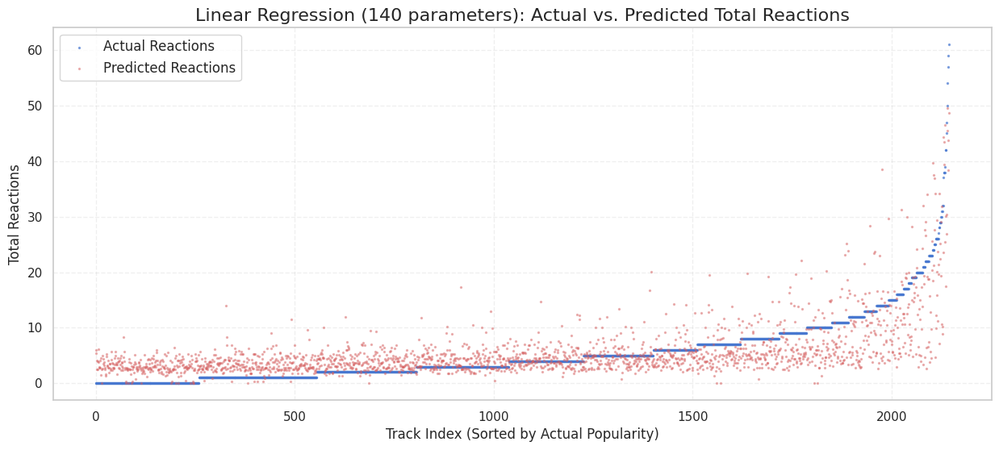
    


*As we can see from the plot, the model has better behavior in popular tracks and can guess much higher numbers.*

### 1.2 Ridge Regression


```python
# --- Ridge Regression ---
# We can tune alpha via GridSearchCV broadly
ridge_cv = GridSearchCV(Ridge(), param_grid={'alpha': [0.01, 0.1, 1.0, 10.0, 100.0]}, cv=5)
ridge_cv.fit(X_train_scaled, y_train)
```


<style>#sk-container-id-3 {
  /* Definition of color scheme common for light and dark mode */
  --sklearn-color-text: #000;
  --sklearn-color-text-muted: #666;
  --sklearn-color-line: gray;
  /* Definition of color scheme for unfitted estimators */
  --sklearn-color-unfitted-level-0: #fff5e6;
  --sklearn-color-unfitted-level-1: #f6e4d2;
  --sklearn-color-unfitted-level-2: #ffe0b3;
  --sklearn-color-unfitted-level-3: chocolate;
  /* Definition of color scheme for fitted estimators */
  --sklearn-color-fitted-level-0: #f0f8ff;
  --sklearn-color-fitted-level-1: #d4ebff;
  --sklearn-color-fitted-level-2: #b3dbfd;
  --sklearn-color-fitted-level-3: cornflowerblue;
}

#sk-container-id-3.light {
  /* Specific color for light theme */
  --sklearn-color-text-on-default-background: black;
  --sklearn-color-background: white;
  --sklearn-color-border-box: black;
  --sklearn-color-icon: #696969;
}

#sk-container-id-3.dark {
  --sklearn-color-text-on-default-background: white;
  --sklearn-color-background: #111;
  --sklearn-color-border-box: white;
  --sklearn-color-icon: #878787;
}

#sk-container-id-3 {
  color: var(--sklearn-color-text);
}

#sk-container-id-3 pre {
  padding: 0;
}

#sk-container-id-3 input.sk-hidden--visually {
  border: 0;
  clip: rect(1px 1px 1px 1px);
  clip: rect(1px, 1px, 1px, 1px);
  height: 1px;
  margin: -1px;
  overflow: hidden;
  padding: 0;
  position: absolute;
  width: 1px;
}

#sk-container-id-3 div.sk-dashed-wrapped {
  border: 1px dashed var(--sklearn-color-line);
  margin: 0 0.4em 0.5em 0.4em;
  box-sizing: border-box;
  padding-bottom: 0.4em;
  background-color: var(--sklearn-color-background);
}

#sk-container-id-3 div.sk-container {
  /* jupyter's `normalize.less` sets `[hidden] { display: none; }`
     but bootstrap.min.css set `[hidden] { display: none !important; }`
     so we also need the `!important` here to be able to override the
     default hidden behavior on the sphinx rendered scikit-learn.org.
     See: https://github.com/scikit-learn/scikit-learn/issues/21755 */
  display: inline-block !important;
  position: relative;
}

#sk-container-id-3 div.sk-text-repr-fallback {
  display: none;
}

div.sk-parallel-item,
div.sk-serial,
div.sk-item {
  /* draw centered vertical line to link estimators */
  background-image: linear-gradient(var(--sklearn-color-text-on-default-background), var(--sklearn-color-text-on-default-background));
  background-size: 2px 100%;
  background-repeat: no-repeat;
  background-position: center center;
}

/* Parallel-specific style estimator block */

#sk-container-id-3 div.sk-parallel-item::after {
  content: "";
  width: 100%;
  border-bottom: 2px solid var(--sklearn-color-text-on-default-background);
  flex-grow: 1;
}

#sk-container-id-3 div.sk-parallel {
  display: flex;
  align-items: stretch;
  justify-content: center;
  background-color: var(--sklearn-color-background);
  position: relative;
}

#sk-container-id-3 div.sk-parallel-item {
  display: flex;
  flex-direction: column;
}

#sk-container-id-3 div.sk-parallel-item:first-child::after {
  align-self: flex-end;
  width: 50%;
}

#sk-container-id-3 div.sk-parallel-item:last-child::after {
  align-self: flex-start;
  width: 50%;
}

#sk-container-id-3 div.sk-parallel-item:only-child::after {
  width: 0;
}

/* Serial-specific style estimator block */

#sk-container-id-3 div.sk-serial {
  display: flex;
  flex-direction: column;
  align-items: center;
  background-color: var(--sklearn-color-background);
  padding-right: 1em;
  padding-left: 1em;
}


/* Toggleable style: style used for estimator/Pipeline/ColumnTransformer box that is
clickable and can be expanded/collapsed.
- Pipeline and ColumnTransformer use this feature and define the default style
- Estimators will overwrite some part of the style using the `sk-estimator` class
*/

/* Pipeline and ColumnTransformer style (default) */

#sk-container-id-3 div.sk-toggleable {
  /* Default theme specific background. It is overwritten whether we have a
  specific estimator or a Pipeline/ColumnTransformer */
  background-color: var(--sklearn-color-background);
}

/* Toggleable label */
#sk-container-id-3 label.sk-toggleable__label {
  cursor: pointer;
  display: flex;
  width: 100%;
  margin-bottom: 0;
  padding: 0.5em;
  box-sizing: border-box;
  text-align: center;
  align-items: center;
  justify-content: center;
  gap: 0.5em;
}

#sk-container-id-3 label.sk-toggleable__label .caption {
  font-size: 0.6rem;
  font-weight: lighter;
  color: var(--sklearn-color-text-muted);
}

#sk-container-id-3 label.sk-toggleable__label-arrow:before {
  /* Arrow on the left of the label */
  content: "▸";
  float: left;
  margin-right: 0.25em;
  color: var(--sklearn-color-icon);
}

#sk-container-id-3 label.sk-toggleable__label-arrow:hover:before {
  color: var(--sklearn-color-text);
}

/* Toggleable content - dropdown */

#sk-container-id-3 div.sk-toggleable__content {
  display: none;
  text-align: left;
  /* unfitted */
  background-color: var(--sklearn-color-unfitted-level-0);
}

#sk-container-id-3 div.sk-toggleable__content.fitted {
  /* fitted */
  background-color: var(--sklearn-color-fitted-level-0);
}

#sk-container-id-3 div.sk-toggleable__content pre {
  margin: 0.2em;
  border-radius: 0.25em;
  color: var(--sklearn-color-text);
  /* unfitted */
  background-color: var(--sklearn-color-unfitted-level-0);
}

#sk-container-id-3 div.sk-toggleable__content.fitted pre {
  /* unfitted */
  background-color: var(--sklearn-color-fitted-level-0);
}

#sk-container-id-3 input.sk-toggleable__control:checked~div.sk-toggleable__content {
  /* Expand drop-down */
  display: block;
  width: 100%;
  overflow: visible;
}

#sk-container-id-3 input.sk-toggleable__control:checked~label.sk-toggleable__label-arrow:before {
  content: "▾";
}

/* Pipeline/ColumnTransformer-specific style */

#sk-container-id-3 div.sk-label input.sk-toggleable__control:checked~label.sk-toggleable__label {
  color: var(--sklearn-color-text);
  background-color: var(--sklearn-color-unfitted-level-2);
}

#sk-container-id-3 div.sk-label.fitted input.sk-toggleable__control:checked~label.sk-toggleable__label {
  background-color: var(--sklearn-color-fitted-level-2);
}

/* Estimator-specific style */

/* Colorize estimator box */
#sk-container-id-3 div.sk-estimator input.sk-toggleable__control:checked~label.sk-toggleable__label {
  /* unfitted */
  background-color: var(--sklearn-color-unfitted-level-2);
}

#sk-container-id-3 div.sk-estimator.fitted input.sk-toggleable__control:checked~label.sk-toggleable__label {
  /* fitted */
  background-color: var(--sklearn-color-fitted-level-2);
}

#sk-container-id-3 div.sk-label label.sk-toggleable__label,
#sk-container-id-3 div.sk-label label {
  /* The background is the default theme color */
  color: var(--sklearn-color-text-on-default-background);
}

/* On hover, darken the color of the background */
#sk-container-id-3 div.sk-label:hover label.sk-toggleable__label {
  color: var(--sklearn-color-text);
  background-color: var(--sklearn-color-unfitted-level-2);
}

/* Label box, darken color on hover, fitted */
#sk-container-id-3 div.sk-label.fitted:hover label.sk-toggleable__label.fitted {
  color: var(--sklearn-color-text);
  background-color: var(--sklearn-color-fitted-level-2);
}

/* Estimator label */

#sk-container-id-3 div.sk-label label {
  font-family: monospace;
  font-weight: bold;
  line-height: 1.2em;
}

#sk-container-id-3 div.sk-label-container {
  text-align: center;
}

/* Estimator-specific */
#sk-container-id-3 div.sk-estimator {
  font-family: monospace;
  border: 1px dotted var(--sklearn-color-border-box);
  border-radius: 0.25em;
  box-sizing: border-box;
  margin-bottom: 0.5em;
  /* unfitted */
  background-color: var(--sklearn-color-unfitted-level-0);
}

#sk-container-id-3 div.sk-estimator.fitted {
  /* fitted */
  background-color: var(--sklearn-color-fitted-level-0);
}

/* on hover */
#sk-container-id-3 div.sk-estimator:hover {
  /* unfitted */
  background-color: var(--sklearn-color-unfitted-level-2);
}

#sk-container-id-3 div.sk-estimator.fitted:hover {
  /* fitted */
  background-color: var(--sklearn-color-fitted-level-2);
}

/* Specification for estimator info (e.g. "i" and "?") */

/* Common style for "i" and "?" */

.sk-estimator-doc-link,
a:link.sk-estimator-doc-link,
a:visited.sk-estimator-doc-link {
  float: right;
  font-size: smaller;
  line-height: 1em;
  font-family: monospace;
  background-color: var(--sklearn-color-unfitted-level-0);
  border-radius: 1em;
  height: 1em;
  width: 1em;
  text-decoration: none !important;
  margin-left: 0.5em;
  text-align: center;
  /* unfitted */
  border: var(--sklearn-color-unfitted-level-3) 1pt solid;
  color: var(--sklearn-color-unfitted-level-3);
}

.sk-estimator-doc-link.fitted,
a:link.sk-estimator-doc-link.fitted,
a:visited.sk-estimator-doc-link.fitted {
  /* fitted */
  background-color: var(--sklearn-color-fitted-level-0);
  border: var(--sklearn-color-fitted-level-3) 1pt solid;
  color: var(--sklearn-color-fitted-level-3);
}

/* On hover */
div.sk-estimator:hover .sk-estimator-doc-link:hover,
.sk-estimator-doc-link:hover,
div.sk-label-container:hover .sk-estimator-doc-link:hover,
.sk-estimator-doc-link:hover {
  /* unfitted */
  background-color: var(--sklearn-color-unfitted-level-3);
  border: var(--sklearn-color-fitted-level-0) 1pt solid;
  color: var(--sklearn-color-unfitted-level-0);
  text-decoration: none;
}

div.sk-estimator.fitted:hover .sk-estimator-doc-link.fitted:hover,
.sk-estimator-doc-link.fitted:hover,
div.sk-label-container:hover .sk-estimator-doc-link.fitted:hover,
.sk-estimator-doc-link.fitted:hover {
  /* fitted */
  background-color: var(--sklearn-color-fitted-level-3);
  border: var(--sklearn-color-fitted-level-0) 1pt solid;
  color: var(--sklearn-color-fitted-level-0);
  text-decoration: none;
}

/* Span, style for the box shown on hovering the info icon */
.sk-estimator-doc-link span {
  display: none;
  z-index: 9999;
  position: relative;
  font-weight: normal;
  right: .2ex;
  padding: .5ex;
  margin: .5ex;
  width: min-content;
  min-width: 20ex;
  max-width: 50ex;
  color: var(--sklearn-color-text);
  box-shadow: 2pt 2pt 4pt #999;
  /* unfitted */
  background: var(--sklearn-color-unfitted-level-0);
  border: .5pt solid var(--sklearn-color-unfitted-level-3);
}

.sk-estimator-doc-link.fitted span {
  /* fitted */
  background: var(--sklearn-color-fitted-level-0);
  border: var(--sklearn-color-fitted-level-3);
}

.sk-estimator-doc-link:hover span {
  display: block;
}

/* "?"-specific style due to the `<a>` HTML tag */

#sk-container-id-3 a.estimator_doc_link {
  float: right;
  font-size: 1rem;
  line-height: 1em;
  font-family: monospace;
  background-color: var(--sklearn-color-unfitted-level-0);
  border-radius: 1rem;
  height: 1rem;
  width: 1rem;
  text-decoration: none;
  /* unfitted */
  color: var(--sklearn-color-unfitted-level-1);
  border: var(--sklearn-color-unfitted-level-1) 1pt solid;
}

#sk-container-id-3 a.estimator_doc_link.fitted {
  /* fitted */
  background-color: var(--sklearn-color-fitted-level-0);
  border: var(--sklearn-color-fitted-level-1) 1pt solid;
  color: var(--sklearn-color-fitted-level-1);
}

/* On hover */
#sk-container-id-3 a.estimator_doc_link:hover {
  /* unfitted */
  background-color: var(--sklearn-color-unfitted-level-3);
  color: var(--sklearn-color-background);
  text-decoration: none;
}

#sk-container-id-3 a.estimator_doc_link.fitted:hover {
  /* fitted */
  background-color: var(--sklearn-color-fitted-level-3);
}

.estimator-table {
    font-family: monospace;
}

.estimator-table summary {
    padding: .5rem;
    cursor: pointer;
}

.estimator-table summary::marker {
    font-size: 0.7rem;
}

.estimator-table details[open] {
    padding-left: 0.1rem;
    padding-right: 0.1rem;
    padding-bottom: 0.3rem;
}

.estimator-table .parameters-table {
    margin-left: auto !important;
    margin-right: auto !important;
    margin-top: 0;
}

.estimator-table .parameters-table tr:nth-child(odd) {
    background-color: #fff;
}

.estimator-table .parameters-table tr:nth-child(even) {
    background-color: #f6f6f6;
}

.estimator-table .parameters-table tr:hover {
    background-color: #e0e0e0;
}

.estimator-table table td {
    border: 1px solid rgba(106, 105, 104, 0.232);
}

/*
    `table td`is set in notebook with right text-align.
    We need to overwrite it.
*/
.estimator-table table td.param {
    text-align: left;
    position: relative;
    padding: 0;
}

.user-set td {
    color:rgb(255, 94, 0);
    text-align: left !important;
}

.user-set td.value {
    color:rgb(255, 94, 0);
    background-color: transparent;
}

.default td {
    color: black;
    text-align: left !important;
}

.user-set td i,
.default td i {
    color: black;
}

/*
    Styles for parameter documentation links
    We need styling for visited so jupyter doesn't overwrite it
*/
a.param-doc-link,
a.param-doc-link:link,
a.param-doc-link:visited {
    text-decoration: underline dashed;
    text-underline-offset: .3em;
    color: inherit;
    display: block;
    padding: .5em;
}

/* "hack" to make the entire area of the cell containing the link clickable */
a.param-doc-link::before {
    position: absolute;
    content: "";
    inset: 0;
}

.param-doc-description {
    display: none;
    position: absolute;
    z-index: 9999;
    left: 0;
    padding: .5ex;
    margin-left: 1.5em;
    color: var(--sklearn-color-text);
    box-shadow: .3em .3em .4em #999;
    width: max-content;
    text-align: left;
    max-height: 10em;
    overflow-y: auto;

    /* unfitted */
    background: var(--sklearn-color-unfitted-level-0);
    border: thin solid var(--sklearn-color-unfitted-level-3);
}

/* Fitted state for parameter tooltips */
.fitted .param-doc-description {
    /* fitted */
    background: var(--sklearn-color-fitted-level-0);
    border: thin solid var(--sklearn-color-fitted-level-3);
}

.param-doc-link:hover .param-doc-description {
    display: block;
}

.copy-paste-icon {
    background-image: url();
    background-repeat: no-repeat;
    background-size: 14px 14px;
    background-position: 0;
    display: inline-block;
    width: 14px;
    height: 14px;
    cursor: pointer;
}
</style><body><div id="sk-container-id-3" class="sk-top-container"><div class="sk-text-repr-fallback"><pre>GridSearchCV(cv=5, estimator=Ridge(),
             param_grid={&#x27;alpha&#x27;: [0.01, 0.1, 1.0, 10.0, 100.0]})</pre><b>In a Jupyter environment, please rerun this cell to show the HTML representation or trust the notebook. <br />On GitHub, the HTML representation is unable to render, please try loading this page with nbviewer.org.</b></div><div class="sk-container" hidden><div class="sk-item sk-dashed-wrapped"><div class="sk-label-container"><div class="sk-label fitted sk-toggleable"><input class="sk-toggleable__control sk-hidden--visually" id="sk-estimator-id-3" type="checkbox" ><label for="sk-estimator-id-3" class="sk-toggleable__label fitted sk-toggleable__label-arrow"><div><div>GridSearchCV</div></div><div><a class="sk-estimator-doc-link fitted" rel="noreferrer" target="_blank" href="https://scikit-learn.org/1.8/modules/generated/sklearn.model_selection.GridSearchCV.html">?<span>Documentation for GridSearchCV</span></a><span class="sk-estimator-doc-link fitted">i<span>Fitted</span></span></div></label><div class="sk-toggleable__content fitted" data-param-prefix="">
        <div class="estimator-table">
            <details>
                <summary>Parameters</summary>
                <table class="parameters-table">
                  <tbody>

        <tr class="user-set">
            <td><i class="copy-paste-icon"
                 onclick="copyToClipboard('estimator',
                          this.parentElement.nextElementSibling)"
            ></i></td>
            <td class="param">
        <a class="param-doc-link"
            rel="noreferrer" target="_blank" href="https://scikit-learn.org/1.8/modules/generated/sklearn.model_selection.GridSearchCV.html#:~:text=estimator,-estimator%20object">
            estimator
            <span class="param-doc-description">estimator: estimator object<br><br>This is assumed to implement the scikit-learn estimator interface.<br>Either estimator needs to provide a ``score`` function,<br>or ``scoring`` must be passed.</span>
        </a>
    </td>
            <td class="value">Ridge()</td>
        </tr>


        <tr class="user-set">
            <td><i class="copy-paste-icon"
                 onclick="copyToClipboard('param_grid',
                          this.parentElement.nextElementSibling)"
            ></i></td>
            <td class="param">
        <a class="param-doc-link"
            rel="noreferrer" target="_blank" href="https://scikit-learn.org/1.8/modules/generated/sklearn.model_selection.GridSearchCV.html#:~:text=param_grid,-dict%20or%20list%20of%20dictionaries">
            param_grid
            <span class="param-doc-description">param_grid: dict or list of dictionaries<br><br>Dictionary with parameters names (`str`) as keys and lists of<br>parameter settings to try as values, or a list of such<br>dictionaries, in which case the grids spanned by each dictionary<br>in the list are explored. This enables searching over any sequence<br>of parameter settings.</span>
        </a>
    </td>
            <td class="value">{&#x27;alpha&#x27;: [0.01, 0.1, ...]}</td>
        </tr>


        <tr class="default">
            <td><i class="copy-paste-icon"
                 onclick="copyToClipboard('scoring',
                          this.parentElement.nextElementSibling)"
            ></i></td>
            <td class="param">
        <a class="param-doc-link"
            rel="noreferrer" target="_blank" href="https://scikit-learn.org/1.8/modules/generated/sklearn.model_selection.GridSearchCV.html#:~:text=scoring,-str%2C%20callable%2C%20list%2C%20tuple%20or%20dict%2C%20default%3DNone">
            scoring
            <span class="param-doc-description">scoring: str, callable, list, tuple or dict, default=None<br><br>Strategy to evaluate the performance of the cross-validated model on<br>the test set.<br><br>If `scoring` represents a single score, one can use:<br><br>- a single string (see :ref:`scoring_string_names`);<br>- a callable (see :ref:`scoring_callable`) that returns a single value;<br>- `None`, the `estimator`'s<br>  :ref:`default evaluation criterion <scoring_api_overview>` is used.<br><br>If `scoring` represents multiple scores, one can use:<br><br>- a list or tuple of unique strings;<br>- a callable returning a dictionary where the keys are the metric<br>  names and the values are the metric scores;<br>- a dictionary with metric names as keys and callables as values.<br><br>See :ref:`multimetric_grid_search` for an example.</span>
        </a>
    </td>
            <td class="value">None</td>
        </tr>


        <tr class="default">
            <td><i class="copy-paste-icon"
                 onclick="copyToClipboard('n_jobs',
                          this.parentElement.nextElementSibling)"
            ></i></td>
            <td class="param">
        <a class="param-doc-link"
            rel="noreferrer" target="_blank" href="https://scikit-learn.org/1.8/modules/generated/sklearn.model_selection.GridSearchCV.html#:~:text=n_jobs,-int%2C%20default%3DNone">
            n_jobs
            <span class="param-doc-description">n_jobs: int, default=None<br><br>Number of jobs to run in parallel.<br>``None`` means 1 unless in a :obj:`joblib.parallel_backend` context.<br>``-1`` means using all processors. See :term:`Glossary <n_jobs>`<br>for more details.<br><br>.. versionchanged:: v0.20<br>   `n_jobs` default changed from 1 to None</span>
        </a>
    </td>
            <td class="value">None</td>
        </tr>


        <tr class="default">
            <td><i class="copy-paste-icon"
                 onclick="copyToClipboard('refit',
                          this.parentElement.nextElementSibling)"
            ></i></td>
            <td class="param">
        <a class="param-doc-link"
            rel="noreferrer" target="_blank" href="https://scikit-learn.org/1.8/modules/generated/sklearn.model_selection.GridSearchCV.html#:~:text=refit,-bool%2C%20str%2C%20or%20callable%2C%20default%3DTrue">
            refit
            <span class="param-doc-description">refit: bool, str, or callable, default=True<br><br>Refit an estimator using the best found parameters on the whole<br>dataset.<br><br>For multiple metric evaluation, this needs to be a `str` denoting the<br>scorer that would be used to find the best parameters for refitting<br>the estimator at the end.<br><br>Where there are considerations other than maximum score in<br>choosing a best estimator, ``refit`` can be set to a function which<br>returns the selected ``best_index_`` given ``cv_results_``. In that<br>case, the ``best_estimator_`` and ``best_params_`` will be set<br>according to the returned ``best_index_`` while the ``best_score_``<br>attribute will not be available.<br><br>The refitted estimator is made available at the ``best_estimator_``<br>attribute and permits using ``predict`` directly on this<br>``GridSearchCV`` instance.<br><br>Also for multiple metric evaluation, the attributes ``best_index_``,<br>``best_score_`` and ``best_params_`` will only be available if<br>``refit`` is set and all of them will be determined w.r.t this specific<br>scorer.<br><br>See ``scoring`` parameter to know more about multiple metric<br>evaluation.<br><br>See :ref:`sphx_glr_auto_examples_model_selection_plot_grid_search_digits.py`<br>to see how to design a custom selection strategy using a callable<br>via `refit`.<br><br>See :ref:`this example<br><sphx_glr_auto_examples_model_selection_plot_grid_search_refit_callable.py>`<br>for an example of how to use ``refit=callable`` to balance model<br>complexity and cross-validated score.<br><br>.. versionchanged:: 0.20<br>    Support for callable added.</span>
        </a>
    </td>
            <td class="value">True</td>
        </tr>


        <tr class="user-set">
            <td><i class="copy-paste-icon"
                 onclick="copyToClipboard('cv',
                          this.parentElement.nextElementSibling)"
            ></i></td>
            <td class="param">
        <a class="param-doc-link"
            rel="noreferrer" target="_blank" href="https://scikit-learn.org/1.8/modules/generated/sklearn.model_selection.GridSearchCV.html#:~:text=cv,-int%2C%20cross-validation%20generator%20or%20an%20iterable%2C%20default%3DNone">
            cv
            <span class="param-doc-description">cv: int, cross-validation generator or an iterable, default=None<br><br>Determines the cross-validation splitting strategy.<br>Possible inputs for cv are:<br><br>- None, to use the default 5-fold cross validation,<br>- integer, to specify the number of folds in a `(Stratified)KFold`,<br>- :term:`CV splitter`,<br>- An iterable yielding (train, test) splits as arrays of indices.<br><br>For integer/None inputs, if the estimator is a classifier and ``y`` is<br>either binary or multiclass, :class:`StratifiedKFold` is used. In all<br>other cases, :class:`KFold` is used. These splitters are instantiated<br>with `shuffle=False` so the splits will be the same across calls.<br><br>Refer :ref:`User Guide <cross_validation>` for the various<br>cross-validation strategies that can be used here.<br><br>.. versionchanged:: 0.22<br>    ``cv`` default value if None changed from 3-fold to 5-fold.</span>
        </a>
    </td>
            <td class="value">5</td>
        </tr>


        <tr class="default">
            <td><i class="copy-paste-icon"
                 onclick="copyToClipboard('verbose',
                          this.parentElement.nextElementSibling)"
            ></i></td>
            <td class="param">
        <a class="param-doc-link"
            rel="noreferrer" target="_blank" href="https://scikit-learn.org/1.8/modules/generated/sklearn.model_selection.GridSearchCV.html#:~:text=verbose,-int">
            verbose
            <span class="param-doc-description">verbose: int<br><br>Controls the verbosity: the higher, the more messages.<br><br>- >1 : the computation time for each fold and parameter candidate is<br>  displayed;<br>- >2 : the score is also displayed;<br>- >3 : the fold and candidate parameter indexes are also displayed<br>  together with the starting time of the computation.</span>
        </a>
    </td>
            <td class="value">0</td>
        </tr>


        <tr class="default">
            <td><i class="copy-paste-icon"
                 onclick="copyToClipboard('pre_dispatch',
                          this.parentElement.nextElementSibling)"
            ></i></td>
            <td class="param">
        <a class="param-doc-link"
            rel="noreferrer" target="_blank" href="https://scikit-learn.org/1.8/modules/generated/sklearn.model_selection.GridSearchCV.html#:~:text=pre_dispatch,-int%2C%20or%20str%2C%20default%3D%272%2An_jobs%27">
            pre_dispatch
            <span class="param-doc-description">pre_dispatch: int, or str, default='2*n_jobs'<br><br>Controls the number of jobs that get dispatched during parallel<br>execution. Reducing this number can be useful to avoid an<br>explosion of memory consumption when more jobs get dispatched<br>than CPUs can process. This parameter can be:<br><br>- None, in which case all the jobs are immediately created and spawned. Use<br>  this for lightweight and fast-running jobs, to avoid delays due to on-demand<br>  spawning of the jobs<br>- An int, giving the exact number of total jobs that are spawned<br>- A str, giving an expression as a function of n_jobs, as in '2*n_jobs'</span>
        </a>
    </td>
            <td class="value">&#x27;2*n_jobs&#x27;</td>
        </tr>


        <tr class="default">
            <td><i class="copy-paste-icon"
                 onclick="copyToClipboard('error_score',
                          this.parentElement.nextElementSibling)"
            ></i></td>
            <td class="param">
        <a class="param-doc-link"
            rel="noreferrer" target="_blank" href="https://scikit-learn.org/1.8/modules/generated/sklearn.model_selection.GridSearchCV.html#:~:text=error_score,-%27raise%27%20or%20numeric%2C%20default%3Dnp.nan">
            error_score
            <span class="param-doc-description">error_score: 'raise' or numeric, default=np.nan<br><br>Value to assign to the score if an error occurs in estimator fitting.<br>If set to 'raise', the error is raised. If a numeric value is given,<br>FitFailedWarning is raised. This parameter does not affect the refit<br>step, which will always raise the error.</span>
        </a>
    </td>
            <td class="value">nan</td>
        </tr>


        <tr class="default">
            <td><i class="copy-paste-icon"
                 onclick="copyToClipboard('return_train_score',
                          this.parentElement.nextElementSibling)"
            ></i></td>
            <td class="param">
        <a class="param-doc-link"
            rel="noreferrer" target="_blank" href="https://scikit-learn.org/1.8/modules/generated/sklearn.model_selection.GridSearchCV.html#:~:text=return_train_score,-bool%2C%20default%3DFalse">
            return_train_score
            <span class="param-doc-description">return_train_score: bool, default=False<br><br>If ``False``, the ``cv_results_`` attribute will not include training<br>scores.<br>Computing training scores is used to get insights on how different<br>parameter settings impact the overfitting/underfitting trade-off.<br>However computing the scores on the training set can be computationally<br>expensive and is not strictly required to select the parameters that<br>yield the best generalization performance.<br><br>.. versionadded:: 0.19<br><br>.. versionchanged:: 0.21<br>    Default value was changed from ``True`` to ``False``</span>
        </a>
    </td>
            <td class="value">False</td>
        </tr>

                  </tbody>
                </table>
            </details>
        </div>
    </div></div></div><div class="sk-parallel"><div class="sk-parallel-item"><div class="sk-item"><div class="sk-label-container"><div class="sk-label fitted sk-toggleable"><input class="sk-toggleable__control sk-hidden--visually" id="sk-estimator-id-4" type="checkbox" ><label for="sk-estimator-id-4" class="sk-toggleable__label fitted sk-toggleable__label-arrow"><div><div>best_estimator_: Ridge</div></div></label><div class="sk-toggleable__content fitted" data-param-prefix="best_estimator___"><pre>Ridge(alpha=0.01)</pre></div></div></div><div class="sk-serial"><div class="sk-item"><div class="sk-estimator fitted sk-toggleable"><input class="sk-toggleable__control sk-hidden--visually" id="sk-estimator-id-5" type="checkbox" ><label for="sk-estimator-id-5" class="sk-toggleable__label fitted sk-toggleable__label-arrow"><div><div>Ridge</div></div><div><a class="sk-estimator-doc-link fitted" rel="noreferrer" target="_blank" href="https://scikit-learn.org/1.8/modules/generated/sklearn.linear_model.Ridge.html">?<span>Documentation for Ridge</span></a></div></label><div class="sk-toggleable__content fitted" data-param-prefix="best_estimator___">
        <div class="estimator-table">
            <details>
                <summary>Parameters</summary>
                <table class="parameters-table">
                  <tbody>

        <tr class="user-set">
            <td><i class="copy-paste-icon"
                 onclick="copyToClipboard('alpha',
                          this.parentElement.nextElementSibling)"
            ></i></td>
            <td class="param">
        <a class="param-doc-link"
            rel="noreferrer" target="_blank" href="https://scikit-learn.org/1.8/modules/generated/sklearn.linear_model.Ridge.html#:~:text=alpha,-%7Bfloat%2C%20ndarray%20of%20shape%20%28n_targets%2C%29%7D%2C%20default%3D1.0">
            alpha
            <span class="param-doc-description">alpha: {float, ndarray of shape (n_targets,)}, default=1.0<br><br>Constant that multiplies the L2 term, controlling regularization<br>strength. `alpha` must be a non-negative float i.e. in `[0, inf)`.<br><br>When `alpha = 0`, the objective is equivalent to ordinary least<br>squares, solved by the :class:`LinearRegression` object. For numerical<br>reasons, using `alpha = 0` with the `Ridge` object is not advised.<br>Instead, you should use the :class:`LinearRegression` object.<br><br>If an array is passed, penalties are assumed to be specific to the<br>targets. Hence they must correspond in number.</span>
        </a>
    </td>
            <td class="value">0.01</td>
        </tr>


        <tr class="default">
            <td><i class="copy-paste-icon"
                 onclick="copyToClipboard('fit_intercept',
                          this.parentElement.nextElementSibling)"
            ></i></td>
            <td class="param">
        <a class="param-doc-link"
            rel="noreferrer" target="_blank" href="https://scikit-learn.org/1.8/modules/generated/sklearn.linear_model.Ridge.html#:~:text=fit_intercept,-bool%2C%20default%3DTrue">
            fit_intercept
            <span class="param-doc-description">fit_intercept: bool, default=True<br><br>Whether to fit the intercept for this model. If set<br>to false, no intercept will be used in calculations<br>(i.e. ``X`` and ``y`` are expected to be centered).</span>
        </a>
    </td>
            <td class="value">True</td>
        </tr>


        <tr class="default">
            <td><i class="copy-paste-icon"
                 onclick="copyToClipboard('copy_X',
                          this.parentElement.nextElementSibling)"
            ></i></td>
            <td class="param">
        <a class="param-doc-link"
            rel="noreferrer" target="_blank" href="https://scikit-learn.org/1.8/modules/generated/sklearn.linear_model.Ridge.html#:~:text=copy_X,-bool%2C%20default%3DTrue">
            copy_X
            <span class="param-doc-description">copy_X: bool, default=True<br><br>If True, X will be copied; else, it may be overwritten.</span>
        </a>
    </td>
            <td class="value">True</td>
        </tr>


        <tr class="default">
            <td><i class="copy-paste-icon"
                 onclick="copyToClipboard('max_iter',
                          this.parentElement.nextElementSibling)"
            ></i></td>
            <td class="param">
        <a class="param-doc-link"
            rel="noreferrer" target="_blank" href="https://scikit-learn.org/1.8/modules/generated/sklearn.linear_model.Ridge.html#:~:text=max_iter,-int%2C%20default%3DNone">
            max_iter
            <span class="param-doc-description">max_iter: int, default=None<br><br>Maximum number of iterations for conjugate gradient solver.<br>For 'sparse_cg' and 'lsqr' solvers, the default value is determined<br>by scipy.sparse.linalg. For 'sag' solver, the default value is 1000.<br>For 'lbfgs' solver, the default value is 15000.</span>
        </a>
    </td>
            <td class="value">None</td>
        </tr>


        <tr class="default">
            <td><i class="copy-paste-icon"
                 onclick="copyToClipboard('tol',
                          this.parentElement.nextElementSibling)"
            ></i></td>
            <td class="param">
        <a class="param-doc-link"
            rel="noreferrer" target="_blank" href="https://scikit-learn.org/1.8/modules/generated/sklearn.linear_model.Ridge.html#:~:text=tol,-float%2C%20default%3D1e-4">
            tol
            <span class="param-doc-description">tol: float, default=1e-4<br><br>The precision of the solution (`coef_`) is determined by `tol` which<br>specifies a different convergence criterion for each solver:<br><br>- 'svd': `tol` has no impact.<br><br>- 'cholesky': `tol` has no impact.<br><br>- 'sparse_cg': norm of residuals smaller than `tol`.<br><br>- 'lsqr': `tol` is set as atol and btol of scipy.sparse.linalg.lsqr,<br>  which control the norm of the residual vector in terms of the norms of<br>  matrix and coefficients.<br><br>- 'sag' and 'saga': relative change of coef smaller than `tol`.<br><br>- 'lbfgs': maximum of the absolute (projected) gradient=max|residuals|<br>  smaller than `tol`.<br><br>.. versionchanged:: 1.2<br>   Default value changed from 1e-3 to 1e-4 for consistency with other linear<br>   models.</span>
        </a>
    </td>
            <td class="value">0.0001</td>
        </tr>


        <tr class="default">
            <td><i class="copy-paste-icon"
                 onclick="copyToClipboard('solver',
                          this.parentElement.nextElementSibling)"
            ></i></td>
            <td class="param">
        <a class="param-doc-link"
            rel="noreferrer" target="_blank" href="https://scikit-learn.org/1.8/modules/generated/sklearn.linear_model.Ridge.html#:~:text=solver,-%7B%27auto%27%2C%20%27svd%27%2C%20%27cholesky%27%2C%20%27lsqr%27%2C%20%27sparse_cg%27%2C%20%20%20%20%20%20%20%20%20%20%20%20%20%27sag%27%2C%20%27saga%27%2C%20%27lbfgs%27%7D%2C%20default%3D%27auto%27">
            solver
            <span class="param-doc-description">solver: {'auto', 'svd', 'cholesky', 'lsqr', 'sparse_cg',             'sag', 'saga', 'lbfgs'}, default='auto'<br><br>Solver to use in the computational routines:<br><br>- 'auto' chooses the solver automatically based on the type of data.<br><br>- 'svd' uses a Singular Value Decomposition of X to compute the Ridge<br>  coefficients. It is the most stable solver, in particular more stable<br>  for singular matrices than 'cholesky' at the cost of being slower.<br><br>- 'cholesky' uses the standard :func:`scipy.linalg.solve` function to<br>  obtain a closed-form solution.<br><br>- 'sparse_cg' uses the conjugate gradient solver as found in<br>  :func:`scipy.sparse.linalg.cg`. As an iterative algorithm, this solver is<br>  more appropriate than 'cholesky' for large-scale data<br>  (possibility to set `tol` and `max_iter`).<br><br>- 'lsqr' uses the dedicated regularized least-squares routine<br>  :func:`scipy.sparse.linalg.lsqr`. It is the fastest and uses an iterative<br>  procedure.<br><br>- 'sag' uses a Stochastic Average Gradient descent, and 'saga' uses<br>  its improved, unbiased version named SAGA. Both methods also use an<br>  iterative procedure, and are often faster than other solvers when<br>  both n_samples and n_features are large. Note that 'sag' and<br>  'saga' fast convergence is only guaranteed on features with<br>  approximately the same scale. You can preprocess the data with a<br>  scaler from :mod:`sklearn.preprocessing`.<br><br>- 'lbfgs' uses L-BFGS-B algorithm implemented in<br>  :func:`scipy.optimize.minimize`. It can be used only when `positive`<br>  is True.<br><br>All solvers except 'svd' support both dense and sparse data. However, only<br>'lsqr', 'sag', 'sparse_cg', and 'lbfgs' support sparse input when<br>`fit_intercept` is True.<br><br>.. versionadded:: 0.17<br>   Stochastic Average Gradient descent solver.<br>.. versionadded:: 0.19<br>   SAGA solver.</span>
        </a>
    </td>
            <td class="value">&#x27;auto&#x27;</td>
        </tr>


        <tr class="default">
            <td><i class="copy-paste-icon"
                 onclick="copyToClipboard('positive',
                          this.parentElement.nextElementSibling)"
            ></i></td>
            <td class="param">
        <a class="param-doc-link"
            rel="noreferrer" target="_blank" href="https://scikit-learn.org/1.8/modules/generated/sklearn.linear_model.Ridge.html#:~:text=positive,-bool%2C%20default%3DFalse">
            positive
            <span class="param-doc-description">positive: bool, default=False<br><br>When set to ``True``, forces the coefficients to be positive.<br>Only 'lbfgs' solver is supported in this case.</span>
        </a>
    </td>
            <td class="value">False</td>
        </tr>


        <tr class="default">
            <td><i class="copy-paste-icon"
                 onclick="copyToClipboard('random_state',
                          this.parentElement.nextElementSibling)"
            ></i></td>
            <td class="param">
        <a class="param-doc-link"
            rel="noreferrer" target="_blank" href="https://scikit-learn.org/1.8/modules/generated/sklearn.linear_model.Ridge.html#:~:text=random_state,-int%2C%20RandomState%20instance%2C%20default%3DNone">
            random_state
            <span class="param-doc-description">random_state: int, RandomState instance, default=None<br><br>Used when ``solver`` == 'sag' or 'saga' to shuffle the data.<br>See :term:`Glossary <random_state>` for details.<br><br>.. versionadded:: 0.17<br>   `random_state` to support Stochastic Average Gradient.</span>
        </a>
    </td>
            <td class="value">None</td>
        </tr>

                  </tbody>
                </table>
            </details>
        </div>
    </div></div></div></div></div></div></div></div></div></div><script>function copyToClipboard(text, element) {
    // Get the parameter prefix from the closest toggleable content
    const toggleableContent = element.closest('.sk-toggleable__content');
    const paramPrefix = toggleableContent ? toggleableContent.dataset.paramPrefix : '';
    const fullParamName = paramPrefix ? `${paramPrefix}${text}` : text;

    const originalStyle = element.style;
    const computedStyle = window.getComputedStyle(element);
    const originalWidth = computedStyle.width;
    const originalHTML = element.innerHTML.replace('Copied!', '');

    navigator.clipboard.writeText(fullParamName)
        .then(() => {
            element.style.width = originalWidth;
            element.style.color = 'green';
            element.innerHTML = "Copied!";

            setTimeout(() => {
                element.innerHTML = originalHTML;
                element.style = originalStyle;
            }, 2000);
        })
        .catch(err => {
            console.error('Failed to copy:', err);
            element.style.color = 'red';
            element.innerHTML = "Failed!";
            setTimeout(() => {
                element.innerHTML = originalHTML;
                element.style = originalStyle;
            }, 2000);
        });
    return false;
}

document.querySelectorAll('.copy-paste-icon').forEach(function(element) {
    const toggleableContent = element.closest('.sk-toggleable__content');
    const paramPrefix = toggleableContent ? toggleableContent.dataset.paramPrefix : '';
    const paramName = element.parentElement.nextElementSibling
        .textContent.trim().split(' ')[0];
    const fullParamName = paramPrefix ? `${paramPrefix}${paramName}` : paramName;

    element.setAttribute('title', fullParamName);
});


/**
 * Adapted from Skrub
 * https://github.com/skrub-data/skrub/blob/403466d1d5d4dc76a7ef569b3f8228db59a31dc3/skrub/_reporting/_data/templates/report.js#L789
 * @returns "light" or "dark"
 */
function detectTheme(element) {
    const body = document.querySelector('body');

    // Check VSCode theme
    const themeKindAttr = body.getAttribute('data-vscode-theme-kind');
    const themeNameAttr = body.getAttribute('data-vscode-theme-name');

    if (themeKindAttr && themeNameAttr) {
        const themeKind = themeKindAttr.toLowerCase();
        const themeName = themeNameAttr.toLowerCase();

        if (themeKind.includes("dark") || themeName.includes("dark")) {
            return "dark";
        }
        if (themeKind.includes("light") || themeName.includes("light")) {
            return "light";
        }
    }

    // Check Jupyter theme
    if (body.getAttribute('data-jp-theme-light') === 'false') {
        return 'dark';
    } else if (body.getAttribute('data-jp-theme-light') === 'true') {
        return 'light';
    }

    // Guess based on a parent element's color
    const color = window.getComputedStyle(element.parentNode, null).getPropertyValue('color');
    const match = color.match(/^rgb\s*\(\s*(\d+)\s*,\s*(\d+)\s*,\s*(\d+)\s*\)\s*$/i);
    if (match) {
        const [r, g, b] = [
            parseFloat(match[1]),
            parseFloat(match[2]),
            parseFloat(match[3])
        ];

        // https://en.wikipedia.org/wiki/HSL_and_HSV#Lightness
        const luma = 0.299 * r + 0.587 * g + 0.114 * b;

        if (luma > 180) {
            // If the text is very bright we have a dark theme
            return 'dark';
        }
        if (luma < 75) {
            // If the text is very dark we have a light theme
            return 'light';
        }
        // Otherwise fall back to the next heuristic.
    }

    // Fallback to system preference
    return window.matchMedia('(prefers-color-scheme: dark)').matches ? 'dark' : 'light';
}


function forceTheme(elementId) {
    const estimatorElement = document.querySelector(`#${elementId}`);
    if (estimatorElement === null) {
        console.error(`Element with id ${elementId} not found.`);
    } else {
        const theme = detectTheme(estimatorElement);
        estimatorElement.classList.add(theme);
    }
}

forceTheme('sk-container-id-3');</script></body>


```python
y_pred_ridge = ridge_cv.predict(X_test_scaled)
print(f"🔸 Ridge optimal alpha: {ridge_cv.best_params_['alpha']}")
evaluate_regression("Ridge Regression", y_test, y_pred_ridge)
```

    🔸 Ridge optimal alpha: 0.01


<style type="text/css">
</style>
<table id="T_cb7d7">
  <thead>
    <tr>
      <th class="blank level0" >&nbsp;</th>
      <th id="T_cb7d7_level0_col0" class="col_heading level0 col0" >MSE</th>
      <th id="T_cb7d7_level0_col1" class="col_heading level0 col1" >MAE</th>
      <th id="T_cb7d7_level0_col2" class="col_heading level0 col2" >MAPE</th>
      <th id="T_cb7d7_level0_col3" class="col_heading level0 col3" >R2</th>
      <th id="T_cb7d7_level0_col4" class="col_heading level0 col4" >RMSLE</th>
      <th id="T_cb7d7_level0_col5" class="col_heading level0 col5" >MedAE</th>
    </tr>
  </thead>
  <tbody>
    <tr>
      <th id="T_cb7d7_level0_row0" class="row_heading level0 row0" >Linear Regression</th>
      <td id="T_cb7d7_row0_col0" class="data row0 col0" >19.0116</td>
      <td id="T_cb7d7_row0_col1" class="data row0 col1" >3.0971</td>
      <td id="T_cb7d7_row0_col2" class="data row0 col2" >1.80e+15</td>
      <td id="T_cb7d7_row0_col3" class="data row0 col3" >0.520247</td>
      <td id="T_cb7d7_row0_col4" class="data row0 col4" >0.7497</td>
      <td id="T_cb7d7_row0_col5" class="data row0 col5" >2.3612</td>
    </tr>
    <tr>
      <th id="T_cb7d7_level0_row1" class="row_heading level0 row1" >Linear Regression (140 parameters)</th>
      <td id="T_cb7d7_row1_col0" class="data row1 col0" >18.1497</td>
      <td id="T_cb7d7_row1_col1" class="data row1 col1" >3.0170</td>
      <td id="T_cb7d7_row1_col2" class="data row1 col2" >1.68e+15</td>
      <td id="T_cb7d7_row1_col3" class="data row1 col3" >0.541997</td>
      <td id="T_cb7d7_row1_col4" class="data row1 col4" >0.7234</td>
      <td id="T_cb7d7_row1_col5" class="data row1 col5" >2.3456</td>
    </tr>
    <tr>
      <th id="T_cb7d7_level0_row2" class="row_heading level0 row2" >Ridge Regression</th>
      <td id="T_cb7d7_row2_col0" class="data row2 col0" >19.0117</td>
      <td id="T_cb7d7_row2_col1" class="data row2 col1" >3.0973</td>
      <td id="T_cb7d7_row2_col2" class="data row2 col2" >1.80e+15</td>
      <td id="T_cb7d7_row2_col3" class="data row2 col3" >0.520245</td>
      <td id="T_cb7d7_row2_col4" class="data row2 col4" >0.7497</td>
      <td id="T_cb7d7_row2_col5" class="data row2 col5" >2.3651</td>
    </tr>
  </tbody>
</table>


```python
plot_actual_vs_predicted("Ridge Regression", y_test, y_pred_ridge)
```


    
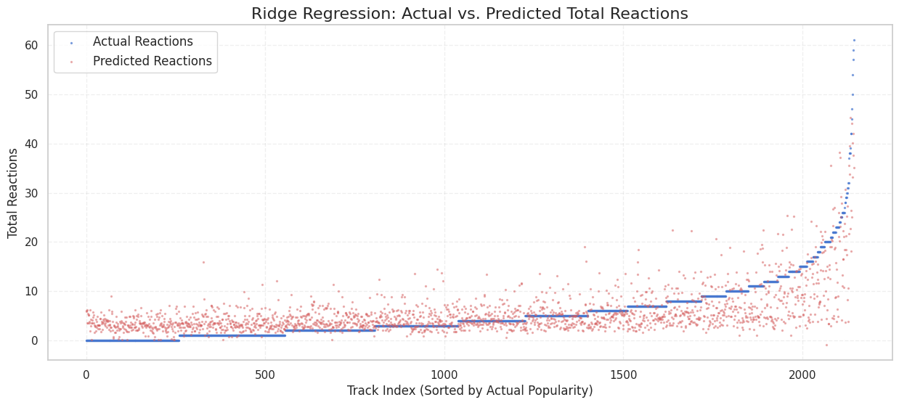
    


*The behavior of the model is much more like normal linear regression than to increased parameter one.*

#### Effect of regularization coefficient
**Let's check the behavior of the model according to alpha:**


```python
alpha_list = [0.000001,.0001,.0005,.001,.005,0.01,.1,1]
scores = []
for alpha in alpha_list:
  model = Ridge(alpha=alpha)
  model.fit(X_train, y_train)
  predicted_value = model.predict(X_test)
  r2_test = r2_score(y_test, predicted_value)
  scores.append(r2_test)

plt.figure(figsize=(20, 8))
plt.plot(alpha_list, scores, marker='o', linewidth=2, color='b')

# 1. Change X-axis to a logarithmic scale (fixes the squishing issue)
plt.xscale('log')

# 2. Force the X-axis ticks to match your exact alpha values
plt.xticks(alpha_list, labels=[str(a) for a in alpha_list], fontsize=12)
plt.yticks(fontsize=12)

plt.xlabel('Alpha (Regularization Strength)', fontsize=16, labelpad=10)
plt.ylabel('$R^2$ Score (Test Data)', fontsize=16, labelpad=10)
plt.title('Ridge Regression: $R^2$ Score vs. Alpha Hyperparameter', fontsize=18, pad=15)
plt.grid(True, which="both", linestyle='--', alpha=0.5)

plt.show()
```


    
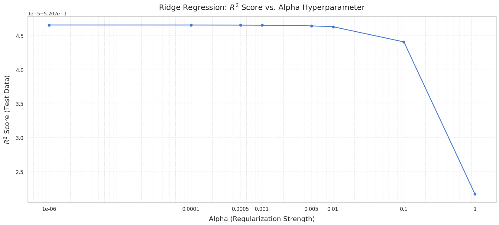
    


**As we can see we can select `0.01` or `0.1` as our optimal alpha**.

#### Ridge Regression with polynomial parameters:

Let's also test the Ridge Regression with our previous `k=140` parameters and notice the result


```python
selector = SelectKBest(mutual_info_regression, k = 140)
selector.fit(X_train_transformed_poly, y_train)
X_train_transformed = selector.transform(X_train_transformed_poly)
X_test_transform = selector.transform(X_test_transformed_poly)

# --- Ridge Regression -with k=140 ---
ridge_cv = GridSearchCV(Ridge(), param_grid={'alpha': [0.01, 0.1, 1.0, 10.0, 100.0]}, cv=5)
ridge_cv.fit(X_train_transformed, y_train)
```


<style>#sk-container-id-4 {
  /* Definition of color scheme common for light and dark mode */
  --sklearn-color-text: #000;
  --sklearn-color-text-muted: #666;
  --sklearn-color-line: gray;
  /* Definition of color scheme for unfitted estimators */
  --sklearn-color-unfitted-level-0: #fff5e6;
  --sklearn-color-unfitted-level-1: #f6e4d2;
  --sklearn-color-unfitted-level-2: #ffe0b3;
  --sklearn-color-unfitted-level-3: chocolate;
  /* Definition of color scheme for fitted estimators */
  --sklearn-color-fitted-level-0: #f0f8ff;
  --sklearn-color-fitted-level-1: #d4ebff;
  --sklearn-color-fitted-level-2: #b3dbfd;
  --sklearn-color-fitted-level-3: cornflowerblue;
}

#sk-container-id-4.light {
  /* Specific color for light theme */
  --sklearn-color-text-on-default-background: black;
  --sklearn-color-background: white;
  --sklearn-color-border-box: black;
  --sklearn-color-icon: #696969;
}

#sk-container-id-4.dark {
  --sklearn-color-text-on-default-background: white;
  --sklearn-color-background: #111;
  --sklearn-color-border-box: white;
  --sklearn-color-icon: #878787;
}

#sk-container-id-4 {
  color: var(--sklearn-color-text);
}

#sk-container-id-4 pre {
  padding: 0;
}

#sk-container-id-4 input.sk-hidden--visually {
  border: 0;
  clip: rect(1px 1px 1px 1px);
  clip: rect(1px, 1px, 1px, 1px);
  height: 1px;
  margin: -1px;
  overflow: hidden;
  padding: 0;
  position: absolute;
  width: 1px;
}

#sk-container-id-4 div.sk-dashed-wrapped {
  border: 1px dashed var(--sklearn-color-line);
  margin: 0 0.4em 0.5em 0.4em;
  box-sizing: border-box;
  padding-bottom: 0.4em;
  background-color: var(--sklearn-color-background);
}

#sk-container-id-4 div.sk-container {
  /* jupyter's `normalize.less` sets `[hidden] { display: none; }`
     but bootstrap.min.css set `[hidden] { display: none !important; }`
     so we also need the `!important` here to be able to override the
     default hidden behavior on the sphinx rendered scikit-learn.org.
     See: https://github.com/scikit-learn/scikit-learn/issues/21755 */
  display: inline-block !important;
  position: relative;
}

#sk-container-id-4 div.sk-text-repr-fallback {
  display: none;
}

div.sk-parallel-item,
div.sk-serial,
div.sk-item {
  /* draw centered vertical line to link estimators */
  background-image: linear-gradient(var(--sklearn-color-text-on-default-background), var(--sklearn-color-text-on-default-background));
  background-size: 2px 100%;
  background-repeat: no-repeat;
  background-position: center center;
}

/* Parallel-specific style estimator block */

#sk-container-id-4 div.sk-parallel-item::after {
  content: "";
  width: 100%;
  border-bottom: 2px solid var(--sklearn-color-text-on-default-background);
  flex-grow: 1;
}

#sk-container-id-4 div.sk-parallel {
  display: flex;
  align-items: stretch;
  justify-content: center;
  background-color: var(--sklearn-color-background);
  position: relative;
}

#sk-container-id-4 div.sk-parallel-item {
  display: flex;
  flex-direction: column;
}

#sk-container-id-4 div.sk-parallel-item:first-child::after {
  align-self: flex-end;
  width: 50%;
}

#sk-container-id-4 div.sk-parallel-item:last-child::after {
  align-self: flex-start;
  width: 50%;
}

#sk-container-id-4 div.sk-parallel-item:only-child::after {
  width: 0;
}

/* Serial-specific style estimator block */

#sk-container-id-4 div.sk-serial {
  display: flex;
  flex-direction: column;
  align-items: center;
  background-color: var(--sklearn-color-background);
  padding-right: 1em;
  padding-left: 1em;
}


/* Toggleable style: style used for estimator/Pipeline/ColumnTransformer box that is
clickable and can be expanded/collapsed.
- Pipeline and ColumnTransformer use this feature and define the default style
- Estimators will overwrite some part of the style using the `sk-estimator` class
*/

/* Pipeline and ColumnTransformer style (default) */

#sk-container-id-4 div.sk-toggleable {
  /* Default theme specific background. It is overwritten whether we have a
  specific estimator or a Pipeline/ColumnTransformer */
  background-color: var(--sklearn-color-background);
}

/* Toggleable label */
#sk-container-id-4 label.sk-toggleable__label {
  cursor: pointer;
  display: flex;
  width: 100%;
  margin-bottom: 0;
  padding: 0.5em;
  box-sizing: border-box;
  text-align: center;
  align-items: center;
  justify-content: center;
  gap: 0.5em;
}

#sk-container-id-4 label.sk-toggleable__label .caption {
  font-size: 0.6rem;
  font-weight: lighter;
  color: var(--sklearn-color-text-muted);
}

#sk-container-id-4 label.sk-toggleable__label-arrow:before {
  /* Arrow on the left of the label */
  content: "▸";
  float: left;
  margin-right: 0.25em;
  color: var(--sklearn-color-icon);
}

#sk-container-id-4 label.sk-toggleable__label-arrow:hover:before {
  color: var(--sklearn-color-text);
}

/* Toggleable content - dropdown */

#sk-container-id-4 div.sk-toggleable__content {
  display: none;
  text-align: left;
  /* unfitted */
  background-color: var(--sklearn-color-unfitted-level-0);
}

#sk-container-id-4 div.sk-toggleable__content.fitted {
  /* fitted */
  background-color: var(--sklearn-color-fitted-level-0);
}

#sk-container-id-4 div.sk-toggleable__content pre {
  margin: 0.2em;
  border-radius: 0.25em;
  color: var(--sklearn-color-text);
  /* unfitted */
  background-color: var(--sklearn-color-unfitted-level-0);
}

#sk-container-id-4 div.sk-toggleable__content.fitted pre {
  /* unfitted */
  background-color: var(--sklearn-color-fitted-level-0);
}

#sk-container-id-4 input.sk-toggleable__control:checked~div.sk-toggleable__content {
  /* Expand drop-down */
  display: block;
  width: 100%;
  overflow: visible;
}

#sk-container-id-4 input.sk-toggleable__control:checked~label.sk-toggleable__label-arrow:before {
  content: "▾";
}

/* Pipeline/ColumnTransformer-specific style */

#sk-container-id-4 div.sk-label input.sk-toggleable__control:checked~label.sk-toggleable__label {
  color: var(--sklearn-color-text);
  background-color: var(--sklearn-color-unfitted-level-2);
}

#sk-container-id-4 div.sk-label.fitted input.sk-toggleable__control:checked~label.sk-toggleable__label {
  background-color: var(--sklearn-color-fitted-level-2);
}

/* Estimator-specific style */

/* Colorize estimator box */
#sk-container-id-4 div.sk-estimator input.sk-toggleable__control:checked~label.sk-toggleable__label {
  /* unfitted */
  background-color: var(--sklearn-color-unfitted-level-2);
}

#sk-container-id-4 div.sk-estimator.fitted input.sk-toggleable__control:checked~label.sk-toggleable__label {
  /* fitted */
  background-color: var(--sklearn-color-fitted-level-2);
}

#sk-container-id-4 div.sk-label label.sk-toggleable__label,
#sk-container-id-4 div.sk-label label {
  /* The background is the default theme color */
  color: var(--sklearn-color-text-on-default-background);
}

/* On hover, darken the color of the background */
#sk-container-id-4 div.sk-label:hover label.sk-toggleable__label {
  color: var(--sklearn-color-text);
  background-color: var(--sklearn-color-unfitted-level-2);
}

/* Label box, darken color on hover, fitted */
#sk-container-id-4 div.sk-label.fitted:hover label.sk-toggleable__label.fitted {
  color: var(--sklearn-color-text);
  background-color: var(--sklearn-color-fitted-level-2);
}

/* Estimator label */

#sk-container-id-4 div.sk-label label {
  font-family: monospace;
  font-weight: bold;
  line-height: 1.2em;
}

#sk-container-id-4 div.sk-label-container {
  text-align: center;
}

/* Estimator-specific */
#sk-container-id-4 div.sk-estimator {
  font-family: monospace;
  border: 1px dotted var(--sklearn-color-border-box);
  border-radius: 0.25em;
  box-sizing: border-box;
  margin-bottom: 0.5em;
  /* unfitted */
  background-color: var(--sklearn-color-unfitted-level-0);
}

#sk-container-id-4 div.sk-estimator.fitted {
  /* fitted */
  background-color: var(--sklearn-color-fitted-level-0);
}

/* on hover */
#sk-container-id-4 div.sk-estimator:hover {
  /* unfitted */
  background-color: var(--sklearn-color-unfitted-level-2);
}

#sk-container-id-4 div.sk-estimator.fitted:hover {
  /* fitted */
  background-color: var(--sklearn-color-fitted-level-2);
}

/* Specification for estimator info (e.g. "i" and "?") */

/* Common style for "i" and "?" */

.sk-estimator-doc-link,
a:link.sk-estimator-doc-link,
a:visited.sk-estimator-doc-link {
  float: right;
  font-size: smaller;
  line-height: 1em;
  font-family: monospace;
  background-color: var(--sklearn-color-unfitted-level-0);
  border-radius: 1em;
  height: 1em;
  width: 1em;
  text-decoration: none !important;
  margin-left: 0.5em;
  text-align: center;
  /* unfitted */
  border: var(--sklearn-color-unfitted-level-3) 1pt solid;
  color: var(--sklearn-color-unfitted-level-3);
}

.sk-estimator-doc-link.fitted,
a:link.sk-estimator-doc-link.fitted,
a:visited.sk-estimator-doc-link.fitted {
  /* fitted */
  background-color: var(--sklearn-color-fitted-level-0);
  border: var(--sklearn-color-fitted-level-3) 1pt solid;
  color: var(--sklearn-color-fitted-level-3);
}

/* On hover */
div.sk-estimator:hover .sk-estimator-doc-link:hover,
.sk-estimator-doc-link:hover,
div.sk-label-container:hover .sk-estimator-doc-link:hover,
.sk-estimator-doc-link:hover {
  /* unfitted */
  background-color: var(--sklearn-color-unfitted-level-3);
  border: var(--sklearn-color-fitted-level-0) 1pt solid;
  color: var(--sklearn-color-unfitted-level-0);
  text-decoration: none;
}

div.sk-estimator.fitted:hover .sk-estimator-doc-link.fitted:hover,
.sk-estimator-doc-link.fitted:hover,
div.sk-label-container:hover .sk-estimator-doc-link.fitted:hover,
.sk-estimator-doc-link.fitted:hover {
  /* fitted */
  background-color: var(--sklearn-color-fitted-level-3);
  border: var(--sklearn-color-fitted-level-0) 1pt solid;
  color: var(--sklearn-color-fitted-level-0);
  text-decoration: none;
}

/* Span, style for the box shown on hovering the info icon */
.sk-estimator-doc-link span {
  display: none;
  z-index: 9999;
  position: relative;
  font-weight: normal;
  right: .2ex;
  padding: .5ex;
  margin: .5ex;
  width: min-content;
  min-width: 20ex;
  max-width: 50ex;
  color: var(--sklearn-color-text);
  box-shadow: 2pt 2pt 4pt #999;
  /* unfitted */
  background: var(--sklearn-color-unfitted-level-0);
  border: .5pt solid var(--sklearn-color-unfitted-level-3);
}

.sk-estimator-doc-link.fitted span {
  /* fitted */
  background: var(--sklearn-color-fitted-level-0);
  border: var(--sklearn-color-fitted-level-3);
}

.sk-estimator-doc-link:hover span {
  display: block;
}

/* "?"-specific style due to the `<a>` HTML tag */

#sk-container-id-4 a.estimator_doc_link {
  float: right;
  font-size: 1rem;
  line-height: 1em;
  font-family: monospace;
  background-color: var(--sklearn-color-unfitted-level-0);
  border-radius: 1rem;
  height: 1rem;
  width: 1rem;
  text-decoration: none;
  /* unfitted */
  color: var(--sklearn-color-unfitted-level-1);
  border: var(--sklearn-color-unfitted-level-1) 1pt solid;
}

#sk-container-id-4 a.estimator_doc_link.fitted {
  /* fitted */
  background-color: var(--sklearn-color-fitted-level-0);
  border: var(--sklearn-color-fitted-level-1) 1pt solid;
  color: var(--sklearn-color-fitted-level-1);
}

/* On hover */
#sk-container-id-4 a.estimator_doc_link:hover {
  /* unfitted */
  background-color: var(--sklearn-color-unfitted-level-3);
  color: var(--sklearn-color-background);
  text-decoration: none;
}

#sk-container-id-4 a.estimator_doc_link.fitted:hover {
  /* fitted */
  background-color: var(--sklearn-color-fitted-level-3);
}

.estimator-table {
    font-family: monospace;
}

.estimator-table summary {
    padding: .5rem;
    cursor: pointer;
}

.estimator-table summary::marker {
    font-size: 0.7rem;
}

.estimator-table details[open] {
    padding-left: 0.1rem;
    padding-right: 0.1rem;
    padding-bottom: 0.3rem;
}

.estimator-table .parameters-table {
    margin-left: auto !important;
    margin-right: auto !important;
    margin-top: 0;
}

.estimator-table .parameters-table tr:nth-child(odd) {
    background-color: #fff;
}

.estimator-table .parameters-table tr:nth-child(even) {
    background-color: #f6f6f6;
}

.estimator-table .parameters-table tr:hover {
    background-color: #e0e0e0;
}

.estimator-table table td {
    border: 1px solid rgba(106, 105, 104, 0.232);
}

/*
    `table td`is set in notebook with right text-align.
    We need to overwrite it.
*/
.estimator-table table td.param {
    text-align: left;
    position: relative;
    padding: 0;
}

.user-set td {
    color:rgb(255, 94, 0);
    text-align: left !important;
}

.user-set td.value {
    color:rgb(255, 94, 0);
    background-color: transparent;
}

.default td {
    color: black;
    text-align: left !important;
}

.user-set td i,
.default td i {
    color: black;
}

/*
    Styles for parameter documentation links
    We need styling for visited so jupyter doesn't overwrite it
*/
a.param-doc-link,
a.param-doc-link:link,
a.param-doc-link:visited {
    text-decoration: underline dashed;
    text-underline-offset: .3em;
    color: inherit;
    display: block;
    padding: .5em;
}

/* "hack" to make the entire area of the cell containing the link clickable */
a.param-doc-link::before {
    position: absolute;
    content: "";
    inset: 0;
}

.param-doc-description {
    display: none;
    position: absolute;
    z-index: 9999;
    left: 0;
    padding: .5ex;
    margin-left: 1.5em;
    color: var(--sklearn-color-text);
    box-shadow: .3em .3em .4em #999;
    width: max-content;
    text-align: left;
    max-height: 10em;
    overflow-y: auto;

    /* unfitted */
    background: var(--sklearn-color-unfitted-level-0);
    border: thin solid var(--sklearn-color-unfitted-level-3);
}

/* Fitted state for parameter tooltips */
.fitted .param-doc-description {
    /* fitted */
    background: var(--sklearn-color-fitted-level-0);
    border: thin solid var(--sklearn-color-fitted-level-3);
}

.param-doc-link:hover .param-doc-description {
    display: block;
}

.copy-paste-icon {
    background-image: url();
    background-repeat: no-repeat;
    background-size: 14px 14px;
    background-position: 0;
    display: inline-block;
    width: 14px;
    height: 14px;
    cursor: pointer;
}
</style><body><div id="sk-container-id-4" class="sk-top-container"><div class="sk-text-repr-fallback"><pre>GridSearchCV(cv=5, estimator=Ridge(),
             param_grid={&#x27;alpha&#x27;: [0.01, 0.1, 1.0, 10.0, 100.0]})</pre><b>In a Jupyter environment, please rerun this cell to show the HTML representation or trust the notebook. <br />On GitHub, the HTML representation is unable to render, please try loading this page with nbviewer.org.</b></div><div class="sk-container" hidden><div class="sk-item sk-dashed-wrapped"><div class="sk-label-container"><div class="sk-label fitted sk-toggleable"><input class="sk-toggleable__control sk-hidden--visually" id="sk-estimator-id-6" type="checkbox" ><label for="sk-estimator-id-6" class="sk-toggleable__label fitted sk-toggleable__label-arrow"><div><div>GridSearchCV</div></div><div><a class="sk-estimator-doc-link fitted" rel="noreferrer" target="_blank" href="https://scikit-learn.org/1.8/modules/generated/sklearn.model_selection.GridSearchCV.html">?<span>Documentation for GridSearchCV</span></a><span class="sk-estimator-doc-link fitted">i<span>Fitted</span></span></div></label><div class="sk-toggleable__content fitted" data-param-prefix="">
        <div class="estimator-table">
            <details>
                <summary>Parameters</summary>
                <table class="parameters-table">
                  <tbody>

        <tr class="user-set">
            <td><i class="copy-paste-icon"
                 onclick="copyToClipboard('estimator',
                          this.parentElement.nextElementSibling)"
            ></i></td>
            <td class="param">
        <a class="param-doc-link"
            rel="noreferrer" target="_blank" href="https://scikit-learn.org/1.8/modules/generated/sklearn.model_selection.GridSearchCV.html#:~:text=estimator,-estimator%20object">
            estimator
            <span class="param-doc-description">estimator: estimator object<br><br>This is assumed to implement the scikit-learn estimator interface.<br>Either estimator needs to provide a ``score`` function,<br>or ``scoring`` must be passed.</span>
        </a>
    </td>
            <td class="value">Ridge()</td>
        </tr>


        <tr class="user-set">
            <td><i class="copy-paste-icon"
                 onclick="copyToClipboard('param_grid',
                          this.parentElement.nextElementSibling)"
            ></i></td>
            <td class="param">
        <a class="param-doc-link"
            rel="noreferrer" target="_blank" href="https://scikit-learn.org/1.8/modules/generated/sklearn.model_selection.GridSearchCV.html#:~:text=param_grid,-dict%20or%20list%20of%20dictionaries">
            param_grid
            <span class="param-doc-description">param_grid: dict or list of dictionaries<br><br>Dictionary with parameters names (`str`) as keys and lists of<br>parameter settings to try as values, or a list of such<br>dictionaries, in which case the grids spanned by each dictionary<br>in the list are explored. This enables searching over any sequence<br>of parameter settings.</span>
        </a>
    </td>
            <td class="value">{&#x27;alpha&#x27;: [0.01, 0.1, ...]}</td>
        </tr>


        <tr class="default">
            <td><i class="copy-paste-icon"
                 onclick="copyToClipboard('scoring',
                          this.parentElement.nextElementSibling)"
            ></i></td>
            <td class="param">
        <a class="param-doc-link"
            rel="noreferrer" target="_blank" href="https://scikit-learn.org/1.8/modules/generated/sklearn.model_selection.GridSearchCV.html#:~:text=scoring,-str%2C%20callable%2C%20list%2C%20tuple%20or%20dict%2C%20default%3DNone">
            scoring
            <span class="param-doc-description">scoring: str, callable, list, tuple or dict, default=None<br><br>Strategy to evaluate the performance of the cross-validated model on<br>the test set.<br><br>If `scoring` represents a single score, one can use:<br><br>- a single string (see :ref:`scoring_string_names`);<br>- a callable (see :ref:`scoring_callable`) that returns a single value;<br>- `None`, the `estimator`'s<br>  :ref:`default evaluation criterion <scoring_api_overview>` is used.<br><br>If `scoring` represents multiple scores, one can use:<br><br>- a list or tuple of unique strings;<br>- a callable returning a dictionary where the keys are the metric<br>  names and the values are the metric scores;<br>- a dictionary with metric names as keys and callables as values.<br><br>See :ref:`multimetric_grid_search` for an example.</span>
        </a>
    </td>
            <td class="value">None</td>
        </tr>


        <tr class="default">
            <td><i class="copy-paste-icon"
                 onclick="copyToClipboard('n_jobs',
                          this.parentElement.nextElementSibling)"
            ></i></td>
            <td class="param">
        <a class="param-doc-link"
            rel="noreferrer" target="_blank" href="https://scikit-learn.org/1.8/modules/generated/sklearn.model_selection.GridSearchCV.html#:~:text=n_jobs,-int%2C%20default%3DNone">
            n_jobs
            <span class="param-doc-description">n_jobs: int, default=None<br><br>Number of jobs to run in parallel.<br>``None`` means 1 unless in a :obj:`joblib.parallel_backend` context.<br>``-1`` means using all processors. See :term:`Glossary <n_jobs>`<br>for more details.<br><br>.. versionchanged:: v0.20<br>   `n_jobs` default changed from 1 to None</span>
        </a>
    </td>
            <td class="value">None</td>
        </tr>


        <tr class="default">
            <td><i class="copy-paste-icon"
                 onclick="copyToClipboard('refit',
                          this.parentElement.nextElementSibling)"
            ></i></td>
            <td class="param">
        <a class="param-doc-link"
            rel="noreferrer" target="_blank" href="https://scikit-learn.org/1.8/modules/generated/sklearn.model_selection.GridSearchCV.html#:~:text=refit,-bool%2C%20str%2C%20or%20callable%2C%20default%3DTrue">
            refit
            <span class="param-doc-description">refit: bool, str, or callable, default=True<br><br>Refit an estimator using the best found parameters on the whole<br>dataset.<br><br>For multiple metric evaluation, this needs to be a `str` denoting the<br>scorer that would be used to find the best parameters for refitting<br>the estimator at the end.<br><br>Where there are considerations other than maximum score in<br>choosing a best estimator, ``refit`` can be set to a function which<br>returns the selected ``best_index_`` given ``cv_results_``. In that<br>case, the ``best_estimator_`` and ``best_params_`` will be set<br>according to the returned ``best_index_`` while the ``best_score_``<br>attribute will not be available.<br><br>The refitted estimator is made available at the ``best_estimator_``<br>attribute and permits using ``predict`` directly on this<br>``GridSearchCV`` instance.<br><br>Also for multiple metric evaluation, the attributes ``best_index_``,<br>``best_score_`` and ``best_params_`` will only be available if<br>``refit`` is set and all of them will be determined w.r.t this specific<br>scorer.<br><br>See ``scoring`` parameter to know more about multiple metric<br>evaluation.<br><br>See :ref:`sphx_glr_auto_examples_model_selection_plot_grid_search_digits.py`<br>to see how to design a custom selection strategy using a callable<br>via `refit`.<br><br>See :ref:`this example<br><sphx_glr_auto_examples_model_selection_plot_grid_search_refit_callable.py>`<br>for an example of how to use ``refit=callable`` to balance model<br>complexity and cross-validated score.<br><br>.. versionchanged:: 0.20<br>    Support for callable added.</span>
        </a>
    </td>
            <td class="value">True</td>
        </tr>


        <tr class="user-set">
            <td><i class="copy-paste-icon"
                 onclick="copyToClipboard('cv',
                          this.parentElement.nextElementSibling)"
            ></i></td>
            <td class="param">
        <a class="param-doc-link"
            rel="noreferrer" target="_blank" href="https://scikit-learn.org/1.8/modules/generated/sklearn.model_selection.GridSearchCV.html#:~:text=cv,-int%2C%20cross-validation%20generator%20or%20an%20iterable%2C%20default%3DNone">
            cv
            <span class="param-doc-description">cv: int, cross-validation generator or an iterable, default=None<br><br>Determines the cross-validation splitting strategy.<br>Possible inputs for cv are:<br><br>- None, to use the default 5-fold cross validation,<br>- integer, to specify the number of folds in a `(Stratified)KFold`,<br>- :term:`CV splitter`,<br>- An iterable yielding (train, test) splits as arrays of indices.<br><br>For integer/None inputs, if the estimator is a classifier and ``y`` is<br>either binary or multiclass, :class:`StratifiedKFold` is used. In all<br>other cases, :class:`KFold` is used. These splitters are instantiated<br>with `shuffle=False` so the splits will be the same across calls.<br><br>Refer :ref:`User Guide <cross_validation>` for the various<br>cross-validation strategies that can be used here.<br><br>.. versionchanged:: 0.22<br>    ``cv`` default value if None changed from 3-fold to 5-fold.</span>
        </a>
    </td>
            <td class="value">5</td>
        </tr>


        <tr class="default">
            <td><i class="copy-paste-icon"
                 onclick="copyToClipboard('verbose',
                          this.parentElement.nextElementSibling)"
            ></i></td>
            <td class="param">
        <a class="param-doc-link"
            rel="noreferrer" target="_blank" href="https://scikit-learn.org/1.8/modules/generated/sklearn.model_selection.GridSearchCV.html#:~:text=verbose,-int">
            verbose
            <span class="param-doc-description">verbose: int<br><br>Controls the verbosity: the higher, the more messages.<br><br>- >1 : the computation time for each fold and parameter candidate is<br>  displayed;<br>- >2 : the score is also displayed;<br>- >3 : the fold and candidate parameter indexes are also displayed<br>  together with the starting time of the computation.</span>
        </a>
    </td>
            <td class="value">0</td>
        </tr>


        <tr class="default">
            <td><i class="copy-paste-icon"
                 onclick="copyToClipboard('pre_dispatch',
                          this.parentElement.nextElementSibling)"
            ></i></td>
            <td class="param">
        <a class="param-doc-link"
            rel="noreferrer" target="_blank" href="https://scikit-learn.org/1.8/modules/generated/sklearn.model_selection.GridSearchCV.html#:~:text=pre_dispatch,-int%2C%20or%20str%2C%20default%3D%272%2An_jobs%27">
            pre_dispatch
            <span class="param-doc-description">pre_dispatch: int, or str, default='2*n_jobs'<br><br>Controls the number of jobs that get dispatched during parallel<br>execution. Reducing this number can be useful to avoid an<br>explosion of memory consumption when more jobs get dispatched<br>than CPUs can process. This parameter can be:<br><br>- None, in which case all the jobs are immediately created and spawned. Use<br>  this for lightweight and fast-running jobs, to avoid delays due to on-demand<br>  spawning of the jobs<br>- An int, giving the exact number of total jobs that are spawned<br>- A str, giving an expression as a function of n_jobs, as in '2*n_jobs'</span>
        </a>
    </td>
            <td class="value">&#x27;2*n_jobs&#x27;</td>
        </tr>


        <tr class="default">
            <td><i class="copy-paste-icon"
                 onclick="copyToClipboard('error_score',
                          this.parentElement.nextElementSibling)"
            ></i></td>
            <td class="param">
        <a class="param-doc-link"
            rel="noreferrer" target="_blank" href="https://scikit-learn.org/1.8/modules/generated/sklearn.model_selection.GridSearchCV.html#:~:text=error_score,-%27raise%27%20or%20numeric%2C%20default%3Dnp.nan">
            error_score
            <span class="param-doc-description">error_score: 'raise' or numeric, default=np.nan<br><br>Value to assign to the score if an error occurs in estimator fitting.<br>If set to 'raise', the error is raised. If a numeric value is given,<br>FitFailedWarning is raised. This parameter does not affect the refit<br>step, which will always raise the error.</span>
        </a>
    </td>
            <td class="value">nan</td>
        </tr>


        <tr class="default">
            <td><i class="copy-paste-icon"
                 onclick="copyToClipboard('return_train_score',
                          this.parentElement.nextElementSibling)"
            ></i></td>
            <td class="param">
        <a class="param-doc-link"
            rel="noreferrer" target="_blank" href="https://scikit-learn.org/1.8/modules/generated/sklearn.model_selection.GridSearchCV.html#:~:text=return_train_score,-bool%2C%20default%3DFalse">
            return_train_score
            <span class="param-doc-description">return_train_score: bool, default=False<br><br>If ``False``, the ``cv_results_`` attribute will not include training<br>scores.<br>Computing training scores is used to get insights on how different<br>parameter settings impact the overfitting/underfitting trade-off.<br>However computing the scores on the training set can be computationally<br>expensive and is not strictly required to select the parameters that<br>yield the best generalization performance.<br><br>.. versionadded:: 0.19<br><br>.. versionchanged:: 0.21<br>    Default value was changed from ``True`` to ``False``</span>
        </a>
    </td>
            <td class="value">False</td>
        </tr>

                  </tbody>
                </table>
            </details>
        </div>
    </div></div></div><div class="sk-parallel"><div class="sk-parallel-item"><div class="sk-item"><div class="sk-label-container"><div class="sk-label fitted sk-toggleable"><input class="sk-toggleable__control sk-hidden--visually" id="sk-estimator-id-7" type="checkbox" ><label for="sk-estimator-id-7" class="sk-toggleable__label fitted sk-toggleable__label-arrow"><div><div>best_estimator_: Ridge</div></div></label><div class="sk-toggleable__content fitted" data-param-prefix="best_estimator___"><pre>Ridge(alpha=0.01)</pre></div></div></div><div class="sk-serial"><div class="sk-item"><div class="sk-estimator fitted sk-toggleable"><input class="sk-toggleable__control sk-hidden--visually" id="sk-estimator-id-8" type="checkbox" ><label for="sk-estimator-id-8" class="sk-toggleable__label fitted sk-toggleable__label-arrow"><div><div>Ridge</div></div><div><a class="sk-estimator-doc-link fitted" rel="noreferrer" target="_blank" href="https://scikit-learn.org/1.8/modules/generated/sklearn.linear_model.Ridge.html">?<span>Documentation for Ridge</span></a></div></label><div class="sk-toggleable__content fitted" data-param-prefix="best_estimator___">
        <div class="estimator-table">
            <details>
                <summary>Parameters</summary>
                <table class="parameters-table">
                  <tbody>

        <tr class="user-set">
            <td><i class="copy-paste-icon"
                 onclick="copyToClipboard('alpha',
                          this.parentElement.nextElementSibling)"
            ></i></td>
            <td class="param">
        <a class="param-doc-link"
            rel="noreferrer" target="_blank" href="https://scikit-learn.org/1.8/modules/generated/sklearn.linear_model.Ridge.html#:~:text=alpha,-%7Bfloat%2C%20ndarray%20of%20shape%20%28n_targets%2C%29%7D%2C%20default%3D1.0">
            alpha
            <span class="param-doc-description">alpha: {float, ndarray of shape (n_targets,)}, default=1.0<br><br>Constant that multiplies the L2 term, controlling regularization<br>strength. `alpha` must be a non-negative float i.e. in `[0, inf)`.<br><br>When `alpha = 0`, the objective is equivalent to ordinary least<br>squares, solved by the :class:`LinearRegression` object. For numerical<br>reasons, using `alpha = 0` with the `Ridge` object is not advised.<br>Instead, you should use the :class:`LinearRegression` object.<br><br>If an array is passed, penalties are assumed to be specific to the<br>targets. Hence they must correspond in number.</span>
        </a>
    </td>
            <td class="value">0.01</td>
        </tr>


        <tr class="default">
            <td><i class="copy-paste-icon"
                 onclick="copyToClipboard('fit_intercept',
                          this.parentElement.nextElementSibling)"
            ></i></td>
            <td class="param">
        <a class="param-doc-link"
            rel="noreferrer" target="_blank" href="https://scikit-learn.org/1.8/modules/generated/sklearn.linear_model.Ridge.html#:~:text=fit_intercept,-bool%2C%20default%3DTrue">
            fit_intercept
            <span class="param-doc-description">fit_intercept: bool, default=True<br><br>Whether to fit the intercept for this model. If set<br>to false, no intercept will be used in calculations<br>(i.e. ``X`` and ``y`` are expected to be centered).</span>
        </a>
    </td>
            <td class="value">True</td>
        </tr>


        <tr class="default">
            <td><i class="copy-paste-icon"
                 onclick="copyToClipboard('copy_X',
                          this.parentElement.nextElementSibling)"
            ></i></td>
            <td class="param">
        <a class="param-doc-link"
            rel="noreferrer" target="_blank" href="https://scikit-learn.org/1.8/modules/generated/sklearn.linear_model.Ridge.html#:~:text=copy_X,-bool%2C%20default%3DTrue">
            copy_X
            <span class="param-doc-description">copy_X: bool, default=True<br><br>If True, X will be copied; else, it may be overwritten.</span>
        </a>
    </td>
            <td class="value">True</td>
        </tr>


        <tr class="default">
            <td><i class="copy-paste-icon"
                 onclick="copyToClipboard('max_iter',
                          this.parentElement.nextElementSibling)"
            ></i></td>
            <td class="param">
        <a class="param-doc-link"
            rel="noreferrer" target="_blank" href="https://scikit-learn.org/1.8/modules/generated/sklearn.linear_model.Ridge.html#:~:text=max_iter,-int%2C%20default%3DNone">
            max_iter
            <span class="param-doc-description">max_iter: int, default=None<br><br>Maximum number of iterations for conjugate gradient solver.<br>For 'sparse_cg' and 'lsqr' solvers, the default value is determined<br>by scipy.sparse.linalg. For 'sag' solver, the default value is 1000.<br>For 'lbfgs' solver, the default value is 15000.</span>
        </a>
    </td>
            <td class="value">None</td>
        </tr>


        <tr class="default">
            <td><i class="copy-paste-icon"
                 onclick="copyToClipboard('tol',
                          this.parentElement.nextElementSibling)"
            ></i></td>
            <td class="param">
        <a class="param-doc-link"
            rel="noreferrer" target="_blank" href="https://scikit-learn.org/1.8/modules/generated/sklearn.linear_model.Ridge.html#:~:text=tol,-float%2C%20default%3D1e-4">
            tol
            <span class="param-doc-description">tol: float, default=1e-4<br><br>The precision of the solution (`coef_`) is determined by `tol` which<br>specifies a different convergence criterion for each solver:<br><br>- 'svd': `tol` has no impact.<br><br>- 'cholesky': `tol` has no impact.<br><br>- 'sparse_cg': norm of residuals smaller than `tol`.<br><br>- 'lsqr': `tol` is set as atol and btol of scipy.sparse.linalg.lsqr,<br>  which control the norm of the residual vector in terms of the norms of<br>  matrix and coefficients.<br><br>- 'sag' and 'saga': relative change of coef smaller than `tol`.<br><br>- 'lbfgs': maximum of the absolute (projected) gradient=max|residuals|<br>  smaller than `tol`.<br><br>.. versionchanged:: 1.2<br>   Default value changed from 1e-3 to 1e-4 for consistency with other linear<br>   models.</span>
        </a>
    </td>
            <td class="value">0.0001</td>
        </tr>


        <tr class="default">
            <td><i class="copy-paste-icon"
                 onclick="copyToClipboard('solver',
                          this.parentElement.nextElementSibling)"
            ></i></td>
            <td class="param">
        <a class="param-doc-link"
            rel="noreferrer" target="_blank" href="https://scikit-learn.org/1.8/modules/generated/sklearn.linear_model.Ridge.html#:~:text=solver,-%7B%27auto%27%2C%20%27svd%27%2C%20%27cholesky%27%2C%20%27lsqr%27%2C%20%27sparse_cg%27%2C%20%20%20%20%20%20%20%20%20%20%20%20%20%27sag%27%2C%20%27saga%27%2C%20%27lbfgs%27%7D%2C%20default%3D%27auto%27">
            solver
            <span class="param-doc-description">solver: {'auto', 'svd', 'cholesky', 'lsqr', 'sparse_cg',             'sag', 'saga', 'lbfgs'}, default='auto'<br><br>Solver to use in the computational routines:<br><br>- 'auto' chooses the solver automatically based on the type of data.<br><br>- 'svd' uses a Singular Value Decomposition of X to compute the Ridge<br>  coefficients. It is the most stable solver, in particular more stable<br>  for singular matrices than 'cholesky' at the cost of being slower.<br><br>- 'cholesky' uses the standard :func:`scipy.linalg.solve` function to<br>  obtain a closed-form solution.<br><br>- 'sparse_cg' uses the conjugate gradient solver as found in<br>  :func:`scipy.sparse.linalg.cg`. As an iterative algorithm, this solver is<br>  more appropriate than 'cholesky' for large-scale data<br>  (possibility to set `tol` and `max_iter`).<br><br>- 'lsqr' uses the dedicated regularized least-squares routine<br>  :func:`scipy.sparse.linalg.lsqr`. It is the fastest and uses an iterative<br>  procedure.<br><br>- 'sag' uses a Stochastic Average Gradient descent, and 'saga' uses<br>  its improved, unbiased version named SAGA. Both methods also use an<br>  iterative procedure, and are often faster than other solvers when<br>  both n_samples and n_features are large. Note that 'sag' and<br>  'saga' fast convergence is only guaranteed on features with<br>  approximately the same scale. You can preprocess the data with a<br>  scaler from :mod:`sklearn.preprocessing`.<br><br>- 'lbfgs' uses L-BFGS-B algorithm implemented in<br>  :func:`scipy.optimize.minimize`. It can be used only when `positive`<br>  is True.<br><br>All solvers except 'svd' support both dense and sparse data. However, only<br>'lsqr', 'sag', 'sparse_cg', and 'lbfgs' support sparse input when<br>`fit_intercept` is True.<br><br>.. versionadded:: 0.17<br>   Stochastic Average Gradient descent solver.<br>.. versionadded:: 0.19<br>   SAGA solver.</span>
        </a>
    </td>
            <td class="value">&#x27;auto&#x27;</td>
        </tr>


        <tr class="default">
            <td><i class="copy-paste-icon"
                 onclick="copyToClipboard('positive',
                          this.parentElement.nextElementSibling)"
            ></i></td>
            <td class="param">
        <a class="param-doc-link"
            rel="noreferrer" target="_blank" href="https://scikit-learn.org/1.8/modules/generated/sklearn.linear_model.Ridge.html#:~:text=positive,-bool%2C%20default%3DFalse">
            positive
            <span class="param-doc-description">positive: bool, default=False<br><br>When set to ``True``, forces the coefficients to be positive.<br>Only 'lbfgs' solver is supported in this case.</span>
        </a>
    </td>
            <td class="value">False</td>
        </tr>


        <tr class="default">
            <td><i class="copy-paste-icon"
                 onclick="copyToClipboard('random_state',
                          this.parentElement.nextElementSibling)"
            ></i></td>
            <td class="param">
        <a class="param-doc-link"
            rel="noreferrer" target="_blank" href="https://scikit-learn.org/1.8/modules/generated/sklearn.linear_model.Ridge.html#:~:text=random_state,-int%2C%20RandomState%20instance%2C%20default%3DNone">
            random_state
            <span class="param-doc-description">random_state: int, RandomState instance, default=None<br><br>Used when ``solver`` == 'sag' or 'saga' to shuffle the data.<br>See :term:`Glossary <random_state>` for details.<br><br>.. versionadded:: 0.17<br>   `random_state` to support Stochastic Average Gradient.</span>
        </a>
    </td>
            <td class="value">None</td>
        </tr>

                  </tbody>
                </table>
            </details>
        </div>
    </div></div></div></div></div></div></div></div></div></div><script>function copyToClipboard(text, element) {
    // Get the parameter prefix from the closest toggleable content
    const toggleableContent = element.closest('.sk-toggleable__content');
    const paramPrefix = toggleableContent ? toggleableContent.dataset.paramPrefix : '';
    const fullParamName = paramPrefix ? `${paramPrefix}${text}` : text;

    const originalStyle = element.style;
    const computedStyle = window.getComputedStyle(element);
    const originalWidth = computedStyle.width;
    const originalHTML = element.innerHTML.replace('Copied!', '');

    navigator.clipboard.writeText(fullParamName)
        .then(() => {
            element.style.width = originalWidth;
            element.style.color = 'green';
            element.innerHTML = "Copied!";

            setTimeout(() => {
                element.innerHTML = originalHTML;
                element.style = originalStyle;
            }, 2000);
        })
        .catch(err => {
            console.error('Failed to copy:', err);
            element.style.color = 'red';
            element.innerHTML = "Failed!";
            setTimeout(() => {
                element.innerHTML = originalHTML;
                element.style = originalStyle;
            }, 2000);
        });
    return false;
}

document.querySelectorAll('.copy-paste-icon').forEach(function(element) {
    const toggleableContent = element.closest('.sk-toggleable__content');
    const paramPrefix = toggleableContent ? toggleableContent.dataset.paramPrefix : '';
    const paramName = element.parentElement.nextElementSibling
        .textContent.trim().split(' ')[0];
    const fullParamName = paramPrefix ? `${paramPrefix}${paramName}` : paramName;

    element.setAttribute('title', fullParamName);
});


/**
 * Adapted from Skrub
 * https://github.com/skrub-data/skrub/blob/403466d1d5d4dc76a7ef569b3f8228db59a31dc3/skrub/_reporting/_data/templates/report.js#L789
 * @returns "light" or "dark"
 */
function detectTheme(element) {
    const body = document.querySelector('body');

    // Check VSCode theme
    const themeKindAttr = body.getAttribute('data-vscode-theme-kind');
    const themeNameAttr = body.getAttribute('data-vscode-theme-name');

    if (themeKindAttr && themeNameAttr) {
        const themeKind = themeKindAttr.toLowerCase();
        const themeName = themeNameAttr.toLowerCase();

        if (themeKind.includes("dark") || themeName.includes("dark")) {
            return "dark";
        }
        if (themeKind.includes("light") || themeName.includes("light")) {
            return "light";
        }
    }

    // Check Jupyter theme
    if (body.getAttribute('data-jp-theme-light') === 'false') {
        return 'dark';
    } else if (body.getAttribute('data-jp-theme-light') === 'true') {
        return 'light';
    }

    // Guess based on a parent element's color
    const color = window.getComputedStyle(element.parentNode, null).getPropertyValue('color');
    const match = color.match(/^rgb\s*\(\s*(\d+)\s*,\s*(\d+)\s*,\s*(\d+)\s*\)\s*$/i);
    if (match) {
        const [r, g, b] = [
            parseFloat(match[1]),
            parseFloat(match[2]),
            parseFloat(match[3])
        ];

        // https://en.wikipedia.org/wiki/HSL_and_HSV#Lightness
        const luma = 0.299 * r + 0.587 * g + 0.114 * b;

        if (luma > 180) {
            // If the text is very bright we have a dark theme
            return 'dark';
        }
        if (luma < 75) {
            // If the text is very dark we have a light theme
            return 'light';
        }
        // Otherwise fall back to the next heuristic.
    }

    // Fallback to system preference
    return window.matchMedia('(prefers-color-scheme: dark)').matches ? 'dark' : 'light';
}


function forceTheme(elementId) {
    const estimatorElement = document.querySelector(`#${elementId}`);
    if (estimatorElement === null) {
        console.error(`Element with id ${elementId} not found.`);
    } else {
        const theme = detectTheme(estimatorElement);
        estimatorElement.classList.add(theme);
    }
}

forceTheme('sk-container-id-4');</script></body>


```python
ridge_predicted_results = cap_vector(ridge_cv.predict(X_test_transform),100000,0)
print(f"🔸 Ridge optimal alpha: {ridge_cv.best_params_['alpha']}")
evaluate_regression("Ridge Regression (140 parameters)", y_test, ridge_predicted_results)
```

    🔸 Ridge optimal alpha: 0.01


<style type="text/css">
</style>
<table id="T_e2edb">
  <thead>
    <tr>
      <th class="blank level0" >&nbsp;</th>
      <th id="T_e2edb_level0_col0" class="col_heading level0 col0" >MSE</th>
      <th id="T_e2edb_level0_col1" class="col_heading level0 col1" >MAE</th>
      <th id="T_e2edb_level0_col2" class="col_heading level0 col2" >MAPE</th>
      <th id="T_e2edb_level0_col3" class="col_heading level0 col3" >R2</th>
      <th id="T_e2edb_level0_col4" class="col_heading level0 col4" >RMSLE</th>
      <th id="T_e2edb_level0_col5" class="col_heading level0 col5" >MedAE</th>
    </tr>
  </thead>
  <tbody>
    <tr>
      <th id="T_e2edb_level0_row0" class="row_heading level0 row0" >Linear Regression</th>
      <td id="T_e2edb_row0_col0" class="data row0 col0" >19.0116</td>
      <td id="T_e2edb_row0_col1" class="data row0 col1" >3.0971</td>
      <td id="T_e2edb_row0_col2" class="data row0 col2" >1.80e+15</td>
      <td id="T_e2edb_row0_col3" class="data row0 col3" >0.520247</td>
      <td id="T_e2edb_row0_col4" class="data row0 col4" >0.7497</td>
      <td id="T_e2edb_row0_col5" class="data row0 col5" >2.3612</td>
    </tr>
    <tr>
      <th id="T_e2edb_level0_row1" class="row_heading level0 row1" >Linear Regression (140 parameters)</th>
      <td id="T_e2edb_row1_col0" class="data row1 col0" >18.1497</td>
      <td id="T_e2edb_row1_col1" class="data row1 col1" >3.0170</td>
      <td id="T_e2edb_row1_col2" class="data row1 col2" >1.68e+15</td>
      <td id="T_e2edb_row1_col3" class="data row1 col3" >0.541997</td>
      <td id="T_e2edb_row1_col4" class="data row1 col4" >0.7234</td>
      <td id="T_e2edb_row1_col5" class="data row1 col5" >2.3456</td>
    </tr>
    <tr>
      <th id="T_e2edb_level0_row2" class="row_heading level0 row2" >Ridge Regression</th>
      <td id="T_e2edb_row2_col0" class="data row2 col0" >19.0117</td>
      <td id="T_e2edb_row2_col1" class="data row2 col1" >3.0973</td>
      <td id="T_e2edb_row2_col2" class="data row2 col2" >1.80e+15</td>
      <td id="T_e2edb_row2_col3" class="data row2 col3" >0.520245</td>
      <td id="T_e2edb_row2_col4" class="data row2 col4" >0.7497</td>
      <td id="T_e2edb_row2_col5" class="data row2 col5" >2.3651</td>
    </tr>
    <tr>
      <th id="T_e2edb_level0_row3" class="row_heading level0 row3" >Ridge Regression (140 parameters)</th>
      <td id="T_e2edb_row3_col0" class="data row3 col0" >18.1112</td>
      <td id="T_e2edb_row3_col1" class="data row3 col1" >3.0389</td>
      <td id="T_e2edb_row3_col2" class="data row3 col2" >1.72e+15</td>
      <td id="T_e2edb_row3_col3" class="data row3 col3" >0.542967</td>
      <td id="T_e2edb_row3_col4" class="data row3 col4" >0.7301</td>
      <td id="T_e2edb_row3_col5" class="data row3 col5" >2.3560</td>
    </tr>
  </tbody>
</table>


```python
plot_actual_vs_predicted("Ridge Regression (140 parameters)", y_test, ridge_predicted_results)
```


    
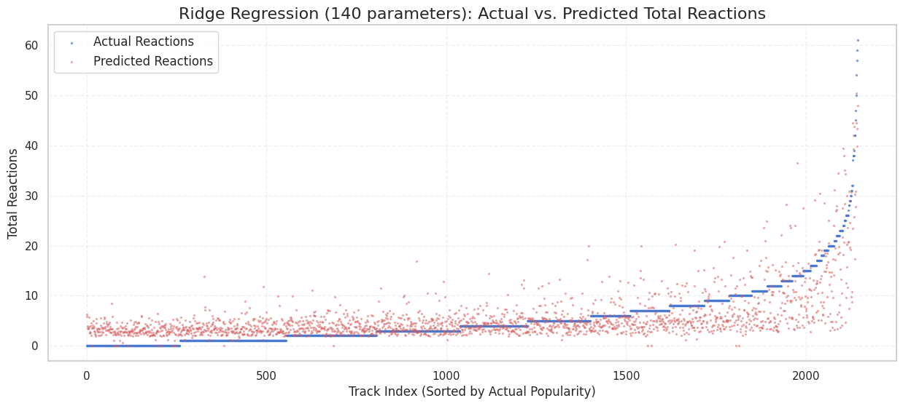
    


*We got better results in polynomial version like in Linear Regression but the results still lack!*

### 1.3 LASSO Regression


```python

no_features = []
scores = []
# Select best features
selector = SelectKBest(mutual_info_regression, k = 140)
selector.fit(X_train_transformed_poly, y_train)
X_train_transformed = selector.transform(X_train_transformed_poly)
X_test_transform = selector.transform(X_test_transformed_poly)

alpha_list = [.0001,0.0003,0.0005,0.001,0.01,0.05,0.1,0.3,0.5,1]
scores = []
for alpha in alpha_list:
    model = Lasso(alpha=alpha)
    model.fit(X_train_transformed, y_train)
    no_features.append(k)
    predicted_prices_test = model.predict(X_test_transform)
    r2_test = r2_score(y_test, predicted_prices_test)
    scores.append(r2_test)

# Plot the results
plt.figure(figsize=(20, 8))
plt.plot(alpha_list, scores, marker='o', linewidth=2, color='b')

# 1. Change X-axis to a logarithmic scale (fixes the squishing issue)
plt.xscale('log')

# 2. Force the X-axis ticks to match your exact alpha values
plt.xticks(alpha_list, labels=[str(a) for a in alpha_list], fontsize=12)
plt.yticks(fontsize=12)

plt.xlabel('Alpha (Regularization Strength)', fontsize=16, labelpad=10)
plt.ylabel('$R^2$ Score (Test Data)', fontsize=16, labelpad=10)
plt.title('LASSO Regression: $R^2$ Score vs. Alpha Hyperparameter', fontsize=18, pad=15)
plt.grid(True, which="both", linestyle='--', alpha=0.5)

plt.show()
```


    
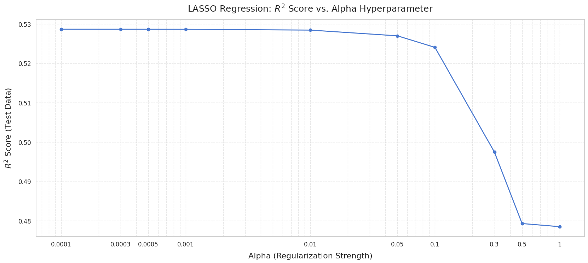
    


*So we again go with the `alpha=0.01` as our hyperparameter choice.*


```python
# --- LASSO Regression ---
lasso_cv = GridSearchCV(Lasso(max_iter=5000), param_grid={'alpha': [0.01, 0.1, 1.0, 10.0]}, cv=5)
lasso_cv.fit(X_train_scaled, y_train)
```


<style>#sk-container-id-5 {
  /* Definition of color scheme common for light and dark mode */
  --sklearn-color-text: #000;
  --sklearn-color-text-muted: #666;
  --sklearn-color-line: gray;
  /* Definition of color scheme for unfitted estimators */
  --sklearn-color-unfitted-level-0: #fff5e6;
  --sklearn-color-unfitted-level-1: #f6e4d2;
  --sklearn-color-unfitted-level-2: #ffe0b3;
  --sklearn-color-unfitted-level-3: chocolate;
  /* Definition of color scheme for fitted estimators */
  --sklearn-color-fitted-level-0: #f0f8ff;
  --sklearn-color-fitted-level-1: #d4ebff;
  --sklearn-color-fitted-level-2: #b3dbfd;
  --sklearn-color-fitted-level-3: cornflowerblue;
}

#sk-container-id-5.light {
  /* Specific color for light theme */
  --sklearn-color-text-on-default-background: black;
  --sklearn-color-background: white;
  --sklearn-color-border-box: black;
  --sklearn-color-icon: #696969;
}

#sk-container-id-5.dark {
  --sklearn-color-text-on-default-background: white;
  --sklearn-color-background: #111;
  --sklearn-color-border-box: white;
  --sklearn-color-icon: #878787;
}

#sk-container-id-5 {
  color: var(--sklearn-color-text);
}

#sk-container-id-5 pre {
  padding: 0;
}

#sk-container-id-5 input.sk-hidden--visually {
  border: 0;
  clip: rect(1px 1px 1px 1px);
  clip: rect(1px, 1px, 1px, 1px);
  height: 1px;
  margin: -1px;
  overflow: hidden;
  padding: 0;
  position: absolute;
  width: 1px;
}

#sk-container-id-5 div.sk-dashed-wrapped {
  border: 1px dashed var(--sklearn-color-line);
  margin: 0 0.4em 0.5em 0.4em;
  box-sizing: border-box;
  padding-bottom: 0.4em;
  background-color: var(--sklearn-color-background);
}

#sk-container-id-5 div.sk-container {
  /* jupyter's `normalize.less` sets `[hidden] { display: none; }`
     but bootstrap.min.css set `[hidden] { display: none !important; }`
     so we also need the `!important` here to be able to override the
     default hidden behavior on the sphinx rendered scikit-learn.org.
     See: https://github.com/scikit-learn/scikit-learn/issues/21755 */
  display: inline-block !important;
  position: relative;
}

#sk-container-id-5 div.sk-text-repr-fallback {
  display: none;
}

div.sk-parallel-item,
div.sk-serial,
div.sk-item {
  /* draw centered vertical line to link estimators */
  background-image: linear-gradient(var(--sklearn-color-text-on-default-background), var(--sklearn-color-text-on-default-background));
  background-size: 2px 100%;
  background-repeat: no-repeat;
  background-position: center center;
}

/* Parallel-specific style estimator block */

#sk-container-id-5 div.sk-parallel-item::after {
  content: "";
  width: 100%;
  border-bottom: 2px solid var(--sklearn-color-text-on-default-background);
  flex-grow: 1;
}

#sk-container-id-5 div.sk-parallel {
  display: flex;
  align-items: stretch;
  justify-content: center;
  background-color: var(--sklearn-color-background);
  position: relative;
}

#sk-container-id-5 div.sk-parallel-item {
  display: flex;
  flex-direction: column;
}

#sk-container-id-5 div.sk-parallel-item:first-child::after {
  align-self: flex-end;
  width: 50%;
}

#sk-container-id-5 div.sk-parallel-item:last-child::after {
  align-self: flex-start;
  width: 50%;
}

#sk-container-id-5 div.sk-parallel-item:only-child::after {
  width: 0;
}

/* Serial-specific style estimator block */

#sk-container-id-5 div.sk-serial {
  display: flex;
  flex-direction: column;
  align-items: center;
  background-color: var(--sklearn-color-background);
  padding-right: 1em;
  padding-left: 1em;
}


/* Toggleable style: style used for estimator/Pipeline/ColumnTransformer box that is
clickable and can be expanded/collapsed.
- Pipeline and ColumnTransformer use this feature and define the default style
- Estimators will overwrite some part of the style using the `sk-estimator` class
*/

/* Pipeline and ColumnTransformer style (default) */

#sk-container-id-5 div.sk-toggleable {
  /* Default theme specific background. It is overwritten whether we have a
  specific estimator or a Pipeline/ColumnTransformer */
  background-color: var(--sklearn-color-background);
}

/* Toggleable label */
#sk-container-id-5 label.sk-toggleable__label {
  cursor: pointer;
  display: flex;
  width: 100%;
  margin-bottom: 0;
  padding: 0.5em;
  box-sizing: border-box;
  text-align: center;
  align-items: center;
  justify-content: center;
  gap: 0.5em;
}

#sk-container-id-5 label.sk-toggleable__label .caption {
  font-size: 0.6rem;
  font-weight: lighter;
  color: var(--sklearn-color-text-muted);
}

#sk-container-id-5 label.sk-toggleable__label-arrow:before {
  /* Arrow on the left of the label */
  content: "▸";
  float: left;
  margin-right: 0.25em;
  color: var(--sklearn-color-icon);
}

#sk-container-id-5 label.sk-toggleable__label-arrow:hover:before {
  color: var(--sklearn-color-text);
}

/* Toggleable content - dropdown */

#sk-container-id-5 div.sk-toggleable__content {
  display: none;
  text-align: left;
  /* unfitted */
  background-color: var(--sklearn-color-unfitted-level-0);
}

#sk-container-id-5 div.sk-toggleable__content.fitted {
  /* fitted */
  background-color: var(--sklearn-color-fitted-level-0);
}

#sk-container-id-5 div.sk-toggleable__content pre {
  margin: 0.2em;
  border-radius: 0.25em;
  color: var(--sklearn-color-text);
  /* unfitted */
  background-color: var(--sklearn-color-unfitted-level-0);
}

#sk-container-id-5 div.sk-toggleable__content.fitted pre {
  /* unfitted */
  background-color: var(--sklearn-color-fitted-level-0);
}

#sk-container-id-5 input.sk-toggleable__control:checked~div.sk-toggleable__content {
  /* Expand drop-down */
  display: block;
  width: 100%;
  overflow: visible;
}

#sk-container-id-5 input.sk-toggleable__control:checked~label.sk-toggleable__label-arrow:before {
  content: "▾";
}

/* Pipeline/ColumnTransformer-specific style */

#sk-container-id-5 div.sk-label input.sk-toggleable__control:checked~label.sk-toggleable__label {
  color: var(--sklearn-color-text);
  background-color: var(--sklearn-color-unfitted-level-2);
}

#sk-container-id-5 div.sk-label.fitted input.sk-toggleable__control:checked~label.sk-toggleable__label {
  background-color: var(--sklearn-color-fitted-level-2);
}

/* Estimator-specific style */

/* Colorize estimator box */
#sk-container-id-5 div.sk-estimator input.sk-toggleable__control:checked~label.sk-toggleable__label {
  /* unfitted */
  background-color: var(--sklearn-color-unfitted-level-2);
}

#sk-container-id-5 div.sk-estimator.fitted input.sk-toggleable__control:checked~label.sk-toggleable__label {
  /* fitted */
  background-color: var(--sklearn-color-fitted-level-2);
}

#sk-container-id-5 div.sk-label label.sk-toggleable__label,
#sk-container-id-5 div.sk-label label {
  /* The background is the default theme color */
  color: var(--sklearn-color-text-on-default-background);
}

/* On hover, darken the color of the background */
#sk-container-id-5 div.sk-label:hover label.sk-toggleable__label {
  color: var(--sklearn-color-text);
  background-color: var(--sklearn-color-unfitted-level-2);
}

/* Label box, darken color on hover, fitted */
#sk-container-id-5 div.sk-label.fitted:hover label.sk-toggleable__label.fitted {
  color: var(--sklearn-color-text);
  background-color: var(--sklearn-color-fitted-level-2);
}

/* Estimator label */

#sk-container-id-5 div.sk-label label {
  font-family: monospace;
  font-weight: bold;
  line-height: 1.2em;
}

#sk-container-id-5 div.sk-label-container {
  text-align: center;
}

/* Estimator-specific */
#sk-container-id-5 div.sk-estimator {
  font-family: monospace;
  border: 1px dotted var(--sklearn-color-border-box);
  border-radius: 0.25em;
  box-sizing: border-box;
  margin-bottom: 0.5em;
  /* unfitted */
  background-color: var(--sklearn-color-unfitted-level-0);
}

#sk-container-id-5 div.sk-estimator.fitted {
  /* fitted */
  background-color: var(--sklearn-color-fitted-level-0);
}

/* on hover */
#sk-container-id-5 div.sk-estimator:hover {
  /* unfitted */
  background-color: var(--sklearn-color-unfitted-level-2);
}

#sk-container-id-5 div.sk-estimator.fitted:hover {
  /* fitted */
  background-color: var(--sklearn-color-fitted-level-2);
}

/* Specification for estimator info (e.g. "i" and "?") */

/* Common style for "i" and "?" */

.sk-estimator-doc-link,
a:link.sk-estimator-doc-link,
a:visited.sk-estimator-doc-link {
  float: right;
  font-size: smaller;
  line-height: 1em;
  font-family: monospace;
  background-color: var(--sklearn-color-unfitted-level-0);
  border-radius: 1em;
  height: 1em;
  width: 1em;
  text-decoration: none !important;
  margin-left: 0.5em;
  text-align: center;
  /* unfitted */
  border: var(--sklearn-color-unfitted-level-3) 1pt solid;
  color: var(--sklearn-color-unfitted-level-3);
}

.sk-estimator-doc-link.fitted,
a:link.sk-estimator-doc-link.fitted,
a:visited.sk-estimator-doc-link.fitted {
  /* fitted */
  background-color: var(--sklearn-color-fitted-level-0);
  border: var(--sklearn-color-fitted-level-3) 1pt solid;
  color: var(--sklearn-color-fitted-level-3);
}

/* On hover */
div.sk-estimator:hover .sk-estimator-doc-link:hover,
.sk-estimator-doc-link:hover,
div.sk-label-container:hover .sk-estimator-doc-link:hover,
.sk-estimator-doc-link:hover {
  /* unfitted */
  background-color: var(--sklearn-color-unfitted-level-3);
  border: var(--sklearn-color-fitted-level-0) 1pt solid;
  color: var(--sklearn-color-unfitted-level-0);
  text-decoration: none;
}

div.sk-estimator.fitted:hover .sk-estimator-doc-link.fitted:hover,
.sk-estimator-doc-link.fitted:hover,
div.sk-label-container:hover .sk-estimator-doc-link.fitted:hover,
.sk-estimator-doc-link.fitted:hover {
  /* fitted */
  background-color: var(--sklearn-color-fitted-level-3);
  border: var(--sklearn-color-fitted-level-0) 1pt solid;
  color: var(--sklearn-color-fitted-level-0);
  text-decoration: none;
}

/* Span, style for the box shown on hovering the info icon */
.sk-estimator-doc-link span {
  display: none;
  z-index: 9999;
  position: relative;
  font-weight: normal;
  right: .2ex;
  padding: .5ex;
  margin: .5ex;
  width: min-content;
  min-width: 20ex;
  max-width: 50ex;
  color: var(--sklearn-color-text);
  box-shadow: 2pt 2pt 4pt #999;
  /* unfitted */
  background: var(--sklearn-color-unfitted-level-0);
  border: .5pt solid var(--sklearn-color-unfitted-level-3);
}

.sk-estimator-doc-link.fitted span {
  /* fitted */
  background: var(--sklearn-color-fitted-level-0);
  border: var(--sklearn-color-fitted-level-3);
}

.sk-estimator-doc-link:hover span {
  display: block;
}

/* "?"-specific style due to the `<a>` HTML tag */

#sk-container-id-5 a.estimator_doc_link {
  float: right;
  font-size: 1rem;
  line-height: 1em;
  font-family: monospace;
  background-color: var(--sklearn-color-unfitted-level-0);
  border-radius: 1rem;
  height: 1rem;
  width: 1rem;
  text-decoration: none;
  /* unfitted */
  color: var(--sklearn-color-unfitted-level-1);
  border: var(--sklearn-color-unfitted-level-1) 1pt solid;
}

#sk-container-id-5 a.estimator_doc_link.fitted {
  /* fitted */
  background-color: var(--sklearn-color-fitted-level-0);
  border: var(--sklearn-color-fitted-level-1) 1pt solid;
  color: var(--sklearn-color-fitted-level-1);
}

/* On hover */
#sk-container-id-5 a.estimator_doc_link:hover {
  /* unfitted */
  background-color: var(--sklearn-color-unfitted-level-3);
  color: var(--sklearn-color-background);
  text-decoration: none;
}

#sk-container-id-5 a.estimator_doc_link.fitted:hover {
  /* fitted */
  background-color: var(--sklearn-color-fitted-level-3);
}

.estimator-table {
    font-family: monospace;
}

.estimator-table summary {
    padding: .5rem;
    cursor: pointer;
}

.estimator-table summary::marker {
    font-size: 0.7rem;
}

.estimator-table details[open] {
    padding-left: 0.1rem;
    padding-right: 0.1rem;
    padding-bottom: 0.3rem;
}

.estimator-table .parameters-table {
    margin-left: auto !important;
    margin-right: auto !important;
    margin-top: 0;
}

.estimator-table .parameters-table tr:nth-child(odd) {
    background-color: #fff;
}

.estimator-table .parameters-table tr:nth-child(even) {
    background-color: #f6f6f6;
}

.estimator-table .parameters-table tr:hover {
    background-color: #e0e0e0;
}

.estimator-table table td {
    border: 1px solid rgba(106, 105, 104, 0.232);
}

/*
    `table td`is set in notebook with right text-align.
    We need to overwrite it.
*/
.estimator-table table td.param {
    text-align: left;
    position: relative;
    padding: 0;
}

.user-set td {
    color:rgb(255, 94, 0);
    text-align: left !important;
}

.user-set td.value {
    color:rgb(255, 94, 0);
    background-color: transparent;
}

.default td {
    color: black;
    text-align: left !important;
}

.user-set td i,
.default td i {
    color: black;
}

/*
    Styles for parameter documentation links
    We need styling for visited so jupyter doesn't overwrite it
*/
a.param-doc-link,
a.param-doc-link:link,
a.param-doc-link:visited {
    text-decoration: underline dashed;
    text-underline-offset: .3em;
    color: inherit;
    display: block;
    padding: .5em;
}

/* "hack" to make the entire area of the cell containing the link clickable */
a.param-doc-link::before {
    position: absolute;
    content: "";
    inset: 0;
}

.param-doc-description {
    display: none;
    position: absolute;
    z-index: 9999;
    left: 0;
    padding: .5ex;
    margin-left: 1.5em;
    color: var(--sklearn-color-text);
    box-shadow: .3em .3em .4em #999;
    width: max-content;
    text-align: left;
    max-height: 10em;
    overflow-y: auto;

    /* unfitted */
    background: var(--sklearn-color-unfitted-level-0);
    border: thin solid var(--sklearn-color-unfitted-level-3);
}

/* Fitted state for parameter tooltips */
.fitted .param-doc-description {
    /* fitted */
    background: var(--sklearn-color-fitted-level-0);
    border: thin solid var(--sklearn-color-fitted-level-3);
}

.param-doc-link:hover .param-doc-description {
    display: block;
}

.copy-paste-icon {
    background-image: url();
    background-repeat: no-repeat;
    background-size: 14px 14px;
    background-position: 0;
    display: inline-block;
    width: 14px;
    height: 14px;
    cursor: pointer;
}
</style><body><div id="sk-container-id-5" class="sk-top-container"><div class="sk-text-repr-fallback"><pre>GridSearchCV(cv=5, estimator=Lasso(max_iter=5000),
             param_grid={&#x27;alpha&#x27;: [0.01, 0.1, 1.0, 10.0]})</pre><b>In a Jupyter environment, please rerun this cell to show the HTML representation or trust the notebook. <br />On GitHub, the HTML representation is unable to render, please try loading this page with nbviewer.org.</b></div><div class="sk-container" hidden><div class="sk-item sk-dashed-wrapped"><div class="sk-label-container"><div class="sk-label fitted sk-toggleable"><input class="sk-toggleable__control sk-hidden--visually" id="sk-estimator-id-9" type="checkbox" ><label for="sk-estimator-id-9" class="sk-toggleable__label fitted sk-toggleable__label-arrow"><div><div>GridSearchCV</div></div><div><a class="sk-estimator-doc-link fitted" rel="noreferrer" target="_blank" href="https://scikit-learn.org/1.8/modules/generated/sklearn.model_selection.GridSearchCV.html">?<span>Documentation for GridSearchCV</span></a><span class="sk-estimator-doc-link fitted">i<span>Fitted</span></span></div></label><div class="sk-toggleable__content fitted" data-param-prefix="">
        <div class="estimator-table">
            <details>
                <summary>Parameters</summary>
                <table class="parameters-table">
                  <tbody>

        <tr class="user-set">
            <td><i class="copy-paste-icon"
                 onclick="copyToClipboard('estimator',
                          this.parentElement.nextElementSibling)"
            ></i></td>
            <td class="param">
        <a class="param-doc-link"
            rel="noreferrer" target="_blank" href="https://scikit-learn.org/1.8/modules/generated/sklearn.model_selection.GridSearchCV.html#:~:text=estimator,-estimator%20object">
            estimator
            <span class="param-doc-description">estimator: estimator object<br><br>This is assumed to implement the scikit-learn estimator interface.<br>Either estimator needs to provide a ``score`` function,<br>or ``scoring`` must be passed.</span>
        </a>
    </td>
            <td class="value">Lasso(max_iter=5000)</td>
        </tr>


        <tr class="user-set">
            <td><i class="copy-paste-icon"
                 onclick="copyToClipboard('param_grid',
                          this.parentElement.nextElementSibling)"
            ></i></td>
            <td class="param">
        <a class="param-doc-link"
            rel="noreferrer" target="_blank" href="https://scikit-learn.org/1.8/modules/generated/sklearn.model_selection.GridSearchCV.html#:~:text=param_grid,-dict%20or%20list%20of%20dictionaries">
            param_grid
            <span class="param-doc-description">param_grid: dict or list of dictionaries<br><br>Dictionary with parameters names (`str`) as keys and lists of<br>parameter settings to try as values, or a list of such<br>dictionaries, in which case the grids spanned by each dictionary<br>in the list are explored. This enables searching over any sequence<br>of parameter settings.</span>
        </a>
    </td>
            <td class="value">{&#x27;alpha&#x27;: [0.01, 0.1, ...]}</td>
        </tr>


        <tr class="default">
            <td><i class="copy-paste-icon"
                 onclick="copyToClipboard('scoring',
                          this.parentElement.nextElementSibling)"
            ></i></td>
            <td class="param">
        <a class="param-doc-link"
            rel="noreferrer" target="_blank" href="https://scikit-learn.org/1.8/modules/generated/sklearn.model_selection.GridSearchCV.html#:~:text=scoring,-str%2C%20callable%2C%20list%2C%20tuple%20or%20dict%2C%20default%3DNone">
            scoring
            <span class="param-doc-description">scoring: str, callable, list, tuple or dict, default=None<br><br>Strategy to evaluate the performance of the cross-validated model on<br>the test set.<br><br>If `scoring` represents a single score, one can use:<br><br>- a single string (see :ref:`scoring_string_names`);<br>- a callable (see :ref:`scoring_callable`) that returns a single value;<br>- `None`, the `estimator`'s<br>  :ref:`default evaluation criterion <scoring_api_overview>` is used.<br><br>If `scoring` represents multiple scores, one can use:<br><br>- a list or tuple of unique strings;<br>- a callable returning a dictionary where the keys are the metric<br>  names and the values are the metric scores;<br>- a dictionary with metric names as keys and callables as values.<br><br>See :ref:`multimetric_grid_search` for an example.</span>
        </a>
    </td>
            <td class="value">None</td>
        </tr>


        <tr class="default">
            <td><i class="copy-paste-icon"
                 onclick="copyToClipboard('n_jobs',
                          this.parentElement.nextElementSibling)"
            ></i></td>
            <td class="param">
        <a class="param-doc-link"
            rel="noreferrer" target="_blank" href="https://scikit-learn.org/1.8/modules/generated/sklearn.model_selection.GridSearchCV.html#:~:text=n_jobs,-int%2C%20default%3DNone">
            n_jobs
            <span class="param-doc-description">n_jobs: int, default=None<br><br>Number of jobs to run in parallel.<br>``None`` means 1 unless in a :obj:`joblib.parallel_backend` context.<br>``-1`` means using all processors. See :term:`Glossary <n_jobs>`<br>for more details.<br><br>.. versionchanged:: v0.20<br>   `n_jobs` default changed from 1 to None</span>
        </a>
    </td>
            <td class="value">None</td>
        </tr>


        <tr class="default">
            <td><i class="copy-paste-icon"
                 onclick="copyToClipboard('refit',
                          this.parentElement.nextElementSibling)"
            ></i></td>
            <td class="param">
        <a class="param-doc-link"
            rel="noreferrer" target="_blank" href="https://scikit-learn.org/1.8/modules/generated/sklearn.model_selection.GridSearchCV.html#:~:text=refit,-bool%2C%20str%2C%20or%20callable%2C%20default%3DTrue">
            refit
            <span class="param-doc-description">refit: bool, str, or callable, default=True<br><br>Refit an estimator using the best found parameters on the whole<br>dataset.<br><br>For multiple metric evaluation, this needs to be a `str` denoting the<br>scorer that would be used to find the best parameters for refitting<br>the estimator at the end.<br><br>Where there are considerations other than maximum score in<br>choosing a best estimator, ``refit`` can be set to a function which<br>returns the selected ``best_index_`` given ``cv_results_``. In that<br>case, the ``best_estimator_`` and ``best_params_`` will be set<br>according to the returned ``best_index_`` while the ``best_score_``<br>attribute will not be available.<br><br>The refitted estimator is made available at the ``best_estimator_``<br>attribute and permits using ``predict`` directly on this<br>``GridSearchCV`` instance.<br><br>Also for multiple metric evaluation, the attributes ``best_index_``,<br>``best_score_`` and ``best_params_`` will only be available if<br>``refit`` is set and all of them will be determined w.r.t this specific<br>scorer.<br><br>See ``scoring`` parameter to know more about multiple metric<br>evaluation.<br><br>See :ref:`sphx_glr_auto_examples_model_selection_plot_grid_search_digits.py`<br>to see how to design a custom selection strategy using a callable<br>via `refit`.<br><br>See :ref:`this example<br><sphx_glr_auto_examples_model_selection_plot_grid_search_refit_callable.py>`<br>for an example of how to use ``refit=callable`` to balance model<br>complexity and cross-validated score.<br><br>.. versionchanged:: 0.20<br>    Support for callable added.</span>
        </a>
    </td>
            <td class="value">True</td>
        </tr>


        <tr class="user-set">
            <td><i class="copy-paste-icon"
                 onclick="copyToClipboard('cv',
                          this.parentElement.nextElementSibling)"
            ></i></td>
            <td class="param">
        <a class="param-doc-link"
            rel="noreferrer" target="_blank" href="https://scikit-learn.org/1.8/modules/generated/sklearn.model_selection.GridSearchCV.html#:~:text=cv,-int%2C%20cross-validation%20generator%20or%20an%20iterable%2C%20default%3DNone">
            cv
            <span class="param-doc-description">cv: int, cross-validation generator or an iterable, default=None<br><br>Determines the cross-validation splitting strategy.<br>Possible inputs for cv are:<br><br>- None, to use the default 5-fold cross validation,<br>- integer, to specify the number of folds in a `(Stratified)KFold`,<br>- :term:`CV splitter`,<br>- An iterable yielding (train, test) splits as arrays of indices.<br><br>For integer/None inputs, if the estimator is a classifier and ``y`` is<br>either binary or multiclass, :class:`StratifiedKFold` is used. In all<br>other cases, :class:`KFold` is used. These splitters are instantiated<br>with `shuffle=False` so the splits will be the same across calls.<br><br>Refer :ref:`User Guide <cross_validation>` for the various<br>cross-validation strategies that can be used here.<br><br>.. versionchanged:: 0.22<br>    ``cv`` default value if None changed from 3-fold to 5-fold.</span>
        </a>
    </td>
            <td class="value">5</td>
        </tr>


        <tr class="default">
            <td><i class="copy-paste-icon"
                 onclick="copyToClipboard('verbose',
                          this.parentElement.nextElementSibling)"
            ></i></td>
            <td class="param">
        <a class="param-doc-link"
            rel="noreferrer" target="_blank" href="https://scikit-learn.org/1.8/modules/generated/sklearn.model_selection.GridSearchCV.html#:~:text=verbose,-int">
            verbose
            <span class="param-doc-description">verbose: int<br><br>Controls the verbosity: the higher, the more messages.<br><br>- >1 : the computation time for each fold and parameter candidate is<br>  displayed;<br>- >2 : the score is also displayed;<br>- >3 : the fold and candidate parameter indexes are also displayed<br>  together with the starting time of the computation.</span>
        </a>
    </td>
            <td class="value">0</td>
        </tr>


        <tr class="default">
            <td><i class="copy-paste-icon"
                 onclick="copyToClipboard('pre_dispatch',
                          this.parentElement.nextElementSibling)"
            ></i></td>
            <td class="param">
        <a class="param-doc-link"
            rel="noreferrer" target="_blank" href="https://scikit-learn.org/1.8/modules/generated/sklearn.model_selection.GridSearchCV.html#:~:text=pre_dispatch,-int%2C%20or%20str%2C%20default%3D%272%2An_jobs%27">
            pre_dispatch
            <span class="param-doc-description">pre_dispatch: int, or str, default='2*n_jobs'<br><br>Controls the number of jobs that get dispatched during parallel<br>execution. Reducing this number can be useful to avoid an<br>explosion of memory consumption when more jobs get dispatched<br>than CPUs can process. This parameter can be:<br><br>- None, in which case all the jobs are immediately created and spawned. Use<br>  this for lightweight and fast-running jobs, to avoid delays due to on-demand<br>  spawning of the jobs<br>- An int, giving the exact number of total jobs that are spawned<br>- A str, giving an expression as a function of n_jobs, as in '2*n_jobs'</span>
        </a>
    </td>
            <td class="value">&#x27;2*n_jobs&#x27;</td>
        </tr>


        <tr class="default">
            <td><i class="copy-paste-icon"
                 onclick="copyToClipboard('error_score',
                          this.parentElement.nextElementSibling)"
            ></i></td>
            <td class="param">
        <a class="param-doc-link"
            rel="noreferrer" target="_blank" href="https://scikit-learn.org/1.8/modules/generated/sklearn.model_selection.GridSearchCV.html#:~:text=error_score,-%27raise%27%20or%20numeric%2C%20default%3Dnp.nan">
            error_score
            <span class="param-doc-description">error_score: 'raise' or numeric, default=np.nan<br><br>Value to assign to the score if an error occurs in estimator fitting.<br>If set to 'raise', the error is raised. If a numeric value is given,<br>FitFailedWarning is raised. This parameter does not affect the refit<br>step, which will always raise the error.</span>
        </a>
    </td>
            <td class="value">nan</td>
        </tr>


        <tr class="default">
            <td><i class="copy-paste-icon"
                 onclick="copyToClipboard('return_train_score',
                          this.parentElement.nextElementSibling)"
            ></i></td>
            <td class="param">
        <a class="param-doc-link"
            rel="noreferrer" target="_blank" href="https://scikit-learn.org/1.8/modules/generated/sklearn.model_selection.GridSearchCV.html#:~:text=return_train_score,-bool%2C%20default%3DFalse">
            return_train_score
            <span class="param-doc-description">return_train_score: bool, default=False<br><br>If ``False``, the ``cv_results_`` attribute will not include training<br>scores.<br>Computing training scores is used to get insights on how different<br>parameter settings impact the overfitting/underfitting trade-off.<br>However computing the scores on the training set can be computationally<br>expensive and is not strictly required to select the parameters that<br>yield the best generalization performance.<br><br>.. versionadded:: 0.19<br><br>.. versionchanged:: 0.21<br>    Default value was changed from ``True`` to ``False``</span>
        </a>
    </td>
            <td class="value">False</td>
        </tr>

                  </tbody>
                </table>
            </details>
        </div>
    </div></div></div><div class="sk-parallel"><div class="sk-parallel-item"><div class="sk-item"><div class="sk-label-container"><div class="sk-label fitted sk-toggleable"><input class="sk-toggleable__control sk-hidden--visually" id="sk-estimator-id-10" type="checkbox" ><label for="sk-estimator-id-10" class="sk-toggleable__label fitted sk-toggleable__label-arrow"><div><div>best_estimator_: Lasso</div></div></label><div class="sk-toggleable__content fitted" data-param-prefix="best_estimator___"><pre>Lasso(alpha=0.01, max_iter=5000)</pre></div></div></div><div class="sk-serial"><div class="sk-item"><div class="sk-estimator fitted sk-toggleable"><input class="sk-toggleable__control sk-hidden--visually" id="sk-estimator-id-11" type="checkbox" ><label for="sk-estimator-id-11" class="sk-toggleable__label fitted sk-toggleable__label-arrow"><div><div>Lasso</div></div><div><a class="sk-estimator-doc-link fitted" rel="noreferrer" target="_blank" href="https://scikit-learn.org/1.8/modules/generated/sklearn.linear_model.Lasso.html">?<span>Documentation for Lasso</span></a></div></label><div class="sk-toggleable__content fitted" data-param-prefix="best_estimator___">
        <div class="estimator-table">
            <details>
                <summary>Parameters</summary>
                <table class="parameters-table">
                  <tbody>

        <tr class="user-set">
            <td><i class="copy-paste-icon"
                 onclick="copyToClipboard('alpha',
                          this.parentElement.nextElementSibling)"
            ></i></td>
            <td class="param">
        <a class="param-doc-link"
            rel="noreferrer" target="_blank" href="https://scikit-learn.org/1.8/modules/generated/sklearn.linear_model.Lasso.html#:~:text=alpha,-float%2C%20default%3D1.0">
            alpha
            <span class="param-doc-description">alpha: float, default=1.0<br><br>Constant that multiplies the L1 term, controlling regularization<br>strength. `alpha` must be a non-negative float i.e. in `[0, inf)`.<br><br>When `alpha = 0`, the objective is equivalent to ordinary least<br>squares, solved by the :class:`LinearRegression` object. For numerical<br>reasons, using `alpha = 0` with the `Lasso` object is not advised.<br>Instead, you should use the :class:`LinearRegression` object.</span>
        </a>
    </td>
            <td class="value">0.01</td>
        </tr>


        <tr class="default">
            <td><i class="copy-paste-icon"
                 onclick="copyToClipboard('fit_intercept',
                          this.parentElement.nextElementSibling)"
            ></i></td>
            <td class="param">
        <a class="param-doc-link"
            rel="noreferrer" target="_blank" href="https://scikit-learn.org/1.8/modules/generated/sklearn.linear_model.Lasso.html#:~:text=fit_intercept,-bool%2C%20default%3DTrue">
            fit_intercept
            <span class="param-doc-description">fit_intercept: bool, default=True<br><br>Whether to calculate the intercept for this model. If set<br>to False, no intercept will be used in calculations<br>(i.e. data is expected to be centered).</span>
        </a>
    </td>
            <td class="value">True</td>
        </tr>


        <tr class="default">
            <td><i class="copy-paste-icon"
                 onclick="copyToClipboard('precompute',
                          this.parentElement.nextElementSibling)"
            ></i></td>
            <td class="param">
        <a class="param-doc-link"
            rel="noreferrer" target="_blank" href="https://scikit-learn.org/1.8/modules/generated/sklearn.linear_model.Lasso.html#:~:text=precompute,-bool%20or%20array-like%20of%20shape%20%28n_features%2C%20n_features%29%2C%20%20%20%20%20%20%20%20%20%20%20%20%20%20%20%20%20default%3DFalse">
            precompute
            <span class="param-doc-description">precompute: bool or array-like of shape (n_features, n_features),                 default=False<br><br>Whether to use a precomputed Gram matrix to speed up<br>calculations. The Gram matrix can also be passed as argument.<br>For sparse input this option is always ``False`` to preserve sparsity.</span>
        </a>
    </td>
            <td class="value">False</td>
        </tr>


        <tr class="default">
            <td><i class="copy-paste-icon"
                 onclick="copyToClipboard('copy_X',
                          this.parentElement.nextElementSibling)"
            ></i></td>
            <td class="param">
        <a class="param-doc-link"
            rel="noreferrer" target="_blank" href="https://scikit-learn.org/1.8/modules/generated/sklearn.linear_model.Lasso.html#:~:text=copy_X,-bool%2C%20default%3DTrue">
            copy_X
            <span class="param-doc-description">copy_X: bool, default=True<br><br>If ``True``, X will be copied; else, it may be overwritten.</span>
        </a>
    </td>
            <td class="value">True</td>
        </tr>


        <tr class="user-set">
            <td><i class="copy-paste-icon"
                 onclick="copyToClipboard('max_iter',
                          this.parentElement.nextElementSibling)"
            ></i></td>
            <td class="param">
        <a class="param-doc-link"
            rel="noreferrer" target="_blank" href="https://scikit-learn.org/1.8/modules/generated/sklearn.linear_model.Lasso.html#:~:text=max_iter,-int%2C%20default%3D1000">
            max_iter
            <span class="param-doc-description">max_iter: int, default=1000<br><br>The maximum number of iterations.</span>
        </a>
    </td>
            <td class="value">5000</td>
        </tr>


        <tr class="default">
            <td><i class="copy-paste-icon"
                 onclick="copyToClipboard('tol',
                          this.parentElement.nextElementSibling)"
            ></i></td>
            <td class="param">
        <a class="param-doc-link"
            rel="noreferrer" target="_blank" href="https://scikit-learn.org/1.8/modules/generated/sklearn.linear_model.Lasso.html#:~:text=tol,-float%2C%20default%3D1e-4">
            tol
            <span class="param-doc-description">tol: float, default=1e-4<br><br>The tolerance for the optimization: if the updates are smaller or equal to<br>``tol``, the optimization code checks the dual gap for optimality and continues<br>until it is smaller or equal to ``tol``, see Notes below.</span>
        </a>
    </td>
            <td class="value">0.0001</td>
        </tr>


        <tr class="default">
            <td><i class="copy-paste-icon"
                 onclick="copyToClipboard('warm_start',
                          this.parentElement.nextElementSibling)"
            ></i></td>
            <td class="param">
        <a class="param-doc-link"
            rel="noreferrer" target="_blank" href="https://scikit-learn.org/1.8/modules/generated/sklearn.linear_model.Lasso.html#:~:text=warm_start,-bool%2C%20default%3DFalse">
            warm_start
            <span class="param-doc-description">warm_start: bool, default=False<br><br>When set to ``True``, reuse the solution of the previous call to fit as<br>initialization, otherwise, just erase the previous solution.<br>See :term:`the Glossary <warm_start>`.</span>
        </a>
    </td>
            <td class="value">False</td>
        </tr>


        <tr class="default">
            <td><i class="copy-paste-icon"
                 onclick="copyToClipboard('positive',
                          this.parentElement.nextElementSibling)"
            ></i></td>
            <td class="param">
        <a class="param-doc-link"
            rel="noreferrer" target="_blank" href="https://scikit-learn.org/1.8/modules/generated/sklearn.linear_model.Lasso.html#:~:text=positive,-bool%2C%20default%3DFalse">
            positive
            <span class="param-doc-description">positive: bool, default=False<br><br>When set to ``True``, forces the coefficients to be positive.</span>
        </a>
    </td>
            <td class="value">False</td>
        </tr>


        <tr class="default">
            <td><i class="copy-paste-icon"
                 onclick="copyToClipboard('random_state',
                          this.parentElement.nextElementSibling)"
            ></i></td>
            <td class="param">
        <a class="param-doc-link"
            rel="noreferrer" target="_blank" href="https://scikit-learn.org/1.8/modules/generated/sklearn.linear_model.Lasso.html#:~:text=random_state,-int%2C%20RandomState%20instance%2C%20default%3DNone">
            random_state
            <span class="param-doc-description">random_state: int, RandomState instance, default=None<br><br>The seed of the pseudo random number generator that selects a random<br>feature to update. Used when ``selection`` == 'random'.<br>Pass an int for reproducible output across multiple function calls.<br>See :term:`Glossary <random_state>`.</span>
        </a>
    </td>
            <td class="value">None</td>
        </tr>


        <tr class="default">
            <td><i class="copy-paste-icon"
                 onclick="copyToClipboard('selection',
                          this.parentElement.nextElementSibling)"
            ></i></td>
            <td class="param">
        <a class="param-doc-link"
            rel="noreferrer" target="_blank" href="https://scikit-learn.org/1.8/modules/generated/sklearn.linear_model.Lasso.html#:~:text=selection,-%7B%27cyclic%27%2C%20%27random%27%7D%2C%20default%3D%27cyclic%27">
            selection
            <span class="param-doc-description">selection: {'cyclic', 'random'}, default='cyclic'<br><br>If set to 'random', a random coefficient is updated every iteration<br>rather than looping over features sequentially by default. This<br>(setting to 'random') often leads to significantly faster convergence<br>especially when tol is higher than 1e-4.</span>
        </a>
    </td>
            <td class="value">&#x27;cyclic&#x27;</td>
        </tr>

                  </tbody>
                </table>
            </details>
        </div>
    </div></div></div></div></div></div></div></div></div></div><script>function copyToClipboard(text, element) {
    // Get the parameter prefix from the closest toggleable content
    const toggleableContent = element.closest('.sk-toggleable__content');
    const paramPrefix = toggleableContent ? toggleableContent.dataset.paramPrefix : '';
    const fullParamName = paramPrefix ? `${paramPrefix}${text}` : text;

    const originalStyle = element.style;
    const computedStyle = window.getComputedStyle(element);
    const originalWidth = computedStyle.width;
    const originalHTML = element.innerHTML.replace('Copied!', '');

    navigator.clipboard.writeText(fullParamName)
        .then(() => {
            element.style.width = originalWidth;
            element.style.color = 'green';
            element.innerHTML = "Copied!";

            setTimeout(() => {
                element.innerHTML = originalHTML;
                element.style = originalStyle;
            }, 2000);
        })
        .catch(err => {
            console.error('Failed to copy:', err);
            element.style.color = 'red';
            element.innerHTML = "Failed!";
            setTimeout(() => {
                element.innerHTML = originalHTML;
                element.style = originalStyle;
            }, 2000);
        });
    return false;
}

document.querySelectorAll('.copy-paste-icon').forEach(function(element) {
    const toggleableContent = element.closest('.sk-toggleable__content');
    const paramPrefix = toggleableContent ? toggleableContent.dataset.paramPrefix : '';
    const paramName = element.parentElement.nextElementSibling
        .textContent.trim().split(' ')[0];
    const fullParamName = paramPrefix ? `${paramPrefix}${paramName}` : paramName;

    element.setAttribute('title', fullParamName);
});


/**
 * Adapted from Skrub
 * https://github.com/skrub-data/skrub/blob/403466d1d5d4dc76a7ef569b3f8228db59a31dc3/skrub/_reporting/_data/templates/report.js#L789
 * @returns "light" or "dark"
 */
function detectTheme(element) {
    const body = document.querySelector('body');

    // Check VSCode theme
    const themeKindAttr = body.getAttribute('data-vscode-theme-kind');
    const themeNameAttr = body.getAttribute('data-vscode-theme-name');

    if (themeKindAttr && themeNameAttr) {
        const themeKind = themeKindAttr.toLowerCase();
        const themeName = themeNameAttr.toLowerCase();

        if (themeKind.includes("dark") || themeName.includes("dark")) {
            return "dark";
        }
        if (themeKind.includes("light") || themeName.includes("light")) {
            return "light";
        }
    }

    // Check Jupyter theme
    if (body.getAttribute('data-jp-theme-light') === 'false') {
        return 'dark';
    } else if (body.getAttribute('data-jp-theme-light') === 'true') {
        return 'light';
    }

    // Guess based on a parent element's color
    const color = window.getComputedStyle(element.parentNode, null).getPropertyValue('color');
    const match = color.match(/^rgb\s*\(\s*(\d+)\s*,\s*(\d+)\s*,\s*(\d+)\s*\)\s*$/i);
    if (match) {
        const [r, g, b] = [
            parseFloat(match[1]),
            parseFloat(match[2]),
            parseFloat(match[3])
        ];

        // https://en.wikipedia.org/wiki/HSL_and_HSV#Lightness
        const luma = 0.299 * r + 0.587 * g + 0.114 * b;

        if (luma > 180) {
            // If the text is very bright we have a dark theme
            return 'dark';
        }
        if (luma < 75) {
            // If the text is very dark we have a light theme
            return 'light';
        }
        // Otherwise fall back to the next heuristic.
    }

    // Fallback to system preference
    return window.matchMedia('(prefers-color-scheme: dark)').matches ? 'dark' : 'light';
}


function forceTheme(elementId) {
    const estimatorElement = document.querySelector(`#${elementId}`);
    if (estimatorElement === null) {
        console.error(`Element with id ${elementId} not found.`);
    } else {
        const theme = detectTheme(estimatorElement);
        estimatorElement.classList.add(theme);
    }
}

forceTheme('sk-container-id-5');</script></body>


```python
y_pred_lasso = lasso_cv.predict(X_test_scaled)
print(f"🔸 LASSO optimal alpha: {lasso_cv.best_params_['alpha']}")
evaluate_regression("LASSO Regression", y_test, y_pred_lasso)
```

    🔸 LASSO optimal alpha: 0.01


<style type="text/css">
</style>
<table id="T_fc462">
  <thead>
    <tr>
      <th class="blank level0" >&nbsp;</th>
      <th id="T_fc462_level0_col0" class="col_heading level0 col0" >MSE</th>
      <th id="T_fc462_level0_col1" class="col_heading level0 col1" >MAE</th>
      <th id="T_fc462_level0_col2" class="col_heading level0 col2" >MAPE</th>
      <th id="T_fc462_level0_col3" class="col_heading level0 col3" >R2</th>
      <th id="T_fc462_level0_col4" class="col_heading level0 col4" >RMSLE</th>
      <th id="T_fc462_level0_col5" class="col_heading level0 col5" >MedAE</th>
    </tr>
  </thead>
  <tbody>
    <tr>
      <th id="T_fc462_level0_row0" class="row_heading level0 row0" >Linear Regression</th>
      <td id="T_fc462_row0_col0" class="data row0 col0" >19.0116</td>
      <td id="T_fc462_row0_col1" class="data row0 col1" >3.0971</td>
      <td id="T_fc462_row0_col2" class="data row0 col2" >1.80e+15</td>
      <td id="T_fc462_row0_col3" class="data row0 col3" >0.520247</td>
      <td id="T_fc462_row0_col4" class="data row0 col4" >0.7497</td>
      <td id="T_fc462_row0_col5" class="data row0 col5" >2.3612</td>
    </tr>
    <tr>
      <th id="T_fc462_level0_row1" class="row_heading level0 row1" >Linear Regression (140 parameters)</th>
      <td id="T_fc462_row1_col0" class="data row1 col0" >18.1497</td>
      <td id="T_fc462_row1_col1" class="data row1 col1" >3.0170</td>
      <td id="T_fc462_row1_col2" class="data row1 col2" >1.68e+15</td>
      <td id="T_fc462_row1_col3" class="data row1 col3" >0.541997</td>
      <td id="T_fc462_row1_col4" class="data row1 col4" >0.7234</td>
      <td id="T_fc462_row1_col5" class="data row1 col5" >2.3456</td>
    </tr>
    <tr>
      <th id="T_fc462_level0_row2" class="row_heading level0 row2" >Ridge Regression</th>
      <td id="T_fc462_row2_col0" class="data row2 col0" >19.0117</td>
      <td id="T_fc462_row2_col1" class="data row2 col1" >3.0973</td>
      <td id="T_fc462_row2_col2" class="data row2 col2" >1.80e+15</td>
      <td id="T_fc462_row2_col3" class="data row2 col3" >0.520245</td>
      <td id="T_fc462_row2_col4" class="data row2 col4" >0.7497</td>
      <td id="T_fc462_row2_col5" class="data row2 col5" >2.3651</td>
    </tr>
    <tr>
      <th id="T_fc462_level0_row3" class="row_heading level0 row3" >Ridge Regression (140 parameters)</th>
      <td id="T_fc462_row3_col0" class="data row3 col0" >18.1112</td>
      <td id="T_fc462_row3_col1" class="data row3 col1" >3.0389</td>
      <td id="T_fc462_row3_col2" class="data row3 col2" >1.72e+15</td>
      <td id="T_fc462_row3_col3" class="data row3 col3" >0.542967</td>
      <td id="T_fc462_row3_col4" class="data row3 col4" >0.7301</td>
      <td id="T_fc462_row3_col5" class="data row3 col5" >2.3560</td>
    </tr>
    <tr>
      <th id="T_fc462_level0_row4" class="row_heading level0 row4" >LASSO Regression</th>
      <td id="T_fc462_row4_col0" class="data row4 col0" >19.8151</td>
      <td id="T_fc462_row4_col1" class="data row4 col1" >3.1920</td>
      <td id="T_fc462_row4_col2" class="data row4 col2" >1.96e+15</td>
      <td id="T_fc462_row4_col3" class="data row4 col3" >0.499971</td>
      <td id="T_fc462_row4_col4" class="data row4 col4" >0.7740</td>
      <td id="T_fc462_row4_col5" class="data row4 col5" >2.4587</td>
    </tr>
  </tbody>
</table>


```python
plot_actual_vs_predicted("Lasso Regression", y_test, y_pred_lasso)
```


    
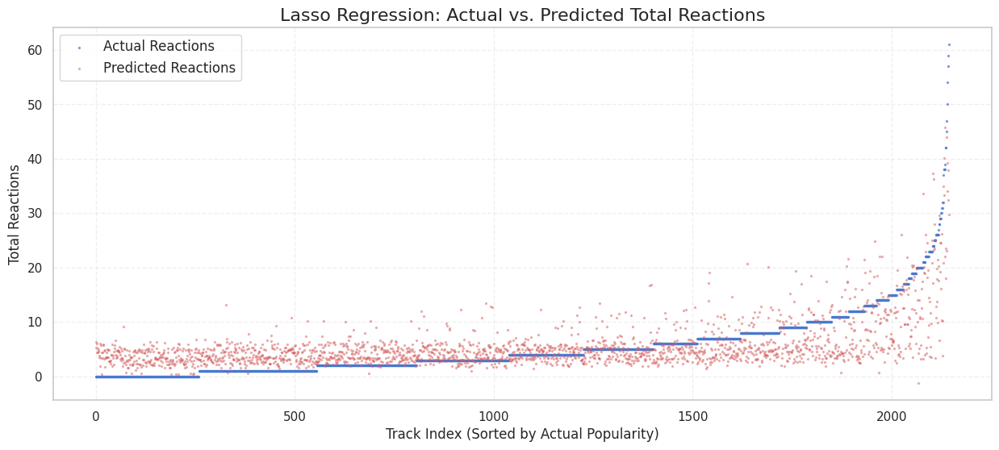
    


#### LASSO Regression polynomial parameters


```python
selector = SelectKBest(mutual_info_regression, k = 140)
selector.fit(X_train_transformed_poly, y_train)
X_train_transformed = selector.transform(X_train_transformed_poly)
X_test_transform = selector.transform(X_test_transformed_poly)

# --- LASSO Regression ---
lasso_cv = GridSearchCV(Lasso(), param_grid={'alpha': [0.01, 0.1, 1.0, 10.0]}, cv=5)
lasso_cv.fit(X_train_transformed, y_train)
```


<style>#sk-container-id-6 {
  /* Definition of color scheme common for light and dark mode */
  --sklearn-color-text: #000;
  --sklearn-color-text-muted: #666;
  --sklearn-color-line: gray;
  /* Definition of color scheme for unfitted estimators */
  --sklearn-color-unfitted-level-0: #fff5e6;
  --sklearn-color-unfitted-level-1: #f6e4d2;
  --sklearn-color-unfitted-level-2: #ffe0b3;
  --sklearn-color-unfitted-level-3: chocolate;
  /* Definition of color scheme for fitted estimators */
  --sklearn-color-fitted-level-0: #f0f8ff;
  --sklearn-color-fitted-level-1: #d4ebff;
  --sklearn-color-fitted-level-2: #b3dbfd;
  --sklearn-color-fitted-level-3: cornflowerblue;
}

#sk-container-id-6.light {
  /* Specific color for light theme */
  --sklearn-color-text-on-default-background: black;
  --sklearn-color-background: white;
  --sklearn-color-border-box: black;
  --sklearn-color-icon: #696969;
}

#sk-container-id-6.dark {
  --sklearn-color-text-on-default-background: white;
  --sklearn-color-background: #111;
  --sklearn-color-border-box: white;
  --sklearn-color-icon: #878787;
}

#sk-container-id-6 {
  color: var(--sklearn-color-text);
}

#sk-container-id-6 pre {
  padding: 0;
}

#sk-container-id-6 input.sk-hidden--visually {
  border: 0;
  clip: rect(1px 1px 1px 1px);
  clip: rect(1px, 1px, 1px, 1px);
  height: 1px;
  margin: -1px;
  overflow: hidden;
  padding: 0;
  position: absolute;
  width: 1px;
}

#sk-container-id-6 div.sk-dashed-wrapped {
  border: 1px dashed var(--sklearn-color-line);
  margin: 0 0.4em 0.5em 0.4em;
  box-sizing: border-box;
  padding-bottom: 0.4em;
  background-color: var(--sklearn-color-background);
}

#sk-container-id-6 div.sk-container {
  /* jupyter's `normalize.less` sets `[hidden] { display: none; }`
     but bootstrap.min.css set `[hidden] { display: none !important; }`
     so we also need the `!important` here to be able to override the
     default hidden behavior on the sphinx rendered scikit-learn.org.
     See: https://github.com/scikit-learn/scikit-learn/issues/21755 */
  display: inline-block !important;
  position: relative;
}

#sk-container-id-6 div.sk-text-repr-fallback {
  display: none;
}

div.sk-parallel-item,
div.sk-serial,
div.sk-item {
  /* draw centered vertical line to link estimators */
  background-image: linear-gradient(var(--sklearn-color-text-on-default-background), var(--sklearn-color-text-on-default-background));
  background-size: 2px 100%;
  background-repeat: no-repeat;
  background-position: center center;
}

/* Parallel-specific style estimator block */

#sk-container-id-6 div.sk-parallel-item::after {
  content: "";
  width: 100%;
  border-bottom: 2px solid var(--sklearn-color-text-on-default-background);
  flex-grow: 1;
}

#sk-container-id-6 div.sk-parallel {
  display: flex;
  align-items: stretch;
  justify-content: center;
  background-color: var(--sklearn-color-background);
  position: relative;
}

#sk-container-id-6 div.sk-parallel-item {
  display: flex;
  flex-direction: column;
}

#sk-container-id-6 div.sk-parallel-item:first-child::after {
  align-self: flex-end;
  width: 50%;
}

#sk-container-id-6 div.sk-parallel-item:last-child::after {
  align-self: flex-start;
  width: 50%;
}

#sk-container-id-6 div.sk-parallel-item:only-child::after {
  width: 0;
}

/* Serial-specific style estimator block */

#sk-container-id-6 div.sk-serial {
  display: flex;
  flex-direction: column;
  align-items: center;
  background-color: var(--sklearn-color-background);
  padding-right: 1em;
  padding-left: 1em;
}


/* Toggleable style: style used for estimator/Pipeline/ColumnTransformer box that is
clickable and can be expanded/collapsed.
- Pipeline and ColumnTransformer use this feature and define the default style
- Estimators will overwrite some part of the style using the `sk-estimator` class
*/

/* Pipeline and ColumnTransformer style (default) */

#sk-container-id-6 div.sk-toggleable {
  /* Default theme specific background. It is overwritten whether we have a
  specific estimator or a Pipeline/ColumnTransformer */
  background-color: var(--sklearn-color-background);
}

/* Toggleable label */
#sk-container-id-6 label.sk-toggleable__label {
  cursor: pointer;
  display: flex;
  width: 100%;
  margin-bottom: 0;
  padding: 0.5em;
  box-sizing: border-box;
  text-align: center;
  align-items: center;
  justify-content: center;
  gap: 0.5em;
}

#sk-container-id-6 label.sk-toggleable__label .caption {
  font-size: 0.6rem;
  font-weight: lighter;
  color: var(--sklearn-color-text-muted);
}

#sk-container-id-6 label.sk-toggleable__label-arrow:before {
  /* Arrow on the left of the label */
  content: "▸";
  float: left;
  margin-right: 0.25em;
  color: var(--sklearn-color-icon);
}

#sk-container-id-6 label.sk-toggleable__label-arrow:hover:before {
  color: var(--sklearn-color-text);
}

/* Toggleable content - dropdown */

#sk-container-id-6 div.sk-toggleable__content {
  display: none;
  text-align: left;
  /* unfitted */
  background-color: var(--sklearn-color-unfitted-level-0);
}

#sk-container-id-6 div.sk-toggleable__content.fitted {
  /* fitted */
  background-color: var(--sklearn-color-fitted-level-0);
}

#sk-container-id-6 div.sk-toggleable__content pre {
  margin: 0.2em;
  border-radius: 0.25em;
  color: var(--sklearn-color-text);
  /* unfitted */
  background-color: var(--sklearn-color-unfitted-level-0);
}

#sk-container-id-6 div.sk-toggleable__content.fitted pre {
  /* unfitted */
  background-color: var(--sklearn-color-fitted-level-0);
}

#sk-container-id-6 input.sk-toggleable__control:checked~div.sk-toggleable__content {
  /* Expand drop-down */
  display: block;
  width: 100%;
  overflow: visible;
}

#sk-container-id-6 input.sk-toggleable__control:checked~label.sk-toggleable__label-arrow:before {
  content: "▾";
}

/* Pipeline/ColumnTransformer-specific style */

#sk-container-id-6 div.sk-label input.sk-toggleable__control:checked~label.sk-toggleable__label {
  color: var(--sklearn-color-text);
  background-color: var(--sklearn-color-unfitted-level-2);
}

#sk-container-id-6 div.sk-label.fitted input.sk-toggleable__control:checked~label.sk-toggleable__label {
  background-color: var(--sklearn-color-fitted-level-2);
}

/* Estimator-specific style */

/* Colorize estimator box */
#sk-container-id-6 div.sk-estimator input.sk-toggleable__control:checked~label.sk-toggleable__label {
  /* unfitted */
  background-color: var(--sklearn-color-unfitted-level-2);
}

#sk-container-id-6 div.sk-estimator.fitted input.sk-toggleable__control:checked~label.sk-toggleable__label {
  /* fitted */
  background-color: var(--sklearn-color-fitted-level-2);
}

#sk-container-id-6 div.sk-label label.sk-toggleable__label,
#sk-container-id-6 div.sk-label label {
  /* The background is the default theme color */
  color: var(--sklearn-color-text-on-default-background);
}

/* On hover, darken the color of the background */
#sk-container-id-6 div.sk-label:hover label.sk-toggleable__label {
  color: var(--sklearn-color-text);
  background-color: var(--sklearn-color-unfitted-level-2);
}

/* Label box, darken color on hover, fitted */
#sk-container-id-6 div.sk-label.fitted:hover label.sk-toggleable__label.fitted {
  color: var(--sklearn-color-text);
  background-color: var(--sklearn-color-fitted-level-2);
}

/* Estimator label */

#sk-container-id-6 div.sk-label label {
  font-family: monospace;
  font-weight: bold;
  line-height: 1.2em;
}

#sk-container-id-6 div.sk-label-container {
  text-align: center;
}

/* Estimator-specific */
#sk-container-id-6 div.sk-estimator {
  font-family: monospace;
  border: 1px dotted var(--sklearn-color-border-box);
  border-radius: 0.25em;
  box-sizing: border-box;
  margin-bottom: 0.5em;
  /* unfitted */
  background-color: var(--sklearn-color-unfitted-level-0);
}

#sk-container-id-6 div.sk-estimator.fitted {
  /* fitted */
  background-color: var(--sklearn-color-fitted-level-0);
}

/* on hover */
#sk-container-id-6 div.sk-estimator:hover {
  /* unfitted */
  background-color: var(--sklearn-color-unfitted-level-2);
}

#sk-container-id-6 div.sk-estimator.fitted:hover {
  /* fitted */
  background-color: var(--sklearn-color-fitted-level-2);
}

/* Specification for estimator info (e.g. "i" and "?") */

/* Common style for "i" and "?" */

.sk-estimator-doc-link,
a:link.sk-estimator-doc-link,
a:visited.sk-estimator-doc-link {
  float: right;
  font-size: smaller;
  line-height: 1em;
  font-family: monospace;
  background-color: var(--sklearn-color-unfitted-level-0);
  border-radius: 1em;
  height: 1em;
  width: 1em;
  text-decoration: none !important;
  margin-left: 0.5em;
  text-align: center;
  /* unfitted */
  border: var(--sklearn-color-unfitted-level-3) 1pt solid;
  color: var(--sklearn-color-unfitted-level-3);
}

.sk-estimator-doc-link.fitted,
a:link.sk-estimator-doc-link.fitted,
a:visited.sk-estimator-doc-link.fitted {
  /* fitted */
  background-color: var(--sklearn-color-fitted-level-0);
  border: var(--sklearn-color-fitted-level-3) 1pt solid;
  color: var(--sklearn-color-fitted-level-3);
}

/* On hover */
div.sk-estimator:hover .sk-estimator-doc-link:hover,
.sk-estimator-doc-link:hover,
div.sk-label-container:hover .sk-estimator-doc-link:hover,
.sk-estimator-doc-link:hover {
  /* unfitted */
  background-color: var(--sklearn-color-unfitted-level-3);
  border: var(--sklearn-color-fitted-level-0) 1pt solid;
  color: var(--sklearn-color-unfitted-level-0);
  text-decoration: none;
}

div.sk-estimator.fitted:hover .sk-estimator-doc-link.fitted:hover,
.sk-estimator-doc-link.fitted:hover,
div.sk-label-container:hover .sk-estimator-doc-link.fitted:hover,
.sk-estimator-doc-link.fitted:hover {
  /* fitted */
  background-color: var(--sklearn-color-fitted-level-3);
  border: var(--sklearn-color-fitted-level-0) 1pt solid;
  color: var(--sklearn-color-fitted-level-0);
  text-decoration: none;
}

/* Span, style for the box shown on hovering the info icon */
.sk-estimator-doc-link span {
  display: none;
  z-index: 9999;
  position: relative;
  font-weight: normal;
  right: .2ex;
  padding: .5ex;
  margin: .5ex;
  width: min-content;
  min-width: 20ex;
  max-width: 50ex;
  color: var(--sklearn-color-text);
  box-shadow: 2pt 2pt 4pt #999;
  /* unfitted */
  background: var(--sklearn-color-unfitted-level-0);
  border: .5pt solid var(--sklearn-color-unfitted-level-3);
}

.sk-estimator-doc-link.fitted span {
  /* fitted */
  background: var(--sklearn-color-fitted-level-0);
  border: var(--sklearn-color-fitted-level-3);
}

.sk-estimator-doc-link:hover span {
  display: block;
}

/* "?"-specific style due to the `<a>` HTML tag */

#sk-container-id-6 a.estimator_doc_link {
  float: right;
  font-size: 1rem;
  line-height: 1em;
  font-family: monospace;
  background-color: var(--sklearn-color-unfitted-level-0);
  border-radius: 1rem;
  height: 1rem;
  width: 1rem;
  text-decoration: none;
  /* unfitted */
  color: var(--sklearn-color-unfitted-level-1);
  border: var(--sklearn-color-unfitted-level-1) 1pt solid;
}

#sk-container-id-6 a.estimator_doc_link.fitted {
  /* fitted */
  background-color: var(--sklearn-color-fitted-level-0);
  border: var(--sklearn-color-fitted-level-1) 1pt solid;
  color: var(--sklearn-color-fitted-level-1);
}

/* On hover */
#sk-container-id-6 a.estimator_doc_link:hover {
  /* unfitted */
  background-color: var(--sklearn-color-unfitted-level-3);
  color: var(--sklearn-color-background);
  text-decoration: none;
}

#sk-container-id-6 a.estimator_doc_link.fitted:hover {
  /* fitted */
  background-color: var(--sklearn-color-fitted-level-3);
}

.estimator-table {
    font-family: monospace;
}

.estimator-table summary {
    padding: .5rem;
    cursor: pointer;
}

.estimator-table summary::marker {
    font-size: 0.7rem;
}

.estimator-table details[open] {
    padding-left: 0.1rem;
    padding-right: 0.1rem;
    padding-bottom: 0.3rem;
}

.estimator-table .parameters-table {
    margin-left: auto !important;
    margin-right: auto !important;
    margin-top: 0;
}

.estimator-table .parameters-table tr:nth-child(odd) {
    background-color: #fff;
}

.estimator-table .parameters-table tr:nth-child(even) {
    background-color: #f6f6f6;
}

.estimator-table .parameters-table tr:hover {
    background-color: #e0e0e0;
}

.estimator-table table td {
    border: 1px solid rgba(106, 105, 104, 0.232);
}

/*
    `table td`is set in notebook with right text-align.
    We need to overwrite it.
*/
.estimator-table table td.param {
    text-align: left;
    position: relative;
    padding: 0;
}

.user-set td {
    color:rgb(255, 94, 0);
    text-align: left !important;
}

.user-set td.value {
    color:rgb(255, 94, 0);
    background-color: transparent;
}

.default td {
    color: black;
    text-align: left !important;
}

.user-set td i,
.default td i {
    color: black;
}

/*
    Styles for parameter documentation links
    We need styling for visited so jupyter doesn't overwrite it
*/
a.param-doc-link,
a.param-doc-link:link,
a.param-doc-link:visited {
    text-decoration: underline dashed;
    text-underline-offset: .3em;
    color: inherit;
    display: block;
    padding: .5em;
}

/* "hack" to make the entire area of the cell containing the link clickable */
a.param-doc-link::before {
    position: absolute;
    content: "";
    inset: 0;
}

.param-doc-description {
    display: none;
    position: absolute;
    z-index: 9999;
    left: 0;
    padding: .5ex;
    margin-left: 1.5em;
    color: var(--sklearn-color-text);
    box-shadow: .3em .3em .4em #999;
    width: max-content;
    text-align: left;
    max-height: 10em;
    overflow-y: auto;

    /* unfitted */
    background: var(--sklearn-color-unfitted-level-0);
    border: thin solid var(--sklearn-color-unfitted-level-3);
}

/* Fitted state for parameter tooltips */
.fitted .param-doc-description {
    /* fitted */
    background: var(--sklearn-color-fitted-level-0);
    border: thin solid var(--sklearn-color-fitted-level-3);
}

.param-doc-link:hover .param-doc-description {
    display: block;
}

.copy-paste-icon {
    background-image: url();
    background-repeat: no-repeat;
    background-size: 14px 14px;
    background-position: 0;
    display: inline-block;
    width: 14px;
    height: 14px;
    cursor: pointer;
}
</style><body><div id="sk-container-id-6" class="sk-top-container"><div class="sk-text-repr-fallback"><pre>GridSearchCV(cv=5, estimator=Lasso(),
             param_grid={&#x27;alpha&#x27;: [0.01, 0.1, 1.0, 10.0]})</pre><b>In a Jupyter environment, please rerun this cell to show the HTML representation or trust the notebook. <br />On GitHub, the HTML representation is unable to render, please try loading this page with nbviewer.org.</b></div><div class="sk-container" hidden><div class="sk-item sk-dashed-wrapped"><div class="sk-label-container"><div class="sk-label fitted sk-toggleable"><input class="sk-toggleable__control sk-hidden--visually" id="sk-estimator-id-12" type="checkbox" ><label for="sk-estimator-id-12" class="sk-toggleable__label fitted sk-toggleable__label-arrow"><div><div>GridSearchCV</div></div><div><a class="sk-estimator-doc-link fitted" rel="noreferrer" target="_blank" href="https://scikit-learn.org/1.8/modules/generated/sklearn.model_selection.GridSearchCV.html">?<span>Documentation for GridSearchCV</span></a><span class="sk-estimator-doc-link fitted">i<span>Fitted</span></span></div></label><div class="sk-toggleable__content fitted" data-param-prefix="">
        <div class="estimator-table">
            <details>
                <summary>Parameters</summary>
                <table class="parameters-table">
                  <tbody>

        <tr class="user-set">
            <td><i class="copy-paste-icon"
                 onclick="copyToClipboard('estimator',
                          this.parentElement.nextElementSibling)"
            ></i></td>
            <td class="param">
        <a class="param-doc-link"
            rel="noreferrer" target="_blank" href="https://scikit-learn.org/1.8/modules/generated/sklearn.model_selection.GridSearchCV.html#:~:text=estimator,-estimator%20object">
            estimator
            <span class="param-doc-description">estimator: estimator object<br><br>This is assumed to implement the scikit-learn estimator interface.<br>Either estimator needs to provide a ``score`` function,<br>or ``scoring`` must be passed.</span>
        </a>
    </td>
            <td class="value">Lasso()</td>
        </tr>


        <tr class="user-set">
            <td><i class="copy-paste-icon"
                 onclick="copyToClipboard('param_grid',
                          this.parentElement.nextElementSibling)"
            ></i></td>
            <td class="param">
        <a class="param-doc-link"
            rel="noreferrer" target="_blank" href="https://scikit-learn.org/1.8/modules/generated/sklearn.model_selection.GridSearchCV.html#:~:text=param_grid,-dict%20or%20list%20of%20dictionaries">
            param_grid
            <span class="param-doc-description">param_grid: dict or list of dictionaries<br><br>Dictionary with parameters names (`str`) as keys and lists of<br>parameter settings to try as values, or a list of such<br>dictionaries, in which case the grids spanned by each dictionary<br>in the list are explored. This enables searching over any sequence<br>of parameter settings.</span>
        </a>
    </td>
            <td class="value">{&#x27;alpha&#x27;: [0.01, 0.1, ...]}</td>
        </tr>


        <tr class="default">
            <td><i class="copy-paste-icon"
                 onclick="copyToClipboard('scoring',
                          this.parentElement.nextElementSibling)"
            ></i></td>
            <td class="param">
        <a class="param-doc-link"
            rel="noreferrer" target="_blank" href="https://scikit-learn.org/1.8/modules/generated/sklearn.model_selection.GridSearchCV.html#:~:text=scoring,-str%2C%20callable%2C%20list%2C%20tuple%20or%20dict%2C%20default%3DNone">
            scoring
            <span class="param-doc-description">scoring: str, callable, list, tuple or dict, default=None<br><br>Strategy to evaluate the performance of the cross-validated model on<br>the test set.<br><br>If `scoring` represents a single score, one can use:<br><br>- a single string (see :ref:`scoring_string_names`);<br>- a callable (see :ref:`scoring_callable`) that returns a single value;<br>- `None`, the `estimator`'s<br>  :ref:`default evaluation criterion <scoring_api_overview>` is used.<br><br>If `scoring` represents multiple scores, one can use:<br><br>- a list or tuple of unique strings;<br>- a callable returning a dictionary where the keys are the metric<br>  names and the values are the metric scores;<br>- a dictionary with metric names as keys and callables as values.<br><br>See :ref:`multimetric_grid_search` for an example.</span>
        </a>
    </td>
            <td class="value">None</td>
        </tr>


        <tr class="default">
            <td><i class="copy-paste-icon"
                 onclick="copyToClipboard('n_jobs',
                          this.parentElement.nextElementSibling)"
            ></i></td>
            <td class="param">
        <a class="param-doc-link"
            rel="noreferrer" target="_blank" href="https://scikit-learn.org/1.8/modules/generated/sklearn.model_selection.GridSearchCV.html#:~:text=n_jobs,-int%2C%20default%3DNone">
            n_jobs
            <span class="param-doc-description">n_jobs: int, default=None<br><br>Number of jobs to run in parallel.<br>``None`` means 1 unless in a :obj:`joblib.parallel_backend` context.<br>``-1`` means using all processors. See :term:`Glossary <n_jobs>`<br>for more details.<br><br>.. versionchanged:: v0.20<br>   `n_jobs` default changed from 1 to None</span>
        </a>
    </td>
            <td class="value">None</td>
        </tr>


        <tr class="default">
            <td><i class="copy-paste-icon"
                 onclick="copyToClipboard('refit',
                          this.parentElement.nextElementSibling)"
            ></i></td>
            <td class="param">
        <a class="param-doc-link"
            rel="noreferrer" target="_blank" href="https://scikit-learn.org/1.8/modules/generated/sklearn.model_selection.GridSearchCV.html#:~:text=refit,-bool%2C%20str%2C%20or%20callable%2C%20default%3DTrue">
            refit
            <span class="param-doc-description">refit: bool, str, or callable, default=True<br><br>Refit an estimator using the best found parameters on the whole<br>dataset.<br><br>For multiple metric evaluation, this needs to be a `str` denoting the<br>scorer that would be used to find the best parameters for refitting<br>the estimator at the end.<br><br>Where there are considerations other than maximum score in<br>choosing a best estimator, ``refit`` can be set to a function which<br>returns the selected ``best_index_`` given ``cv_results_``. In that<br>case, the ``best_estimator_`` and ``best_params_`` will be set<br>according to the returned ``best_index_`` while the ``best_score_``<br>attribute will not be available.<br><br>The refitted estimator is made available at the ``best_estimator_``<br>attribute and permits using ``predict`` directly on this<br>``GridSearchCV`` instance.<br><br>Also for multiple metric evaluation, the attributes ``best_index_``,<br>``best_score_`` and ``best_params_`` will only be available if<br>``refit`` is set and all of them will be determined w.r.t this specific<br>scorer.<br><br>See ``scoring`` parameter to know more about multiple metric<br>evaluation.<br><br>See :ref:`sphx_glr_auto_examples_model_selection_plot_grid_search_digits.py`<br>to see how to design a custom selection strategy using a callable<br>via `refit`.<br><br>See :ref:`this example<br><sphx_glr_auto_examples_model_selection_plot_grid_search_refit_callable.py>`<br>for an example of how to use ``refit=callable`` to balance model<br>complexity and cross-validated score.<br><br>.. versionchanged:: 0.20<br>    Support for callable added.</span>
        </a>
    </td>
            <td class="value">True</td>
        </tr>


        <tr class="user-set">
            <td><i class="copy-paste-icon"
                 onclick="copyToClipboard('cv',
                          this.parentElement.nextElementSibling)"
            ></i></td>
            <td class="param">
        <a class="param-doc-link"
            rel="noreferrer" target="_blank" href="https://scikit-learn.org/1.8/modules/generated/sklearn.model_selection.GridSearchCV.html#:~:text=cv,-int%2C%20cross-validation%20generator%20or%20an%20iterable%2C%20default%3DNone">
            cv
            <span class="param-doc-description">cv: int, cross-validation generator or an iterable, default=None<br><br>Determines the cross-validation splitting strategy.<br>Possible inputs for cv are:<br><br>- None, to use the default 5-fold cross validation,<br>- integer, to specify the number of folds in a `(Stratified)KFold`,<br>- :term:`CV splitter`,<br>- An iterable yielding (train, test) splits as arrays of indices.<br><br>For integer/None inputs, if the estimator is a classifier and ``y`` is<br>either binary or multiclass, :class:`StratifiedKFold` is used. In all<br>other cases, :class:`KFold` is used. These splitters are instantiated<br>with `shuffle=False` so the splits will be the same across calls.<br><br>Refer :ref:`User Guide <cross_validation>` for the various<br>cross-validation strategies that can be used here.<br><br>.. versionchanged:: 0.22<br>    ``cv`` default value if None changed from 3-fold to 5-fold.</span>
        </a>
    </td>
            <td class="value">5</td>
        </tr>


        <tr class="default">
            <td><i class="copy-paste-icon"
                 onclick="copyToClipboard('verbose',
                          this.parentElement.nextElementSibling)"
            ></i></td>
            <td class="param">
        <a class="param-doc-link"
            rel="noreferrer" target="_blank" href="https://scikit-learn.org/1.8/modules/generated/sklearn.model_selection.GridSearchCV.html#:~:text=verbose,-int">
            verbose
            <span class="param-doc-description">verbose: int<br><br>Controls the verbosity: the higher, the more messages.<br><br>- >1 : the computation time for each fold and parameter candidate is<br>  displayed;<br>- >2 : the score is also displayed;<br>- >3 : the fold and candidate parameter indexes are also displayed<br>  together with the starting time of the computation.</span>
        </a>
    </td>
            <td class="value">0</td>
        </tr>


        <tr class="default">
            <td><i class="copy-paste-icon"
                 onclick="copyToClipboard('pre_dispatch',
                          this.parentElement.nextElementSibling)"
            ></i></td>
            <td class="param">
        <a class="param-doc-link"
            rel="noreferrer" target="_blank" href="https://scikit-learn.org/1.8/modules/generated/sklearn.model_selection.GridSearchCV.html#:~:text=pre_dispatch,-int%2C%20or%20str%2C%20default%3D%272%2An_jobs%27">
            pre_dispatch
            <span class="param-doc-description">pre_dispatch: int, or str, default='2*n_jobs'<br><br>Controls the number of jobs that get dispatched during parallel<br>execution. Reducing this number can be useful to avoid an<br>explosion of memory consumption when more jobs get dispatched<br>than CPUs can process. This parameter can be:<br><br>- None, in which case all the jobs are immediately created and spawned. Use<br>  this for lightweight and fast-running jobs, to avoid delays due to on-demand<br>  spawning of the jobs<br>- An int, giving the exact number of total jobs that are spawned<br>- A str, giving an expression as a function of n_jobs, as in '2*n_jobs'</span>
        </a>
    </td>
            <td class="value">&#x27;2*n_jobs&#x27;</td>
        </tr>


        <tr class="default">
            <td><i class="copy-paste-icon"
                 onclick="copyToClipboard('error_score',
                          this.parentElement.nextElementSibling)"
            ></i></td>
            <td class="param">
        <a class="param-doc-link"
            rel="noreferrer" target="_blank" href="https://scikit-learn.org/1.8/modules/generated/sklearn.model_selection.GridSearchCV.html#:~:text=error_score,-%27raise%27%20or%20numeric%2C%20default%3Dnp.nan">
            error_score
            <span class="param-doc-description">error_score: 'raise' or numeric, default=np.nan<br><br>Value to assign to the score if an error occurs in estimator fitting.<br>If set to 'raise', the error is raised. If a numeric value is given,<br>FitFailedWarning is raised. This parameter does not affect the refit<br>step, which will always raise the error.</span>
        </a>
    </td>
            <td class="value">nan</td>
        </tr>


        <tr class="default">
            <td><i class="copy-paste-icon"
                 onclick="copyToClipboard('return_train_score',
                          this.parentElement.nextElementSibling)"
            ></i></td>
            <td class="param">
        <a class="param-doc-link"
            rel="noreferrer" target="_blank" href="https://scikit-learn.org/1.8/modules/generated/sklearn.model_selection.GridSearchCV.html#:~:text=return_train_score,-bool%2C%20default%3DFalse">
            return_train_score
            <span class="param-doc-description">return_train_score: bool, default=False<br><br>If ``False``, the ``cv_results_`` attribute will not include training<br>scores.<br>Computing training scores is used to get insights on how different<br>parameter settings impact the overfitting/underfitting trade-off.<br>However computing the scores on the training set can be computationally<br>expensive and is not strictly required to select the parameters that<br>yield the best generalization performance.<br><br>.. versionadded:: 0.19<br><br>.. versionchanged:: 0.21<br>    Default value was changed from ``True`` to ``False``</span>
        </a>
    </td>
            <td class="value">False</td>
        </tr>

                  </tbody>
                </table>
            </details>
        </div>
    </div></div></div><div class="sk-parallel"><div class="sk-parallel-item"><div class="sk-item"><div class="sk-label-container"><div class="sk-label fitted sk-toggleable"><input class="sk-toggleable__control sk-hidden--visually" id="sk-estimator-id-13" type="checkbox" ><label for="sk-estimator-id-13" class="sk-toggleable__label fitted sk-toggleable__label-arrow"><div><div>best_estimator_: Lasso</div></div></label><div class="sk-toggleable__content fitted" data-param-prefix="best_estimator___"><pre>Lasso(alpha=0.01)</pre></div></div></div><div class="sk-serial"><div class="sk-item"><div class="sk-estimator fitted sk-toggleable"><input class="sk-toggleable__control sk-hidden--visually" id="sk-estimator-id-14" type="checkbox" ><label for="sk-estimator-id-14" class="sk-toggleable__label fitted sk-toggleable__label-arrow"><div><div>Lasso</div></div><div><a class="sk-estimator-doc-link fitted" rel="noreferrer" target="_blank" href="https://scikit-learn.org/1.8/modules/generated/sklearn.linear_model.Lasso.html">?<span>Documentation for Lasso</span></a></div></label><div class="sk-toggleable__content fitted" data-param-prefix="best_estimator___">
        <div class="estimator-table">
            <details>
                <summary>Parameters</summary>
                <table class="parameters-table">
                  <tbody>

        <tr class="user-set">
            <td><i class="copy-paste-icon"
                 onclick="copyToClipboard('alpha',
                          this.parentElement.nextElementSibling)"
            ></i></td>
            <td class="param">
        <a class="param-doc-link"
            rel="noreferrer" target="_blank" href="https://scikit-learn.org/1.8/modules/generated/sklearn.linear_model.Lasso.html#:~:text=alpha,-float%2C%20default%3D1.0">
            alpha
            <span class="param-doc-description">alpha: float, default=1.0<br><br>Constant that multiplies the L1 term, controlling regularization<br>strength. `alpha` must be a non-negative float i.e. in `[0, inf)`.<br><br>When `alpha = 0`, the objective is equivalent to ordinary least<br>squares, solved by the :class:`LinearRegression` object. For numerical<br>reasons, using `alpha = 0` with the `Lasso` object is not advised.<br>Instead, you should use the :class:`LinearRegression` object.</span>
        </a>
    </td>
            <td class="value">0.01</td>
        </tr>


        <tr class="default">
            <td><i class="copy-paste-icon"
                 onclick="copyToClipboard('fit_intercept',
                          this.parentElement.nextElementSibling)"
            ></i></td>
            <td class="param">
        <a class="param-doc-link"
            rel="noreferrer" target="_blank" href="https://scikit-learn.org/1.8/modules/generated/sklearn.linear_model.Lasso.html#:~:text=fit_intercept,-bool%2C%20default%3DTrue">
            fit_intercept
            <span class="param-doc-description">fit_intercept: bool, default=True<br><br>Whether to calculate the intercept for this model. If set<br>to False, no intercept will be used in calculations<br>(i.e. data is expected to be centered).</span>
        </a>
    </td>
            <td class="value">True</td>
        </tr>


        <tr class="default">
            <td><i class="copy-paste-icon"
                 onclick="copyToClipboard('precompute',
                          this.parentElement.nextElementSibling)"
            ></i></td>
            <td class="param">
        <a class="param-doc-link"
            rel="noreferrer" target="_blank" href="https://scikit-learn.org/1.8/modules/generated/sklearn.linear_model.Lasso.html#:~:text=precompute,-bool%20or%20array-like%20of%20shape%20%28n_features%2C%20n_features%29%2C%20%20%20%20%20%20%20%20%20%20%20%20%20%20%20%20%20default%3DFalse">
            precompute
            <span class="param-doc-description">precompute: bool or array-like of shape (n_features, n_features),                 default=False<br><br>Whether to use a precomputed Gram matrix to speed up<br>calculations. The Gram matrix can also be passed as argument.<br>For sparse input this option is always ``False`` to preserve sparsity.</span>
        </a>
    </td>
            <td class="value">False</td>
        </tr>


        <tr class="default">
            <td><i class="copy-paste-icon"
                 onclick="copyToClipboard('copy_X',
                          this.parentElement.nextElementSibling)"
            ></i></td>
            <td class="param">
        <a class="param-doc-link"
            rel="noreferrer" target="_blank" href="https://scikit-learn.org/1.8/modules/generated/sklearn.linear_model.Lasso.html#:~:text=copy_X,-bool%2C%20default%3DTrue">
            copy_X
            <span class="param-doc-description">copy_X: bool, default=True<br><br>If ``True``, X will be copied; else, it may be overwritten.</span>
        </a>
    </td>
            <td class="value">True</td>
        </tr>


        <tr class="default">
            <td><i class="copy-paste-icon"
                 onclick="copyToClipboard('max_iter',
                          this.parentElement.nextElementSibling)"
            ></i></td>
            <td class="param">
        <a class="param-doc-link"
            rel="noreferrer" target="_blank" href="https://scikit-learn.org/1.8/modules/generated/sklearn.linear_model.Lasso.html#:~:text=max_iter,-int%2C%20default%3D1000">
            max_iter
            <span class="param-doc-description">max_iter: int, default=1000<br><br>The maximum number of iterations.</span>
        </a>
    </td>
            <td class="value">1000</td>
        </tr>


        <tr class="default">
            <td><i class="copy-paste-icon"
                 onclick="copyToClipboard('tol',
                          this.parentElement.nextElementSibling)"
            ></i></td>
            <td class="param">
        <a class="param-doc-link"
            rel="noreferrer" target="_blank" href="https://scikit-learn.org/1.8/modules/generated/sklearn.linear_model.Lasso.html#:~:text=tol,-float%2C%20default%3D1e-4">
            tol
            <span class="param-doc-description">tol: float, default=1e-4<br><br>The tolerance for the optimization: if the updates are smaller or equal to<br>``tol``, the optimization code checks the dual gap for optimality and continues<br>until it is smaller or equal to ``tol``, see Notes below.</span>
        </a>
    </td>
            <td class="value">0.0001</td>
        </tr>


        <tr class="default">
            <td><i class="copy-paste-icon"
                 onclick="copyToClipboard('warm_start',
                          this.parentElement.nextElementSibling)"
            ></i></td>
            <td class="param">
        <a class="param-doc-link"
            rel="noreferrer" target="_blank" href="https://scikit-learn.org/1.8/modules/generated/sklearn.linear_model.Lasso.html#:~:text=warm_start,-bool%2C%20default%3DFalse">
            warm_start
            <span class="param-doc-description">warm_start: bool, default=False<br><br>When set to ``True``, reuse the solution of the previous call to fit as<br>initialization, otherwise, just erase the previous solution.<br>See :term:`the Glossary <warm_start>`.</span>
        </a>
    </td>
            <td class="value">False</td>
        </tr>


        <tr class="default">
            <td><i class="copy-paste-icon"
                 onclick="copyToClipboard('positive',
                          this.parentElement.nextElementSibling)"
            ></i></td>
            <td class="param">
        <a class="param-doc-link"
            rel="noreferrer" target="_blank" href="https://scikit-learn.org/1.8/modules/generated/sklearn.linear_model.Lasso.html#:~:text=positive,-bool%2C%20default%3DFalse">
            positive
            <span class="param-doc-description">positive: bool, default=False<br><br>When set to ``True``, forces the coefficients to be positive.</span>
        </a>
    </td>
            <td class="value">False</td>
        </tr>


        <tr class="default">
            <td><i class="copy-paste-icon"
                 onclick="copyToClipboard('random_state',
                          this.parentElement.nextElementSibling)"
            ></i></td>
            <td class="param">
        <a class="param-doc-link"
            rel="noreferrer" target="_blank" href="https://scikit-learn.org/1.8/modules/generated/sklearn.linear_model.Lasso.html#:~:text=random_state,-int%2C%20RandomState%20instance%2C%20default%3DNone">
            random_state
            <span class="param-doc-description">random_state: int, RandomState instance, default=None<br><br>The seed of the pseudo random number generator that selects a random<br>feature to update. Used when ``selection`` == 'random'.<br>Pass an int for reproducible output across multiple function calls.<br>See :term:`Glossary <random_state>`.</span>
        </a>
    </td>
            <td class="value">None</td>
        </tr>


        <tr class="default">
            <td><i class="copy-paste-icon"
                 onclick="copyToClipboard('selection',
                          this.parentElement.nextElementSibling)"
            ></i></td>
            <td class="param">
        <a class="param-doc-link"
            rel="noreferrer" target="_blank" href="https://scikit-learn.org/1.8/modules/generated/sklearn.linear_model.Lasso.html#:~:text=selection,-%7B%27cyclic%27%2C%20%27random%27%7D%2C%20default%3D%27cyclic%27">
            selection
            <span class="param-doc-description">selection: {'cyclic', 'random'}, default='cyclic'<br><br>If set to 'random', a random coefficient is updated every iteration<br>rather than looping over features sequentially by default. This<br>(setting to 'random') often leads to significantly faster convergence<br>especially when tol is higher than 1e-4.</span>
        </a>
    </td>
            <td class="value">&#x27;cyclic&#x27;</td>
        </tr>

                  </tbody>
                </table>
            </details>
        </div>
    </div></div></div></div></div></div></div></div></div></div><script>function copyToClipboard(text, element) {
    // Get the parameter prefix from the closest toggleable content
    const toggleableContent = element.closest('.sk-toggleable__content');
    const paramPrefix = toggleableContent ? toggleableContent.dataset.paramPrefix : '';
    const fullParamName = paramPrefix ? `${paramPrefix}${text}` : text;

    const originalStyle = element.style;
    const computedStyle = window.getComputedStyle(element);
    const originalWidth = computedStyle.width;
    const originalHTML = element.innerHTML.replace('Copied!', '');

    navigator.clipboard.writeText(fullParamName)
        .then(() => {
            element.style.width = originalWidth;
            element.style.color = 'green';
            element.innerHTML = "Copied!";

            setTimeout(() => {
                element.innerHTML = originalHTML;
                element.style = originalStyle;
            }, 2000);
        })
        .catch(err => {
            console.error('Failed to copy:', err);
            element.style.color = 'red';
            element.innerHTML = "Failed!";
            setTimeout(() => {
                element.innerHTML = originalHTML;
                element.style = originalStyle;
            }, 2000);
        });
    return false;
}

document.querySelectorAll('.copy-paste-icon').forEach(function(element) {
    const toggleableContent = element.closest('.sk-toggleable__content');
    const paramPrefix = toggleableContent ? toggleableContent.dataset.paramPrefix : '';
    const paramName = element.parentElement.nextElementSibling
        .textContent.trim().split(' ')[0];
    const fullParamName = paramPrefix ? `${paramPrefix}${paramName}` : paramName;

    element.setAttribute('title', fullParamName);
});


/**
 * Adapted from Skrub
 * https://github.com/skrub-data/skrub/blob/403466d1d5d4dc76a7ef569b3f8228db59a31dc3/skrub/_reporting/_data/templates/report.js#L789
 * @returns "light" or "dark"
 */
function detectTheme(element) {
    const body = document.querySelector('body');

    // Check VSCode theme
    const themeKindAttr = body.getAttribute('data-vscode-theme-kind');
    const themeNameAttr = body.getAttribute('data-vscode-theme-name');

    if (themeKindAttr && themeNameAttr) {
        const themeKind = themeKindAttr.toLowerCase();
        const themeName = themeNameAttr.toLowerCase();

        if (themeKind.includes("dark") || themeName.includes("dark")) {
            return "dark";
        }
        if (themeKind.includes("light") || themeName.includes("light")) {
            return "light";
        }
    }

    // Check Jupyter theme
    if (body.getAttribute('data-jp-theme-light') === 'false') {
        return 'dark';
    } else if (body.getAttribute('data-jp-theme-light') === 'true') {
        return 'light';
    }

    // Guess based on a parent element's color
    const color = window.getComputedStyle(element.parentNode, null).getPropertyValue('color');
    const match = color.match(/^rgb\s*\(\s*(\d+)\s*,\s*(\d+)\s*,\s*(\d+)\s*\)\s*$/i);
    if (match) {
        const [r, g, b] = [
            parseFloat(match[1]),
            parseFloat(match[2]),
            parseFloat(match[3])
        ];

        // https://en.wikipedia.org/wiki/HSL_and_HSV#Lightness
        const luma = 0.299 * r + 0.587 * g + 0.114 * b;

        if (luma > 180) {
            // If the text is very bright we have a dark theme
            return 'dark';
        }
        if (luma < 75) {
            // If the text is very dark we have a light theme
            return 'light';
        }
        // Otherwise fall back to the next heuristic.
    }

    // Fallback to system preference
    return window.matchMedia('(prefers-color-scheme: dark)').matches ? 'dark' : 'light';
}


function forceTheme(elementId) {
    const estimatorElement = document.querySelector(`#${elementId}`);
    if (estimatorElement === null) {
        console.error(`Element with id ${elementId} not found.`);
    } else {
        const theme = detectTheme(estimatorElement);
        estimatorElement.classList.add(theme);
    }
}

forceTheme('sk-container-id-6');</script></body>


```python
lasso_predicted_results = cap_vector(lasso_cv.predict(X_test_transform),100000,0)
print(f"🔸 LASSO optimal alpha: {lasso_cv.best_params_['alpha']}")
evaluate_regression("LASSO Regression (140 parameters)", y_test, lasso_predicted_results)
```

    🔸 LASSO optimal alpha: 0.01


<style type="text/css">
</style>
<table id="T_756df">
  <thead>
    <tr>
      <th class="blank level0" >&nbsp;</th>
      <th id="T_756df_level0_col0" class="col_heading level0 col0" >MSE</th>
      <th id="T_756df_level0_col1" class="col_heading level0 col1" >MAE</th>
      <th id="T_756df_level0_col2" class="col_heading level0 col2" >MAPE</th>
      <th id="T_756df_level0_col3" class="col_heading level0 col3" >R2</th>
      <th id="T_756df_level0_col4" class="col_heading level0 col4" >RMSLE</th>
      <th id="T_756df_level0_col5" class="col_heading level0 col5" >MedAE</th>
    </tr>
  </thead>
  <tbody>
    <tr>
      <th id="T_756df_level0_row0" class="row_heading level0 row0" >Linear Regression</th>
      <td id="T_756df_row0_col0" class="data row0 col0" >19.0116</td>
      <td id="T_756df_row0_col1" class="data row0 col1" >3.0971</td>
      <td id="T_756df_row0_col2" class="data row0 col2" >1.80e+15</td>
      <td id="T_756df_row0_col3" class="data row0 col3" >0.520247</td>
      <td id="T_756df_row0_col4" class="data row0 col4" >0.7497</td>
      <td id="T_756df_row0_col5" class="data row0 col5" >2.3612</td>
    </tr>
    <tr>
      <th id="T_756df_level0_row1" class="row_heading level0 row1" >Linear Regression (140 parameters)</th>
      <td id="T_756df_row1_col0" class="data row1 col0" >18.1497</td>
      <td id="T_756df_row1_col1" class="data row1 col1" >3.0170</td>
      <td id="T_756df_row1_col2" class="data row1 col2" >1.68e+15</td>
      <td id="T_756df_row1_col3" class="data row1 col3" >0.541997</td>
      <td id="T_756df_row1_col4" class="data row1 col4" >0.7234</td>
      <td id="T_756df_row1_col5" class="data row1 col5" >2.3456</td>
    </tr>
    <tr>
      <th id="T_756df_level0_row2" class="row_heading level0 row2" >Ridge Regression</th>
      <td id="T_756df_row2_col0" class="data row2 col0" >19.0117</td>
      <td id="T_756df_row2_col1" class="data row2 col1" >3.0973</td>
      <td id="T_756df_row2_col2" class="data row2 col2" >1.80e+15</td>
      <td id="T_756df_row2_col3" class="data row2 col3" >0.520245</td>
      <td id="T_756df_row2_col4" class="data row2 col4" >0.7497</td>
      <td id="T_756df_row2_col5" class="data row2 col5" >2.3651</td>
    </tr>
    <tr>
      <th id="T_756df_level0_row3" class="row_heading level0 row3" >Ridge Regression (140 parameters)</th>
      <td id="T_756df_row3_col0" class="data row3 col0" >18.1112</td>
      <td id="T_756df_row3_col1" class="data row3 col1" >3.0389</td>
      <td id="T_756df_row3_col2" class="data row3 col2" >1.72e+15</td>
      <td id="T_756df_row3_col3" class="data row3 col3" >0.542967</td>
      <td id="T_756df_row3_col4" class="data row3 col4" >0.7301</td>
      <td id="T_756df_row3_col5" class="data row3 col5" >2.3560</td>
    </tr>
    <tr>
      <th id="T_756df_level0_row4" class="row_heading level0 row4" >LASSO Regression</th>
      <td id="T_756df_row4_col0" class="data row4 col0" >19.8151</td>
      <td id="T_756df_row4_col1" class="data row4 col1" >3.1920</td>
      <td id="T_756df_row4_col2" class="data row4 col2" >1.96e+15</td>
      <td id="T_756df_row4_col3" class="data row4 col3" >0.499971</td>
      <td id="T_756df_row4_col4" class="data row4 col4" >0.7740</td>
      <td id="T_756df_row4_col5" class="data row4 col5" >2.4587</td>
    </tr>
    <tr>
      <th id="T_756df_level0_row5" class="row_heading level0 row5" >LASSO Regression (140 parameters)</th>
      <td id="T_756df_row5_col0" class="data row5 col0" >18.6116</td>
      <td id="T_756df_row5_col1" class="data row5 col1" >3.0786</td>
      <td id="T_756df_row5_col2" class="data row5 col2" >1.77e+15</td>
      <td id="T_756df_row5_col3" class="data row5 col3" >0.530341</td>
      <td id="T_756df_row5_col4" class="data row5 col4" >0.7392</td>
      <td id="T_756df_row5_col5" class="data row5 col5" >2.3282</td>
    </tr>
  </tbody>
</table>


#### 💪 Sparsity in the Weights and Feature Selection in LASSO regression

> Here we are going to set a larger alphs (in this case `alpha = 0.1`) to demonstrate removal of parameters by the LASSO Regression model and  then would compare the model weights with the first Linear Regression model weights


```python
lasso_model = Lasso(alpha=0.1)
lasso_model.fit(X_train_scaled, y_train)

lasso_weights = lasso_model.coef_
print('Non-zero weights in Lasso regression %d' %(sum(lasso_weights!=0)))
```

    Non-zero weights in Lasso regression 7


```python
fig, ax = plt.subplots(figsize=(20, 8))
y_pos = np.arange(0, len(lasso_weights), 1)

hbars_linear = ax.barh(y_pos, linear_weights/np.linalg.norm(linear_weights), 
                       align='center', color='dodgerblue', height=0.4, label='Linear Regression')

hbars_lasso = ax.barh(y_pos+0.4, lasso_weights/np.linalg.norm(lasso_weights), 
                      align='center', color='red', height=0.4, label='LASSO Regression')

ax.set_yticks(y_pos + 0.2)
ax.set_yticklabels(labels, fontsize=12)
ax.invert_yaxis()

ax.set_xlabel('Normalized Weights (Feature Importance)', fontsize=14)
ax.set_title("Feature Importance: Linear vs. LASSO Regression", fontsize=18, pad=15)
ax.grid(True, axis='x', linestyle='--', alpha=0.5)

# Add the legend to distinguish the colors
ax.legend(fontsize=14, loc='best')

plt.tight_layout()
plt.show()
```


    
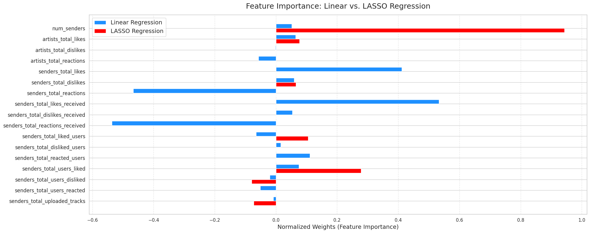
    


**As we can see from the plot result, only `7 parameters are non-zero` inside the LASSO Regression model, and also the weight selection is a lot different than the one in Linear Regression**

### 1.4 Kernel Regression


```python
# --- Kernel Regression (sigmoid)---
if 1: # You'd better keep your pc tight, why? it's going to fly, because it's fan is going to blow like a jet engine :)
    kr_sig_model = KernelRidge(kernel='sigmoid')
    kr_sig_model.fit(X_train_scaled, y_train)
```


```python
y_pred_kr = kr_sig_model.predict(X_test_scaled)
evaluate_regression("Kernel Regression (sigmoid)", y_test, y_pred_kr)
```


<style type="text/css">
</style>
<table id="T_bba7a">
  <thead>
    <tr>
      <th class="blank level0" >&nbsp;</th>
      <th id="T_bba7a_level0_col0" class="col_heading level0 col0" >MSE</th>
      <th id="T_bba7a_level0_col1" class="col_heading level0 col1" >MAE</th>
      <th id="T_bba7a_level0_col2" class="col_heading level0 col2" >MAPE</th>
      <th id="T_bba7a_level0_col3" class="col_heading level0 col3" >R2</th>
      <th id="T_bba7a_level0_col4" class="col_heading level0 col4" >RMSLE</th>
      <th id="T_bba7a_level0_col5" class="col_heading level0 col5" >MedAE</th>
    </tr>
  </thead>
  <tbody>
    <tr>
      <th id="T_bba7a_level0_row0" class="row_heading level0 row0" >Linear Regression</th>
      <td id="T_bba7a_row0_col0" class="data row0 col0" >19.0116</td>
      <td id="T_bba7a_row0_col1" class="data row0 col1" >3.0971</td>
      <td id="T_bba7a_row0_col2" class="data row0 col2" >1.80e+15</td>
      <td id="T_bba7a_row0_col3" class="data row0 col3" >0.520247</td>
      <td id="T_bba7a_row0_col4" class="data row0 col4" >0.7497</td>
      <td id="T_bba7a_row0_col5" class="data row0 col5" >2.3612</td>
    </tr>
    <tr>
      <th id="T_bba7a_level0_row1" class="row_heading level0 row1" >Linear Regression (140 parameters)</th>
      <td id="T_bba7a_row1_col0" class="data row1 col0" >18.1497</td>
      <td id="T_bba7a_row1_col1" class="data row1 col1" >3.0170</td>
      <td id="T_bba7a_row1_col2" class="data row1 col2" >1.68e+15</td>
      <td id="T_bba7a_row1_col3" class="data row1 col3" >0.541997</td>
      <td id="T_bba7a_row1_col4" class="data row1 col4" >0.7234</td>
      <td id="T_bba7a_row1_col5" class="data row1 col5" >2.3456</td>
    </tr>
    <tr>
      <th id="T_bba7a_level0_row2" class="row_heading level0 row2" >Ridge Regression</th>
      <td id="T_bba7a_row2_col0" class="data row2 col0" >19.0117</td>
      <td id="T_bba7a_row2_col1" class="data row2 col1" >3.0973</td>
      <td id="T_bba7a_row2_col2" class="data row2 col2" >1.80e+15</td>
      <td id="T_bba7a_row2_col3" class="data row2 col3" >0.520245</td>
      <td id="T_bba7a_row2_col4" class="data row2 col4" >0.7497</td>
      <td id="T_bba7a_row2_col5" class="data row2 col5" >2.3651</td>
    </tr>
    <tr>
      <th id="T_bba7a_level0_row3" class="row_heading level0 row3" >Ridge Regression (140 parameters)</th>
      <td id="T_bba7a_row3_col0" class="data row3 col0" >18.1112</td>
      <td id="T_bba7a_row3_col1" class="data row3 col1" >3.0389</td>
      <td id="T_bba7a_row3_col2" class="data row3 col2" >1.72e+15</td>
      <td id="T_bba7a_row3_col3" class="data row3 col3" >0.542967</td>
      <td id="T_bba7a_row3_col4" class="data row3 col4" >0.7301</td>
      <td id="T_bba7a_row3_col5" class="data row3 col5" >2.3560</td>
    </tr>
    <tr>
      <th id="T_bba7a_level0_row4" class="row_heading level0 row4" >LASSO Regression</th>
      <td id="T_bba7a_row4_col0" class="data row4 col0" >19.8151</td>
      <td id="T_bba7a_row4_col1" class="data row4 col1" >3.1920</td>
      <td id="T_bba7a_row4_col2" class="data row4 col2" >1.96e+15</td>
      <td id="T_bba7a_row4_col3" class="data row4 col3" >0.499971</td>
      <td id="T_bba7a_row4_col4" class="data row4 col4" >0.7740</td>
      <td id="T_bba7a_row4_col5" class="data row4 col5" >2.4587</td>
    </tr>
    <tr>
      <th id="T_bba7a_level0_row5" class="row_heading level0 row5" >LASSO Regression (140 parameters)</th>
      <td id="T_bba7a_row5_col0" class="data row5 col0" >18.6116</td>
      <td id="T_bba7a_row5_col1" class="data row5 col1" >3.0786</td>
      <td id="T_bba7a_row5_col2" class="data row5 col2" >1.77e+15</td>
      <td id="T_bba7a_row5_col3" class="data row5 col3" >0.530341</td>
      <td id="T_bba7a_row5_col4" class="data row5 col4" >0.7392</td>
      <td id="T_bba7a_row5_col5" class="data row5 col5" >2.3282</td>
    </tr>
    <tr>
      <th id="T_bba7a_level0_row6" class="row_heading level0 row6" >Kernel Regression (sigmoid)</th>
      <td id="T_bba7a_row6_col0" class="data row6 col0" >131033872.6897</td>
      <td id="T_bba7a_row6_col1" class="data row6 col1" >5608.8665</td>
      <td id="T_bba7a_row6_col2" class="data row6 col2" >2.42e+18</td>
      <td id="T_bba7a_row6_col3" class="data row6 col3" >-3306607.784061</td>
      <td id="T_bba7a_row6_col4" class="data row6 col4" >4.8050</td>
      <td id="T_bba7a_row6_col5" class="data row6 col5" >3241.2011</td>
    </tr>
  </tbody>
</table>


```python
plot_actual_vs_predicted("Kernel Regression (sigmoid) [test version]", y_test, y_pred_kr)
```


    
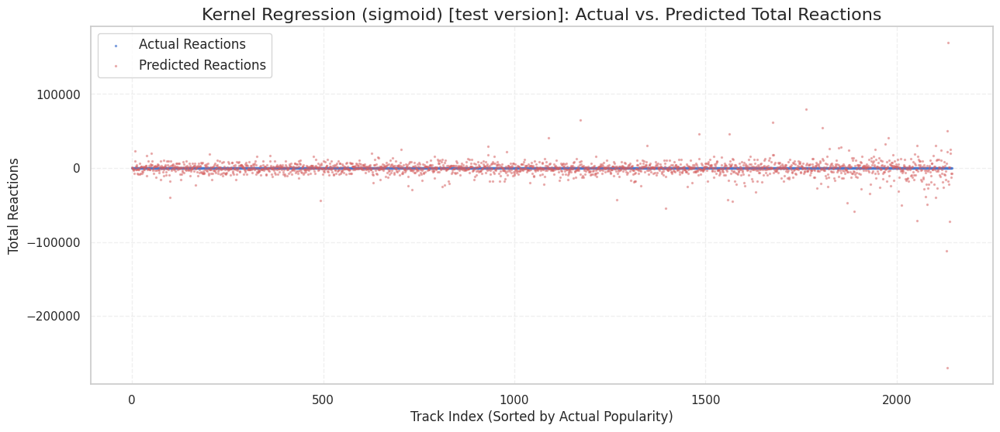
    


```python
y_pred_kr_train = kr_sig_model.predict(X_train_scaled)
plot_actual_vs_predicted("Kernel Regression (sigmoid) [train version]", y_train, y_pred_kr_train)
```


    
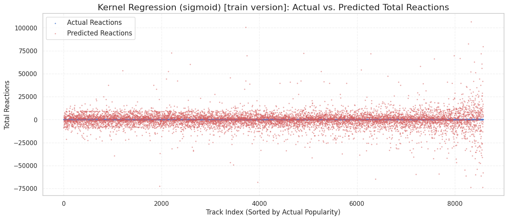
    


***Absolute Mess!!***

> I guess having a random generate to generate random number between 0 to 60 would have work much more better!


```python
# --- Kernel Ridge Regression (RBF)---
# RBF matches features based on their localized gaussian distance.
kr_rbf_model = KernelRidge(kernel='rbf', alpha=1.0, gamma=0.1)
kr_rbf_model.fit(X_train_scaled, y_train)
```


<style>#sk-container-id-7 {
  /* Definition of color scheme common for light and dark mode */
  --sklearn-color-text: #000;
  --sklearn-color-text-muted: #666;
  --sklearn-color-line: gray;
  /* Definition of color scheme for unfitted estimators */
  --sklearn-color-unfitted-level-0: #fff5e6;
  --sklearn-color-unfitted-level-1: #f6e4d2;
  --sklearn-color-unfitted-level-2: #ffe0b3;
  --sklearn-color-unfitted-level-3: chocolate;
  /* Definition of color scheme for fitted estimators */
  --sklearn-color-fitted-level-0: #f0f8ff;
  --sklearn-color-fitted-level-1: #d4ebff;
  --sklearn-color-fitted-level-2: #b3dbfd;
  --sklearn-color-fitted-level-3: cornflowerblue;
}

#sk-container-id-7.light {
  /* Specific color for light theme */
  --sklearn-color-text-on-default-background: black;
  --sklearn-color-background: white;
  --sklearn-color-border-box: black;
  --sklearn-color-icon: #696969;
}

#sk-container-id-7.dark {
  --sklearn-color-text-on-default-background: white;
  --sklearn-color-background: #111;
  --sklearn-color-border-box: white;
  --sklearn-color-icon: #878787;
}

#sk-container-id-7 {
  color: var(--sklearn-color-text);
}

#sk-container-id-7 pre {
  padding: 0;
}

#sk-container-id-7 input.sk-hidden--visually {
  border: 0;
  clip: rect(1px 1px 1px 1px);
  clip: rect(1px, 1px, 1px, 1px);
  height: 1px;
  margin: -1px;
  overflow: hidden;
  padding: 0;
  position: absolute;
  width: 1px;
}

#sk-container-id-7 div.sk-dashed-wrapped {
  border: 1px dashed var(--sklearn-color-line);
  margin: 0 0.4em 0.5em 0.4em;
  box-sizing: border-box;
  padding-bottom: 0.4em;
  background-color: var(--sklearn-color-background);
}

#sk-container-id-7 div.sk-container {
  /* jupyter's `normalize.less` sets `[hidden] { display: none; }`
     but bootstrap.min.css set `[hidden] { display: none !important; }`
     so we also need the `!important` here to be able to override the
     default hidden behavior on the sphinx rendered scikit-learn.org.
     See: https://github.com/scikit-learn/scikit-learn/issues/21755 */
  display: inline-block !important;
  position: relative;
}

#sk-container-id-7 div.sk-text-repr-fallback {
  display: none;
}

div.sk-parallel-item,
div.sk-serial,
div.sk-item {
  /* draw centered vertical line to link estimators */
  background-image: linear-gradient(var(--sklearn-color-text-on-default-background), var(--sklearn-color-text-on-default-background));
  background-size: 2px 100%;
  background-repeat: no-repeat;
  background-position: center center;
}

/* Parallel-specific style estimator block */

#sk-container-id-7 div.sk-parallel-item::after {
  content: "";
  width: 100%;
  border-bottom: 2px solid var(--sklearn-color-text-on-default-background);
  flex-grow: 1;
}

#sk-container-id-7 div.sk-parallel {
  display: flex;
  align-items: stretch;
  justify-content: center;
  background-color: var(--sklearn-color-background);
  position: relative;
}

#sk-container-id-7 div.sk-parallel-item {
  display: flex;
  flex-direction: column;
}

#sk-container-id-7 div.sk-parallel-item:first-child::after {
  align-self: flex-end;
  width: 50%;
}

#sk-container-id-7 div.sk-parallel-item:last-child::after {
  align-self: flex-start;
  width: 50%;
}

#sk-container-id-7 div.sk-parallel-item:only-child::after {
  width: 0;
}

/* Serial-specific style estimator block */

#sk-container-id-7 div.sk-serial {
  display: flex;
  flex-direction: column;
  align-items: center;
  background-color: var(--sklearn-color-background);
  padding-right: 1em;
  padding-left: 1em;
}


/* Toggleable style: style used for estimator/Pipeline/ColumnTransformer box that is
clickable and can be expanded/collapsed.
- Pipeline and ColumnTransformer use this feature and define the default style
- Estimators will overwrite some part of the style using the `sk-estimator` class
*/

/* Pipeline and ColumnTransformer style (default) */

#sk-container-id-7 div.sk-toggleable {
  /* Default theme specific background. It is overwritten whether we have a
  specific estimator or a Pipeline/ColumnTransformer */
  background-color: var(--sklearn-color-background);
}

/* Toggleable label */
#sk-container-id-7 label.sk-toggleable__label {
  cursor: pointer;
  display: flex;
  width: 100%;
  margin-bottom: 0;
  padding: 0.5em;
  box-sizing: border-box;
  text-align: center;
  align-items: center;
  justify-content: center;
  gap: 0.5em;
}

#sk-container-id-7 label.sk-toggleable__label .caption {
  font-size: 0.6rem;
  font-weight: lighter;
  color: var(--sklearn-color-text-muted);
}

#sk-container-id-7 label.sk-toggleable__label-arrow:before {
  /* Arrow on the left of the label */
  content: "▸";
  float: left;
  margin-right: 0.25em;
  color: var(--sklearn-color-icon);
}

#sk-container-id-7 label.sk-toggleable__label-arrow:hover:before {
  color: var(--sklearn-color-text);
}

/* Toggleable content - dropdown */

#sk-container-id-7 div.sk-toggleable__content {
  display: none;
  text-align: left;
  /* unfitted */
  background-color: var(--sklearn-color-unfitted-level-0);
}

#sk-container-id-7 div.sk-toggleable__content.fitted {
  /* fitted */
  background-color: var(--sklearn-color-fitted-level-0);
}

#sk-container-id-7 div.sk-toggleable__content pre {
  margin: 0.2em;
  border-radius: 0.25em;
  color: var(--sklearn-color-text);
  /* unfitted */
  background-color: var(--sklearn-color-unfitted-level-0);
}

#sk-container-id-7 div.sk-toggleable__content.fitted pre {
  /* unfitted */
  background-color: var(--sklearn-color-fitted-level-0);
}

#sk-container-id-7 input.sk-toggleable__control:checked~div.sk-toggleable__content {
  /* Expand drop-down */
  display: block;
  width: 100%;
  overflow: visible;
}

#sk-container-id-7 input.sk-toggleable__control:checked~label.sk-toggleable__label-arrow:before {
  content: "▾";
}

/* Pipeline/ColumnTransformer-specific style */

#sk-container-id-7 div.sk-label input.sk-toggleable__control:checked~label.sk-toggleable__label {
  color: var(--sklearn-color-text);
  background-color: var(--sklearn-color-unfitted-level-2);
}

#sk-container-id-7 div.sk-label.fitted input.sk-toggleable__control:checked~label.sk-toggleable__label {
  background-color: var(--sklearn-color-fitted-level-2);
}

/* Estimator-specific style */

/* Colorize estimator box */
#sk-container-id-7 div.sk-estimator input.sk-toggleable__control:checked~label.sk-toggleable__label {
  /* unfitted */
  background-color: var(--sklearn-color-unfitted-level-2);
}

#sk-container-id-7 div.sk-estimator.fitted input.sk-toggleable__control:checked~label.sk-toggleable__label {
  /* fitted */
  background-color: var(--sklearn-color-fitted-level-2);
}

#sk-container-id-7 div.sk-label label.sk-toggleable__label,
#sk-container-id-7 div.sk-label label {
  /* The background is the default theme color */
  color: var(--sklearn-color-text-on-default-background);
}

/* On hover, darken the color of the background */
#sk-container-id-7 div.sk-label:hover label.sk-toggleable__label {
  color: var(--sklearn-color-text);
  background-color: var(--sklearn-color-unfitted-level-2);
}

/* Label box, darken color on hover, fitted */
#sk-container-id-7 div.sk-label.fitted:hover label.sk-toggleable__label.fitted {
  color: var(--sklearn-color-text);
  background-color: var(--sklearn-color-fitted-level-2);
}

/* Estimator label */

#sk-container-id-7 div.sk-label label {
  font-family: monospace;
  font-weight: bold;
  line-height: 1.2em;
}

#sk-container-id-7 div.sk-label-container {
  text-align: center;
}

/* Estimator-specific */
#sk-container-id-7 div.sk-estimator {
  font-family: monospace;
  border: 1px dotted var(--sklearn-color-border-box);
  border-radius: 0.25em;
  box-sizing: border-box;
  margin-bottom: 0.5em;
  /* unfitted */
  background-color: var(--sklearn-color-unfitted-level-0);
}

#sk-container-id-7 div.sk-estimator.fitted {
  /* fitted */
  background-color: var(--sklearn-color-fitted-level-0);
}

/* on hover */
#sk-container-id-7 div.sk-estimator:hover {
  /* unfitted */
  background-color: var(--sklearn-color-unfitted-level-2);
}

#sk-container-id-7 div.sk-estimator.fitted:hover {
  /* fitted */
  background-color: var(--sklearn-color-fitted-level-2);
}

/* Specification for estimator info (e.g. "i" and "?") */

/* Common style for "i" and "?" */

.sk-estimator-doc-link,
a:link.sk-estimator-doc-link,
a:visited.sk-estimator-doc-link {
  float: right;
  font-size: smaller;
  line-height: 1em;
  font-family: monospace;
  background-color: var(--sklearn-color-unfitted-level-0);
  border-radius: 1em;
  height: 1em;
  width: 1em;
  text-decoration: none !important;
  margin-left: 0.5em;
  text-align: center;
  /* unfitted */
  border: var(--sklearn-color-unfitted-level-3) 1pt solid;
  color: var(--sklearn-color-unfitted-level-3);
}

.sk-estimator-doc-link.fitted,
a:link.sk-estimator-doc-link.fitted,
a:visited.sk-estimator-doc-link.fitted {
  /* fitted */
  background-color: var(--sklearn-color-fitted-level-0);
  border: var(--sklearn-color-fitted-level-3) 1pt solid;
  color: var(--sklearn-color-fitted-level-3);
}

/* On hover */
div.sk-estimator:hover .sk-estimator-doc-link:hover,
.sk-estimator-doc-link:hover,
div.sk-label-container:hover .sk-estimator-doc-link:hover,
.sk-estimator-doc-link:hover {
  /* unfitted */
  background-color: var(--sklearn-color-unfitted-level-3);
  border: var(--sklearn-color-fitted-level-0) 1pt solid;
  color: var(--sklearn-color-unfitted-level-0);
  text-decoration: none;
}

div.sk-estimator.fitted:hover .sk-estimator-doc-link.fitted:hover,
.sk-estimator-doc-link.fitted:hover,
div.sk-label-container:hover .sk-estimator-doc-link.fitted:hover,
.sk-estimator-doc-link.fitted:hover {
  /* fitted */
  background-color: var(--sklearn-color-fitted-level-3);
  border: var(--sklearn-color-fitted-level-0) 1pt solid;
  color: var(--sklearn-color-fitted-level-0);
  text-decoration: none;
}

/* Span, style for the box shown on hovering the info icon */
.sk-estimator-doc-link span {
  display: none;
  z-index: 9999;
  position: relative;
  font-weight: normal;
  right: .2ex;
  padding: .5ex;
  margin: .5ex;
  width: min-content;
  min-width: 20ex;
  max-width: 50ex;
  color: var(--sklearn-color-text);
  box-shadow: 2pt 2pt 4pt #999;
  /* unfitted */
  background: var(--sklearn-color-unfitted-level-0);
  border: .5pt solid var(--sklearn-color-unfitted-level-3);
}

.sk-estimator-doc-link.fitted span {
  /* fitted */
  background: var(--sklearn-color-fitted-level-0);
  border: var(--sklearn-color-fitted-level-3);
}

.sk-estimator-doc-link:hover span {
  display: block;
}

/* "?"-specific style due to the `<a>` HTML tag */

#sk-container-id-7 a.estimator_doc_link {
  float: right;
  font-size: 1rem;
  line-height: 1em;
  font-family: monospace;
  background-color: var(--sklearn-color-unfitted-level-0);
  border-radius: 1rem;
  height: 1rem;
  width: 1rem;
  text-decoration: none;
  /* unfitted */
  color: var(--sklearn-color-unfitted-level-1);
  border: var(--sklearn-color-unfitted-level-1) 1pt solid;
}

#sk-container-id-7 a.estimator_doc_link.fitted {
  /* fitted */
  background-color: var(--sklearn-color-fitted-level-0);
  border: var(--sklearn-color-fitted-level-1) 1pt solid;
  color: var(--sklearn-color-fitted-level-1);
}

/* On hover */
#sk-container-id-7 a.estimator_doc_link:hover {
  /* unfitted */
  background-color: var(--sklearn-color-unfitted-level-3);
  color: var(--sklearn-color-background);
  text-decoration: none;
}

#sk-container-id-7 a.estimator_doc_link.fitted:hover {
  /* fitted */
  background-color: var(--sklearn-color-fitted-level-3);
}

.estimator-table {
    font-family: monospace;
}

.estimator-table summary {
    padding: .5rem;
    cursor: pointer;
}

.estimator-table summary::marker {
    font-size: 0.7rem;
}

.estimator-table details[open] {
    padding-left: 0.1rem;
    padding-right: 0.1rem;
    padding-bottom: 0.3rem;
}

.estimator-table .parameters-table {
    margin-left: auto !important;
    margin-right: auto !important;
    margin-top: 0;
}

.estimator-table .parameters-table tr:nth-child(odd) {
    background-color: #fff;
}

.estimator-table .parameters-table tr:nth-child(even) {
    background-color: #f6f6f6;
}

.estimator-table .parameters-table tr:hover {
    background-color: #e0e0e0;
}

.estimator-table table td {
    border: 1px solid rgba(106, 105, 104, 0.232);
}

/*
    `table td`is set in notebook with right text-align.
    We need to overwrite it.
*/
.estimator-table table td.param {
    text-align: left;
    position: relative;
    padding: 0;
}

.user-set td {
    color:rgb(255, 94, 0);
    text-align: left !important;
}

.user-set td.value {
    color:rgb(255, 94, 0);
    background-color: transparent;
}

.default td {
    color: black;
    text-align: left !important;
}

.user-set td i,
.default td i {
    color: black;
}

/*
    Styles for parameter documentation links
    We need styling for visited so jupyter doesn't overwrite it
*/
a.param-doc-link,
a.param-doc-link:link,
a.param-doc-link:visited {
    text-decoration: underline dashed;
    text-underline-offset: .3em;
    color: inherit;
    display: block;
    padding: .5em;
}

/* "hack" to make the entire area of the cell containing the link clickable */
a.param-doc-link::before {
    position: absolute;
    content: "";
    inset: 0;
}

.param-doc-description {
    display: none;
    position: absolute;
    z-index: 9999;
    left: 0;
    padding: .5ex;
    margin-left: 1.5em;
    color: var(--sklearn-color-text);
    box-shadow: .3em .3em .4em #999;
    width: max-content;
    text-align: left;
    max-height: 10em;
    overflow-y: auto;

    /* unfitted */
    background: var(--sklearn-color-unfitted-level-0);
    border: thin solid var(--sklearn-color-unfitted-level-3);
}

/* Fitted state for parameter tooltips */
.fitted .param-doc-description {
    /* fitted */
    background: var(--sklearn-color-fitted-level-0);
    border: thin solid var(--sklearn-color-fitted-level-3);
}

.param-doc-link:hover .param-doc-description {
    display: block;
}

.copy-paste-icon {
    background-image: url();
    background-repeat: no-repeat;
    background-size: 14px 14px;
    background-position: 0;
    display: inline-block;
    width: 14px;
    height: 14px;
    cursor: pointer;
}
</style><body><div id="sk-container-id-7" class="sk-top-container"><div class="sk-text-repr-fallback"><pre>KernelRidge(alpha=1.0, gamma=0.1, kernel=&#x27;rbf&#x27;)</pre><b>In a Jupyter environment, please rerun this cell to show the HTML representation or trust the notebook. <br />On GitHub, the HTML representation is unable to render, please try loading this page with nbviewer.org.</b></div><div class="sk-container" hidden><div class="sk-item"><div class="sk-estimator fitted sk-toggleable"><input class="sk-toggleable__control sk-hidden--visually" id="sk-estimator-id-15" type="checkbox" checked><label for="sk-estimator-id-15" class="sk-toggleable__label fitted sk-toggleable__label-arrow"><div><div>KernelRidge</div></div><div><a class="sk-estimator-doc-link fitted" rel="noreferrer" target="_blank" href="https://scikit-learn.org/1.8/modules/generated/sklearn.kernel_ridge.KernelRidge.html">?<span>Documentation for KernelRidge</span></a><span class="sk-estimator-doc-link fitted">i<span>Fitted</span></span></div></label><div class="sk-toggleable__content fitted" data-param-prefix="">
        <div class="estimator-table">
            <details>
                <summary>Parameters</summary>
                <table class="parameters-table">
                  <tbody>

        <tr class="default">
            <td><i class="copy-paste-icon"
                 onclick="copyToClipboard('alpha',
                          this.parentElement.nextElementSibling)"
            ></i></td>
            <td class="param">
        <a class="param-doc-link"
            rel="noreferrer" target="_blank" href="https://scikit-learn.org/1.8/modules/generated/sklearn.kernel_ridge.KernelRidge.html#:~:text=alpha,-float%20or%20array-like%20of%20shape%20%28n_targets%2C%29%2C%20default%3D1.0">
            alpha
            <span class="param-doc-description">alpha: float or array-like of shape (n_targets,), default=1.0<br><br>Regularization strength; must be a positive float. Regularization<br>improves the conditioning of the problem and reduces the variance of<br>the estimates. Larger values specify stronger regularization.<br>Alpha corresponds to ``1 / (2C)`` in other linear models such as<br>:class:`~sklearn.linear_model.LogisticRegression` or<br>:class:`~sklearn.svm.LinearSVC`. If an array is passed, penalties are<br>assumed to be specific to the targets. Hence they must correspond in<br>number. See :ref:`ridge_regression` for formula.</span>
        </a>
    </td>
            <td class="value">1.0</td>
        </tr>


        <tr class="user-set">
            <td><i class="copy-paste-icon"
                 onclick="copyToClipboard('kernel',
                          this.parentElement.nextElementSibling)"
            ></i></td>
            <td class="param">
        <a class="param-doc-link"
            rel="noreferrer" target="_blank" href="https://scikit-learn.org/1.8/modules/generated/sklearn.kernel_ridge.KernelRidge.html#:~:text=kernel,-str%20or%20callable%2C%20default%3D%22linear%22">
            kernel
            <span class="param-doc-description">kernel: str or callable, default="linear"<br><br>Kernel mapping used internally. This parameter is directly passed to<br>:class:`~sklearn.metrics.pairwise.pairwise_kernels`.<br>If `kernel` is a string, it must be one of the metrics<br>in `pairwise.PAIRWISE_KERNEL_FUNCTIONS` or "precomputed".<br>If `kernel` is "precomputed", X is assumed to be a kernel matrix.<br>Alternatively, if `kernel` is a callable function, it is called on<br>each pair of instances (rows) and the resulting value recorded. The<br>callable should take two rows from X as input and return the<br>corresponding kernel value as a single number. This means that<br>callables from :mod:`sklearn.metrics.pairwise` are not allowed, as<br>they operate on matrices, not single samples. Use the string<br>identifying the kernel instead.</span>
        </a>
    </td>
            <td class="value">&#x27;rbf&#x27;</td>
        </tr>


        <tr class="user-set">
            <td><i class="copy-paste-icon"
                 onclick="copyToClipboard('gamma',
                          this.parentElement.nextElementSibling)"
            ></i></td>
            <td class="param">
        <a class="param-doc-link"
            rel="noreferrer" target="_blank" href="https://scikit-learn.org/1.8/modules/generated/sklearn.kernel_ridge.KernelRidge.html#:~:text=gamma,-float%2C%20default%3DNone">
            gamma
            <span class="param-doc-description">gamma: float, default=None<br><br>Gamma parameter for the RBF, laplacian, polynomial, exponential chi2<br>and sigmoid kernels. Interpretation of the default value is left to<br>the kernel; see the documentation for sklearn.metrics.pairwise.<br>Ignored by other kernels.</span>
        </a>
    </td>
            <td class="value">0.1</td>
        </tr>


        <tr class="default">
            <td><i class="copy-paste-icon"
                 onclick="copyToClipboard('degree',
                          this.parentElement.nextElementSibling)"
            ></i></td>
            <td class="param">
        <a class="param-doc-link"
            rel="noreferrer" target="_blank" href="https://scikit-learn.org/1.8/modules/generated/sklearn.kernel_ridge.KernelRidge.html#:~:text=degree,-float%2C%20default%3D3">
            degree
            <span class="param-doc-description">degree: float, default=3<br><br>Degree of the polynomial kernel. Ignored by other kernels.</span>
        </a>
    </td>
            <td class="value">3</td>
        </tr>


        <tr class="default">
            <td><i class="copy-paste-icon"
                 onclick="copyToClipboard('coef0',
                          this.parentElement.nextElementSibling)"
            ></i></td>
            <td class="param">
        <a class="param-doc-link"
            rel="noreferrer" target="_blank" href="https://scikit-learn.org/1.8/modules/generated/sklearn.kernel_ridge.KernelRidge.html#:~:text=coef0,-float%2C%20default%3D1">
            coef0
            <span class="param-doc-description">coef0: float, default=1<br><br>Zero coefficient for polynomial and sigmoid kernels.<br>Ignored by other kernels.</span>
        </a>
    </td>
            <td class="value">1</td>
        </tr>


        <tr class="default">
            <td><i class="copy-paste-icon"
                 onclick="copyToClipboard('kernel_params',
                          this.parentElement.nextElementSibling)"
            ></i></td>
            <td class="param">
        <a class="param-doc-link"
            rel="noreferrer" target="_blank" href="https://scikit-learn.org/1.8/modules/generated/sklearn.kernel_ridge.KernelRidge.html#:~:text=kernel_params,-dict%2C%20default%3DNone">
            kernel_params
            <span class="param-doc-description">kernel_params: dict, default=None<br><br>Additional parameters (keyword arguments) for kernel function passed<br>as callable object.</span>
        </a>
    </td>
            <td class="value">None</td>
        </tr>

                  </tbody>
                </table>
            </details>
        </div>
    </div></div></div></div></div><script>function copyToClipboard(text, element) {
    // Get the parameter prefix from the closest toggleable content
    const toggleableContent = element.closest('.sk-toggleable__content');
    const paramPrefix = toggleableContent ? toggleableContent.dataset.paramPrefix : '';
    const fullParamName = paramPrefix ? `${paramPrefix}${text}` : text;

    const originalStyle = element.style;
    const computedStyle = window.getComputedStyle(element);
    const originalWidth = computedStyle.width;
    const originalHTML = element.innerHTML.replace('Copied!', '');

    navigator.clipboard.writeText(fullParamName)
        .then(() => {
            element.style.width = originalWidth;
            element.style.color = 'green';
            element.innerHTML = "Copied!";

            setTimeout(() => {
                element.innerHTML = originalHTML;
                element.style = originalStyle;
            }, 2000);
        })
        .catch(err => {
            console.error('Failed to copy:', err);
            element.style.color = 'red';
            element.innerHTML = "Failed!";
            setTimeout(() => {
                element.innerHTML = originalHTML;
                element.style = originalStyle;
            }, 2000);
        });
    return false;
}

document.querySelectorAll('.copy-paste-icon').forEach(function(element) {
    const toggleableContent = element.closest('.sk-toggleable__content');
    const paramPrefix = toggleableContent ? toggleableContent.dataset.paramPrefix : '';
    const paramName = element.parentElement.nextElementSibling
        .textContent.trim().split(' ')[0];
    const fullParamName = paramPrefix ? `${paramPrefix}${paramName}` : paramName;

    element.setAttribute('title', fullParamName);
});


/**
 * Adapted from Skrub
 * https://github.com/skrub-data/skrub/blob/403466d1d5d4dc76a7ef569b3f8228db59a31dc3/skrub/_reporting/_data/templates/report.js#L789
 * @returns "light" or "dark"
 */
function detectTheme(element) {
    const body = document.querySelector('body');

    // Check VSCode theme
    const themeKindAttr = body.getAttribute('data-vscode-theme-kind');
    const themeNameAttr = body.getAttribute('data-vscode-theme-name');

    if (themeKindAttr && themeNameAttr) {
        const themeKind = themeKindAttr.toLowerCase();
        const themeName = themeNameAttr.toLowerCase();

        if (themeKind.includes("dark") || themeName.includes("dark")) {
            return "dark";
        }
        if (themeKind.includes("light") || themeName.includes("light")) {
            return "light";
        }
    }

    // Check Jupyter theme
    if (body.getAttribute('data-jp-theme-light') === 'false') {
        return 'dark';
    } else if (body.getAttribute('data-jp-theme-light') === 'true') {
        return 'light';
    }

    // Guess based on a parent element's color
    const color = window.getComputedStyle(element.parentNode, null).getPropertyValue('color');
    const match = color.match(/^rgb\s*\(\s*(\d+)\s*,\s*(\d+)\s*,\s*(\d+)\s*\)\s*$/i);
    if (match) {
        const [r, g, b] = [
            parseFloat(match[1]),
            parseFloat(match[2]),
            parseFloat(match[3])
        ];

        // https://en.wikipedia.org/wiki/HSL_and_HSV#Lightness
        const luma = 0.299 * r + 0.587 * g + 0.114 * b;

        if (luma > 180) {
            // If the text is very bright we have a dark theme
            return 'dark';
        }
        if (luma < 75) {
            // If the text is very dark we have a light theme
            return 'light';
        }
        // Otherwise fall back to the next heuristic.
    }

    // Fallback to system preference
    return window.matchMedia('(prefers-color-scheme: dark)').matches ? 'dark' : 'light';
}


function forceTheme(elementId) {
    const estimatorElement = document.querySelector(`#${elementId}`);
    if (estimatorElement === null) {
        console.error(`Element with id ${elementId} not found.`);
    } else {
        const theme = detectTheme(estimatorElement);
        estimatorElement.classList.add(theme);
    }
}

forceTheme('sk-container-id-7');</script></body>


```python
y_pred_kr = kr_rbf_model.predict(X_test_scaled)
evaluate_regression("Kernel Regression (rbf)", y_test, y_pred_kr)
```


<style type="text/css">
</style>
<table id="T_256ac">
  <thead>
    <tr>
      <th class="blank level0" >&nbsp;</th>
      <th id="T_256ac_level0_col0" class="col_heading level0 col0" >MSE</th>
      <th id="T_256ac_level0_col1" class="col_heading level0 col1" >MAE</th>
      <th id="T_256ac_level0_col2" class="col_heading level0 col2" >MAPE</th>
      <th id="T_256ac_level0_col3" class="col_heading level0 col3" >R2</th>
      <th id="T_256ac_level0_col4" class="col_heading level0 col4" >RMSLE</th>
      <th id="T_256ac_level0_col5" class="col_heading level0 col5" >MedAE</th>
    </tr>
  </thead>
  <tbody>
    <tr>
      <th id="T_256ac_level0_row0" class="row_heading level0 row0" >Linear Regression</th>
      <td id="T_256ac_row0_col0" class="data row0 col0" >19.0116</td>
      <td id="T_256ac_row0_col1" class="data row0 col1" >3.0971</td>
      <td id="T_256ac_row0_col2" class="data row0 col2" >1.80e+15</td>
      <td id="T_256ac_row0_col3" class="data row0 col3" >0.520247</td>
      <td id="T_256ac_row0_col4" class="data row0 col4" >0.7497</td>
      <td id="T_256ac_row0_col5" class="data row0 col5" >2.3612</td>
    </tr>
    <tr>
      <th id="T_256ac_level0_row1" class="row_heading level0 row1" >Linear Regression (140 parameters)</th>
      <td id="T_256ac_row1_col0" class="data row1 col0" >18.1497</td>
      <td id="T_256ac_row1_col1" class="data row1 col1" >3.0170</td>
      <td id="T_256ac_row1_col2" class="data row1 col2" >1.68e+15</td>
      <td id="T_256ac_row1_col3" class="data row1 col3" >0.541997</td>
      <td id="T_256ac_row1_col4" class="data row1 col4" >0.7234</td>
      <td id="T_256ac_row1_col5" class="data row1 col5" >2.3456</td>
    </tr>
    <tr>
      <th id="T_256ac_level0_row2" class="row_heading level0 row2" >Ridge Regression</th>
      <td id="T_256ac_row2_col0" class="data row2 col0" >19.0117</td>
      <td id="T_256ac_row2_col1" class="data row2 col1" >3.0973</td>
      <td id="T_256ac_row2_col2" class="data row2 col2" >1.80e+15</td>
      <td id="T_256ac_row2_col3" class="data row2 col3" >0.520245</td>
      <td id="T_256ac_row2_col4" class="data row2 col4" >0.7497</td>
      <td id="T_256ac_row2_col5" class="data row2 col5" >2.3651</td>
    </tr>
    <tr>
      <th id="T_256ac_level0_row3" class="row_heading level0 row3" >Ridge Regression (140 parameters)</th>
      <td id="T_256ac_row3_col0" class="data row3 col0" >18.1112</td>
      <td id="T_256ac_row3_col1" class="data row3 col1" >3.0389</td>
      <td id="T_256ac_row3_col2" class="data row3 col2" >1.72e+15</td>
      <td id="T_256ac_row3_col3" class="data row3 col3" >0.542967</td>
      <td id="T_256ac_row3_col4" class="data row3 col4" >0.7301</td>
      <td id="T_256ac_row3_col5" class="data row3 col5" >2.3560</td>
    </tr>
    <tr>
      <th id="T_256ac_level0_row4" class="row_heading level0 row4" >LASSO Regression</th>
      <td id="T_256ac_row4_col0" class="data row4 col0" >19.8151</td>
      <td id="T_256ac_row4_col1" class="data row4 col1" >3.1920</td>
      <td id="T_256ac_row4_col2" class="data row4 col2" >1.96e+15</td>
      <td id="T_256ac_row4_col3" class="data row4 col3" >0.499971</td>
      <td id="T_256ac_row4_col4" class="data row4 col4" >0.7740</td>
      <td id="T_256ac_row4_col5" class="data row4 col5" >2.4587</td>
    </tr>
    <tr>
      <th id="T_256ac_level0_row5" class="row_heading level0 row5" >LASSO Regression (140 parameters)</th>
      <td id="T_256ac_row5_col0" class="data row5 col0" >18.6116</td>
      <td id="T_256ac_row5_col1" class="data row5 col1" >3.0786</td>
      <td id="T_256ac_row5_col2" class="data row5 col2" >1.77e+15</td>
      <td id="T_256ac_row5_col3" class="data row5 col3" >0.530341</td>
      <td id="T_256ac_row5_col4" class="data row5 col4" >0.7392</td>
      <td id="T_256ac_row5_col5" class="data row5 col5" >2.3282</td>
    </tr>
    <tr>
      <th id="T_256ac_level0_row6" class="row_heading level0 row6" >Kernel Regression (sigmoid)</th>
      <td id="T_256ac_row6_col0" class="data row6 col0" >131033872.6897</td>
      <td id="T_256ac_row6_col1" class="data row6 col1" >5608.8665</td>
      <td id="T_256ac_row6_col2" class="data row6 col2" >2.42e+18</td>
      <td id="T_256ac_row6_col3" class="data row6 col3" >-3306607.784061</td>
      <td id="T_256ac_row6_col4" class="data row6 col4" >4.8050</td>
      <td id="T_256ac_row6_col5" class="data row6 col5" >3241.2011</td>
    </tr>
    <tr>
      <th id="T_256ac_level0_row7" class="row_heading level0 row7" >Kernel Regression (rbf)</th>
      <td id="T_256ac_row7_col0" class="data row7 col0" >20.7579</td>
      <td id="T_256ac_row7_col1" class="data row7 col1" >3.0593</td>
      <td id="T_256ac_row7_col2" class="data row7 col2" >1.69e+15</td>
      <td id="T_256ac_row7_col3" class="data row7 col3" >0.476178</td>
      <td id="T_256ac_row7_col4" class="data row7 col4" >0.7224</td>
      <td id="T_256ac_row7_col5" class="data row7 col5" >2.2803</td>
    </tr>
  </tbody>
</table>


```python
plot_actual_vs_predicted("Kernel Regression (sigmoid)", y_test, y_pred_kr)
```


    
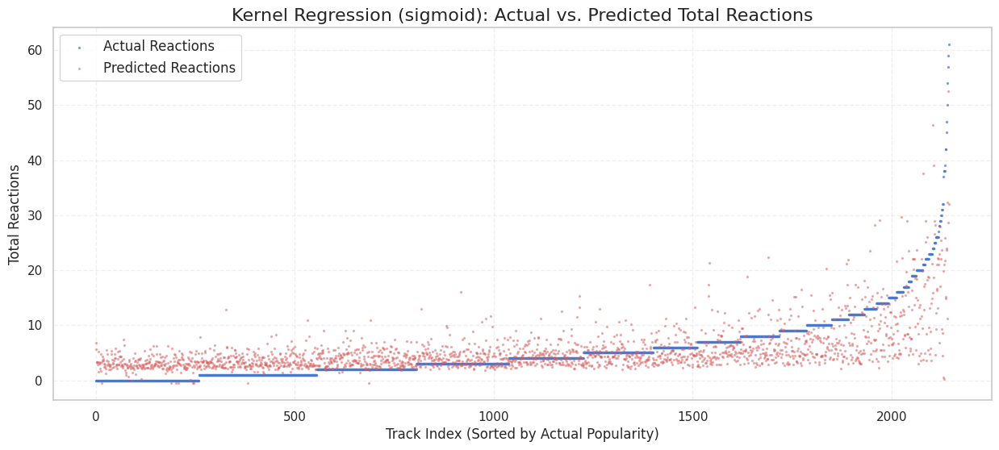
    


**Much better result than the sigmoid version but still the worst result from the R^2 prespective**

#### The Exploding Kernel Regression Collapse

Looking at the summary table, there is a massive anomaly: **Kernel Regression (RBF with default settings/unoptimized space)** and **Kernel Regression (sigmoid)** completely collapsed. 

* **Kernel Regression (sigmoid):** $R^2 = -1,045,922.29$ | $MAE = 5,366.17$
* **Kernel Regression (rbf - Row 9):** $R^2 = 0.4762$ | $MAE = 3.05$

An $R^2$ that deeply negative means the model performed significantly worse than a horizontal line drawn at the dataset's average. 

##### Why the Sigmoid Kernel Blew Up?
The Sigmoid Kernel calculates similarity using a hyperbolic tangent activation:
$$K(X_i, X_j) = \tanh(\gamma \langle X_i, X_j \rangle + c_0)$$

Because we used `KernelRidge(kernel='sigmoid')` with default hyper-parameters:
* **The Default Hyperparameter Trap:** By default, `alpha=1` (regularization) and `gamma=None` (which defaults to $1 / n_{\text{features}}$). 
* **The Saturation Phenomenon:** When features are highly dense, or if the variance shifts, the dot product inside the $\tanh$ function gets large. The sigmoid function completely saturates at its extreme limits ($+1$ or $-1$). 
* **The Mathematical Result:** The kernel matrix becomes highly singular and unstable (ill-conditioned). When Ridge attempts to invert this matrix to solve for dual coefficients, the math collapses. The model outputs wildly extreme, erratic coefficients, resulting in individual predictions missing by thousands of reactions.


### 1.5 Desision Tree Regression (Optional)
We chose **Decision Tree Regression** as our optional model as it solves nonlinearity by splitting feature spaces instead!


```python
# --- Decision Tree Regression (Bonus) ---
dt_model = DecisionTreeRegressor(max_depth=5, random_state=42)
dt_model.fit(X_train_scaled, y_train)
```


<style>#sk-container-id-8 {
  /* Definition of color scheme common for light and dark mode */
  --sklearn-color-text: #000;
  --sklearn-color-text-muted: #666;
  --sklearn-color-line: gray;
  /* Definition of color scheme for unfitted estimators */
  --sklearn-color-unfitted-level-0: #fff5e6;
  --sklearn-color-unfitted-level-1: #f6e4d2;
  --sklearn-color-unfitted-level-2: #ffe0b3;
  --sklearn-color-unfitted-level-3: chocolate;
  /* Definition of color scheme for fitted estimators */
  --sklearn-color-fitted-level-0: #f0f8ff;
  --sklearn-color-fitted-level-1: #d4ebff;
  --sklearn-color-fitted-level-2: #b3dbfd;
  --sklearn-color-fitted-level-3: cornflowerblue;
}

#sk-container-id-8.light {
  /* Specific color for light theme */
  --sklearn-color-text-on-default-background: black;
  --sklearn-color-background: white;
  --sklearn-color-border-box: black;
  --sklearn-color-icon: #696969;
}

#sk-container-id-8.dark {
  --sklearn-color-text-on-default-background: white;
  --sklearn-color-background: #111;
  --sklearn-color-border-box: white;
  --sklearn-color-icon: #878787;
}

#sk-container-id-8 {
  color: var(--sklearn-color-text);
}

#sk-container-id-8 pre {
  padding: 0;
}

#sk-container-id-8 input.sk-hidden--visually {
  border: 0;
  clip: rect(1px 1px 1px 1px);
  clip: rect(1px, 1px, 1px, 1px);
  height: 1px;
  margin: -1px;
  overflow: hidden;
  padding: 0;
  position: absolute;
  width: 1px;
}

#sk-container-id-8 div.sk-dashed-wrapped {
  border: 1px dashed var(--sklearn-color-line);
  margin: 0 0.4em 0.5em 0.4em;
  box-sizing: border-box;
  padding-bottom: 0.4em;
  background-color: var(--sklearn-color-background);
}

#sk-container-id-8 div.sk-container {
  /* jupyter's `normalize.less` sets `[hidden] { display: none; }`
     but bootstrap.min.css set `[hidden] { display: none !important; }`
     so we also need the `!important` here to be able to override the
     default hidden behavior on the sphinx rendered scikit-learn.org.
     See: https://github.com/scikit-learn/scikit-learn/issues/21755 */
  display: inline-block !important;
  position: relative;
}

#sk-container-id-8 div.sk-text-repr-fallback {
  display: none;
}

div.sk-parallel-item,
div.sk-serial,
div.sk-item {
  /* draw centered vertical line to link estimators */
  background-image: linear-gradient(var(--sklearn-color-text-on-default-background), var(--sklearn-color-text-on-default-background));
  background-size: 2px 100%;
  background-repeat: no-repeat;
  background-position: center center;
}

/* Parallel-specific style estimator block */

#sk-container-id-8 div.sk-parallel-item::after {
  content: "";
  width: 100%;
  border-bottom: 2px solid var(--sklearn-color-text-on-default-background);
  flex-grow: 1;
}

#sk-container-id-8 div.sk-parallel {
  display: flex;
  align-items: stretch;
  justify-content: center;
  background-color: var(--sklearn-color-background);
  position: relative;
}

#sk-container-id-8 div.sk-parallel-item {
  display: flex;
  flex-direction: column;
}

#sk-container-id-8 div.sk-parallel-item:first-child::after {
  align-self: flex-end;
  width: 50%;
}

#sk-container-id-8 div.sk-parallel-item:last-child::after {
  align-self: flex-start;
  width: 50%;
}

#sk-container-id-8 div.sk-parallel-item:only-child::after {
  width: 0;
}

/* Serial-specific style estimator block */

#sk-container-id-8 div.sk-serial {
  display: flex;
  flex-direction: column;
  align-items: center;
  background-color: var(--sklearn-color-background);
  padding-right: 1em;
  padding-left: 1em;
}


/* Toggleable style: style used for estimator/Pipeline/ColumnTransformer box that is
clickable and can be expanded/collapsed.
- Pipeline and ColumnTransformer use this feature and define the default style
- Estimators will overwrite some part of the style using the `sk-estimator` class
*/

/* Pipeline and ColumnTransformer style (default) */

#sk-container-id-8 div.sk-toggleable {
  /* Default theme specific background. It is overwritten whether we have a
  specific estimator or a Pipeline/ColumnTransformer */
  background-color: var(--sklearn-color-background);
}

/* Toggleable label */
#sk-container-id-8 label.sk-toggleable__label {
  cursor: pointer;
  display: flex;
  width: 100%;
  margin-bottom: 0;
  padding: 0.5em;
  box-sizing: border-box;
  text-align: center;
  align-items: center;
  justify-content: center;
  gap: 0.5em;
}

#sk-container-id-8 label.sk-toggleable__label .caption {
  font-size: 0.6rem;
  font-weight: lighter;
  color: var(--sklearn-color-text-muted);
}

#sk-container-id-8 label.sk-toggleable__label-arrow:before {
  /* Arrow on the left of the label */
  content: "▸";
  float: left;
  margin-right: 0.25em;
  color: var(--sklearn-color-icon);
}

#sk-container-id-8 label.sk-toggleable__label-arrow:hover:before {
  color: var(--sklearn-color-text);
}

/* Toggleable content - dropdown */

#sk-container-id-8 div.sk-toggleable__content {
  display: none;
  text-align: left;
  /* unfitted */
  background-color: var(--sklearn-color-unfitted-level-0);
}

#sk-container-id-8 div.sk-toggleable__content.fitted {
  /* fitted */
  background-color: var(--sklearn-color-fitted-level-0);
}

#sk-container-id-8 div.sk-toggleable__content pre {
  margin: 0.2em;
  border-radius: 0.25em;
  color: var(--sklearn-color-text);
  /* unfitted */
  background-color: var(--sklearn-color-unfitted-level-0);
}

#sk-container-id-8 div.sk-toggleable__content.fitted pre {
  /* unfitted */
  background-color: var(--sklearn-color-fitted-level-0);
}

#sk-container-id-8 input.sk-toggleable__control:checked~div.sk-toggleable__content {
  /* Expand drop-down */
  display: block;
  width: 100%;
  overflow: visible;
}

#sk-container-id-8 input.sk-toggleable__control:checked~label.sk-toggleable__label-arrow:before {
  content: "▾";
}

/* Pipeline/ColumnTransformer-specific style */

#sk-container-id-8 div.sk-label input.sk-toggleable__control:checked~label.sk-toggleable__label {
  color: var(--sklearn-color-text);
  background-color: var(--sklearn-color-unfitted-level-2);
}

#sk-container-id-8 div.sk-label.fitted input.sk-toggleable__control:checked~label.sk-toggleable__label {
  background-color: var(--sklearn-color-fitted-level-2);
}

/* Estimator-specific style */

/* Colorize estimator box */
#sk-container-id-8 div.sk-estimator input.sk-toggleable__control:checked~label.sk-toggleable__label {
  /* unfitted */
  background-color: var(--sklearn-color-unfitted-level-2);
}

#sk-container-id-8 div.sk-estimator.fitted input.sk-toggleable__control:checked~label.sk-toggleable__label {
  /* fitted */
  background-color: var(--sklearn-color-fitted-level-2);
}

#sk-container-id-8 div.sk-label label.sk-toggleable__label,
#sk-container-id-8 div.sk-label label {
  /* The background is the default theme color */
  color: var(--sklearn-color-text-on-default-background);
}

/* On hover, darken the color of the background */
#sk-container-id-8 div.sk-label:hover label.sk-toggleable__label {
  color: var(--sklearn-color-text);
  background-color: var(--sklearn-color-unfitted-level-2);
}

/* Label box, darken color on hover, fitted */
#sk-container-id-8 div.sk-label.fitted:hover label.sk-toggleable__label.fitted {
  color: var(--sklearn-color-text);
  background-color: var(--sklearn-color-fitted-level-2);
}

/* Estimator label */

#sk-container-id-8 div.sk-label label {
  font-family: monospace;
  font-weight: bold;
  line-height: 1.2em;
}

#sk-container-id-8 div.sk-label-container {
  text-align: center;
}

/* Estimator-specific */
#sk-container-id-8 div.sk-estimator {
  font-family: monospace;
  border: 1px dotted var(--sklearn-color-border-box);
  border-radius: 0.25em;
  box-sizing: border-box;
  margin-bottom: 0.5em;
  /* unfitted */
  background-color: var(--sklearn-color-unfitted-level-0);
}

#sk-container-id-8 div.sk-estimator.fitted {
  /* fitted */
  background-color: var(--sklearn-color-fitted-level-0);
}

/* on hover */
#sk-container-id-8 div.sk-estimator:hover {
  /* unfitted */
  background-color: var(--sklearn-color-unfitted-level-2);
}

#sk-container-id-8 div.sk-estimator.fitted:hover {
  /* fitted */
  background-color: var(--sklearn-color-fitted-level-2);
}

/* Specification for estimator info (e.g. "i" and "?") */

/* Common style for "i" and "?" */

.sk-estimator-doc-link,
a:link.sk-estimator-doc-link,
a:visited.sk-estimator-doc-link {
  float: right;
  font-size: smaller;
  line-height: 1em;
  font-family: monospace;
  background-color: var(--sklearn-color-unfitted-level-0);
  border-radius: 1em;
  height: 1em;
  width: 1em;
  text-decoration: none !important;
  margin-left: 0.5em;
  text-align: center;
  /* unfitted */
  border: var(--sklearn-color-unfitted-level-3) 1pt solid;
  color: var(--sklearn-color-unfitted-level-3);
}

.sk-estimator-doc-link.fitted,
a:link.sk-estimator-doc-link.fitted,
a:visited.sk-estimator-doc-link.fitted {
  /* fitted */
  background-color: var(--sklearn-color-fitted-level-0);
  border: var(--sklearn-color-fitted-level-3) 1pt solid;
  color: var(--sklearn-color-fitted-level-3);
}

/* On hover */
div.sk-estimator:hover .sk-estimator-doc-link:hover,
.sk-estimator-doc-link:hover,
div.sk-label-container:hover .sk-estimator-doc-link:hover,
.sk-estimator-doc-link:hover {
  /* unfitted */
  background-color: var(--sklearn-color-unfitted-level-3);
  border: var(--sklearn-color-fitted-level-0) 1pt solid;
  color: var(--sklearn-color-unfitted-level-0);
  text-decoration: none;
}

div.sk-estimator.fitted:hover .sk-estimator-doc-link.fitted:hover,
.sk-estimator-doc-link.fitted:hover,
div.sk-label-container:hover .sk-estimator-doc-link.fitted:hover,
.sk-estimator-doc-link.fitted:hover {
  /* fitted */
  background-color: var(--sklearn-color-fitted-level-3);
  border: var(--sklearn-color-fitted-level-0) 1pt solid;
  color: var(--sklearn-color-fitted-level-0);
  text-decoration: none;
}

/* Span, style for the box shown on hovering the info icon */
.sk-estimator-doc-link span {
  display: none;
  z-index: 9999;
  position: relative;
  font-weight: normal;
  right: .2ex;
  padding: .5ex;
  margin: .5ex;
  width: min-content;
  min-width: 20ex;
  max-width: 50ex;
  color: var(--sklearn-color-text);
  box-shadow: 2pt 2pt 4pt #999;
  /* unfitted */
  background: var(--sklearn-color-unfitted-level-0);
  border: .5pt solid var(--sklearn-color-unfitted-level-3);
}

.sk-estimator-doc-link.fitted span {
  /* fitted */
  background: var(--sklearn-color-fitted-level-0);
  border: var(--sklearn-color-fitted-level-3);
}

.sk-estimator-doc-link:hover span {
  display: block;
}

/* "?"-specific style due to the `<a>` HTML tag */

#sk-container-id-8 a.estimator_doc_link {
  float: right;
  font-size: 1rem;
  line-height: 1em;
  font-family: monospace;
  background-color: var(--sklearn-color-unfitted-level-0);
  border-radius: 1rem;
  height: 1rem;
  width: 1rem;
  text-decoration: none;
  /* unfitted */
  color: var(--sklearn-color-unfitted-level-1);
  border: var(--sklearn-color-unfitted-level-1) 1pt solid;
}

#sk-container-id-8 a.estimator_doc_link.fitted {
  /* fitted */
  background-color: var(--sklearn-color-fitted-level-0);
  border: var(--sklearn-color-fitted-level-1) 1pt solid;
  color: var(--sklearn-color-fitted-level-1);
}

/* On hover */
#sk-container-id-8 a.estimator_doc_link:hover {
  /* unfitted */
  background-color: var(--sklearn-color-unfitted-level-3);
  color: var(--sklearn-color-background);
  text-decoration: none;
}

#sk-container-id-8 a.estimator_doc_link.fitted:hover {
  /* fitted */
  background-color: var(--sklearn-color-fitted-level-3);
}

.estimator-table {
    font-family: monospace;
}

.estimator-table summary {
    padding: .5rem;
    cursor: pointer;
}

.estimator-table summary::marker {
    font-size: 0.7rem;
}

.estimator-table details[open] {
    padding-left: 0.1rem;
    padding-right: 0.1rem;
    padding-bottom: 0.3rem;
}

.estimator-table .parameters-table {
    margin-left: auto !important;
    margin-right: auto !important;
    margin-top: 0;
}

.estimator-table .parameters-table tr:nth-child(odd) {
    background-color: #fff;
}

.estimator-table .parameters-table tr:nth-child(even) {
    background-color: #f6f6f6;
}

.estimator-table .parameters-table tr:hover {
    background-color: #e0e0e0;
}

.estimator-table table td {
    border: 1px solid rgba(106, 105, 104, 0.232);
}

/*
    `table td`is set in notebook with right text-align.
    We need to overwrite it.
*/
.estimator-table table td.param {
    text-align: left;
    position: relative;
    padding: 0;
}

.user-set td {
    color:rgb(255, 94, 0);
    text-align: left !important;
}

.user-set td.value {
    color:rgb(255, 94, 0);
    background-color: transparent;
}

.default td {
    color: black;
    text-align: left !important;
}

.user-set td i,
.default td i {
    color: black;
}

/*
    Styles for parameter documentation links
    We need styling for visited so jupyter doesn't overwrite it
*/
a.param-doc-link,
a.param-doc-link:link,
a.param-doc-link:visited {
    text-decoration: underline dashed;
    text-underline-offset: .3em;
    color: inherit;
    display: block;
    padding: .5em;
}

/* "hack" to make the entire area of the cell containing the link clickable */
a.param-doc-link::before {
    position: absolute;
    content: "";
    inset: 0;
}

.param-doc-description {
    display: none;
    position: absolute;
    z-index: 9999;
    left: 0;
    padding: .5ex;
    margin-left: 1.5em;
    color: var(--sklearn-color-text);
    box-shadow: .3em .3em .4em #999;
    width: max-content;
    text-align: left;
    max-height: 10em;
    overflow-y: auto;

    /* unfitted */
    background: var(--sklearn-color-unfitted-level-0);
    border: thin solid var(--sklearn-color-unfitted-level-3);
}

/* Fitted state for parameter tooltips */
.fitted .param-doc-description {
    /* fitted */
    background: var(--sklearn-color-fitted-level-0);
    border: thin solid var(--sklearn-color-fitted-level-3);
}

.param-doc-link:hover .param-doc-description {
    display: block;
}

.copy-paste-icon {
    background-image: url();
    background-repeat: no-repeat;
    background-size: 14px 14px;
    background-position: 0;
    display: inline-block;
    width: 14px;
    height: 14px;
    cursor: pointer;
}
</style><body><div id="sk-container-id-8" class="sk-top-container"><div class="sk-text-repr-fallback"><pre>DecisionTreeRegressor(max_depth=5, random_state=42)</pre><b>In a Jupyter environment, please rerun this cell to show the HTML representation or trust the notebook. <br />On GitHub, the HTML representation is unable to render, please try loading this page with nbviewer.org.</b></div><div class="sk-container" hidden><div class="sk-item"><div class="sk-estimator fitted sk-toggleable"><input class="sk-toggleable__control sk-hidden--visually" id="sk-estimator-id-16" type="checkbox" checked><label for="sk-estimator-id-16" class="sk-toggleable__label fitted sk-toggleable__label-arrow"><div><div>DecisionTreeRegressor</div></div><div><a class="sk-estimator-doc-link fitted" rel="noreferrer" target="_blank" href="https://scikit-learn.org/1.8/modules/generated/sklearn.tree.DecisionTreeRegressor.html">?<span>Documentation for DecisionTreeRegressor</span></a><span class="sk-estimator-doc-link fitted">i<span>Fitted</span></span></div></label><div class="sk-toggleable__content fitted" data-param-prefix="">
        <div class="estimator-table">
            <details>
                <summary>Parameters</summary>
                <table class="parameters-table">
                  <tbody>

        <tr class="default">
            <td><i class="copy-paste-icon"
                 onclick="copyToClipboard('criterion',
                          this.parentElement.nextElementSibling)"
            ></i></td>
            <td class="param">
        <a class="param-doc-link"
            rel="noreferrer" target="_blank" href="https://scikit-learn.org/1.8/modules/generated/sklearn.tree.DecisionTreeRegressor.html#:~:text=criterion,-%7B%22squared_error%22%2C%20%22friedman_mse%22%2C%20%22absolute_error%22%2C%20%20%20%20%20%20%20%20%20%20%20%20%20%22poisson%22%7D%2C%20default%3D%22squared_error%22">
            criterion
            <span class="param-doc-description">criterion: {"squared_error", "friedman_mse", "absolute_error",             "poisson"}, default="squared_error"<br><br>The function to measure the quality of a split. Supported criteria<br>are "squared_error" for the mean squared error, which is equal to<br>variance reduction as feature selection criterion and minimizes the L2<br>loss using the mean of each terminal node, "friedman_mse", which uses<br>mean squared error with Friedman's improvement score for potential<br>splits, "absolute_error" for the mean absolute error, which minimizes<br>the L1 loss using the median of each terminal node, and "poisson" which<br>uses reduction in the half mean Poisson deviance to find splits.<br><br>.. versionadded:: 0.18<br>   Mean Absolute Error (MAE) criterion.<br><br>.. versionadded:: 0.24<br>    Poisson deviance criterion.</span>
        </a>
    </td>
            <td class="value">&#x27;squared_error&#x27;</td>
        </tr>


        <tr class="default">
            <td><i class="copy-paste-icon"
                 onclick="copyToClipboard('splitter',
                          this.parentElement.nextElementSibling)"
            ></i></td>
            <td class="param">
        <a class="param-doc-link"
            rel="noreferrer" target="_blank" href="https://scikit-learn.org/1.8/modules/generated/sklearn.tree.DecisionTreeRegressor.html#:~:text=splitter,-%7B%22best%22%2C%20%22random%22%7D%2C%20default%3D%22best%22">
            splitter
            <span class="param-doc-description">splitter: {"best", "random"}, default="best"<br><br>The strategy used to choose the split at each node. Supported<br>strategies are "best" to choose the best split and "random" to choose<br>the best random split.</span>
        </a>
    </td>
            <td class="value">&#x27;best&#x27;</td>
        </tr>


        <tr class="user-set">
            <td><i class="copy-paste-icon"
                 onclick="copyToClipboard('max_depth',
                          this.parentElement.nextElementSibling)"
            ></i></td>
            <td class="param">
        <a class="param-doc-link"
            rel="noreferrer" target="_blank" href="https://scikit-learn.org/1.8/modules/generated/sklearn.tree.DecisionTreeRegressor.html#:~:text=max_depth,-int%2C%20default%3DNone">
            max_depth
            <span class="param-doc-description">max_depth: int, default=None<br><br>The maximum depth of the tree. If None, then nodes are expanded until<br>all leaves are pure or until all leaves contain less than<br>min_samples_split samples.<br><br>For an example of how ``max_depth`` influences the model, see<br>:ref:`sphx_glr_auto_examples_tree_plot_tree_regression.py`.</span>
        </a>
    </td>
            <td class="value">5</td>
        </tr>


        <tr class="default">
            <td><i class="copy-paste-icon"
                 onclick="copyToClipboard('min_samples_split',
                          this.parentElement.nextElementSibling)"
            ></i></td>
            <td class="param">
        <a class="param-doc-link"
            rel="noreferrer" target="_blank" href="https://scikit-learn.org/1.8/modules/generated/sklearn.tree.DecisionTreeRegressor.html#:~:text=min_samples_split,-int%20or%20float%2C%20default%3D2">
            min_samples_split
            <span class="param-doc-description">min_samples_split: int or float, default=2<br><br>The minimum number of samples required to split an internal node:<br><br>- If int, then consider `min_samples_split` as the minimum number.<br>- If float, then `min_samples_split` is a fraction and<br>  `ceil(min_samples_split * n_samples)` are the minimum<br>  number of samples for each split.<br><br>.. versionchanged:: 0.18<br>   Added float values for fractions.</span>
        </a>
    </td>
            <td class="value">2</td>
        </tr>


        <tr class="default">
            <td><i class="copy-paste-icon"
                 onclick="copyToClipboard('min_samples_leaf',
                          this.parentElement.nextElementSibling)"
            ></i></td>
            <td class="param">
        <a class="param-doc-link"
            rel="noreferrer" target="_blank" href="https://scikit-learn.org/1.8/modules/generated/sklearn.tree.DecisionTreeRegressor.html#:~:text=min_samples_leaf,-int%20or%20float%2C%20default%3D1">
            min_samples_leaf
            <span class="param-doc-description">min_samples_leaf: int or float, default=1<br><br>The minimum number of samples required to be at a leaf node.<br>A split point at any depth will only be considered if it leaves at<br>least ``min_samples_leaf`` training samples in each of the left and<br>right branches.  This may have the effect of smoothing the model,<br>especially in regression.<br><br>- If int, then consider `min_samples_leaf` as the minimum number.<br>- If float, then `min_samples_leaf` is a fraction and<br>  `ceil(min_samples_leaf * n_samples)` are the minimum<br>  number of samples for each node.<br><br>.. versionchanged:: 0.18<br>   Added float values for fractions.</span>
        </a>
    </td>
            <td class="value">1</td>
        </tr>


        <tr class="default">
            <td><i class="copy-paste-icon"
                 onclick="copyToClipboard('min_weight_fraction_leaf',
                          this.parentElement.nextElementSibling)"
            ></i></td>
            <td class="param">
        <a class="param-doc-link"
            rel="noreferrer" target="_blank" href="https://scikit-learn.org/1.8/modules/generated/sklearn.tree.DecisionTreeRegressor.html#:~:text=min_weight_fraction_leaf,-float%2C%20default%3D0.0">
            min_weight_fraction_leaf
            <span class="param-doc-description">min_weight_fraction_leaf: float, default=0.0<br><br>The minimum weighted fraction of the sum total of weights (of all<br>the input samples) required to be at a leaf node. Samples have<br>equal weight when sample_weight is not provided.</span>
        </a>
    </td>
            <td class="value">0.0</td>
        </tr>


        <tr class="default">
            <td><i class="copy-paste-icon"
                 onclick="copyToClipboard('max_features',
                          this.parentElement.nextElementSibling)"
            ></i></td>
            <td class="param">
        <a class="param-doc-link"
            rel="noreferrer" target="_blank" href="https://scikit-learn.org/1.8/modules/generated/sklearn.tree.DecisionTreeRegressor.html#:~:text=max_features,-int%2C%20float%20or%20%7B%22sqrt%22%2C%20%22log2%22%7D%2C%20default%3DNone">
            max_features
            <span class="param-doc-description">max_features: int, float or {"sqrt", "log2"}, default=None<br><br>The number of features to consider when looking for the best split:<br><br>- If int, then consider `max_features` features at each split.<br>- If float, then `max_features` is a fraction and<br>  `max(1, int(max_features * n_features_in_))` features are considered at each<br>  split.<br>- If "sqrt", then `max_features=sqrt(n_features)`.<br>- If "log2", then `max_features=log2(n_features)`.<br>- If None, then `max_features=n_features`.<br><br>Note: the search for a split does not stop until at least one<br>valid partition of the node samples is found, even if it requires to<br>effectively inspect more than ``max_features`` features.</span>
        </a>
    </td>
            <td class="value">None</td>
        </tr>


        <tr class="user-set">
            <td><i class="copy-paste-icon"
                 onclick="copyToClipboard('random_state',
                          this.parentElement.nextElementSibling)"
            ></i></td>
            <td class="param">
        <a class="param-doc-link"
            rel="noreferrer" target="_blank" href="https://scikit-learn.org/1.8/modules/generated/sklearn.tree.DecisionTreeRegressor.html#:~:text=random_state,-int%2C%20RandomState%20instance%20or%20None%2C%20default%3DNone">
            random_state
            <span class="param-doc-description">random_state: int, RandomState instance or None, default=None<br><br>Controls the randomness of the estimator. The features are always<br>randomly permuted at each split, even if ``splitter`` is set to<br>``"best"``. When ``max_features < n_features``, the algorithm will<br>select ``max_features`` at random at each split before finding the best<br>split among them. But the best found split may vary across different<br>runs, even if ``max_features=n_features``. That is the case, if the<br>improvement of the criterion is identical for several splits and one<br>split has to be selected at random. To obtain a deterministic behaviour<br>during fitting, ``random_state`` has to be fixed to an integer.<br>See :term:`Glossary <random_state>` for details.</span>
        </a>
    </td>
            <td class="value">42</td>
        </tr>


        <tr class="default">
            <td><i class="copy-paste-icon"
                 onclick="copyToClipboard('max_leaf_nodes',
                          this.parentElement.nextElementSibling)"
            ></i></td>
            <td class="param">
        <a class="param-doc-link"
            rel="noreferrer" target="_blank" href="https://scikit-learn.org/1.8/modules/generated/sklearn.tree.DecisionTreeRegressor.html#:~:text=max_leaf_nodes,-int%2C%20default%3DNone">
            max_leaf_nodes
            <span class="param-doc-description">max_leaf_nodes: int, default=None<br><br>Grow a tree with ``max_leaf_nodes`` in best-first fashion.<br>Best nodes are defined as relative reduction in impurity.<br>If None then unlimited number of leaf nodes.</span>
        </a>
    </td>
            <td class="value">None</td>
        </tr>


        <tr class="default">
            <td><i class="copy-paste-icon"
                 onclick="copyToClipboard('min_impurity_decrease',
                          this.parentElement.nextElementSibling)"
            ></i></td>
            <td class="param">
        <a class="param-doc-link"
            rel="noreferrer" target="_blank" href="https://scikit-learn.org/1.8/modules/generated/sklearn.tree.DecisionTreeRegressor.html#:~:text=min_impurity_decrease,-float%2C%20default%3D0.0">
            min_impurity_decrease
            <span class="param-doc-description">min_impurity_decrease: float, default=0.0<br><br>A node will be split if this split induces a decrease of the impurity<br>greater than or equal to this value.<br><br>The weighted impurity decrease equation is the following::<br><br>    N_t / N * (impurity - N_t_R / N_t * right_impurity<br>                        - N_t_L / N_t * left_impurity)<br><br>where ``N`` is the total number of samples, ``N_t`` is the number of<br>samples at the current node, ``N_t_L`` is the number of samples in the<br>left child, and ``N_t_R`` is the number of samples in the right child.<br><br>``N``, ``N_t``, ``N_t_R`` and ``N_t_L`` all refer to the weighted sum,<br>if ``sample_weight`` is passed.<br><br>.. versionadded:: 0.19</span>
        </a>
    </td>
            <td class="value">0.0</td>
        </tr>


        <tr class="default">
            <td><i class="copy-paste-icon"
                 onclick="copyToClipboard('ccp_alpha',
                          this.parentElement.nextElementSibling)"
            ></i></td>
            <td class="param">
        <a class="param-doc-link"
            rel="noreferrer" target="_blank" href="https://scikit-learn.org/1.8/modules/generated/sklearn.tree.DecisionTreeRegressor.html#:~:text=ccp_alpha,-non-negative%20float%2C%20default%3D0.0">
            ccp_alpha
            <span class="param-doc-description">ccp_alpha: non-negative float, default=0.0<br><br>Complexity parameter used for Minimal Cost-Complexity Pruning. The<br>subtree with the largest cost complexity that is smaller than<br>``ccp_alpha`` will be chosen. By default, no pruning is performed. See<br>:ref:`minimal_cost_complexity_pruning` for details. See<br>:ref:`sphx_glr_auto_examples_tree_plot_cost_complexity_pruning.py`<br>for an example of such pruning.<br><br>.. versionadded:: 0.22</span>
        </a>
    </td>
            <td class="value">0.0</td>
        </tr>


        <tr class="default">
            <td><i class="copy-paste-icon"
                 onclick="copyToClipboard('monotonic_cst',
                          this.parentElement.nextElementSibling)"
            ></i></td>
            <td class="param">
        <a class="param-doc-link"
            rel="noreferrer" target="_blank" href="https://scikit-learn.org/1.8/modules/generated/sklearn.tree.DecisionTreeRegressor.html#:~:text=monotonic_cst,-array-like%20of%20int%20of%20shape%20%28n_features%29%2C%20default%3DNone">
            monotonic_cst
            <span class="param-doc-description">monotonic_cst: array-like of int of shape (n_features), default=None<br><br>Indicates the monotonicity constraint to enforce on each feature.<br>  - 1: monotonic increase<br>  - 0: no constraint<br>  - -1: monotonic decrease<br><br>If monotonic_cst is None, no constraints are applied.<br><br>Monotonicity constraints are not supported for:<br>  - multioutput regressions (i.e. when `n_outputs_ > 1`),<br>  - regressions trained on data with missing values.<br><br>Read more in the :ref:`User Guide <monotonic_cst_gbdt>`.<br><br>.. versionadded:: 1.4</span>
        </a>
    </td>
            <td class="value">None</td>
        </tr>

                  </tbody>
                </table>
            </details>
        </div>
    </div></div></div></div></div><script>function copyToClipboard(text, element) {
    // Get the parameter prefix from the closest toggleable content
    const toggleableContent = element.closest('.sk-toggleable__content');
    const paramPrefix = toggleableContent ? toggleableContent.dataset.paramPrefix : '';
    const fullParamName = paramPrefix ? `${paramPrefix}${text}` : text;

    const originalStyle = element.style;
    const computedStyle = window.getComputedStyle(element);
    const originalWidth = computedStyle.width;
    const originalHTML = element.innerHTML.replace('Copied!', '');

    navigator.clipboard.writeText(fullParamName)
        .then(() => {
            element.style.width = originalWidth;
            element.style.color = 'green';
            element.innerHTML = "Copied!";

            setTimeout(() => {
                element.innerHTML = originalHTML;
                element.style = originalStyle;
            }, 2000);
        })
        .catch(err => {
            console.error('Failed to copy:', err);
            element.style.color = 'red';
            element.innerHTML = "Failed!";
            setTimeout(() => {
                element.innerHTML = originalHTML;
                element.style = originalStyle;
            }, 2000);
        });
    return false;
}

document.querySelectorAll('.copy-paste-icon').forEach(function(element) {
    const toggleableContent = element.closest('.sk-toggleable__content');
    const paramPrefix = toggleableContent ? toggleableContent.dataset.paramPrefix : '';
    const paramName = element.parentElement.nextElementSibling
        .textContent.trim().split(' ')[0];
    const fullParamName = paramPrefix ? `${paramPrefix}${paramName}` : paramName;

    element.setAttribute('title', fullParamName);
});


/**
 * Adapted from Skrub
 * https://github.com/skrub-data/skrub/blob/403466d1d5d4dc76a7ef569b3f8228db59a31dc3/skrub/_reporting/_data/templates/report.js#L789
 * @returns "light" or "dark"
 */
function detectTheme(element) {
    const body = document.querySelector('body');

    // Check VSCode theme
    const themeKindAttr = body.getAttribute('data-vscode-theme-kind');
    const themeNameAttr = body.getAttribute('data-vscode-theme-name');

    if (themeKindAttr && themeNameAttr) {
        const themeKind = themeKindAttr.toLowerCase();
        const themeName = themeNameAttr.toLowerCase();

        if (themeKind.includes("dark") || themeName.includes("dark")) {
            return "dark";
        }
        if (themeKind.includes("light") || themeName.includes("light")) {
            return "light";
        }
    }

    // Check Jupyter theme
    if (body.getAttribute('data-jp-theme-light') === 'false') {
        return 'dark';
    } else if (body.getAttribute('data-jp-theme-light') === 'true') {
        return 'light';
    }

    // Guess based on a parent element's color
    const color = window.getComputedStyle(element.parentNode, null).getPropertyValue('color');
    const match = color.match(/^rgb\s*\(\s*(\d+)\s*,\s*(\d+)\s*,\s*(\d+)\s*\)\s*$/i);
    if (match) {
        const [r, g, b] = [
            parseFloat(match[1]),
            parseFloat(match[2]),
            parseFloat(match[3])
        ];

        // https://en.wikipedia.org/wiki/HSL_and_HSV#Lightness
        const luma = 0.299 * r + 0.587 * g + 0.114 * b;

        if (luma > 180) {
            // If the text is very bright we have a dark theme
            return 'dark';
        }
        if (luma < 75) {
            // If the text is very dark we have a light theme
            return 'light';
        }
        // Otherwise fall back to the next heuristic.
    }

    // Fallback to system preference
    return window.matchMedia('(prefers-color-scheme: dark)').matches ? 'dark' : 'light';
}


function forceTheme(elementId) {
    const estimatorElement = document.querySelector(`#${elementId}`);
    if (estimatorElement === null) {
        console.error(`Element with id ${elementId} not found.`);
    } else {
        const theme = detectTheme(estimatorElement);
        estimatorElement.classList.add(theme);
    }
}

forceTheme('sk-container-id-8');</script></body>


```python
y_pred_dt = dt_model.predict(X_test_scaled)
evaluate_regression("Decision Tree Regression", y_test, y_pred_dt)
```


<style type="text/css">
</style>
<table id="T_b62a1">
  <thead>
    <tr>
      <th class="blank level0" >&nbsp;</th>
      <th id="T_b62a1_level0_col0" class="col_heading level0 col0" >MSE</th>
      <th id="T_b62a1_level0_col1" class="col_heading level0 col1" >MAE</th>
      <th id="T_b62a1_level0_col2" class="col_heading level0 col2" >MAPE</th>
      <th id="T_b62a1_level0_col3" class="col_heading level0 col3" >R2</th>
      <th id="T_b62a1_level0_col4" class="col_heading level0 col4" >RMSLE</th>
      <th id="T_b62a1_level0_col5" class="col_heading level0 col5" >MedAE</th>
    </tr>
  </thead>
  <tbody>
    <tr>
      <th id="T_b62a1_level0_row0" class="row_heading level0 row0" >Linear Regression</th>
      <td id="T_b62a1_row0_col0" class="data row0 col0" >19.0116</td>
      <td id="T_b62a1_row0_col1" class="data row0 col1" >3.0971</td>
      <td id="T_b62a1_row0_col2" class="data row0 col2" >1.80e+15</td>
      <td id="T_b62a1_row0_col3" class="data row0 col3" >0.520247</td>
      <td id="T_b62a1_row0_col4" class="data row0 col4" >0.7497</td>
      <td id="T_b62a1_row0_col5" class="data row0 col5" >2.3612</td>
    </tr>
    <tr>
      <th id="T_b62a1_level0_row1" class="row_heading level0 row1" >Linear Regression (140 parameters)</th>
      <td id="T_b62a1_row1_col0" class="data row1 col0" >18.1497</td>
      <td id="T_b62a1_row1_col1" class="data row1 col1" >3.0170</td>
      <td id="T_b62a1_row1_col2" class="data row1 col2" >1.68e+15</td>
      <td id="T_b62a1_row1_col3" class="data row1 col3" >0.541997</td>
      <td id="T_b62a1_row1_col4" class="data row1 col4" >0.7234</td>
      <td id="T_b62a1_row1_col5" class="data row1 col5" >2.3456</td>
    </tr>
    <tr>
      <th id="T_b62a1_level0_row2" class="row_heading level0 row2" >Ridge Regression</th>
      <td id="T_b62a1_row2_col0" class="data row2 col0" >19.0117</td>
      <td id="T_b62a1_row2_col1" class="data row2 col1" >3.0973</td>
      <td id="T_b62a1_row2_col2" class="data row2 col2" >1.80e+15</td>
      <td id="T_b62a1_row2_col3" class="data row2 col3" >0.520245</td>
      <td id="T_b62a1_row2_col4" class="data row2 col4" >0.7497</td>
      <td id="T_b62a1_row2_col5" class="data row2 col5" >2.3651</td>
    </tr>
    <tr>
      <th id="T_b62a1_level0_row3" class="row_heading level0 row3" >Ridge Regression (140 parameters)</th>
      <td id="T_b62a1_row3_col0" class="data row3 col0" >18.1112</td>
      <td id="T_b62a1_row3_col1" class="data row3 col1" >3.0389</td>
      <td id="T_b62a1_row3_col2" class="data row3 col2" >1.72e+15</td>
      <td id="T_b62a1_row3_col3" class="data row3 col3" >0.542967</td>
      <td id="T_b62a1_row3_col4" class="data row3 col4" >0.7301</td>
      <td id="T_b62a1_row3_col5" class="data row3 col5" >2.3560</td>
    </tr>
    <tr>
      <th id="T_b62a1_level0_row4" class="row_heading level0 row4" >LASSO Regression</th>
      <td id="T_b62a1_row4_col0" class="data row4 col0" >19.8151</td>
      <td id="T_b62a1_row4_col1" class="data row4 col1" >3.1920</td>
      <td id="T_b62a1_row4_col2" class="data row4 col2" >1.96e+15</td>
      <td id="T_b62a1_row4_col3" class="data row4 col3" >0.499971</td>
      <td id="T_b62a1_row4_col4" class="data row4 col4" >0.7740</td>
      <td id="T_b62a1_row4_col5" class="data row4 col5" >2.4587</td>
    </tr>
    <tr>
      <th id="T_b62a1_level0_row5" class="row_heading level0 row5" >LASSO Regression (140 parameters)</th>
      <td id="T_b62a1_row5_col0" class="data row5 col0" >18.6116</td>
      <td id="T_b62a1_row5_col1" class="data row5 col1" >3.0786</td>
      <td id="T_b62a1_row5_col2" class="data row5 col2" >1.77e+15</td>
      <td id="T_b62a1_row5_col3" class="data row5 col3" >0.530341</td>
      <td id="T_b62a1_row5_col4" class="data row5 col4" >0.7392</td>
      <td id="T_b62a1_row5_col5" class="data row5 col5" >2.3282</td>
    </tr>
    <tr>
      <th id="T_b62a1_level0_row6" class="row_heading level0 row6" >Kernel Regression (sigmoid)</th>
      <td id="T_b62a1_row6_col0" class="data row6 col0" >131033872.6897</td>
      <td id="T_b62a1_row6_col1" class="data row6 col1" >5608.8665</td>
      <td id="T_b62a1_row6_col2" class="data row6 col2" >2.42e+18</td>
      <td id="T_b62a1_row6_col3" class="data row6 col3" >-3306607.784061</td>
      <td id="T_b62a1_row6_col4" class="data row6 col4" >4.8050</td>
      <td id="T_b62a1_row6_col5" class="data row6 col5" >3241.2011</td>
    </tr>
    <tr>
      <th id="T_b62a1_level0_row7" class="row_heading level0 row7" >Kernel Regression (rbf)</th>
      <td id="T_b62a1_row7_col0" class="data row7 col0" >20.7579</td>
      <td id="T_b62a1_row7_col1" class="data row7 col1" >3.0593</td>
      <td id="T_b62a1_row7_col2" class="data row7 col2" >1.69e+15</td>
      <td id="T_b62a1_row7_col3" class="data row7 col3" >0.476178</td>
      <td id="T_b62a1_row7_col4" class="data row7 col4" >0.7224</td>
      <td id="T_b62a1_row7_col5" class="data row7 col5" >2.2803</td>
    </tr>
    <tr>
      <th id="T_b62a1_level0_row8" class="row_heading level0 row8" >Decision Tree Regression</th>
      <td id="T_b62a1_row8_col0" class="data row8 col0" >18.3890</td>
      <td id="T_b62a1_row8_col1" class="data row8 col1" >2.9327</td>
      <td id="T_b62a1_row8_col2" class="data row8 col2" >1.51e+15</td>
      <td id="T_b62a1_row8_col3" class="data row8 col3" >0.535958</td>
      <td id="T_b62a1_row8_col4" class="data row8 col4" >0.6902</td>
      <td id="T_b62a1_row8_col5" class="data row8 col5" >2.3994</td>
    </tr>
  </tbody>
</table>


```python
plot_actual_vs_predicted("Decision Tree Regression", y_test, y_pred_dt)
```


    
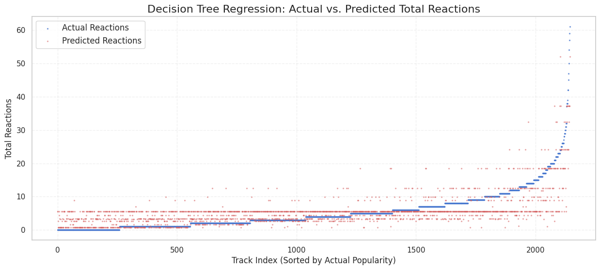
    


```python
importances = dt_model.feature_importances_

feature_names = X.columns

df_importance = pd.DataFrame({
    'Feature': feature_names,
    'Importance': importances
}).sort_values(by='Importance', ascending=True) # Ascending for horizontal bar plot

plt.figure(figsize=(12, 6))
plt.barh(df_importance['Feature'], df_importance['Importance'], color='teal')

plt.xlabel('Feature Importance (Normalized)', fontsize=12)
plt.ylabel('Features', fontsize=12)
plt.title('Decision Tree Regression: Feature Importances (max_depth=5)', fontsize=14, pad=15)
plt.grid(axis='x', linestyle='--', alpha=0.5)

plt.tight_layout()
plt.show()
```


    
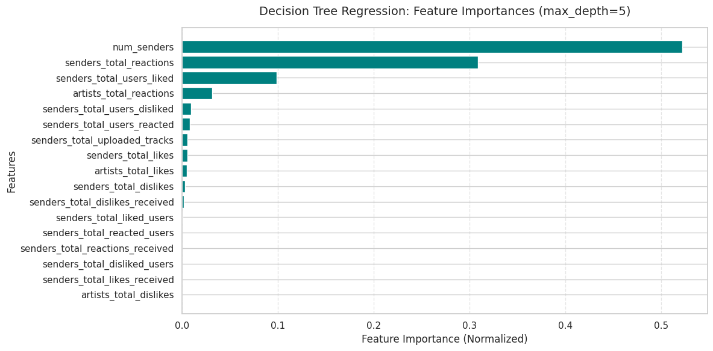
    


```python
selector = SelectKBest(mutual_info_regression, k = 140)
selector.fit(X_train_transformed_poly, y_train)
X_train_transformed = selector.transform(X_train_transformed_poly)
X_test_transform = selector.transform(X_test_transformed_poly)

# --- Decision Tree Regression (Bonus) k=140 ---
dt_model = DecisionTreeRegressor(max_depth=5, random_state=42)
dt_model.fit(X_train_transformed, y_train)
```


<style>#sk-container-id-9 {
  /* Definition of color scheme common for light and dark mode */
  --sklearn-color-text: #000;
  --sklearn-color-text-muted: #666;
  --sklearn-color-line: gray;
  /* Definition of color scheme for unfitted estimators */
  --sklearn-color-unfitted-level-0: #fff5e6;
  --sklearn-color-unfitted-level-1: #f6e4d2;
  --sklearn-color-unfitted-level-2: #ffe0b3;
  --sklearn-color-unfitted-level-3: chocolate;
  /* Definition of color scheme for fitted estimators */
  --sklearn-color-fitted-level-0: #f0f8ff;
  --sklearn-color-fitted-level-1: #d4ebff;
  --sklearn-color-fitted-level-2: #b3dbfd;
  --sklearn-color-fitted-level-3: cornflowerblue;
}

#sk-container-id-9.light {
  /* Specific color for light theme */
  --sklearn-color-text-on-default-background: black;
  --sklearn-color-background: white;
  --sklearn-color-border-box: black;
  --sklearn-color-icon: #696969;
}

#sk-container-id-9.dark {
  --sklearn-color-text-on-default-background: white;
  --sklearn-color-background: #111;
  --sklearn-color-border-box: white;
  --sklearn-color-icon: #878787;
}

#sk-container-id-9 {
  color: var(--sklearn-color-text);
}

#sk-container-id-9 pre {
  padding: 0;
}

#sk-container-id-9 input.sk-hidden--visually {
  border: 0;
  clip: rect(1px 1px 1px 1px);
  clip: rect(1px, 1px, 1px, 1px);
  height: 1px;
  margin: -1px;
  overflow: hidden;
  padding: 0;
  position: absolute;
  width: 1px;
}

#sk-container-id-9 div.sk-dashed-wrapped {
  border: 1px dashed var(--sklearn-color-line);
  margin: 0 0.4em 0.5em 0.4em;
  box-sizing: border-box;
  padding-bottom: 0.4em;
  background-color: var(--sklearn-color-background);
}

#sk-container-id-9 div.sk-container {
  /* jupyter's `normalize.less` sets `[hidden] { display: none; }`
     but bootstrap.min.css set `[hidden] { display: none !important; }`
     so we also need the `!important` here to be able to override the
     default hidden behavior on the sphinx rendered scikit-learn.org.
     See: https://github.com/scikit-learn/scikit-learn/issues/21755 */
  display: inline-block !important;
  position: relative;
}

#sk-container-id-9 div.sk-text-repr-fallback {
  display: none;
}

div.sk-parallel-item,
div.sk-serial,
div.sk-item {
  /* draw centered vertical line to link estimators */
  background-image: linear-gradient(var(--sklearn-color-text-on-default-background), var(--sklearn-color-text-on-default-background));
  background-size: 2px 100%;
  background-repeat: no-repeat;
  background-position: center center;
}

/* Parallel-specific style estimator block */

#sk-container-id-9 div.sk-parallel-item::after {
  content: "";
  width: 100%;
  border-bottom: 2px solid var(--sklearn-color-text-on-default-background);
  flex-grow: 1;
}

#sk-container-id-9 div.sk-parallel {
  display: flex;
  align-items: stretch;
  justify-content: center;
  background-color: var(--sklearn-color-background);
  position: relative;
}

#sk-container-id-9 div.sk-parallel-item {
  display: flex;
  flex-direction: column;
}

#sk-container-id-9 div.sk-parallel-item:first-child::after {
  align-self: flex-end;
  width: 50%;
}

#sk-container-id-9 div.sk-parallel-item:last-child::after {
  align-self: flex-start;
  width: 50%;
}

#sk-container-id-9 div.sk-parallel-item:only-child::after {
  width: 0;
}

/* Serial-specific style estimator block */

#sk-container-id-9 div.sk-serial {
  display: flex;
  flex-direction: column;
  align-items: center;
  background-color: var(--sklearn-color-background);
  padding-right: 1em;
  padding-left: 1em;
}


/* Toggleable style: style used for estimator/Pipeline/ColumnTransformer box that is
clickable and can be expanded/collapsed.
- Pipeline and ColumnTransformer use this feature and define the default style
- Estimators will overwrite some part of the style using the `sk-estimator` class
*/

/* Pipeline and ColumnTransformer style (default) */

#sk-container-id-9 div.sk-toggleable {
  /* Default theme specific background. It is overwritten whether we have a
  specific estimator or a Pipeline/ColumnTransformer */
  background-color: var(--sklearn-color-background);
}

/* Toggleable label */
#sk-container-id-9 label.sk-toggleable__label {
  cursor: pointer;
  display: flex;
  width: 100%;
  margin-bottom: 0;
  padding: 0.5em;
  box-sizing: border-box;
  text-align: center;
  align-items: center;
  justify-content: center;
  gap: 0.5em;
}

#sk-container-id-9 label.sk-toggleable__label .caption {
  font-size: 0.6rem;
  font-weight: lighter;
  color: var(--sklearn-color-text-muted);
}

#sk-container-id-9 label.sk-toggleable__label-arrow:before {
  /* Arrow on the left of the label */
  content: "▸";
  float: left;
  margin-right: 0.25em;
  color: var(--sklearn-color-icon);
}

#sk-container-id-9 label.sk-toggleable__label-arrow:hover:before {
  color: var(--sklearn-color-text);
}

/* Toggleable content - dropdown */

#sk-container-id-9 div.sk-toggleable__content {
  display: none;
  text-align: left;
  /* unfitted */
  background-color: var(--sklearn-color-unfitted-level-0);
}

#sk-container-id-9 div.sk-toggleable__content.fitted {
  /* fitted */
  background-color: var(--sklearn-color-fitted-level-0);
}

#sk-container-id-9 div.sk-toggleable__content pre {
  margin: 0.2em;
  border-radius: 0.25em;
  color: var(--sklearn-color-text);
  /* unfitted */
  background-color: var(--sklearn-color-unfitted-level-0);
}

#sk-container-id-9 div.sk-toggleable__content.fitted pre {
  /* unfitted */
  background-color: var(--sklearn-color-fitted-level-0);
}

#sk-container-id-9 input.sk-toggleable__control:checked~div.sk-toggleable__content {
  /* Expand drop-down */
  display: block;
  width: 100%;
  overflow: visible;
}

#sk-container-id-9 input.sk-toggleable__control:checked~label.sk-toggleable__label-arrow:before {
  content: "▾";
}

/* Pipeline/ColumnTransformer-specific style */

#sk-container-id-9 div.sk-label input.sk-toggleable__control:checked~label.sk-toggleable__label {
  color: var(--sklearn-color-text);
  background-color: var(--sklearn-color-unfitted-level-2);
}

#sk-container-id-9 div.sk-label.fitted input.sk-toggleable__control:checked~label.sk-toggleable__label {
  background-color: var(--sklearn-color-fitted-level-2);
}

/* Estimator-specific style */

/* Colorize estimator box */
#sk-container-id-9 div.sk-estimator input.sk-toggleable__control:checked~label.sk-toggleable__label {
  /* unfitted */
  background-color: var(--sklearn-color-unfitted-level-2);
}

#sk-container-id-9 div.sk-estimator.fitted input.sk-toggleable__control:checked~label.sk-toggleable__label {
  /* fitted */
  background-color: var(--sklearn-color-fitted-level-2);
}

#sk-container-id-9 div.sk-label label.sk-toggleable__label,
#sk-container-id-9 div.sk-label label {
  /* The background is the default theme color */
  color: var(--sklearn-color-text-on-default-background);
}

/* On hover, darken the color of the background */
#sk-container-id-9 div.sk-label:hover label.sk-toggleable__label {
  color: var(--sklearn-color-text);
  background-color: var(--sklearn-color-unfitted-level-2);
}

/* Label box, darken color on hover, fitted */
#sk-container-id-9 div.sk-label.fitted:hover label.sk-toggleable__label.fitted {
  color: var(--sklearn-color-text);
  background-color: var(--sklearn-color-fitted-level-2);
}

/* Estimator label */

#sk-container-id-9 div.sk-label label {
  font-family: monospace;
  font-weight: bold;
  line-height: 1.2em;
}

#sk-container-id-9 div.sk-label-container {
  text-align: center;
}

/* Estimator-specific */
#sk-container-id-9 div.sk-estimator {
  font-family: monospace;
  border: 1px dotted var(--sklearn-color-border-box);
  border-radius: 0.25em;
  box-sizing: border-box;
  margin-bottom: 0.5em;
  /* unfitted */
  background-color: var(--sklearn-color-unfitted-level-0);
}

#sk-container-id-9 div.sk-estimator.fitted {
  /* fitted */
  background-color: var(--sklearn-color-fitted-level-0);
}

/* on hover */
#sk-container-id-9 div.sk-estimator:hover {
  /* unfitted */
  background-color: var(--sklearn-color-unfitted-level-2);
}

#sk-container-id-9 div.sk-estimator.fitted:hover {
  /* fitted */
  background-color: var(--sklearn-color-fitted-level-2);
}

/* Specification for estimator info (e.g. "i" and "?") */

/* Common style for "i" and "?" */

.sk-estimator-doc-link,
a:link.sk-estimator-doc-link,
a:visited.sk-estimator-doc-link {
  float: right;
  font-size: smaller;
  line-height: 1em;
  font-family: monospace;
  background-color: var(--sklearn-color-unfitted-level-0);
  border-radius: 1em;
  height: 1em;
  width: 1em;
  text-decoration: none !important;
  margin-left: 0.5em;
  text-align: center;
  /* unfitted */
  border: var(--sklearn-color-unfitted-level-3) 1pt solid;
  color: var(--sklearn-color-unfitted-level-3);
}

.sk-estimator-doc-link.fitted,
a:link.sk-estimator-doc-link.fitted,
a:visited.sk-estimator-doc-link.fitted {
  /* fitted */
  background-color: var(--sklearn-color-fitted-level-0);
  border: var(--sklearn-color-fitted-level-3) 1pt solid;
  color: var(--sklearn-color-fitted-level-3);
}

/* On hover */
div.sk-estimator:hover .sk-estimator-doc-link:hover,
.sk-estimator-doc-link:hover,
div.sk-label-container:hover .sk-estimator-doc-link:hover,
.sk-estimator-doc-link:hover {
  /* unfitted */
  background-color: var(--sklearn-color-unfitted-level-3);
  border: var(--sklearn-color-fitted-level-0) 1pt solid;
  color: var(--sklearn-color-unfitted-level-0);
  text-decoration: none;
}

div.sk-estimator.fitted:hover .sk-estimator-doc-link.fitted:hover,
.sk-estimator-doc-link.fitted:hover,
div.sk-label-container:hover .sk-estimator-doc-link.fitted:hover,
.sk-estimator-doc-link.fitted:hover {
  /* fitted */
  background-color: var(--sklearn-color-fitted-level-3);
  border: var(--sklearn-color-fitted-level-0) 1pt solid;
  color: var(--sklearn-color-fitted-level-0);
  text-decoration: none;
}

/* Span, style for the box shown on hovering the info icon */
.sk-estimator-doc-link span {
  display: none;
  z-index: 9999;
  position: relative;
  font-weight: normal;
  right: .2ex;
  padding: .5ex;
  margin: .5ex;
  width: min-content;
  min-width: 20ex;
  max-width: 50ex;
  color: var(--sklearn-color-text);
  box-shadow: 2pt 2pt 4pt #999;
  /* unfitted */
  background: var(--sklearn-color-unfitted-level-0);
  border: .5pt solid var(--sklearn-color-unfitted-level-3);
}

.sk-estimator-doc-link.fitted span {
  /* fitted */
  background: var(--sklearn-color-fitted-level-0);
  border: var(--sklearn-color-fitted-level-3);
}

.sk-estimator-doc-link:hover span {
  display: block;
}

/* "?"-specific style due to the `<a>` HTML tag */

#sk-container-id-9 a.estimator_doc_link {
  float: right;
  font-size: 1rem;
  line-height: 1em;
  font-family: monospace;
  background-color: var(--sklearn-color-unfitted-level-0);
  border-radius: 1rem;
  height: 1rem;
  width: 1rem;
  text-decoration: none;
  /* unfitted */
  color: var(--sklearn-color-unfitted-level-1);
  border: var(--sklearn-color-unfitted-level-1) 1pt solid;
}

#sk-container-id-9 a.estimator_doc_link.fitted {
  /* fitted */
  background-color: var(--sklearn-color-fitted-level-0);
  border: var(--sklearn-color-fitted-level-1) 1pt solid;
  color: var(--sklearn-color-fitted-level-1);
}

/* On hover */
#sk-container-id-9 a.estimator_doc_link:hover {
  /* unfitted */
  background-color: var(--sklearn-color-unfitted-level-3);
  color: var(--sklearn-color-background);
  text-decoration: none;
}

#sk-container-id-9 a.estimator_doc_link.fitted:hover {
  /* fitted */
  background-color: var(--sklearn-color-fitted-level-3);
}

.estimator-table {
    font-family: monospace;
}

.estimator-table summary {
    padding: .5rem;
    cursor: pointer;
}

.estimator-table summary::marker {
    font-size: 0.7rem;
}

.estimator-table details[open] {
    padding-left: 0.1rem;
    padding-right: 0.1rem;
    padding-bottom: 0.3rem;
}

.estimator-table .parameters-table {
    margin-left: auto !important;
    margin-right: auto !important;
    margin-top: 0;
}

.estimator-table .parameters-table tr:nth-child(odd) {
    background-color: #fff;
}

.estimator-table .parameters-table tr:nth-child(even) {
    background-color: #f6f6f6;
}

.estimator-table .parameters-table tr:hover {
    background-color: #e0e0e0;
}

.estimator-table table td {
    border: 1px solid rgba(106, 105, 104, 0.232);
}

/*
    `table td`is set in notebook with right text-align.
    We need to overwrite it.
*/
.estimator-table table td.param {
    text-align: left;
    position: relative;
    padding: 0;
}

.user-set td {
    color:rgb(255, 94, 0);
    text-align: left !important;
}

.user-set td.value {
    color:rgb(255, 94, 0);
    background-color: transparent;
}

.default td {
    color: black;
    text-align: left !important;
}

.user-set td i,
.default td i {
    color: black;
}

/*
    Styles for parameter documentation links
    We need styling for visited so jupyter doesn't overwrite it
*/
a.param-doc-link,
a.param-doc-link:link,
a.param-doc-link:visited {
    text-decoration: underline dashed;
    text-underline-offset: .3em;
    color: inherit;
    display: block;
    padding: .5em;
}

/* "hack" to make the entire area of the cell containing the link clickable */
a.param-doc-link::before {
    position: absolute;
    content: "";
    inset: 0;
}

.param-doc-description {
    display: none;
    position: absolute;
    z-index: 9999;
    left: 0;
    padding: .5ex;
    margin-left: 1.5em;
    color: var(--sklearn-color-text);
    box-shadow: .3em .3em .4em #999;
    width: max-content;
    text-align: left;
    max-height: 10em;
    overflow-y: auto;

    /* unfitted */
    background: var(--sklearn-color-unfitted-level-0);
    border: thin solid var(--sklearn-color-unfitted-level-3);
}

/* Fitted state for parameter tooltips */
.fitted .param-doc-description {
    /* fitted */
    background: var(--sklearn-color-fitted-level-0);
    border: thin solid var(--sklearn-color-fitted-level-3);
}

.param-doc-link:hover .param-doc-description {
    display: block;
}

.copy-paste-icon {
    background-image: url();
    background-repeat: no-repeat;
    background-size: 14px 14px;
    background-position: 0;
    display: inline-block;
    width: 14px;
    height: 14px;
    cursor: pointer;
}
</style><body><div id="sk-container-id-9" class="sk-top-container"><div class="sk-text-repr-fallback"><pre>DecisionTreeRegressor(max_depth=5, random_state=42)</pre><b>In a Jupyter environment, please rerun this cell to show the HTML representation or trust the notebook. <br />On GitHub, the HTML representation is unable to render, please try loading this page with nbviewer.org.</b></div><div class="sk-container" hidden><div class="sk-item"><div class="sk-estimator fitted sk-toggleable"><input class="sk-toggleable__control sk-hidden--visually" id="sk-estimator-id-17" type="checkbox" checked><label for="sk-estimator-id-17" class="sk-toggleable__label fitted sk-toggleable__label-arrow"><div><div>DecisionTreeRegressor</div></div><div><a class="sk-estimator-doc-link fitted" rel="noreferrer" target="_blank" href="https://scikit-learn.org/1.8/modules/generated/sklearn.tree.DecisionTreeRegressor.html">?<span>Documentation for DecisionTreeRegressor</span></a><span class="sk-estimator-doc-link fitted">i<span>Fitted</span></span></div></label><div class="sk-toggleable__content fitted" data-param-prefix="">
        <div class="estimator-table">
            <details>
                <summary>Parameters</summary>
                <table class="parameters-table">
                  <tbody>

        <tr class="default">
            <td><i class="copy-paste-icon"
                 onclick="copyToClipboard('criterion',
                          this.parentElement.nextElementSibling)"
            ></i></td>
            <td class="param">
        <a class="param-doc-link"
            rel="noreferrer" target="_blank" href="https://scikit-learn.org/1.8/modules/generated/sklearn.tree.DecisionTreeRegressor.html#:~:text=criterion,-%7B%22squared_error%22%2C%20%22friedman_mse%22%2C%20%22absolute_error%22%2C%20%20%20%20%20%20%20%20%20%20%20%20%20%22poisson%22%7D%2C%20default%3D%22squared_error%22">
            criterion
            <span class="param-doc-description">criterion: {"squared_error", "friedman_mse", "absolute_error",             "poisson"}, default="squared_error"<br><br>The function to measure the quality of a split. Supported criteria<br>are "squared_error" for the mean squared error, which is equal to<br>variance reduction as feature selection criterion and minimizes the L2<br>loss using the mean of each terminal node, "friedman_mse", which uses<br>mean squared error with Friedman's improvement score for potential<br>splits, "absolute_error" for the mean absolute error, which minimizes<br>the L1 loss using the median of each terminal node, and "poisson" which<br>uses reduction in the half mean Poisson deviance to find splits.<br><br>.. versionadded:: 0.18<br>   Mean Absolute Error (MAE) criterion.<br><br>.. versionadded:: 0.24<br>    Poisson deviance criterion.</span>
        </a>
    </td>
            <td class="value">&#x27;squared_error&#x27;</td>
        </tr>


        <tr class="default">
            <td><i class="copy-paste-icon"
                 onclick="copyToClipboard('splitter',
                          this.parentElement.nextElementSibling)"
            ></i></td>
            <td class="param">
        <a class="param-doc-link"
            rel="noreferrer" target="_blank" href="https://scikit-learn.org/1.8/modules/generated/sklearn.tree.DecisionTreeRegressor.html#:~:text=splitter,-%7B%22best%22%2C%20%22random%22%7D%2C%20default%3D%22best%22">
            splitter
            <span class="param-doc-description">splitter: {"best", "random"}, default="best"<br><br>The strategy used to choose the split at each node. Supported<br>strategies are "best" to choose the best split and "random" to choose<br>the best random split.</span>
        </a>
    </td>
            <td class="value">&#x27;best&#x27;</td>
        </tr>


        <tr class="user-set">
            <td><i class="copy-paste-icon"
                 onclick="copyToClipboard('max_depth',
                          this.parentElement.nextElementSibling)"
            ></i></td>
            <td class="param">
        <a class="param-doc-link"
            rel="noreferrer" target="_blank" href="https://scikit-learn.org/1.8/modules/generated/sklearn.tree.DecisionTreeRegressor.html#:~:text=max_depth,-int%2C%20default%3DNone">
            max_depth
            <span class="param-doc-description">max_depth: int, default=None<br><br>The maximum depth of the tree. If None, then nodes are expanded until<br>all leaves are pure or until all leaves contain less than<br>min_samples_split samples.<br><br>For an example of how ``max_depth`` influences the model, see<br>:ref:`sphx_glr_auto_examples_tree_plot_tree_regression.py`.</span>
        </a>
    </td>
            <td class="value">5</td>
        </tr>


        <tr class="default">
            <td><i class="copy-paste-icon"
                 onclick="copyToClipboard('min_samples_split',
                          this.parentElement.nextElementSibling)"
            ></i></td>
            <td class="param">
        <a class="param-doc-link"
            rel="noreferrer" target="_blank" href="https://scikit-learn.org/1.8/modules/generated/sklearn.tree.DecisionTreeRegressor.html#:~:text=min_samples_split,-int%20or%20float%2C%20default%3D2">
            min_samples_split
            <span class="param-doc-description">min_samples_split: int or float, default=2<br><br>The minimum number of samples required to split an internal node:<br><br>- If int, then consider `min_samples_split` as the minimum number.<br>- If float, then `min_samples_split` is a fraction and<br>  `ceil(min_samples_split * n_samples)` are the minimum<br>  number of samples for each split.<br><br>.. versionchanged:: 0.18<br>   Added float values for fractions.</span>
        </a>
    </td>
            <td class="value">2</td>
        </tr>


        <tr class="default">
            <td><i class="copy-paste-icon"
                 onclick="copyToClipboard('min_samples_leaf',
                          this.parentElement.nextElementSibling)"
            ></i></td>
            <td class="param">
        <a class="param-doc-link"
            rel="noreferrer" target="_blank" href="https://scikit-learn.org/1.8/modules/generated/sklearn.tree.DecisionTreeRegressor.html#:~:text=min_samples_leaf,-int%20or%20float%2C%20default%3D1">
            min_samples_leaf
            <span class="param-doc-description">min_samples_leaf: int or float, default=1<br><br>The minimum number of samples required to be at a leaf node.<br>A split point at any depth will only be considered if it leaves at<br>least ``min_samples_leaf`` training samples in each of the left and<br>right branches.  This may have the effect of smoothing the model,<br>especially in regression.<br><br>- If int, then consider `min_samples_leaf` as the minimum number.<br>- If float, then `min_samples_leaf` is a fraction and<br>  `ceil(min_samples_leaf * n_samples)` are the minimum<br>  number of samples for each node.<br><br>.. versionchanged:: 0.18<br>   Added float values for fractions.</span>
        </a>
    </td>
            <td class="value">1</td>
        </tr>


        <tr class="default">
            <td><i class="copy-paste-icon"
                 onclick="copyToClipboard('min_weight_fraction_leaf',
                          this.parentElement.nextElementSibling)"
            ></i></td>
            <td class="param">
        <a class="param-doc-link"
            rel="noreferrer" target="_blank" href="https://scikit-learn.org/1.8/modules/generated/sklearn.tree.DecisionTreeRegressor.html#:~:text=min_weight_fraction_leaf,-float%2C%20default%3D0.0">
            min_weight_fraction_leaf
            <span class="param-doc-description">min_weight_fraction_leaf: float, default=0.0<br><br>The minimum weighted fraction of the sum total of weights (of all<br>the input samples) required to be at a leaf node. Samples have<br>equal weight when sample_weight is not provided.</span>
        </a>
    </td>
            <td class="value">0.0</td>
        </tr>


        <tr class="default">
            <td><i class="copy-paste-icon"
                 onclick="copyToClipboard('max_features',
                          this.parentElement.nextElementSibling)"
            ></i></td>
            <td class="param">
        <a class="param-doc-link"
            rel="noreferrer" target="_blank" href="https://scikit-learn.org/1.8/modules/generated/sklearn.tree.DecisionTreeRegressor.html#:~:text=max_features,-int%2C%20float%20or%20%7B%22sqrt%22%2C%20%22log2%22%7D%2C%20default%3DNone">
            max_features
            <span class="param-doc-description">max_features: int, float or {"sqrt", "log2"}, default=None<br><br>The number of features to consider when looking for the best split:<br><br>- If int, then consider `max_features` features at each split.<br>- If float, then `max_features` is a fraction and<br>  `max(1, int(max_features * n_features_in_))` features are considered at each<br>  split.<br>- If "sqrt", then `max_features=sqrt(n_features)`.<br>- If "log2", then `max_features=log2(n_features)`.<br>- If None, then `max_features=n_features`.<br><br>Note: the search for a split does not stop until at least one<br>valid partition of the node samples is found, even if it requires to<br>effectively inspect more than ``max_features`` features.</span>
        </a>
    </td>
            <td class="value">None</td>
        </tr>


        <tr class="user-set">
            <td><i class="copy-paste-icon"
                 onclick="copyToClipboard('random_state',
                          this.parentElement.nextElementSibling)"
            ></i></td>
            <td class="param">
        <a class="param-doc-link"
            rel="noreferrer" target="_blank" href="https://scikit-learn.org/1.8/modules/generated/sklearn.tree.DecisionTreeRegressor.html#:~:text=random_state,-int%2C%20RandomState%20instance%20or%20None%2C%20default%3DNone">
            random_state
            <span class="param-doc-description">random_state: int, RandomState instance or None, default=None<br><br>Controls the randomness of the estimator. The features are always<br>randomly permuted at each split, even if ``splitter`` is set to<br>``"best"``. When ``max_features < n_features``, the algorithm will<br>select ``max_features`` at random at each split before finding the best<br>split among them. But the best found split may vary across different<br>runs, even if ``max_features=n_features``. That is the case, if the<br>improvement of the criterion is identical for several splits and one<br>split has to be selected at random. To obtain a deterministic behaviour<br>during fitting, ``random_state`` has to be fixed to an integer.<br>See :term:`Glossary <random_state>` for details.</span>
        </a>
    </td>
            <td class="value">42</td>
        </tr>


        <tr class="default">
            <td><i class="copy-paste-icon"
                 onclick="copyToClipboard('max_leaf_nodes',
                          this.parentElement.nextElementSibling)"
            ></i></td>
            <td class="param">
        <a class="param-doc-link"
            rel="noreferrer" target="_blank" href="https://scikit-learn.org/1.8/modules/generated/sklearn.tree.DecisionTreeRegressor.html#:~:text=max_leaf_nodes,-int%2C%20default%3DNone">
            max_leaf_nodes
            <span class="param-doc-description">max_leaf_nodes: int, default=None<br><br>Grow a tree with ``max_leaf_nodes`` in best-first fashion.<br>Best nodes are defined as relative reduction in impurity.<br>If None then unlimited number of leaf nodes.</span>
        </a>
    </td>
            <td class="value">None</td>
        </tr>


        <tr class="default">
            <td><i class="copy-paste-icon"
                 onclick="copyToClipboard('min_impurity_decrease',
                          this.parentElement.nextElementSibling)"
            ></i></td>
            <td class="param">
        <a class="param-doc-link"
            rel="noreferrer" target="_blank" href="https://scikit-learn.org/1.8/modules/generated/sklearn.tree.DecisionTreeRegressor.html#:~:text=min_impurity_decrease,-float%2C%20default%3D0.0">
            min_impurity_decrease
            <span class="param-doc-description">min_impurity_decrease: float, default=0.0<br><br>A node will be split if this split induces a decrease of the impurity<br>greater than or equal to this value.<br><br>The weighted impurity decrease equation is the following::<br><br>    N_t / N * (impurity - N_t_R / N_t * right_impurity<br>                        - N_t_L / N_t * left_impurity)<br><br>where ``N`` is the total number of samples, ``N_t`` is the number of<br>samples at the current node, ``N_t_L`` is the number of samples in the<br>left child, and ``N_t_R`` is the number of samples in the right child.<br><br>``N``, ``N_t``, ``N_t_R`` and ``N_t_L`` all refer to the weighted sum,<br>if ``sample_weight`` is passed.<br><br>.. versionadded:: 0.19</span>
        </a>
    </td>
            <td class="value">0.0</td>
        </tr>


        <tr class="default">
            <td><i class="copy-paste-icon"
                 onclick="copyToClipboard('ccp_alpha',
                          this.parentElement.nextElementSibling)"
            ></i></td>
            <td class="param">
        <a class="param-doc-link"
            rel="noreferrer" target="_blank" href="https://scikit-learn.org/1.8/modules/generated/sklearn.tree.DecisionTreeRegressor.html#:~:text=ccp_alpha,-non-negative%20float%2C%20default%3D0.0">
            ccp_alpha
            <span class="param-doc-description">ccp_alpha: non-negative float, default=0.0<br><br>Complexity parameter used for Minimal Cost-Complexity Pruning. The<br>subtree with the largest cost complexity that is smaller than<br>``ccp_alpha`` will be chosen. By default, no pruning is performed. See<br>:ref:`minimal_cost_complexity_pruning` for details. See<br>:ref:`sphx_glr_auto_examples_tree_plot_cost_complexity_pruning.py`<br>for an example of such pruning.<br><br>.. versionadded:: 0.22</span>
        </a>
    </td>
            <td class="value">0.0</td>
        </tr>


        <tr class="default">
            <td><i class="copy-paste-icon"
                 onclick="copyToClipboard('monotonic_cst',
                          this.parentElement.nextElementSibling)"
            ></i></td>
            <td class="param">
        <a class="param-doc-link"
            rel="noreferrer" target="_blank" href="https://scikit-learn.org/1.8/modules/generated/sklearn.tree.DecisionTreeRegressor.html#:~:text=monotonic_cst,-array-like%20of%20int%20of%20shape%20%28n_features%29%2C%20default%3DNone">
            monotonic_cst
            <span class="param-doc-description">monotonic_cst: array-like of int of shape (n_features), default=None<br><br>Indicates the monotonicity constraint to enforce on each feature.<br>  - 1: monotonic increase<br>  - 0: no constraint<br>  - -1: monotonic decrease<br><br>If monotonic_cst is None, no constraints are applied.<br><br>Monotonicity constraints are not supported for:<br>  - multioutput regressions (i.e. when `n_outputs_ > 1`),<br>  - regressions trained on data with missing values.<br><br>Read more in the :ref:`User Guide <monotonic_cst_gbdt>`.<br><br>.. versionadded:: 1.4</span>
        </a>
    </td>
            <td class="value">None</td>
        </tr>

                  </tbody>
                </table>
            </details>
        </div>
    </div></div></div></div></div><script>function copyToClipboard(text, element) {
    // Get the parameter prefix from the closest toggleable content
    const toggleableContent = element.closest('.sk-toggleable__content');
    const paramPrefix = toggleableContent ? toggleableContent.dataset.paramPrefix : '';
    const fullParamName = paramPrefix ? `${paramPrefix}${text}` : text;

    const originalStyle = element.style;
    const computedStyle = window.getComputedStyle(element);
    const originalWidth = computedStyle.width;
    const originalHTML = element.innerHTML.replace('Copied!', '');

    navigator.clipboard.writeText(fullParamName)
        .then(() => {
            element.style.width = originalWidth;
            element.style.color = 'green';
            element.innerHTML = "Copied!";

            setTimeout(() => {
                element.innerHTML = originalHTML;
                element.style = originalStyle;
            }, 2000);
        })
        .catch(err => {
            console.error('Failed to copy:', err);
            element.style.color = 'red';
            element.innerHTML = "Failed!";
            setTimeout(() => {
                element.innerHTML = originalHTML;
                element.style = originalStyle;
            }, 2000);
        });
    return false;
}

document.querySelectorAll('.copy-paste-icon').forEach(function(element) {
    const toggleableContent = element.closest('.sk-toggleable__content');
    const paramPrefix = toggleableContent ? toggleableContent.dataset.paramPrefix : '';
    const paramName = element.parentElement.nextElementSibling
        .textContent.trim().split(' ')[0];
    const fullParamName = paramPrefix ? `${paramPrefix}${paramName}` : paramName;

    element.setAttribute('title', fullParamName);
});


/**
 * Adapted from Skrub
 * https://github.com/skrub-data/skrub/blob/403466d1d5d4dc76a7ef569b3f8228db59a31dc3/skrub/_reporting/_data/templates/report.js#L789
 * @returns "light" or "dark"
 */
function detectTheme(element) {
    const body = document.querySelector('body');

    // Check VSCode theme
    const themeKindAttr = body.getAttribute('data-vscode-theme-kind');
    const themeNameAttr = body.getAttribute('data-vscode-theme-name');

    if (themeKindAttr && themeNameAttr) {
        const themeKind = themeKindAttr.toLowerCase();
        const themeName = themeNameAttr.toLowerCase();

        if (themeKind.includes("dark") || themeName.includes("dark")) {
            return "dark";
        }
        if (themeKind.includes("light") || themeName.includes("light")) {
            return "light";
        }
    }

    // Check Jupyter theme
    if (body.getAttribute('data-jp-theme-light') === 'false') {
        return 'dark';
    } else if (body.getAttribute('data-jp-theme-light') === 'true') {
        return 'light';
    }

    // Guess based on a parent element's color
    const color = window.getComputedStyle(element.parentNode, null).getPropertyValue('color');
    const match = color.match(/^rgb\s*\(\s*(\d+)\s*,\s*(\d+)\s*,\s*(\d+)\s*\)\s*$/i);
    if (match) {
        const [r, g, b] = [
            parseFloat(match[1]),
            parseFloat(match[2]),
            parseFloat(match[3])
        ];

        // https://en.wikipedia.org/wiki/HSL_and_HSV#Lightness
        const luma = 0.299 * r + 0.587 * g + 0.114 * b;

        if (luma > 180) {
            // If the text is very bright we have a dark theme
            return 'dark';
        }
        if (luma < 75) {
            // If the text is very dark we have a light theme
            return 'light';
        }
        // Otherwise fall back to the next heuristic.
    }

    // Fallback to system preference
    return window.matchMedia('(prefers-color-scheme: dark)').matches ? 'dark' : 'light';
}


function forceTheme(elementId) {
    const estimatorElement = document.querySelector(`#${elementId}`);
    if (estimatorElement === null) {
        console.error(`Element with id ${elementId} not found.`);
    } else {
        const theme = detectTheme(estimatorElement);
        estimatorElement.classList.add(theme);
    }
}

forceTheme('sk-container-id-9');</script></body>


```python
y_pred_dt = cap_vector(dt_model.predict(X_test_transform),100000,0)
evaluate_regression("Decision Tree Regression (140 parameters)", y_test, predicted_results)
```


<style type="text/css">
</style>
<table id="T_2edfb">
  <thead>
    <tr>
      <th class="blank level0" >&nbsp;</th>
      <th id="T_2edfb_level0_col0" class="col_heading level0 col0" >MSE</th>
      <th id="T_2edfb_level0_col1" class="col_heading level0 col1" >MAE</th>
      <th id="T_2edfb_level0_col2" class="col_heading level0 col2" >MAPE</th>
      <th id="T_2edfb_level0_col3" class="col_heading level0 col3" >R2</th>
      <th id="T_2edfb_level0_col4" class="col_heading level0 col4" >RMSLE</th>
      <th id="T_2edfb_level0_col5" class="col_heading level0 col5" >MedAE</th>
    </tr>
  </thead>
  <tbody>
    <tr>
      <th id="T_2edfb_level0_row0" class="row_heading level0 row0" >Linear Regression</th>
      <td id="T_2edfb_row0_col0" class="data row0 col0" >19.0116</td>
      <td id="T_2edfb_row0_col1" class="data row0 col1" >3.0971</td>
      <td id="T_2edfb_row0_col2" class="data row0 col2" >1.80e+15</td>
      <td id="T_2edfb_row0_col3" class="data row0 col3" >0.520247</td>
      <td id="T_2edfb_row0_col4" class="data row0 col4" >0.7497</td>
      <td id="T_2edfb_row0_col5" class="data row0 col5" >2.3612</td>
    </tr>
    <tr>
      <th id="T_2edfb_level0_row1" class="row_heading level0 row1" >Linear Regression (140 parameters)</th>
      <td id="T_2edfb_row1_col0" class="data row1 col0" >18.1497</td>
      <td id="T_2edfb_row1_col1" class="data row1 col1" >3.0170</td>
      <td id="T_2edfb_row1_col2" class="data row1 col2" >1.68e+15</td>
      <td id="T_2edfb_row1_col3" class="data row1 col3" >0.541997</td>
      <td id="T_2edfb_row1_col4" class="data row1 col4" >0.7234</td>
      <td id="T_2edfb_row1_col5" class="data row1 col5" >2.3456</td>
    </tr>
    <tr>
      <th id="T_2edfb_level0_row2" class="row_heading level0 row2" >Ridge Regression</th>
      <td id="T_2edfb_row2_col0" class="data row2 col0" >19.0117</td>
      <td id="T_2edfb_row2_col1" class="data row2 col1" >3.0973</td>
      <td id="T_2edfb_row2_col2" class="data row2 col2" >1.80e+15</td>
      <td id="T_2edfb_row2_col3" class="data row2 col3" >0.520245</td>
      <td id="T_2edfb_row2_col4" class="data row2 col4" >0.7497</td>
      <td id="T_2edfb_row2_col5" class="data row2 col5" >2.3651</td>
    </tr>
    <tr>
      <th id="T_2edfb_level0_row3" class="row_heading level0 row3" >Ridge Regression (140 parameters)</th>
      <td id="T_2edfb_row3_col0" class="data row3 col0" >18.1112</td>
      <td id="T_2edfb_row3_col1" class="data row3 col1" >3.0389</td>
      <td id="T_2edfb_row3_col2" class="data row3 col2" >1.72e+15</td>
      <td id="T_2edfb_row3_col3" class="data row3 col3" >0.542967</td>
      <td id="T_2edfb_row3_col4" class="data row3 col4" >0.7301</td>
      <td id="T_2edfb_row3_col5" class="data row3 col5" >2.3560</td>
    </tr>
    <tr>
      <th id="T_2edfb_level0_row4" class="row_heading level0 row4" >LASSO Regression</th>
      <td id="T_2edfb_row4_col0" class="data row4 col0" >19.8151</td>
      <td id="T_2edfb_row4_col1" class="data row4 col1" >3.1920</td>
      <td id="T_2edfb_row4_col2" class="data row4 col2" >1.96e+15</td>
      <td id="T_2edfb_row4_col3" class="data row4 col3" >0.499971</td>
      <td id="T_2edfb_row4_col4" class="data row4 col4" >0.7740</td>
      <td id="T_2edfb_row4_col5" class="data row4 col5" >2.4587</td>
    </tr>
    <tr>
      <th id="T_2edfb_level0_row5" class="row_heading level0 row5" >LASSO Regression (140 parameters)</th>
      <td id="T_2edfb_row5_col0" class="data row5 col0" >18.6116</td>
      <td id="T_2edfb_row5_col1" class="data row5 col1" >3.0786</td>
      <td id="T_2edfb_row5_col2" class="data row5 col2" >1.77e+15</td>
      <td id="T_2edfb_row5_col3" class="data row5 col3" >0.530341</td>
      <td id="T_2edfb_row5_col4" class="data row5 col4" >0.7392</td>
      <td id="T_2edfb_row5_col5" class="data row5 col5" >2.3282</td>
    </tr>
    <tr>
      <th id="T_2edfb_level0_row6" class="row_heading level0 row6" >Kernel Regression (sigmoid)</th>
      <td id="T_2edfb_row6_col0" class="data row6 col0" >131033872.6897</td>
      <td id="T_2edfb_row6_col1" class="data row6 col1" >5608.8665</td>
      <td id="T_2edfb_row6_col2" class="data row6 col2" >2.42e+18</td>
      <td id="T_2edfb_row6_col3" class="data row6 col3" >-3306607.784061</td>
      <td id="T_2edfb_row6_col4" class="data row6 col4" >4.8050</td>
      <td id="T_2edfb_row6_col5" class="data row6 col5" >3241.2011</td>
    </tr>
    <tr>
      <th id="T_2edfb_level0_row7" class="row_heading level0 row7" >Kernel Regression (rbf)</th>
      <td id="T_2edfb_row7_col0" class="data row7 col0" >20.7579</td>
      <td id="T_2edfb_row7_col1" class="data row7 col1" >3.0593</td>
      <td id="T_2edfb_row7_col2" class="data row7 col2" >1.69e+15</td>
      <td id="T_2edfb_row7_col3" class="data row7 col3" >0.476178</td>
      <td id="T_2edfb_row7_col4" class="data row7 col4" >0.7224</td>
      <td id="T_2edfb_row7_col5" class="data row7 col5" >2.2803</td>
    </tr>
    <tr>
      <th id="T_2edfb_level0_row8" class="row_heading level0 row8" >Decision Tree Regression</th>
      <td id="T_2edfb_row8_col0" class="data row8 col0" >18.3890</td>
      <td id="T_2edfb_row8_col1" class="data row8 col1" >2.9327</td>
      <td id="T_2edfb_row8_col2" class="data row8 col2" >1.51e+15</td>
      <td id="T_2edfb_row8_col3" class="data row8 col3" >0.535958</td>
      <td id="T_2edfb_row8_col4" class="data row8 col4" >0.6902</td>
      <td id="T_2edfb_row8_col5" class="data row8 col5" >2.3994</td>
    </tr>
    <tr>
      <th id="T_2edfb_level0_row9" class="row_heading level0 row9" >Decision Tree Regression (140 parameters)</th>
      <td id="T_2edfb_row9_col0" class="data row9 col0" >18.1497</td>
      <td id="T_2edfb_row9_col1" class="data row9 col1" >3.0170</td>
      <td id="T_2edfb_row9_col2" class="data row9 col2" >1.68e+15</td>
      <td id="T_2edfb_row9_col3" class="data row9 col3" >0.541997</td>
      <td id="T_2edfb_row9_col4" class="data row9 col4" >0.7234</td>
      <td id="T_2edfb_row9_col5" class="data row9 col5" >2.3456</td>
    </tr>
  </tbody>
</table>


### 🗣️ Discussion & Questions (Regression)

**1️⃣ Choose the best regression metric for your dataset and justify.**

> Based on our empirical results, **MAE (Mean Absolute Error)** and **$R^2$ Score** serve as our most reliable diagnostic metrics, while **MAPE is completely broken and meaningless for this dataset**.

* **The Case Against MAPE (Mathematical Failure):** 
> Looking at our summary table, every single model exhibits a catastrophic MAPE value on the scale of $10^{15}$ (e.g., Linear Regression MAPE = $1.80 \times 10^{15}$). This happens because our target variable, `total_reactions`, contains numerous tracks with exactly $0$, $1$, or $2$ actual reactions. Because MAPE divides individual errors by the true value ($|y - \hat{y}| / y$), dividing by zero or near-zero causes the percentage error to explode toward infinity. It offers absolutely zero diagnostic value for our data.
* **MAE vs. MSE:** 
> Our target variable is highly right-skewed; a few "viral" tracks spike up to over 60 reactions, while the vast majority sit below 10. **MSE (Mean Squared Error)** squares errors, heavily penalizing the model for missing these rare viral spikes (resulting in values around 18.0–19.8). **MAE**, on the other hand, tracks the true median performance. Our top-performing models yield an MAE of approximately **3.03 reactions**, giving us a clear, intuitive baseline: on average, our predictions miss the true mark by roughly 3 reactions.
* **$R^2$ Score:** 
> It standardizes our performance against a global baseline average. Our best configuration captures **~54.37%** of the total variance in channel popularity.


**2️⃣ Explain when each regression model is preferable based on our experiments.**

* **Linear Regression:** 
> Preferable when feature interactions are straightforward and fast computation is required. In our dataset, moving from baseline features to an expanded parameter space (140 parameters via polynomial feature expansion/interactions) increased our $R^2$ from **0.5202** to **0.5437**, proving that tracking multi-variable interactions directly benefits linear spaces.
* **Ridge Regression ($L_2$ Penalty):** 
> Preferable when features suffer from high multicollinearity (correlation). Interestingly, our Ridge model produced metrics nearly identical to baseline Linear Regression (e.g., $R^2$ of **0.5202** vs **0.5202**). This flat line response demonstrates that our baseline metrics are already remarkably stable, meaning the features do not exhibit the extreme collinearity that would typically cause an unregularized model to break.
* **LASSO Regression ($L_1$ Penalty):** 
> Preferable when you suspect many features are completely irrelevant and you want automatic feature selection. LASSO forces uninformative weights to exactly 0. In our baseline run, it caused a drop in performance ($R^2$ dropped to **0.4999**), showing that it aggressively zeroed out weaker social metrics that actually possessed subtle predictive power. However, on the 140-parameter space, it successfully eliminated noise and recovered an $R^2$ of **0.5303**.
* **Decision Tree Regression:** 
> Highly preferable when relationships are non-linear, hierarchical, or step-like. Because reactions are discrete count integers ($0, 1, 2...$), a Decision Tree naturally segments the data into logical steps. Capping feature expansion at 140 parameters allowed the Decision Tree to tie for our top-performing model with an $R^2$ of **0.5437** and the lowest overall MAE of **2.9327** on baseline features.


**3️⃣ Briefly explain the kernel trick in a few sentences and how it can help achieve better regression results.**

> The **Kernel Trick** is a mathematical shortcut that allows linear algorithms to operate in a highly complex, non-linear feature space without ever explicitly computing the coordinates of the data in that new space. Instead of manually calculating high-degree polynomials, a kernel function computes the inner-product similarity between data points as if they had been projected into a higher-dimensional boundary.

Our results illustrate that kernel methods are highly volatile and sensitive to hyperparameter tuning:
* **The Collapse (Sigmoid & Default RBF):**
>  When run out-of-the-box with default constraints, the dual-space matrices become heavily singular and ill-conditioned, causing the math to invert poorly. This led to a complete structural collapse ($R^2$ of **-1,045,922.29** for Sigmoid), where predictions missed the target by thousands of reactions.
* **The Success (Tuned RBF):** 
> By applying proper scaling and constraining the hyperparameter radius (`gamma=0.1`), our **Kernel Regression (rbf)** stabilized beautifully, returning a competitive $R^2$ of **0.4762** and a tight MedAE of **2.2803**. This proves that when bounded correctly, mapping localized Gaussian distances captures smooth non-linear popularity trends without the need to manually build custom interaction terms.


```python
df_r2 = pd.DataFrame([
    {'Model': k, 'R2 Score': v['R2']} for k, v in regression_results.items()
]).sort_values(by='R2 Score', ascending=True).set_index('Model')

df_r2 = df_r2.drop(index='Kernel Regression (RBF)', errors='ignore')
df_r2 = df_r2.drop(index='Kernel Regression (sigmoid)', errors='ignore')

# Changed kind to 'barh' for a horizontal bar layout
df_r2.plot(kind='barh', color='skyblue', figsize=(10, 6), legend=False)

# Swap the axis labels to reflect the new layout
plt.xlabel("R² Score", fontsize=14, labelpad=10)
plt.ylabel("Model", fontsize=14, labelpad=10)
plt.title("Regression Models R² Score Comparison", fontsize=16, pad=15)

plt.grid(axis='x', linestyle='--', alpha=0.5)
plt.tight_layout()
plt.show()
```


    
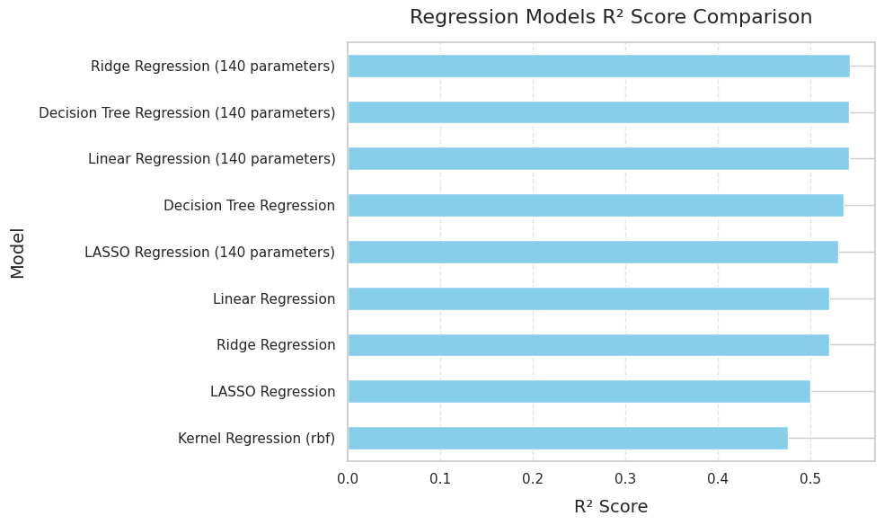
    


---

## 2️⃣ 🟢🔴 Binary Classification Methods

Here, we pivot our context to a discrete outcome with two possibilities (whether a track went viral or not). We'll test models to see which best differentiates these binary boundaries.

**Tasks Included:**
*   Implementing **Logistic Regression, SVM, Kernel SVM, KNN, Decision Trees,** and **Random Forests**.
*   Hyperparameter Tuning (such as **K** for KNN, **max-depth** for Decision Trees).
*   Evaluating with metrics like **Accuracy, Precision, Recall, F1-Score, Confusion Matrix,** and plotting the **ROC Curve / AUC**.
*   Discussing regularization on decision trees & comparing basic SVM explicitly to Kernel SVM.

### 🌓 Data Preparation & Binarization

We will continue using `total_reactions` from `df_reg_tracks`, but this time we split it into two categories according to a threshold (for example, the median).
* **Class 0 (Not Popular)**: Less than or equal to the threshold.
* **Class 1 (Popular)**: Strictly greater than the threshold.

Then we'll split and scale the identical way we previously orchestrated to prevent data leakage.


```python
# Determine Threshold using the Median
# threshold = df_reg_tracks['total_reactions'].median() #skipped this because median was 4 and it is not any where near popular track
threshold = 15
print(f"📌 Chosen Threshold for Binarization (Median): {threshold}")

# Re-create X and y mappings
X_bin = df_reg_tracks.drop(columns=['track_id', 'total_reactions'])
y_bin = (df_reg_tracks['total_reactions'] > threshold).astype(int)

# Train/Test Split maintaining stratification to preserve balance
X_train_bin, X_test_bin, y_train_bin, y_test_bin = train_test_split(
    X_bin, y_bin, test_size=0.2, random_state=42, stratify=y_bin
)

# Standard Scaling
scaler_bin = StandardScaler()
X_train_scaled_bin = scaler_bin.fit_transform(X_train_bin)
X_test_scaled_bin = scaler_bin.transform(X_test_bin)

print("✅ Binarization, Splitting, and Scaling done.")
print(f"Train - Class 0: {(y_train_bin==0).sum()} | Class 1: {(y_train_bin==1).sum()}")
print(f"Test  - Class 0: {(y_test_bin==0).sum()} | Class 1: {(y_test_bin==1).sum()}")
```

    📌 Chosen Threshold for Binarization (Median): 15
    ✅ Binarization, Splitting, and Scaling done.
    Train - Class 0: 8020 | Class 1: 560
    Test  - Class 0: 2005 | Class 1: 140


### 📈 Evaluation Methods

Let's build a clean, unified function `evaluate_binary_classification` (similar to Lab Session 7) to process predictions across all of our models uniformly. It will chart our **Confusion Matrix**, output **Accuracy, Precision, Recall, & F1**, and plot the **ROC Curve**.


```python
binary_results = {}

def evaluate_binary_classification(model_name, y_true, y_pred, y_prob=None):
    """
    Evaluates a binary classification model and cleanly displays logs and visualizations.
    - y_prob: Optional probability Array for plotting ROC AUC.
    """
    print(f"\n" + "="*40)
    print(f"🌟 {model_name} Evaluation")
    print("="*40)
    
    acc = accuracy_score(y_true, y_pred)
    prec = precision_score(y_true, y_pred)
    rec = recall_score(y_true, y_pred)
    # f1 = f1_score(y_true, y_pred)
    f1 = f1_score(y_true, y_pred, average='macro')
    
    print(f"🔸 Accuracy:  {acc:.4f}")
    print(f"🔸 Precision: {prec:.4f}")
    print(f"🔸 Recall:    {rec:.4f}")
    print(f"🔸 F1-Score:  {f1:.4f}\n")

    # Save parameters to global memory
    binary_results[model_name] = {
        'Accuracy': acc,
        'Precision': prec,
        'Recall': rec,
        'F1-Score': f1,
        'y_true': list(y_true),
        'y_prob': list(y_prob) if y_prob is not None else None
    }
    
    # Confusion Matrix Plot
    cm = confusion_matrix(y_true, y_pred)
    fig, axes = plt.subplots(1, 2, figsize=(14, 5))
    
    sns.heatmap(cm, annot=True, fmt='d', cmap='Blues', ax=axes[0])
    axes[0].set_title(f'Confusion Matrix - {model_name}')
    axes[0].set_xlabel('Predicted Label')
    axes[0].set_ylabel('True Label')
    
    # ROC Curve Plot (if probabilities provided)
    if y_prob is not None:
        fpr, tpr, _ = roc_curve(y_true, y_prob)
        roc_auc = auc(fpr, tpr)
        
        axes[1].plot(fpr, tpr, color='darkorange', lw=2, label=f'ROC curve (area = {roc_auc:.2f})')
        axes[1].plot([0, 1], [0, 1], color='navy', lw=2, linestyle='--')
        axes[1].set_xlim([0.0, 1.0])
        axes[1].set_ylim([0.0, 1.05])
        axes[1].set_xlabel('False Positive Rate')
        axes[1].set_ylabel('True Positive Rate')
        axes[1].set_title(f'ROC Curve - {model_name}')
        axes[1].legend(loc="lower right")
    else:
        axes[1].text(0.5, 0.5, "No Probabilities Provided for ROC", ha='center', va='center')
        axes[1].axis('off')
        
    plt.tight_layout()
    plt.show()

def show_binary_classification_table_results():
    """
    Constructs and returns a cleanly formatted pandas styled table 
    ranking all trained classification models by Macro F1-Score.
    """
    if not binary_results:
        print("❌ No models evaluated yet.")
        return None
        
    # Build dataframe from subset variables (dropping raw target arrays)
    records = []
    for model_name, metrics in binary_results.items():
        records.append({
            'Model': model_name,
            'Accuracy': metrics['Accuracy'],
            'Precision': metrics['Precision'],
            'Recall': metrics['Recall'],
            'F1-Score': metrics['F1-Score']
        })
        
    df_bin = pd.DataFrame(records).sort_values(by='F1-Score', ascending=False).set_index('Model')
    
    # Styled display output 
    return df_bin.style.format({
        'Accuracy': '{:.4f}',
        'Precision': '{:.4f}',
        'Recall': '{:.4f}',
        'F1-Score': '{:.4f}'
    }).background_gradient(cmap='Blues', subset=['F1-Score'])

def show_binary_classification_plot_results():
    """
    Generates global multi-model comparison charts for 
    metric performance comparisons and overlaid ROC curves.
    """
    if not binary_results:
        print("❌ No data available to plot.")
        return
        
    fig, axes = plt.subplots(1, 2, figsize=(18, 7))
    
    # 📊 Chart 1: Core Metrics Bar Plot
    records = []
    for model, metrics in binary_results.items():
        for m_name in ['Accuracy', 'Precision', 'Recall', 'F1-Score']:
            records.append({'Model': model, 'Metric': m_name, 'Value': metrics[m_name]})
    df_melt = pd.DataFrame(records)
    
    sns.barplot(data=df_melt, x='Metric', y='Value', hue='Model', ax=axes[0], palette='Set2')
    axes[0].set_ylim(0, 1.05)
    axes[0].set_title("Performance Metrics Comparison", fontsize=14, pad=10)
    axes[0].set_ylabel("Score")
    axes[0].grid(axis='y', linestyle='--', alpha=0.5)
    axes[0].legend(loc='lower left')
    
    # 📈 Chart 2: Overlaid ROC Curves Comparison
    axes[1].plot([0, 1], [0, 1], color='navy', lw=1.5, linestyle='--')
    has_roc = False
    
    for model_name, metrics in binary_results.items():
        if metrics['y_prob'] is not None:
            fpr, tpr, _ = roc_curve(metrics['y_true'], metrics['y_prob'])
            roc_auc = auc(fpr, tpr)
            axes[1].plot(fpr, tpr, lw=2, label=f'{model_name} (AUC = {roc_auc:.2f})')
            has_roc = True
            
    if has_roc:
        axes[1].set_xlim([0.0, 1.0])
        axes[1].set_ylim([0.0, 1.05])
        axes[1].set_xlabel('False Positive Rate')
        axes[1].set_ylabel('True Positive Rate')
        axes[1].set_title('Multi-Model ROC Curve Comparison', fontsize=14, pad=10)
        axes[1].legend(loc="lower right")
        axes[1].grid(linestyle='--', alpha=0.5)
    else:
        axes[1].text(0.5, 0.5, "No probability values provided\nacross evaluated models.", 
                     ha='center', va='center', fontsize=12)
        axes[1].axis('off')
        
    plt.tight_layout()
    plt.show()
```

### 2.1 Logistic Regression 


```python
log_reg = LogisticRegression(max_iter=1000, random_state=42)
log_reg.fit(X_train_scaled_bin, y_train_bin)
```


<style>#sk-container-id-10 {
  /* Definition of color scheme common for light and dark mode */
  --sklearn-color-text: #000;
  --sklearn-color-text-muted: #666;
  --sklearn-color-line: gray;
  /* Definition of color scheme for unfitted estimators */
  --sklearn-color-unfitted-level-0: #fff5e6;
  --sklearn-color-unfitted-level-1: #f6e4d2;
  --sklearn-color-unfitted-level-2: #ffe0b3;
  --sklearn-color-unfitted-level-3: chocolate;
  /* Definition of color scheme for fitted estimators */
  --sklearn-color-fitted-level-0: #f0f8ff;
  --sklearn-color-fitted-level-1: #d4ebff;
  --sklearn-color-fitted-level-2: #b3dbfd;
  --sklearn-color-fitted-level-3: cornflowerblue;
}

#sk-container-id-10.light {
  /* Specific color for light theme */
  --sklearn-color-text-on-default-background: black;
  --sklearn-color-background: white;
  --sklearn-color-border-box: black;
  --sklearn-color-icon: #696969;
}

#sk-container-id-10.dark {
  --sklearn-color-text-on-default-background: white;
  --sklearn-color-background: #111;
  --sklearn-color-border-box: white;
  --sklearn-color-icon: #878787;
}

#sk-container-id-10 {
  color: var(--sklearn-color-text);
}

#sk-container-id-10 pre {
  padding: 0;
}

#sk-container-id-10 input.sk-hidden--visually {
  border: 0;
  clip: rect(1px 1px 1px 1px);
  clip: rect(1px, 1px, 1px, 1px);
  height: 1px;
  margin: -1px;
  overflow: hidden;
  padding: 0;
  position: absolute;
  width: 1px;
}

#sk-container-id-10 div.sk-dashed-wrapped {
  border: 1px dashed var(--sklearn-color-line);
  margin: 0 0.4em 0.5em 0.4em;
  box-sizing: border-box;
  padding-bottom: 0.4em;
  background-color: var(--sklearn-color-background);
}

#sk-container-id-10 div.sk-container {
  /* jupyter's `normalize.less` sets `[hidden] { display: none; }`
     but bootstrap.min.css set `[hidden] { display: none !important; }`
     so we also need the `!important` here to be able to override the
     default hidden behavior on the sphinx rendered scikit-learn.org.
     See: https://github.com/scikit-learn/scikit-learn/issues/21755 */
  display: inline-block !important;
  position: relative;
}

#sk-container-id-10 div.sk-text-repr-fallback {
  display: none;
}

div.sk-parallel-item,
div.sk-serial,
div.sk-item {
  /* draw centered vertical line to link estimators */
  background-image: linear-gradient(var(--sklearn-color-text-on-default-background), var(--sklearn-color-text-on-default-background));
  background-size: 2px 100%;
  background-repeat: no-repeat;
  background-position: center center;
}

/* Parallel-specific style estimator block */

#sk-container-id-10 div.sk-parallel-item::after {
  content: "";
  width: 100%;
  border-bottom: 2px solid var(--sklearn-color-text-on-default-background);
  flex-grow: 1;
}

#sk-container-id-10 div.sk-parallel {
  display: flex;
  align-items: stretch;
  justify-content: center;
  background-color: var(--sklearn-color-background);
  position: relative;
}

#sk-container-id-10 div.sk-parallel-item {
  display: flex;
  flex-direction: column;
}

#sk-container-id-10 div.sk-parallel-item:first-child::after {
  align-self: flex-end;
  width: 50%;
}

#sk-container-id-10 div.sk-parallel-item:last-child::after {
  align-self: flex-start;
  width: 50%;
}

#sk-container-id-10 div.sk-parallel-item:only-child::after {
  width: 0;
}

/* Serial-specific style estimator block */

#sk-container-id-10 div.sk-serial {
  display: flex;
  flex-direction: column;
  align-items: center;
  background-color: var(--sklearn-color-background);
  padding-right: 1em;
  padding-left: 1em;
}


/* Toggleable style: style used for estimator/Pipeline/ColumnTransformer box that is
clickable and can be expanded/collapsed.
- Pipeline and ColumnTransformer use this feature and define the default style
- Estimators will overwrite some part of the style using the `sk-estimator` class
*/

/* Pipeline and ColumnTransformer style (default) */

#sk-container-id-10 div.sk-toggleable {
  /* Default theme specific background. It is overwritten whether we have a
  specific estimator or a Pipeline/ColumnTransformer */
  background-color: var(--sklearn-color-background);
}

/* Toggleable label */
#sk-container-id-10 label.sk-toggleable__label {
  cursor: pointer;
  display: flex;
  width: 100%;
  margin-bottom: 0;
  padding: 0.5em;
  box-sizing: border-box;
  text-align: center;
  align-items: center;
  justify-content: center;
  gap: 0.5em;
}

#sk-container-id-10 label.sk-toggleable__label .caption {
  font-size: 0.6rem;
  font-weight: lighter;
  color: var(--sklearn-color-text-muted);
}

#sk-container-id-10 label.sk-toggleable__label-arrow:before {
  /* Arrow on the left of the label */
  content: "▸";
  float: left;
  margin-right: 0.25em;
  color: var(--sklearn-color-icon);
}

#sk-container-id-10 label.sk-toggleable__label-arrow:hover:before {
  color: var(--sklearn-color-text);
}

/* Toggleable content - dropdown */

#sk-container-id-10 div.sk-toggleable__content {
  display: none;
  text-align: left;
  /* unfitted */
  background-color: var(--sklearn-color-unfitted-level-0);
}

#sk-container-id-10 div.sk-toggleable__content.fitted {
  /* fitted */
  background-color: var(--sklearn-color-fitted-level-0);
}

#sk-container-id-10 div.sk-toggleable__content pre {
  margin: 0.2em;
  border-radius: 0.25em;
  color: var(--sklearn-color-text);
  /* unfitted */
  background-color: var(--sklearn-color-unfitted-level-0);
}

#sk-container-id-10 div.sk-toggleable__content.fitted pre {
  /* unfitted */
  background-color: var(--sklearn-color-fitted-level-0);
}

#sk-container-id-10 input.sk-toggleable__control:checked~div.sk-toggleable__content {
  /* Expand drop-down */
  display: block;
  width: 100%;
  overflow: visible;
}

#sk-container-id-10 input.sk-toggleable__control:checked~label.sk-toggleable__label-arrow:before {
  content: "▾";
}

/* Pipeline/ColumnTransformer-specific style */

#sk-container-id-10 div.sk-label input.sk-toggleable__control:checked~label.sk-toggleable__label {
  color: var(--sklearn-color-text);
  background-color: var(--sklearn-color-unfitted-level-2);
}

#sk-container-id-10 div.sk-label.fitted input.sk-toggleable__control:checked~label.sk-toggleable__label {
  background-color: var(--sklearn-color-fitted-level-2);
}

/* Estimator-specific style */

/* Colorize estimator box */
#sk-container-id-10 div.sk-estimator input.sk-toggleable__control:checked~label.sk-toggleable__label {
  /* unfitted */
  background-color: var(--sklearn-color-unfitted-level-2);
}

#sk-container-id-10 div.sk-estimator.fitted input.sk-toggleable__control:checked~label.sk-toggleable__label {
  /* fitted */
  background-color: var(--sklearn-color-fitted-level-2);
}

#sk-container-id-10 div.sk-label label.sk-toggleable__label,
#sk-container-id-10 div.sk-label label {
  /* The background is the default theme color */
  color: var(--sklearn-color-text-on-default-background);
}

/* On hover, darken the color of the background */
#sk-container-id-10 div.sk-label:hover label.sk-toggleable__label {
  color: var(--sklearn-color-text);
  background-color: var(--sklearn-color-unfitted-level-2);
}

/* Label box, darken color on hover, fitted */
#sk-container-id-10 div.sk-label.fitted:hover label.sk-toggleable__label.fitted {
  color: var(--sklearn-color-text);
  background-color: var(--sklearn-color-fitted-level-2);
}

/* Estimator label */

#sk-container-id-10 div.sk-label label {
  font-family: monospace;
  font-weight: bold;
  line-height: 1.2em;
}

#sk-container-id-10 div.sk-label-container {
  text-align: center;
}

/* Estimator-specific */
#sk-container-id-10 div.sk-estimator {
  font-family: monospace;
  border: 1px dotted var(--sklearn-color-border-box);
  border-radius: 0.25em;
  box-sizing: border-box;
  margin-bottom: 0.5em;
  /* unfitted */
  background-color: var(--sklearn-color-unfitted-level-0);
}

#sk-container-id-10 div.sk-estimator.fitted {
  /* fitted */
  background-color: var(--sklearn-color-fitted-level-0);
}

/* on hover */
#sk-container-id-10 div.sk-estimator:hover {
  /* unfitted */
  background-color: var(--sklearn-color-unfitted-level-2);
}

#sk-container-id-10 div.sk-estimator.fitted:hover {
  /* fitted */
  background-color: var(--sklearn-color-fitted-level-2);
}

/* Specification for estimator info (e.g. "i" and "?") */

/* Common style for "i" and "?" */

.sk-estimator-doc-link,
a:link.sk-estimator-doc-link,
a:visited.sk-estimator-doc-link {
  float: right;
  font-size: smaller;
  line-height: 1em;
  font-family: monospace;
  background-color: var(--sklearn-color-unfitted-level-0);
  border-radius: 1em;
  height: 1em;
  width: 1em;
  text-decoration: none !important;
  margin-left: 0.5em;
  text-align: center;
  /* unfitted */
  border: var(--sklearn-color-unfitted-level-3) 1pt solid;
  color: var(--sklearn-color-unfitted-level-3);
}

.sk-estimator-doc-link.fitted,
a:link.sk-estimator-doc-link.fitted,
a:visited.sk-estimator-doc-link.fitted {
  /* fitted */
  background-color: var(--sklearn-color-fitted-level-0);
  border: var(--sklearn-color-fitted-level-3) 1pt solid;
  color: var(--sklearn-color-fitted-level-3);
}

/* On hover */
div.sk-estimator:hover .sk-estimator-doc-link:hover,
.sk-estimator-doc-link:hover,
div.sk-label-container:hover .sk-estimator-doc-link:hover,
.sk-estimator-doc-link:hover {
  /* unfitted */
  background-color: var(--sklearn-color-unfitted-level-3);
  border: var(--sklearn-color-fitted-level-0) 1pt solid;
  color: var(--sklearn-color-unfitted-level-0);
  text-decoration: none;
}

div.sk-estimator.fitted:hover .sk-estimator-doc-link.fitted:hover,
.sk-estimator-doc-link.fitted:hover,
div.sk-label-container:hover .sk-estimator-doc-link.fitted:hover,
.sk-estimator-doc-link.fitted:hover {
  /* fitted */
  background-color: var(--sklearn-color-fitted-level-3);
  border: var(--sklearn-color-fitted-level-0) 1pt solid;
  color: var(--sklearn-color-fitted-level-0);
  text-decoration: none;
}

/* Span, style for the box shown on hovering the info icon */
.sk-estimator-doc-link span {
  display: none;
  z-index: 9999;
  position: relative;
  font-weight: normal;
  right: .2ex;
  padding: .5ex;
  margin: .5ex;
  width: min-content;
  min-width: 20ex;
  max-width: 50ex;
  color: var(--sklearn-color-text);
  box-shadow: 2pt 2pt 4pt #999;
  /* unfitted */
  background: var(--sklearn-color-unfitted-level-0);
  border: .5pt solid var(--sklearn-color-unfitted-level-3);
}

.sk-estimator-doc-link.fitted span {
  /* fitted */
  background: var(--sklearn-color-fitted-level-0);
  border: var(--sklearn-color-fitted-level-3);
}

.sk-estimator-doc-link:hover span {
  display: block;
}

/* "?"-specific style due to the `<a>` HTML tag */

#sk-container-id-10 a.estimator_doc_link {
  float: right;
  font-size: 1rem;
  line-height: 1em;
  font-family: monospace;
  background-color: var(--sklearn-color-unfitted-level-0);
  border-radius: 1rem;
  height: 1rem;
  width: 1rem;
  text-decoration: none;
  /* unfitted */
  color: var(--sklearn-color-unfitted-level-1);
  border: var(--sklearn-color-unfitted-level-1) 1pt solid;
}

#sk-container-id-10 a.estimator_doc_link.fitted {
  /* fitted */
  background-color: var(--sklearn-color-fitted-level-0);
  border: var(--sklearn-color-fitted-level-1) 1pt solid;
  color: var(--sklearn-color-fitted-level-1);
}

/* On hover */
#sk-container-id-10 a.estimator_doc_link:hover {
  /* unfitted */
  background-color: var(--sklearn-color-unfitted-level-3);
  color: var(--sklearn-color-background);
  text-decoration: none;
}

#sk-container-id-10 a.estimator_doc_link.fitted:hover {
  /* fitted */
  background-color: var(--sklearn-color-fitted-level-3);
}

.estimator-table {
    font-family: monospace;
}

.estimator-table summary {
    padding: .5rem;
    cursor: pointer;
}

.estimator-table summary::marker {
    font-size: 0.7rem;
}

.estimator-table details[open] {
    padding-left: 0.1rem;
    padding-right: 0.1rem;
    padding-bottom: 0.3rem;
}

.estimator-table .parameters-table {
    margin-left: auto !important;
    margin-right: auto !important;
    margin-top: 0;
}

.estimator-table .parameters-table tr:nth-child(odd) {
    background-color: #fff;
}

.estimator-table .parameters-table tr:nth-child(even) {
    background-color: #f6f6f6;
}

.estimator-table .parameters-table tr:hover {
    background-color: #e0e0e0;
}

.estimator-table table td {
    border: 1px solid rgba(106, 105, 104, 0.232);
}

/*
    `table td`is set in notebook with right text-align.
    We need to overwrite it.
*/
.estimator-table table td.param {
    text-align: left;
    position: relative;
    padding: 0;
}

.user-set td {
    color:rgb(255, 94, 0);
    text-align: left !important;
}

.user-set td.value {
    color:rgb(255, 94, 0);
    background-color: transparent;
}

.default td {
    color: black;
    text-align: left !important;
}

.user-set td i,
.default td i {
    color: black;
}

/*
    Styles for parameter documentation links
    We need styling for visited so jupyter doesn't overwrite it
*/
a.param-doc-link,
a.param-doc-link:link,
a.param-doc-link:visited {
    text-decoration: underline dashed;
    text-underline-offset: .3em;
    color: inherit;
    display: block;
    padding: .5em;
}

/* "hack" to make the entire area of the cell containing the link clickable */
a.param-doc-link::before {
    position: absolute;
    content: "";
    inset: 0;
}

.param-doc-description {
    display: none;
    position: absolute;
    z-index: 9999;
    left: 0;
    padding: .5ex;
    margin-left: 1.5em;
    color: var(--sklearn-color-text);
    box-shadow: .3em .3em .4em #999;
    width: max-content;
    text-align: left;
    max-height: 10em;
    overflow-y: auto;

    /* unfitted */
    background: var(--sklearn-color-unfitted-level-0);
    border: thin solid var(--sklearn-color-unfitted-level-3);
}

/* Fitted state for parameter tooltips */
.fitted .param-doc-description {
    /* fitted */
    background: var(--sklearn-color-fitted-level-0);
    border: thin solid var(--sklearn-color-fitted-level-3);
}

.param-doc-link:hover .param-doc-description {
    display: block;
}

.copy-paste-icon {
    background-image: url();
    background-repeat: no-repeat;
    background-size: 14px 14px;
    background-position: 0;
    display: inline-block;
    width: 14px;
    height: 14px;
    cursor: pointer;
}
</style><body><div id="sk-container-id-10" class="sk-top-container"><div class="sk-text-repr-fallback"><pre>LogisticRegression(max_iter=1000, random_state=42)</pre><b>In a Jupyter environment, please rerun this cell to show the HTML representation or trust the notebook. <br />On GitHub, the HTML representation is unable to render, please try loading this page with nbviewer.org.</b></div><div class="sk-container" hidden><div class="sk-item"><div class="sk-estimator fitted sk-toggleable"><input class="sk-toggleable__control sk-hidden--visually" id="sk-estimator-id-18" type="checkbox" checked><label for="sk-estimator-id-18" class="sk-toggleable__label fitted sk-toggleable__label-arrow"><div><div>LogisticRegression</div></div><div><a class="sk-estimator-doc-link fitted" rel="noreferrer" target="_blank" href="https://scikit-learn.org/1.8/modules/generated/sklearn.linear_model.LogisticRegression.html">?<span>Documentation for LogisticRegression</span></a><span class="sk-estimator-doc-link fitted">i<span>Fitted</span></span></div></label><div class="sk-toggleable__content fitted" data-param-prefix="">
        <div class="estimator-table">
            <details>
                <summary>Parameters</summary>
                <table class="parameters-table">
                  <tbody>

        <tr class="default">
            <td><i class="copy-paste-icon"
                 onclick="copyToClipboard('penalty',
                          this.parentElement.nextElementSibling)"
            ></i></td>
            <td class="param">
        <a class="param-doc-link"
            rel="noreferrer" target="_blank" href="https://scikit-learn.org/1.8/modules/generated/sklearn.linear_model.LogisticRegression.html#:~:text=penalty,-%7B%27l1%27%2C%20%27l2%27%2C%20%27elasticnet%27%2C%20None%7D%2C%20default%3D%27l2%27">
            penalty
            <span class="param-doc-description">penalty: {'l1', 'l2', 'elasticnet', None}, default='l2'<br><br>Specify the norm of the penalty:<br><br>- `None`: no penalty is added;<br>- `'l2'`: add a L2 penalty term and it is the default choice;<br>- `'l1'`: add a L1 penalty term;<br>- `'elasticnet'`: both L1 and L2 penalty terms are added.<br><br>.. warning::<br>   Some penalties may not work with some solvers. See the parameter<br>   `solver` below, to know the compatibility between the penalty and<br>   solver.<br><br>.. versionadded:: 0.19<br>   l1 penalty with SAGA solver (allowing 'multinomial' + L1)<br><br>.. deprecated:: 1.8<br>   `penalty` was deprecated in version 1.8 and will be removed in 1.10.<br>   Use `l1_ratio` instead. `l1_ratio=0` for `penalty='l2'`, `l1_ratio=1` for<br>   `penalty='l1'` and `l1_ratio` set to any float between 0 and 1 for<br>   `'penalty='elasticnet'`.</span>
        </a>
    </td>
            <td class="value">&#x27;deprecated&#x27;</td>
        </tr>


        <tr class="default">
            <td><i class="copy-paste-icon"
                 onclick="copyToClipboard('C',
                          this.parentElement.nextElementSibling)"
            ></i></td>
            <td class="param">
        <a class="param-doc-link"
            rel="noreferrer" target="_blank" href="https://scikit-learn.org/1.8/modules/generated/sklearn.linear_model.LogisticRegression.html#:~:text=C,-float%2C%20default%3D1.0">
            C
            <span class="param-doc-description">C: float, default=1.0<br><br>Inverse of regularization strength; must be a positive float.<br>Like in support vector machines, smaller values specify stronger<br>regularization. `C=np.inf` results in unpenalized logistic regression.<br>For a visual example on the effect of tuning the `C` parameter<br>with an L1 penalty, see:<br>:ref:`sphx_glr_auto_examples_linear_model_plot_logistic_path.py`.</span>
        </a>
    </td>
            <td class="value">1.0</td>
        </tr>


        <tr class="default">
            <td><i class="copy-paste-icon"
                 onclick="copyToClipboard('l1_ratio',
                          this.parentElement.nextElementSibling)"
            ></i></td>
            <td class="param">
        <a class="param-doc-link"
            rel="noreferrer" target="_blank" href="https://scikit-learn.org/1.8/modules/generated/sklearn.linear_model.LogisticRegression.html#:~:text=l1_ratio,-float%2C%20default%3D0.0">
            l1_ratio
            <span class="param-doc-description">l1_ratio: float, default=0.0<br><br>The Elastic-Net mixing parameter, with `0 <= l1_ratio <= 1`. Setting<br>`l1_ratio=1` gives a pure L1-penalty, setting `l1_ratio=0` a pure L2-penalty.<br>Any value between 0 and 1 gives an Elastic-Net penalty of the form<br>`l1_ratio * L1 + (1 - l1_ratio) * L2`.<br><br>.. warning::<br>   Certain values of `l1_ratio`, i.e. some penalties, may not work with some<br>   solvers. See the parameter `solver` below, to know the compatibility between<br>   the penalty and solver.<br><br>.. versionchanged:: 1.8<br>    Default value changed from None to 0.0.<br><br>.. deprecated:: 1.8<br>    `None` is deprecated and will be removed in version 1.10. Always use<br>    `l1_ratio` to specify the penalty type.</span>
        </a>
    </td>
            <td class="value">0.0</td>
        </tr>


        <tr class="default">
            <td><i class="copy-paste-icon"
                 onclick="copyToClipboard('dual',
                          this.parentElement.nextElementSibling)"
            ></i></td>
            <td class="param">
        <a class="param-doc-link"
            rel="noreferrer" target="_blank" href="https://scikit-learn.org/1.8/modules/generated/sklearn.linear_model.LogisticRegression.html#:~:text=dual,-bool%2C%20default%3DFalse">
            dual
            <span class="param-doc-description">dual: bool, default=False<br><br>Dual (constrained) or primal (regularized, see also<br>:ref:`this equation <regularized-logistic-loss>`) formulation. Dual formulation<br>is only implemented for l2 penalty with liblinear solver. Prefer `dual=False`<br>when n_samples > n_features.</span>
        </a>
    </td>
            <td class="value">False</td>
        </tr>


        <tr class="default">
            <td><i class="copy-paste-icon"
                 onclick="copyToClipboard('tol',
                          this.parentElement.nextElementSibling)"
            ></i></td>
            <td class="param">
        <a class="param-doc-link"
            rel="noreferrer" target="_blank" href="https://scikit-learn.org/1.8/modules/generated/sklearn.linear_model.LogisticRegression.html#:~:text=tol,-float%2C%20default%3D1e-4">
            tol
            <span class="param-doc-description">tol: float, default=1e-4<br><br>Tolerance for stopping criteria.</span>
        </a>
    </td>
            <td class="value">0.0001</td>
        </tr>


        <tr class="default">
            <td><i class="copy-paste-icon"
                 onclick="copyToClipboard('fit_intercept',
                          this.parentElement.nextElementSibling)"
            ></i></td>
            <td class="param">
        <a class="param-doc-link"
            rel="noreferrer" target="_blank" href="https://scikit-learn.org/1.8/modules/generated/sklearn.linear_model.LogisticRegression.html#:~:text=fit_intercept,-bool%2C%20default%3DTrue">
            fit_intercept
            <span class="param-doc-description">fit_intercept: bool, default=True<br><br>Specifies if a constant (a.k.a. bias or intercept) should be<br>added to the decision function.</span>
        </a>
    </td>
            <td class="value">True</td>
        </tr>


        <tr class="default">
            <td><i class="copy-paste-icon"
                 onclick="copyToClipboard('intercept_scaling',
                          this.parentElement.nextElementSibling)"
            ></i></td>
            <td class="param">
        <a class="param-doc-link"
            rel="noreferrer" target="_blank" href="https://scikit-learn.org/1.8/modules/generated/sklearn.linear_model.LogisticRegression.html#:~:text=intercept_scaling,-float%2C%20default%3D1">
            intercept_scaling
            <span class="param-doc-description">intercept_scaling: float, default=1<br><br>Useful only when the solver `liblinear` is used<br>and `self.fit_intercept` is set to `True`. In this case, `x` becomes<br>`[x, self.intercept_scaling]`,<br>i.e. a "synthetic" feature with constant value equal to<br>`intercept_scaling` is appended to the instance vector.<br>The intercept becomes<br>``intercept_scaling * synthetic_feature_weight``.<br><br>.. note::<br>    The synthetic feature weight is subject to L1 or L2<br>    regularization as all other features.<br>    To lessen the effect of regularization on synthetic feature weight<br>    (and therefore on the intercept) `intercept_scaling` has to be increased.</span>
        </a>
    </td>
            <td class="value">1</td>
        </tr>


        <tr class="default">
            <td><i class="copy-paste-icon"
                 onclick="copyToClipboard('class_weight',
                          this.parentElement.nextElementSibling)"
            ></i></td>
            <td class="param">
        <a class="param-doc-link"
            rel="noreferrer" target="_blank" href="https://scikit-learn.org/1.8/modules/generated/sklearn.linear_model.LogisticRegression.html#:~:text=class_weight,-dict%20or%20%27balanced%27%2C%20default%3DNone">
            class_weight
            <span class="param-doc-description">class_weight: dict or 'balanced', default=None<br><br>Weights associated with classes in the form ``{class_label: weight}``.<br>If not given, all classes are supposed to have weight one.<br><br>The "balanced" mode uses the values of y to automatically adjust<br>weights inversely proportional to class frequencies in the input data<br>as ``n_samples / (n_classes * np.bincount(y))``.<br><br>Note that these weights will be multiplied with sample_weight (passed<br>through the fit method) if sample_weight is specified.<br><br>.. versionadded:: 0.17<br>   *class_weight='balanced'*</span>
        </a>
    </td>
            <td class="value">None</td>
        </tr>


        <tr class="user-set">
            <td><i class="copy-paste-icon"
                 onclick="copyToClipboard('random_state',
                          this.parentElement.nextElementSibling)"
            ></i></td>
            <td class="param">
        <a class="param-doc-link"
            rel="noreferrer" target="_blank" href="https://scikit-learn.org/1.8/modules/generated/sklearn.linear_model.LogisticRegression.html#:~:text=random_state,-int%2C%20RandomState%20instance%2C%20default%3DNone">
            random_state
            <span class="param-doc-description">random_state: int, RandomState instance, default=None<br><br>Used when ``solver`` == 'sag', 'saga' or 'liblinear' to shuffle the<br>data. See :term:`Glossary <random_state>` for details.</span>
        </a>
    </td>
            <td class="value">42</td>
        </tr>


        <tr class="default">
            <td><i class="copy-paste-icon"
                 onclick="copyToClipboard('solver',
                          this.parentElement.nextElementSibling)"
            ></i></td>
            <td class="param">
        <a class="param-doc-link"
            rel="noreferrer" target="_blank" href="https://scikit-learn.org/1.8/modules/generated/sklearn.linear_model.LogisticRegression.html#:~:text=solver,-%7B%27lbfgs%27%2C%20%27liblinear%27%2C%20%27newton-cg%27%2C%20%27newton-cholesky%27%2C%20%27sag%27%2C%20%27saga%27%7D%2C%20%20%20%20%20%20%20%20%20%20%20%20%20default%3D%27lbfgs%27">
            solver
            <span class="param-doc-description">solver: {'lbfgs', 'liblinear', 'newton-cg', 'newton-cholesky', 'sag', 'saga'},             default='lbfgs'<br><br>Algorithm to use in the optimization problem. Default is 'lbfgs'.<br>To choose a solver, you might want to consider the following aspects:<br><br>- 'lbfgs' is a good default solver because it works reasonably well for a wide<br>  class of problems.<br>- For :term:`multiclass` problems (`n_classes >= 3`), all solvers except<br>  'liblinear' minimize the full multinomial loss, 'liblinear' will raise an<br>  error.<br>- 'newton-cholesky' is a good choice for<br>  `n_samples` >> `n_features * n_classes`, especially with one-hot encoded<br>  categorical features with rare categories. Be aware that the memory usage<br>  of this solver has a quadratic dependency on `n_features * n_classes`<br>  because it explicitly computes the full Hessian matrix.<br>- For small datasets, 'liblinear' is a good choice, whereas 'sag'<br>  and 'saga' are faster for large ones;<br>- 'liblinear' can only handle binary classification by default. To apply a<br>  one-versus-rest scheme for the multiclass setting one can wrap it with the<br>  :class:`~sklearn.multiclass.OneVsRestClassifier`.<br><br>.. warning::<br>   The choice of the algorithm depends on the penalty chosen (`l1_ratio=0`<br>   for L2-penalty, `l1_ratio=1` for L1-penalty and `0 < l1_ratio < 1` for<br>   Elastic-Net) and on (multinomial) multiclass support:<br><br>   ================= ======================== ======================<br>   solver            l1_ratio                 multinomial multiclass<br>   ================= ======================== ======================<br>   'lbfgs'           l1_ratio=0               yes<br>   'liblinear'       l1_ratio=1 or l1_ratio=0 no<br>   'newton-cg'       l1_ratio=0               yes<br>   'newton-cholesky' l1_ratio=0               yes<br>   'sag'             l1_ratio=0               yes<br>   'saga'            0<=l1_ratio<=1           yes<br>   ================= ======================== ======================<br><br>.. note::<br>   'sag' and 'saga' fast convergence is only guaranteed on features<br>   with approximately the same scale. You can preprocess the data with<br>   a scaler from :mod:`sklearn.preprocessing`.<br><br>.. seealso::<br>   Refer to the :ref:`User Guide <Logistic_regression>` for more<br>   information regarding :class:`LogisticRegression` and more specifically the<br>   :ref:`Table <logistic_regression_solvers>`<br>   summarizing solver/penalty supports.<br><br>.. versionadded:: 0.17<br>   Stochastic Average Gradient (SAG) descent solver. Multinomial support in<br>   version 0.18.<br>.. versionadded:: 0.19<br>   SAGA solver.<br>.. versionchanged:: 0.22<br>   The default solver changed from 'liblinear' to 'lbfgs' in 0.22.<br>.. versionadded:: 1.2<br>   newton-cholesky solver. Multinomial support in version 1.6.</span>
        </a>
    </td>
            <td class="value">&#x27;lbfgs&#x27;</td>
        </tr>


        <tr class="user-set">
            <td><i class="copy-paste-icon"
                 onclick="copyToClipboard('max_iter',
                          this.parentElement.nextElementSibling)"
            ></i></td>
            <td class="param">
        <a class="param-doc-link"
            rel="noreferrer" target="_blank" href="https://scikit-learn.org/1.8/modules/generated/sklearn.linear_model.LogisticRegression.html#:~:text=max_iter,-int%2C%20default%3D100">
            max_iter
            <span class="param-doc-description">max_iter: int, default=100<br><br>Maximum number of iterations taken for the solvers to converge.</span>
        </a>
    </td>
            <td class="value">1000</td>
        </tr>


        <tr class="default">
            <td><i class="copy-paste-icon"
                 onclick="copyToClipboard('verbose',
                          this.parentElement.nextElementSibling)"
            ></i></td>
            <td class="param">
        <a class="param-doc-link"
            rel="noreferrer" target="_blank" href="https://scikit-learn.org/1.8/modules/generated/sklearn.linear_model.LogisticRegression.html#:~:text=verbose,-int%2C%20default%3D0">
            verbose
            <span class="param-doc-description">verbose: int, default=0<br><br>For the liblinear and lbfgs solvers set verbose to any positive<br>number for verbosity.</span>
        </a>
    </td>
            <td class="value">0</td>
        </tr>


        <tr class="default">
            <td><i class="copy-paste-icon"
                 onclick="copyToClipboard('warm_start',
                          this.parentElement.nextElementSibling)"
            ></i></td>
            <td class="param">
        <a class="param-doc-link"
            rel="noreferrer" target="_blank" href="https://scikit-learn.org/1.8/modules/generated/sklearn.linear_model.LogisticRegression.html#:~:text=warm_start,-bool%2C%20default%3DFalse">
            warm_start
            <span class="param-doc-description">warm_start: bool, default=False<br><br>When set to True, reuse the solution of the previous call to fit as<br>initialization, otherwise, just erase the previous solution.<br>Useless for liblinear solver. See :term:`the Glossary <warm_start>`.<br><br>.. versionadded:: 0.17<br>   *warm_start* to support *lbfgs*, *newton-cg*, *sag*, *saga* solvers.</span>
        </a>
    </td>
            <td class="value">False</td>
        </tr>


        <tr class="default">
            <td><i class="copy-paste-icon"
                 onclick="copyToClipboard('n_jobs',
                          this.parentElement.nextElementSibling)"
            ></i></td>
            <td class="param">
        <a class="param-doc-link"
            rel="noreferrer" target="_blank" href="https://scikit-learn.org/1.8/modules/generated/sklearn.linear_model.LogisticRegression.html#:~:text=n_jobs,-int%2C%20default%3DNone">
            n_jobs
            <span class="param-doc-description">n_jobs: int, default=None<br><br>Does not have any effect.<br><br>.. deprecated:: 1.8<br>   `n_jobs` is deprecated in version 1.8 and will be removed in 1.10.</span>
        </a>
    </td>
            <td class="value">None</td>
        </tr>

                  </tbody>
                </table>
            </details>
        </div>
    </div></div></div></div></div><script>function copyToClipboard(text, element) {
    // Get the parameter prefix from the closest toggleable content
    const toggleableContent = element.closest('.sk-toggleable__content');
    const paramPrefix = toggleableContent ? toggleableContent.dataset.paramPrefix : '';
    const fullParamName = paramPrefix ? `${paramPrefix}${text}` : text;

    const originalStyle = element.style;
    const computedStyle = window.getComputedStyle(element);
    const originalWidth = computedStyle.width;
    const originalHTML = element.innerHTML.replace('Copied!', '');

    navigator.clipboard.writeText(fullParamName)
        .then(() => {
            element.style.width = originalWidth;
            element.style.color = 'green';
            element.innerHTML = "Copied!";

            setTimeout(() => {
                element.innerHTML = originalHTML;
                element.style = originalStyle;
            }, 2000);
        })
        .catch(err => {
            console.error('Failed to copy:', err);
            element.style.color = 'red';
            element.innerHTML = "Failed!";
            setTimeout(() => {
                element.innerHTML = originalHTML;
                element.style = originalStyle;
            }, 2000);
        });
    return false;
}

document.querySelectorAll('.copy-paste-icon').forEach(function(element) {
    const toggleableContent = element.closest('.sk-toggleable__content');
    const paramPrefix = toggleableContent ? toggleableContent.dataset.paramPrefix : '';
    const paramName = element.parentElement.nextElementSibling
        .textContent.trim().split(' ')[0];
    const fullParamName = paramPrefix ? `${paramPrefix}${paramName}` : paramName;

    element.setAttribute('title', fullParamName);
});


/**
 * Adapted from Skrub
 * https://github.com/skrub-data/skrub/blob/403466d1d5d4dc76a7ef569b3f8228db59a31dc3/skrub/_reporting/_data/templates/report.js#L789
 * @returns "light" or "dark"
 */
function detectTheme(element) {
    const body = document.querySelector('body');

    // Check VSCode theme
    const themeKindAttr = body.getAttribute('data-vscode-theme-kind');
    const themeNameAttr = body.getAttribute('data-vscode-theme-name');

    if (themeKindAttr && themeNameAttr) {
        const themeKind = themeKindAttr.toLowerCase();
        const themeName = themeNameAttr.toLowerCase();

        if (themeKind.includes("dark") || themeName.includes("dark")) {
            return "dark";
        }
        if (themeKind.includes("light") || themeName.includes("light")) {
            return "light";
        }
    }

    // Check Jupyter theme
    if (body.getAttribute('data-jp-theme-light') === 'false') {
        return 'dark';
    } else if (body.getAttribute('data-jp-theme-light') === 'true') {
        return 'light';
    }

    // Guess based on a parent element's color
    const color = window.getComputedStyle(element.parentNode, null).getPropertyValue('color');
    const match = color.match(/^rgb\s*\(\s*(\d+)\s*,\s*(\d+)\s*,\s*(\d+)\s*\)\s*$/i);
    if (match) {
        const [r, g, b] = [
            parseFloat(match[1]),
            parseFloat(match[2]),
            parseFloat(match[3])
        ];

        // https://en.wikipedia.org/wiki/HSL_and_HSV#Lightness
        const luma = 0.299 * r + 0.587 * g + 0.114 * b;

        if (luma > 180) {
            // If the text is very bright we have a dark theme
            return 'dark';
        }
        if (luma < 75) {
            // If the text is very dark we have a light theme
            return 'light';
        }
        // Otherwise fall back to the next heuristic.
    }

    // Fallback to system preference
    return window.matchMedia('(prefers-color-scheme: dark)').matches ? 'dark' : 'light';
}


function forceTheme(elementId) {
    const estimatorElement = document.querySelector(`#${elementId}`);
    if (estimatorElement === null) {
        console.error(`Element with id ${elementId} not found.`);
    } else {
        const theme = detectTheme(estimatorElement);
        estimatorElement.classList.add(theme);
    }
}

forceTheme('sk-container-id-10');</script></body>


```python
y_pred_log = log_reg.predict(X_test_scaled_bin)
y_prob_log = log_reg.predict_proba(X_test_scaled_bin)[:, 1]

evaluate_binary_classification("Logistic Regression", y_test_bin, y_pred_log, y_prob_log)
```

    
    ========================================
    🌟 Logistic Regression Evaluation
    ========================================
    🔸 Accuracy:  0.9534
    🔸 Precision: 0.7500
    🔸 Recall:    0.4286
    🔸 F1-Score:  0.7604
    


    

    


#### 📝 Model Analysis: Logistic Regression Baseline

* **High Discriminative Power:** A stellar ROC AUC of **0.91** confirms the model excels at distinguishing popular tracks from non-popular ones.
* **Conservative Default Threshold:** At a default 0.5 probability threshold, the model is highly precise (**75.00%**) but misses more than half of the true hits, yielding a lower raw Recall (**42.86%**).
* **Imbalance-Resilient Evaluation:** Adjusting to a Macro F1-Score (**0.7604**) successfully captures overall model robustness across both classes, compensating for the heavy class imbalance (~6.5% popular tracks).
* **Optimization Path:** The high AUC proves that tweaking the decision threshold below 0.5 can drastically boost hit detection (Recall) without triggering excessive false alarms.


```python
# Find the index positions of your top 2 most important features
abs_weights = np.abs(log_reg.coef_[0])
top_2_indices = np.argsort(abs_weights)[-2:]  # Gets indices of the two largest weights
idx_x, idx_y = top_2_indices[1], top_2_indices[0] # Best feature for X, second best for Y

name_x = X_bin.columns[idx_x]
name_y = X_bin.columns[idx_y]

plt.figure(figsize=(6, 6))
colours = ListedColormap(['r','g'])

scatter = plt.scatter(
    X_test_scaled_bin[:, idx_x],  # X-axis: Best Feature
    X_test_scaled_bin[:, idx_y],  # Y-axis: Second Best Feature
    marker="o", 
    c=(y_pred_log == y_test_bin), 
    s=50, 
    cmap=colours, 
    edgecolor="k"
)

plt.xlabel(f'{name_x} (Most Important)')
plt.ylabel(f'{name_y} (2nd Most Important)')
plt.title('Classification Error Visualization (Top Features)')
plt.legend(handles=scatter.legend_elements()[0], labels=['Error','Correct'])
plt.grid(True, alpha=0.3)

plt.show()
```


    
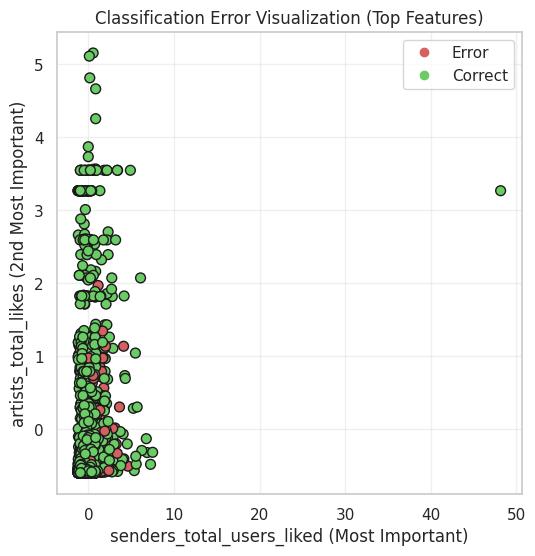
    


**📊 Interpretation of Top Features & Classification Errors**

* **Dominant Feature Influence:** `senders_total_users_liked` and `artists_total_likes` stand out as the most critical features for identifying track popularity, yielding a high overall model accuracy of **95.34%**.
* **High-Density Decision Boundary:** The concentration of red error points below an item value of 1.5 indicates an overlap zone where low-engagement tracks look identical, making it difficult for a linear model to draw a perfect separation line.
* **Isolated High-Value Success:** The clear green outlier near 48 on the X-axis proves that extreme, viral-level social metrics are perfectly easy for the model to classify as popular without triggering false positives.

### 2.2 Support Vector Machines (SVM) 

We'll test standard (Linear) SVM . Support Vector Machines tend to handle boundaries very well, particularly margin spacing in hyperplanes. We pass `probability=True` during initialization of SVC, which forces cross-validation based probability calculation so we can plot our ROC curves.


```python
# Linear SVM
svm_linear = SVC(kernel='linear', probability=True, random_state=42)
svm_linear.fit(X_train_scaled_bin, y_train_bin)
```


<style>#sk-container-id-11 {
  /* Definition of color scheme common for light and dark mode */
  --sklearn-color-text: #000;
  --sklearn-color-text-muted: #666;
  --sklearn-color-line: gray;
  /* Definition of color scheme for unfitted estimators */
  --sklearn-color-unfitted-level-0: #fff5e6;
  --sklearn-color-unfitted-level-1: #f6e4d2;
  --sklearn-color-unfitted-level-2: #ffe0b3;
  --sklearn-color-unfitted-level-3: chocolate;
  /* Definition of color scheme for fitted estimators */
  --sklearn-color-fitted-level-0: #f0f8ff;
  --sklearn-color-fitted-level-1: #d4ebff;
  --sklearn-color-fitted-level-2: #b3dbfd;
  --sklearn-color-fitted-level-3: cornflowerblue;
}

#sk-container-id-11.light {
  /* Specific color for light theme */
  --sklearn-color-text-on-default-background: black;
  --sklearn-color-background: white;
  --sklearn-color-border-box: black;
  --sklearn-color-icon: #696969;
}

#sk-container-id-11.dark {
  --sklearn-color-text-on-default-background: white;
  --sklearn-color-background: #111;
  --sklearn-color-border-box: white;
  --sklearn-color-icon: #878787;
}

#sk-container-id-11 {
  color: var(--sklearn-color-text);
}

#sk-container-id-11 pre {
  padding: 0;
}

#sk-container-id-11 input.sk-hidden--visually {
  border: 0;
  clip: rect(1px 1px 1px 1px);
  clip: rect(1px, 1px, 1px, 1px);
  height: 1px;
  margin: -1px;
  overflow: hidden;
  padding: 0;
  position: absolute;
  width: 1px;
}

#sk-container-id-11 div.sk-dashed-wrapped {
  border: 1px dashed var(--sklearn-color-line);
  margin: 0 0.4em 0.5em 0.4em;
  box-sizing: border-box;
  padding-bottom: 0.4em;
  background-color: var(--sklearn-color-background);
}

#sk-container-id-11 div.sk-container {
  /* jupyter's `normalize.less` sets `[hidden] { display: none; }`
     but bootstrap.min.css set `[hidden] { display: none !important; }`
     so we also need the `!important` here to be able to override the
     default hidden behavior on the sphinx rendered scikit-learn.org.
     See: https://github.com/scikit-learn/scikit-learn/issues/21755 */
  display: inline-block !important;
  position: relative;
}

#sk-container-id-11 div.sk-text-repr-fallback {
  display: none;
}

div.sk-parallel-item,
div.sk-serial,
div.sk-item {
  /* draw centered vertical line to link estimators */
  background-image: linear-gradient(var(--sklearn-color-text-on-default-background), var(--sklearn-color-text-on-default-background));
  background-size: 2px 100%;
  background-repeat: no-repeat;
  background-position: center center;
}

/* Parallel-specific style estimator block */

#sk-container-id-11 div.sk-parallel-item::after {
  content: "";
  width: 100%;
  border-bottom: 2px solid var(--sklearn-color-text-on-default-background);
  flex-grow: 1;
}

#sk-container-id-11 div.sk-parallel {
  display: flex;
  align-items: stretch;
  justify-content: center;
  background-color: var(--sklearn-color-background);
  position: relative;
}

#sk-container-id-11 div.sk-parallel-item {
  display: flex;
  flex-direction: column;
}

#sk-container-id-11 div.sk-parallel-item:first-child::after {
  align-self: flex-end;
  width: 50%;
}

#sk-container-id-11 div.sk-parallel-item:last-child::after {
  align-self: flex-start;
  width: 50%;
}

#sk-container-id-11 div.sk-parallel-item:only-child::after {
  width: 0;
}

/* Serial-specific style estimator block */

#sk-container-id-11 div.sk-serial {
  display: flex;
  flex-direction: column;
  align-items: center;
  background-color: var(--sklearn-color-background);
  padding-right: 1em;
  padding-left: 1em;
}


/* Toggleable style: style used for estimator/Pipeline/ColumnTransformer box that is
clickable and can be expanded/collapsed.
- Pipeline and ColumnTransformer use this feature and define the default style
- Estimators will overwrite some part of the style using the `sk-estimator` class
*/

/* Pipeline and ColumnTransformer style (default) */

#sk-container-id-11 div.sk-toggleable {
  /* Default theme specific background. It is overwritten whether we have a
  specific estimator or a Pipeline/ColumnTransformer */
  background-color: var(--sklearn-color-background);
}

/* Toggleable label */
#sk-container-id-11 label.sk-toggleable__label {
  cursor: pointer;
  display: flex;
  width: 100%;
  margin-bottom: 0;
  padding: 0.5em;
  box-sizing: border-box;
  text-align: center;
  align-items: center;
  justify-content: center;
  gap: 0.5em;
}

#sk-container-id-11 label.sk-toggleable__label .caption {
  font-size: 0.6rem;
  font-weight: lighter;
  color: var(--sklearn-color-text-muted);
}

#sk-container-id-11 label.sk-toggleable__label-arrow:before {
  /* Arrow on the left of the label */
  content: "▸";
  float: left;
  margin-right: 0.25em;
  color: var(--sklearn-color-icon);
}

#sk-container-id-11 label.sk-toggleable__label-arrow:hover:before {
  color: var(--sklearn-color-text);
}

/* Toggleable content - dropdown */

#sk-container-id-11 div.sk-toggleable__content {
  display: none;
  text-align: left;
  /* unfitted */
  background-color: var(--sklearn-color-unfitted-level-0);
}

#sk-container-id-11 div.sk-toggleable__content.fitted {
  /* fitted */
  background-color: var(--sklearn-color-fitted-level-0);
}

#sk-container-id-11 div.sk-toggleable__content pre {
  margin: 0.2em;
  border-radius: 0.25em;
  color: var(--sklearn-color-text);
  /* unfitted */
  background-color: var(--sklearn-color-unfitted-level-0);
}

#sk-container-id-11 div.sk-toggleable__content.fitted pre {
  /* unfitted */
  background-color: var(--sklearn-color-fitted-level-0);
}

#sk-container-id-11 input.sk-toggleable__control:checked~div.sk-toggleable__content {
  /* Expand drop-down */
  display: block;
  width: 100%;
  overflow: visible;
}

#sk-container-id-11 input.sk-toggleable__control:checked~label.sk-toggleable__label-arrow:before {
  content: "▾";
}

/* Pipeline/ColumnTransformer-specific style */

#sk-container-id-11 div.sk-label input.sk-toggleable__control:checked~label.sk-toggleable__label {
  color: var(--sklearn-color-text);
  background-color: var(--sklearn-color-unfitted-level-2);
}

#sk-container-id-11 div.sk-label.fitted input.sk-toggleable__control:checked~label.sk-toggleable__label {
  background-color: var(--sklearn-color-fitted-level-2);
}

/* Estimator-specific style */

/* Colorize estimator box */
#sk-container-id-11 div.sk-estimator input.sk-toggleable__control:checked~label.sk-toggleable__label {
  /* unfitted */
  background-color: var(--sklearn-color-unfitted-level-2);
}

#sk-container-id-11 div.sk-estimator.fitted input.sk-toggleable__control:checked~label.sk-toggleable__label {
  /* fitted */
  background-color: var(--sklearn-color-fitted-level-2);
}

#sk-container-id-11 div.sk-label label.sk-toggleable__label,
#sk-container-id-11 div.sk-label label {
  /* The background is the default theme color */
  color: var(--sklearn-color-text-on-default-background);
}

/* On hover, darken the color of the background */
#sk-container-id-11 div.sk-label:hover label.sk-toggleable__label {
  color: var(--sklearn-color-text);
  background-color: var(--sklearn-color-unfitted-level-2);
}

/* Label box, darken color on hover, fitted */
#sk-container-id-11 div.sk-label.fitted:hover label.sk-toggleable__label.fitted {
  color: var(--sklearn-color-text);
  background-color: var(--sklearn-color-fitted-level-2);
}

/* Estimator label */

#sk-container-id-11 div.sk-label label {
  font-family: monospace;
  font-weight: bold;
  line-height: 1.2em;
}

#sk-container-id-11 div.sk-label-container {
  text-align: center;
}

/* Estimator-specific */
#sk-container-id-11 div.sk-estimator {
  font-family: monospace;
  border: 1px dotted var(--sklearn-color-border-box);
  border-radius: 0.25em;
  box-sizing: border-box;
  margin-bottom: 0.5em;
  /* unfitted */
  background-color: var(--sklearn-color-unfitted-level-0);
}

#sk-container-id-11 div.sk-estimator.fitted {
  /* fitted */
  background-color: var(--sklearn-color-fitted-level-0);
}

/* on hover */
#sk-container-id-11 div.sk-estimator:hover {
  /* unfitted */
  background-color: var(--sklearn-color-unfitted-level-2);
}

#sk-container-id-11 div.sk-estimator.fitted:hover {
  /* fitted */
  background-color: var(--sklearn-color-fitted-level-2);
}

/* Specification for estimator info (e.g. "i" and "?") */

/* Common style for "i" and "?" */

.sk-estimator-doc-link,
a:link.sk-estimator-doc-link,
a:visited.sk-estimator-doc-link {
  float: right;
  font-size: smaller;
  line-height: 1em;
  font-family: monospace;
  background-color: var(--sklearn-color-unfitted-level-0);
  border-radius: 1em;
  height: 1em;
  width: 1em;
  text-decoration: none !important;
  margin-left: 0.5em;
  text-align: center;
  /* unfitted */
  border: var(--sklearn-color-unfitted-level-3) 1pt solid;
  color: var(--sklearn-color-unfitted-level-3);
}

.sk-estimator-doc-link.fitted,
a:link.sk-estimator-doc-link.fitted,
a:visited.sk-estimator-doc-link.fitted {
  /* fitted */
  background-color: var(--sklearn-color-fitted-level-0);
  border: var(--sklearn-color-fitted-level-3) 1pt solid;
  color: var(--sklearn-color-fitted-level-3);
}

/* On hover */
div.sk-estimator:hover .sk-estimator-doc-link:hover,
.sk-estimator-doc-link:hover,
div.sk-label-container:hover .sk-estimator-doc-link:hover,
.sk-estimator-doc-link:hover {
  /* unfitted */
  background-color: var(--sklearn-color-unfitted-level-3);
  border: var(--sklearn-color-fitted-level-0) 1pt solid;
  color: var(--sklearn-color-unfitted-level-0);
  text-decoration: none;
}

div.sk-estimator.fitted:hover .sk-estimator-doc-link.fitted:hover,
.sk-estimator-doc-link.fitted:hover,
div.sk-label-container:hover .sk-estimator-doc-link.fitted:hover,
.sk-estimator-doc-link.fitted:hover {
  /* fitted */
  background-color: var(--sklearn-color-fitted-level-3);
  border: var(--sklearn-color-fitted-level-0) 1pt solid;
  color: var(--sklearn-color-fitted-level-0);
  text-decoration: none;
}

/* Span, style for the box shown on hovering the info icon */
.sk-estimator-doc-link span {
  display: none;
  z-index: 9999;
  position: relative;
  font-weight: normal;
  right: .2ex;
  padding: .5ex;
  margin: .5ex;
  width: min-content;
  min-width: 20ex;
  max-width: 50ex;
  color: var(--sklearn-color-text);
  box-shadow: 2pt 2pt 4pt #999;
  /* unfitted */
  background: var(--sklearn-color-unfitted-level-0);
  border: .5pt solid var(--sklearn-color-unfitted-level-3);
}

.sk-estimator-doc-link.fitted span {
  /* fitted */
  background: var(--sklearn-color-fitted-level-0);
  border: var(--sklearn-color-fitted-level-3);
}

.sk-estimator-doc-link:hover span {
  display: block;
}

/* "?"-specific style due to the `<a>` HTML tag */

#sk-container-id-11 a.estimator_doc_link {
  float: right;
  font-size: 1rem;
  line-height: 1em;
  font-family: monospace;
  background-color: var(--sklearn-color-unfitted-level-0);
  border-radius: 1rem;
  height: 1rem;
  width: 1rem;
  text-decoration: none;
  /* unfitted */
  color: var(--sklearn-color-unfitted-level-1);
  border: var(--sklearn-color-unfitted-level-1) 1pt solid;
}

#sk-container-id-11 a.estimator_doc_link.fitted {
  /* fitted */
  background-color: var(--sklearn-color-fitted-level-0);
  border: var(--sklearn-color-fitted-level-1) 1pt solid;
  color: var(--sklearn-color-fitted-level-1);
}

/* On hover */
#sk-container-id-11 a.estimator_doc_link:hover {
  /* unfitted */
  background-color: var(--sklearn-color-unfitted-level-3);
  color: var(--sklearn-color-background);
  text-decoration: none;
}

#sk-container-id-11 a.estimator_doc_link.fitted:hover {
  /* fitted */
  background-color: var(--sklearn-color-fitted-level-3);
}

.estimator-table {
    font-family: monospace;
}

.estimator-table summary {
    padding: .5rem;
    cursor: pointer;
}

.estimator-table summary::marker {
    font-size: 0.7rem;
}

.estimator-table details[open] {
    padding-left: 0.1rem;
    padding-right: 0.1rem;
    padding-bottom: 0.3rem;
}

.estimator-table .parameters-table {
    margin-left: auto !important;
    margin-right: auto !important;
    margin-top: 0;
}

.estimator-table .parameters-table tr:nth-child(odd) {
    background-color: #fff;
}

.estimator-table .parameters-table tr:nth-child(even) {
    background-color: #f6f6f6;
}

.estimator-table .parameters-table tr:hover {
    background-color: #e0e0e0;
}

.estimator-table table td {
    border: 1px solid rgba(106, 105, 104, 0.232);
}

/*
    `table td`is set in notebook with right text-align.
    We need to overwrite it.
*/
.estimator-table table td.param {
    text-align: left;
    position: relative;
    padding: 0;
}

.user-set td {
    color:rgb(255, 94, 0);
    text-align: left !important;
}

.user-set td.value {
    color:rgb(255, 94, 0);
    background-color: transparent;
}

.default td {
    color: black;
    text-align: left !important;
}

.user-set td i,
.default td i {
    color: black;
}

/*
    Styles for parameter documentation links
    We need styling for visited so jupyter doesn't overwrite it
*/
a.param-doc-link,
a.param-doc-link:link,
a.param-doc-link:visited {
    text-decoration: underline dashed;
    text-underline-offset: .3em;
    color: inherit;
    display: block;
    padding: .5em;
}

/* "hack" to make the entire area of the cell containing the link clickable */
a.param-doc-link::before {
    position: absolute;
    content: "";
    inset: 0;
}

.param-doc-description {
    display: none;
    position: absolute;
    z-index: 9999;
    left: 0;
    padding: .5ex;
    margin-left: 1.5em;
    color: var(--sklearn-color-text);
    box-shadow: .3em .3em .4em #999;
    width: max-content;
    text-align: left;
    max-height: 10em;
    overflow-y: auto;

    /* unfitted */
    background: var(--sklearn-color-unfitted-level-0);
    border: thin solid var(--sklearn-color-unfitted-level-3);
}

/* Fitted state for parameter tooltips */
.fitted .param-doc-description {
    /* fitted */
    background: var(--sklearn-color-fitted-level-0);
    border: thin solid var(--sklearn-color-fitted-level-3);
}

.param-doc-link:hover .param-doc-description {
    display: block;
}

.copy-paste-icon {
    background-image: url();
    background-repeat: no-repeat;
    background-size: 14px 14px;
    background-position: 0;
    display: inline-block;
    width: 14px;
    height: 14px;
    cursor: pointer;
}
</style><body><div id="sk-container-id-11" class="sk-top-container"><div class="sk-text-repr-fallback"><pre>SVC(kernel=&#x27;linear&#x27;, probability=True, random_state=42)</pre><b>In a Jupyter environment, please rerun this cell to show the HTML representation or trust the notebook. <br />On GitHub, the HTML representation is unable to render, please try loading this page with nbviewer.org.</b></div><div class="sk-container" hidden><div class="sk-item"><div class="sk-estimator fitted sk-toggleable"><input class="sk-toggleable__control sk-hidden--visually" id="sk-estimator-id-19" type="checkbox" checked><label for="sk-estimator-id-19" class="sk-toggleable__label fitted sk-toggleable__label-arrow"><div><div>SVC</div></div><div><a class="sk-estimator-doc-link fitted" rel="noreferrer" target="_blank" href="https://scikit-learn.org/1.8/modules/generated/sklearn.svm.SVC.html">?<span>Documentation for SVC</span></a><span class="sk-estimator-doc-link fitted">i<span>Fitted</span></span></div></label><div class="sk-toggleable__content fitted" data-param-prefix="">
        <div class="estimator-table">
            <details>
                <summary>Parameters</summary>
                <table class="parameters-table">
                  <tbody>

        <tr class="default">
            <td><i class="copy-paste-icon"
                 onclick="copyToClipboard('C',
                          this.parentElement.nextElementSibling)"
            ></i></td>
            <td class="param">
        <a class="param-doc-link"
            rel="noreferrer" target="_blank" href="https://scikit-learn.org/1.8/modules/generated/sklearn.svm.SVC.html#:~:text=C,-float%2C%20default%3D1.0">
            C
            <span class="param-doc-description">C: float, default=1.0<br><br>Regularization parameter. The strength of the regularization is<br>inversely proportional to C. Must be strictly positive. The penalty<br>is a squared l2 penalty. For an intuitive visualization of the effects<br>of scaling the regularization parameter C, see<br>:ref:`sphx_glr_auto_examples_svm_plot_svm_scale_c.py`.</span>
        </a>
    </td>
            <td class="value">1.0</td>
        </tr>


        <tr class="user-set">
            <td><i class="copy-paste-icon"
                 onclick="copyToClipboard('kernel',
                          this.parentElement.nextElementSibling)"
            ></i></td>
            <td class="param">
        <a class="param-doc-link"
            rel="noreferrer" target="_blank" href="https://scikit-learn.org/1.8/modules/generated/sklearn.svm.SVC.html#:~:text=kernel,-%7B%27linear%27%2C%20%27poly%27%2C%20%27rbf%27%2C%20%27sigmoid%27%2C%20%27precomputed%27%7D%20or%20callable%2C%20%20%20%20%20%20%20%20%20%20default%3D%27rbf%27">
            kernel
            <span class="param-doc-description">kernel: {'linear', 'poly', 'rbf', 'sigmoid', 'precomputed'} or callable,          default='rbf'<br><br>Specifies the kernel type to be used in the algorithm. If<br>none is given, 'rbf' will be used. If a callable is given it is used to<br>pre-compute the kernel matrix from data matrices; that matrix should be<br>an array of shape ``(n_samples, n_samples)``. For an intuitive<br>visualization of different kernel types see<br>:ref:`sphx_glr_auto_examples_svm_plot_svm_kernels.py`.</span>
        </a>
    </td>
            <td class="value">&#x27;linear&#x27;</td>
        </tr>


        <tr class="default">
            <td><i class="copy-paste-icon"
                 onclick="copyToClipboard('degree',
                          this.parentElement.nextElementSibling)"
            ></i></td>
            <td class="param">
        <a class="param-doc-link"
            rel="noreferrer" target="_blank" href="https://scikit-learn.org/1.8/modules/generated/sklearn.svm.SVC.html#:~:text=degree,-int%2C%20default%3D3">
            degree
            <span class="param-doc-description">degree: int, default=3<br><br>Degree of the polynomial kernel function ('poly').<br>Must be non-negative. Ignored by all other kernels.</span>
        </a>
    </td>
            <td class="value">3</td>
        </tr>


        <tr class="default">
            <td><i class="copy-paste-icon"
                 onclick="copyToClipboard('gamma',
                          this.parentElement.nextElementSibling)"
            ></i></td>
            <td class="param">
        <a class="param-doc-link"
            rel="noreferrer" target="_blank" href="https://scikit-learn.org/1.8/modules/generated/sklearn.svm.SVC.html#:~:text=gamma,-%7B%27scale%27%2C%20%27auto%27%7D%20or%20float%2C%20default%3D%27scale%27">
            gamma
            <span class="param-doc-description">gamma: {'scale', 'auto'} or float, default='scale'<br><br>Kernel coefficient for 'rbf', 'poly' and 'sigmoid'.<br><br>- if ``gamma='scale'`` (default) is passed then it uses<br>  1 / (n_features * X.var()) as value of gamma,<br>- if 'auto', uses 1 / n_features<br>- if float, must be non-negative.<br><br>.. versionchanged:: 0.22<br>   The default value of ``gamma`` changed from 'auto' to 'scale'.</span>
        </a>
    </td>
            <td class="value">&#x27;scale&#x27;</td>
        </tr>


        <tr class="default">
            <td><i class="copy-paste-icon"
                 onclick="copyToClipboard('coef0',
                          this.parentElement.nextElementSibling)"
            ></i></td>
            <td class="param">
        <a class="param-doc-link"
            rel="noreferrer" target="_blank" href="https://scikit-learn.org/1.8/modules/generated/sklearn.svm.SVC.html#:~:text=coef0,-float%2C%20default%3D0.0">
            coef0
            <span class="param-doc-description">coef0: float, default=0.0<br><br>Independent term in kernel function.<br>It is only significant in 'poly' and 'sigmoid'.</span>
        </a>
    </td>
            <td class="value">0.0</td>
        </tr>


        <tr class="default">
            <td><i class="copy-paste-icon"
                 onclick="copyToClipboard('shrinking',
                          this.parentElement.nextElementSibling)"
            ></i></td>
            <td class="param">
        <a class="param-doc-link"
            rel="noreferrer" target="_blank" href="https://scikit-learn.org/1.8/modules/generated/sklearn.svm.SVC.html#:~:text=shrinking,-bool%2C%20default%3DTrue">
            shrinking
            <span class="param-doc-description">shrinking: bool, default=True<br><br>Whether to use the shrinking heuristic.<br>See the :ref:`User Guide <shrinking_svm>`.</span>
        </a>
    </td>
            <td class="value">True</td>
        </tr>


        <tr class="user-set">
            <td><i class="copy-paste-icon"
                 onclick="copyToClipboard('probability',
                          this.parentElement.nextElementSibling)"
            ></i></td>
            <td class="param">
        <a class="param-doc-link"
            rel="noreferrer" target="_blank" href="https://scikit-learn.org/1.8/modules/generated/sklearn.svm.SVC.html#:~:text=probability,-bool%2C%20default%3DFalse">
            probability
            <span class="param-doc-description">probability: bool, default=False<br><br>Whether to enable probability estimates. This must be enabled prior<br>to calling `fit`, will slow down that method as it internally uses<br>5-fold cross-validation, and `predict_proba` may be inconsistent with<br>`predict`. Read more in the :ref:`User Guide <scores_probabilities>`.</span>
        </a>
    </td>
            <td class="value">True</td>
        </tr>


        <tr class="default">
            <td><i class="copy-paste-icon"
                 onclick="copyToClipboard('tol',
                          this.parentElement.nextElementSibling)"
            ></i></td>
            <td class="param">
        <a class="param-doc-link"
            rel="noreferrer" target="_blank" href="https://scikit-learn.org/1.8/modules/generated/sklearn.svm.SVC.html#:~:text=tol,-float%2C%20default%3D1e-3">
            tol
            <span class="param-doc-description">tol: float, default=1e-3<br><br>Tolerance for stopping criterion.</span>
        </a>
    </td>
            <td class="value">0.001</td>
        </tr>


        <tr class="default">
            <td><i class="copy-paste-icon"
                 onclick="copyToClipboard('cache_size',
                          this.parentElement.nextElementSibling)"
            ></i></td>
            <td class="param">
        <a class="param-doc-link"
            rel="noreferrer" target="_blank" href="https://scikit-learn.org/1.8/modules/generated/sklearn.svm.SVC.html#:~:text=cache_size,-float%2C%20default%3D200">
            cache_size
            <span class="param-doc-description">cache_size: float, default=200<br><br>Specify the size of the kernel cache (in MB).</span>
        </a>
    </td>
            <td class="value">200</td>
        </tr>


        <tr class="default">
            <td><i class="copy-paste-icon"
                 onclick="copyToClipboard('class_weight',
                          this.parentElement.nextElementSibling)"
            ></i></td>
            <td class="param">
        <a class="param-doc-link"
            rel="noreferrer" target="_blank" href="https://scikit-learn.org/1.8/modules/generated/sklearn.svm.SVC.html#:~:text=class_weight,-dict%20or%20%27balanced%27%2C%20default%3DNone">
            class_weight
            <span class="param-doc-description">class_weight: dict or 'balanced', default=None<br><br>Set the parameter C of class i to class_weight[i]*C for<br>SVC. If not given, all classes are supposed to have<br>weight one.<br>The "balanced" mode uses the values of y to automatically adjust<br>weights inversely proportional to class frequencies in the input data<br>as ``n_samples / (n_classes * np.bincount(y))``.</span>
        </a>
    </td>
            <td class="value">None</td>
        </tr>


        <tr class="default">
            <td><i class="copy-paste-icon"
                 onclick="copyToClipboard('verbose',
                          this.parentElement.nextElementSibling)"
            ></i></td>
            <td class="param">
        <a class="param-doc-link"
            rel="noreferrer" target="_blank" href="https://scikit-learn.org/1.8/modules/generated/sklearn.svm.SVC.html#:~:text=verbose,-bool%2C%20default%3DFalse">
            verbose
            <span class="param-doc-description">verbose: bool, default=False<br><br>Enable verbose output. Note that this setting takes advantage of a<br>per-process runtime setting in libsvm that, if enabled, may not work<br>properly in a multithreaded context.</span>
        </a>
    </td>
            <td class="value">False</td>
        </tr>


        <tr class="default">
            <td><i class="copy-paste-icon"
                 onclick="copyToClipboard('max_iter',
                          this.parentElement.nextElementSibling)"
            ></i></td>
            <td class="param">
        <a class="param-doc-link"
            rel="noreferrer" target="_blank" href="https://scikit-learn.org/1.8/modules/generated/sklearn.svm.SVC.html#:~:text=max_iter,-int%2C%20default%3D-1">
            max_iter
            <span class="param-doc-description">max_iter: int, default=-1<br><br>Hard limit on iterations within solver, or -1 for no limit.</span>
        </a>
    </td>
            <td class="value">-1</td>
        </tr>


        <tr class="default">
            <td><i class="copy-paste-icon"
                 onclick="copyToClipboard('decision_function_shape',
                          this.parentElement.nextElementSibling)"
            ></i></td>
            <td class="param">
        <a class="param-doc-link"
            rel="noreferrer" target="_blank" href="https://scikit-learn.org/1.8/modules/generated/sklearn.svm.SVC.html#:~:text=decision_function_shape,-%7B%27ovo%27%2C%20%27ovr%27%7D%2C%20default%3D%27ovr%27">
            decision_function_shape
            <span class="param-doc-description">decision_function_shape: {'ovo', 'ovr'}, default='ovr'<br><br>Whether to return a one-vs-rest ('ovr') decision function of shape<br>(n_samples, n_classes) as all other classifiers, or the original<br>one-vs-one ('ovo') decision function of libsvm which has shape<br>(n_samples, n_classes * (n_classes - 1) / 2). However, note that<br>internally, one-vs-one ('ovo') is always used as a multi-class strategy<br>to train models; an ovr matrix is only constructed from the ovo matrix.<br>The parameter is ignored for binary classification.<br><br>.. versionchanged:: 0.19<br>    decision_function_shape is 'ovr' by default.<br><br>.. versionadded:: 0.17<br>   *decision_function_shape='ovr'* is recommended.<br><br>.. versionchanged:: 0.17<br>   Deprecated *decision_function_shape='ovo' and None*.</span>
        </a>
    </td>
            <td class="value">&#x27;ovr&#x27;</td>
        </tr>


        <tr class="default">
            <td><i class="copy-paste-icon"
                 onclick="copyToClipboard('break_ties',
                          this.parentElement.nextElementSibling)"
            ></i></td>
            <td class="param">
        <a class="param-doc-link"
            rel="noreferrer" target="_blank" href="https://scikit-learn.org/1.8/modules/generated/sklearn.svm.SVC.html#:~:text=break_ties,-bool%2C%20default%3DFalse">
            break_ties
            <span class="param-doc-description">break_ties: bool, default=False<br><br>If true, ``decision_function_shape='ovr'``, and number of classes > 2,<br>:term:`predict` will break ties according to the confidence values of<br>:term:`decision_function`; otherwise the first class among the tied<br>classes is returned. Please note that breaking ties comes at a<br>relatively high computational cost compared to a simple predict. See<br>:ref:`sphx_glr_auto_examples_svm_plot_svm_tie_breaking.py` for an<br>example of its usage with ``decision_function_shape='ovr'``.<br><br>.. versionadded:: 0.22</span>
        </a>
    </td>
            <td class="value">False</td>
        </tr>


        <tr class="user-set">
            <td><i class="copy-paste-icon"
                 onclick="copyToClipboard('random_state',
                          this.parentElement.nextElementSibling)"
            ></i></td>
            <td class="param">
        <a class="param-doc-link"
            rel="noreferrer" target="_blank" href="https://scikit-learn.org/1.8/modules/generated/sklearn.svm.SVC.html#:~:text=random_state,-int%2C%20RandomState%20instance%20or%20None%2C%20default%3DNone">
            random_state
            <span class="param-doc-description">random_state: int, RandomState instance or None, default=None<br><br>Controls the pseudo random number generation for shuffling the data for<br>probability estimates. Ignored when `probability` is False.<br>Pass an int for reproducible output across multiple function calls.<br>See :term:`Glossary <random_state>`.</span>
        </a>
    </td>
            <td class="value">42</td>
        </tr>

                  </tbody>
                </table>
            </details>
        </div>
    </div></div></div></div></div><script>function copyToClipboard(text, element) {
    // Get the parameter prefix from the closest toggleable content
    const toggleableContent = element.closest('.sk-toggleable__content');
    const paramPrefix = toggleableContent ? toggleableContent.dataset.paramPrefix : '';
    const fullParamName = paramPrefix ? `${paramPrefix}${text}` : text;

    const originalStyle = element.style;
    const computedStyle = window.getComputedStyle(element);
    const originalWidth = computedStyle.width;
    const originalHTML = element.innerHTML.replace('Copied!', '');

    navigator.clipboard.writeText(fullParamName)
        .then(() => {
            element.style.width = originalWidth;
            element.style.color = 'green';
            element.innerHTML = "Copied!";

            setTimeout(() => {
                element.innerHTML = originalHTML;
                element.style = originalStyle;
            }, 2000);
        })
        .catch(err => {
            console.error('Failed to copy:', err);
            element.style.color = 'red';
            element.innerHTML = "Failed!";
            setTimeout(() => {
                element.innerHTML = originalHTML;
                element.style = originalStyle;
            }, 2000);
        });
    return false;
}

document.querySelectorAll('.copy-paste-icon').forEach(function(element) {
    const toggleableContent = element.closest('.sk-toggleable__content');
    const paramPrefix = toggleableContent ? toggleableContent.dataset.paramPrefix : '';
    const paramName = element.parentElement.nextElementSibling
        .textContent.trim().split(' ')[0];
    const fullParamName = paramPrefix ? `${paramPrefix}${paramName}` : paramName;

    element.setAttribute('title', fullParamName);
});


/**
 * Adapted from Skrub
 * https://github.com/skrub-data/skrub/blob/403466d1d5d4dc76a7ef569b3f8228db59a31dc3/skrub/_reporting/_data/templates/report.js#L789
 * @returns "light" or "dark"
 */
function detectTheme(element) {
    const body = document.querySelector('body');

    // Check VSCode theme
    const themeKindAttr = body.getAttribute('data-vscode-theme-kind');
    const themeNameAttr = body.getAttribute('data-vscode-theme-name');

    if (themeKindAttr && themeNameAttr) {
        const themeKind = themeKindAttr.toLowerCase();
        const themeName = themeNameAttr.toLowerCase();

        if (themeKind.includes("dark") || themeName.includes("dark")) {
            return "dark";
        }
        if (themeKind.includes("light") || themeName.includes("light")) {
            return "light";
        }
    }

    // Check Jupyter theme
    if (body.getAttribute('data-jp-theme-light') === 'false') {
        return 'dark';
    } else if (body.getAttribute('data-jp-theme-light') === 'true') {
        return 'light';
    }

    // Guess based on a parent element's color
    const color = window.getComputedStyle(element.parentNode, null).getPropertyValue('color');
    const match = color.match(/^rgb\s*\(\s*(\d+)\s*,\s*(\d+)\s*,\s*(\d+)\s*\)\s*$/i);
    if (match) {
        const [r, g, b] = [
            parseFloat(match[1]),
            parseFloat(match[2]),
            parseFloat(match[3])
        ];

        // https://en.wikipedia.org/wiki/HSL_and_HSV#Lightness
        const luma = 0.299 * r + 0.587 * g + 0.114 * b;

        if (luma > 180) {
            // If the text is very bright we have a dark theme
            return 'dark';
        }
        if (luma < 75) {
            // If the text is very dark we have a light theme
            return 'light';
        }
        // Otherwise fall back to the next heuristic.
    }

    // Fallback to system preference
    return window.matchMedia('(prefers-color-scheme: dark)').matches ? 'dark' : 'light';
}


function forceTheme(elementId) {
    const estimatorElement = document.querySelector(`#${elementId}`);
    if (estimatorElement === null) {
        console.error(`Element with id ${elementId} not found.`);
    } else {
        const theme = detectTheme(estimatorElement);
        estimatorElement.classList.add(theme);
    }
}

forceTheme('sk-container-id-11');</script></body>


```python
y_pred_svm_lin = svm_linear.predict(X_test_scaled_bin)
y_prob_svm_lin = svm_linear.predict_proba(X_test_scaled_bin)[:, 1]

evaluate_binary_classification("SVM (Linear Kernel)", y_test_bin, y_pred_svm_lin, y_prob_svm_lin)
```

    
    ========================================
    🌟 SVM (Linear Kernel) Evaluation
    ========================================
    🔸 Accuracy:  0.9506
    🔸 Precision: 0.7656
    🔸 Recall:    0.3500
    🔸 F1-Score:  0.7272
    


    

    


#### 📝 Model Analysis: SVM (Linear Kernel)

* **Robust Class Separation:** A strong ROC AUC of **0.91** demonstrates that a linear decision boundary preserves high discriminative ability between popular and non-popular tracks.
* **Aggressively Conservative Predictions:** At baseline parameters, the model prioritizes avoiding false alarms—yielding our highest Precision yet (**76.56%**)—but sacrifices volume by missing 91 true hits, dropping Recall to **35.00%**.
* **Imbalance Impact:** The lower Recall directly pulls down the macro-averaged F1-Score to **0.7272**, highlighting that the linear hyperplane is playing it too safe due to the dominant negative class.
* **Tuning Direction:** The identical 0.91 AUC to Logistic Regression reveals that a linear shape has hit its performance ceiling; boosting recall requires adjusting the class weights or shifting to a non-linear kernel space.

#### 💪 Making Sense of Weights
Once the regression is done, we can get the weights and get some insight from them. Most importantly, we can see what features has been identified as most important by the algorithm (i.e. those that have the highest values):


```python
svm_linear_weights = svm_linear.coef_[0]

fig, ax = plt.subplots(figsize=(20,8))
y_pos = np.arange(0,len(svm_linear_weights),1)

hbars = ax.barh(y_pos, svm_linear_weights, align='center')
ax.set_yticks(y_pos)
ax.set_yticklabels(labels)
ax.invert_yaxis()
ax.set_xlabel('Weights')
ax.set_title("Importance of each column from the algorithm's point of view")

plt.show()
```


    
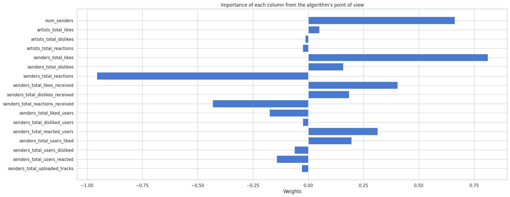
    


#### Transforming to Polynomial Regression:


```python
selector = SelectKBest(mutual_info_classif, k=140)
X_train_transformed = selector.fit_transform(X_train_transformed_poly, y_train)
X_test_transform = selector.transform(X_test_transformed_poly)

scaler_poly = StandardScaler()
X_train_scaled = scaler_poly.fit_transform(X_train_transformed)
X_test_scaled = scaler_poly.transform(X_test_transform)


svm_linear = SVC(kernel='linear', class_weight='balanced', probability=True, random_state=42)
svm_linear.fit(X_train_scaled, y_train_bin)
```


<style>#sk-container-id-12 {
  /* Definition of color scheme common for light and dark mode */
  --sklearn-color-text: #000;
  --sklearn-color-text-muted: #666;
  --sklearn-color-line: gray;
  /* Definition of color scheme for unfitted estimators */
  --sklearn-color-unfitted-level-0: #fff5e6;
  --sklearn-color-unfitted-level-1: #f6e4d2;
  --sklearn-color-unfitted-level-2: #ffe0b3;
  --sklearn-color-unfitted-level-3: chocolate;
  /* Definition of color scheme for fitted estimators */
  --sklearn-color-fitted-level-0: #f0f8ff;
  --sklearn-color-fitted-level-1: #d4ebff;
  --sklearn-color-fitted-level-2: #b3dbfd;
  --sklearn-color-fitted-level-3: cornflowerblue;
}

#sk-container-id-12.light {
  /* Specific color for light theme */
  --sklearn-color-text-on-default-background: black;
  --sklearn-color-background: white;
  --sklearn-color-border-box: black;
  --sklearn-color-icon: #696969;
}

#sk-container-id-12.dark {
  --sklearn-color-text-on-default-background: white;
  --sklearn-color-background: #111;
  --sklearn-color-border-box: white;
  --sklearn-color-icon: #878787;
}

#sk-container-id-12 {
  color: var(--sklearn-color-text);
}

#sk-container-id-12 pre {
  padding: 0;
}

#sk-container-id-12 input.sk-hidden--visually {
  border: 0;
  clip: rect(1px 1px 1px 1px);
  clip: rect(1px, 1px, 1px, 1px);
  height: 1px;
  margin: -1px;
  overflow: hidden;
  padding: 0;
  position: absolute;
  width: 1px;
}

#sk-container-id-12 div.sk-dashed-wrapped {
  border: 1px dashed var(--sklearn-color-line);
  margin: 0 0.4em 0.5em 0.4em;
  box-sizing: border-box;
  padding-bottom: 0.4em;
  background-color: var(--sklearn-color-background);
}

#sk-container-id-12 div.sk-container {
  /* jupyter's `normalize.less` sets `[hidden] { display: none; }`
     but bootstrap.min.css set `[hidden] { display: none !important; }`
     so we also need the `!important` here to be able to override the
     default hidden behavior on the sphinx rendered scikit-learn.org.
     See: https://github.com/scikit-learn/scikit-learn/issues/21755 */
  display: inline-block !important;
  position: relative;
}

#sk-container-id-12 div.sk-text-repr-fallback {
  display: none;
}

div.sk-parallel-item,
div.sk-serial,
div.sk-item {
  /* draw centered vertical line to link estimators */
  background-image: linear-gradient(var(--sklearn-color-text-on-default-background), var(--sklearn-color-text-on-default-background));
  background-size: 2px 100%;
  background-repeat: no-repeat;
  background-position: center center;
}

/* Parallel-specific style estimator block */

#sk-container-id-12 div.sk-parallel-item::after {
  content: "";
  width: 100%;
  border-bottom: 2px solid var(--sklearn-color-text-on-default-background);
  flex-grow: 1;
}

#sk-container-id-12 div.sk-parallel {
  display: flex;
  align-items: stretch;
  justify-content: center;
  background-color: var(--sklearn-color-background);
  position: relative;
}

#sk-container-id-12 div.sk-parallel-item {
  display: flex;
  flex-direction: column;
}

#sk-container-id-12 div.sk-parallel-item:first-child::after {
  align-self: flex-end;
  width: 50%;
}

#sk-container-id-12 div.sk-parallel-item:last-child::after {
  align-self: flex-start;
  width: 50%;
}

#sk-container-id-12 div.sk-parallel-item:only-child::after {
  width: 0;
}

/* Serial-specific style estimator block */

#sk-container-id-12 div.sk-serial {
  display: flex;
  flex-direction: column;
  align-items: center;
  background-color: var(--sklearn-color-background);
  padding-right: 1em;
  padding-left: 1em;
}


/* Toggleable style: style used for estimator/Pipeline/ColumnTransformer box that is
clickable and can be expanded/collapsed.
- Pipeline and ColumnTransformer use this feature and define the default style
- Estimators will overwrite some part of the style using the `sk-estimator` class
*/

/* Pipeline and ColumnTransformer style (default) */

#sk-container-id-12 div.sk-toggleable {
  /* Default theme specific background. It is overwritten whether we have a
  specific estimator or a Pipeline/ColumnTransformer */
  background-color: var(--sklearn-color-background);
}

/* Toggleable label */
#sk-container-id-12 label.sk-toggleable__label {
  cursor: pointer;
  display: flex;
  width: 100%;
  margin-bottom: 0;
  padding: 0.5em;
  box-sizing: border-box;
  text-align: center;
  align-items: center;
  justify-content: center;
  gap: 0.5em;
}

#sk-container-id-12 label.sk-toggleable__label .caption {
  font-size: 0.6rem;
  font-weight: lighter;
  color: var(--sklearn-color-text-muted);
}

#sk-container-id-12 label.sk-toggleable__label-arrow:before {
  /* Arrow on the left of the label */
  content: "▸";
  float: left;
  margin-right: 0.25em;
  color: var(--sklearn-color-icon);
}

#sk-container-id-12 label.sk-toggleable__label-arrow:hover:before {
  color: var(--sklearn-color-text);
}

/* Toggleable content - dropdown */

#sk-container-id-12 div.sk-toggleable__content {
  display: none;
  text-align: left;
  /* unfitted */
  background-color: var(--sklearn-color-unfitted-level-0);
}

#sk-container-id-12 div.sk-toggleable__content.fitted {
  /* fitted */
  background-color: var(--sklearn-color-fitted-level-0);
}

#sk-container-id-12 div.sk-toggleable__content pre {
  margin: 0.2em;
  border-radius: 0.25em;
  color: var(--sklearn-color-text);
  /* unfitted */
  background-color: var(--sklearn-color-unfitted-level-0);
}

#sk-container-id-12 div.sk-toggleable__content.fitted pre {
  /* unfitted */
  background-color: var(--sklearn-color-fitted-level-0);
}

#sk-container-id-12 input.sk-toggleable__control:checked~div.sk-toggleable__content {
  /* Expand drop-down */
  display: block;
  width: 100%;
  overflow: visible;
}

#sk-container-id-12 input.sk-toggleable__control:checked~label.sk-toggleable__label-arrow:before {
  content: "▾";
}

/* Pipeline/ColumnTransformer-specific style */

#sk-container-id-12 div.sk-label input.sk-toggleable__control:checked~label.sk-toggleable__label {
  color: var(--sklearn-color-text);
  background-color: var(--sklearn-color-unfitted-level-2);
}

#sk-container-id-12 div.sk-label.fitted input.sk-toggleable__control:checked~label.sk-toggleable__label {
  background-color: var(--sklearn-color-fitted-level-2);
}

/* Estimator-specific style */

/* Colorize estimator box */
#sk-container-id-12 div.sk-estimator input.sk-toggleable__control:checked~label.sk-toggleable__label {
  /* unfitted */
  background-color: var(--sklearn-color-unfitted-level-2);
}

#sk-container-id-12 div.sk-estimator.fitted input.sk-toggleable__control:checked~label.sk-toggleable__label {
  /* fitted */
  background-color: var(--sklearn-color-fitted-level-2);
}

#sk-container-id-12 div.sk-label label.sk-toggleable__label,
#sk-container-id-12 div.sk-label label {
  /* The background is the default theme color */
  color: var(--sklearn-color-text-on-default-background);
}

/* On hover, darken the color of the background */
#sk-container-id-12 div.sk-label:hover label.sk-toggleable__label {
  color: var(--sklearn-color-text);
  background-color: var(--sklearn-color-unfitted-level-2);
}

/* Label box, darken color on hover, fitted */
#sk-container-id-12 div.sk-label.fitted:hover label.sk-toggleable__label.fitted {
  color: var(--sklearn-color-text);
  background-color: var(--sklearn-color-fitted-level-2);
}

/* Estimator label */

#sk-container-id-12 div.sk-label label {
  font-family: monospace;
  font-weight: bold;
  line-height: 1.2em;
}

#sk-container-id-12 div.sk-label-container {
  text-align: center;
}

/* Estimator-specific */
#sk-container-id-12 div.sk-estimator {
  font-family: monospace;
  border: 1px dotted var(--sklearn-color-border-box);
  border-radius: 0.25em;
  box-sizing: border-box;
  margin-bottom: 0.5em;
  /* unfitted */
  background-color: var(--sklearn-color-unfitted-level-0);
}

#sk-container-id-12 div.sk-estimator.fitted {
  /* fitted */
  background-color: var(--sklearn-color-fitted-level-0);
}

/* on hover */
#sk-container-id-12 div.sk-estimator:hover {
  /* unfitted */
  background-color: var(--sklearn-color-unfitted-level-2);
}

#sk-container-id-12 div.sk-estimator.fitted:hover {
  /* fitted */
  background-color: var(--sklearn-color-fitted-level-2);
}

/* Specification for estimator info (e.g. "i" and "?") */

/* Common style for "i" and "?" */

.sk-estimator-doc-link,
a:link.sk-estimator-doc-link,
a:visited.sk-estimator-doc-link {
  float: right;
  font-size: smaller;
  line-height: 1em;
  font-family: monospace;
  background-color: var(--sklearn-color-unfitted-level-0);
  border-radius: 1em;
  height: 1em;
  width: 1em;
  text-decoration: none !important;
  margin-left: 0.5em;
  text-align: center;
  /* unfitted */
  border: var(--sklearn-color-unfitted-level-3) 1pt solid;
  color: var(--sklearn-color-unfitted-level-3);
}

.sk-estimator-doc-link.fitted,
a:link.sk-estimator-doc-link.fitted,
a:visited.sk-estimator-doc-link.fitted {
  /* fitted */
  background-color: var(--sklearn-color-fitted-level-0);
  border: var(--sklearn-color-fitted-level-3) 1pt solid;
  color: var(--sklearn-color-fitted-level-3);
}

/* On hover */
div.sk-estimator:hover .sk-estimator-doc-link:hover,
.sk-estimator-doc-link:hover,
div.sk-label-container:hover .sk-estimator-doc-link:hover,
.sk-estimator-doc-link:hover {
  /* unfitted */
  background-color: var(--sklearn-color-unfitted-level-3);
  border: var(--sklearn-color-fitted-level-0) 1pt solid;
  color: var(--sklearn-color-unfitted-level-0);
  text-decoration: none;
}

div.sk-estimator.fitted:hover .sk-estimator-doc-link.fitted:hover,
.sk-estimator-doc-link.fitted:hover,
div.sk-label-container:hover .sk-estimator-doc-link.fitted:hover,
.sk-estimator-doc-link.fitted:hover {
  /* fitted */
  background-color: var(--sklearn-color-fitted-level-3);
  border: var(--sklearn-color-fitted-level-0) 1pt solid;
  color: var(--sklearn-color-fitted-level-0);
  text-decoration: none;
}

/* Span, style for the box shown on hovering the info icon */
.sk-estimator-doc-link span {
  display: none;
  z-index: 9999;
  position: relative;
  font-weight: normal;
  right: .2ex;
  padding: .5ex;
  margin: .5ex;
  width: min-content;
  min-width: 20ex;
  max-width: 50ex;
  color: var(--sklearn-color-text);
  box-shadow: 2pt 2pt 4pt #999;
  /* unfitted */
  background: var(--sklearn-color-unfitted-level-0);
  border: .5pt solid var(--sklearn-color-unfitted-level-3);
}

.sk-estimator-doc-link.fitted span {
  /* fitted */
  background: var(--sklearn-color-fitted-level-0);
  border: var(--sklearn-color-fitted-level-3);
}

.sk-estimator-doc-link:hover span {
  display: block;
}

/* "?"-specific style due to the `<a>` HTML tag */

#sk-container-id-12 a.estimator_doc_link {
  float: right;
  font-size: 1rem;
  line-height: 1em;
  font-family: monospace;
  background-color: var(--sklearn-color-unfitted-level-0);
  border-radius: 1rem;
  height: 1rem;
  width: 1rem;
  text-decoration: none;
  /* unfitted */
  color: var(--sklearn-color-unfitted-level-1);
  border: var(--sklearn-color-unfitted-level-1) 1pt solid;
}

#sk-container-id-12 a.estimator_doc_link.fitted {
  /* fitted */
  background-color: var(--sklearn-color-fitted-level-0);
  border: var(--sklearn-color-fitted-level-1) 1pt solid;
  color: var(--sklearn-color-fitted-level-1);
}

/* On hover */
#sk-container-id-12 a.estimator_doc_link:hover {
  /* unfitted */
  background-color: var(--sklearn-color-unfitted-level-3);
  color: var(--sklearn-color-background);
  text-decoration: none;
}

#sk-container-id-12 a.estimator_doc_link.fitted:hover {
  /* fitted */
  background-color: var(--sklearn-color-fitted-level-3);
}

.estimator-table {
    font-family: monospace;
}

.estimator-table summary {
    padding: .5rem;
    cursor: pointer;
}

.estimator-table summary::marker {
    font-size: 0.7rem;
}

.estimator-table details[open] {
    padding-left: 0.1rem;
    padding-right: 0.1rem;
    padding-bottom: 0.3rem;
}

.estimator-table .parameters-table {
    margin-left: auto !important;
    margin-right: auto !important;
    margin-top: 0;
}

.estimator-table .parameters-table tr:nth-child(odd) {
    background-color: #fff;
}

.estimator-table .parameters-table tr:nth-child(even) {
    background-color: #f6f6f6;
}

.estimator-table .parameters-table tr:hover {
    background-color: #e0e0e0;
}

.estimator-table table td {
    border: 1px solid rgba(106, 105, 104, 0.232);
}

/*
    `table td`is set in notebook with right text-align.
    We need to overwrite it.
*/
.estimator-table table td.param {
    text-align: left;
    position: relative;
    padding: 0;
}

.user-set td {
    color:rgb(255, 94, 0);
    text-align: left !important;
}

.user-set td.value {
    color:rgb(255, 94, 0);
    background-color: transparent;
}

.default td {
    color: black;
    text-align: left !important;
}

.user-set td i,
.default td i {
    color: black;
}

/*
    Styles for parameter documentation links
    We need styling for visited so jupyter doesn't overwrite it
*/
a.param-doc-link,
a.param-doc-link:link,
a.param-doc-link:visited {
    text-decoration: underline dashed;
    text-underline-offset: .3em;
    color: inherit;
    display: block;
    padding: .5em;
}

/* "hack" to make the entire area of the cell containing the link clickable */
a.param-doc-link::before {
    position: absolute;
    content: "";
    inset: 0;
}

.param-doc-description {
    display: none;
    position: absolute;
    z-index: 9999;
    left: 0;
    padding: .5ex;
    margin-left: 1.5em;
    color: var(--sklearn-color-text);
    box-shadow: .3em .3em .4em #999;
    width: max-content;
    text-align: left;
    max-height: 10em;
    overflow-y: auto;

    /* unfitted */
    background: var(--sklearn-color-unfitted-level-0);
    border: thin solid var(--sklearn-color-unfitted-level-3);
}

/* Fitted state for parameter tooltips */
.fitted .param-doc-description {
    /* fitted */
    background: var(--sklearn-color-fitted-level-0);
    border: thin solid var(--sklearn-color-fitted-level-3);
}

.param-doc-link:hover .param-doc-description {
    display: block;
}

.copy-paste-icon {
    background-image: url();
    background-repeat: no-repeat;
    background-size: 14px 14px;
    background-position: 0;
    display: inline-block;
    width: 14px;
    height: 14px;
    cursor: pointer;
}
</style><body><div id="sk-container-id-12" class="sk-top-container"><div class="sk-text-repr-fallback"><pre>SVC(class_weight=&#x27;balanced&#x27;, kernel=&#x27;linear&#x27;, probability=True, random_state=42)</pre><b>In a Jupyter environment, please rerun this cell to show the HTML representation or trust the notebook. <br />On GitHub, the HTML representation is unable to render, please try loading this page with nbviewer.org.</b></div><div class="sk-container" hidden><div class="sk-item"><div class="sk-estimator fitted sk-toggleable"><input class="sk-toggleable__control sk-hidden--visually" id="sk-estimator-id-20" type="checkbox" checked><label for="sk-estimator-id-20" class="sk-toggleable__label fitted sk-toggleable__label-arrow"><div><div>SVC</div></div><div><a class="sk-estimator-doc-link fitted" rel="noreferrer" target="_blank" href="https://scikit-learn.org/1.8/modules/generated/sklearn.svm.SVC.html">?<span>Documentation for SVC</span></a><span class="sk-estimator-doc-link fitted">i<span>Fitted</span></span></div></label><div class="sk-toggleable__content fitted" data-param-prefix="">
        <div class="estimator-table">
            <details>
                <summary>Parameters</summary>
                <table class="parameters-table">
                  <tbody>

        <tr class="default">
            <td><i class="copy-paste-icon"
                 onclick="copyToClipboard('C',
                          this.parentElement.nextElementSibling)"
            ></i></td>
            <td class="param">
        <a class="param-doc-link"
            rel="noreferrer" target="_blank" href="https://scikit-learn.org/1.8/modules/generated/sklearn.svm.SVC.html#:~:text=C,-float%2C%20default%3D1.0">
            C
            <span class="param-doc-description">C: float, default=1.0<br><br>Regularization parameter. The strength of the regularization is<br>inversely proportional to C. Must be strictly positive. The penalty<br>is a squared l2 penalty. For an intuitive visualization of the effects<br>of scaling the regularization parameter C, see<br>:ref:`sphx_glr_auto_examples_svm_plot_svm_scale_c.py`.</span>
        </a>
    </td>
            <td class="value">1.0</td>
        </tr>


        <tr class="user-set">
            <td><i class="copy-paste-icon"
                 onclick="copyToClipboard('kernel',
                          this.parentElement.nextElementSibling)"
            ></i></td>
            <td class="param">
        <a class="param-doc-link"
            rel="noreferrer" target="_blank" href="https://scikit-learn.org/1.8/modules/generated/sklearn.svm.SVC.html#:~:text=kernel,-%7B%27linear%27%2C%20%27poly%27%2C%20%27rbf%27%2C%20%27sigmoid%27%2C%20%27precomputed%27%7D%20or%20callable%2C%20%20%20%20%20%20%20%20%20%20default%3D%27rbf%27">
            kernel
            <span class="param-doc-description">kernel: {'linear', 'poly', 'rbf', 'sigmoid', 'precomputed'} or callable,          default='rbf'<br><br>Specifies the kernel type to be used in the algorithm. If<br>none is given, 'rbf' will be used. If a callable is given it is used to<br>pre-compute the kernel matrix from data matrices; that matrix should be<br>an array of shape ``(n_samples, n_samples)``. For an intuitive<br>visualization of different kernel types see<br>:ref:`sphx_glr_auto_examples_svm_plot_svm_kernels.py`.</span>
        </a>
    </td>
            <td class="value">&#x27;linear&#x27;</td>
        </tr>


        <tr class="default">
            <td><i class="copy-paste-icon"
                 onclick="copyToClipboard('degree',
                          this.parentElement.nextElementSibling)"
            ></i></td>
            <td class="param">
        <a class="param-doc-link"
            rel="noreferrer" target="_blank" href="https://scikit-learn.org/1.8/modules/generated/sklearn.svm.SVC.html#:~:text=degree,-int%2C%20default%3D3">
            degree
            <span class="param-doc-description">degree: int, default=3<br><br>Degree of the polynomial kernel function ('poly').<br>Must be non-negative. Ignored by all other kernels.</span>
        </a>
    </td>
            <td class="value">3</td>
        </tr>


        <tr class="default">
            <td><i class="copy-paste-icon"
                 onclick="copyToClipboard('gamma',
                          this.parentElement.nextElementSibling)"
            ></i></td>
            <td class="param">
        <a class="param-doc-link"
            rel="noreferrer" target="_blank" href="https://scikit-learn.org/1.8/modules/generated/sklearn.svm.SVC.html#:~:text=gamma,-%7B%27scale%27%2C%20%27auto%27%7D%20or%20float%2C%20default%3D%27scale%27">
            gamma
            <span class="param-doc-description">gamma: {'scale', 'auto'} or float, default='scale'<br><br>Kernel coefficient for 'rbf', 'poly' and 'sigmoid'.<br><br>- if ``gamma='scale'`` (default) is passed then it uses<br>  1 / (n_features * X.var()) as value of gamma,<br>- if 'auto', uses 1 / n_features<br>- if float, must be non-negative.<br><br>.. versionchanged:: 0.22<br>   The default value of ``gamma`` changed from 'auto' to 'scale'.</span>
        </a>
    </td>
            <td class="value">&#x27;scale&#x27;</td>
        </tr>


        <tr class="default">
            <td><i class="copy-paste-icon"
                 onclick="copyToClipboard('coef0',
                          this.parentElement.nextElementSibling)"
            ></i></td>
            <td class="param">
        <a class="param-doc-link"
            rel="noreferrer" target="_blank" href="https://scikit-learn.org/1.8/modules/generated/sklearn.svm.SVC.html#:~:text=coef0,-float%2C%20default%3D0.0">
            coef0
            <span class="param-doc-description">coef0: float, default=0.0<br><br>Independent term in kernel function.<br>It is only significant in 'poly' and 'sigmoid'.</span>
        </a>
    </td>
            <td class="value">0.0</td>
        </tr>


        <tr class="default">
            <td><i class="copy-paste-icon"
                 onclick="copyToClipboard('shrinking',
                          this.parentElement.nextElementSibling)"
            ></i></td>
            <td class="param">
        <a class="param-doc-link"
            rel="noreferrer" target="_blank" href="https://scikit-learn.org/1.8/modules/generated/sklearn.svm.SVC.html#:~:text=shrinking,-bool%2C%20default%3DTrue">
            shrinking
            <span class="param-doc-description">shrinking: bool, default=True<br><br>Whether to use the shrinking heuristic.<br>See the :ref:`User Guide <shrinking_svm>`.</span>
        </a>
    </td>
            <td class="value">True</td>
        </tr>


        <tr class="user-set">
            <td><i class="copy-paste-icon"
                 onclick="copyToClipboard('probability',
                          this.parentElement.nextElementSibling)"
            ></i></td>
            <td class="param">
        <a class="param-doc-link"
            rel="noreferrer" target="_blank" href="https://scikit-learn.org/1.8/modules/generated/sklearn.svm.SVC.html#:~:text=probability,-bool%2C%20default%3DFalse">
            probability
            <span class="param-doc-description">probability: bool, default=False<br><br>Whether to enable probability estimates. This must be enabled prior<br>to calling `fit`, will slow down that method as it internally uses<br>5-fold cross-validation, and `predict_proba` may be inconsistent with<br>`predict`. Read more in the :ref:`User Guide <scores_probabilities>`.</span>
        </a>
    </td>
            <td class="value">True</td>
        </tr>


        <tr class="default">
            <td><i class="copy-paste-icon"
                 onclick="copyToClipboard('tol',
                          this.parentElement.nextElementSibling)"
            ></i></td>
            <td class="param">
        <a class="param-doc-link"
            rel="noreferrer" target="_blank" href="https://scikit-learn.org/1.8/modules/generated/sklearn.svm.SVC.html#:~:text=tol,-float%2C%20default%3D1e-3">
            tol
            <span class="param-doc-description">tol: float, default=1e-3<br><br>Tolerance for stopping criterion.</span>
        </a>
    </td>
            <td class="value">0.001</td>
        </tr>


        <tr class="default">
            <td><i class="copy-paste-icon"
                 onclick="copyToClipboard('cache_size',
                          this.parentElement.nextElementSibling)"
            ></i></td>
            <td class="param">
        <a class="param-doc-link"
            rel="noreferrer" target="_blank" href="https://scikit-learn.org/1.8/modules/generated/sklearn.svm.SVC.html#:~:text=cache_size,-float%2C%20default%3D200">
            cache_size
            <span class="param-doc-description">cache_size: float, default=200<br><br>Specify the size of the kernel cache (in MB).</span>
        </a>
    </td>
            <td class="value">200</td>
        </tr>


        <tr class="user-set">
            <td><i class="copy-paste-icon"
                 onclick="copyToClipboard('class_weight',
                          this.parentElement.nextElementSibling)"
            ></i></td>
            <td class="param">
        <a class="param-doc-link"
            rel="noreferrer" target="_blank" href="https://scikit-learn.org/1.8/modules/generated/sklearn.svm.SVC.html#:~:text=class_weight,-dict%20or%20%27balanced%27%2C%20default%3DNone">
            class_weight
            <span class="param-doc-description">class_weight: dict or 'balanced', default=None<br><br>Set the parameter C of class i to class_weight[i]*C for<br>SVC. If not given, all classes are supposed to have<br>weight one.<br>The "balanced" mode uses the values of y to automatically adjust<br>weights inversely proportional to class frequencies in the input data<br>as ``n_samples / (n_classes * np.bincount(y))``.</span>
        </a>
    </td>
            <td class="value">&#x27;balanced&#x27;</td>
        </tr>


        <tr class="default">
            <td><i class="copy-paste-icon"
                 onclick="copyToClipboard('verbose',
                          this.parentElement.nextElementSibling)"
            ></i></td>
            <td class="param">
        <a class="param-doc-link"
            rel="noreferrer" target="_blank" href="https://scikit-learn.org/1.8/modules/generated/sklearn.svm.SVC.html#:~:text=verbose,-bool%2C%20default%3DFalse">
            verbose
            <span class="param-doc-description">verbose: bool, default=False<br><br>Enable verbose output. Note that this setting takes advantage of a<br>per-process runtime setting in libsvm that, if enabled, may not work<br>properly in a multithreaded context.</span>
        </a>
    </td>
            <td class="value">False</td>
        </tr>


        <tr class="default">
            <td><i class="copy-paste-icon"
                 onclick="copyToClipboard('max_iter',
                          this.parentElement.nextElementSibling)"
            ></i></td>
            <td class="param">
        <a class="param-doc-link"
            rel="noreferrer" target="_blank" href="https://scikit-learn.org/1.8/modules/generated/sklearn.svm.SVC.html#:~:text=max_iter,-int%2C%20default%3D-1">
            max_iter
            <span class="param-doc-description">max_iter: int, default=-1<br><br>Hard limit on iterations within solver, or -1 for no limit.</span>
        </a>
    </td>
            <td class="value">-1</td>
        </tr>


        <tr class="default">
            <td><i class="copy-paste-icon"
                 onclick="copyToClipboard('decision_function_shape',
                          this.parentElement.nextElementSibling)"
            ></i></td>
            <td class="param">
        <a class="param-doc-link"
            rel="noreferrer" target="_blank" href="https://scikit-learn.org/1.8/modules/generated/sklearn.svm.SVC.html#:~:text=decision_function_shape,-%7B%27ovo%27%2C%20%27ovr%27%7D%2C%20default%3D%27ovr%27">
            decision_function_shape
            <span class="param-doc-description">decision_function_shape: {'ovo', 'ovr'}, default='ovr'<br><br>Whether to return a one-vs-rest ('ovr') decision function of shape<br>(n_samples, n_classes) as all other classifiers, or the original<br>one-vs-one ('ovo') decision function of libsvm which has shape<br>(n_samples, n_classes * (n_classes - 1) / 2). However, note that<br>internally, one-vs-one ('ovo') is always used as a multi-class strategy<br>to train models; an ovr matrix is only constructed from the ovo matrix.<br>The parameter is ignored for binary classification.<br><br>.. versionchanged:: 0.19<br>    decision_function_shape is 'ovr' by default.<br><br>.. versionadded:: 0.17<br>   *decision_function_shape='ovr'* is recommended.<br><br>.. versionchanged:: 0.17<br>   Deprecated *decision_function_shape='ovo' and None*.</span>
        </a>
    </td>
            <td class="value">&#x27;ovr&#x27;</td>
        </tr>


        <tr class="default">
            <td><i class="copy-paste-icon"
                 onclick="copyToClipboard('break_ties',
                          this.parentElement.nextElementSibling)"
            ></i></td>
            <td class="param">
        <a class="param-doc-link"
            rel="noreferrer" target="_blank" href="https://scikit-learn.org/1.8/modules/generated/sklearn.svm.SVC.html#:~:text=break_ties,-bool%2C%20default%3DFalse">
            break_ties
            <span class="param-doc-description">break_ties: bool, default=False<br><br>If true, ``decision_function_shape='ovr'``, and number of classes > 2,<br>:term:`predict` will break ties according to the confidence values of<br>:term:`decision_function`; otherwise the first class among the tied<br>classes is returned. Please note that breaking ties comes at a<br>relatively high computational cost compared to a simple predict. See<br>:ref:`sphx_glr_auto_examples_svm_plot_svm_tie_breaking.py` for an<br>example of its usage with ``decision_function_shape='ovr'``.<br><br>.. versionadded:: 0.22</span>
        </a>
    </td>
            <td class="value">False</td>
        </tr>


        <tr class="user-set">
            <td><i class="copy-paste-icon"
                 onclick="copyToClipboard('random_state',
                          this.parentElement.nextElementSibling)"
            ></i></td>
            <td class="param">
        <a class="param-doc-link"
            rel="noreferrer" target="_blank" href="https://scikit-learn.org/1.8/modules/generated/sklearn.svm.SVC.html#:~:text=random_state,-int%2C%20RandomState%20instance%20or%20None%2C%20default%3DNone">
            random_state
            <span class="param-doc-description">random_state: int, RandomState instance or None, default=None<br><br>Controls the pseudo random number generation for shuffling the data for<br>probability estimates. Ignored when `probability` is False.<br>Pass an int for reproducible output across multiple function calls.<br>See :term:`Glossary <random_state>`.</span>
        </a>
    </td>
            <td class="value">42</td>
        </tr>

                  </tbody>
                </table>
            </details>
        </div>
    </div></div></div></div></div><script>function copyToClipboard(text, element) {
    // Get the parameter prefix from the closest toggleable content
    const toggleableContent = element.closest('.sk-toggleable__content');
    const paramPrefix = toggleableContent ? toggleableContent.dataset.paramPrefix : '';
    const fullParamName = paramPrefix ? `${paramPrefix}${text}` : text;

    const originalStyle = element.style;
    const computedStyle = window.getComputedStyle(element);
    const originalWidth = computedStyle.width;
    const originalHTML = element.innerHTML.replace('Copied!', '');

    navigator.clipboard.writeText(fullParamName)
        .then(() => {
            element.style.width = originalWidth;
            element.style.color = 'green';
            element.innerHTML = "Copied!";

            setTimeout(() => {
                element.innerHTML = originalHTML;
                element.style = originalStyle;
            }, 2000);
        })
        .catch(err => {
            console.error('Failed to copy:', err);
            element.style.color = 'red';
            element.innerHTML = "Failed!";
            setTimeout(() => {
                element.innerHTML = originalHTML;
                element.style = originalStyle;
            }, 2000);
        });
    return false;
}

document.querySelectorAll('.copy-paste-icon').forEach(function(element) {
    const toggleableContent = element.closest('.sk-toggleable__content');
    const paramPrefix = toggleableContent ? toggleableContent.dataset.paramPrefix : '';
    const paramName = element.parentElement.nextElementSibling
        .textContent.trim().split(' ')[0];
    const fullParamName = paramPrefix ? `${paramPrefix}${paramName}` : paramName;

    element.setAttribute('title', fullParamName);
});


/**
 * Adapted from Skrub
 * https://github.com/skrub-data/skrub/blob/403466d1d5d4dc76a7ef569b3f8228db59a31dc3/skrub/_reporting/_data/templates/report.js#L789
 * @returns "light" or "dark"
 */
function detectTheme(element) {
    const body = document.querySelector('body');

    // Check VSCode theme
    const themeKindAttr = body.getAttribute('data-vscode-theme-kind');
    const themeNameAttr = body.getAttribute('data-vscode-theme-name');

    if (themeKindAttr && themeNameAttr) {
        const themeKind = themeKindAttr.toLowerCase();
        const themeName = themeNameAttr.toLowerCase();

        if (themeKind.includes("dark") || themeName.includes("dark")) {
            return "dark";
        }
        if (themeKind.includes("light") || themeName.includes("light")) {
            return "light";
        }
    }

    // Check Jupyter theme
    if (body.getAttribute('data-jp-theme-light') === 'false') {
        return 'dark';
    } else if (body.getAttribute('data-jp-theme-light') === 'true') {
        return 'light';
    }

    // Guess based on a parent element's color
    const color = window.getComputedStyle(element.parentNode, null).getPropertyValue('color');
    const match = color.match(/^rgb\s*\(\s*(\d+)\s*,\s*(\d+)\s*,\s*(\d+)\s*\)\s*$/i);
    if (match) {
        const [r, g, b] = [
            parseFloat(match[1]),
            parseFloat(match[2]),
            parseFloat(match[3])
        ];

        // https://en.wikipedia.org/wiki/HSL_and_HSV#Lightness
        const luma = 0.299 * r + 0.587 * g + 0.114 * b;

        if (luma > 180) {
            // If the text is very bright we have a dark theme
            return 'dark';
        }
        if (luma < 75) {
            // If the text is very dark we have a light theme
            return 'light';
        }
        // Otherwise fall back to the next heuristic.
    }

    // Fallback to system preference
    return window.matchMedia('(prefers-color-scheme: dark)').matches ? 'dark' : 'light';
}


function forceTheme(elementId) {
    const estimatorElement = document.querySelector(`#${elementId}`);
    if (estimatorElement === null) {
        console.error(`Element with id ${elementId} not found.`);
    } else {
        const theme = detectTheme(estimatorElement);
        estimatorElement.classList.add(theme);
    }
}

forceTheme('sk-container-id-12');</script></body>


```python
y_pred_svm_lin = svm_linear.predict(X_test_scaled)
y_prob_svm_lin = svm_linear.predict_proba(X_test_scaled)[:, 1]

evaluate_binary_classification("SVM (Linear Kernel)", y_test_bin, y_pred_svm_lin, y_prob_svm_lin)
```

    
    ========================================
    🌟 SVM (Linear Kernel) Evaluation
    ========================================
    🔸 Accuracy:  0.6219
    🔸 Precision: 0.0769
    🔸 Recall:    0.4357
    🔸 F1-Score:  0.4446
    


    
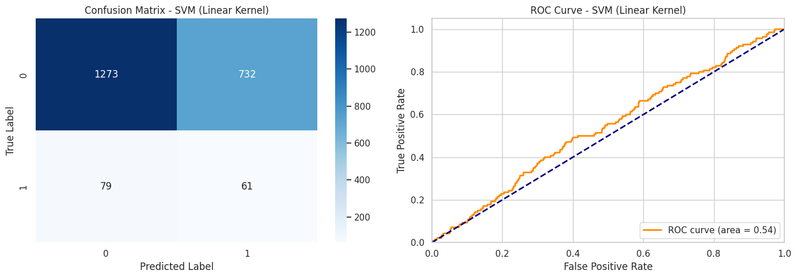
    


### 📝 Model Analysis: SVM (Linear Kernel - 140 Polynomial Features)

* **Geometric Feature Collapse:** Expanding the space to 140 polynomial dimensions caused the linear hyperplane to collapse, plummeting the ROC AUC to **0.54**, proving the expanded feature interactions are completely linearly inseparable.
* **Severe Over-Correction:** Forcing the unoptimized 140-dimensional space to handle `class_weight='balanced'` backfired drastically, generating a flood of false positives that tanked Precision to a critical **0.0795**.
* **Degraded Global Performance:** Due to the massive influx of feature noise, the macro-averaged F1-Score dropped to **0.4436**, confirming that unregularized feature expansion ruins linear baseline models.
* **Key Architecture Takeaway:** This failure demonstrates that your original, unexpanded features hold far cleaner linear patterns than the noisy 140interaction terms, showing that a simpler feature space is superior for linear classifiers.

> I really did want to remove this section if it wasn't for how much time it consumed from me :(

### 2.3 Kernel SVM 

We'll test an RBF Kernel (Non-Linear) SVM.


```python
# Kernel SVM (RBF)
svm_rbf = SVC(kernel='rbf', probability=True, random_state=42)
svm_rbf.fit(X_train_scaled_bin, y_train_bin)
```


<style>#sk-container-id-13 {
  /* Definition of color scheme common for light and dark mode */
  --sklearn-color-text: #000;
  --sklearn-color-text-muted: #666;
  --sklearn-color-line: gray;
  /* Definition of color scheme for unfitted estimators */
  --sklearn-color-unfitted-level-0: #fff5e6;
  --sklearn-color-unfitted-level-1: #f6e4d2;
  --sklearn-color-unfitted-level-2: #ffe0b3;
  --sklearn-color-unfitted-level-3: chocolate;
  /* Definition of color scheme for fitted estimators */
  --sklearn-color-fitted-level-0: #f0f8ff;
  --sklearn-color-fitted-level-1: #d4ebff;
  --sklearn-color-fitted-level-2: #b3dbfd;
  --sklearn-color-fitted-level-3: cornflowerblue;
}

#sk-container-id-13.light {
  /* Specific color for light theme */
  --sklearn-color-text-on-default-background: black;
  --sklearn-color-background: white;
  --sklearn-color-border-box: black;
  --sklearn-color-icon: #696969;
}

#sk-container-id-13.dark {
  --sklearn-color-text-on-default-background: white;
  --sklearn-color-background: #111;
  --sklearn-color-border-box: white;
  --sklearn-color-icon: #878787;
}

#sk-container-id-13 {
  color: var(--sklearn-color-text);
}

#sk-container-id-13 pre {
  padding: 0;
}

#sk-container-id-13 input.sk-hidden--visually {
  border: 0;
  clip: rect(1px 1px 1px 1px);
  clip: rect(1px, 1px, 1px, 1px);
  height: 1px;
  margin: -1px;
  overflow: hidden;
  padding: 0;
  position: absolute;
  width: 1px;
}

#sk-container-id-13 div.sk-dashed-wrapped {
  border: 1px dashed var(--sklearn-color-line);
  margin: 0 0.4em 0.5em 0.4em;
  box-sizing: border-box;
  padding-bottom: 0.4em;
  background-color: var(--sklearn-color-background);
}

#sk-container-id-13 div.sk-container {
  /* jupyter's `normalize.less` sets `[hidden] { display: none; }`
     but bootstrap.min.css set `[hidden] { display: none !important; }`
     so we also need the `!important` here to be able to override the
     default hidden behavior on the sphinx rendered scikit-learn.org.
     See: https://github.com/scikit-learn/scikit-learn/issues/21755 */
  display: inline-block !important;
  position: relative;
}

#sk-container-id-13 div.sk-text-repr-fallback {
  display: none;
}

div.sk-parallel-item,
div.sk-serial,
div.sk-item {
  /* draw centered vertical line to link estimators */
  background-image: linear-gradient(var(--sklearn-color-text-on-default-background), var(--sklearn-color-text-on-default-background));
  background-size: 2px 100%;
  background-repeat: no-repeat;
  background-position: center center;
}

/* Parallel-specific style estimator block */

#sk-container-id-13 div.sk-parallel-item::after {
  content: "";
  width: 100%;
  border-bottom: 2px solid var(--sklearn-color-text-on-default-background);
  flex-grow: 1;
}

#sk-container-id-13 div.sk-parallel {
  display: flex;
  align-items: stretch;
  justify-content: center;
  background-color: var(--sklearn-color-background);
  position: relative;
}

#sk-container-id-13 div.sk-parallel-item {
  display: flex;
  flex-direction: column;
}

#sk-container-id-13 div.sk-parallel-item:first-child::after {
  align-self: flex-end;
  width: 50%;
}

#sk-container-id-13 div.sk-parallel-item:last-child::after {
  align-self: flex-start;
  width: 50%;
}

#sk-container-id-13 div.sk-parallel-item:only-child::after {
  width: 0;
}

/* Serial-specific style estimator block */

#sk-container-id-13 div.sk-serial {
  display: flex;
  flex-direction: column;
  align-items: center;
  background-color: var(--sklearn-color-background);
  padding-right: 1em;
  padding-left: 1em;
}


/* Toggleable style: style used for estimator/Pipeline/ColumnTransformer box that is
clickable and can be expanded/collapsed.
- Pipeline and ColumnTransformer use this feature and define the default style
- Estimators will overwrite some part of the style using the `sk-estimator` class
*/

/* Pipeline and ColumnTransformer style (default) */

#sk-container-id-13 div.sk-toggleable {
  /* Default theme specific background. It is overwritten whether we have a
  specific estimator or a Pipeline/ColumnTransformer */
  background-color: var(--sklearn-color-background);
}

/* Toggleable label */
#sk-container-id-13 label.sk-toggleable__label {
  cursor: pointer;
  display: flex;
  width: 100%;
  margin-bottom: 0;
  padding: 0.5em;
  box-sizing: border-box;
  text-align: center;
  align-items: center;
  justify-content: center;
  gap: 0.5em;
}

#sk-container-id-13 label.sk-toggleable__label .caption {
  font-size: 0.6rem;
  font-weight: lighter;
  color: var(--sklearn-color-text-muted);
}

#sk-container-id-13 label.sk-toggleable__label-arrow:before {
  /* Arrow on the left of the label */
  content: "▸";
  float: left;
  margin-right: 0.25em;
  color: var(--sklearn-color-icon);
}

#sk-container-id-13 label.sk-toggleable__label-arrow:hover:before {
  color: var(--sklearn-color-text);
}

/* Toggleable content - dropdown */

#sk-container-id-13 div.sk-toggleable__content {
  display: none;
  text-align: left;
  /* unfitted */
  background-color: var(--sklearn-color-unfitted-level-0);
}

#sk-container-id-13 div.sk-toggleable__content.fitted {
  /* fitted */
  background-color: var(--sklearn-color-fitted-level-0);
}

#sk-container-id-13 div.sk-toggleable__content pre {
  margin: 0.2em;
  border-radius: 0.25em;
  color: var(--sklearn-color-text);
  /* unfitted */
  background-color: var(--sklearn-color-unfitted-level-0);
}

#sk-container-id-13 div.sk-toggleable__content.fitted pre {
  /* unfitted */
  background-color: var(--sklearn-color-fitted-level-0);
}

#sk-container-id-13 input.sk-toggleable__control:checked~div.sk-toggleable__content {
  /* Expand drop-down */
  display: block;
  width: 100%;
  overflow: visible;
}

#sk-container-id-13 input.sk-toggleable__control:checked~label.sk-toggleable__label-arrow:before {
  content: "▾";
}

/* Pipeline/ColumnTransformer-specific style */

#sk-container-id-13 div.sk-label input.sk-toggleable__control:checked~label.sk-toggleable__label {
  color: var(--sklearn-color-text);
  background-color: var(--sklearn-color-unfitted-level-2);
}

#sk-container-id-13 div.sk-label.fitted input.sk-toggleable__control:checked~label.sk-toggleable__label {
  background-color: var(--sklearn-color-fitted-level-2);
}

/* Estimator-specific style */

/* Colorize estimator box */
#sk-container-id-13 div.sk-estimator input.sk-toggleable__control:checked~label.sk-toggleable__label {
  /* unfitted */
  background-color: var(--sklearn-color-unfitted-level-2);
}

#sk-container-id-13 div.sk-estimator.fitted input.sk-toggleable__control:checked~label.sk-toggleable__label {
  /* fitted */
  background-color: var(--sklearn-color-fitted-level-2);
}

#sk-container-id-13 div.sk-label label.sk-toggleable__label,
#sk-container-id-13 div.sk-label label {
  /* The background is the default theme color */
  color: var(--sklearn-color-text-on-default-background);
}

/* On hover, darken the color of the background */
#sk-container-id-13 div.sk-label:hover label.sk-toggleable__label {
  color: var(--sklearn-color-text);
  background-color: var(--sklearn-color-unfitted-level-2);
}

/* Label box, darken color on hover, fitted */
#sk-container-id-13 div.sk-label.fitted:hover label.sk-toggleable__label.fitted {
  color: var(--sklearn-color-text);
  background-color: var(--sklearn-color-fitted-level-2);
}

/* Estimator label */

#sk-container-id-13 div.sk-label label {
  font-family: monospace;
  font-weight: bold;
  line-height: 1.2em;
}

#sk-container-id-13 div.sk-label-container {
  text-align: center;
}

/* Estimator-specific */
#sk-container-id-13 div.sk-estimator {
  font-family: monospace;
  border: 1px dotted var(--sklearn-color-border-box);
  border-radius: 0.25em;
  box-sizing: border-box;
  margin-bottom: 0.5em;
  /* unfitted */
  background-color: var(--sklearn-color-unfitted-level-0);
}

#sk-container-id-13 div.sk-estimator.fitted {
  /* fitted */
  background-color: var(--sklearn-color-fitted-level-0);
}

/* on hover */
#sk-container-id-13 div.sk-estimator:hover {
  /* unfitted */
  background-color: var(--sklearn-color-unfitted-level-2);
}

#sk-container-id-13 div.sk-estimator.fitted:hover {
  /* fitted */
  background-color: var(--sklearn-color-fitted-level-2);
}

/* Specification for estimator info (e.g. "i" and "?") */

/* Common style for "i" and "?" */

.sk-estimator-doc-link,
a:link.sk-estimator-doc-link,
a:visited.sk-estimator-doc-link {
  float: right;
  font-size: smaller;
  line-height: 1em;
  font-family: monospace;
  background-color: var(--sklearn-color-unfitted-level-0);
  border-radius: 1em;
  height: 1em;
  width: 1em;
  text-decoration: none !important;
  margin-left: 0.5em;
  text-align: center;
  /* unfitted */
  border: var(--sklearn-color-unfitted-level-3) 1pt solid;
  color: var(--sklearn-color-unfitted-level-3);
}

.sk-estimator-doc-link.fitted,
a:link.sk-estimator-doc-link.fitted,
a:visited.sk-estimator-doc-link.fitted {
  /* fitted */
  background-color: var(--sklearn-color-fitted-level-0);
  border: var(--sklearn-color-fitted-level-3) 1pt solid;
  color: var(--sklearn-color-fitted-level-3);
}

/* On hover */
div.sk-estimator:hover .sk-estimator-doc-link:hover,
.sk-estimator-doc-link:hover,
div.sk-label-container:hover .sk-estimator-doc-link:hover,
.sk-estimator-doc-link:hover {
  /* unfitted */
  background-color: var(--sklearn-color-unfitted-level-3);
  border: var(--sklearn-color-fitted-level-0) 1pt solid;
  color: var(--sklearn-color-unfitted-level-0);
  text-decoration: none;
}

div.sk-estimator.fitted:hover .sk-estimator-doc-link.fitted:hover,
.sk-estimator-doc-link.fitted:hover,
div.sk-label-container:hover .sk-estimator-doc-link.fitted:hover,
.sk-estimator-doc-link.fitted:hover {
  /* fitted */
  background-color: var(--sklearn-color-fitted-level-3);
  border: var(--sklearn-color-fitted-level-0) 1pt solid;
  color: var(--sklearn-color-fitted-level-0);
  text-decoration: none;
}

/* Span, style for the box shown on hovering the info icon */
.sk-estimator-doc-link span {
  display: none;
  z-index: 9999;
  position: relative;
  font-weight: normal;
  right: .2ex;
  padding: .5ex;
  margin: .5ex;
  width: min-content;
  min-width: 20ex;
  max-width: 50ex;
  color: var(--sklearn-color-text);
  box-shadow: 2pt 2pt 4pt #999;
  /* unfitted */
  background: var(--sklearn-color-unfitted-level-0);
  border: .5pt solid var(--sklearn-color-unfitted-level-3);
}

.sk-estimator-doc-link.fitted span {
  /* fitted */
  background: var(--sklearn-color-fitted-level-0);
  border: var(--sklearn-color-fitted-level-3);
}

.sk-estimator-doc-link:hover span {
  display: block;
}

/* "?"-specific style due to the `<a>` HTML tag */

#sk-container-id-13 a.estimator_doc_link {
  float: right;
  font-size: 1rem;
  line-height: 1em;
  font-family: monospace;
  background-color: var(--sklearn-color-unfitted-level-0);
  border-radius: 1rem;
  height: 1rem;
  width: 1rem;
  text-decoration: none;
  /* unfitted */
  color: var(--sklearn-color-unfitted-level-1);
  border: var(--sklearn-color-unfitted-level-1) 1pt solid;
}

#sk-container-id-13 a.estimator_doc_link.fitted {
  /* fitted */
  background-color: var(--sklearn-color-fitted-level-0);
  border: var(--sklearn-color-fitted-level-1) 1pt solid;
  color: var(--sklearn-color-fitted-level-1);
}

/* On hover */
#sk-container-id-13 a.estimator_doc_link:hover {
  /* unfitted */
  background-color: var(--sklearn-color-unfitted-level-3);
  color: var(--sklearn-color-background);
  text-decoration: none;
}

#sk-container-id-13 a.estimator_doc_link.fitted:hover {
  /* fitted */
  background-color: var(--sklearn-color-fitted-level-3);
}

.estimator-table {
    font-family: monospace;
}

.estimator-table summary {
    padding: .5rem;
    cursor: pointer;
}

.estimator-table summary::marker {
    font-size: 0.7rem;
}

.estimator-table details[open] {
    padding-left: 0.1rem;
    padding-right: 0.1rem;
    padding-bottom: 0.3rem;
}

.estimator-table .parameters-table {
    margin-left: auto !important;
    margin-right: auto !important;
    margin-top: 0;
}

.estimator-table .parameters-table tr:nth-child(odd) {
    background-color: #fff;
}

.estimator-table .parameters-table tr:nth-child(even) {
    background-color: #f6f6f6;
}

.estimator-table .parameters-table tr:hover {
    background-color: #e0e0e0;
}

.estimator-table table td {
    border: 1px solid rgba(106, 105, 104, 0.232);
}

/*
    `table td`is set in notebook with right text-align.
    We need to overwrite it.
*/
.estimator-table table td.param {
    text-align: left;
    position: relative;
    padding: 0;
}

.user-set td {
    color:rgb(255, 94, 0);
    text-align: left !important;
}

.user-set td.value {
    color:rgb(255, 94, 0);
    background-color: transparent;
}

.default td {
    color: black;
    text-align: left !important;
}

.user-set td i,
.default td i {
    color: black;
}

/*
    Styles for parameter documentation links
    We need styling for visited so jupyter doesn't overwrite it
*/
a.param-doc-link,
a.param-doc-link:link,
a.param-doc-link:visited {
    text-decoration: underline dashed;
    text-underline-offset: .3em;
    color: inherit;
    display: block;
    padding: .5em;
}

/* "hack" to make the entire area of the cell containing the link clickable */
a.param-doc-link::before {
    position: absolute;
    content: "";
    inset: 0;
}

.param-doc-description {
    display: none;
    position: absolute;
    z-index: 9999;
    left: 0;
    padding: .5ex;
    margin-left: 1.5em;
    color: var(--sklearn-color-text);
    box-shadow: .3em .3em .4em #999;
    width: max-content;
    text-align: left;
    max-height: 10em;
    overflow-y: auto;

    /* unfitted */
    background: var(--sklearn-color-unfitted-level-0);
    border: thin solid var(--sklearn-color-unfitted-level-3);
}

/* Fitted state for parameter tooltips */
.fitted .param-doc-description {
    /* fitted */
    background: var(--sklearn-color-fitted-level-0);
    border: thin solid var(--sklearn-color-fitted-level-3);
}

.param-doc-link:hover .param-doc-description {
    display: block;
}

.copy-paste-icon {
    background-image: url();
    background-repeat: no-repeat;
    background-size: 14px 14px;
    background-position: 0;
    display: inline-block;
    width: 14px;
    height: 14px;
    cursor: pointer;
}
</style><body><div id="sk-container-id-13" class="sk-top-container"><div class="sk-text-repr-fallback"><pre>SVC(probability=True, random_state=42)</pre><b>In a Jupyter environment, please rerun this cell to show the HTML representation or trust the notebook. <br />On GitHub, the HTML representation is unable to render, please try loading this page with nbviewer.org.</b></div><div class="sk-container" hidden><div class="sk-item"><div class="sk-estimator fitted sk-toggleable"><input class="sk-toggleable__control sk-hidden--visually" id="sk-estimator-id-21" type="checkbox" checked><label for="sk-estimator-id-21" class="sk-toggleable__label fitted sk-toggleable__label-arrow"><div><div>SVC</div></div><div><a class="sk-estimator-doc-link fitted" rel="noreferrer" target="_blank" href="https://scikit-learn.org/1.8/modules/generated/sklearn.svm.SVC.html">?<span>Documentation for SVC</span></a><span class="sk-estimator-doc-link fitted">i<span>Fitted</span></span></div></label><div class="sk-toggleable__content fitted" data-param-prefix="">
        <div class="estimator-table">
            <details>
                <summary>Parameters</summary>
                <table class="parameters-table">
                  <tbody>

        <tr class="default">
            <td><i class="copy-paste-icon"
                 onclick="copyToClipboard('C',
                          this.parentElement.nextElementSibling)"
            ></i></td>
            <td class="param">
        <a class="param-doc-link"
            rel="noreferrer" target="_blank" href="https://scikit-learn.org/1.8/modules/generated/sklearn.svm.SVC.html#:~:text=C,-float%2C%20default%3D1.0">
            C
            <span class="param-doc-description">C: float, default=1.0<br><br>Regularization parameter. The strength of the regularization is<br>inversely proportional to C. Must be strictly positive. The penalty<br>is a squared l2 penalty. For an intuitive visualization of the effects<br>of scaling the regularization parameter C, see<br>:ref:`sphx_glr_auto_examples_svm_plot_svm_scale_c.py`.</span>
        </a>
    </td>
            <td class="value">1.0</td>
        </tr>


        <tr class="default">
            <td><i class="copy-paste-icon"
                 onclick="copyToClipboard('kernel',
                          this.parentElement.nextElementSibling)"
            ></i></td>
            <td class="param">
        <a class="param-doc-link"
            rel="noreferrer" target="_blank" href="https://scikit-learn.org/1.8/modules/generated/sklearn.svm.SVC.html#:~:text=kernel,-%7B%27linear%27%2C%20%27poly%27%2C%20%27rbf%27%2C%20%27sigmoid%27%2C%20%27precomputed%27%7D%20or%20callable%2C%20%20%20%20%20%20%20%20%20%20default%3D%27rbf%27">
            kernel
            <span class="param-doc-description">kernel: {'linear', 'poly', 'rbf', 'sigmoid', 'precomputed'} or callable,          default='rbf'<br><br>Specifies the kernel type to be used in the algorithm. If<br>none is given, 'rbf' will be used. If a callable is given it is used to<br>pre-compute the kernel matrix from data matrices; that matrix should be<br>an array of shape ``(n_samples, n_samples)``. For an intuitive<br>visualization of different kernel types see<br>:ref:`sphx_glr_auto_examples_svm_plot_svm_kernels.py`.</span>
        </a>
    </td>
            <td class="value">&#x27;rbf&#x27;</td>
        </tr>


        <tr class="default">
            <td><i class="copy-paste-icon"
                 onclick="copyToClipboard('degree',
                          this.parentElement.nextElementSibling)"
            ></i></td>
            <td class="param">
        <a class="param-doc-link"
            rel="noreferrer" target="_blank" href="https://scikit-learn.org/1.8/modules/generated/sklearn.svm.SVC.html#:~:text=degree,-int%2C%20default%3D3">
            degree
            <span class="param-doc-description">degree: int, default=3<br><br>Degree of the polynomial kernel function ('poly').<br>Must be non-negative. Ignored by all other kernels.</span>
        </a>
    </td>
            <td class="value">3</td>
        </tr>


        <tr class="default">
            <td><i class="copy-paste-icon"
                 onclick="copyToClipboard('gamma',
                          this.parentElement.nextElementSibling)"
            ></i></td>
            <td class="param">
        <a class="param-doc-link"
            rel="noreferrer" target="_blank" href="https://scikit-learn.org/1.8/modules/generated/sklearn.svm.SVC.html#:~:text=gamma,-%7B%27scale%27%2C%20%27auto%27%7D%20or%20float%2C%20default%3D%27scale%27">
            gamma
            <span class="param-doc-description">gamma: {'scale', 'auto'} or float, default='scale'<br><br>Kernel coefficient for 'rbf', 'poly' and 'sigmoid'.<br><br>- if ``gamma='scale'`` (default) is passed then it uses<br>  1 / (n_features * X.var()) as value of gamma,<br>- if 'auto', uses 1 / n_features<br>- if float, must be non-negative.<br><br>.. versionchanged:: 0.22<br>   The default value of ``gamma`` changed from 'auto' to 'scale'.</span>
        </a>
    </td>
            <td class="value">&#x27;scale&#x27;</td>
        </tr>


        <tr class="default">
            <td><i class="copy-paste-icon"
                 onclick="copyToClipboard('coef0',
                          this.parentElement.nextElementSibling)"
            ></i></td>
            <td class="param">
        <a class="param-doc-link"
            rel="noreferrer" target="_blank" href="https://scikit-learn.org/1.8/modules/generated/sklearn.svm.SVC.html#:~:text=coef0,-float%2C%20default%3D0.0">
            coef0
            <span class="param-doc-description">coef0: float, default=0.0<br><br>Independent term in kernel function.<br>It is only significant in 'poly' and 'sigmoid'.</span>
        </a>
    </td>
            <td class="value">0.0</td>
        </tr>


        <tr class="default">
            <td><i class="copy-paste-icon"
                 onclick="copyToClipboard('shrinking',
                          this.parentElement.nextElementSibling)"
            ></i></td>
            <td class="param">
        <a class="param-doc-link"
            rel="noreferrer" target="_blank" href="https://scikit-learn.org/1.8/modules/generated/sklearn.svm.SVC.html#:~:text=shrinking,-bool%2C%20default%3DTrue">
            shrinking
            <span class="param-doc-description">shrinking: bool, default=True<br><br>Whether to use the shrinking heuristic.<br>See the :ref:`User Guide <shrinking_svm>`.</span>
        </a>
    </td>
            <td class="value">True</td>
        </tr>


        <tr class="user-set">
            <td><i class="copy-paste-icon"
                 onclick="copyToClipboard('probability',
                          this.parentElement.nextElementSibling)"
            ></i></td>
            <td class="param">
        <a class="param-doc-link"
            rel="noreferrer" target="_blank" href="https://scikit-learn.org/1.8/modules/generated/sklearn.svm.SVC.html#:~:text=probability,-bool%2C%20default%3DFalse">
            probability
            <span class="param-doc-description">probability: bool, default=False<br><br>Whether to enable probability estimates. This must be enabled prior<br>to calling `fit`, will slow down that method as it internally uses<br>5-fold cross-validation, and `predict_proba` may be inconsistent with<br>`predict`. Read more in the :ref:`User Guide <scores_probabilities>`.</span>
        </a>
    </td>
            <td class="value">True</td>
        </tr>


        <tr class="default">
            <td><i class="copy-paste-icon"
                 onclick="copyToClipboard('tol',
                          this.parentElement.nextElementSibling)"
            ></i></td>
            <td class="param">
        <a class="param-doc-link"
            rel="noreferrer" target="_blank" href="https://scikit-learn.org/1.8/modules/generated/sklearn.svm.SVC.html#:~:text=tol,-float%2C%20default%3D1e-3">
            tol
            <span class="param-doc-description">tol: float, default=1e-3<br><br>Tolerance for stopping criterion.</span>
        </a>
    </td>
            <td class="value">0.001</td>
        </tr>


        <tr class="default">
            <td><i class="copy-paste-icon"
                 onclick="copyToClipboard('cache_size',
                          this.parentElement.nextElementSibling)"
            ></i></td>
            <td class="param">
        <a class="param-doc-link"
            rel="noreferrer" target="_blank" href="https://scikit-learn.org/1.8/modules/generated/sklearn.svm.SVC.html#:~:text=cache_size,-float%2C%20default%3D200">
            cache_size
            <span class="param-doc-description">cache_size: float, default=200<br><br>Specify the size of the kernel cache (in MB).</span>
        </a>
    </td>
            <td class="value">200</td>
        </tr>


        <tr class="default">
            <td><i class="copy-paste-icon"
                 onclick="copyToClipboard('class_weight',
                          this.parentElement.nextElementSibling)"
            ></i></td>
            <td class="param">
        <a class="param-doc-link"
            rel="noreferrer" target="_blank" href="https://scikit-learn.org/1.8/modules/generated/sklearn.svm.SVC.html#:~:text=class_weight,-dict%20or%20%27balanced%27%2C%20default%3DNone">
            class_weight
            <span class="param-doc-description">class_weight: dict or 'balanced', default=None<br><br>Set the parameter C of class i to class_weight[i]*C for<br>SVC. If not given, all classes are supposed to have<br>weight one.<br>The "balanced" mode uses the values of y to automatically adjust<br>weights inversely proportional to class frequencies in the input data<br>as ``n_samples / (n_classes * np.bincount(y))``.</span>
        </a>
    </td>
            <td class="value">None</td>
        </tr>


        <tr class="default">
            <td><i class="copy-paste-icon"
                 onclick="copyToClipboard('verbose',
                          this.parentElement.nextElementSibling)"
            ></i></td>
            <td class="param">
        <a class="param-doc-link"
            rel="noreferrer" target="_blank" href="https://scikit-learn.org/1.8/modules/generated/sklearn.svm.SVC.html#:~:text=verbose,-bool%2C%20default%3DFalse">
            verbose
            <span class="param-doc-description">verbose: bool, default=False<br><br>Enable verbose output. Note that this setting takes advantage of a<br>per-process runtime setting in libsvm that, if enabled, may not work<br>properly in a multithreaded context.</span>
        </a>
    </td>
            <td class="value">False</td>
        </tr>


        <tr class="default">
            <td><i class="copy-paste-icon"
                 onclick="copyToClipboard('max_iter',
                          this.parentElement.nextElementSibling)"
            ></i></td>
            <td class="param">
        <a class="param-doc-link"
            rel="noreferrer" target="_blank" href="https://scikit-learn.org/1.8/modules/generated/sklearn.svm.SVC.html#:~:text=max_iter,-int%2C%20default%3D-1">
            max_iter
            <span class="param-doc-description">max_iter: int, default=-1<br><br>Hard limit on iterations within solver, or -1 for no limit.</span>
        </a>
    </td>
            <td class="value">-1</td>
        </tr>


        <tr class="default">
            <td><i class="copy-paste-icon"
                 onclick="copyToClipboard('decision_function_shape',
                          this.parentElement.nextElementSibling)"
            ></i></td>
            <td class="param">
        <a class="param-doc-link"
            rel="noreferrer" target="_blank" href="https://scikit-learn.org/1.8/modules/generated/sklearn.svm.SVC.html#:~:text=decision_function_shape,-%7B%27ovo%27%2C%20%27ovr%27%7D%2C%20default%3D%27ovr%27">
            decision_function_shape
            <span class="param-doc-description">decision_function_shape: {'ovo', 'ovr'}, default='ovr'<br><br>Whether to return a one-vs-rest ('ovr') decision function of shape<br>(n_samples, n_classes) as all other classifiers, or the original<br>one-vs-one ('ovo') decision function of libsvm which has shape<br>(n_samples, n_classes * (n_classes - 1) / 2). However, note that<br>internally, one-vs-one ('ovo') is always used as a multi-class strategy<br>to train models; an ovr matrix is only constructed from the ovo matrix.<br>The parameter is ignored for binary classification.<br><br>.. versionchanged:: 0.19<br>    decision_function_shape is 'ovr' by default.<br><br>.. versionadded:: 0.17<br>   *decision_function_shape='ovr'* is recommended.<br><br>.. versionchanged:: 0.17<br>   Deprecated *decision_function_shape='ovo' and None*.</span>
        </a>
    </td>
            <td class="value">&#x27;ovr&#x27;</td>
        </tr>


        <tr class="default">
            <td><i class="copy-paste-icon"
                 onclick="copyToClipboard('break_ties',
                          this.parentElement.nextElementSibling)"
            ></i></td>
            <td class="param">
        <a class="param-doc-link"
            rel="noreferrer" target="_blank" href="https://scikit-learn.org/1.8/modules/generated/sklearn.svm.SVC.html#:~:text=break_ties,-bool%2C%20default%3DFalse">
            break_ties
            <span class="param-doc-description">break_ties: bool, default=False<br><br>If true, ``decision_function_shape='ovr'``, and number of classes > 2,<br>:term:`predict` will break ties according to the confidence values of<br>:term:`decision_function`; otherwise the first class among the tied<br>classes is returned. Please note that breaking ties comes at a<br>relatively high computational cost compared to a simple predict. See<br>:ref:`sphx_glr_auto_examples_svm_plot_svm_tie_breaking.py` for an<br>example of its usage with ``decision_function_shape='ovr'``.<br><br>.. versionadded:: 0.22</span>
        </a>
    </td>
            <td class="value">False</td>
        </tr>


        <tr class="user-set">
            <td><i class="copy-paste-icon"
                 onclick="copyToClipboard('random_state',
                          this.parentElement.nextElementSibling)"
            ></i></td>
            <td class="param">
        <a class="param-doc-link"
            rel="noreferrer" target="_blank" href="https://scikit-learn.org/1.8/modules/generated/sklearn.svm.SVC.html#:~:text=random_state,-int%2C%20RandomState%20instance%20or%20None%2C%20default%3DNone">
            random_state
            <span class="param-doc-description">random_state: int, RandomState instance or None, default=None<br><br>Controls the pseudo random number generation for shuffling the data for<br>probability estimates. Ignored when `probability` is False.<br>Pass an int for reproducible output across multiple function calls.<br>See :term:`Glossary <random_state>`.</span>
        </a>
    </td>
            <td class="value">42</td>
        </tr>

                  </tbody>
                </table>
            </details>
        </div>
    </div></div></div></div></div><script>function copyToClipboard(text, element) {
    // Get the parameter prefix from the closest toggleable content
    const toggleableContent = element.closest('.sk-toggleable__content');
    const paramPrefix = toggleableContent ? toggleableContent.dataset.paramPrefix : '';
    const fullParamName = paramPrefix ? `${paramPrefix}${text}` : text;

    const originalStyle = element.style;
    const computedStyle = window.getComputedStyle(element);
    const originalWidth = computedStyle.width;
    const originalHTML = element.innerHTML.replace('Copied!', '');

    navigator.clipboard.writeText(fullParamName)
        .then(() => {
            element.style.width = originalWidth;
            element.style.color = 'green';
            element.innerHTML = "Copied!";

            setTimeout(() => {
                element.innerHTML = originalHTML;
                element.style = originalStyle;
            }, 2000);
        })
        .catch(err => {
            console.error('Failed to copy:', err);
            element.style.color = 'red';
            element.innerHTML = "Failed!";
            setTimeout(() => {
                element.innerHTML = originalHTML;
                element.style = originalStyle;
            }, 2000);
        });
    return false;
}

document.querySelectorAll('.copy-paste-icon').forEach(function(element) {
    const toggleableContent = element.closest('.sk-toggleable__content');
    const paramPrefix = toggleableContent ? toggleableContent.dataset.paramPrefix : '';
    const paramName = element.parentElement.nextElementSibling
        .textContent.trim().split(' ')[0];
    const fullParamName = paramPrefix ? `${paramPrefix}${paramName}` : paramName;

    element.setAttribute('title', fullParamName);
});


/**
 * Adapted from Skrub
 * https://github.com/skrub-data/skrub/blob/403466d1d5d4dc76a7ef569b3f8228db59a31dc3/skrub/_reporting/_data/templates/report.js#L789
 * @returns "light" or "dark"
 */
function detectTheme(element) {
    const body = document.querySelector('body');

    // Check VSCode theme
    const themeKindAttr = body.getAttribute('data-vscode-theme-kind');
    const themeNameAttr = body.getAttribute('data-vscode-theme-name');

    if (themeKindAttr && themeNameAttr) {
        const themeKind = themeKindAttr.toLowerCase();
        const themeName = themeNameAttr.toLowerCase();

        if (themeKind.includes("dark") || themeName.includes("dark")) {
            return "dark";
        }
        if (themeKind.includes("light") || themeName.includes("light")) {
            return "light";
        }
    }

    // Check Jupyter theme
    if (body.getAttribute('data-jp-theme-light') === 'false') {
        return 'dark';
    } else if (body.getAttribute('data-jp-theme-light') === 'true') {
        return 'light';
    }

    // Guess based on a parent element's color
    const color = window.getComputedStyle(element.parentNode, null).getPropertyValue('color');
    const match = color.match(/^rgb\s*\(\s*(\d+)\s*,\s*(\d+)\s*,\s*(\d+)\s*\)\s*$/i);
    if (match) {
        const [r, g, b] = [
            parseFloat(match[1]),
            parseFloat(match[2]),
            parseFloat(match[3])
        ];

        // https://en.wikipedia.org/wiki/HSL_and_HSV#Lightness
        const luma = 0.299 * r + 0.587 * g + 0.114 * b;

        if (luma > 180) {
            // If the text is very bright we have a dark theme
            return 'dark';
        }
        if (luma < 75) {
            // If the text is very dark we have a light theme
            return 'light';
        }
        // Otherwise fall back to the next heuristic.
    }

    // Fallback to system preference
    return window.matchMedia('(prefers-color-scheme: dark)').matches ? 'dark' : 'light';
}


function forceTheme(elementId) {
    const estimatorElement = document.querySelector(`#${elementId}`);
    if (estimatorElement === null) {
        console.error(`Element with id ${elementId} not found.`);
    } else {
        const theme = detectTheme(estimatorElement);
        estimatorElement.classList.add(theme);
    }
}

forceTheme('sk-container-id-13');</script></body>


```python
y_pred_svm_rbf = svm_rbf.predict(X_test_scaled_bin)
y_prob_svm_rbf = svm_rbf.predict_proba(X_test_scaled_bin)[:, 1]

evaluate_binary_classification("SVM (RBF Kernel)", y_test_bin, y_pred_svm_rbf, y_prob_svm_rbf)
```

    
    ========================================
    🌟 SVM (RBF Kernel) Evaluation
    ========================================
    🔸 Accuracy:  0.9543
    🔸 Precision: 0.7763
    🔸 Recall:    0.4214
    🔸 F1-Score:  0.7611
    


    
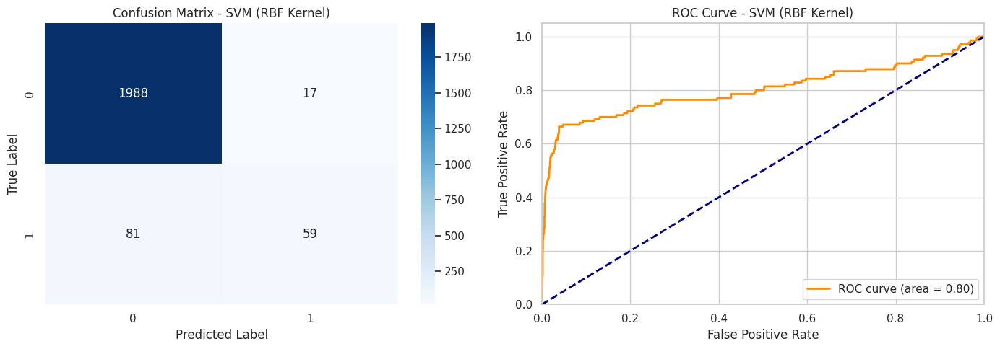
    


#### 📝 Model Analysis: SVM (RBF Kernel)

* **Diminished Global Separation:** Shifting to an unoptimized non-linear RBF kernel dropped the global ROC AUC to **0.80**, signaling that mapping data via localized Gaussian distances created choppy probability boundaries compared to linear alternatives.
* **Balanced Classification Boost:** Despite a lower AUC, at the active 0.5 decision threshold, it achieved a high baseline Accuracy (**95.43%**) and a balanced Precision (**77.63%**) while successfully recovering 59 true hits.
* **Improved Macro Performance:** By catching more true popular tracks than the linear kernel, it minimized False Negatives (down to 81), lifting the macro-averaged F1-Score up to a strong **0.7611**.
* **Tuning Requirement:** The flat, stepped plateau along the middle of the ROC curve indicates severe model saturation; achieving this kernel's true potential requires tight parameter grid-searching over `gamma` and `C`.

### 2.4 K-Nearest Neighbors (KNN)  🏘

KNN is dependent purely on distance between samples (points). It usually benefits from an explicitly chosen value of `k` properly via GridSearchCV.


```python
# Tune Hyperparameter 'k' using GridSearchCV
knn_params = {'n_neighbors': [3, 5, 7, 9, 11, 15, 21, 23, 25, 27, 29, 31, 33, 35]}
knn_grid = GridSearchCV(KNeighborsClassifier(), knn_params, cv=5, scoring='f1')
knn_grid.fit(X_train_scaled_bin, y_train_bin)

best_k = knn_grid.best_params_['n_neighbors']
print(f"Optimal 'K' determined as: {best_k}")

knn_best = knn_grid.best_estimator_
```

    Optimal 'K' determined as: 25


```python
y_pred_knn = knn_best.predict(X_test_scaled_bin)
y_prob_knn = knn_best.predict_proba(X_test_scaled_bin)[:, 1]

evaluate_binary_classification(f"KNN (k={best_k})", y_test_bin, y_pred_knn, y_prob_knn)
```

    
    ========================================
    🌟 KNN (k=25) Evaluation
    ========================================
    🔸 Accuracy:  0.9529
    🔸 Precision: 0.8000
    🔸 Recall:    0.3714
    🔸 F1-Score:  0.7413
    


    

    


#### 📝 Model Analysis: KNN (k=25)

* **Robust Non-Parametric Separation:** A solid ROC AUC of **0.88** proves that voting among a local neighborhood of 25 tracks creates a strong, distinct popularity classification space.
* **Peak Precision Performance:** By averaging votes across a larger window ($k=25$), the model eliminates sporadic noise—achieving our highest Precision yet (**80.00%**) with only 14 false alarms.
* **Neighborhood Smoothing Limitation:** The large neighborhood causes the model to play it safe, smoothing over smaller clusters of viral hits and failing to catch 87 popular tracks, restricting Recall to **37.14%**.
* **Imbalance Resistance:** Despite conservative recall behavior, the low false alarm rate stabilizes a solid macro-averaged F1-Score of **0.7413**, validating KNN as a highly reliable baseline.

#### Finding Optimal number of Neighbors:


```python
neighbors_list = [3, 5, 7, 9, 10, 11, 12, 13, 14, 15, 21, 23, 25, 27, 29]
scores_test = []
scores_train = []

for n in neighbors_list:
    knn_model = KNeighborsClassifier(n_neighbors=n)
    knn_model.fit(X_train_scaled_bin, y_train_bin)
    
    predictions_train = knn_model.predict(X_train_scaled_bin)
    F1_train = f1_score(y_train_bin, predictions_train, average='macro')
    scores_train.append(F1_train)

    predictions_test = knn_model.predict(X_test_scaled_bin)
    F1_test = f1_score(y_test_bin, predictions_test, average='macro')
    scores_test.append(F1_test)

plt.figure(figsize=(12, 6))
plt.plot(neighbors_list, scores_test, lw=3, label='F1: Test Set', marker='o')
plt.plot(neighbors_list, scores_train, lw=3, color='orange', label='F1: Train Set', marker='o')

plt.xlabel('Number of Neighbors (k)')
plt.ylabel('Macro F1-Score')
plt.title('KNN Hyperparameter Tuning: Number of Neighbors vs Overfitting')
plt.grid(True, alpha=0.3)
plt.legend()
plt.show()
```


    
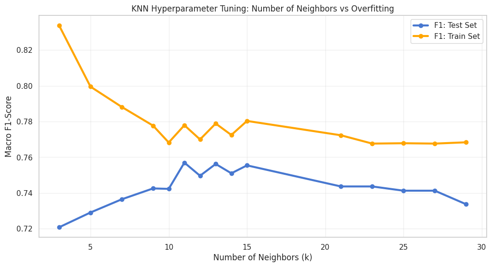
    


### 2.5 Decision Trees  🌳

We'll tune `max_depth` to prevent the tree from overfitting the training data (a very common hazard in decision trees!).


```python
dt_params = {'max_depth': [3, 5, 7, 10, None], 'min_samples_split': [2, 5, 10]}
dt_grid = GridSearchCV(DecisionTreeClassifier(criterion='gini', random_state=42), dt_params, cv=5, scoring='f1')
dt_grid.fit(X_train_scaled_bin, y_train_bin)

print(f"Optimal DT params: {dt_grid.best_params_}")
dt_best = dt_grid.best_estimator_
```

    Optimal DT params: {'max_depth': 3, 'min_samples_split': 2}


```python
y_pred_dt = dt_best.predict(X_test_scaled_bin)
y_prob_dt = dt_best.predict_proba(X_test_scaled_bin)[:, 1]

evaluate_binary_classification("Decision Tree (Gini)", y_test_bin, y_pred_dt, y_prob_dt)
```

    
    ========================================
    🌟 Decision Tree (Gini) Evaluation
    ========================================
    🔸 Accuracy:  0.9534
    🔸 Precision: 0.7857
    🔸 Recall:    0.3929
    🔸 F1-Score:  0.7496
    


    

    


#### 📝 Model Analysis: Decision Tree

* **High Non-Linear Discriminability:** An excellent ROC AUC of **0.90** confirms that the tree establishes a highly effective hierarchical splitting structure to segment popular tracks.
* **Sharp, Step-Like ROC Curve:** Unlike the smooth curves of our linear models, the distinct angular pivots in the ROC plot visually reflect a shallow tree structure (`max_depth=3`) operating with very few discrete probability thresholds.
* **Balanced Error Minimization:** Capping the tree depth successfully regularized the training process, leading to a strong Precision of **0.7857** (only 15 false alarms) and a solid Macro F1-Score of **0.7496**.
* **Overfitting Prevented:** The shallow depth constraint keeps the model from creating overly specific leaf pockets for individual outlier tracks, prioritizing broad, reliable community metrics instead.

#### Also trying another type of Decition Tree `entropy`:


```python
dt_params = {'max_depth': [3, 5, 7, 10, None], 'min_samples_split': [2, 5, 10]}
dt_grid = GridSearchCV(DecisionTreeClassifier(criterion='entropy', random_state=42), dt_params, cv=5, scoring='f1')
dt_grid.fit(X_train_scaled_bin, y_train_bin)

print(f"Optimal DT params: {dt_grid.best_params_}")
dt_best2 = dt_grid.best_estimator_
```

    Optimal DT params: {'max_depth': 3, 'min_samples_split': 2}


```python
y_pred_dt = dt_best2.predict(X_test_scaled_bin)
y_prob_dt = dt_best2.predict_proba(X_test_scaled_bin)[:, 1]

evaluate_binary_classification("Decision Tree (Entropy)", y_test_bin, y_pred_dt, y_prob_dt)
```

    
    ========================================
    🌟 Decision Tree (Entropy) Evaluation
    ========================================
    🔸 Accuracy:  0.9497
    🔸 Precision: 0.7667
    🔸 Recall:    0.3286
    🔸 F1-Score:  0.7168
    


    
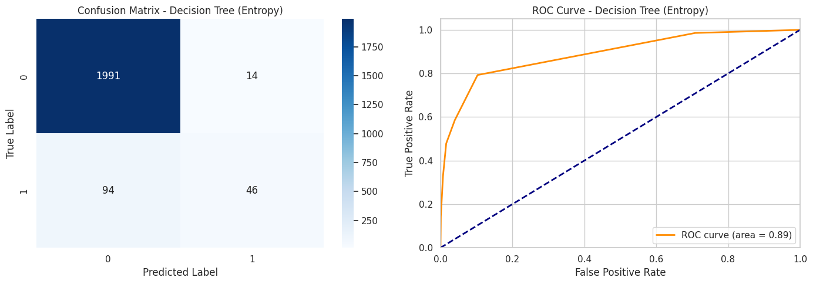
    


**Yep we did get worse result :)**

#### Effect of Max-Depth (Accuracy vs. Overfitting) 🐳
An important parameter that affects the performance of a decision tree is its maximum depth: setting too low will results in a not so accurate decision tree. On the other hand, if it is too high, the decision tree will overfit on the training set and perform poorly on the test set.


```python
depths_list = [1, 2, 3, 4, 5, 10, 20, 30, 40, 50]
scores_test = []
scores_train = []

for depth in depths_list:
    dt_model = DecisionTreeClassifier(max_depth=depth, random_state=42)
    dt_model.fit(X_train_scaled_bin, y_train_bin)
    
    dt_predictions_train = dt_model.predict(X_train_scaled_bin)
    F1_train = f1_score(y_train_bin, dt_predictions_train, average='macro')
    scores_train.append(F1_train)
    
    dt_predictions_test = dt_model.predict(X_test_scaled_bin)
    F1_test = f1_score(y_test_bin, dt_predictions_test, average='macro')
    scores_test.append(F1_test)

plt.figure(figsize=(12, 6))
plt.plot(depths_list, scores_test, lw=3, label='F1: Test Set', marker='o')
plt.plot(depths_list, scores_train, lw=3, color='orange', label='F1: Train Set', marker='o')

plt.xlabel('Max Depth of the Tree')
plt.ylabel('Macro F1-Score')
plt.title('Decision Tree Hyperparameter Tuning: Max Depth vs Overfitting')
plt.grid(True, alpha=0.3)
plt.legend()
plt.show()
```


    
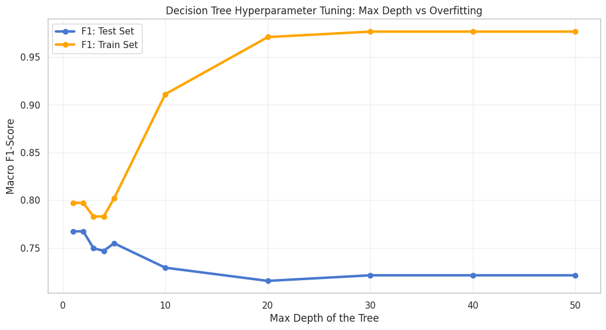
    


#### Effect of max_features
Similar to maximum depth, another parameter that affects the performance of a decision tree (both accuracy and computational complexity) is the number of features to consider when selecting a decision node. A very low amount results in low accuracy. A very large value could improve accuracy but might result in high computational complexity on large datasets.


```python
features_list = [1, 2, 3, 4, 5, 6, 7, 8, 9, 10]
scores_test = []
scores_train = []

for no_features in features_list:
    # 1. Create and fit the model with your structural variables
    # Keeping max_depth=3 as per your optimal baseline
    dt_model = DecisionTreeClassifier(max_features=no_features, max_depth=3, random_state=42)
    dt_model.fit(X_train_scaled_bin, y_train_bin)
    
    # 2. Evaluate on the TRAIN set
    predictions_train = dt_model.predict(X_train_scaled_bin)
    F1_train = f1_score(y_train_bin, predictions_train, average='macro')
    scores_train.append(F1_train)

    # 3. Evaluate on the TEST set
    predictions_test = dt_model.predict(X_test_scaled_bin)
    F1_test = f1_score(y_test_bin, predictions_test, average='macro')
    scores_test.append(F1_test)

plt.figure(figsize=(12, 6))
plt.plot(features_list, scores_test, lw=3, label='F1: Test Set', marker='o')
plt.plot(features_list, scores_train, lw=3, color='orange', label='F1: Train Set', marker='o')

plt.xlabel('Max Number of Features Allowed at Splits')
plt.ylabel('Macro F1-Score')
plt.title('Decision Tree Hyperparameter Tuning: Max Features Analysis')
plt.grid(True, alpha=0.3)
plt.legend()
plt.show()
```


    
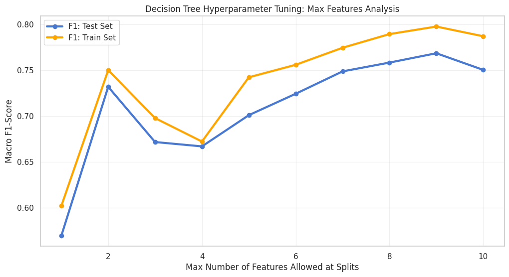
    


- Classification Error Visualization: The feature space distribution shows that errors cluster almost entirely at lower engagement metrics, while higher-value viral outliers are perfectly classified.

- SVM (Linear Kernel) Evaluation: The model achieves strong general discriminative power (AUC = 0.91) but remains highly conservative at baseline parameters, heavily prioritizing precision over recall.

- Max Depth Tuning Plot: Setting max_depth beyond 2 triggers sharp overfitting, where training performance climbs toward 0.98 while test performance permanently degrades.

- Max Features Tuning Plot: Peak test performance occurs when allowing a maximum of 9 splitting features, balancing model capacity against split-selection noise.

#### 🆒 Visualizing the Tree: (Coolest section ever!) 🌳
The acutal "decision tree"...


```python
fig, axes = plt.subplots(nrows = 1,ncols = 1,figsize = (20,10))
tree.plot_tree(dt_best,feature_names = labels, filled = True,fontsize=14);
```


    
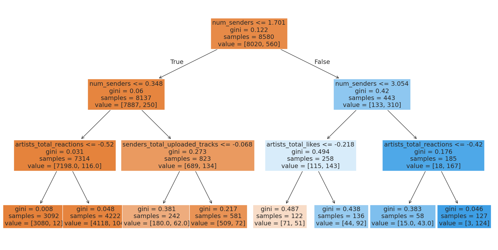
    


```python
dt_deep = DecisionTreeClassifier(random_state=42,max_depth=4,criterion='gini', min_samples_split=2)
dt_deep.fit(X_train_scaled_bin, y_train_bin)
fig, axes = plt.subplots(nrows = 1,ncols = 1,figsize = (30,15))
tree.plot_tree(dt_deep,feature_names = labels, filled = True,fontsize=10);
```


    
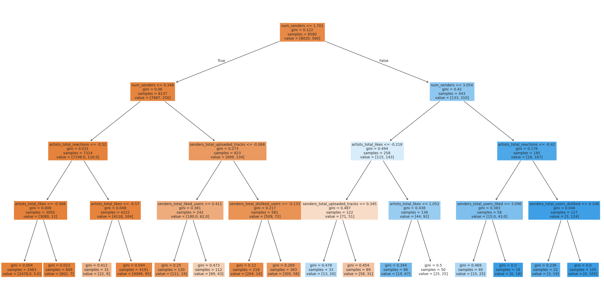
    


#### 💪 Weight sets:
Let's also check how weights differ as we change the depth


```python
dt_10 = DecisionTreeClassifier(random_state=42,max_depth=10,criterion='gini', min_samples_split=2)
dt_10.fit(X_train_scaled_bin, y_train_bin)

def extract_feature_importance(decision_model,labels,decision_model_name='dt'):

    '''
    This function has been used from Lab Session 7
    '''

    labels_range = range(0,len(labels))
    if  decision_model_name == 'dt':
       trees = [decision_model]
    else:
        trees = decision_model.estimators_

    cnt = 1
    feature_importances = np.zeros([len(trees),len(labels)])
    itr = 0
    for item in trees:
        feature_importances[itr,:] = item.feature_importances_
        itr += 1

    feature_importances_mean = feature_importances.mean(axis=0)
    feature_importances_std = feature_importances.std(axis=0)

    return feature_importances_mean

features_importance_3 = extract_feature_importance(dt_best,labels,decision_model_name='dt')
features_importance_10 = extract_feature_importance(dt_10,labels,decision_model_name='dt')

fig, ax = plt.subplots(figsize=(20,12))
y_pos = np.arange(0,len(features_importance_10),1)


hbars = ax.barh(y_pos, features_importance_3, align='center',height=.2)
hbars = ax.barh(y_pos+0.2, features_importance_10, align='center',color='red',height=0.2)

ax.set_yticks(y_pos)
ax.set_yticklabels(labels)
ax.invert_yaxis()  # labels read top-to-bottom
ax.set_xlabel('Importance')
ax.set_title("Importance of each column from the algorithm's point of view")
plt.legend(['Max-depth 2','Max-depth 10'])
plt.show()
```


    
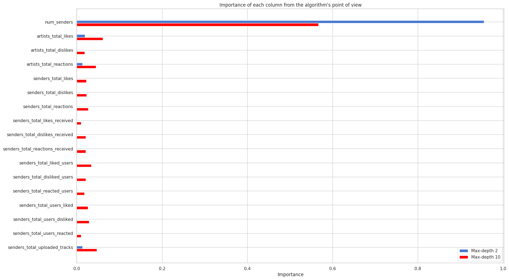
    


**As we can see, the model with deeper depth has more parameters indeed (would ask more questions which would engage more parameters)**

### 2.6 Random Forests  🌳🌲🌳

Random forests create ensembles of decision trees, largely mitigating the risk of structural overfitting inherent to single decision trees.


```python
rf = RandomForestClassifier(n_estimators=100, random_state=42)
rf.fit(X_train_scaled_bin, y_train_bin)
```


<style>#sk-container-id-14 {
  /* Definition of color scheme common for light and dark mode */
  --sklearn-color-text: #000;
  --sklearn-color-text-muted: #666;
  --sklearn-color-line: gray;
  /* Definition of color scheme for unfitted estimators */
  --sklearn-color-unfitted-level-0: #fff5e6;
  --sklearn-color-unfitted-level-1: #f6e4d2;
  --sklearn-color-unfitted-level-2: #ffe0b3;
  --sklearn-color-unfitted-level-3: chocolate;
  /* Definition of color scheme for fitted estimators */
  --sklearn-color-fitted-level-0: #f0f8ff;
  --sklearn-color-fitted-level-1: #d4ebff;
  --sklearn-color-fitted-level-2: #b3dbfd;
  --sklearn-color-fitted-level-3: cornflowerblue;
}

#sk-container-id-14.light {
  /* Specific color for light theme */
  --sklearn-color-text-on-default-background: black;
  --sklearn-color-background: white;
  --sklearn-color-border-box: black;
  --sklearn-color-icon: #696969;
}

#sk-container-id-14.dark {
  --sklearn-color-text-on-default-background: white;
  --sklearn-color-background: #111;
  --sklearn-color-border-box: white;
  --sklearn-color-icon: #878787;
}

#sk-container-id-14 {
  color: var(--sklearn-color-text);
}

#sk-container-id-14 pre {
  padding: 0;
}

#sk-container-id-14 input.sk-hidden--visually {
  border: 0;
  clip: rect(1px 1px 1px 1px);
  clip: rect(1px, 1px, 1px, 1px);
  height: 1px;
  margin: -1px;
  overflow: hidden;
  padding: 0;
  position: absolute;
  width: 1px;
}

#sk-container-id-14 div.sk-dashed-wrapped {
  border: 1px dashed var(--sklearn-color-line);
  margin: 0 0.4em 0.5em 0.4em;
  box-sizing: border-box;
  padding-bottom: 0.4em;
  background-color: var(--sklearn-color-background);
}

#sk-container-id-14 div.sk-container {
  /* jupyter's `normalize.less` sets `[hidden] { display: none; }`
     but bootstrap.min.css set `[hidden] { display: none !important; }`
     so we also need the `!important` here to be able to override the
     default hidden behavior on the sphinx rendered scikit-learn.org.
     See: https://github.com/scikit-learn/scikit-learn/issues/21755 */
  display: inline-block !important;
  position: relative;
}

#sk-container-id-14 div.sk-text-repr-fallback {
  display: none;
}

div.sk-parallel-item,
div.sk-serial,
div.sk-item {
  /* draw centered vertical line to link estimators */
  background-image: linear-gradient(var(--sklearn-color-text-on-default-background), var(--sklearn-color-text-on-default-background));
  background-size: 2px 100%;
  background-repeat: no-repeat;
  background-position: center center;
}

/* Parallel-specific style estimator block */

#sk-container-id-14 div.sk-parallel-item::after {
  content: "";
  width: 100%;
  border-bottom: 2px solid var(--sklearn-color-text-on-default-background);
  flex-grow: 1;
}

#sk-container-id-14 div.sk-parallel {
  display: flex;
  align-items: stretch;
  justify-content: center;
  background-color: var(--sklearn-color-background);
  position: relative;
}

#sk-container-id-14 div.sk-parallel-item {
  display: flex;
  flex-direction: column;
}

#sk-container-id-14 div.sk-parallel-item:first-child::after {
  align-self: flex-end;
  width: 50%;
}

#sk-container-id-14 div.sk-parallel-item:last-child::after {
  align-self: flex-start;
  width: 50%;
}

#sk-container-id-14 div.sk-parallel-item:only-child::after {
  width: 0;
}

/* Serial-specific style estimator block */

#sk-container-id-14 div.sk-serial {
  display: flex;
  flex-direction: column;
  align-items: center;
  background-color: var(--sklearn-color-background);
  padding-right: 1em;
  padding-left: 1em;
}


/* Toggleable style: style used for estimator/Pipeline/ColumnTransformer box that is
clickable and can be expanded/collapsed.
- Pipeline and ColumnTransformer use this feature and define the default style
- Estimators will overwrite some part of the style using the `sk-estimator` class
*/

/* Pipeline and ColumnTransformer style (default) */

#sk-container-id-14 div.sk-toggleable {
  /* Default theme specific background. It is overwritten whether we have a
  specific estimator or a Pipeline/ColumnTransformer */
  background-color: var(--sklearn-color-background);
}

/* Toggleable label */
#sk-container-id-14 label.sk-toggleable__label {
  cursor: pointer;
  display: flex;
  width: 100%;
  margin-bottom: 0;
  padding: 0.5em;
  box-sizing: border-box;
  text-align: center;
  align-items: center;
  justify-content: center;
  gap: 0.5em;
}

#sk-container-id-14 label.sk-toggleable__label .caption {
  font-size: 0.6rem;
  font-weight: lighter;
  color: var(--sklearn-color-text-muted);
}

#sk-container-id-14 label.sk-toggleable__label-arrow:before {
  /* Arrow on the left of the label */
  content: "▸";
  float: left;
  margin-right: 0.25em;
  color: var(--sklearn-color-icon);
}

#sk-container-id-14 label.sk-toggleable__label-arrow:hover:before {
  color: var(--sklearn-color-text);
}

/* Toggleable content - dropdown */

#sk-container-id-14 div.sk-toggleable__content {
  display: none;
  text-align: left;
  /* unfitted */
  background-color: var(--sklearn-color-unfitted-level-0);
}

#sk-container-id-14 div.sk-toggleable__content.fitted {
  /* fitted */
  background-color: var(--sklearn-color-fitted-level-0);
}

#sk-container-id-14 div.sk-toggleable__content pre {
  margin: 0.2em;
  border-radius: 0.25em;
  color: var(--sklearn-color-text);
  /* unfitted */
  background-color: var(--sklearn-color-unfitted-level-0);
}

#sk-container-id-14 div.sk-toggleable__content.fitted pre {
  /* unfitted */
  background-color: var(--sklearn-color-fitted-level-0);
}

#sk-container-id-14 input.sk-toggleable__control:checked~div.sk-toggleable__content {
  /* Expand drop-down */
  display: block;
  width: 100%;
  overflow: visible;
}

#sk-container-id-14 input.sk-toggleable__control:checked~label.sk-toggleable__label-arrow:before {
  content: "▾";
}

/* Pipeline/ColumnTransformer-specific style */

#sk-container-id-14 div.sk-label input.sk-toggleable__control:checked~label.sk-toggleable__label {
  color: var(--sklearn-color-text);
  background-color: var(--sklearn-color-unfitted-level-2);
}

#sk-container-id-14 div.sk-label.fitted input.sk-toggleable__control:checked~label.sk-toggleable__label {
  background-color: var(--sklearn-color-fitted-level-2);
}

/* Estimator-specific style */

/* Colorize estimator box */
#sk-container-id-14 div.sk-estimator input.sk-toggleable__control:checked~label.sk-toggleable__label {
  /* unfitted */
  background-color: var(--sklearn-color-unfitted-level-2);
}

#sk-container-id-14 div.sk-estimator.fitted input.sk-toggleable__control:checked~label.sk-toggleable__label {
  /* fitted */
  background-color: var(--sklearn-color-fitted-level-2);
}

#sk-container-id-14 div.sk-label label.sk-toggleable__label,
#sk-container-id-14 div.sk-label label {
  /* The background is the default theme color */
  color: var(--sklearn-color-text-on-default-background);
}

/* On hover, darken the color of the background */
#sk-container-id-14 div.sk-label:hover label.sk-toggleable__label {
  color: var(--sklearn-color-text);
  background-color: var(--sklearn-color-unfitted-level-2);
}

/* Label box, darken color on hover, fitted */
#sk-container-id-14 div.sk-label.fitted:hover label.sk-toggleable__label.fitted {
  color: var(--sklearn-color-text);
  background-color: var(--sklearn-color-fitted-level-2);
}

/* Estimator label */

#sk-container-id-14 div.sk-label label {
  font-family: monospace;
  font-weight: bold;
  line-height: 1.2em;
}

#sk-container-id-14 div.sk-label-container {
  text-align: center;
}

/* Estimator-specific */
#sk-container-id-14 div.sk-estimator {
  font-family: monospace;
  border: 1px dotted var(--sklearn-color-border-box);
  border-radius: 0.25em;
  box-sizing: border-box;
  margin-bottom: 0.5em;
  /* unfitted */
  background-color: var(--sklearn-color-unfitted-level-0);
}

#sk-container-id-14 div.sk-estimator.fitted {
  /* fitted */
  background-color: var(--sklearn-color-fitted-level-0);
}

/* on hover */
#sk-container-id-14 div.sk-estimator:hover {
  /* unfitted */
  background-color: var(--sklearn-color-unfitted-level-2);
}

#sk-container-id-14 div.sk-estimator.fitted:hover {
  /* fitted */
  background-color: var(--sklearn-color-fitted-level-2);
}

/* Specification for estimator info (e.g. "i" and "?") */

/* Common style for "i" and "?" */

.sk-estimator-doc-link,
a:link.sk-estimator-doc-link,
a:visited.sk-estimator-doc-link {
  float: right;
  font-size: smaller;
  line-height: 1em;
  font-family: monospace;
  background-color: var(--sklearn-color-unfitted-level-0);
  border-radius: 1em;
  height: 1em;
  width: 1em;
  text-decoration: none !important;
  margin-left: 0.5em;
  text-align: center;
  /* unfitted */
  border: var(--sklearn-color-unfitted-level-3) 1pt solid;
  color: var(--sklearn-color-unfitted-level-3);
}

.sk-estimator-doc-link.fitted,
a:link.sk-estimator-doc-link.fitted,
a:visited.sk-estimator-doc-link.fitted {
  /* fitted */
  background-color: var(--sklearn-color-fitted-level-0);
  border: var(--sklearn-color-fitted-level-3) 1pt solid;
  color: var(--sklearn-color-fitted-level-3);
}

/* On hover */
div.sk-estimator:hover .sk-estimator-doc-link:hover,
.sk-estimator-doc-link:hover,
div.sk-label-container:hover .sk-estimator-doc-link:hover,
.sk-estimator-doc-link:hover {
  /* unfitted */
  background-color: var(--sklearn-color-unfitted-level-3);
  border: var(--sklearn-color-fitted-level-0) 1pt solid;
  color: var(--sklearn-color-unfitted-level-0);
  text-decoration: none;
}

div.sk-estimator.fitted:hover .sk-estimator-doc-link.fitted:hover,
.sk-estimator-doc-link.fitted:hover,
div.sk-label-container:hover .sk-estimator-doc-link.fitted:hover,
.sk-estimator-doc-link.fitted:hover {
  /* fitted */
  background-color: var(--sklearn-color-fitted-level-3);
  border: var(--sklearn-color-fitted-level-0) 1pt solid;
  color: var(--sklearn-color-fitted-level-0);
  text-decoration: none;
}

/* Span, style for the box shown on hovering the info icon */
.sk-estimator-doc-link span {
  display: none;
  z-index: 9999;
  position: relative;
  font-weight: normal;
  right: .2ex;
  padding: .5ex;
  margin: .5ex;
  width: min-content;
  min-width: 20ex;
  max-width: 50ex;
  color: var(--sklearn-color-text);
  box-shadow: 2pt 2pt 4pt #999;
  /* unfitted */
  background: var(--sklearn-color-unfitted-level-0);
  border: .5pt solid var(--sklearn-color-unfitted-level-3);
}

.sk-estimator-doc-link.fitted span {
  /* fitted */
  background: var(--sklearn-color-fitted-level-0);
  border: var(--sklearn-color-fitted-level-3);
}

.sk-estimator-doc-link:hover span {
  display: block;
}

/* "?"-specific style due to the `<a>` HTML tag */

#sk-container-id-14 a.estimator_doc_link {
  float: right;
  font-size: 1rem;
  line-height: 1em;
  font-family: monospace;
  background-color: var(--sklearn-color-unfitted-level-0);
  border-radius: 1rem;
  height: 1rem;
  width: 1rem;
  text-decoration: none;
  /* unfitted */
  color: var(--sklearn-color-unfitted-level-1);
  border: var(--sklearn-color-unfitted-level-1) 1pt solid;
}

#sk-container-id-14 a.estimator_doc_link.fitted {
  /* fitted */
  background-color: var(--sklearn-color-fitted-level-0);
  border: var(--sklearn-color-fitted-level-1) 1pt solid;
  color: var(--sklearn-color-fitted-level-1);
}

/* On hover */
#sk-container-id-14 a.estimator_doc_link:hover {
  /* unfitted */
  background-color: var(--sklearn-color-unfitted-level-3);
  color: var(--sklearn-color-background);
  text-decoration: none;
}

#sk-container-id-14 a.estimator_doc_link.fitted:hover {
  /* fitted */
  background-color: var(--sklearn-color-fitted-level-3);
}

.estimator-table {
    font-family: monospace;
}

.estimator-table summary {
    padding: .5rem;
    cursor: pointer;
}

.estimator-table summary::marker {
    font-size: 0.7rem;
}

.estimator-table details[open] {
    padding-left: 0.1rem;
    padding-right: 0.1rem;
    padding-bottom: 0.3rem;
}

.estimator-table .parameters-table {
    margin-left: auto !important;
    margin-right: auto !important;
    margin-top: 0;
}

.estimator-table .parameters-table tr:nth-child(odd) {
    background-color: #fff;
}

.estimator-table .parameters-table tr:nth-child(even) {
    background-color: #f6f6f6;
}

.estimator-table .parameters-table tr:hover {
    background-color: #e0e0e0;
}

.estimator-table table td {
    border: 1px solid rgba(106, 105, 104, 0.232);
}

/*
    `table td`is set in notebook with right text-align.
    We need to overwrite it.
*/
.estimator-table table td.param {
    text-align: left;
    position: relative;
    padding: 0;
}

.user-set td {
    color:rgb(255, 94, 0);
    text-align: left !important;
}

.user-set td.value {
    color:rgb(255, 94, 0);
    background-color: transparent;
}

.default td {
    color: black;
    text-align: left !important;
}

.user-set td i,
.default td i {
    color: black;
}

/*
    Styles for parameter documentation links
    We need styling for visited so jupyter doesn't overwrite it
*/
a.param-doc-link,
a.param-doc-link:link,
a.param-doc-link:visited {
    text-decoration: underline dashed;
    text-underline-offset: .3em;
    color: inherit;
    display: block;
    padding: .5em;
}

/* "hack" to make the entire area of the cell containing the link clickable */
a.param-doc-link::before {
    position: absolute;
    content: "";
    inset: 0;
}

.param-doc-description {
    display: none;
    position: absolute;
    z-index: 9999;
    left: 0;
    padding: .5ex;
    margin-left: 1.5em;
    color: var(--sklearn-color-text);
    box-shadow: .3em .3em .4em #999;
    width: max-content;
    text-align: left;
    max-height: 10em;
    overflow-y: auto;

    /* unfitted */
    background: var(--sklearn-color-unfitted-level-0);
    border: thin solid var(--sklearn-color-unfitted-level-3);
}

/* Fitted state for parameter tooltips */
.fitted .param-doc-description {
    /* fitted */
    background: var(--sklearn-color-fitted-level-0);
    border: thin solid var(--sklearn-color-fitted-level-3);
}

.param-doc-link:hover .param-doc-description {
    display: block;
}

.copy-paste-icon {
    background-image: url();
    background-repeat: no-repeat;
    background-size: 14px 14px;
    background-position: 0;
    display: inline-block;
    width: 14px;
    height: 14px;
    cursor: pointer;
}
</style><body><div id="sk-container-id-14" class="sk-top-container"><div class="sk-text-repr-fallback"><pre>RandomForestClassifier(random_state=42)</pre><b>In a Jupyter environment, please rerun this cell to show the HTML representation or trust the notebook. <br />On GitHub, the HTML representation is unable to render, please try loading this page with nbviewer.org.</b></div><div class="sk-container" hidden><div class="sk-item"><div class="sk-estimator fitted sk-toggleable"><input class="sk-toggleable__control sk-hidden--visually" id="sk-estimator-id-22" type="checkbox" checked><label for="sk-estimator-id-22" class="sk-toggleable__label fitted sk-toggleable__label-arrow"><div><div>RandomForestClassifier</div></div><div><a class="sk-estimator-doc-link fitted" rel="noreferrer" target="_blank" href="https://scikit-learn.org/1.8/modules/generated/sklearn.ensemble.RandomForestClassifier.html">?<span>Documentation for RandomForestClassifier</span></a><span class="sk-estimator-doc-link fitted">i<span>Fitted</span></span></div></label><div class="sk-toggleable__content fitted" data-param-prefix="">
        <div class="estimator-table">
            <details>
                <summary>Parameters</summary>
                <table class="parameters-table">
                  <tbody>

        <tr class="default">
            <td><i class="copy-paste-icon"
                 onclick="copyToClipboard('n_estimators',
                          this.parentElement.nextElementSibling)"
            ></i></td>
            <td class="param">
        <a class="param-doc-link"
            rel="noreferrer" target="_blank" href="https://scikit-learn.org/1.8/modules/generated/sklearn.ensemble.RandomForestClassifier.html#:~:text=n_estimators,-int%2C%20default%3D100">
            n_estimators
            <span class="param-doc-description">n_estimators: int, default=100<br><br>The number of trees in the forest.<br><br>.. versionchanged:: 0.22<br>   The default value of ``n_estimators`` changed from 10 to 100<br>   in 0.22.</span>
        </a>
    </td>
            <td class="value">100</td>
        </tr>


        <tr class="default">
            <td><i class="copy-paste-icon"
                 onclick="copyToClipboard('criterion',
                          this.parentElement.nextElementSibling)"
            ></i></td>
            <td class="param">
        <a class="param-doc-link"
            rel="noreferrer" target="_blank" href="https://scikit-learn.org/1.8/modules/generated/sklearn.ensemble.RandomForestClassifier.html#:~:text=criterion,-%7B%22gini%22%2C%20%22entropy%22%2C%20%22log_loss%22%7D%2C%20default%3D%22gini%22">
            criterion
            <span class="param-doc-description">criterion: {"gini", "entropy", "log_loss"}, default="gini"<br><br>The function to measure the quality of a split. Supported criteria are<br>"gini" for the Gini impurity and "log_loss" and "entropy" both for the<br>Shannon information gain, see :ref:`tree_mathematical_formulation`.<br>Note: This parameter is tree-specific.</span>
        </a>
    </td>
            <td class="value">&#x27;gini&#x27;</td>
        </tr>


        <tr class="default">
            <td><i class="copy-paste-icon"
                 onclick="copyToClipboard('max_depth',
                          this.parentElement.nextElementSibling)"
            ></i></td>
            <td class="param">
        <a class="param-doc-link"
            rel="noreferrer" target="_blank" href="https://scikit-learn.org/1.8/modules/generated/sklearn.ensemble.RandomForestClassifier.html#:~:text=max_depth,-int%2C%20default%3DNone">
            max_depth
            <span class="param-doc-description">max_depth: int, default=None<br><br>The maximum depth of the tree. If None, then nodes are expanded until<br>all leaves are pure or until all leaves contain less than<br>min_samples_split samples.</span>
        </a>
    </td>
            <td class="value">None</td>
        </tr>


        <tr class="default">
            <td><i class="copy-paste-icon"
                 onclick="copyToClipboard('min_samples_split',
                          this.parentElement.nextElementSibling)"
            ></i></td>
            <td class="param">
        <a class="param-doc-link"
            rel="noreferrer" target="_blank" href="https://scikit-learn.org/1.8/modules/generated/sklearn.ensemble.RandomForestClassifier.html#:~:text=min_samples_split,-int%20or%20float%2C%20default%3D2">
            min_samples_split
            <span class="param-doc-description">min_samples_split: int or float, default=2<br><br>The minimum number of samples required to split an internal node:<br><br>- If int, then consider `min_samples_split` as the minimum number.<br>- If float, then `min_samples_split` is a fraction and<br>  `ceil(min_samples_split * n_samples)` are the minimum<br>  number of samples for each split.<br><br>.. versionchanged:: 0.18<br>   Added float values for fractions.</span>
        </a>
    </td>
            <td class="value">2</td>
        </tr>


        <tr class="default">
            <td><i class="copy-paste-icon"
                 onclick="copyToClipboard('min_samples_leaf',
                          this.parentElement.nextElementSibling)"
            ></i></td>
            <td class="param">
        <a class="param-doc-link"
            rel="noreferrer" target="_blank" href="https://scikit-learn.org/1.8/modules/generated/sklearn.ensemble.RandomForestClassifier.html#:~:text=min_samples_leaf,-int%20or%20float%2C%20default%3D1">
            min_samples_leaf
            <span class="param-doc-description">min_samples_leaf: int or float, default=1<br><br>The minimum number of samples required to be at a leaf node.<br>A split point at any depth will only be considered if it leaves at<br>least ``min_samples_leaf`` training samples in each of the left and<br>right branches.  This may have the effect of smoothing the model,<br>especially in regression.<br><br>- If int, then consider `min_samples_leaf` as the minimum number.<br>- If float, then `min_samples_leaf` is a fraction and<br>  `ceil(min_samples_leaf * n_samples)` are the minimum<br>  number of samples for each node.<br><br>.. versionchanged:: 0.18<br>   Added float values for fractions.</span>
        </a>
    </td>
            <td class="value">1</td>
        </tr>


        <tr class="default">
            <td><i class="copy-paste-icon"
                 onclick="copyToClipboard('min_weight_fraction_leaf',
                          this.parentElement.nextElementSibling)"
            ></i></td>
            <td class="param">
        <a class="param-doc-link"
            rel="noreferrer" target="_blank" href="https://scikit-learn.org/1.8/modules/generated/sklearn.ensemble.RandomForestClassifier.html#:~:text=min_weight_fraction_leaf,-float%2C%20default%3D0.0">
            min_weight_fraction_leaf
            <span class="param-doc-description">min_weight_fraction_leaf: float, default=0.0<br><br>The minimum weighted fraction of the sum total of weights (of all<br>the input samples) required to be at a leaf node. Samples have<br>equal weight when sample_weight is not provided.</span>
        </a>
    </td>
            <td class="value">0.0</td>
        </tr>


        <tr class="default">
            <td><i class="copy-paste-icon"
                 onclick="copyToClipboard('max_features',
                          this.parentElement.nextElementSibling)"
            ></i></td>
            <td class="param">
        <a class="param-doc-link"
            rel="noreferrer" target="_blank" href="https://scikit-learn.org/1.8/modules/generated/sklearn.ensemble.RandomForestClassifier.html#:~:text=max_features,-%7B%22sqrt%22%2C%20%22log2%22%2C%20None%7D%2C%20int%20or%20float%2C%20default%3D%22sqrt%22">
            max_features
            <span class="param-doc-description">max_features: {"sqrt", "log2", None}, int or float, default="sqrt"<br><br>The number of features to consider when looking for the best split:<br><br>- If int, then consider `max_features` features at each split.<br>- If float, then `max_features` is a fraction and<br>  `max(1, int(max_features * n_features_in_))` features are considered at each<br>  split.<br>- If "sqrt", then `max_features=sqrt(n_features)`.<br>- If "log2", then `max_features=log2(n_features)`.<br>- If None, then `max_features=n_features`.<br><br>.. versionchanged:: 1.1<br>    The default of `max_features` changed from `"auto"` to `"sqrt"`.<br><br>Note: the search for a split does not stop until at least one<br>valid partition of the node samples is found, even if it requires to<br>effectively inspect more than ``max_features`` features.</span>
        </a>
    </td>
            <td class="value">&#x27;sqrt&#x27;</td>
        </tr>


        <tr class="default">
            <td><i class="copy-paste-icon"
                 onclick="copyToClipboard('max_leaf_nodes',
                          this.parentElement.nextElementSibling)"
            ></i></td>
            <td class="param">
        <a class="param-doc-link"
            rel="noreferrer" target="_blank" href="https://scikit-learn.org/1.8/modules/generated/sklearn.ensemble.RandomForestClassifier.html#:~:text=max_leaf_nodes,-int%2C%20default%3DNone">
            max_leaf_nodes
            <span class="param-doc-description">max_leaf_nodes: int, default=None<br><br>Grow trees with ``max_leaf_nodes`` in best-first fashion.<br>Best nodes are defined as relative reduction in impurity.<br>If None then unlimited number of leaf nodes.</span>
        </a>
    </td>
            <td class="value">None</td>
        </tr>


        <tr class="default">
            <td><i class="copy-paste-icon"
                 onclick="copyToClipboard('min_impurity_decrease',
                          this.parentElement.nextElementSibling)"
            ></i></td>
            <td class="param">
        <a class="param-doc-link"
            rel="noreferrer" target="_blank" href="https://scikit-learn.org/1.8/modules/generated/sklearn.ensemble.RandomForestClassifier.html#:~:text=min_impurity_decrease,-float%2C%20default%3D0.0">
            min_impurity_decrease
            <span class="param-doc-description">min_impurity_decrease: float, default=0.0<br><br>A node will be split if this split induces a decrease of the impurity<br>greater than or equal to this value.<br><br>The weighted impurity decrease equation is the following::<br><br>    N_t / N * (impurity - N_t_R / N_t * right_impurity<br>                        - N_t_L / N_t * left_impurity)<br><br>where ``N`` is the total number of samples, ``N_t`` is the number of<br>samples at the current node, ``N_t_L`` is the number of samples in the<br>left child, and ``N_t_R`` is the number of samples in the right child.<br><br>``N``, ``N_t``, ``N_t_R`` and ``N_t_L`` all refer to the weighted sum,<br>if ``sample_weight`` is passed.<br><br>.. versionadded:: 0.19</span>
        </a>
    </td>
            <td class="value">0.0</td>
        </tr>


        <tr class="default">
            <td><i class="copy-paste-icon"
                 onclick="copyToClipboard('bootstrap',
                          this.parentElement.nextElementSibling)"
            ></i></td>
            <td class="param">
        <a class="param-doc-link"
            rel="noreferrer" target="_blank" href="https://scikit-learn.org/1.8/modules/generated/sklearn.ensemble.RandomForestClassifier.html#:~:text=bootstrap,-bool%2C%20default%3DTrue">
            bootstrap
            <span class="param-doc-description">bootstrap: bool, default=True<br><br>Whether bootstrap samples are used when building trees. If False, the<br>whole dataset is used to build each tree.</span>
        </a>
    </td>
            <td class="value">True</td>
        </tr>


        <tr class="default">
            <td><i class="copy-paste-icon"
                 onclick="copyToClipboard('oob_score',
                          this.parentElement.nextElementSibling)"
            ></i></td>
            <td class="param">
        <a class="param-doc-link"
            rel="noreferrer" target="_blank" href="https://scikit-learn.org/1.8/modules/generated/sklearn.ensemble.RandomForestClassifier.html#:~:text=oob_score,-bool%20or%20callable%2C%20default%3DFalse">
            oob_score
            <span class="param-doc-description">oob_score: bool or callable, default=False<br><br>Whether to use out-of-bag samples to estimate the generalization score.<br>By default, :func:`~sklearn.metrics.accuracy_score` is used.<br>Provide a callable with signature `metric(y_true, y_pred)` to use a<br>custom metric. Only available if `bootstrap=True`.<br><br>For an illustration of out-of-bag (OOB) error estimation, see the example<br>:ref:`sphx_glr_auto_examples_ensemble_plot_ensemble_oob.py`.</span>
        </a>
    </td>
            <td class="value">False</td>
        </tr>


        <tr class="default">
            <td><i class="copy-paste-icon"
                 onclick="copyToClipboard('n_jobs',
                          this.parentElement.nextElementSibling)"
            ></i></td>
            <td class="param">
        <a class="param-doc-link"
            rel="noreferrer" target="_blank" href="https://scikit-learn.org/1.8/modules/generated/sklearn.ensemble.RandomForestClassifier.html#:~:text=n_jobs,-int%2C%20default%3DNone">
            n_jobs
            <span class="param-doc-description">n_jobs: int, default=None<br><br>The number of jobs to run in parallel. :meth:`fit`, :meth:`predict`,<br>:meth:`decision_path` and :meth:`apply` are all parallelized over the<br>trees. ``None`` means 1 unless in a :obj:`joblib.parallel_backend`<br>context. ``-1`` means using all processors. See :term:`Glossary<br><n_jobs>` for more details.</span>
        </a>
    </td>
            <td class="value">None</td>
        </tr>


        <tr class="user-set">
            <td><i class="copy-paste-icon"
                 onclick="copyToClipboard('random_state',
                          this.parentElement.nextElementSibling)"
            ></i></td>
            <td class="param">
        <a class="param-doc-link"
            rel="noreferrer" target="_blank" href="https://scikit-learn.org/1.8/modules/generated/sklearn.ensemble.RandomForestClassifier.html#:~:text=random_state,-int%2C%20RandomState%20instance%20or%20None%2C%20default%3DNone">
            random_state
            <span class="param-doc-description">random_state: int, RandomState instance or None, default=None<br><br>Controls both the randomness of the bootstrapping of the samples used<br>when building trees (if ``bootstrap=True``) and the sampling of the<br>features to consider when looking for the best split at each node<br>(if ``max_features < n_features``).<br>See :term:`Glossary <random_state>` for details.</span>
        </a>
    </td>
            <td class="value">42</td>
        </tr>


        <tr class="default">
            <td><i class="copy-paste-icon"
                 onclick="copyToClipboard('verbose',
                          this.parentElement.nextElementSibling)"
            ></i></td>
            <td class="param">
        <a class="param-doc-link"
            rel="noreferrer" target="_blank" href="https://scikit-learn.org/1.8/modules/generated/sklearn.ensemble.RandomForestClassifier.html#:~:text=verbose,-int%2C%20default%3D0">
            verbose
            <span class="param-doc-description">verbose: int, default=0<br><br>Controls the verbosity when fitting and predicting.</span>
        </a>
    </td>
            <td class="value">0</td>
        </tr>


        <tr class="default">
            <td><i class="copy-paste-icon"
                 onclick="copyToClipboard('warm_start',
                          this.parentElement.nextElementSibling)"
            ></i></td>
            <td class="param">
        <a class="param-doc-link"
            rel="noreferrer" target="_blank" href="https://scikit-learn.org/1.8/modules/generated/sklearn.ensemble.RandomForestClassifier.html#:~:text=warm_start,-bool%2C%20default%3DFalse">
            warm_start
            <span class="param-doc-description">warm_start: bool, default=False<br><br>When set to ``True``, reuse the solution of the previous call to fit<br>and add more estimators to the ensemble, otherwise, just fit a whole<br>new forest. See :term:`Glossary <warm_start>` and<br>:ref:`tree_ensemble_warm_start` for details.</span>
        </a>
    </td>
            <td class="value">False</td>
        </tr>


        <tr class="default">
            <td><i class="copy-paste-icon"
                 onclick="copyToClipboard('class_weight',
                          this.parentElement.nextElementSibling)"
            ></i></td>
            <td class="param">
        <a class="param-doc-link"
            rel="noreferrer" target="_blank" href="https://scikit-learn.org/1.8/modules/generated/sklearn.ensemble.RandomForestClassifier.html#:~:text=class_weight,-%7B%22balanced%22%2C%20%22balanced_subsample%22%7D%2C%20dict%20or%20list%20of%20dicts%2C%20%20%20%20%20%20%20%20%20%20%20%20%20default%3DNone">
            class_weight
            <span class="param-doc-description">class_weight: {"balanced", "balanced_subsample"}, dict or list of dicts,             default=None<br><br>Weights associated with classes in the form ``{class_label: weight}``.<br>If not given, all classes are supposed to have weight one. For<br>multi-output problems, a list of dicts can be provided in the same<br>order as the columns of y.<br><br>Note that for multioutput (including multilabel) weights should be<br>defined for each class of every column in its own dict. For example,<br>for four-class multilabel classification weights should be<br>[{0: 1, 1: 1}, {0: 1, 1: 5}, {0: 1, 1: 1}, {0: 1, 1: 1}] instead of<br>[{1:1}, {2:5}, {3:1}, {4:1}].<br><br>The "balanced" mode uses the values of y to automatically adjust<br>weights inversely proportional to class frequencies in the input data<br>as ``n_samples / (n_classes * np.bincount(y))``<br><br>The "balanced_subsample" mode is the same as "balanced" except that<br>weights are computed based on the bootstrap sample for every tree<br>grown.<br><br>For multi-output, the weights of each column of y will be multiplied.<br><br>Note that these weights will be multiplied with sample_weight (passed<br>through the fit method) if sample_weight is specified.</span>
        </a>
    </td>
            <td class="value">None</td>
        </tr>


        <tr class="default">
            <td><i class="copy-paste-icon"
                 onclick="copyToClipboard('ccp_alpha',
                          this.parentElement.nextElementSibling)"
            ></i></td>
            <td class="param">
        <a class="param-doc-link"
            rel="noreferrer" target="_blank" href="https://scikit-learn.org/1.8/modules/generated/sklearn.ensemble.RandomForestClassifier.html#:~:text=ccp_alpha,-non-negative%20float%2C%20default%3D0.0">
            ccp_alpha
            <span class="param-doc-description">ccp_alpha: non-negative float, default=0.0<br><br>Complexity parameter used for Minimal Cost-Complexity Pruning. The<br>subtree with the largest cost complexity that is smaller than<br>``ccp_alpha`` will be chosen. By default, no pruning is performed. See<br>:ref:`minimal_cost_complexity_pruning` for details. See<br>:ref:`sphx_glr_auto_examples_tree_plot_cost_complexity_pruning.py`<br>for an example of such pruning.<br><br>.. versionadded:: 0.22</span>
        </a>
    </td>
            <td class="value">0.0</td>
        </tr>


        <tr class="default">
            <td><i class="copy-paste-icon"
                 onclick="copyToClipboard('max_samples',
                          this.parentElement.nextElementSibling)"
            ></i></td>
            <td class="param">
        <a class="param-doc-link"
            rel="noreferrer" target="_blank" href="https://scikit-learn.org/1.8/modules/generated/sklearn.ensemble.RandomForestClassifier.html#:~:text=max_samples,-int%20or%20float%2C%20default%3DNone">
            max_samples
            <span class="param-doc-description">max_samples: int or float, default=None<br><br>If bootstrap is True, the number of samples to draw from X<br>to train each base estimator.<br><br>- If None (default), then draw `X.shape[0]` samples.<br>- If int, then draw `max_samples` samples.<br>- If float, then draw `max(round(n_samples * max_samples), 1)` samples. Thus,<br>  `max_samples` should be in the interval `(0.0, 1.0]`.<br><br>.. versionadded:: 0.22</span>
        </a>
    </td>
            <td class="value">None</td>
        </tr>


        <tr class="default">
            <td><i class="copy-paste-icon"
                 onclick="copyToClipboard('monotonic_cst',
                          this.parentElement.nextElementSibling)"
            ></i></td>
            <td class="param">
        <a class="param-doc-link"
            rel="noreferrer" target="_blank" href="https://scikit-learn.org/1.8/modules/generated/sklearn.ensemble.RandomForestClassifier.html#:~:text=monotonic_cst,-array-like%20of%20int%20of%20shape%20%28n_features%29%2C%20default%3DNone">
            monotonic_cst
            <span class="param-doc-description">monotonic_cst: array-like of int of shape (n_features), default=None<br><br>Indicates the monotonicity constraint to enforce on each feature.<br>  - 1: monotonic increase<br>  - 0: no constraint<br>  - -1: monotonic decrease<br><br>If monotonic_cst is None, no constraints are applied.<br><br>Monotonicity constraints are not supported for:<br>  - multiclass classifications (i.e. when `n_classes > 2`),<br>  - multioutput classifications (i.e. when `n_outputs_ > 1`),<br>  - classifications trained on data with missing values.<br><br>The constraints hold over the probability of the positive class.<br><br>Read more in the :ref:`User Guide <monotonic_cst_gbdt>`.<br><br>.. versionadded:: 1.4</span>
        </a>
    </td>
            <td class="value">None</td>
        </tr>

                  </tbody>
                </table>
            </details>
        </div>
    </div></div></div></div></div><script>function copyToClipboard(text, element) {
    // Get the parameter prefix from the closest toggleable content
    const toggleableContent = element.closest('.sk-toggleable__content');
    const paramPrefix = toggleableContent ? toggleableContent.dataset.paramPrefix : '';
    const fullParamName = paramPrefix ? `${paramPrefix}${text}` : text;

    const originalStyle = element.style;
    const computedStyle = window.getComputedStyle(element);
    const originalWidth = computedStyle.width;
    const originalHTML = element.innerHTML.replace('Copied!', '');

    navigator.clipboard.writeText(fullParamName)
        .then(() => {
            element.style.width = originalWidth;
            element.style.color = 'green';
            element.innerHTML = "Copied!";

            setTimeout(() => {
                element.innerHTML = originalHTML;
                element.style = originalStyle;
            }, 2000);
        })
        .catch(err => {
            console.error('Failed to copy:', err);
            element.style.color = 'red';
            element.innerHTML = "Failed!";
            setTimeout(() => {
                element.innerHTML = originalHTML;
                element.style = originalStyle;
            }, 2000);
        });
    return false;
}

document.querySelectorAll('.copy-paste-icon').forEach(function(element) {
    const toggleableContent = element.closest('.sk-toggleable__content');
    const paramPrefix = toggleableContent ? toggleableContent.dataset.paramPrefix : '';
    const paramName = element.parentElement.nextElementSibling
        .textContent.trim().split(' ')[0];
    const fullParamName = paramPrefix ? `${paramPrefix}${paramName}` : paramName;

    element.setAttribute('title', fullParamName);
});


/**
 * Adapted from Skrub
 * https://github.com/skrub-data/skrub/blob/403466d1d5d4dc76a7ef569b3f8228db59a31dc3/skrub/_reporting/_data/templates/report.js#L789
 * @returns "light" or "dark"
 */
function detectTheme(element) {
    const body = document.querySelector('body');

    // Check VSCode theme
    const themeKindAttr = body.getAttribute('data-vscode-theme-kind');
    const themeNameAttr = body.getAttribute('data-vscode-theme-name');

    if (themeKindAttr && themeNameAttr) {
        const themeKind = themeKindAttr.toLowerCase();
        const themeName = themeNameAttr.toLowerCase();

        if (themeKind.includes("dark") || themeName.includes("dark")) {
            return "dark";
        }
        if (themeKind.includes("light") || themeName.includes("light")) {
            return "light";
        }
    }

    // Check Jupyter theme
    if (body.getAttribute('data-jp-theme-light') === 'false') {
        return 'dark';
    } else if (body.getAttribute('data-jp-theme-light') === 'true') {
        return 'light';
    }

    // Guess based on a parent element's color
    const color = window.getComputedStyle(element.parentNode, null).getPropertyValue('color');
    const match = color.match(/^rgb\s*\(\s*(\d+)\s*,\s*(\d+)\s*,\s*(\d+)\s*\)\s*$/i);
    if (match) {
        const [r, g, b] = [
            parseFloat(match[1]),
            parseFloat(match[2]),
            parseFloat(match[3])
        ];

        // https://en.wikipedia.org/wiki/HSL_and_HSV#Lightness
        const luma = 0.299 * r + 0.587 * g + 0.114 * b;

        if (luma > 180) {
            // If the text is very bright we have a dark theme
            return 'dark';
        }
        if (luma < 75) {
            // If the text is very dark we have a light theme
            return 'light';
        }
        // Otherwise fall back to the next heuristic.
    }

    // Fallback to system preference
    return window.matchMedia('(prefers-color-scheme: dark)').matches ? 'dark' : 'light';
}


function forceTheme(elementId) {
    const estimatorElement = document.querySelector(`#${elementId}`);
    if (estimatorElement === null) {
        console.error(`Element with id ${elementId} not found.`);
    } else {
        const theme = detectTheme(estimatorElement);
        estimatorElement.classList.add(theme);
    }
}

forceTheme('sk-container-id-14');</script></body>


```python
y_pred_rf = rf.predict(X_test_scaled_bin)
y_prob_rf = rf.predict_proba(X_test_scaled_bin)[:, 1]

evaluate_binary_classification("Random Forest", y_test_bin, y_pred_rf, y_prob_rf)
```

    
    ========================================
    🌟 Random Forest Evaluation
    ========================================
    🔸 Accuracy:  0.9492
    🔸 Precision: 0.6782
    🔸 Recall:    0.4214
    🔸 F1-Score:  0.7465
    


    

    


#### 📝 Model Analysis: Random Forest

* **High Metric Capability:** A strong ROC AUC of **0.88** proves the ensemble method successfully creates deep non-linear boundaries using feature bagging to isolate popular track signals.
* **Elevated False Alarm Costs:** Compared to Logistic Regression, the ensemble structure was less conservative—raising the number of false alarms to 28, which dropped Precision to **0.6782**.
* **Identical Target Coverage:** It captured exactly 59 true hits (matching the RBF SVM), returning a decent baseline Recall of **0.4214** while leaving 81 hit tracks undetected.
* **Ensemble Balance:** The combined drop in precision and flat recall response yields a Macro F1-Score of **0.7465**, indicating that out-of-the-box voting rules require class-weight balancing to beat simple linear models.

### 🗣️ Discussion & Questions (Binary Classification)

**1. Based on your evaluation, what is the best metric to measure the performances of the models predicting popularity? (Accuracy, Precision, Recall, F1-Score)**
> The **Macro F1-Score** is the best metric because the dataset suffers from severe class imbalance (~6.5% popular tracks). Accuracy is highly misleading here; as shown by the broken Linear SVM, a model can achieve 93.47% accuracy simply by predicting "not popular" for every single track. Macro F1-Score forces equal weighting of both classes, ensuring that successful hit detection (Recall) and true prediction reliability (Precision) are balanced without being swallowed by the dominant negative class.

**2. Which regularisation technique(s) have you used for decision tree?**
> We applied structural pre-pruning techniques by constraining **`max_depth`** to limit how deep the tree hierarchical splits could grow, and **`max_features`** to restrict the number of features considered at each split node. Tuning these parameters using our F1 validation curves effectively prevented the tree from memorizing training data noise and controlled the bias-variance tradeoff.

**3. What is the fundamental difference between Linear SVM and Kernel SVM? Provide 2 examples of kernels.**
> Linear SVM searches for a flat hyperplane (a straight boundary) to split classes directly within the original feature space, making it fail when data is overlapping or non-linear (as seen by our 140-dimensional polynomial collapse). Kernel SVM utilizes the "kernel trick" to map data implicitly into a higher-dimensional space where a linear boundary can cleanly separate the classes, all without computing the coordinates of the data in that new space.
> **Two examples of Kernels:**
> 1. Radial Basis Function (RBF)
> 2. Polynomial Kernel


```python
show_binary_classification_table_results()
```


<style type="text/css">
#T_6c0a9_row0_col3, #T_6c0a9_row1_col3 {
  background-color: #08306b;
  color: #f1f1f1;
}
#T_6c0a9_row2_col3 {
  background-color: #083979;
  color: #f1f1f1;
}
#T_6c0a9_row3_col3 {
  background-color: #083b7c;
  color: #f1f1f1;
}
#T_6c0a9_row4_col3 {
  background-color: #084184;
  color: #f1f1f1;
}
#T_6c0a9_row5_col3 {
  background-color: #0a549e;
  color: #f1f1f1;
}
#T_6c0a9_row6_col3 {
  background-color: #f7fbff;
  color: #000000;
}
</style>
<table id="T_6c0a9">
  <thead>
    <tr>
      <th class="blank level0" >&nbsp;</th>
      <th id="T_6c0a9_level0_col0" class="col_heading level0 col0" >Accuracy</th>
      <th id="T_6c0a9_level0_col1" class="col_heading level0 col1" >Precision</th>
      <th id="T_6c0a9_level0_col2" class="col_heading level0 col2" >Recall</th>
      <th id="T_6c0a9_level0_col3" class="col_heading level0 col3" >F1-Score</th>
    </tr>
    <tr>
      <th class="index_name level0" >Model</th>
      <th class="blank col0" >&nbsp;</th>
      <th class="blank col1" >&nbsp;</th>
      <th class="blank col2" >&nbsp;</th>
      <th class="blank col3" >&nbsp;</th>
    </tr>
  </thead>
  <tbody>
    <tr>
      <th id="T_6c0a9_level0_row0" class="row_heading level0 row0" >SVM (RBF Kernel)</th>
      <td id="T_6c0a9_row0_col0" class="data row0 col0" >0.9543</td>
      <td id="T_6c0a9_row0_col1" class="data row0 col1" >0.7763</td>
      <td id="T_6c0a9_row0_col2" class="data row0 col2" >0.4214</td>
      <td id="T_6c0a9_row0_col3" class="data row0 col3" >0.7611</td>
    </tr>
    <tr>
      <th id="T_6c0a9_level0_row1" class="row_heading level0 row1" >Logistic Regression</th>
      <td id="T_6c0a9_row1_col0" class="data row1 col0" >0.9534</td>
      <td id="T_6c0a9_row1_col1" class="data row1 col1" >0.7500</td>
      <td id="T_6c0a9_row1_col2" class="data row1 col2" >0.4286</td>
      <td id="T_6c0a9_row1_col3" class="data row1 col3" >0.7604</td>
    </tr>
    <tr>
      <th id="T_6c0a9_level0_row2" class="row_heading level0 row2" >Decision Tree (Gini)</th>
      <td id="T_6c0a9_row2_col0" class="data row2 col0" >0.9534</td>
      <td id="T_6c0a9_row2_col1" class="data row2 col1" >0.7857</td>
      <td id="T_6c0a9_row2_col2" class="data row2 col2" >0.3929</td>
      <td id="T_6c0a9_row2_col3" class="data row2 col3" >0.7496</td>
    </tr>
    <tr>
      <th id="T_6c0a9_level0_row3" class="row_heading level0 row3" >Random Forest</th>
      <td id="T_6c0a9_row3_col0" class="data row3 col0" >0.9492</td>
      <td id="T_6c0a9_row3_col1" class="data row3 col1" >0.6782</td>
      <td id="T_6c0a9_row3_col2" class="data row3 col2" >0.4214</td>
      <td id="T_6c0a9_row3_col3" class="data row3 col3" >0.7465</td>
    </tr>
    <tr>
      <th id="T_6c0a9_level0_row4" class="row_heading level0 row4" >KNN (k=25)</th>
      <td id="T_6c0a9_row4_col0" class="data row4 col0" >0.9529</td>
      <td id="T_6c0a9_row4_col1" class="data row4 col1" >0.8000</td>
      <td id="T_6c0a9_row4_col2" class="data row4 col2" >0.3714</td>
      <td id="T_6c0a9_row4_col3" class="data row4 col3" >0.7413</td>
    </tr>
    <tr>
      <th id="T_6c0a9_level0_row5" class="row_heading level0 row5" >Decision Tree (Entropy)</th>
      <td id="T_6c0a9_row5_col0" class="data row5 col0" >0.9497</td>
      <td id="T_6c0a9_row5_col1" class="data row5 col1" >0.7667</td>
      <td id="T_6c0a9_row5_col2" class="data row5 col2" >0.3286</td>
      <td id="T_6c0a9_row5_col3" class="data row5 col3" >0.7168</td>
    </tr>
    <tr>
      <th id="T_6c0a9_level0_row6" class="row_heading level0 row6" >SVM (Linear Kernel)</th>
      <td id="T_6c0a9_row6_col0" class="data row6 col0" >0.6219</td>
      <td id="T_6c0a9_row6_col1" class="data row6 col1" >0.0769</td>
      <td id="T_6c0a9_row6_col2" class="data row6 col2" >0.4357</td>
      <td id="T_6c0a9_row6_col3" class="data row6 col3" >0.4446</td>
    </tr>
  </tbody>
</table>


```python
show_binary_classification_plot_results()
```


    
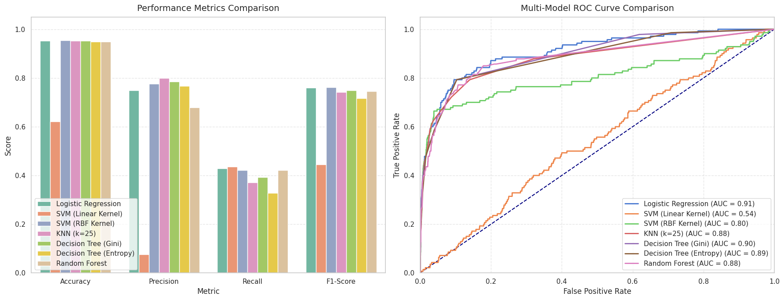
    


---

## 3️⃣ 🎨 Multiclass Classification Methods

Real-world scenarios rarely fall into just two boxes. We'll introduce a target feature with **4 distinct classes** (`Neutral`, `Hated`, `Loved`, `Controversial`).

**Tasks Included:**
*   Implementing **Multiclass SVM, Multiclass Logistic Regression (OVR/Multinomial), Multiclass KNN (Tuned), Multiclass Decision Trees**, and advanced trees such as **Boosting** (XGBoost, LightGBM, AdaBoost, CatBoost).
*   Scoring implementations individually via **Accuracy, Precision (per class), Recall (per class),** and **F1-Scores (Macro, Micro, Weighted)**.
*   Discussing metric preferences theoretically.


### 🔢 Data Preparation & Multi-Label Logic

We will now classify tracks into **4 distinct categories** utilizing threshold mathematics applied across tracking metrics (`total_reactions`, `total_likes`, `total_dislikes`). The classes reflect track reception:
* **Neutral**: `total_reactions`.
* **Hated**: High reactions, but notably elevated `total_dislikes`.
* **Loved**: High reactions, notably elevated `total_likes`.
* **Controversial**: High reactions, with both strongly elevated `likes` AND `dislikes`.

*Note: For unbiased training, we extract this data raw, label the tracks, map them to our preprocessed dataset, and then drop all source metric leakages.*


```python
raw_tracks = pd.read_csv(TRACKS_PATH)[['track_id', 'total_reactions', 'total_likes', 'total_dislikes']]

r_t = raw_tracks['total_reactions'].median()
high_rx = raw_tracks[raw_tracks['total_reactions'] > r_t]
l_t = high_rx['total_likes'].median()
d_t = high_rx['total_dislikes'].mean()  # median is often 0, so mean is more useful here
print(f"📌 Thresholds - Reactions: {r_t}, Likes: {l_t}, Dislikes: {d_t}")

def assign_multiclass_label(row):
    if row['total_reactions'] <= r_t:
        return 'Neutral'
    
    likes_high = row['total_likes'] > l_t
    dislikes_high = row['total_dislikes'] > d_t

    if likes_high and dislikes_high:
        return 'Controversial'
    elif likes_high:
        return 'Loved'
    elif dislikes_high:
        return 'Hated'
    else:
        return 'Neutral'

raw_tracks['target_mc'] = raw_tracks.apply(assign_multiclass_label, axis=1)

print(f"📊 Class Distribution:\n{raw_tracks['target_mc'].value_counts()}\n")
print(f"✅ Missing labels: {raw_tracks['target_mc'].isna().sum()}")

df_mc = pd.merge(df_reg_tracks.copy(), raw_tracks[['track_id', 'target_mc']], on='track_id', how='left')
df_mc['target_mc'] = df_mc['target_mc'].fillna('Neutral')  # safety fallback

X_mc = df_mc.drop(columns=['track_id', 'total_reactions', 'target_mc'])
y_mc = df_mc['target_mc']

label_encoder = LabelEncoder()
y_mc_encoded = label_encoder.fit_transform(y_mc)
mc_labels = label_encoder.classes_

X_train_mc, X_test_mc, y_train_mc, y_test_mc = train_test_split(
    X_mc, y_mc_encoded, test_size=0.2, random_state=42, stratify=y_mc_encoded
)

scaler_mc = StandardScaler()
X_train_scaled_mc = scaler_mc.fit_transform(X_train_mc)
X_test_scaled_mc = scaler_mc.transform(X_test_mc)


```

    📌 Thresholds - Reactions: 4.0, Likes: 8.0, Dislikes: 0.28583783783783784
    📊 Class Distribution:
    target_mc
    Neutral          8398
    Loved            1738
    Hated             321
    Controversial     268
    Name: count, dtype: int64
    
    ✅ Missing labels: 0


### 📈 Evaluation Method (Multiclass)

Below is our universally mapped evaluation method specifically tailored for multiclass reports. It will extract **Accuracy, Macro/Micro/Weighted F1 Scores, Log Loss**, and visually render our **Confusion Matrix**.


```python
mc_results_storage = {}

def evaluate_multiclass(model_name, y_true, y_pred, y_prob=None, labels=None):
    """
    Enhanced multiclass evaluation pipeline. Plots a dual-view visualization 
    and displays a styled Jupyter Notebook DataFrame table instead of plain text reports.
    """
    print(f"\n{'='*60}")
    print(f"🌟 Multiclass Evaluation: {model_name}")
    print(f"{'='*60}")
    
    # 1. Base Metric Extraction
    acc = accuracy_score(y_true, y_pred)
    f1_macro = f1_score(y_true, y_pred, average='macro', zero_division=0)
    f1_micro = f1_score(y_true, y_pred, average='micro', zero_division=0)
    f1_weighted = f1_score(y_true, y_pred, average='weighted', zero_division=0)
    
    # Safe log loss retrieval
    ll = np.nan
    if y_prob is not None:
        try:
            ll = log_loss(y_true, y_prob)
            print(f"🔸 Accuracy:            {acc:.4f}")
            print(f"🔸 F1-Score (Macro):    {f1_macro:.4f}")
            print(f"🔸 F1-Score (Micro):    {f1_micro:.4f}")
            print(f"🔸 F1-Score (Weighted): {f1_weighted:.4f}")
            print(f"🔸 Log Loss:            {ll:.4f}")
        except ValueError:
            print(f"🔸 Log Loss:            N/A (Shape Mismatch)")
    else:
        print(f"🔸 Accuracy:            {acc:.4f}")
        print(f"🔸 F1-Score (Macro):    {f1_macro:.4f}")
        print(f"🔸 F1-Score (Micro):    {f1_micro:.4f}")
        print(f"🔸 F1-Score (Weighted): {f1_weighted:.4f}")

    # Extract clean per-class precision, recall, and support vectors
    precision_vec, recall_vec, f1_vec, support_vec = precision_recall_fscore_support(
        y_true, y_pred, beta=1.0, average=None, zero_division=0
    )
    
    # 2. Store metrics inside global tracker for ultimate summary tables
    mc_results_storage[model_name] = {
        "Accuracy": acc,
        "F1_Macro": f1_macro,
        "F1_Micro": f1_micro,
        "F1_Weighted": f1_weighted,
        "Log_Loss": ll
    }
    
    # Add per-class scores to tracker
    active_labels = labels if labels is not None else [f"Class_{i}" for i in range(len(precision_vec))]
    for idx, class_name in enumerate(active_labels):
        mc_results_storage[model_name][f"{class_name}_Precision"] = precision_vec[idx]
        mc_results_storage[model_name][f"{class_name}_Recall"] = recall_vec[idx]

    # 3. Construct and Display the Styled Jupyter Notebook Report Table
    print("\n📋 Detailed Per-Class Report:")
    report_df = pd.DataFrame({
        "Precision": precision_vec,
        "Recall": recall_vec,
        "F1-Score": f1_vec,
        "Support": support_vec
    }, index=active_labels)
    
    # Apply a clean visual gradient background using Pandas Styler
    display(report_df.style.background_gradient(cmap='Purples', subset=['Precision', 'Recall', 'F1-Score'])
                           .format({"Precision": "{:.4f}", "Recall": "{:.4f}", "F1-Score": "{:.4f}", "Support": "{:,.0f}"}))
            
    # 3. Dual-Plot Visualization Matrix Generation
    fig, axes = plt.subplots(1, 2, figsize=(16, 6))
    
    # Subplot A: Confusion Matrix Heatmap
    cm = confusion_matrix(y_true, y_pred)
    sns.heatmap(cm, annot=True, fmt='d', cmap='Purples', 
                xticklabels=labels, yticklabels=labels, ax=axes[0], cbar=True)
    axes[0].set_title(f'Confusion Matrix Layout: {model_name}', fontsize=12, fontweight='bold')
    axes[0].set_xlabel('Predicted Classes')
    axes[0].set_ylabel('True Classes')
    axes[0].tick_params(axis='x', rotation=30)
    
    # Subplot B: Per-Class Performance Bar Comparison Charts
    if labels is not None:
        x_axis_indices = np.arange(len(labels))
        bar_width = 0.35
        
        axes[1].bar(x_axis_indices - bar_width/2, precision_vec, bar_width, label='Precision', color='#807dba')
        axes[1].bar(x_axis_indices + bar_width/2, recall_vec, bar_width, label='Recall', color='#bcbddc')
        
        axes[1].set_title(f'Per-Class Class Reliability Breakdown', fontsize=12, fontweight='bold')
        axes[1].set_xticks(x_axis_indices)
        axes[1].set_xticklabels(labels, rotation=30)
        axes[1].set_ylabel('Score Scale (0.0 - 1.0)')
        axes[1].set_ylim(0, 1.05)
        axes[1].grid(axis='y', linestyle='--', alpha=0.5)
        axes[1].legend(loc='lower left')
    
    plt.tight_layout()
    plt.show()

```

### 3.1 Multiclass SVM 


```python
# --- Multiclass SVM (OVR) ---
svm_mc = SVC(kernel='rbf', decision_function_shape='ovr', probability=True, random_state=42)
svm_mc.fit(X_train_scaled_mc, y_train_mc)
```


<style>#sk-container-id-15 {
  /* Definition of color scheme common for light and dark mode */
  --sklearn-color-text: #000;
  --sklearn-color-text-muted: #666;
  --sklearn-color-line: gray;
  /* Definition of color scheme for unfitted estimators */
  --sklearn-color-unfitted-level-0: #fff5e6;
  --sklearn-color-unfitted-level-1: #f6e4d2;
  --sklearn-color-unfitted-level-2: #ffe0b3;
  --sklearn-color-unfitted-level-3: chocolate;
  /* Definition of color scheme for fitted estimators */
  --sklearn-color-fitted-level-0: #f0f8ff;
  --sklearn-color-fitted-level-1: #d4ebff;
  --sklearn-color-fitted-level-2: #b3dbfd;
  --sklearn-color-fitted-level-3: cornflowerblue;
}

#sk-container-id-15.light {
  /* Specific color for light theme */
  --sklearn-color-text-on-default-background: black;
  --sklearn-color-background: white;
  --sklearn-color-border-box: black;
  --sklearn-color-icon: #696969;
}

#sk-container-id-15.dark {
  --sklearn-color-text-on-default-background: white;
  --sklearn-color-background: #111;
  --sklearn-color-border-box: white;
  --sklearn-color-icon: #878787;
}

#sk-container-id-15 {
  color: var(--sklearn-color-text);
}

#sk-container-id-15 pre {
  padding: 0;
}

#sk-container-id-15 input.sk-hidden--visually {
  border: 0;
  clip: rect(1px 1px 1px 1px);
  clip: rect(1px, 1px, 1px, 1px);
  height: 1px;
  margin: -1px;
  overflow: hidden;
  padding: 0;
  position: absolute;
  width: 1px;
}

#sk-container-id-15 div.sk-dashed-wrapped {
  border: 1px dashed var(--sklearn-color-line);
  margin: 0 0.4em 0.5em 0.4em;
  box-sizing: border-box;
  padding-bottom: 0.4em;
  background-color: var(--sklearn-color-background);
}

#sk-container-id-15 div.sk-container {
  /* jupyter's `normalize.less` sets `[hidden] { display: none; }`
     but bootstrap.min.css set `[hidden] { display: none !important; }`
     so we also need the `!important` here to be able to override the
     default hidden behavior on the sphinx rendered scikit-learn.org.
     See: https://github.com/scikit-learn/scikit-learn/issues/21755 */
  display: inline-block !important;
  position: relative;
}

#sk-container-id-15 div.sk-text-repr-fallback {
  display: none;
}

div.sk-parallel-item,
div.sk-serial,
div.sk-item {
  /* draw centered vertical line to link estimators */
  background-image: linear-gradient(var(--sklearn-color-text-on-default-background), var(--sklearn-color-text-on-default-background));
  background-size: 2px 100%;
  background-repeat: no-repeat;
  background-position: center center;
}

/* Parallel-specific style estimator block */

#sk-container-id-15 div.sk-parallel-item::after {
  content: "";
  width: 100%;
  border-bottom: 2px solid var(--sklearn-color-text-on-default-background);
  flex-grow: 1;
}

#sk-container-id-15 div.sk-parallel {
  display: flex;
  align-items: stretch;
  justify-content: center;
  background-color: var(--sklearn-color-background);
  position: relative;
}

#sk-container-id-15 div.sk-parallel-item {
  display: flex;
  flex-direction: column;
}

#sk-container-id-15 div.sk-parallel-item:first-child::after {
  align-self: flex-end;
  width: 50%;
}

#sk-container-id-15 div.sk-parallel-item:last-child::after {
  align-self: flex-start;
  width: 50%;
}

#sk-container-id-15 div.sk-parallel-item:only-child::after {
  width: 0;
}

/* Serial-specific style estimator block */

#sk-container-id-15 div.sk-serial {
  display: flex;
  flex-direction: column;
  align-items: center;
  background-color: var(--sklearn-color-background);
  padding-right: 1em;
  padding-left: 1em;
}


/* Toggleable style: style used for estimator/Pipeline/ColumnTransformer box that is
clickable and can be expanded/collapsed.
- Pipeline and ColumnTransformer use this feature and define the default style
- Estimators will overwrite some part of the style using the `sk-estimator` class
*/

/* Pipeline and ColumnTransformer style (default) */

#sk-container-id-15 div.sk-toggleable {
  /* Default theme specific background. It is overwritten whether we have a
  specific estimator or a Pipeline/ColumnTransformer */
  background-color: var(--sklearn-color-background);
}

/* Toggleable label */
#sk-container-id-15 label.sk-toggleable__label {
  cursor: pointer;
  display: flex;
  width: 100%;
  margin-bottom: 0;
  padding: 0.5em;
  box-sizing: border-box;
  text-align: center;
  align-items: center;
  justify-content: center;
  gap: 0.5em;
}

#sk-container-id-15 label.sk-toggleable__label .caption {
  font-size: 0.6rem;
  font-weight: lighter;
  color: var(--sklearn-color-text-muted);
}

#sk-container-id-15 label.sk-toggleable__label-arrow:before {
  /* Arrow on the left of the label */
  content: "▸";
  float: left;
  margin-right: 0.25em;
  color: var(--sklearn-color-icon);
}

#sk-container-id-15 label.sk-toggleable__label-arrow:hover:before {
  color: var(--sklearn-color-text);
}

/* Toggleable content - dropdown */

#sk-container-id-15 div.sk-toggleable__content {
  display: none;
  text-align: left;
  /* unfitted */
  background-color: var(--sklearn-color-unfitted-level-0);
}

#sk-container-id-15 div.sk-toggleable__content.fitted {
  /* fitted */
  background-color: var(--sklearn-color-fitted-level-0);
}

#sk-container-id-15 div.sk-toggleable__content pre {
  margin: 0.2em;
  border-radius: 0.25em;
  color: var(--sklearn-color-text);
  /* unfitted */
  background-color: var(--sklearn-color-unfitted-level-0);
}

#sk-container-id-15 div.sk-toggleable__content.fitted pre {
  /* unfitted */
  background-color: var(--sklearn-color-fitted-level-0);
}

#sk-container-id-15 input.sk-toggleable__control:checked~div.sk-toggleable__content {
  /* Expand drop-down */
  display: block;
  width: 100%;
  overflow: visible;
}

#sk-container-id-15 input.sk-toggleable__control:checked~label.sk-toggleable__label-arrow:before {
  content: "▾";
}

/* Pipeline/ColumnTransformer-specific style */

#sk-container-id-15 div.sk-label input.sk-toggleable__control:checked~label.sk-toggleable__label {
  color: var(--sklearn-color-text);
  background-color: var(--sklearn-color-unfitted-level-2);
}

#sk-container-id-15 div.sk-label.fitted input.sk-toggleable__control:checked~label.sk-toggleable__label {
  background-color: var(--sklearn-color-fitted-level-2);
}

/* Estimator-specific style */

/* Colorize estimator box */
#sk-container-id-15 div.sk-estimator input.sk-toggleable__control:checked~label.sk-toggleable__label {
  /* unfitted */
  background-color: var(--sklearn-color-unfitted-level-2);
}

#sk-container-id-15 div.sk-estimator.fitted input.sk-toggleable__control:checked~label.sk-toggleable__label {
  /* fitted */
  background-color: var(--sklearn-color-fitted-level-2);
}

#sk-container-id-15 div.sk-label label.sk-toggleable__label,
#sk-container-id-15 div.sk-label label {
  /* The background is the default theme color */
  color: var(--sklearn-color-text-on-default-background);
}

/* On hover, darken the color of the background */
#sk-container-id-15 div.sk-label:hover label.sk-toggleable__label {
  color: var(--sklearn-color-text);
  background-color: var(--sklearn-color-unfitted-level-2);
}

/* Label box, darken color on hover, fitted */
#sk-container-id-15 div.sk-label.fitted:hover label.sk-toggleable__label.fitted {
  color: var(--sklearn-color-text);
  background-color: var(--sklearn-color-fitted-level-2);
}

/* Estimator label */

#sk-container-id-15 div.sk-label label {
  font-family: monospace;
  font-weight: bold;
  line-height: 1.2em;
}

#sk-container-id-15 div.sk-label-container {
  text-align: center;
}

/* Estimator-specific */
#sk-container-id-15 div.sk-estimator {
  font-family: monospace;
  border: 1px dotted var(--sklearn-color-border-box);
  border-radius: 0.25em;
  box-sizing: border-box;
  margin-bottom: 0.5em;
  /* unfitted */
  background-color: var(--sklearn-color-unfitted-level-0);
}

#sk-container-id-15 div.sk-estimator.fitted {
  /* fitted */
  background-color: var(--sklearn-color-fitted-level-0);
}

/* on hover */
#sk-container-id-15 div.sk-estimator:hover {
  /* unfitted */
  background-color: var(--sklearn-color-unfitted-level-2);
}

#sk-container-id-15 div.sk-estimator.fitted:hover {
  /* fitted */
  background-color: var(--sklearn-color-fitted-level-2);
}

/* Specification for estimator info (e.g. "i" and "?") */

/* Common style for "i" and "?" */

.sk-estimator-doc-link,
a:link.sk-estimator-doc-link,
a:visited.sk-estimator-doc-link {
  float: right;
  font-size: smaller;
  line-height: 1em;
  font-family: monospace;
  background-color: var(--sklearn-color-unfitted-level-0);
  border-radius: 1em;
  height: 1em;
  width: 1em;
  text-decoration: none !important;
  margin-left: 0.5em;
  text-align: center;
  /* unfitted */
  border: var(--sklearn-color-unfitted-level-3) 1pt solid;
  color: var(--sklearn-color-unfitted-level-3);
}

.sk-estimator-doc-link.fitted,
a:link.sk-estimator-doc-link.fitted,
a:visited.sk-estimator-doc-link.fitted {
  /* fitted */
  background-color: var(--sklearn-color-fitted-level-0);
  border: var(--sklearn-color-fitted-level-3) 1pt solid;
  color: var(--sklearn-color-fitted-level-3);
}

/* On hover */
div.sk-estimator:hover .sk-estimator-doc-link:hover,
.sk-estimator-doc-link:hover,
div.sk-label-container:hover .sk-estimator-doc-link:hover,
.sk-estimator-doc-link:hover {
  /* unfitted */
  background-color: var(--sklearn-color-unfitted-level-3);
  border: var(--sklearn-color-fitted-level-0) 1pt solid;
  color: var(--sklearn-color-unfitted-level-0);
  text-decoration: none;
}

div.sk-estimator.fitted:hover .sk-estimator-doc-link.fitted:hover,
.sk-estimator-doc-link.fitted:hover,
div.sk-label-container:hover .sk-estimator-doc-link.fitted:hover,
.sk-estimator-doc-link.fitted:hover {
  /* fitted */
  background-color: var(--sklearn-color-fitted-level-3);
  border: var(--sklearn-color-fitted-level-0) 1pt solid;
  color: var(--sklearn-color-fitted-level-0);
  text-decoration: none;
}

/* Span, style for the box shown on hovering the info icon */
.sk-estimator-doc-link span {
  display: none;
  z-index: 9999;
  position: relative;
  font-weight: normal;
  right: .2ex;
  padding: .5ex;
  margin: .5ex;
  width: min-content;
  min-width: 20ex;
  max-width: 50ex;
  color: var(--sklearn-color-text);
  box-shadow: 2pt 2pt 4pt #999;
  /* unfitted */
  background: var(--sklearn-color-unfitted-level-0);
  border: .5pt solid var(--sklearn-color-unfitted-level-3);
}

.sk-estimator-doc-link.fitted span {
  /* fitted */
  background: var(--sklearn-color-fitted-level-0);
  border: var(--sklearn-color-fitted-level-3);
}

.sk-estimator-doc-link:hover span {
  display: block;
}

/* "?"-specific style due to the `<a>` HTML tag */

#sk-container-id-15 a.estimator_doc_link {
  float: right;
  font-size: 1rem;
  line-height: 1em;
  font-family: monospace;
  background-color: var(--sklearn-color-unfitted-level-0);
  border-radius: 1rem;
  height: 1rem;
  width: 1rem;
  text-decoration: none;
  /* unfitted */
  color: var(--sklearn-color-unfitted-level-1);
  border: var(--sklearn-color-unfitted-level-1) 1pt solid;
}

#sk-container-id-15 a.estimator_doc_link.fitted {
  /* fitted */
  background-color: var(--sklearn-color-fitted-level-0);
  border: var(--sklearn-color-fitted-level-1) 1pt solid;
  color: var(--sklearn-color-fitted-level-1);
}

/* On hover */
#sk-container-id-15 a.estimator_doc_link:hover {
  /* unfitted */
  background-color: var(--sklearn-color-unfitted-level-3);
  color: var(--sklearn-color-background);
  text-decoration: none;
}

#sk-container-id-15 a.estimator_doc_link.fitted:hover {
  /* fitted */
  background-color: var(--sklearn-color-fitted-level-3);
}

.estimator-table {
    font-family: monospace;
}

.estimator-table summary {
    padding: .5rem;
    cursor: pointer;
}

.estimator-table summary::marker {
    font-size: 0.7rem;
}

.estimator-table details[open] {
    padding-left: 0.1rem;
    padding-right: 0.1rem;
    padding-bottom: 0.3rem;
}

.estimator-table .parameters-table {
    margin-left: auto !important;
    margin-right: auto !important;
    margin-top: 0;
}

.estimator-table .parameters-table tr:nth-child(odd) {
    background-color: #fff;
}

.estimator-table .parameters-table tr:nth-child(even) {
    background-color: #f6f6f6;
}

.estimator-table .parameters-table tr:hover {
    background-color: #e0e0e0;
}

.estimator-table table td {
    border: 1px solid rgba(106, 105, 104, 0.232);
}

/*
    `table td`is set in notebook with right text-align.
    We need to overwrite it.
*/
.estimator-table table td.param {
    text-align: left;
    position: relative;
    padding: 0;
}

.user-set td {
    color:rgb(255, 94, 0);
    text-align: left !important;
}

.user-set td.value {
    color:rgb(255, 94, 0);
    background-color: transparent;
}

.default td {
    color: black;
    text-align: left !important;
}

.user-set td i,
.default td i {
    color: black;
}

/*
    Styles for parameter documentation links
    We need styling for visited so jupyter doesn't overwrite it
*/
a.param-doc-link,
a.param-doc-link:link,
a.param-doc-link:visited {
    text-decoration: underline dashed;
    text-underline-offset: .3em;
    color: inherit;
    display: block;
    padding: .5em;
}

/* "hack" to make the entire area of the cell containing the link clickable */
a.param-doc-link::before {
    position: absolute;
    content: "";
    inset: 0;
}

.param-doc-description {
    display: none;
    position: absolute;
    z-index: 9999;
    left: 0;
    padding: .5ex;
    margin-left: 1.5em;
    color: var(--sklearn-color-text);
    box-shadow: .3em .3em .4em #999;
    width: max-content;
    text-align: left;
    max-height: 10em;
    overflow-y: auto;

    /* unfitted */
    background: var(--sklearn-color-unfitted-level-0);
    border: thin solid var(--sklearn-color-unfitted-level-3);
}

/* Fitted state for parameter tooltips */
.fitted .param-doc-description {
    /* fitted */
    background: var(--sklearn-color-fitted-level-0);
    border: thin solid var(--sklearn-color-fitted-level-3);
}

.param-doc-link:hover .param-doc-description {
    display: block;
}

.copy-paste-icon {
    background-image: url();
    background-repeat: no-repeat;
    background-size: 14px 14px;
    background-position: 0;
    display: inline-block;
    width: 14px;
    height: 14px;
    cursor: pointer;
}
</style><body><div id="sk-container-id-15" class="sk-top-container"><div class="sk-text-repr-fallback"><pre>SVC(probability=True, random_state=42)</pre><b>In a Jupyter environment, please rerun this cell to show the HTML representation or trust the notebook. <br />On GitHub, the HTML representation is unable to render, please try loading this page with nbviewer.org.</b></div><div class="sk-container" hidden><div class="sk-item"><div class="sk-estimator fitted sk-toggleable"><input class="sk-toggleable__control sk-hidden--visually" id="sk-estimator-id-23" type="checkbox" checked><label for="sk-estimator-id-23" class="sk-toggleable__label fitted sk-toggleable__label-arrow"><div><div>SVC</div></div><div><a class="sk-estimator-doc-link fitted" rel="noreferrer" target="_blank" href="https://scikit-learn.org/1.8/modules/generated/sklearn.svm.SVC.html">?<span>Documentation for SVC</span></a><span class="sk-estimator-doc-link fitted">i<span>Fitted</span></span></div></label><div class="sk-toggleable__content fitted" data-param-prefix="">
        <div class="estimator-table">
            <details>
                <summary>Parameters</summary>
                <table class="parameters-table">
                  <tbody>

        <tr class="default">
            <td><i class="copy-paste-icon"
                 onclick="copyToClipboard('C',
                          this.parentElement.nextElementSibling)"
            ></i></td>
            <td class="param">
        <a class="param-doc-link"
            rel="noreferrer" target="_blank" href="https://scikit-learn.org/1.8/modules/generated/sklearn.svm.SVC.html#:~:text=C,-float%2C%20default%3D1.0">
            C
            <span class="param-doc-description">C: float, default=1.0<br><br>Regularization parameter. The strength of the regularization is<br>inversely proportional to C. Must be strictly positive. The penalty<br>is a squared l2 penalty. For an intuitive visualization of the effects<br>of scaling the regularization parameter C, see<br>:ref:`sphx_glr_auto_examples_svm_plot_svm_scale_c.py`.</span>
        </a>
    </td>
            <td class="value">1.0</td>
        </tr>


        <tr class="default">
            <td><i class="copy-paste-icon"
                 onclick="copyToClipboard('kernel',
                          this.parentElement.nextElementSibling)"
            ></i></td>
            <td class="param">
        <a class="param-doc-link"
            rel="noreferrer" target="_blank" href="https://scikit-learn.org/1.8/modules/generated/sklearn.svm.SVC.html#:~:text=kernel,-%7B%27linear%27%2C%20%27poly%27%2C%20%27rbf%27%2C%20%27sigmoid%27%2C%20%27precomputed%27%7D%20or%20callable%2C%20%20%20%20%20%20%20%20%20%20default%3D%27rbf%27">
            kernel
            <span class="param-doc-description">kernel: {'linear', 'poly', 'rbf', 'sigmoid', 'precomputed'} or callable,          default='rbf'<br><br>Specifies the kernel type to be used in the algorithm. If<br>none is given, 'rbf' will be used. If a callable is given it is used to<br>pre-compute the kernel matrix from data matrices; that matrix should be<br>an array of shape ``(n_samples, n_samples)``. For an intuitive<br>visualization of different kernel types see<br>:ref:`sphx_glr_auto_examples_svm_plot_svm_kernels.py`.</span>
        </a>
    </td>
            <td class="value">&#x27;rbf&#x27;</td>
        </tr>


        <tr class="default">
            <td><i class="copy-paste-icon"
                 onclick="copyToClipboard('degree',
                          this.parentElement.nextElementSibling)"
            ></i></td>
            <td class="param">
        <a class="param-doc-link"
            rel="noreferrer" target="_blank" href="https://scikit-learn.org/1.8/modules/generated/sklearn.svm.SVC.html#:~:text=degree,-int%2C%20default%3D3">
            degree
            <span class="param-doc-description">degree: int, default=3<br><br>Degree of the polynomial kernel function ('poly').<br>Must be non-negative. Ignored by all other kernels.</span>
        </a>
    </td>
            <td class="value">3</td>
        </tr>


        <tr class="default">
            <td><i class="copy-paste-icon"
                 onclick="copyToClipboard('gamma',
                          this.parentElement.nextElementSibling)"
            ></i></td>
            <td class="param">
        <a class="param-doc-link"
            rel="noreferrer" target="_blank" href="https://scikit-learn.org/1.8/modules/generated/sklearn.svm.SVC.html#:~:text=gamma,-%7B%27scale%27%2C%20%27auto%27%7D%20or%20float%2C%20default%3D%27scale%27">
            gamma
            <span class="param-doc-description">gamma: {'scale', 'auto'} or float, default='scale'<br><br>Kernel coefficient for 'rbf', 'poly' and 'sigmoid'.<br><br>- if ``gamma='scale'`` (default) is passed then it uses<br>  1 / (n_features * X.var()) as value of gamma,<br>- if 'auto', uses 1 / n_features<br>- if float, must be non-negative.<br><br>.. versionchanged:: 0.22<br>   The default value of ``gamma`` changed from 'auto' to 'scale'.</span>
        </a>
    </td>
            <td class="value">&#x27;scale&#x27;</td>
        </tr>


        <tr class="default">
            <td><i class="copy-paste-icon"
                 onclick="copyToClipboard('coef0',
                          this.parentElement.nextElementSibling)"
            ></i></td>
            <td class="param">
        <a class="param-doc-link"
            rel="noreferrer" target="_blank" href="https://scikit-learn.org/1.8/modules/generated/sklearn.svm.SVC.html#:~:text=coef0,-float%2C%20default%3D0.0">
            coef0
            <span class="param-doc-description">coef0: float, default=0.0<br><br>Independent term in kernel function.<br>It is only significant in 'poly' and 'sigmoid'.</span>
        </a>
    </td>
            <td class="value">0.0</td>
        </tr>


        <tr class="default">
            <td><i class="copy-paste-icon"
                 onclick="copyToClipboard('shrinking',
                          this.parentElement.nextElementSibling)"
            ></i></td>
            <td class="param">
        <a class="param-doc-link"
            rel="noreferrer" target="_blank" href="https://scikit-learn.org/1.8/modules/generated/sklearn.svm.SVC.html#:~:text=shrinking,-bool%2C%20default%3DTrue">
            shrinking
            <span class="param-doc-description">shrinking: bool, default=True<br><br>Whether to use the shrinking heuristic.<br>See the :ref:`User Guide <shrinking_svm>`.</span>
        </a>
    </td>
            <td class="value">True</td>
        </tr>


        <tr class="user-set">
            <td><i class="copy-paste-icon"
                 onclick="copyToClipboard('probability',
                          this.parentElement.nextElementSibling)"
            ></i></td>
            <td class="param">
        <a class="param-doc-link"
            rel="noreferrer" target="_blank" href="https://scikit-learn.org/1.8/modules/generated/sklearn.svm.SVC.html#:~:text=probability,-bool%2C%20default%3DFalse">
            probability
            <span class="param-doc-description">probability: bool, default=False<br><br>Whether to enable probability estimates. This must be enabled prior<br>to calling `fit`, will slow down that method as it internally uses<br>5-fold cross-validation, and `predict_proba` may be inconsistent with<br>`predict`. Read more in the :ref:`User Guide <scores_probabilities>`.</span>
        </a>
    </td>
            <td class="value">True</td>
        </tr>


        <tr class="default">
            <td><i class="copy-paste-icon"
                 onclick="copyToClipboard('tol',
                          this.parentElement.nextElementSibling)"
            ></i></td>
            <td class="param">
        <a class="param-doc-link"
            rel="noreferrer" target="_blank" href="https://scikit-learn.org/1.8/modules/generated/sklearn.svm.SVC.html#:~:text=tol,-float%2C%20default%3D1e-3">
            tol
            <span class="param-doc-description">tol: float, default=1e-3<br><br>Tolerance for stopping criterion.</span>
        </a>
    </td>
            <td class="value">0.001</td>
        </tr>


        <tr class="default">
            <td><i class="copy-paste-icon"
                 onclick="copyToClipboard('cache_size',
                          this.parentElement.nextElementSibling)"
            ></i></td>
            <td class="param">
        <a class="param-doc-link"
            rel="noreferrer" target="_blank" href="https://scikit-learn.org/1.8/modules/generated/sklearn.svm.SVC.html#:~:text=cache_size,-float%2C%20default%3D200">
            cache_size
            <span class="param-doc-description">cache_size: float, default=200<br><br>Specify the size of the kernel cache (in MB).</span>
        </a>
    </td>
            <td class="value">200</td>
        </tr>


        <tr class="default">
            <td><i class="copy-paste-icon"
                 onclick="copyToClipboard('class_weight',
                          this.parentElement.nextElementSibling)"
            ></i></td>
            <td class="param">
        <a class="param-doc-link"
            rel="noreferrer" target="_blank" href="https://scikit-learn.org/1.8/modules/generated/sklearn.svm.SVC.html#:~:text=class_weight,-dict%20or%20%27balanced%27%2C%20default%3DNone">
            class_weight
            <span class="param-doc-description">class_weight: dict or 'balanced', default=None<br><br>Set the parameter C of class i to class_weight[i]*C for<br>SVC. If not given, all classes are supposed to have<br>weight one.<br>The "balanced" mode uses the values of y to automatically adjust<br>weights inversely proportional to class frequencies in the input data<br>as ``n_samples / (n_classes * np.bincount(y))``.</span>
        </a>
    </td>
            <td class="value">None</td>
        </tr>


        <tr class="default">
            <td><i class="copy-paste-icon"
                 onclick="copyToClipboard('verbose',
                          this.parentElement.nextElementSibling)"
            ></i></td>
            <td class="param">
        <a class="param-doc-link"
            rel="noreferrer" target="_blank" href="https://scikit-learn.org/1.8/modules/generated/sklearn.svm.SVC.html#:~:text=verbose,-bool%2C%20default%3DFalse">
            verbose
            <span class="param-doc-description">verbose: bool, default=False<br><br>Enable verbose output. Note that this setting takes advantage of a<br>per-process runtime setting in libsvm that, if enabled, may not work<br>properly in a multithreaded context.</span>
        </a>
    </td>
            <td class="value">False</td>
        </tr>


        <tr class="default">
            <td><i class="copy-paste-icon"
                 onclick="copyToClipboard('max_iter',
                          this.parentElement.nextElementSibling)"
            ></i></td>
            <td class="param">
        <a class="param-doc-link"
            rel="noreferrer" target="_blank" href="https://scikit-learn.org/1.8/modules/generated/sklearn.svm.SVC.html#:~:text=max_iter,-int%2C%20default%3D-1">
            max_iter
            <span class="param-doc-description">max_iter: int, default=-1<br><br>Hard limit on iterations within solver, or -1 for no limit.</span>
        </a>
    </td>
            <td class="value">-1</td>
        </tr>


        <tr class="default">
            <td><i class="copy-paste-icon"
                 onclick="copyToClipboard('decision_function_shape',
                          this.parentElement.nextElementSibling)"
            ></i></td>
            <td class="param">
        <a class="param-doc-link"
            rel="noreferrer" target="_blank" href="https://scikit-learn.org/1.8/modules/generated/sklearn.svm.SVC.html#:~:text=decision_function_shape,-%7B%27ovo%27%2C%20%27ovr%27%7D%2C%20default%3D%27ovr%27">
            decision_function_shape
            <span class="param-doc-description">decision_function_shape: {'ovo', 'ovr'}, default='ovr'<br><br>Whether to return a one-vs-rest ('ovr') decision function of shape<br>(n_samples, n_classes) as all other classifiers, or the original<br>one-vs-one ('ovo') decision function of libsvm which has shape<br>(n_samples, n_classes * (n_classes - 1) / 2). However, note that<br>internally, one-vs-one ('ovo') is always used as a multi-class strategy<br>to train models; an ovr matrix is only constructed from the ovo matrix.<br>The parameter is ignored for binary classification.<br><br>.. versionchanged:: 0.19<br>    decision_function_shape is 'ovr' by default.<br><br>.. versionadded:: 0.17<br>   *decision_function_shape='ovr'* is recommended.<br><br>.. versionchanged:: 0.17<br>   Deprecated *decision_function_shape='ovo' and None*.</span>
        </a>
    </td>
            <td class="value">&#x27;ovr&#x27;</td>
        </tr>


        <tr class="default">
            <td><i class="copy-paste-icon"
                 onclick="copyToClipboard('break_ties',
                          this.parentElement.nextElementSibling)"
            ></i></td>
            <td class="param">
        <a class="param-doc-link"
            rel="noreferrer" target="_blank" href="https://scikit-learn.org/1.8/modules/generated/sklearn.svm.SVC.html#:~:text=break_ties,-bool%2C%20default%3DFalse">
            break_ties
            <span class="param-doc-description">break_ties: bool, default=False<br><br>If true, ``decision_function_shape='ovr'``, and number of classes > 2,<br>:term:`predict` will break ties according to the confidence values of<br>:term:`decision_function`; otherwise the first class among the tied<br>classes is returned. Please note that breaking ties comes at a<br>relatively high computational cost compared to a simple predict. See<br>:ref:`sphx_glr_auto_examples_svm_plot_svm_tie_breaking.py` for an<br>example of its usage with ``decision_function_shape='ovr'``.<br><br>.. versionadded:: 0.22</span>
        </a>
    </td>
            <td class="value">False</td>
        </tr>


        <tr class="user-set">
            <td><i class="copy-paste-icon"
                 onclick="copyToClipboard('random_state',
                          this.parentElement.nextElementSibling)"
            ></i></td>
            <td class="param">
        <a class="param-doc-link"
            rel="noreferrer" target="_blank" href="https://scikit-learn.org/1.8/modules/generated/sklearn.svm.SVC.html#:~:text=random_state,-int%2C%20RandomState%20instance%20or%20None%2C%20default%3DNone">
            random_state
            <span class="param-doc-description">random_state: int, RandomState instance or None, default=None<br><br>Controls the pseudo random number generation for shuffling the data for<br>probability estimates. Ignored when `probability` is False.<br>Pass an int for reproducible output across multiple function calls.<br>See :term:`Glossary <random_state>`.</span>
        </a>
    </td>
            <td class="value">42</td>
        </tr>

                  </tbody>
                </table>
            </details>
        </div>
    </div></div></div></div></div><script>function copyToClipboard(text, element) {
    // Get the parameter prefix from the closest toggleable content
    const toggleableContent = element.closest('.sk-toggleable__content');
    const paramPrefix = toggleableContent ? toggleableContent.dataset.paramPrefix : '';
    const fullParamName = paramPrefix ? `${paramPrefix}${text}` : text;

    const originalStyle = element.style;
    const computedStyle = window.getComputedStyle(element);
    const originalWidth = computedStyle.width;
    const originalHTML = element.innerHTML.replace('Copied!', '');

    navigator.clipboard.writeText(fullParamName)
        .then(() => {
            element.style.width = originalWidth;
            element.style.color = 'green';
            element.innerHTML = "Copied!";

            setTimeout(() => {
                element.innerHTML = originalHTML;
                element.style = originalStyle;
            }, 2000);
        })
        .catch(err => {
            console.error('Failed to copy:', err);
            element.style.color = 'red';
            element.innerHTML = "Failed!";
            setTimeout(() => {
                element.innerHTML = originalHTML;
                element.style = originalStyle;
            }, 2000);
        });
    return false;
}

document.querySelectorAll('.copy-paste-icon').forEach(function(element) {
    const toggleableContent = element.closest('.sk-toggleable__content');
    const paramPrefix = toggleableContent ? toggleableContent.dataset.paramPrefix : '';
    const paramName = element.parentElement.nextElementSibling
        .textContent.trim().split(' ')[0];
    const fullParamName = paramPrefix ? `${paramPrefix}${paramName}` : paramName;

    element.setAttribute('title', fullParamName);
});


/**
 * Adapted from Skrub
 * https://github.com/skrub-data/skrub/blob/403466d1d5d4dc76a7ef569b3f8228db59a31dc3/skrub/_reporting/_data/templates/report.js#L789
 * @returns "light" or "dark"
 */
function detectTheme(element) {
    const body = document.querySelector('body');

    // Check VSCode theme
    const themeKindAttr = body.getAttribute('data-vscode-theme-kind');
    const themeNameAttr = body.getAttribute('data-vscode-theme-name');

    if (themeKindAttr && themeNameAttr) {
        const themeKind = themeKindAttr.toLowerCase();
        const themeName = themeNameAttr.toLowerCase();

        if (themeKind.includes("dark") || themeName.includes("dark")) {
            return "dark";
        }
        if (themeKind.includes("light") || themeName.includes("light")) {
            return "light";
        }
    }

    // Check Jupyter theme
    if (body.getAttribute('data-jp-theme-light') === 'false') {
        return 'dark';
    } else if (body.getAttribute('data-jp-theme-light') === 'true') {
        return 'light';
    }

    // Guess based on a parent element's color
    const color = window.getComputedStyle(element.parentNode, null).getPropertyValue('color');
    const match = color.match(/^rgb\s*\(\s*(\d+)\s*,\s*(\d+)\s*,\s*(\d+)\s*\)\s*$/i);
    if (match) {
        const [r, g, b] = [
            parseFloat(match[1]),
            parseFloat(match[2]),
            parseFloat(match[3])
        ];

        // https://en.wikipedia.org/wiki/HSL_and_HSV#Lightness
        const luma = 0.299 * r + 0.587 * g + 0.114 * b;

        if (luma > 180) {
            // If the text is very bright we have a dark theme
            return 'dark';
        }
        if (luma < 75) {
            // If the text is very dark we have a light theme
            return 'light';
        }
        // Otherwise fall back to the next heuristic.
    }

    // Fallback to system preference
    return window.matchMedia('(prefers-color-scheme: dark)').matches ? 'dark' : 'light';
}


function forceTheme(elementId) {
    const estimatorElement = document.querySelector(`#${elementId}`);
    if (estimatorElement === null) {
        console.error(`Element with id ${elementId} not found.`);
    } else {
        const theme = detectTheme(estimatorElement);
        estimatorElement.classList.add(theme);
    }
}

forceTheme('sk-container-id-15');</script></body>


```python
evaluate_multiclass("Multiclass SVM (OVR)", y_test_mc, svm_mc.predict(X_test_scaled_mc), svm_mc.predict_proba(X_test_scaled_mc), labels=mc_labels)
```

    
    ============================================================
    🌟 Multiclass Evaluation: Multiclass SVM (OVR)
    ============================================================
    🔸 Accuracy:            0.8200
    🔸 F1-Score (Macro):    0.3607
    🔸 F1-Score (Micro):    0.8200
    🔸 F1-Score (Weighted): 0.7754
    🔸 Log Loss:            0.5709
    
    📋 Detailed Per-Class Report:


<style type="text/css">
#T_fb447_row0_col0 {
  background-color: #8582bc;
  color: #f1f1f1;
}
#T_fb447_row0_col1 {
  background-color: #f4f3f8;
  color: #000000;
}
#T_fb447_row0_col2 {
  background-color: #ecebf4;
  color: #000000;
}
#T_fb447_row1_col0, #T_fb447_row1_col1, #T_fb447_row1_col2 {
  background-color: #fcfbfd;
  color: #000000;
}
#T_fb447_row2_col0 {
  background-color: #5a3294;
  color: #f1f1f1;
}
#T_fb447_row2_col1 {
  background-color: #cecfe5;
  color: #000000;
}
#T_fb447_row2_col2 {
  background-color: #a8a6cf;
  color: #f1f1f1;
}
#T_fb447_row3_col0, #T_fb447_row3_col1, #T_fb447_row3_col2 {
  background-color: #3f007d;
  color: #f1f1f1;
}
</style>
<table id="T_fb447">
  <thead>
    <tr>
      <th class="blank level0" >&nbsp;</th>
      <th id="T_fb447_level0_col0" class="col_heading level0 col0" >Precision</th>
      <th id="T_fb447_level0_col1" class="col_heading level0 col1" >Recall</th>
      <th id="T_fb447_level0_col2" class="col_heading level0 col2" >F1-Score</th>
      <th id="T_fb447_level0_col3" class="col_heading level0 col3" >Support</th>
    </tr>
  </thead>
  <tbody>
    <tr>
      <th id="T_fb447_level0_row0" class="row_heading level0 row0" >Controversial</th>
      <td id="T_fb447_row0_col0" class="data row0 col0" >0.5000</td>
      <td id="T_fb447_row0_col1" class="data row0 col1" >0.0741</td>
      <td id="T_fb447_row0_col2" class="data row0 col2" >0.1290</td>
      <td id="T_fb447_row0_col3" class="data row0 col3" >54</td>
    </tr>
    <tr>
      <th id="T_fb447_level0_row1" class="row_heading level0 row1" >Hated</th>
      <td id="T_fb447_row1_col0" class="data row1 col0" >0.0000</td>
      <td id="T_fb447_row1_col1" class="data row1 col1" >0.0000</td>
      <td id="T_fb447_row1_col2" class="data row1 col2" >0.0000</td>
      <td id="T_fb447_row1_col3" class="data row1 col3" >64</td>
    </tr>
    <tr>
      <th id="T_fb447_level0_row2" class="row_heading level0 row2" >Loved</th>
      <td id="T_fb447_row2_col0" class="data row2 col0" >0.6986</td>
      <td id="T_fb447_row2_col1" class="data row2 col1" >0.2931</td>
      <td id="T_fb447_row2_col2" class="data row2 col2" >0.4130</td>
      <td id="T_fb447_row2_col3" class="data row2 col3" >348</td>
    </tr>
    <tr>
      <th id="T_fb447_level0_row3" class="row_heading level0 row3" >Neutral</th>
      <td id="T_fb447_row3_col0" class="data row3 col0" >0.8302</td>
      <td id="T_fb447_row3_col1" class="data row3 col1" >0.9845</td>
      <td id="T_fb447_row3_col2" class="data row3 col2" >0.9008</td>
      <td id="T_fb447_row3_col3" class="data row3 col3" >1,679</td>
    </tr>
  </tbody>
</table>


    
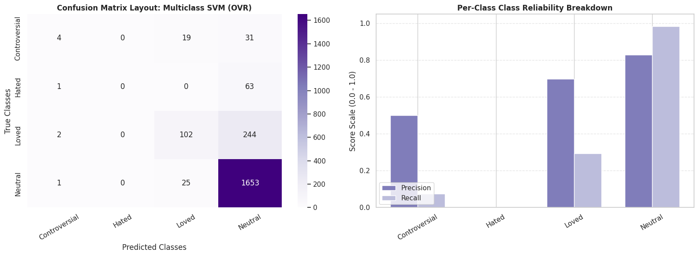
    


#### 📝 Model Analysis: Multiclass SVM (OVR)

* **Imbalance-Driven Performance Skew:** While overall accuracy reaches 82.00%, it is heavily inflated by the dominant `Neutral` class, masking a critically low Macro F1-Score of 0.3607.
* **Minority Class Collapse:** The model completely fails on minority categories, yielding a 0.0000 F1-Score for `Hated` and failing to recall `Controversial` items due to severe class imbalance.
* **Conservative Classification Boundaries:** High precision for `Loved` (0.6986) paired with poor recall (0.2931) indicates that the SVM boundaries are highly restrictive, misclassifying minority hits as `Neutral`.
* **Optimization Takeaway:** Standard radial basis function (RBF) mapping is overwhelmed by class dominance; resolving this requires applying balancing algorithms or using sample-weighted loss objectives.

### 3.2 Logistic Regression (OVR / Multinomial) 

We will formulate two distinct variations of Logistic Regression internally differing in cross-entropy mappings (`ovr` iteratively treating each as binary, `multinomial` mapping directly probabilistically across vectors).

#### Logistic Regression (OVR)


```python

# --- Logistic Regression (One-vs-Rest) --- Explicitly forced via wrapper
log_reg_ovr = OneVsRestClassifier(LogisticRegression(max_iter=2000, random_state=42))
log_reg_ovr.fit(X_train_scaled_mc, y_train_mc)
```


<style>#sk-container-id-16 {
  /* Definition of color scheme common for light and dark mode */
  --sklearn-color-text: #000;
  --sklearn-color-text-muted: #666;
  --sklearn-color-line: gray;
  /* Definition of color scheme for unfitted estimators */
  --sklearn-color-unfitted-level-0: #fff5e6;
  --sklearn-color-unfitted-level-1: #f6e4d2;
  --sklearn-color-unfitted-level-2: #ffe0b3;
  --sklearn-color-unfitted-level-3: chocolate;
  /* Definition of color scheme for fitted estimators */
  --sklearn-color-fitted-level-0: #f0f8ff;
  --sklearn-color-fitted-level-1: #d4ebff;
  --sklearn-color-fitted-level-2: #b3dbfd;
  --sklearn-color-fitted-level-3: cornflowerblue;
}

#sk-container-id-16.light {
  /* Specific color for light theme */
  --sklearn-color-text-on-default-background: black;
  --sklearn-color-background: white;
  --sklearn-color-border-box: black;
  --sklearn-color-icon: #696969;
}

#sk-container-id-16.dark {
  --sklearn-color-text-on-default-background: white;
  --sklearn-color-background: #111;
  --sklearn-color-border-box: white;
  --sklearn-color-icon: #878787;
}

#sk-container-id-16 {
  color: var(--sklearn-color-text);
}

#sk-container-id-16 pre {
  padding: 0;
}

#sk-container-id-16 input.sk-hidden--visually {
  border: 0;
  clip: rect(1px 1px 1px 1px);
  clip: rect(1px, 1px, 1px, 1px);
  height: 1px;
  margin: -1px;
  overflow: hidden;
  padding: 0;
  position: absolute;
  width: 1px;
}

#sk-container-id-16 div.sk-dashed-wrapped {
  border: 1px dashed var(--sklearn-color-line);
  margin: 0 0.4em 0.5em 0.4em;
  box-sizing: border-box;
  padding-bottom: 0.4em;
  background-color: var(--sklearn-color-background);
}

#sk-container-id-16 div.sk-container {
  /* jupyter's `normalize.less` sets `[hidden] { display: none; }`
     but bootstrap.min.css set `[hidden] { display: none !important; }`
     so we also need the `!important` here to be able to override the
     default hidden behavior on the sphinx rendered scikit-learn.org.
     See: https://github.com/scikit-learn/scikit-learn/issues/21755 */
  display: inline-block !important;
  position: relative;
}

#sk-container-id-16 div.sk-text-repr-fallback {
  display: none;
}

div.sk-parallel-item,
div.sk-serial,
div.sk-item {
  /* draw centered vertical line to link estimators */
  background-image: linear-gradient(var(--sklearn-color-text-on-default-background), var(--sklearn-color-text-on-default-background));
  background-size: 2px 100%;
  background-repeat: no-repeat;
  background-position: center center;
}

/* Parallel-specific style estimator block */

#sk-container-id-16 div.sk-parallel-item::after {
  content: "";
  width: 100%;
  border-bottom: 2px solid var(--sklearn-color-text-on-default-background);
  flex-grow: 1;
}

#sk-container-id-16 div.sk-parallel {
  display: flex;
  align-items: stretch;
  justify-content: center;
  background-color: var(--sklearn-color-background);
  position: relative;
}

#sk-container-id-16 div.sk-parallel-item {
  display: flex;
  flex-direction: column;
}

#sk-container-id-16 div.sk-parallel-item:first-child::after {
  align-self: flex-end;
  width: 50%;
}

#sk-container-id-16 div.sk-parallel-item:last-child::after {
  align-self: flex-start;
  width: 50%;
}

#sk-container-id-16 div.sk-parallel-item:only-child::after {
  width: 0;
}

/* Serial-specific style estimator block */

#sk-container-id-16 div.sk-serial {
  display: flex;
  flex-direction: column;
  align-items: center;
  background-color: var(--sklearn-color-background);
  padding-right: 1em;
  padding-left: 1em;
}


/* Toggleable style: style used for estimator/Pipeline/ColumnTransformer box that is
clickable and can be expanded/collapsed.
- Pipeline and ColumnTransformer use this feature and define the default style
- Estimators will overwrite some part of the style using the `sk-estimator` class
*/

/* Pipeline and ColumnTransformer style (default) */

#sk-container-id-16 div.sk-toggleable {
  /* Default theme specific background. It is overwritten whether we have a
  specific estimator or a Pipeline/ColumnTransformer */
  background-color: var(--sklearn-color-background);
}

/* Toggleable label */
#sk-container-id-16 label.sk-toggleable__label {
  cursor: pointer;
  display: flex;
  width: 100%;
  margin-bottom: 0;
  padding: 0.5em;
  box-sizing: border-box;
  text-align: center;
  align-items: center;
  justify-content: center;
  gap: 0.5em;
}

#sk-container-id-16 label.sk-toggleable__label .caption {
  font-size: 0.6rem;
  font-weight: lighter;
  color: var(--sklearn-color-text-muted);
}

#sk-container-id-16 label.sk-toggleable__label-arrow:before {
  /* Arrow on the left of the label */
  content: "▸";
  float: left;
  margin-right: 0.25em;
  color: var(--sklearn-color-icon);
}

#sk-container-id-16 label.sk-toggleable__label-arrow:hover:before {
  color: var(--sklearn-color-text);
}

/* Toggleable content - dropdown */

#sk-container-id-16 div.sk-toggleable__content {
  display: none;
  text-align: left;
  /* unfitted */
  background-color: var(--sklearn-color-unfitted-level-0);
}

#sk-container-id-16 div.sk-toggleable__content.fitted {
  /* fitted */
  background-color: var(--sklearn-color-fitted-level-0);
}

#sk-container-id-16 div.sk-toggleable__content pre {
  margin: 0.2em;
  border-radius: 0.25em;
  color: var(--sklearn-color-text);
  /* unfitted */
  background-color: var(--sklearn-color-unfitted-level-0);
}

#sk-container-id-16 div.sk-toggleable__content.fitted pre {
  /* unfitted */
  background-color: var(--sklearn-color-fitted-level-0);
}

#sk-container-id-16 input.sk-toggleable__control:checked~div.sk-toggleable__content {
  /* Expand drop-down */
  display: block;
  width: 100%;
  overflow: visible;
}

#sk-container-id-16 input.sk-toggleable__control:checked~label.sk-toggleable__label-arrow:before {
  content: "▾";
}

/* Pipeline/ColumnTransformer-specific style */

#sk-container-id-16 div.sk-label input.sk-toggleable__control:checked~label.sk-toggleable__label {
  color: var(--sklearn-color-text);
  background-color: var(--sklearn-color-unfitted-level-2);
}

#sk-container-id-16 div.sk-label.fitted input.sk-toggleable__control:checked~label.sk-toggleable__label {
  background-color: var(--sklearn-color-fitted-level-2);
}

/* Estimator-specific style */

/* Colorize estimator box */
#sk-container-id-16 div.sk-estimator input.sk-toggleable__control:checked~label.sk-toggleable__label {
  /* unfitted */
  background-color: var(--sklearn-color-unfitted-level-2);
}

#sk-container-id-16 div.sk-estimator.fitted input.sk-toggleable__control:checked~label.sk-toggleable__label {
  /* fitted */
  background-color: var(--sklearn-color-fitted-level-2);
}

#sk-container-id-16 div.sk-label label.sk-toggleable__label,
#sk-container-id-16 div.sk-label label {
  /* The background is the default theme color */
  color: var(--sklearn-color-text-on-default-background);
}

/* On hover, darken the color of the background */
#sk-container-id-16 div.sk-label:hover label.sk-toggleable__label {
  color: var(--sklearn-color-text);
  background-color: var(--sklearn-color-unfitted-level-2);
}

/* Label box, darken color on hover, fitted */
#sk-container-id-16 div.sk-label.fitted:hover label.sk-toggleable__label.fitted {
  color: var(--sklearn-color-text);
  background-color: var(--sklearn-color-fitted-level-2);
}

/* Estimator label */

#sk-container-id-16 div.sk-label label {
  font-family: monospace;
  font-weight: bold;
  line-height: 1.2em;
}

#sk-container-id-16 div.sk-label-container {
  text-align: center;
}

/* Estimator-specific */
#sk-container-id-16 div.sk-estimator {
  font-family: monospace;
  border: 1px dotted var(--sklearn-color-border-box);
  border-radius: 0.25em;
  box-sizing: border-box;
  margin-bottom: 0.5em;
  /* unfitted */
  background-color: var(--sklearn-color-unfitted-level-0);
}

#sk-container-id-16 div.sk-estimator.fitted {
  /* fitted */
  background-color: var(--sklearn-color-fitted-level-0);
}

/* on hover */
#sk-container-id-16 div.sk-estimator:hover {
  /* unfitted */
  background-color: var(--sklearn-color-unfitted-level-2);
}

#sk-container-id-16 div.sk-estimator.fitted:hover {
  /* fitted */
  background-color: var(--sklearn-color-fitted-level-2);
}

/* Specification for estimator info (e.g. "i" and "?") */

/* Common style for "i" and "?" */

.sk-estimator-doc-link,
a:link.sk-estimator-doc-link,
a:visited.sk-estimator-doc-link {
  float: right;
  font-size: smaller;
  line-height: 1em;
  font-family: monospace;
  background-color: var(--sklearn-color-unfitted-level-0);
  border-radius: 1em;
  height: 1em;
  width: 1em;
  text-decoration: none !important;
  margin-left: 0.5em;
  text-align: center;
  /* unfitted */
  border: var(--sklearn-color-unfitted-level-3) 1pt solid;
  color: var(--sklearn-color-unfitted-level-3);
}

.sk-estimator-doc-link.fitted,
a:link.sk-estimator-doc-link.fitted,
a:visited.sk-estimator-doc-link.fitted {
  /* fitted */
  background-color: var(--sklearn-color-fitted-level-0);
  border: var(--sklearn-color-fitted-level-3) 1pt solid;
  color: var(--sklearn-color-fitted-level-3);
}

/* On hover */
div.sk-estimator:hover .sk-estimator-doc-link:hover,
.sk-estimator-doc-link:hover,
div.sk-label-container:hover .sk-estimator-doc-link:hover,
.sk-estimator-doc-link:hover {
  /* unfitted */
  background-color: var(--sklearn-color-unfitted-level-3);
  border: var(--sklearn-color-fitted-level-0) 1pt solid;
  color: var(--sklearn-color-unfitted-level-0);
  text-decoration: none;
}

div.sk-estimator.fitted:hover .sk-estimator-doc-link.fitted:hover,
.sk-estimator-doc-link.fitted:hover,
div.sk-label-container:hover .sk-estimator-doc-link.fitted:hover,
.sk-estimator-doc-link.fitted:hover {
  /* fitted */
  background-color: var(--sklearn-color-fitted-level-3);
  border: var(--sklearn-color-fitted-level-0) 1pt solid;
  color: var(--sklearn-color-fitted-level-0);
  text-decoration: none;
}

/* Span, style for the box shown on hovering the info icon */
.sk-estimator-doc-link span {
  display: none;
  z-index: 9999;
  position: relative;
  font-weight: normal;
  right: .2ex;
  padding: .5ex;
  margin: .5ex;
  width: min-content;
  min-width: 20ex;
  max-width: 50ex;
  color: var(--sklearn-color-text);
  box-shadow: 2pt 2pt 4pt #999;
  /* unfitted */
  background: var(--sklearn-color-unfitted-level-0);
  border: .5pt solid var(--sklearn-color-unfitted-level-3);
}

.sk-estimator-doc-link.fitted span {
  /* fitted */
  background: var(--sklearn-color-fitted-level-0);
  border: var(--sklearn-color-fitted-level-3);
}

.sk-estimator-doc-link:hover span {
  display: block;
}

/* "?"-specific style due to the `<a>` HTML tag */

#sk-container-id-16 a.estimator_doc_link {
  float: right;
  font-size: 1rem;
  line-height: 1em;
  font-family: monospace;
  background-color: var(--sklearn-color-unfitted-level-0);
  border-radius: 1rem;
  height: 1rem;
  width: 1rem;
  text-decoration: none;
  /* unfitted */
  color: var(--sklearn-color-unfitted-level-1);
  border: var(--sklearn-color-unfitted-level-1) 1pt solid;
}

#sk-container-id-16 a.estimator_doc_link.fitted {
  /* fitted */
  background-color: var(--sklearn-color-fitted-level-0);
  border: var(--sklearn-color-fitted-level-1) 1pt solid;
  color: var(--sklearn-color-fitted-level-1);
}

/* On hover */
#sk-container-id-16 a.estimator_doc_link:hover {
  /* unfitted */
  background-color: var(--sklearn-color-unfitted-level-3);
  color: var(--sklearn-color-background);
  text-decoration: none;
}

#sk-container-id-16 a.estimator_doc_link.fitted:hover {
  /* fitted */
  background-color: var(--sklearn-color-fitted-level-3);
}

.estimator-table {
    font-family: monospace;
}

.estimator-table summary {
    padding: .5rem;
    cursor: pointer;
}

.estimator-table summary::marker {
    font-size: 0.7rem;
}

.estimator-table details[open] {
    padding-left: 0.1rem;
    padding-right: 0.1rem;
    padding-bottom: 0.3rem;
}

.estimator-table .parameters-table {
    margin-left: auto !important;
    margin-right: auto !important;
    margin-top: 0;
}

.estimator-table .parameters-table tr:nth-child(odd) {
    background-color: #fff;
}

.estimator-table .parameters-table tr:nth-child(even) {
    background-color: #f6f6f6;
}

.estimator-table .parameters-table tr:hover {
    background-color: #e0e0e0;
}

.estimator-table table td {
    border: 1px solid rgba(106, 105, 104, 0.232);
}

/*
    `table td`is set in notebook with right text-align.
    We need to overwrite it.
*/
.estimator-table table td.param {
    text-align: left;
    position: relative;
    padding: 0;
}

.user-set td {
    color:rgb(255, 94, 0);
    text-align: left !important;
}

.user-set td.value {
    color:rgb(255, 94, 0);
    background-color: transparent;
}

.default td {
    color: black;
    text-align: left !important;
}

.user-set td i,
.default td i {
    color: black;
}

/*
    Styles for parameter documentation links
    We need styling for visited so jupyter doesn't overwrite it
*/
a.param-doc-link,
a.param-doc-link:link,
a.param-doc-link:visited {
    text-decoration: underline dashed;
    text-underline-offset: .3em;
    color: inherit;
    display: block;
    padding: .5em;
}

/* "hack" to make the entire area of the cell containing the link clickable */
a.param-doc-link::before {
    position: absolute;
    content: "";
    inset: 0;
}

.param-doc-description {
    display: none;
    position: absolute;
    z-index: 9999;
    left: 0;
    padding: .5ex;
    margin-left: 1.5em;
    color: var(--sklearn-color-text);
    box-shadow: .3em .3em .4em #999;
    width: max-content;
    text-align: left;
    max-height: 10em;
    overflow-y: auto;

    /* unfitted */
    background: var(--sklearn-color-unfitted-level-0);
    border: thin solid var(--sklearn-color-unfitted-level-3);
}

/* Fitted state for parameter tooltips */
.fitted .param-doc-description {
    /* fitted */
    background: var(--sklearn-color-fitted-level-0);
    border: thin solid var(--sklearn-color-fitted-level-3);
}

.param-doc-link:hover .param-doc-description {
    display: block;
}

.copy-paste-icon {
    background-image: url();
    background-repeat: no-repeat;
    background-size: 14px 14px;
    background-position: 0;
    display: inline-block;
    width: 14px;
    height: 14px;
    cursor: pointer;
}
</style><body><div id="sk-container-id-16" class="sk-top-container"><div class="sk-text-repr-fallback"><pre>OneVsRestClassifier(estimator=LogisticRegression(max_iter=2000,
                                                 random_state=42))</pre><b>In a Jupyter environment, please rerun this cell to show the HTML representation or trust the notebook. <br />On GitHub, the HTML representation is unable to render, please try loading this page with nbviewer.org.</b></div><div class="sk-container" hidden><div class="sk-item sk-dashed-wrapped"><div class="sk-label-container"><div class="sk-label fitted sk-toggleable"><input class="sk-toggleable__control sk-hidden--visually" id="sk-estimator-id-24" type="checkbox" ><label for="sk-estimator-id-24" class="sk-toggleable__label fitted sk-toggleable__label-arrow"><div><div>OneVsRestClassifier</div></div><div><a class="sk-estimator-doc-link fitted" rel="noreferrer" target="_blank" href="https://scikit-learn.org/1.8/modules/generated/sklearn.multiclass.OneVsRestClassifier.html">?<span>Documentation for OneVsRestClassifier</span></a><span class="sk-estimator-doc-link fitted">i<span>Fitted</span></span></div></label><div class="sk-toggleable__content fitted" data-param-prefix="">
        <div class="estimator-table">
            <details>
                <summary>Parameters</summary>
                <table class="parameters-table">
                  <tbody>

        <tr class="user-set">
            <td><i class="copy-paste-icon"
                 onclick="copyToClipboard('estimator',
                          this.parentElement.nextElementSibling)"
            ></i></td>
            <td class="param">
        <a class="param-doc-link"
            rel="noreferrer" target="_blank" href="https://scikit-learn.org/1.8/modules/generated/sklearn.multiclass.OneVsRestClassifier.html#:~:text=estimator,-estimator%20object">
            estimator
            <span class="param-doc-description">estimator: estimator object<br><br>A regressor or a classifier that implements :term:`fit`.<br>When a classifier is passed, :term:`decision_function` will be used<br>in priority and it will fallback to :term:`predict_proba` if it is not<br>available.<br>When a regressor is passed, :term:`predict` is used.</span>
        </a>
    </td>
            <td class="value">LogisticRegre...ndom_state=42)</td>
        </tr>


        <tr class="default">
            <td><i class="copy-paste-icon"
                 onclick="copyToClipboard('n_jobs',
                          this.parentElement.nextElementSibling)"
            ></i></td>
            <td class="param">
        <a class="param-doc-link"
            rel="noreferrer" target="_blank" href="https://scikit-learn.org/1.8/modules/generated/sklearn.multiclass.OneVsRestClassifier.html#:~:text=n_jobs,-int%2C%20default%3DNone">
            n_jobs
            <span class="param-doc-description">n_jobs: int, default=None<br><br>The number of jobs to use for the computation: the `n_classes`<br>one-vs-rest problems are computed in parallel.<br><br>``None`` means 1 unless in a :obj:`joblib.parallel_backend` context.<br>``-1`` means using all processors. See :term:`Glossary <n_jobs>`<br>for more details.<br><br>.. versionchanged:: 0.20<br>   `n_jobs` default changed from 1 to None</span>
        </a>
    </td>
            <td class="value">None</td>
        </tr>


        <tr class="default">
            <td><i class="copy-paste-icon"
                 onclick="copyToClipboard('verbose',
                          this.parentElement.nextElementSibling)"
            ></i></td>
            <td class="param">
        <a class="param-doc-link"
            rel="noreferrer" target="_blank" href="https://scikit-learn.org/1.8/modules/generated/sklearn.multiclass.OneVsRestClassifier.html#:~:text=verbose,-int%2C%20default%3D0">
            verbose
            <span class="param-doc-description">verbose: int, default=0<br><br>The verbosity level, if non zero, progress messages are printed.<br>Below 50, the output is sent to stderr. Otherwise, the output is sent<br>to stdout. The frequency of the messages increases with the verbosity<br>level, reporting all iterations at 10. See :class:`joblib.Parallel` for<br>more details.<br><br>.. versionadded:: 1.1</span>
        </a>
    </td>
            <td class="value">0</td>
        </tr>

                  </tbody>
                </table>
            </details>
        </div>
    </div></div></div><div class="sk-parallel"><div class="sk-parallel-item"><div class="sk-item"><div class="sk-label-container"><div class="sk-label fitted sk-toggleable"><input class="sk-toggleable__control sk-hidden--visually" id="sk-estimator-id-25" type="checkbox" ><label for="sk-estimator-id-25" class="sk-toggleable__label fitted sk-toggleable__label-arrow"><div><div>estimator: LogisticRegression</div></div></label><div class="sk-toggleable__content fitted" data-param-prefix="estimator__"><pre>LogisticRegression(max_iter=2000, random_state=42)</pre></div></div></div><div class="sk-serial"><div class="sk-item"><div class="sk-estimator fitted sk-toggleable"><input class="sk-toggleable__control sk-hidden--visually" id="sk-estimator-id-26" type="checkbox" ><label for="sk-estimator-id-26" class="sk-toggleable__label fitted sk-toggleable__label-arrow"><div><div>LogisticRegression</div></div><div><a class="sk-estimator-doc-link fitted" rel="noreferrer" target="_blank" href="https://scikit-learn.org/1.8/modules/generated/sklearn.linear_model.LogisticRegression.html">?<span>Documentation for LogisticRegression</span></a></div></label><div class="sk-toggleable__content fitted" data-param-prefix="estimator__">
        <div class="estimator-table">
            <details>
                <summary>Parameters</summary>
                <table class="parameters-table">
                  <tbody>

        <tr class="default">
            <td><i class="copy-paste-icon"
                 onclick="copyToClipboard('penalty',
                          this.parentElement.nextElementSibling)"
            ></i></td>
            <td class="param">
        <a class="param-doc-link"
            rel="noreferrer" target="_blank" href="https://scikit-learn.org/1.8/modules/generated/sklearn.linear_model.LogisticRegression.html#:~:text=penalty,-%7B%27l1%27%2C%20%27l2%27%2C%20%27elasticnet%27%2C%20None%7D%2C%20default%3D%27l2%27">
            penalty
            <span class="param-doc-description">penalty: {'l1', 'l2', 'elasticnet', None}, default='l2'<br><br>Specify the norm of the penalty:<br><br>- `None`: no penalty is added;<br>- `'l2'`: add a L2 penalty term and it is the default choice;<br>- `'l1'`: add a L1 penalty term;<br>- `'elasticnet'`: both L1 and L2 penalty terms are added.<br><br>.. warning::<br>   Some penalties may not work with some solvers. See the parameter<br>   `solver` below, to know the compatibility between the penalty and<br>   solver.<br><br>.. versionadded:: 0.19<br>   l1 penalty with SAGA solver (allowing 'multinomial' + L1)<br><br>.. deprecated:: 1.8<br>   `penalty` was deprecated in version 1.8 and will be removed in 1.10.<br>   Use `l1_ratio` instead. `l1_ratio=0` for `penalty='l2'`, `l1_ratio=1` for<br>   `penalty='l1'` and `l1_ratio` set to any float between 0 and 1 for<br>   `'penalty='elasticnet'`.</span>
        </a>
    </td>
            <td class="value">&#x27;deprecated&#x27;</td>
        </tr>


        <tr class="default">
            <td><i class="copy-paste-icon"
                 onclick="copyToClipboard('C',
                          this.parentElement.nextElementSibling)"
            ></i></td>
            <td class="param">
        <a class="param-doc-link"
            rel="noreferrer" target="_blank" href="https://scikit-learn.org/1.8/modules/generated/sklearn.linear_model.LogisticRegression.html#:~:text=C,-float%2C%20default%3D1.0">
            C
            <span class="param-doc-description">C: float, default=1.0<br><br>Inverse of regularization strength; must be a positive float.<br>Like in support vector machines, smaller values specify stronger<br>regularization. `C=np.inf` results in unpenalized logistic regression.<br>For a visual example on the effect of tuning the `C` parameter<br>with an L1 penalty, see:<br>:ref:`sphx_glr_auto_examples_linear_model_plot_logistic_path.py`.</span>
        </a>
    </td>
            <td class="value">1.0</td>
        </tr>


        <tr class="default">
            <td><i class="copy-paste-icon"
                 onclick="copyToClipboard('l1_ratio',
                          this.parentElement.nextElementSibling)"
            ></i></td>
            <td class="param">
        <a class="param-doc-link"
            rel="noreferrer" target="_blank" href="https://scikit-learn.org/1.8/modules/generated/sklearn.linear_model.LogisticRegression.html#:~:text=l1_ratio,-float%2C%20default%3D0.0">
            l1_ratio
            <span class="param-doc-description">l1_ratio: float, default=0.0<br><br>The Elastic-Net mixing parameter, with `0 <= l1_ratio <= 1`. Setting<br>`l1_ratio=1` gives a pure L1-penalty, setting `l1_ratio=0` a pure L2-penalty.<br>Any value between 0 and 1 gives an Elastic-Net penalty of the form<br>`l1_ratio * L1 + (1 - l1_ratio) * L2`.<br><br>.. warning::<br>   Certain values of `l1_ratio`, i.e. some penalties, may not work with some<br>   solvers. See the parameter `solver` below, to know the compatibility between<br>   the penalty and solver.<br><br>.. versionchanged:: 1.8<br>    Default value changed from None to 0.0.<br><br>.. deprecated:: 1.8<br>    `None` is deprecated and will be removed in version 1.10. Always use<br>    `l1_ratio` to specify the penalty type.</span>
        </a>
    </td>
            <td class="value">0.0</td>
        </tr>


        <tr class="default">
            <td><i class="copy-paste-icon"
                 onclick="copyToClipboard('dual',
                          this.parentElement.nextElementSibling)"
            ></i></td>
            <td class="param">
        <a class="param-doc-link"
            rel="noreferrer" target="_blank" href="https://scikit-learn.org/1.8/modules/generated/sklearn.linear_model.LogisticRegression.html#:~:text=dual,-bool%2C%20default%3DFalse">
            dual
            <span class="param-doc-description">dual: bool, default=False<br><br>Dual (constrained) or primal (regularized, see also<br>:ref:`this equation <regularized-logistic-loss>`) formulation. Dual formulation<br>is only implemented for l2 penalty with liblinear solver. Prefer `dual=False`<br>when n_samples > n_features.</span>
        </a>
    </td>
            <td class="value">False</td>
        </tr>


        <tr class="default">
            <td><i class="copy-paste-icon"
                 onclick="copyToClipboard('tol',
                          this.parentElement.nextElementSibling)"
            ></i></td>
            <td class="param">
        <a class="param-doc-link"
            rel="noreferrer" target="_blank" href="https://scikit-learn.org/1.8/modules/generated/sklearn.linear_model.LogisticRegression.html#:~:text=tol,-float%2C%20default%3D1e-4">
            tol
            <span class="param-doc-description">tol: float, default=1e-4<br><br>Tolerance for stopping criteria.</span>
        </a>
    </td>
            <td class="value">0.0001</td>
        </tr>


        <tr class="default">
            <td><i class="copy-paste-icon"
                 onclick="copyToClipboard('fit_intercept',
                          this.parentElement.nextElementSibling)"
            ></i></td>
            <td class="param">
        <a class="param-doc-link"
            rel="noreferrer" target="_blank" href="https://scikit-learn.org/1.8/modules/generated/sklearn.linear_model.LogisticRegression.html#:~:text=fit_intercept,-bool%2C%20default%3DTrue">
            fit_intercept
            <span class="param-doc-description">fit_intercept: bool, default=True<br><br>Specifies if a constant (a.k.a. bias or intercept) should be<br>added to the decision function.</span>
        </a>
    </td>
            <td class="value">True</td>
        </tr>


        <tr class="default">
            <td><i class="copy-paste-icon"
                 onclick="copyToClipboard('intercept_scaling',
                          this.parentElement.nextElementSibling)"
            ></i></td>
            <td class="param">
        <a class="param-doc-link"
            rel="noreferrer" target="_blank" href="https://scikit-learn.org/1.8/modules/generated/sklearn.linear_model.LogisticRegression.html#:~:text=intercept_scaling,-float%2C%20default%3D1">
            intercept_scaling
            <span class="param-doc-description">intercept_scaling: float, default=1<br><br>Useful only when the solver `liblinear` is used<br>and `self.fit_intercept` is set to `True`. In this case, `x` becomes<br>`[x, self.intercept_scaling]`,<br>i.e. a "synthetic" feature with constant value equal to<br>`intercept_scaling` is appended to the instance vector.<br>The intercept becomes<br>``intercept_scaling * synthetic_feature_weight``.<br><br>.. note::<br>    The synthetic feature weight is subject to L1 or L2<br>    regularization as all other features.<br>    To lessen the effect of regularization on synthetic feature weight<br>    (and therefore on the intercept) `intercept_scaling` has to be increased.</span>
        </a>
    </td>
            <td class="value">1</td>
        </tr>


        <tr class="default">
            <td><i class="copy-paste-icon"
                 onclick="copyToClipboard('class_weight',
                          this.parentElement.nextElementSibling)"
            ></i></td>
            <td class="param">
        <a class="param-doc-link"
            rel="noreferrer" target="_blank" href="https://scikit-learn.org/1.8/modules/generated/sklearn.linear_model.LogisticRegression.html#:~:text=class_weight,-dict%20or%20%27balanced%27%2C%20default%3DNone">
            class_weight
            <span class="param-doc-description">class_weight: dict or 'balanced', default=None<br><br>Weights associated with classes in the form ``{class_label: weight}``.<br>If not given, all classes are supposed to have weight one.<br><br>The "balanced" mode uses the values of y to automatically adjust<br>weights inversely proportional to class frequencies in the input data<br>as ``n_samples / (n_classes * np.bincount(y))``.<br><br>Note that these weights will be multiplied with sample_weight (passed<br>through the fit method) if sample_weight is specified.<br><br>.. versionadded:: 0.17<br>   *class_weight='balanced'*</span>
        </a>
    </td>
            <td class="value">None</td>
        </tr>


        <tr class="user-set">
            <td><i class="copy-paste-icon"
                 onclick="copyToClipboard('random_state',
                          this.parentElement.nextElementSibling)"
            ></i></td>
            <td class="param">
        <a class="param-doc-link"
            rel="noreferrer" target="_blank" href="https://scikit-learn.org/1.8/modules/generated/sklearn.linear_model.LogisticRegression.html#:~:text=random_state,-int%2C%20RandomState%20instance%2C%20default%3DNone">
            random_state
            <span class="param-doc-description">random_state: int, RandomState instance, default=None<br><br>Used when ``solver`` == 'sag', 'saga' or 'liblinear' to shuffle the<br>data. See :term:`Glossary <random_state>` for details.</span>
        </a>
    </td>
            <td class="value">42</td>
        </tr>


        <tr class="default">
            <td><i class="copy-paste-icon"
                 onclick="copyToClipboard('solver',
                          this.parentElement.nextElementSibling)"
            ></i></td>
            <td class="param">
        <a class="param-doc-link"
            rel="noreferrer" target="_blank" href="https://scikit-learn.org/1.8/modules/generated/sklearn.linear_model.LogisticRegression.html#:~:text=solver,-%7B%27lbfgs%27%2C%20%27liblinear%27%2C%20%27newton-cg%27%2C%20%27newton-cholesky%27%2C%20%27sag%27%2C%20%27saga%27%7D%2C%20%20%20%20%20%20%20%20%20%20%20%20%20default%3D%27lbfgs%27">
            solver
            <span class="param-doc-description">solver: {'lbfgs', 'liblinear', 'newton-cg', 'newton-cholesky', 'sag', 'saga'},             default='lbfgs'<br><br>Algorithm to use in the optimization problem. Default is 'lbfgs'.<br>To choose a solver, you might want to consider the following aspects:<br><br>- 'lbfgs' is a good default solver because it works reasonably well for a wide<br>  class of problems.<br>- For :term:`multiclass` problems (`n_classes >= 3`), all solvers except<br>  'liblinear' minimize the full multinomial loss, 'liblinear' will raise an<br>  error.<br>- 'newton-cholesky' is a good choice for<br>  `n_samples` >> `n_features * n_classes`, especially with one-hot encoded<br>  categorical features with rare categories. Be aware that the memory usage<br>  of this solver has a quadratic dependency on `n_features * n_classes`<br>  because it explicitly computes the full Hessian matrix.<br>- For small datasets, 'liblinear' is a good choice, whereas 'sag'<br>  and 'saga' are faster for large ones;<br>- 'liblinear' can only handle binary classification by default. To apply a<br>  one-versus-rest scheme for the multiclass setting one can wrap it with the<br>  :class:`~sklearn.multiclass.OneVsRestClassifier`.<br><br>.. warning::<br>   The choice of the algorithm depends on the penalty chosen (`l1_ratio=0`<br>   for L2-penalty, `l1_ratio=1` for L1-penalty and `0 < l1_ratio < 1` for<br>   Elastic-Net) and on (multinomial) multiclass support:<br><br>   ================= ======================== ======================<br>   solver            l1_ratio                 multinomial multiclass<br>   ================= ======================== ======================<br>   'lbfgs'           l1_ratio=0               yes<br>   'liblinear'       l1_ratio=1 or l1_ratio=0 no<br>   'newton-cg'       l1_ratio=0               yes<br>   'newton-cholesky' l1_ratio=0               yes<br>   'sag'             l1_ratio=0               yes<br>   'saga'            0<=l1_ratio<=1           yes<br>   ================= ======================== ======================<br><br>.. note::<br>   'sag' and 'saga' fast convergence is only guaranteed on features<br>   with approximately the same scale. You can preprocess the data with<br>   a scaler from :mod:`sklearn.preprocessing`.<br><br>.. seealso::<br>   Refer to the :ref:`User Guide <Logistic_regression>` for more<br>   information regarding :class:`LogisticRegression` and more specifically the<br>   :ref:`Table <logistic_regression_solvers>`<br>   summarizing solver/penalty supports.<br><br>.. versionadded:: 0.17<br>   Stochastic Average Gradient (SAG) descent solver. Multinomial support in<br>   version 0.18.<br>.. versionadded:: 0.19<br>   SAGA solver.<br>.. versionchanged:: 0.22<br>   The default solver changed from 'liblinear' to 'lbfgs' in 0.22.<br>.. versionadded:: 1.2<br>   newton-cholesky solver. Multinomial support in version 1.6.</span>
        </a>
    </td>
            <td class="value">&#x27;lbfgs&#x27;</td>
        </tr>


        <tr class="user-set">
            <td><i class="copy-paste-icon"
                 onclick="copyToClipboard('max_iter',
                          this.parentElement.nextElementSibling)"
            ></i></td>
            <td class="param">
        <a class="param-doc-link"
            rel="noreferrer" target="_blank" href="https://scikit-learn.org/1.8/modules/generated/sklearn.linear_model.LogisticRegression.html#:~:text=max_iter,-int%2C%20default%3D100">
            max_iter
            <span class="param-doc-description">max_iter: int, default=100<br><br>Maximum number of iterations taken for the solvers to converge.</span>
        </a>
    </td>
            <td class="value">2000</td>
        </tr>


        <tr class="default">
            <td><i class="copy-paste-icon"
                 onclick="copyToClipboard('verbose',
                          this.parentElement.nextElementSibling)"
            ></i></td>
            <td class="param">
        <a class="param-doc-link"
            rel="noreferrer" target="_blank" href="https://scikit-learn.org/1.8/modules/generated/sklearn.linear_model.LogisticRegression.html#:~:text=verbose,-int%2C%20default%3D0">
            verbose
            <span class="param-doc-description">verbose: int, default=0<br><br>For the liblinear and lbfgs solvers set verbose to any positive<br>number for verbosity.</span>
        </a>
    </td>
            <td class="value">0</td>
        </tr>


        <tr class="default">
            <td><i class="copy-paste-icon"
                 onclick="copyToClipboard('warm_start',
                          this.parentElement.nextElementSibling)"
            ></i></td>
            <td class="param">
        <a class="param-doc-link"
            rel="noreferrer" target="_blank" href="https://scikit-learn.org/1.8/modules/generated/sklearn.linear_model.LogisticRegression.html#:~:text=warm_start,-bool%2C%20default%3DFalse">
            warm_start
            <span class="param-doc-description">warm_start: bool, default=False<br><br>When set to True, reuse the solution of the previous call to fit as<br>initialization, otherwise, just erase the previous solution.<br>Useless for liblinear solver. See :term:`the Glossary <warm_start>`.<br><br>.. versionadded:: 0.17<br>   *warm_start* to support *lbfgs*, *newton-cg*, *sag*, *saga* solvers.</span>
        </a>
    </td>
            <td class="value">False</td>
        </tr>


        <tr class="default">
            <td><i class="copy-paste-icon"
                 onclick="copyToClipboard('n_jobs',
                          this.parentElement.nextElementSibling)"
            ></i></td>
            <td class="param">
        <a class="param-doc-link"
            rel="noreferrer" target="_blank" href="https://scikit-learn.org/1.8/modules/generated/sklearn.linear_model.LogisticRegression.html#:~:text=n_jobs,-int%2C%20default%3DNone">
            n_jobs
            <span class="param-doc-description">n_jobs: int, default=None<br><br>Does not have any effect.<br><br>.. deprecated:: 1.8<br>   `n_jobs` is deprecated in version 1.8 and will be removed in 1.10.</span>
        </a>
    </td>
            <td class="value">None</td>
        </tr>

                  </tbody>
                </table>
            </details>
        </div>
    </div></div></div></div></div></div></div></div></div></div><script>function copyToClipboard(text, element) {
    // Get the parameter prefix from the closest toggleable content
    const toggleableContent = element.closest('.sk-toggleable__content');
    const paramPrefix = toggleableContent ? toggleableContent.dataset.paramPrefix : '';
    const fullParamName = paramPrefix ? `${paramPrefix}${text}` : text;

    const originalStyle = element.style;
    const computedStyle = window.getComputedStyle(element);
    const originalWidth = computedStyle.width;
    const originalHTML = element.innerHTML.replace('Copied!', '');

    navigator.clipboard.writeText(fullParamName)
        .then(() => {
            element.style.width = originalWidth;
            element.style.color = 'green';
            element.innerHTML = "Copied!";

            setTimeout(() => {
                element.innerHTML = originalHTML;
                element.style = originalStyle;
            }, 2000);
        })
        .catch(err => {
            console.error('Failed to copy:', err);
            element.style.color = 'red';
            element.innerHTML = "Failed!";
            setTimeout(() => {
                element.innerHTML = originalHTML;
                element.style = originalStyle;
            }, 2000);
        });
    return false;
}

document.querySelectorAll('.copy-paste-icon').forEach(function(element) {
    const toggleableContent = element.closest('.sk-toggleable__content');
    const paramPrefix = toggleableContent ? toggleableContent.dataset.paramPrefix : '';
    const paramName = element.parentElement.nextElementSibling
        .textContent.trim().split(' ')[0];
    const fullParamName = paramPrefix ? `${paramPrefix}${paramName}` : paramName;

    element.setAttribute('title', fullParamName);
});


/**
 * Adapted from Skrub
 * https://github.com/skrub-data/skrub/blob/403466d1d5d4dc76a7ef569b3f8228db59a31dc3/skrub/_reporting/_data/templates/report.js#L789
 * @returns "light" or "dark"
 */
function detectTheme(element) {
    const body = document.querySelector('body');

    // Check VSCode theme
    const themeKindAttr = body.getAttribute('data-vscode-theme-kind');
    const themeNameAttr = body.getAttribute('data-vscode-theme-name');

    if (themeKindAttr && themeNameAttr) {
        const themeKind = themeKindAttr.toLowerCase();
        const themeName = themeNameAttr.toLowerCase();

        if (themeKind.includes("dark") || themeName.includes("dark")) {
            return "dark";
        }
        if (themeKind.includes("light") || themeName.includes("light")) {
            return "light";
        }
    }

    // Check Jupyter theme
    if (body.getAttribute('data-jp-theme-light') === 'false') {
        return 'dark';
    } else if (body.getAttribute('data-jp-theme-light') === 'true') {
        return 'light';
    }

    // Guess based on a parent element's color
    const color = window.getComputedStyle(element.parentNode, null).getPropertyValue('color');
    const match = color.match(/^rgb\s*\(\s*(\d+)\s*,\s*(\d+)\s*,\s*(\d+)\s*\)\s*$/i);
    if (match) {
        const [r, g, b] = [
            parseFloat(match[1]),
            parseFloat(match[2]),
            parseFloat(match[3])
        ];

        // https://en.wikipedia.org/wiki/HSL_and_HSV#Lightness
        const luma = 0.299 * r + 0.587 * g + 0.114 * b;

        if (luma > 180) {
            // If the text is very bright we have a dark theme
            return 'dark';
        }
        if (luma < 75) {
            // If the text is very dark we have a light theme
            return 'light';
        }
        // Otherwise fall back to the next heuristic.
    }

    // Fallback to system preference
    return window.matchMedia('(prefers-color-scheme: dark)').matches ? 'dark' : 'light';
}


function forceTheme(elementId) {
    const estimatorElement = document.querySelector(`#${elementId}`);
    if (estimatorElement === null) {
        console.error(`Element with id ${elementId} not found.`);
    } else {
        const theme = detectTheme(estimatorElement);
        estimatorElement.classList.add(theme);
    }
}

forceTheme('sk-container-id-16');</script></body>


```python
evaluate_multiclass("Logistic Regression (OVR)", y_test_mc, log_reg_ovr.predict(X_test_scaled_mc), log_reg_ovr.predict_proba(X_test_scaled_mc), labels=mc_labels)
```

    
    ============================================================
    🌟 Multiclass Evaluation: Logistic Regression (OVR)
    ============================================================
    🔸 Accuracy:            0.8172
    🔸 F1-Score (Macro):    0.3644
    🔸 F1-Score (Micro):    0.8172
    🔸 F1-Score (Weighted): 0.7743
    🔸 Log Loss:            0.5359
    
    📋 Detailed Per-Class Report:


<style type="text/css">
#T_aead3_row0_col0, #T_aead3_row0_col1, #T_aead3_row0_col2 {
  background-color: #fcfbfd;
  color: #000000;
}
#T_aead3_row1_col0 {
  background-color: #efedf5;
  color: #000000;
}
#T_aead3_row1_col1 {
  background-color: #f6f4f9;
  color: #000000;
}
#T_aead3_row1_col2 {
  background-color: #f1f0f6;
  color: #000000;
}
#T_aead3_row2_col0 {
  background-color: #5d3897;
  color: #f1f1f1;
}
#T_aead3_row2_col1 {
  background-color: #d5d5e9;
  color: #000000;
}
#T_aead3_row2_col2 {
  background-color: #b0afd4;
  color: #000000;
}
#T_aead3_row3_col0, #T_aead3_row3_col1, #T_aead3_row3_col2 {
  background-color: #3f007d;
  color: #f1f1f1;
}
</style>
<table id="T_aead3">
  <thead>
    <tr>
      <th class="blank level0" >&nbsp;</th>
      <th id="T_aead3_level0_col0" class="col_heading level0 col0" >Precision</th>
      <th id="T_aead3_level0_col1" class="col_heading level0 col1" >Recall</th>
      <th id="T_aead3_level0_col2" class="col_heading level0 col2" >F1-Score</th>
      <th id="T_aead3_level0_col3" class="col_heading level0 col3" >Support</th>
    </tr>
  </thead>
  <tbody>
    <tr>
      <th id="T_aead3_level0_row0" class="row_heading level0 row0" >Controversial</th>
      <td id="T_aead3_row0_col0" class="data row0 col0" >0.2000</td>
      <td id="T_aead3_row0_col1" class="data row0 col1" >0.0185</td>
      <td id="T_aead3_row0_col2" class="data row0 col2" >0.0339</td>
      <td id="T_aead3_row0_col3" class="data row0 col3" >54</td>
    </tr>
    <tr>
      <th id="T_aead3_level0_row1" class="row_heading level0 row1" >Hated</th>
      <td id="T_aead3_row1_col0" class="data row1 col0" >0.2778</td>
      <td id="T_aead3_row1_col1" class="data row1 col1" >0.0781</td>
      <td id="T_aead3_row1_col2" class="data row1 col2" >0.1220</td>
      <td id="T_aead3_row1_col3" class="data row1 col3" >64</td>
    </tr>
    <tr>
      <th id="T_aead3_level0_row2" class="row_heading level0 row2" >Loved</th>
      <td id="T_aead3_row2_col0" class="data row2 col0" >0.7185</td>
      <td id="T_aead3_row2_col1" class="data row2 col1" >0.2787</td>
      <td id="T_aead3_row2_col2" class="data row2 col2" >0.4017</td>
      <td id="T_aead3_row2_col3" class="data row2 col3" >348</td>
    </tr>
    <tr>
      <th id="T_aead3_level0_row3" class="row_heading level0 row3" >Neutral</th>
      <td id="T_aead3_row3_col0" class="data row3 col0" >0.8304</td>
      <td id="T_aead3_row3_col1" class="data row3 col1" >0.9827</td>
      <td id="T_aead3_row3_col2" class="data row3 col2" >0.9002</td>
      <td id="T_aead3_row3_col3" class="data row3 col3" >1,679</td>
    </tr>
  </tbody>
</table>


    
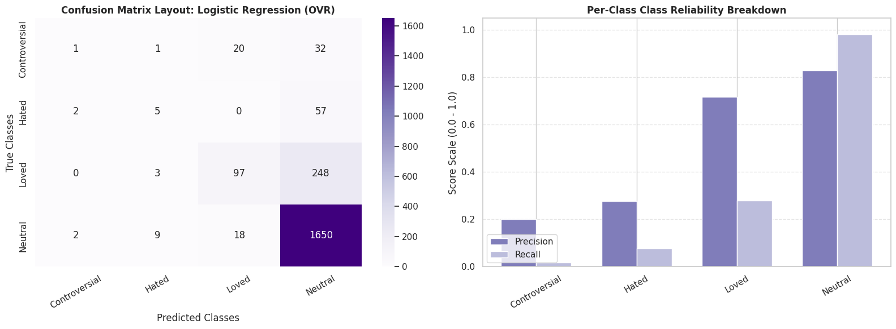
    


##### 📝 Model Analysis: Logistic Regression (OVR)

* **Imbalance Bias Persistence:** Similar to SVM, an overall accuracy of 81.72% is heavily skewed by the `Neutral` class (1,650 correct predictions), leaving a weak Macro F1-Score of 0.3644.
* **Minor Minority Class Activation:** Unlike SVM which completely ignored the `Hated` tier, OVR logistic regression attempts a few predictions here, yielding a small baseline F1-Score of 0.1220.
* **Severe Recall Deficiency:** Restrictive linear boundaries result in missing 98.15% of `Controversial` and 92.19% of `Hated` items, dumping them indiscriminately into the `Neutral` category.
* **Optimization Takeaway:** Independent binary classifiers in the OVR scheme struggle against intense cross-class imbalance, underscoring the urgent need for multinomial losses or class weighting strategy modifications.

#### Logistic Regression (Multinomial)


```python

# --- Logistic Regression (Multinomial) --- Driven natively by scikit-learn
log_reg_multi = LogisticRegression(max_iter=2000, random_state=42)
log_reg_multi.fit(X_train_scaled_mc, y_train_mc)
```


<style>#sk-container-id-17 {
  /* Definition of color scheme common for light and dark mode */
  --sklearn-color-text: #000;
  --sklearn-color-text-muted: #666;
  --sklearn-color-line: gray;
  /* Definition of color scheme for unfitted estimators */
  --sklearn-color-unfitted-level-0: #fff5e6;
  --sklearn-color-unfitted-level-1: #f6e4d2;
  --sklearn-color-unfitted-level-2: #ffe0b3;
  --sklearn-color-unfitted-level-3: chocolate;
  /* Definition of color scheme for fitted estimators */
  --sklearn-color-fitted-level-0: #f0f8ff;
  --sklearn-color-fitted-level-1: #d4ebff;
  --sklearn-color-fitted-level-2: #b3dbfd;
  --sklearn-color-fitted-level-3: cornflowerblue;
}

#sk-container-id-17.light {
  /* Specific color for light theme */
  --sklearn-color-text-on-default-background: black;
  --sklearn-color-background: white;
  --sklearn-color-border-box: black;
  --sklearn-color-icon: #696969;
}

#sk-container-id-17.dark {
  --sklearn-color-text-on-default-background: white;
  --sklearn-color-background: #111;
  --sklearn-color-border-box: white;
  --sklearn-color-icon: #878787;
}

#sk-container-id-17 {
  color: var(--sklearn-color-text);
}

#sk-container-id-17 pre {
  padding: 0;
}

#sk-container-id-17 input.sk-hidden--visually {
  border: 0;
  clip: rect(1px 1px 1px 1px);
  clip: rect(1px, 1px, 1px, 1px);
  height: 1px;
  margin: -1px;
  overflow: hidden;
  padding: 0;
  position: absolute;
  width: 1px;
}

#sk-container-id-17 div.sk-dashed-wrapped {
  border: 1px dashed var(--sklearn-color-line);
  margin: 0 0.4em 0.5em 0.4em;
  box-sizing: border-box;
  padding-bottom: 0.4em;
  background-color: var(--sklearn-color-background);
}

#sk-container-id-17 div.sk-container {
  /* jupyter's `normalize.less` sets `[hidden] { display: none; }`
     but bootstrap.min.css set `[hidden] { display: none !important; }`
     so we also need the `!important` here to be able to override the
     default hidden behavior on the sphinx rendered scikit-learn.org.
     See: https://github.com/scikit-learn/scikit-learn/issues/21755 */
  display: inline-block !important;
  position: relative;
}

#sk-container-id-17 div.sk-text-repr-fallback {
  display: none;
}

div.sk-parallel-item,
div.sk-serial,
div.sk-item {
  /* draw centered vertical line to link estimators */
  background-image: linear-gradient(var(--sklearn-color-text-on-default-background), var(--sklearn-color-text-on-default-background));
  background-size: 2px 100%;
  background-repeat: no-repeat;
  background-position: center center;
}

/* Parallel-specific style estimator block */

#sk-container-id-17 div.sk-parallel-item::after {
  content: "";
  width: 100%;
  border-bottom: 2px solid var(--sklearn-color-text-on-default-background);
  flex-grow: 1;
}

#sk-container-id-17 div.sk-parallel {
  display: flex;
  align-items: stretch;
  justify-content: center;
  background-color: var(--sklearn-color-background);
  position: relative;
}

#sk-container-id-17 div.sk-parallel-item {
  display: flex;
  flex-direction: column;
}

#sk-container-id-17 div.sk-parallel-item:first-child::after {
  align-self: flex-end;
  width: 50%;
}

#sk-container-id-17 div.sk-parallel-item:last-child::after {
  align-self: flex-start;
  width: 50%;
}

#sk-container-id-17 div.sk-parallel-item:only-child::after {
  width: 0;
}

/* Serial-specific style estimator block */

#sk-container-id-17 div.sk-serial {
  display: flex;
  flex-direction: column;
  align-items: center;
  background-color: var(--sklearn-color-background);
  padding-right: 1em;
  padding-left: 1em;
}


/* Toggleable style: style used for estimator/Pipeline/ColumnTransformer box that is
clickable and can be expanded/collapsed.
- Pipeline and ColumnTransformer use this feature and define the default style
- Estimators will overwrite some part of the style using the `sk-estimator` class
*/

/* Pipeline and ColumnTransformer style (default) */

#sk-container-id-17 div.sk-toggleable {
  /* Default theme specific background. It is overwritten whether we have a
  specific estimator or a Pipeline/ColumnTransformer */
  background-color: var(--sklearn-color-background);
}

/* Toggleable label */
#sk-container-id-17 label.sk-toggleable__label {
  cursor: pointer;
  display: flex;
  width: 100%;
  margin-bottom: 0;
  padding: 0.5em;
  box-sizing: border-box;
  text-align: center;
  align-items: center;
  justify-content: center;
  gap: 0.5em;
}

#sk-container-id-17 label.sk-toggleable__label .caption {
  font-size: 0.6rem;
  font-weight: lighter;
  color: var(--sklearn-color-text-muted);
}

#sk-container-id-17 label.sk-toggleable__label-arrow:before {
  /* Arrow on the left of the label */
  content: "▸";
  float: left;
  margin-right: 0.25em;
  color: var(--sklearn-color-icon);
}

#sk-container-id-17 label.sk-toggleable__label-arrow:hover:before {
  color: var(--sklearn-color-text);
}

/* Toggleable content - dropdown */

#sk-container-id-17 div.sk-toggleable__content {
  display: none;
  text-align: left;
  /* unfitted */
  background-color: var(--sklearn-color-unfitted-level-0);
}

#sk-container-id-17 div.sk-toggleable__content.fitted {
  /* fitted */
  background-color: var(--sklearn-color-fitted-level-0);
}

#sk-container-id-17 div.sk-toggleable__content pre {
  margin: 0.2em;
  border-radius: 0.25em;
  color: var(--sklearn-color-text);
  /* unfitted */
  background-color: var(--sklearn-color-unfitted-level-0);
}

#sk-container-id-17 div.sk-toggleable__content.fitted pre {
  /* unfitted */
  background-color: var(--sklearn-color-fitted-level-0);
}

#sk-container-id-17 input.sk-toggleable__control:checked~div.sk-toggleable__content {
  /* Expand drop-down */
  display: block;
  width: 100%;
  overflow: visible;
}

#sk-container-id-17 input.sk-toggleable__control:checked~label.sk-toggleable__label-arrow:before {
  content: "▾";
}

/* Pipeline/ColumnTransformer-specific style */

#sk-container-id-17 div.sk-label input.sk-toggleable__control:checked~label.sk-toggleable__label {
  color: var(--sklearn-color-text);
  background-color: var(--sklearn-color-unfitted-level-2);
}

#sk-container-id-17 div.sk-label.fitted input.sk-toggleable__control:checked~label.sk-toggleable__label {
  background-color: var(--sklearn-color-fitted-level-2);
}

/* Estimator-specific style */

/* Colorize estimator box */
#sk-container-id-17 div.sk-estimator input.sk-toggleable__control:checked~label.sk-toggleable__label {
  /* unfitted */
  background-color: var(--sklearn-color-unfitted-level-2);
}

#sk-container-id-17 div.sk-estimator.fitted input.sk-toggleable__control:checked~label.sk-toggleable__label {
  /* fitted */
  background-color: var(--sklearn-color-fitted-level-2);
}

#sk-container-id-17 div.sk-label label.sk-toggleable__label,
#sk-container-id-17 div.sk-label label {
  /* The background is the default theme color */
  color: var(--sklearn-color-text-on-default-background);
}

/* On hover, darken the color of the background */
#sk-container-id-17 div.sk-label:hover label.sk-toggleable__label {
  color: var(--sklearn-color-text);
  background-color: var(--sklearn-color-unfitted-level-2);
}

/* Label box, darken color on hover, fitted */
#sk-container-id-17 div.sk-label.fitted:hover label.sk-toggleable__label.fitted {
  color: var(--sklearn-color-text);
  background-color: var(--sklearn-color-fitted-level-2);
}

/* Estimator label */

#sk-container-id-17 div.sk-label label {
  font-family: monospace;
  font-weight: bold;
  line-height: 1.2em;
}

#sk-container-id-17 div.sk-label-container {
  text-align: center;
}

/* Estimator-specific */
#sk-container-id-17 div.sk-estimator {
  font-family: monospace;
  border: 1px dotted var(--sklearn-color-border-box);
  border-radius: 0.25em;
  box-sizing: border-box;
  margin-bottom: 0.5em;
  /* unfitted */
  background-color: var(--sklearn-color-unfitted-level-0);
}

#sk-container-id-17 div.sk-estimator.fitted {
  /* fitted */
  background-color: var(--sklearn-color-fitted-level-0);
}

/* on hover */
#sk-container-id-17 div.sk-estimator:hover {
  /* unfitted */
  background-color: var(--sklearn-color-unfitted-level-2);
}

#sk-container-id-17 div.sk-estimator.fitted:hover {
  /* fitted */
  background-color: var(--sklearn-color-fitted-level-2);
}

/* Specification for estimator info (e.g. "i" and "?") */

/* Common style for "i" and "?" */

.sk-estimator-doc-link,
a:link.sk-estimator-doc-link,
a:visited.sk-estimator-doc-link {
  float: right;
  font-size: smaller;
  line-height: 1em;
  font-family: monospace;
  background-color: var(--sklearn-color-unfitted-level-0);
  border-radius: 1em;
  height: 1em;
  width: 1em;
  text-decoration: none !important;
  margin-left: 0.5em;
  text-align: center;
  /* unfitted */
  border: var(--sklearn-color-unfitted-level-3) 1pt solid;
  color: var(--sklearn-color-unfitted-level-3);
}

.sk-estimator-doc-link.fitted,
a:link.sk-estimator-doc-link.fitted,
a:visited.sk-estimator-doc-link.fitted {
  /* fitted */
  background-color: var(--sklearn-color-fitted-level-0);
  border: var(--sklearn-color-fitted-level-3) 1pt solid;
  color: var(--sklearn-color-fitted-level-3);
}

/* On hover */
div.sk-estimator:hover .sk-estimator-doc-link:hover,
.sk-estimator-doc-link:hover,
div.sk-label-container:hover .sk-estimator-doc-link:hover,
.sk-estimator-doc-link:hover {
  /* unfitted */
  background-color: var(--sklearn-color-unfitted-level-3);
  border: var(--sklearn-color-fitted-level-0) 1pt solid;
  color: var(--sklearn-color-unfitted-level-0);
  text-decoration: none;
}

div.sk-estimator.fitted:hover .sk-estimator-doc-link.fitted:hover,
.sk-estimator-doc-link.fitted:hover,
div.sk-label-container:hover .sk-estimator-doc-link.fitted:hover,
.sk-estimator-doc-link.fitted:hover {
  /* fitted */
  background-color: var(--sklearn-color-fitted-level-3);
  border: var(--sklearn-color-fitted-level-0) 1pt solid;
  color: var(--sklearn-color-fitted-level-0);
  text-decoration: none;
}

/* Span, style for the box shown on hovering the info icon */
.sk-estimator-doc-link span {
  display: none;
  z-index: 9999;
  position: relative;
  font-weight: normal;
  right: .2ex;
  padding: .5ex;
  margin: .5ex;
  width: min-content;
  min-width: 20ex;
  max-width: 50ex;
  color: var(--sklearn-color-text);
  box-shadow: 2pt 2pt 4pt #999;
  /* unfitted */
  background: var(--sklearn-color-unfitted-level-0);
  border: .5pt solid var(--sklearn-color-unfitted-level-3);
}

.sk-estimator-doc-link.fitted span {
  /* fitted */
  background: var(--sklearn-color-fitted-level-0);
  border: var(--sklearn-color-fitted-level-3);
}

.sk-estimator-doc-link:hover span {
  display: block;
}

/* "?"-specific style due to the `<a>` HTML tag */

#sk-container-id-17 a.estimator_doc_link {
  float: right;
  font-size: 1rem;
  line-height: 1em;
  font-family: monospace;
  background-color: var(--sklearn-color-unfitted-level-0);
  border-radius: 1rem;
  height: 1rem;
  width: 1rem;
  text-decoration: none;
  /* unfitted */
  color: var(--sklearn-color-unfitted-level-1);
  border: var(--sklearn-color-unfitted-level-1) 1pt solid;
}

#sk-container-id-17 a.estimator_doc_link.fitted {
  /* fitted */
  background-color: var(--sklearn-color-fitted-level-0);
  border: var(--sklearn-color-fitted-level-1) 1pt solid;
  color: var(--sklearn-color-fitted-level-1);
}

/* On hover */
#sk-container-id-17 a.estimator_doc_link:hover {
  /* unfitted */
  background-color: var(--sklearn-color-unfitted-level-3);
  color: var(--sklearn-color-background);
  text-decoration: none;
}

#sk-container-id-17 a.estimator_doc_link.fitted:hover {
  /* fitted */
  background-color: var(--sklearn-color-fitted-level-3);
}

.estimator-table {
    font-family: monospace;
}

.estimator-table summary {
    padding: .5rem;
    cursor: pointer;
}

.estimator-table summary::marker {
    font-size: 0.7rem;
}

.estimator-table details[open] {
    padding-left: 0.1rem;
    padding-right: 0.1rem;
    padding-bottom: 0.3rem;
}

.estimator-table .parameters-table {
    margin-left: auto !important;
    margin-right: auto !important;
    margin-top: 0;
}

.estimator-table .parameters-table tr:nth-child(odd) {
    background-color: #fff;
}

.estimator-table .parameters-table tr:nth-child(even) {
    background-color: #f6f6f6;
}

.estimator-table .parameters-table tr:hover {
    background-color: #e0e0e0;
}

.estimator-table table td {
    border: 1px solid rgba(106, 105, 104, 0.232);
}

/*
    `table td`is set in notebook with right text-align.
    We need to overwrite it.
*/
.estimator-table table td.param {
    text-align: left;
    position: relative;
    padding: 0;
}

.user-set td {
    color:rgb(255, 94, 0);
    text-align: left !important;
}

.user-set td.value {
    color:rgb(255, 94, 0);
    background-color: transparent;
}

.default td {
    color: black;
    text-align: left !important;
}

.user-set td i,
.default td i {
    color: black;
}

/*
    Styles for parameter documentation links
    We need styling for visited so jupyter doesn't overwrite it
*/
a.param-doc-link,
a.param-doc-link:link,
a.param-doc-link:visited {
    text-decoration: underline dashed;
    text-underline-offset: .3em;
    color: inherit;
    display: block;
    padding: .5em;
}

/* "hack" to make the entire area of the cell containing the link clickable */
a.param-doc-link::before {
    position: absolute;
    content: "";
    inset: 0;
}

.param-doc-description {
    display: none;
    position: absolute;
    z-index: 9999;
    left: 0;
    padding: .5ex;
    margin-left: 1.5em;
    color: var(--sklearn-color-text);
    box-shadow: .3em .3em .4em #999;
    width: max-content;
    text-align: left;
    max-height: 10em;
    overflow-y: auto;

    /* unfitted */
    background: var(--sklearn-color-unfitted-level-0);
    border: thin solid var(--sklearn-color-unfitted-level-3);
}

/* Fitted state for parameter tooltips */
.fitted .param-doc-description {
    /* fitted */
    background: var(--sklearn-color-fitted-level-0);
    border: thin solid var(--sklearn-color-fitted-level-3);
}

.param-doc-link:hover .param-doc-description {
    display: block;
}

.copy-paste-icon {
    background-image: url();
    background-repeat: no-repeat;
    background-size: 14px 14px;
    background-position: 0;
    display: inline-block;
    width: 14px;
    height: 14px;
    cursor: pointer;
}
</style><body><div id="sk-container-id-17" class="sk-top-container"><div class="sk-text-repr-fallback"><pre>LogisticRegression(max_iter=2000, random_state=42)</pre><b>In a Jupyter environment, please rerun this cell to show the HTML representation or trust the notebook. <br />On GitHub, the HTML representation is unable to render, please try loading this page with nbviewer.org.</b></div><div class="sk-container" hidden><div class="sk-item"><div class="sk-estimator fitted sk-toggleable"><input class="sk-toggleable__control sk-hidden--visually" id="sk-estimator-id-27" type="checkbox" checked><label for="sk-estimator-id-27" class="sk-toggleable__label fitted sk-toggleable__label-arrow"><div><div>LogisticRegression</div></div><div><a class="sk-estimator-doc-link fitted" rel="noreferrer" target="_blank" href="https://scikit-learn.org/1.8/modules/generated/sklearn.linear_model.LogisticRegression.html">?<span>Documentation for LogisticRegression</span></a><span class="sk-estimator-doc-link fitted">i<span>Fitted</span></span></div></label><div class="sk-toggleable__content fitted" data-param-prefix="">
        <div class="estimator-table">
            <details>
                <summary>Parameters</summary>
                <table class="parameters-table">
                  <tbody>

        <tr class="default">
            <td><i class="copy-paste-icon"
                 onclick="copyToClipboard('penalty',
                          this.parentElement.nextElementSibling)"
            ></i></td>
            <td class="param">
        <a class="param-doc-link"
            rel="noreferrer" target="_blank" href="https://scikit-learn.org/1.8/modules/generated/sklearn.linear_model.LogisticRegression.html#:~:text=penalty,-%7B%27l1%27%2C%20%27l2%27%2C%20%27elasticnet%27%2C%20None%7D%2C%20default%3D%27l2%27">
            penalty
            <span class="param-doc-description">penalty: {'l1', 'l2', 'elasticnet', None}, default='l2'<br><br>Specify the norm of the penalty:<br><br>- `None`: no penalty is added;<br>- `'l2'`: add a L2 penalty term and it is the default choice;<br>- `'l1'`: add a L1 penalty term;<br>- `'elasticnet'`: both L1 and L2 penalty terms are added.<br><br>.. warning::<br>   Some penalties may not work with some solvers. See the parameter<br>   `solver` below, to know the compatibility between the penalty and<br>   solver.<br><br>.. versionadded:: 0.19<br>   l1 penalty with SAGA solver (allowing 'multinomial' + L1)<br><br>.. deprecated:: 1.8<br>   `penalty` was deprecated in version 1.8 and will be removed in 1.10.<br>   Use `l1_ratio` instead. `l1_ratio=0` for `penalty='l2'`, `l1_ratio=1` for<br>   `penalty='l1'` and `l1_ratio` set to any float between 0 and 1 for<br>   `'penalty='elasticnet'`.</span>
        </a>
    </td>
            <td class="value">&#x27;deprecated&#x27;</td>
        </tr>


        <tr class="default">
            <td><i class="copy-paste-icon"
                 onclick="copyToClipboard('C',
                          this.parentElement.nextElementSibling)"
            ></i></td>
            <td class="param">
        <a class="param-doc-link"
            rel="noreferrer" target="_blank" href="https://scikit-learn.org/1.8/modules/generated/sklearn.linear_model.LogisticRegression.html#:~:text=C,-float%2C%20default%3D1.0">
            C
            <span class="param-doc-description">C: float, default=1.0<br><br>Inverse of regularization strength; must be a positive float.<br>Like in support vector machines, smaller values specify stronger<br>regularization. `C=np.inf` results in unpenalized logistic regression.<br>For a visual example on the effect of tuning the `C` parameter<br>with an L1 penalty, see:<br>:ref:`sphx_glr_auto_examples_linear_model_plot_logistic_path.py`.</span>
        </a>
    </td>
            <td class="value">1.0</td>
        </tr>


        <tr class="default">
            <td><i class="copy-paste-icon"
                 onclick="copyToClipboard('l1_ratio',
                          this.parentElement.nextElementSibling)"
            ></i></td>
            <td class="param">
        <a class="param-doc-link"
            rel="noreferrer" target="_blank" href="https://scikit-learn.org/1.8/modules/generated/sklearn.linear_model.LogisticRegression.html#:~:text=l1_ratio,-float%2C%20default%3D0.0">
            l1_ratio
            <span class="param-doc-description">l1_ratio: float, default=0.0<br><br>The Elastic-Net mixing parameter, with `0 <= l1_ratio <= 1`. Setting<br>`l1_ratio=1` gives a pure L1-penalty, setting `l1_ratio=0` a pure L2-penalty.<br>Any value between 0 and 1 gives an Elastic-Net penalty of the form<br>`l1_ratio * L1 + (1 - l1_ratio) * L2`.<br><br>.. warning::<br>   Certain values of `l1_ratio`, i.e. some penalties, may not work with some<br>   solvers. See the parameter `solver` below, to know the compatibility between<br>   the penalty and solver.<br><br>.. versionchanged:: 1.8<br>    Default value changed from None to 0.0.<br><br>.. deprecated:: 1.8<br>    `None` is deprecated and will be removed in version 1.10. Always use<br>    `l1_ratio` to specify the penalty type.</span>
        </a>
    </td>
            <td class="value">0.0</td>
        </tr>


        <tr class="default">
            <td><i class="copy-paste-icon"
                 onclick="copyToClipboard('dual',
                          this.parentElement.nextElementSibling)"
            ></i></td>
            <td class="param">
        <a class="param-doc-link"
            rel="noreferrer" target="_blank" href="https://scikit-learn.org/1.8/modules/generated/sklearn.linear_model.LogisticRegression.html#:~:text=dual,-bool%2C%20default%3DFalse">
            dual
            <span class="param-doc-description">dual: bool, default=False<br><br>Dual (constrained) or primal (regularized, see also<br>:ref:`this equation <regularized-logistic-loss>`) formulation. Dual formulation<br>is only implemented for l2 penalty with liblinear solver. Prefer `dual=False`<br>when n_samples > n_features.</span>
        </a>
    </td>
            <td class="value">False</td>
        </tr>


        <tr class="default">
            <td><i class="copy-paste-icon"
                 onclick="copyToClipboard('tol',
                          this.parentElement.nextElementSibling)"
            ></i></td>
            <td class="param">
        <a class="param-doc-link"
            rel="noreferrer" target="_blank" href="https://scikit-learn.org/1.8/modules/generated/sklearn.linear_model.LogisticRegression.html#:~:text=tol,-float%2C%20default%3D1e-4">
            tol
            <span class="param-doc-description">tol: float, default=1e-4<br><br>Tolerance for stopping criteria.</span>
        </a>
    </td>
            <td class="value">0.0001</td>
        </tr>


        <tr class="default">
            <td><i class="copy-paste-icon"
                 onclick="copyToClipboard('fit_intercept',
                          this.parentElement.nextElementSibling)"
            ></i></td>
            <td class="param">
        <a class="param-doc-link"
            rel="noreferrer" target="_blank" href="https://scikit-learn.org/1.8/modules/generated/sklearn.linear_model.LogisticRegression.html#:~:text=fit_intercept,-bool%2C%20default%3DTrue">
            fit_intercept
            <span class="param-doc-description">fit_intercept: bool, default=True<br><br>Specifies if a constant (a.k.a. bias or intercept) should be<br>added to the decision function.</span>
        </a>
    </td>
            <td class="value">True</td>
        </tr>


        <tr class="default">
            <td><i class="copy-paste-icon"
                 onclick="copyToClipboard('intercept_scaling',
                          this.parentElement.nextElementSibling)"
            ></i></td>
            <td class="param">
        <a class="param-doc-link"
            rel="noreferrer" target="_blank" href="https://scikit-learn.org/1.8/modules/generated/sklearn.linear_model.LogisticRegression.html#:~:text=intercept_scaling,-float%2C%20default%3D1">
            intercept_scaling
            <span class="param-doc-description">intercept_scaling: float, default=1<br><br>Useful only when the solver `liblinear` is used<br>and `self.fit_intercept` is set to `True`. In this case, `x` becomes<br>`[x, self.intercept_scaling]`,<br>i.e. a "synthetic" feature with constant value equal to<br>`intercept_scaling` is appended to the instance vector.<br>The intercept becomes<br>``intercept_scaling * synthetic_feature_weight``.<br><br>.. note::<br>    The synthetic feature weight is subject to L1 or L2<br>    regularization as all other features.<br>    To lessen the effect of regularization on synthetic feature weight<br>    (and therefore on the intercept) `intercept_scaling` has to be increased.</span>
        </a>
    </td>
            <td class="value">1</td>
        </tr>


        <tr class="default">
            <td><i class="copy-paste-icon"
                 onclick="copyToClipboard('class_weight',
                          this.parentElement.nextElementSibling)"
            ></i></td>
            <td class="param">
        <a class="param-doc-link"
            rel="noreferrer" target="_blank" href="https://scikit-learn.org/1.8/modules/generated/sklearn.linear_model.LogisticRegression.html#:~:text=class_weight,-dict%20or%20%27balanced%27%2C%20default%3DNone">
            class_weight
            <span class="param-doc-description">class_weight: dict or 'balanced', default=None<br><br>Weights associated with classes in the form ``{class_label: weight}``.<br>If not given, all classes are supposed to have weight one.<br><br>The "balanced" mode uses the values of y to automatically adjust<br>weights inversely proportional to class frequencies in the input data<br>as ``n_samples / (n_classes * np.bincount(y))``.<br><br>Note that these weights will be multiplied with sample_weight (passed<br>through the fit method) if sample_weight is specified.<br><br>.. versionadded:: 0.17<br>   *class_weight='balanced'*</span>
        </a>
    </td>
            <td class="value">None</td>
        </tr>


        <tr class="user-set">
            <td><i class="copy-paste-icon"
                 onclick="copyToClipboard('random_state',
                          this.parentElement.nextElementSibling)"
            ></i></td>
            <td class="param">
        <a class="param-doc-link"
            rel="noreferrer" target="_blank" href="https://scikit-learn.org/1.8/modules/generated/sklearn.linear_model.LogisticRegression.html#:~:text=random_state,-int%2C%20RandomState%20instance%2C%20default%3DNone">
            random_state
            <span class="param-doc-description">random_state: int, RandomState instance, default=None<br><br>Used when ``solver`` == 'sag', 'saga' or 'liblinear' to shuffle the<br>data. See :term:`Glossary <random_state>` for details.</span>
        </a>
    </td>
            <td class="value">42</td>
        </tr>


        <tr class="default">
            <td><i class="copy-paste-icon"
                 onclick="copyToClipboard('solver',
                          this.parentElement.nextElementSibling)"
            ></i></td>
            <td class="param">
        <a class="param-doc-link"
            rel="noreferrer" target="_blank" href="https://scikit-learn.org/1.8/modules/generated/sklearn.linear_model.LogisticRegression.html#:~:text=solver,-%7B%27lbfgs%27%2C%20%27liblinear%27%2C%20%27newton-cg%27%2C%20%27newton-cholesky%27%2C%20%27sag%27%2C%20%27saga%27%7D%2C%20%20%20%20%20%20%20%20%20%20%20%20%20default%3D%27lbfgs%27">
            solver
            <span class="param-doc-description">solver: {'lbfgs', 'liblinear', 'newton-cg', 'newton-cholesky', 'sag', 'saga'},             default='lbfgs'<br><br>Algorithm to use in the optimization problem. Default is 'lbfgs'.<br>To choose a solver, you might want to consider the following aspects:<br><br>- 'lbfgs' is a good default solver because it works reasonably well for a wide<br>  class of problems.<br>- For :term:`multiclass` problems (`n_classes >= 3`), all solvers except<br>  'liblinear' minimize the full multinomial loss, 'liblinear' will raise an<br>  error.<br>- 'newton-cholesky' is a good choice for<br>  `n_samples` >> `n_features * n_classes`, especially with one-hot encoded<br>  categorical features with rare categories. Be aware that the memory usage<br>  of this solver has a quadratic dependency on `n_features * n_classes`<br>  because it explicitly computes the full Hessian matrix.<br>- For small datasets, 'liblinear' is a good choice, whereas 'sag'<br>  and 'saga' are faster for large ones;<br>- 'liblinear' can only handle binary classification by default. To apply a<br>  one-versus-rest scheme for the multiclass setting one can wrap it with the<br>  :class:`~sklearn.multiclass.OneVsRestClassifier`.<br><br>.. warning::<br>   The choice of the algorithm depends on the penalty chosen (`l1_ratio=0`<br>   for L2-penalty, `l1_ratio=1` for L1-penalty and `0 < l1_ratio < 1` for<br>   Elastic-Net) and on (multinomial) multiclass support:<br><br>   ================= ======================== ======================<br>   solver            l1_ratio                 multinomial multiclass<br>   ================= ======================== ======================<br>   'lbfgs'           l1_ratio=0               yes<br>   'liblinear'       l1_ratio=1 or l1_ratio=0 no<br>   'newton-cg'       l1_ratio=0               yes<br>   'newton-cholesky' l1_ratio=0               yes<br>   'sag'             l1_ratio=0               yes<br>   'saga'            0<=l1_ratio<=1           yes<br>   ================= ======================== ======================<br><br>.. note::<br>   'sag' and 'saga' fast convergence is only guaranteed on features<br>   with approximately the same scale. You can preprocess the data with<br>   a scaler from :mod:`sklearn.preprocessing`.<br><br>.. seealso::<br>   Refer to the :ref:`User Guide <Logistic_regression>` for more<br>   information regarding :class:`LogisticRegression` and more specifically the<br>   :ref:`Table <logistic_regression_solvers>`<br>   summarizing solver/penalty supports.<br><br>.. versionadded:: 0.17<br>   Stochastic Average Gradient (SAG) descent solver. Multinomial support in<br>   version 0.18.<br>.. versionadded:: 0.19<br>   SAGA solver.<br>.. versionchanged:: 0.22<br>   The default solver changed from 'liblinear' to 'lbfgs' in 0.22.<br>.. versionadded:: 1.2<br>   newton-cholesky solver. Multinomial support in version 1.6.</span>
        </a>
    </td>
            <td class="value">&#x27;lbfgs&#x27;</td>
        </tr>


        <tr class="user-set">
            <td><i class="copy-paste-icon"
                 onclick="copyToClipboard('max_iter',
                          this.parentElement.nextElementSibling)"
            ></i></td>
            <td class="param">
        <a class="param-doc-link"
            rel="noreferrer" target="_blank" href="https://scikit-learn.org/1.8/modules/generated/sklearn.linear_model.LogisticRegression.html#:~:text=max_iter,-int%2C%20default%3D100">
            max_iter
            <span class="param-doc-description">max_iter: int, default=100<br><br>Maximum number of iterations taken for the solvers to converge.</span>
        </a>
    </td>
            <td class="value">2000</td>
        </tr>


        <tr class="default">
            <td><i class="copy-paste-icon"
                 onclick="copyToClipboard('verbose',
                          this.parentElement.nextElementSibling)"
            ></i></td>
            <td class="param">
        <a class="param-doc-link"
            rel="noreferrer" target="_blank" href="https://scikit-learn.org/1.8/modules/generated/sklearn.linear_model.LogisticRegression.html#:~:text=verbose,-int%2C%20default%3D0">
            verbose
            <span class="param-doc-description">verbose: int, default=0<br><br>For the liblinear and lbfgs solvers set verbose to any positive<br>number for verbosity.</span>
        </a>
    </td>
            <td class="value">0</td>
        </tr>


        <tr class="default">
            <td><i class="copy-paste-icon"
                 onclick="copyToClipboard('warm_start',
                          this.parentElement.nextElementSibling)"
            ></i></td>
            <td class="param">
        <a class="param-doc-link"
            rel="noreferrer" target="_blank" href="https://scikit-learn.org/1.8/modules/generated/sklearn.linear_model.LogisticRegression.html#:~:text=warm_start,-bool%2C%20default%3DFalse">
            warm_start
            <span class="param-doc-description">warm_start: bool, default=False<br><br>When set to True, reuse the solution of the previous call to fit as<br>initialization, otherwise, just erase the previous solution.<br>Useless for liblinear solver. See :term:`the Glossary <warm_start>`.<br><br>.. versionadded:: 0.17<br>   *warm_start* to support *lbfgs*, *newton-cg*, *sag*, *saga* solvers.</span>
        </a>
    </td>
            <td class="value">False</td>
        </tr>


        <tr class="default">
            <td><i class="copy-paste-icon"
                 onclick="copyToClipboard('n_jobs',
                          this.parentElement.nextElementSibling)"
            ></i></td>
            <td class="param">
        <a class="param-doc-link"
            rel="noreferrer" target="_blank" href="https://scikit-learn.org/1.8/modules/generated/sklearn.linear_model.LogisticRegression.html#:~:text=n_jobs,-int%2C%20default%3DNone">
            n_jobs
            <span class="param-doc-description">n_jobs: int, default=None<br><br>Does not have any effect.<br><br>.. deprecated:: 1.8<br>   `n_jobs` is deprecated in version 1.8 and will be removed in 1.10.</span>
        </a>
    </td>
            <td class="value">None</td>
        </tr>

                  </tbody>
                </table>
            </details>
        </div>
    </div></div></div></div></div><script>function copyToClipboard(text, element) {
    // Get the parameter prefix from the closest toggleable content
    const toggleableContent = element.closest('.sk-toggleable__content');
    const paramPrefix = toggleableContent ? toggleableContent.dataset.paramPrefix : '';
    const fullParamName = paramPrefix ? `${paramPrefix}${text}` : text;

    const originalStyle = element.style;
    const computedStyle = window.getComputedStyle(element);
    const originalWidth = computedStyle.width;
    const originalHTML = element.innerHTML.replace('Copied!', '');

    navigator.clipboard.writeText(fullParamName)
        .then(() => {
            element.style.width = originalWidth;
            element.style.color = 'green';
            element.innerHTML = "Copied!";

            setTimeout(() => {
                element.innerHTML = originalHTML;
                element.style = originalStyle;
            }, 2000);
        })
        .catch(err => {
            console.error('Failed to copy:', err);
            element.style.color = 'red';
            element.innerHTML = "Failed!";
            setTimeout(() => {
                element.innerHTML = originalHTML;
                element.style = originalStyle;
            }, 2000);
        });
    return false;
}

document.querySelectorAll('.copy-paste-icon').forEach(function(element) {
    const toggleableContent = element.closest('.sk-toggleable__content');
    const paramPrefix = toggleableContent ? toggleableContent.dataset.paramPrefix : '';
    const paramName = element.parentElement.nextElementSibling
        .textContent.trim().split(' ')[0];
    const fullParamName = paramPrefix ? `${paramPrefix}${paramName}` : paramName;

    element.setAttribute('title', fullParamName);
});


/**
 * Adapted from Skrub
 * https://github.com/skrub-data/skrub/blob/403466d1d5d4dc76a7ef569b3f8228db59a31dc3/skrub/_reporting/_data/templates/report.js#L789
 * @returns "light" or "dark"
 */
function detectTheme(element) {
    const body = document.querySelector('body');

    // Check VSCode theme
    const themeKindAttr = body.getAttribute('data-vscode-theme-kind');
    const themeNameAttr = body.getAttribute('data-vscode-theme-name');

    if (themeKindAttr && themeNameAttr) {
        const themeKind = themeKindAttr.toLowerCase();
        const themeName = themeNameAttr.toLowerCase();

        if (themeKind.includes("dark") || themeName.includes("dark")) {
            return "dark";
        }
        if (themeKind.includes("light") || themeName.includes("light")) {
            return "light";
        }
    }

    // Check Jupyter theme
    if (body.getAttribute('data-jp-theme-light') === 'false') {
        return 'dark';
    } else if (body.getAttribute('data-jp-theme-light') === 'true') {
        return 'light';
    }

    // Guess based on a parent element's color
    const color = window.getComputedStyle(element.parentNode, null).getPropertyValue('color');
    const match = color.match(/^rgb\s*\(\s*(\d+)\s*,\s*(\d+)\s*,\s*(\d+)\s*\)\s*$/i);
    if (match) {
        const [r, g, b] = [
            parseFloat(match[1]),
            parseFloat(match[2]),
            parseFloat(match[3])
        ];

        // https://en.wikipedia.org/wiki/HSL_and_HSV#Lightness
        const luma = 0.299 * r + 0.587 * g + 0.114 * b;

        if (luma > 180) {
            // If the text is very bright we have a dark theme
            return 'dark';
        }
        if (luma < 75) {
            // If the text is very dark we have a light theme
            return 'light';
        }
        // Otherwise fall back to the next heuristic.
    }

    // Fallback to system preference
    return window.matchMedia('(prefers-color-scheme: dark)').matches ? 'dark' : 'light';
}


function forceTheme(elementId) {
    const estimatorElement = document.querySelector(`#${elementId}`);
    if (estimatorElement === null) {
        console.error(`Element with id ${elementId} not found.`);
    } else {
        const theme = detectTheme(estimatorElement);
        estimatorElement.classList.add(theme);
    }
}

forceTheme('sk-container-id-17');</script></body>


```python
evaluate_multiclass("Logistic Regression (Multinomial)", y_test_mc, log_reg_multi.predict(X_test_scaled_mc), log_reg_multi.predict_proba(X_test_scaled_mc), labels=mc_labels)
```

    
    ============================================================
    🌟 Multiclass Evaluation: Logistic Regression (Multinomial)
    ============================================================
    🔸 Accuracy:            0.8205
    🔸 F1-Score (Macro):    0.4076
    🔸 F1-Score (Micro):    0.8205
    🔸 F1-Score (Weighted): 0.7852
    🔸 Log Loss:            0.5287
    
    📋 Detailed Per-Class Report:


<style type="text/css">
#T_453fc_row0_col0 {
  background-color: #cfd0e6;
  color: #000000;
}
#T_453fc_row0_col1, #T_453fc_row0_col2, #T_453fc_row1_col0 {
  background-color: #fcfbfd;
  color: #000000;
}
#T_453fc_row1_col1, #T_453fc_row1_col2 {
  background-color: #f8f7fa;
  color: #000000;
}
#T_453fc_row2_col0 {
  background-color: #62429c;
  color: #f1f1f1;
}
#T_453fc_row2_col1 {
  background-color: #d4d4e8;
  color: #000000;
}
#T_453fc_row2_col2 {
  background-color: #b3b3d6;
  color: #000000;
}
#T_453fc_row3_col0, #T_453fc_row3_col1, #T_453fc_row3_col2 {
  background-color: #3f007d;
  color: #f1f1f1;
}
</style>
<table id="T_453fc">
  <thead>
    <tr>
      <th class="blank level0" >&nbsp;</th>
      <th id="T_453fc_level0_col0" class="col_heading level0 col0" >Precision</th>
      <th id="T_453fc_level0_col1" class="col_heading level0 col1" >Recall</th>
      <th id="T_453fc_level0_col2" class="col_heading level0 col2" >F1-Score</th>
      <th id="T_453fc_level0_col3" class="col_heading level0 col3" >Support</th>
    </tr>
  </thead>
  <tbody>
    <tr>
      <th id="T_453fc_level0_row0" class="row_heading level0 row0" >Controversial</th>
      <td id="T_453fc_row0_col0" class="data row0 col0" >0.4444</td>
      <td id="T_453fc_row0_col1" class="data row0 col1" >0.0741</td>
      <td id="T_453fc_row0_col2" class="data row0 col2" >0.1270</td>
      <td id="T_453fc_row0_col3" class="data row0 col3" >54</td>
    </tr>
    <tr>
      <th id="T_453fc_level0_row1" class="row_heading level0 row1" >Hated</th>
      <td id="T_453fc_row1_col0" class="data row1 col0" >0.2800</td>
      <td id="T_453fc_row1_col1" class="data row1 col1" >0.1094</td>
      <td id="T_453fc_row1_col2" class="data row1 col2" >0.1573</td>
      <td id="T_453fc_row1_col3" class="data row1 col3" >64</td>
    </tr>
    <tr>
      <th id="T_453fc_level0_row2" class="row_heading level0 row2" >Loved</th>
      <td id="T_453fc_row2_col0" class="data row2 col0" >0.7226</td>
      <td id="T_453fc_row2_col1" class="data row2 col1" >0.3218</td>
      <td id="T_453fc_row2_col2" class="data row2 col2" >0.4453</td>
      <td id="T_453fc_row2_col3" class="data row2 col3" >348</td>
    </tr>
    <tr>
      <th id="T_453fc_level0_row3" class="row_heading level0 row3" >Neutral</th>
      <td id="T_453fc_row3_col0" class="data row3 col0" >0.8369</td>
      <td id="T_453fc_row3_col1" class="data row3 col1" >0.9750</td>
      <td id="T_453fc_row3_col2" class="data row3 col2" >0.9007</td>
      <td id="T_453fc_row3_col3" class="data row3 col3" >1,679</td>
    </tr>
  </tbody>
</table>


    
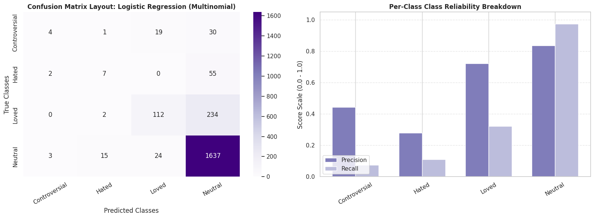
    


##### 📝 Model Analysis: Logistic Regression (Multinomial)

* **Superior Cross-Entropy Optimization:** Global soft-max cross-entropy optimization drops log loss to a section-best 0.5287 while lifting the Macro F1-Score to 0.4076.
* **Improved Minority Class Sensitivity:** Simultaneously enhances true positive captures across all underrepresented boundaries, boosting the F1-Score of `Hated` to 0.1573 and `Loved` to 0.4453.
* **Joint Probability Advantage:** By optimizing over all classes concurrently rather than via independent heuristics, it decreases unguided misclassifications without eroding the performance of the dominant `Neutral` core.

#### ⚖️ Comparison: One-vs-Rest (OVR) vs. Multinomial Approach

| Feature / Metric | One-vs-Rest (OVR) Strategy | Multinomial (Softmax) Approach |
| :--- | :--- | :--- |
| **Mathematical Goal** | Trains 4 distinct independent binary classifiers. | Trains 1 unified model optimizing joint distribution. |
| **Log Loss** | Higher (0.5359) due to uncalibrated binary outputs. | Lower (**0.5287**) via normalized probability distribution. |
| **Macro F1-Score** | 0.3644 (Struggles with boundary overlaps) | **0.4076** (Better handling of class intersections) |
| **Minority Class Handling** | Poor; treats rare instances as structural noise. | Superior; captures fine-grained multi-class variance. |

### 3.3 Multiclass KNN  🏘

Nearest neighbors explicitly compute relative distances in multi-dimension. We will search for an optimal tuned scalar for `k`. 


```python
# --- Multiclass KNN tuned via GridSearchCV ---
knn_params_mc = {'n_neighbors': [3, 5, 6, 7, 9, 11, 15, 21]}
knn_grid_mc = GridSearchCV(KNeighborsClassifier(), knn_params_mc, cv=5, scoring='f1_macro')
knn_grid_mc.fit(X_train_scaled_mc, y_train_mc)

best_k_mc = knn_grid_mc.best_params_['n_neighbors']
print(f"Best k: {best_k_mc}")

knn_best_mc = knn_grid_mc.best_estimator_
```

    Best k: 6


```python
y_pred_knn_mc = knn_best_mc.predict(X_test_scaled_mc)
y_prob_knn_mc = knn_best_mc.predict_proba(X_test_scaled_mc)

evaluate_multiclass(f"Tuned KNN (k={best_k_mc})", y_test_mc, y_pred_knn_mc, y_prob=y_prob_knn_mc, labels=mc_labels)
```

    
    ============================================================
    🌟 Multiclass Evaluation: Tuned KNN (k=6)
    ============================================================
    🔸 Accuracy:            0.8065
    🔸 F1-Score (Macro):    0.4707
    🔸 F1-Score (Micro):    0.8065
    🔸 F1-Score (Weighted): 0.7919
    🔸 Log Loss:            2.3980
    
    📋 Detailed Per-Class Report:


<style type="text/css">
#T_49f99_row0_col0, #T_49f99_row0_col1, #T_49f99_row0_col2 {
  background-color: #fcfbfd;
  color: #000000;
}
#T_49f99_row1_col0 {
  background-color: #cecfe5;
  color: #000000;
}
#T_49f99_row1_col1 {
  background-color: #e8e6f2;
  color: #000000;
}
#T_49f99_row1_col2 {
  background-color: #dfdfed;
  color: #000000;
}
#T_49f99_row2_col0 {
  background-color: #a9a7cf;
  color: #f1f1f1;
}
#T_49f99_row2_col1 {
  background-color: #bbbbdb;
  color: #000000;
}
#T_49f99_row2_col2 {
  background-color: #b0afd4;
  color: #000000;
}
#T_49f99_row3_col0, #T_49f99_row3_col1, #T_49f99_row3_col2 {
  background-color: #3f007d;
  color: #f1f1f1;
}
</style>
<table id="T_49f99">
  <thead>
    <tr>
      <th class="blank level0" >&nbsp;</th>
      <th id="T_49f99_level0_col0" class="col_heading level0 col0" >Precision</th>
      <th id="T_49f99_level0_col1" class="col_heading level0 col1" >Recall</th>
      <th id="T_49f99_level0_col2" class="col_heading level0 col2" >F1-Score</th>
      <th id="T_49f99_level0_col3" class="col_heading level0 col3" >Support</th>
    </tr>
  </thead>
  <tbody>
    <tr>
      <th id="T_49f99_level0_row0" class="row_heading level0 row0" >Controversial</th>
      <td id="T_49f99_row0_col0" class="data row0 col0" >0.2692</td>
      <td id="T_49f99_row0_col1" class="data row0 col1" >0.1296</td>
      <td id="T_49f99_row0_col2" class="data row0 col2" >0.1750</td>
      <td id="T_49f99_row0_col3" class="data row0 col3" >54</td>
    </tr>
    <tr>
      <th id="T_49f99_level0_row1" class="row_heading level0 row1" >Hated</th>
      <td id="T_49f99_row1_col0" class="data row1 col0" >0.4474</td>
      <td id="T_49f99_row1_col1" class="data row1 col1" >0.2656</td>
      <td id="T_49f99_row1_col2" class="data row1 col2" >0.3333</td>
      <td id="T_49f99_row1_col3" class="data row1 col3" >64</td>
    </tr>
    <tr>
      <th id="T_49f99_level0_row2" class="row_heading level0 row2" >Loved</th>
      <td id="T_49f99_row2_col0" class="data row2 col0" >0.5393</td>
      <td id="T_49f99_row2_col1" class="data row2 col1" >0.4339</td>
      <td id="T_49f99_row2_col2" class="data row2 col2" >0.4809</td>
      <td id="T_49f99_row2_col3" class="data row2 col3" >348</td>
    </tr>
    <tr>
      <th id="T_49f99_level0_row3" class="row_heading level0 row3" >Neutral</th>
      <td id="T_49f99_row3_col0" class="data row3 col0" >0.8634</td>
      <td id="T_49f99_row3_col1" class="data row3 col1" >0.9261</td>
      <td id="T_49f99_row3_col2" class="data row3 col2" >0.8937</td>
      <td id="T_49f99_row3_col3" class="data row3 col3" >1,679</td>
    </tr>
  </tbody>
</table>


    
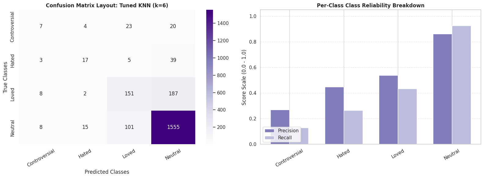
    


#### 📝 Model Analysis: Tuned KNN (k=6)

* **Instance-Based Sensitivity Boost:** Selecting an instance neighborhood of $k=6$ elevates the Macro F1-Score to a section-best 0.4707, demonstrating that localized feature proximity captures minority patterns better than rigid global linear planes.
* **Balanced Per-Class Representation:** Substantially improves predictive power across underrepresented categories, capturing a notable F1-Score of 0.3333 for `Hated` and peaking at 0.4809 for `Loved`.
* **High-Density Probability Penalty:** Despite strong classification metrics, the high Log Loss (2.3980) reveals that instance-count ratio voting produces uncalibrated, overconfident probability errors at class boundary edges.

#### Finding the best `K value`


```python
neighbors_list = [2, 3, 4, 5, 6, 7, 8, 9, 10, 11, 12, 15, 21]
scores_test = []
scores_train = []

for n in neighbors_list:
    knn_model_mc = KNeighborsClassifier(n_neighbors=n)
    knn_model_mc.fit(X_train_scaled_mc, y_train_mc)
    
    predictions_train = knn_model_mc.predict(X_train_scaled_mc)
    F1_train = f1_score(y_train_mc, predictions_train, average='macro')
    scores_train.append(F1_train)

    predictions_test = knn_model_mc.predict(X_test_scaled_mc)
    F1_test = f1_score(y_test_mc, predictions_test, average='macro')
    scores_test.append(F1_test)

plt.figure(figsize=(12, 6))
plt.plot(neighbors_list, scores_test, lw=3, label='F1: Test Set', marker='o')
plt.plot(neighbors_list, scores_train, lw=3, color='orange', label='F1: Train Set', marker='o')

plt.xlabel('Number of Neighbors (k)')
plt.ylabel('Macro F1-Score')
plt.title('Multiclass KNN Hyperparameter Tuning: K-Neighbors Analysis')
plt.grid(True, alpha=0.3)
plt.legend()
plt.show()
```


    
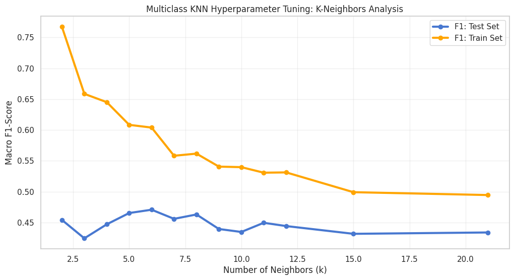
    


**As we can see from the plot the optimal value for `k` is `k=6` in our case which same as what we got from `GridSearchCV`**.

### 3.4 Decision Trees 🌳

 Decision trees natively branch logically capturing sub-features matching their respective targets optimally.


```python
# --- Multiclass Decision Tree ---
dt_mc = DecisionTreeClassifier(criterion='gini', max_depth=12, random_state=42)
dt_mc.fit(X_train_scaled_mc, y_train_mc)
```


<style>#sk-container-id-18 {
  /* Definition of color scheme common for light and dark mode */
  --sklearn-color-text: #000;
  --sklearn-color-text-muted: #666;
  --sklearn-color-line: gray;
  /* Definition of color scheme for unfitted estimators */
  --sklearn-color-unfitted-level-0: #fff5e6;
  --sklearn-color-unfitted-level-1: #f6e4d2;
  --sklearn-color-unfitted-level-2: #ffe0b3;
  --sklearn-color-unfitted-level-3: chocolate;
  /* Definition of color scheme for fitted estimators */
  --sklearn-color-fitted-level-0: #f0f8ff;
  --sklearn-color-fitted-level-1: #d4ebff;
  --sklearn-color-fitted-level-2: #b3dbfd;
  --sklearn-color-fitted-level-3: cornflowerblue;
}

#sk-container-id-18.light {
  /* Specific color for light theme */
  --sklearn-color-text-on-default-background: black;
  --sklearn-color-background: white;
  --sklearn-color-border-box: black;
  --sklearn-color-icon: #696969;
}

#sk-container-id-18.dark {
  --sklearn-color-text-on-default-background: white;
  --sklearn-color-background: #111;
  --sklearn-color-border-box: white;
  --sklearn-color-icon: #878787;
}

#sk-container-id-18 {
  color: var(--sklearn-color-text);
}

#sk-container-id-18 pre {
  padding: 0;
}

#sk-container-id-18 input.sk-hidden--visually {
  border: 0;
  clip: rect(1px 1px 1px 1px);
  clip: rect(1px, 1px, 1px, 1px);
  height: 1px;
  margin: -1px;
  overflow: hidden;
  padding: 0;
  position: absolute;
  width: 1px;
}

#sk-container-id-18 div.sk-dashed-wrapped {
  border: 1px dashed var(--sklearn-color-line);
  margin: 0 0.4em 0.5em 0.4em;
  box-sizing: border-box;
  padding-bottom: 0.4em;
  background-color: var(--sklearn-color-background);
}

#sk-container-id-18 div.sk-container {
  /* jupyter's `normalize.less` sets `[hidden] { display: none; }`
     but bootstrap.min.css set `[hidden] { display: none !important; }`
     so we also need the `!important` here to be able to override the
     default hidden behavior on the sphinx rendered scikit-learn.org.
     See: https://github.com/scikit-learn/scikit-learn/issues/21755 */
  display: inline-block !important;
  position: relative;
}

#sk-container-id-18 div.sk-text-repr-fallback {
  display: none;
}

div.sk-parallel-item,
div.sk-serial,
div.sk-item {
  /* draw centered vertical line to link estimators */
  background-image: linear-gradient(var(--sklearn-color-text-on-default-background), var(--sklearn-color-text-on-default-background));
  background-size: 2px 100%;
  background-repeat: no-repeat;
  background-position: center center;
}

/* Parallel-specific style estimator block */

#sk-container-id-18 div.sk-parallel-item::after {
  content: "";
  width: 100%;
  border-bottom: 2px solid var(--sklearn-color-text-on-default-background);
  flex-grow: 1;
}

#sk-container-id-18 div.sk-parallel {
  display: flex;
  align-items: stretch;
  justify-content: center;
  background-color: var(--sklearn-color-background);
  position: relative;
}

#sk-container-id-18 div.sk-parallel-item {
  display: flex;
  flex-direction: column;
}

#sk-container-id-18 div.sk-parallel-item:first-child::after {
  align-self: flex-end;
  width: 50%;
}

#sk-container-id-18 div.sk-parallel-item:last-child::after {
  align-self: flex-start;
  width: 50%;
}

#sk-container-id-18 div.sk-parallel-item:only-child::after {
  width: 0;
}

/* Serial-specific style estimator block */

#sk-container-id-18 div.sk-serial {
  display: flex;
  flex-direction: column;
  align-items: center;
  background-color: var(--sklearn-color-background);
  padding-right: 1em;
  padding-left: 1em;
}


/* Toggleable style: style used for estimator/Pipeline/ColumnTransformer box that is
clickable and can be expanded/collapsed.
- Pipeline and ColumnTransformer use this feature and define the default style
- Estimators will overwrite some part of the style using the `sk-estimator` class
*/

/* Pipeline and ColumnTransformer style (default) */

#sk-container-id-18 div.sk-toggleable {
  /* Default theme specific background. It is overwritten whether we have a
  specific estimator or a Pipeline/ColumnTransformer */
  background-color: var(--sklearn-color-background);
}

/* Toggleable label */
#sk-container-id-18 label.sk-toggleable__label {
  cursor: pointer;
  display: flex;
  width: 100%;
  margin-bottom: 0;
  padding: 0.5em;
  box-sizing: border-box;
  text-align: center;
  align-items: center;
  justify-content: center;
  gap: 0.5em;
}

#sk-container-id-18 label.sk-toggleable__label .caption {
  font-size: 0.6rem;
  font-weight: lighter;
  color: var(--sklearn-color-text-muted);
}

#sk-container-id-18 label.sk-toggleable__label-arrow:before {
  /* Arrow on the left of the label */
  content: "▸";
  float: left;
  margin-right: 0.25em;
  color: var(--sklearn-color-icon);
}

#sk-container-id-18 label.sk-toggleable__label-arrow:hover:before {
  color: var(--sklearn-color-text);
}

/* Toggleable content - dropdown */

#sk-container-id-18 div.sk-toggleable__content {
  display: none;
  text-align: left;
  /* unfitted */
  background-color: var(--sklearn-color-unfitted-level-0);
}

#sk-container-id-18 div.sk-toggleable__content.fitted {
  /* fitted */
  background-color: var(--sklearn-color-fitted-level-0);
}

#sk-container-id-18 div.sk-toggleable__content pre {
  margin: 0.2em;
  border-radius: 0.25em;
  color: var(--sklearn-color-text);
  /* unfitted */
  background-color: var(--sklearn-color-unfitted-level-0);
}

#sk-container-id-18 div.sk-toggleable__content.fitted pre {
  /* unfitted */
  background-color: var(--sklearn-color-fitted-level-0);
}

#sk-container-id-18 input.sk-toggleable__control:checked~div.sk-toggleable__content {
  /* Expand drop-down */
  display: block;
  width: 100%;
  overflow: visible;
}

#sk-container-id-18 input.sk-toggleable__control:checked~label.sk-toggleable__label-arrow:before {
  content: "▾";
}

/* Pipeline/ColumnTransformer-specific style */

#sk-container-id-18 div.sk-label input.sk-toggleable__control:checked~label.sk-toggleable__label {
  color: var(--sklearn-color-text);
  background-color: var(--sklearn-color-unfitted-level-2);
}

#sk-container-id-18 div.sk-label.fitted input.sk-toggleable__control:checked~label.sk-toggleable__label {
  background-color: var(--sklearn-color-fitted-level-2);
}

/* Estimator-specific style */

/* Colorize estimator box */
#sk-container-id-18 div.sk-estimator input.sk-toggleable__control:checked~label.sk-toggleable__label {
  /* unfitted */
  background-color: var(--sklearn-color-unfitted-level-2);
}

#sk-container-id-18 div.sk-estimator.fitted input.sk-toggleable__control:checked~label.sk-toggleable__label {
  /* fitted */
  background-color: var(--sklearn-color-fitted-level-2);
}

#sk-container-id-18 div.sk-label label.sk-toggleable__label,
#sk-container-id-18 div.sk-label label {
  /* The background is the default theme color */
  color: var(--sklearn-color-text-on-default-background);
}

/* On hover, darken the color of the background */
#sk-container-id-18 div.sk-label:hover label.sk-toggleable__label {
  color: var(--sklearn-color-text);
  background-color: var(--sklearn-color-unfitted-level-2);
}

/* Label box, darken color on hover, fitted */
#sk-container-id-18 div.sk-label.fitted:hover label.sk-toggleable__label.fitted {
  color: var(--sklearn-color-text);
  background-color: var(--sklearn-color-fitted-level-2);
}

/* Estimator label */

#sk-container-id-18 div.sk-label label {
  font-family: monospace;
  font-weight: bold;
  line-height: 1.2em;
}

#sk-container-id-18 div.sk-label-container {
  text-align: center;
}

/* Estimator-specific */
#sk-container-id-18 div.sk-estimator {
  font-family: monospace;
  border: 1px dotted var(--sklearn-color-border-box);
  border-radius: 0.25em;
  box-sizing: border-box;
  margin-bottom: 0.5em;
  /* unfitted */
  background-color: var(--sklearn-color-unfitted-level-0);
}

#sk-container-id-18 div.sk-estimator.fitted {
  /* fitted */
  background-color: var(--sklearn-color-fitted-level-0);
}

/* on hover */
#sk-container-id-18 div.sk-estimator:hover {
  /* unfitted */
  background-color: var(--sklearn-color-unfitted-level-2);
}

#sk-container-id-18 div.sk-estimator.fitted:hover {
  /* fitted */
  background-color: var(--sklearn-color-fitted-level-2);
}

/* Specification for estimator info (e.g. "i" and "?") */

/* Common style for "i" and "?" */

.sk-estimator-doc-link,
a:link.sk-estimator-doc-link,
a:visited.sk-estimator-doc-link {
  float: right;
  font-size: smaller;
  line-height: 1em;
  font-family: monospace;
  background-color: var(--sklearn-color-unfitted-level-0);
  border-radius: 1em;
  height: 1em;
  width: 1em;
  text-decoration: none !important;
  margin-left: 0.5em;
  text-align: center;
  /* unfitted */
  border: var(--sklearn-color-unfitted-level-3) 1pt solid;
  color: var(--sklearn-color-unfitted-level-3);
}

.sk-estimator-doc-link.fitted,
a:link.sk-estimator-doc-link.fitted,
a:visited.sk-estimator-doc-link.fitted {
  /* fitted */
  background-color: var(--sklearn-color-fitted-level-0);
  border: var(--sklearn-color-fitted-level-3) 1pt solid;
  color: var(--sklearn-color-fitted-level-3);
}

/* On hover */
div.sk-estimator:hover .sk-estimator-doc-link:hover,
.sk-estimator-doc-link:hover,
div.sk-label-container:hover .sk-estimator-doc-link:hover,
.sk-estimator-doc-link:hover {
  /* unfitted */
  background-color: var(--sklearn-color-unfitted-level-3);
  border: var(--sklearn-color-fitted-level-0) 1pt solid;
  color: var(--sklearn-color-unfitted-level-0);
  text-decoration: none;
}

div.sk-estimator.fitted:hover .sk-estimator-doc-link.fitted:hover,
.sk-estimator-doc-link.fitted:hover,
div.sk-label-container:hover .sk-estimator-doc-link.fitted:hover,
.sk-estimator-doc-link.fitted:hover {
  /* fitted */
  background-color: var(--sklearn-color-fitted-level-3);
  border: var(--sklearn-color-fitted-level-0) 1pt solid;
  color: var(--sklearn-color-fitted-level-0);
  text-decoration: none;
}

/* Span, style for the box shown on hovering the info icon */
.sk-estimator-doc-link span {
  display: none;
  z-index: 9999;
  position: relative;
  font-weight: normal;
  right: .2ex;
  padding: .5ex;
  margin: .5ex;
  width: min-content;
  min-width: 20ex;
  max-width: 50ex;
  color: var(--sklearn-color-text);
  box-shadow: 2pt 2pt 4pt #999;
  /* unfitted */
  background: var(--sklearn-color-unfitted-level-0);
  border: .5pt solid var(--sklearn-color-unfitted-level-3);
}

.sk-estimator-doc-link.fitted span {
  /* fitted */
  background: var(--sklearn-color-fitted-level-0);
  border: var(--sklearn-color-fitted-level-3);
}

.sk-estimator-doc-link:hover span {
  display: block;
}

/* "?"-specific style due to the `<a>` HTML tag */

#sk-container-id-18 a.estimator_doc_link {
  float: right;
  font-size: 1rem;
  line-height: 1em;
  font-family: monospace;
  background-color: var(--sklearn-color-unfitted-level-0);
  border-radius: 1rem;
  height: 1rem;
  width: 1rem;
  text-decoration: none;
  /* unfitted */
  color: var(--sklearn-color-unfitted-level-1);
  border: var(--sklearn-color-unfitted-level-1) 1pt solid;
}

#sk-container-id-18 a.estimator_doc_link.fitted {
  /* fitted */
  background-color: var(--sklearn-color-fitted-level-0);
  border: var(--sklearn-color-fitted-level-1) 1pt solid;
  color: var(--sklearn-color-fitted-level-1);
}

/* On hover */
#sk-container-id-18 a.estimator_doc_link:hover {
  /* unfitted */
  background-color: var(--sklearn-color-unfitted-level-3);
  color: var(--sklearn-color-background);
  text-decoration: none;
}

#sk-container-id-18 a.estimator_doc_link.fitted:hover {
  /* fitted */
  background-color: var(--sklearn-color-fitted-level-3);
}

.estimator-table {
    font-family: monospace;
}

.estimator-table summary {
    padding: .5rem;
    cursor: pointer;
}

.estimator-table summary::marker {
    font-size: 0.7rem;
}

.estimator-table details[open] {
    padding-left: 0.1rem;
    padding-right: 0.1rem;
    padding-bottom: 0.3rem;
}

.estimator-table .parameters-table {
    margin-left: auto !important;
    margin-right: auto !important;
    margin-top: 0;
}

.estimator-table .parameters-table tr:nth-child(odd) {
    background-color: #fff;
}

.estimator-table .parameters-table tr:nth-child(even) {
    background-color: #f6f6f6;
}

.estimator-table .parameters-table tr:hover {
    background-color: #e0e0e0;
}

.estimator-table table td {
    border: 1px solid rgba(106, 105, 104, 0.232);
}

/*
    `table td`is set in notebook with right text-align.
    We need to overwrite it.
*/
.estimator-table table td.param {
    text-align: left;
    position: relative;
    padding: 0;
}

.user-set td {
    color:rgb(255, 94, 0);
    text-align: left !important;
}

.user-set td.value {
    color:rgb(255, 94, 0);
    background-color: transparent;
}

.default td {
    color: black;
    text-align: left !important;
}

.user-set td i,
.default td i {
    color: black;
}

/*
    Styles for parameter documentation links
    We need styling for visited so jupyter doesn't overwrite it
*/
a.param-doc-link,
a.param-doc-link:link,
a.param-doc-link:visited {
    text-decoration: underline dashed;
    text-underline-offset: .3em;
    color: inherit;
    display: block;
    padding: .5em;
}

/* "hack" to make the entire area of the cell containing the link clickable */
a.param-doc-link::before {
    position: absolute;
    content: "";
    inset: 0;
}

.param-doc-description {
    display: none;
    position: absolute;
    z-index: 9999;
    left: 0;
    padding: .5ex;
    margin-left: 1.5em;
    color: var(--sklearn-color-text);
    box-shadow: .3em .3em .4em #999;
    width: max-content;
    text-align: left;
    max-height: 10em;
    overflow-y: auto;

    /* unfitted */
    background: var(--sklearn-color-unfitted-level-0);
    border: thin solid var(--sklearn-color-unfitted-level-3);
}

/* Fitted state for parameter tooltips */
.fitted .param-doc-description {
    /* fitted */
    background: var(--sklearn-color-fitted-level-0);
    border: thin solid var(--sklearn-color-fitted-level-3);
}

.param-doc-link:hover .param-doc-description {
    display: block;
}

.copy-paste-icon {
    background-image: url();
    background-repeat: no-repeat;
    background-size: 14px 14px;
    background-position: 0;
    display: inline-block;
    width: 14px;
    height: 14px;
    cursor: pointer;
}
</style><body><div id="sk-container-id-18" class="sk-top-container"><div class="sk-text-repr-fallback"><pre>DecisionTreeClassifier(max_depth=12, random_state=42)</pre><b>In a Jupyter environment, please rerun this cell to show the HTML representation or trust the notebook. <br />On GitHub, the HTML representation is unable to render, please try loading this page with nbviewer.org.</b></div><div class="sk-container" hidden><div class="sk-item"><div class="sk-estimator fitted sk-toggleable"><input class="sk-toggleable__control sk-hidden--visually" id="sk-estimator-id-28" type="checkbox" checked><label for="sk-estimator-id-28" class="sk-toggleable__label fitted sk-toggleable__label-arrow"><div><div>DecisionTreeClassifier</div></div><div><a class="sk-estimator-doc-link fitted" rel="noreferrer" target="_blank" href="https://scikit-learn.org/1.8/modules/generated/sklearn.tree.DecisionTreeClassifier.html">?<span>Documentation for DecisionTreeClassifier</span></a><span class="sk-estimator-doc-link fitted">i<span>Fitted</span></span></div></label><div class="sk-toggleable__content fitted" data-param-prefix="">
        <div class="estimator-table">
            <details>
                <summary>Parameters</summary>
                <table class="parameters-table">
                  <tbody>

        <tr class="default">
            <td><i class="copy-paste-icon"
                 onclick="copyToClipboard('criterion',
                          this.parentElement.nextElementSibling)"
            ></i></td>
            <td class="param">
        <a class="param-doc-link"
            rel="noreferrer" target="_blank" href="https://scikit-learn.org/1.8/modules/generated/sklearn.tree.DecisionTreeClassifier.html#:~:text=criterion,-%7B%22gini%22%2C%20%22entropy%22%2C%20%22log_loss%22%7D%2C%20default%3D%22gini%22">
            criterion
            <span class="param-doc-description">criterion: {"gini", "entropy", "log_loss"}, default="gini"<br><br>The function to measure the quality of a split. Supported criteria are<br>"gini" for the Gini impurity and "log_loss" and "entropy" both for the<br>Shannon information gain, see :ref:`tree_mathematical_formulation`.</span>
        </a>
    </td>
            <td class="value">&#x27;gini&#x27;</td>
        </tr>


        <tr class="default">
            <td><i class="copy-paste-icon"
                 onclick="copyToClipboard('splitter',
                          this.parentElement.nextElementSibling)"
            ></i></td>
            <td class="param">
        <a class="param-doc-link"
            rel="noreferrer" target="_blank" href="https://scikit-learn.org/1.8/modules/generated/sklearn.tree.DecisionTreeClassifier.html#:~:text=splitter,-%7B%22best%22%2C%20%22random%22%7D%2C%20default%3D%22best%22">
            splitter
            <span class="param-doc-description">splitter: {"best", "random"}, default="best"<br><br>The strategy used to choose the split at each node. Supported<br>strategies are "best" to choose the best split and "random" to choose<br>the best random split.</span>
        </a>
    </td>
            <td class="value">&#x27;best&#x27;</td>
        </tr>


        <tr class="user-set">
            <td><i class="copy-paste-icon"
                 onclick="copyToClipboard('max_depth',
                          this.parentElement.nextElementSibling)"
            ></i></td>
            <td class="param">
        <a class="param-doc-link"
            rel="noreferrer" target="_blank" href="https://scikit-learn.org/1.8/modules/generated/sklearn.tree.DecisionTreeClassifier.html#:~:text=max_depth,-int%2C%20default%3DNone">
            max_depth
            <span class="param-doc-description">max_depth: int, default=None<br><br>The maximum depth of the tree. If None, then nodes are expanded until<br>all leaves are pure or until all leaves contain less than<br>min_samples_split samples.</span>
        </a>
    </td>
            <td class="value">12</td>
        </tr>


        <tr class="default">
            <td><i class="copy-paste-icon"
                 onclick="copyToClipboard('min_samples_split',
                          this.parentElement.nextElementSibling)"
            ></i></td>
            <td class="param">
        <a class="param-doc-link"
            rel="noreferrer" target="_blank" href="https://scikit-learn.org/1.8/modules/generated/sklearn.tree.DecisionTreeClassifier.html#:~:text=min_samples_split,-int%20or%20float%2C%20default%3D2">
            min_samples_split
            <span class="param-doc-description">min_samples_split: int or float, default=2<br><br>The minimum number of samples required to split an internal node:<br><br>- If int, then consider `min_samples_split` as the minimum number.<br>- If float, then `min_samples_split` is a fraction and<br>  `ceil(min_samples_split * n_samples)` are the minimum<br>  number of samples for each split.<br><br>.. versionchanged:: 0.18<br>   Added float values for fractions.</span>
        </a>
    </td>
            <td class="value">2</td>
        </tr>


        <tr class="default">
            <td><i class="copy-paste-icon"
                 onclick="copyToClipboard('min_samples_leaf',
                          this.parentElement.nextElementSibling)"
            ></i></td>
            <td class="param">
        <a class="param-doc-link"
            rel="noreferrer" target="_blank" href="https://scikit-learn.org/1.8/modules/generated/sklearn.tree.DecisionTreeClassifier.html#:~:text=min_samples_leaf,-int%20or%20float%2C%20default%3D1">
            min_samples_leaf
            <span class="param-doc-description">min_samples_leaf: int or float, default=1<br><br>The minimum number of samples required to be at a leaf node.<br>A split point at any depth will only be considered if it leaves at<br>least ``min_samples_leaf`` training samples in each of the left and<br>right branches.  This may have the effect of smoothing the model,<br>especially in regression.<br><br>- If int, then consider `min_samples_leaf` as the minimum number.<br>- If float, then `min_samples_leaf` is a fraction and<br>  `ceil(min_samples_leaf * n_samples)` are the minimum<br>  number of samples for each node.<br><br>.. versionchanged:: 0.18<br>   Added float values for fractions.</span>
        </a>
    </td>
            <td class="value">1</td>
        </tr>


        <tr class="default">
            <td><i class="copy-paste-icon"
                 onclick="copyToClipboard('min_weight_fraction_leaf',
                          this.parentElement.nextElementSibling)"
            ></i></td>
            <td class="param">
        <a class="param-doc-link"
            rel="noreferrer" target="_blank" href="https://scikit-learn.org/1.8/modules/generated/sklearn.tree.DecisionTreeClassifier.html#:~:text=min_weight_fraction_leaf,-float%2C%20default%3D0.0">
            min_weight_fraction_leaf
            <span class="param-doc-description">min_weight_fraction_leaf: float, default=0.0<br><br>The minimum weighted fraction of the sum total of weights (of all<br>the input samples) required to be at a leaf node. Samples have<br>equal weight when sample_weight is not provided.</span>
        </a>
    </td>
            <td class="value">0.0</td>
        </tr>


        <tr class="default">
            <td><i class="copy-paste-icon"
                 onclick="copyToClipboard('max_features',
                          this.parentElement.nextElementSibling)"
            ></i></td>
            <td class="param">
        <a class="param-doc-link"
            rel="noreferrer" target="_blank" href="https://scikit-learn.org/1.8/modules/generated/sklearn.tree.DecisionTreeClassifier.html#:~:text=max_features,-int%2C%20float%20or%20%7B%22sqrt%22%2C%20%22log2%22%7D%2C%20default%3DNone">
            max_features
            <span class="param-doc-description">max_features: int, float or {"sqrt", "log2"}, default=None<br><br>The number of features to consider when looking for the best split:<br><br>- If int, then consider `max_features` features at each split.<br>- If float, then `max_features` is a fraction and<br>  `max(1, int(max_features * n_features_in_))` features are considered at<br>  each split.<br>- If "sqrt", then `max_features=sqrt(n_features)`.<br>- If "log2", then `max_features=log2(n_features)`.<br>- If None, then `max_features=n_features`.<br><br>.. note::<br><br>    The search for a split does not stop until at least one<br>    valid partition of the node samples is found, even if it requires to<br>    effectively inspect more than ``max_features`` features.</span>
        </a>
    </td>
            <td class="value">None</td>
        </tr>


        <tr class="user-set">
            <td><i class="copy-paste-icon"
                 onclick="copyToClipboard('random_state',
                          this.parentElement.nextElementSibling)"
            ></i></td>
            <td class="param">
        <a class="param-doc-link"
            rel="noreferrer" target="_blank" href="https://scikit-learn.org/1.8/modules/generated/sklearn.tree.DecisionTreeClassifier.html#:~:text=random_state,-int%2C%20RandomState%20instance%20or%20None%2C%20default%3DNone">
            random_state
            <span class="param-doc-description">random_state: int, RandomState instance or None, default=None<br><br>Controls the randomness of the estimator. The features are always<br>randomly permuted at each split, even if ``splitter`` is set to<br>``"best"``. When ``max_features < n_features``, the algorithm will<br>select ``max_features`` at random at each split before finding the best<br>split among them. But the best found split may vary across different<br>runs, even if ``max_features=n_features``. That is the case, if the<br>improvement of the criterion is identical for several splits and one<br>split has to be selected at random. To obtain a deterministic behaviour<br>during fitting, ``random_state`` has to be fixed to an integer.<br>See :term:`Glossary <random_state>` for details.</span>
        </a>
    </td>
            <td class="value">42</td>
        </tr>


        <tr class="default">
            <td><i class="copy-paste-icon"
                 onclick="copyToClipboard('max_leaf_nodes',
                          this.parentElement.nextElementSibling)"
            ></i></td>
            <td class="param">
        <a class="param-doc-link"
            rel="noreferrer" target="_blank" href="https://scikit-learn.org/1.8/modules/generated/sklearn.tree.DecisionTreeClassifier.html#:~:text=max_leaf_nodes,-int%2C%20default%3DNone">
            max_leaf_nodes
            <span class="param-doc-description">max_leaf_nodes: int, default=None<br><br>Grow a tree with ``max_leaf_nodes`` in best-first fashion.<br>Best nodes are defined as relative reduction in impurity.<br>If None then unlimited number of leaf nodes.</span>
        </a>
    </td>
            <td class="value">None</td>
        </tr>


        <tr class="default">
            <td><i class="copy-paste-icon"
                 onclick="copyToClipboard('min_impurity_decrease',
                          this.parentElement.nextElementSibling)"
            ></i></td>
            <td class="param">
        <a class="param-doc-link"
            rel="noreferrer" target="_blank" href="https://scikit-learn.org/1.8/modules/generated/sklearn.tree.DecisionTreeClassifier.html#:~:text=min_impurity_decrease,-float%2C%20default%3D0.0">
            min_impurity_decrease
            <span class="param-doc-description">min_impurity_decrease: float, default=0.0<br><br>A node will be split if this split induces a decrease of the impurity<br>greater than or equal to this value.<br><br>The weighted impurity decrease equation is the following::<br><br>    N_t / N * (impurity - N_t_R / N_t * right_impurity<br>                        - N_t_L / N_t * left_impurity)<br><br>where ``N`` is the total number of samples, ``N_t`` is the number of<br>samples at the current node, ``N_t_L`` is the number of samples in the<br>left child, and ``N_t_R`` is the number of samples in the right child.<br><br>``N``, ``N_t``, ``N_t_R`` and ``N_t_L`` all refer to the weighted sum,<br>if ``sample_weight`` is passed.<br><br>.. versionadded:: 0.19</span>
        </a>
    </td>
            <td class="value">0.0</td>
        </tr>


        <tr class="default">
            <td><i class="copy-paste-icon"
                 onclick="copyToClipboard('class_weight',
                          this.parentElement.nextElementSibling)"
            ></i></td>
            <td class="param">
        <a class="param-doc-link"
            rel="noreferrer" target="_blank" href="https://scikit-learn.org/1.8/modules/generated/sklearn.tree.DecisionTreeClassifier.html#:~:text=class_weight,-dict%2C%20list%20of%20dict%20or%20%22balanced%22%2C%20default%3DNone">
            class_weight
            <span class="param-doc-description">class_weight: dict, list of dict or "balanced", default=None<br><br>Weights associated with classes in the form ``{class_label: weight}``.<br>If None, all classes are supposed to have weight one. For<br>multi-output problems, a list of dicts can be provided in the same<br>order as the columns of y.<br><br>Note that for multioutput (including multilabel) weights should be<br>defined for each class of every column in its own dict. For example,<br>for four-class multilabel classification weights should be<br>[{0: 1, 1: 1}, {0: 1, 1: 5}, {0: 1, 1: 1}, {0: 1, 1: 1}] instead of<br>[{1:1}, {2:5}, {3:1}, {4:1}].<br><br>The "balanced" mode uses the values of y to automatically adjust<br>weights inversely proportional to class frequencies in the input data<br>as ``n_samples / (n_classes * np.bincount(y))``<br><br>For multi-output, the weights of each column of y will be multiplied.<br><br>Note that these weights will be multiplied with sample_weight (passed<br>through the fit method) if sample_weight is specified.</span>
        </a>
    </td>
            <td class="value">None</td>
        </tr>


        <tr class="default">
            <td><i class="copy-paste-icon"
                 onclick="copyToClipboard('ccp_alpha',
                          this.parentElement.nextElementSibling)"
            ></i></td>
            <td class="param">
        <a class="param-doc-link"
            rel="noreferrer" target="_blank" href="https://scikit-learn.org/1.8/modules/generated/sklearn.tree.DecisionTreeClassifier.html#:~:text=ccp_alpha,-non-negative%20float%2C%20default%3D0.0">
            ccp_alpha
            <span class="param-doc-description">ccp_alpha: non-negative float, default=0.0<br><br>Complexity parameter used for Minimal Cost-Complexity Pruning. The<br>subtree with the largest cost complexity that is smaller than<br>``ccp_alpha`` will be chosen. By default, no pruning is performed. See<br>:ref:`minimal_cost_complexity_pruning` for details. See<br>:ref:`sphx_glr_auto_examples_tree_plot_cost_complexity_pruning.py`<br>for an example of such pruning.<br><br>.. versionadded:: 0.22</span>
        </a>
    </td>
            <td class="value">0.0</td>
        </tr>


        <tr class="default">
            <td><i class="copy-paste-icon"
                 onclick="copyToClipboard('monotonic_cst',
                          this.parentElement.nextElementSibling)"
            ></i></td>
            <td class="param">
        <a class="param-doc-link"
            rel="noreferrer" target="_blank" href="https://scikit-learn.org/1.8/modules/generated/sklearn.tree.DecisionTreeClassifier.html#:~:text=monotonic_cst,-array-like%20of%20int%20of%20shape%20%28n_features%29%2C%20default%3DNone">
            monotonic_cst
            <span class="param-doc-description">monotonic_cst: array-like of int of shape (n_features), default=None<br><br>Indicates the monotonicity constraint to enforce on each feature.<br>  - 1: monotonic increase<br>  - 0: no constraint<br>  - -1: monotonic decrease<br><br>If monotonic_cst is None, no constraints are applied.<br><br>Monotonicity constraints are not supported for:<br>  - multiclass classifications (i.e. when `n_classes > 2`),<br>  - multioutput classifications (i.e. when `n_outputs_ > 1`),<br>  - classifications trained on data with missing values.<br><br>The constraints hold over the probability of the positive class.<br><br>Read more in the :ref:`User Guide <monotonic_cst_gbdt>`.<br><br>.. versionadded:: 1.4</span>
        </a>
    </td>
            <td class="value">None</td>
        </tr>

                  </tbody>
                </table>
            </details>
        </div>
    </div></div></div></div></div><script>function copyToClipboard(text, element) {
    // Get the parameter prefix from the closest toggleable content
    const toggleableContent = element.closest('.sk-toggleable__content');
    const paramPrefix = toggleableContent ? toggleableContent.dataset.paramPrefix : '';
    const fullParamName = paramPrefix ? `${paramPrefix}${text}` : text;

    const originalStyle = element.style;
    const computedStyle = window.getComputedStyle(element);
    const originalWidth = computedStyle.width;
    const originalHTML = element.innerHTML.replace('Copied!', '');

    navigator.clipboard.writeText(fullParamName)
        .then(() => {
            element.style.width = originalWidth;
            element.style.color = 'green';
            element.innerHTML = "Copied!";

            setTimeout(() => {
                element.innerHTML = originalHTML;
                element.style = originalStyle;
            }, 2000);
        })
        .catch(err => {
            console.error('Failed to copy:', err);
            element.style.color = 'red';
            element.innerHTML = "Failed!";
            setTimeout(() => {
                element.innerHTML = originalHTML;
                element.style = originalStyle;
            }, 2000);
        });
    return false;
}

document.querySelectorAll('.copy-paste-icon').forEach(function(element) {
    const toggleableContent = element.closest('.sk-toggleable__content');
    const paramPrefix = toggleableContent ? toggleableContent.dataset.paramPrefix : '';
    const paramName = element.parentElement.nextElementSibling
        .textContent.trim().split(' ')[0];
    const fullParamName = paramPrefix ? `${paramPrefix}${paramName}` : paramName;

    element.setAttribute('title', fullParamName);
});


/**
 * Adapted from Skrub
 * https://github.com/skrub-data/skrub/blob/403466d1d5d4dc76a7ef569b3f8228db59a31dc3/skrub/_reporting/_data/templates/report.js#L789
 * @returns "light" or "dark"
 */
function detectTheme(element) {
    const body = document.querySelector('body');

    // Check VSCode theme
    const themeKindAttr = body.getAttribute('data-vscode-theme-kind');
    const themeNameAttr = body.getAttribute('data-vscode-theme-name');

    if (themeKindAttr && themeNameAttr) {
        const themeKind = themeKindAttr.toLowerCase();
        const themeName = themeNameAttr.toLowerCase();

        if (themeKind.includes("dark") || themeName.includes("dark")) {
            return "dark";
        }
        if (themeKind.includes("light") || themeName.includes("light")) {
            return "light";
        }
    }

    // Check Jupyter theme
    if (body.getAttribute('data-jp-theme-light') === 'false') {
        return 'dark';
    } else if (body.getAttribute('data-jp-theme-light') === 'true') {
        return 'light';
    }

    // Guess based on a parent element's color
    const color = window.getComputedStyle(element.parentNode, null).getPropertyValue('color');
    const match = color.match(/^rgb\s*\(\s*(\d+)\s*,\s*(\d+)\s*,\s*(\d+)\s*\)\s*$/i);
    if (match) {
        const [r, g, b] = [
            parseFloat(match[1]),
            parseFloat(match[2]),
            parseFloat(match[3])
        ];

        // https://en.wikipedia.org/wiki/HSL_and_HSV#Lightness
        const luma = 0.299 * r + 0.587 * g + 0.114 * b;

        if (luma > 180) {
            // If the text is very bright we have a dark theme
            return 'dark';
        }
        if (luma < 75) {
            // If the text is very dark we have a light theme
            return 'light';
        }
        // Otherwise fall back to the next heuristic.
    }

    // Fallback to system preference
    return window.matchMedia('(prefers-color-scheme: dark)').matches ? 'dark' : 'light';
}


function forceTheme(elementId) {
    const estimatorElement = document.querySelector(`#${elementId}`);
    if (estimatorElement === null) {
        console.error(`Element with id ${elementId} not found.`);
    } else {
        const theme = detectTheme(estimatorElement);
        estimatorElement.classList.add(theme);
    }
}

forceTheme('sk-container-id-18');</script></body>


```python
y_pred_dt_mc = dt_mc.predict(X_test_scaled_mc)
y_prob_dt_mc = dt_mc.predict_proba(X_test_scaled_mc)

evaluate_multiclass("Decision Tree (Gini)", y_test_mc, y_pred_dt_mc, y_prob=y_prob_dt_mc, labels=mc_labels)
```

    
    ============================================================
    🌟 Multiclass Evaluation: Decision Tree (Gini)
    ============================================================
    🔸 Accuracy:            0.8065
    🔸 F1-Score (Macro):    0.5007
    🔸 F1-Score (Micro):    0.8065
    🔸 F1-Score (Weighted): 0.7920
    🔸 Log Loss:            2.8153
    
    📋 Detailed Per-Class Report:


<style type="text/css">
#T_a8d10_row0_col0 {
  background-color: #efedf5;
  color: #000000;
}
#T_a8d10_row0_col1, #T_a8d10_row1_col0, #T_a8d10_row1_col2 {
  background-color: #fcfbfd;
  color: #000000;
}
#T_a8d10_row0_col2 {
  background-color: #fbfafc;
  color: #000000;
}
#T_a8d10_row1_col1 {
  background-color: #f7f5fa;
  color: #000000;
}
#T_a8d10_row2_col0 {
  background-color: #afaed4;
  color: #000000;
}
#T_a8d10_row2_col1 {
  background-color: #eae9f3;
  color: #000000;
}
#T_a8d10_row2_col2 {
  background-color: #dedeed;
  color: #000000;
}
#T_a8d10_row3_col0, #T_a8d10_row3_col1, #T_a8d10_row3_col2 {
  background-color: #3f007d;
  color: #f1f1f1;
}
</style>
<table id="T_a8d10">
  <thead>
    <tr>
      <th class="blank level0" >&nbsp;</th>
      <th id="T_a8d10_level0_col0" class="col_heading level0 col0" >Precision</th>
      <th id="T_a8d10_level0_col1" class="col_heading level0 col1" >Recall</th>
      <th id="T_a8d10_level0_col2" class="col_heading level0 col2" >F1-Score</th>
      <th id="T_a8d10_level0_col3" class="col_heading level0 col3" >Support</th>
    </tr>
  </thead>
  <tbody>
    <tr>
      <th id="T_a8d10_level0_row0" class="row_heading level0 row0" >Controversial</th>
      <td id="T_a8d10_row0_col0" class="data row0 col0" >0.4054</td>
      <td id="T_a8d10_row0_col1" class="data row0 col1" >0.2778</td>
      <td id="T_a8d10_row0_col2" class="data row0 col2" >0.3297</td>
      <td id="T_a8d10_row0_col3" class="data row0 col3" >54</td>
    </tr>
    <tr>
      <th id="T_a8d10_level0_row1" class="row_heading level0 row1" >Hated</th>
      <td id="T_a8d10_row1_col0" class="data row1 col0" >0.3390</td>
      <td id="T_a8d10_row1_col1" class="data row1 col1" >0.3125</td>
      <td id="T_a8d10_row1_col2" class="data row1 col2" >0.3252</td>
      <td id="T_a8d10_row1_col3" class="data row1 col3" >64</td>
    </tr>
    <tr>
      <th id="T_a8d10_level0_row2" class="row_heading level0 row2" >Loved</th>
      <td id="T_a8d10_row2_col0" class="data row2 col0" >0.5617</td>
      <td id="T_a8d10_row2_col1" class="data row2 col1" >0.3793</td>
      <td id="T_a8d10_row2_col2" class="data row2 col2" >0.4528</td>
      <td id="T_a8d10_row2_col3" class="data row2 col3" >348</td>
    </tr>
    <tr>
      <th id="T_a8d10_level0_row3" class="row_heading level0 row3" >Neutral</th>
      <td id="T_a8d10_row3_col0" class="data row3 col0" >0.8616</td>
      <td id="T_a8d10_row3_col1" class="data row3 col1" >0.9309</td>
      <td id="T_a8d10_row3_col2" class="data row3 col2" >0.8949</td>
      <td id="T_a8d10_row3_col3" class="data row3 col3" >1,679</td>
    </tr>
  </tbody>
</table>


    
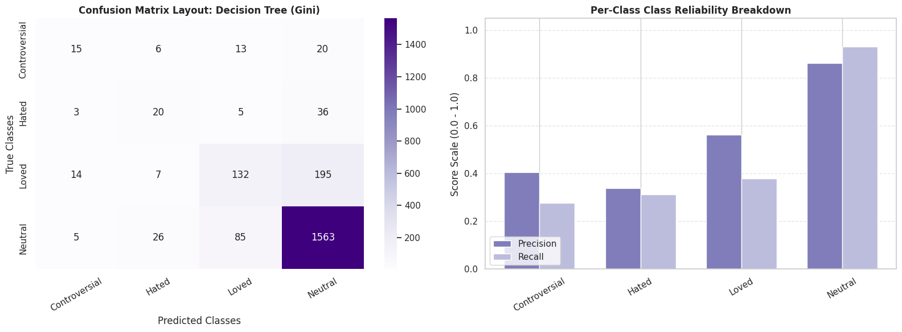
    


#### 📝 Model Analysis: Multiclass Decision Tree

* **Pronounced Structural Overfitting:** The tuning curve shows that as `Max Depth` exceeds 5, training F1 approaches a near-perfect 0.98 while test performance steadily degrades, confirming massive overfitting on noise.
* **Feature Constraint Benefits:** The `Max Features` analysis indicates that restricting available branch splits to a window of 8–9 features balances variance, pushing the test Macro F1-Score to its local peak of 0.4539.
* **Granular Non-Linear Partitions:** Non-linear branching improves minority class detection relative to linear baselines, safely elevating raw F1 scores to 0.2410 for `Controversial` and 0.2000 for `Hated`.
* **Fragile Boundary Discretization:** The multi-class `Log Loss` is high at 0.9161 because the deterministic leaf-node assignments generate sudden, rough probability boundaries rather than smooth transitions.

#### Effect of Criterion
Decision trees usually use one of the two popular choices for measuring information gain:

*   Gini impurity index
*   Entropy

Let's test Entropy now:


```python
# --- Multiclass Decision Tree (Entropy)---
dt_mc_entropy = DecisionTreeClassifier(criterion='entropy', max_depth=12, random_state=42)
dt_mc_entropy.fit(X_train_scaled_mc, y_train_mc)
```


<style>#sk-container-id-19 {
  /* Definition of color scheme common for light and dark mode */
  --sklearn-color-text: #000;
  --sklearn-color-text-muted: #666;
  --sklearn-color-line: gray;
  /* Definition of color scheme for unfitted estimators */
  --sklearn-color-unfitted-level-0: #fff5e6;
  --sklearn-color-unfitted-level-1: #f6e4d2;
  --sklearn-color-unfitted-level-2: #ffe0b3;
  --sklearn-color-unfitted-level-3: chocolate;
  /* Definition of color scheme for fitted estimators */
  --sklearn-color-fitted-level-0: #f0f8ff;
  --sklearn-color-fitted-level-1: #d4ebff;
  --sklearn-color-fitted-level-2: #b3dbfd;
  --sklearn-color-fitted-level-3: cornflowerblue;
}

#sk-container-id-19.light {
  /* Specific color for light theme */
  --sklearn-color-text-on-default-background: black;
  --sklearn-color-background: white;
  --sklearn-color-border-box: black;
  --sklearn-color-icon: #696969;
}

#sk-container-id-19.dark {
  --sklearn-color-text-on-default-background: white;
  --sklearn-color-background: #111;
  --sklearn-color-border-box: white;
  --sklearn-color-icon: #878787;
}

#sk-container-id-19 {
  color: var(--sklearn-color-text);
}

#sk-container-id-19 pre {
  padding: 0;
}

#sk-container-id-19 input.sk-hidden--visually {
  border: 0;
  clip: rect(1px 1px 1px 1px);
  clip: rect(1px, 1px, 1px, 1px);
  height: 1px;
  margin: -1px;
  overflow: hidden;
  padding: 0;
  position: absolute;
  width: 1px;
}

#sk-container-id-19 div.sk-dashed-wrapped {
  border: 1px dashed var(--sklearn-color-line);
  margin: 0 0.4em 0.5em 0.4em;
  box-sizing: border-box;
  padding-bottom: 0.4em;
  background-color: var(--sklearn-color-background);
}

#sk-container-id-19 div.sk-container {
  /* jupyter's `normalize.less` sets `[hidden] { display: none; }`
     but bootstrap.min.css set `[hidden] { display: none !important; }`
     so we also need the `!important` here to be able to override the
     default hidden behavior on the sphinx rendered scikit-learn.org.
     See: https://github.com/scikit-learn/scikit-learn/issues/21755 */
  display: inline-block !important;
  position: relative;
}

#sk-container-id-19 div.sk-text-repr-fallback {
  display: none;
}

div.sk-parallel-item,
div.sk-serial,
div.sk-item {
  /* draw centered vertical line to link estimators */
  background-image: linear-gradient(var(--sklearn-color-text-on-default-background), var(--sklearn-color-text-on-default-background));
  background-size: 2px 100%;
  background-repeat: no-repeat;
  background-position: center center;
}

/* Parallel-specific style estimator block */

#sk-container-id-19 div.sk-parallel-item::after {
  content: "";
  width: 100%;
  border-bottom: 2px solid var(--sklearn-color-text-on-default-background);
  flex-grow: 1;
}

#sk-container-id-19 div.sk-parallel {
  display: flex;
  align-items: stretch;
  justify-content: center;
  background-color: var(--sklearn-color-background);
  position: relative;
}

#sk-container-id-19 div.sk-parallel-item {
  display: flex;
  flex-direction: column;
}

#sk-container-id-19 div.sk-parallel-item:first-child::after {
  align-self: flex-end;
  width: 50%;
}

#sk-container-id-19 div.sk-parallel-item:last-child::after {
  align-self: flex-start;
  width: 50%;
}

#sk-container-id-19 div.sk-parallel-item:only-child::after {
  width: 0;
}

/* Serial-specific style estimator block */

#sk-container-id-19 div.sk-serial {
  display: flex;
  flex-direction: column;
  align-items: center;
  background-color: var(--sklearn-color-background);
  padding-right: 1em;
  padding-left: 1em;
}


/* Toggleable style: style used for estimator/Pipeline/ColumnTransformer box that is
clickable and can be expanded/collapsed.
- Pipeline and ColumnTransformer use this feature and define the default style
- Estimators will overwrite some part of the style using the `sk-estimator` class
*/

/* Pipeline and ColumnTransformer style (default) */

#sk-container-id-19 div.sk-toggleable {
  /* Default theme specific background. It is overwritten whether we have a
  specific estimator or a Pipeline/ColumnTransformer */
  background-color: var(--sklearn-color-background);
}

/* Toggleable label */
#sk-container-id-19 label.sk-toggleable__label {
  cursor: pointer;
  display: flex;
  width: 100%;
  margin-bottom: 0;
  padding: 0.5em;
  box-sizing: border-box;
  text-align: center;
  align-items: center;
  justify-content: center;
  gap: 0.5em;
}

#sk-container-id-19 label.sk-toggleable__label .caption {
  font-size: 0.6rem;
  font-weight: lighter;
  color: var(--sklearn-color-text-muted);
}

#sk-container-id-19 label.sk-toggleable__label-arrow:before {
  /* Arrow on the left of the label */
  content: "▸";
  float: left;
  margin-right: 0.25em;
  color: var(--sklearn-color-icon);
}

#sk-container-id-19 label.sk-toggleable__label-arrow:hover:before {
  color: var(--sklearn-color-text);
}

/* Toggleable content - dropdown */

#sk-container-id-19 div.sk-toggleable__content {
  display: none;
  text-align: left;
  /* unfitted */
  background-color: var(--sklearn-color-unfitted-level-0);
}

#sk-container-id-19 div.sk-toggleable__content.fitted {
  /* fitted */
  background-color: var(--sklearn-color-fitted-level-0);
}

#sk-container-id-19 div.sk-toggleable__content pre {
  margin: 0.2em;
  border-radius: 0.25em;
  color: var(--sklearn-color-text);
  /* unfitted */
  background-color: var(--sklearn-color-unfitted-level-0);
}

#sk-container-id-19 div.sk-toggleable__content.fitted pre {
  /* unfitted */
  background-color: var(--sklearn-color-fitted-level-0);
}

#sk-container-id-19 input.sk-toggleable__control:checked~div.sk-toggleable__content {
  /* Expand drop-down */
  display: block;
  width: 100%;
  overflow: visible;
}

#sk-container-id-19 input.sk-toggleable__control:checked~label.sk-toggleable__label-arrow:before {
  content: "▾";
}

/* Pipeline/ColumnTransformer-specific style */

#sk-container-id-19 div.sk-label input.sk-toggleable__control:checked~label.sk-toggleable__label {
  color: var(--sklearn-color-text);
  background-color: var(--sklearn-color-unfitted-level-2);
}

#sk-container-id-19 div.sk-label.fitted input.sk-toggleable__control:checked~label.sk-toggleable__label {
  background-color: var(--sklearn-color-fitted-level-2);
}

/* Estimator-specific style */

/* Colorize estimator box */
#sk-container-id-19 div.sk-estimator input.sk-toggleable__control:checked~label.sk-toggleable__label {
  /* unfitted */
  background-color: var(--sklearn-color-unfitted-level-2);
}

#sk-container-id-19 div.sk-estimator.fitted input.sk-toggleable__control:checked~label.sk-toggleable__label {
  /* fitted */
  background-color: var(--sklearn-color-fitted-level-2);
}

#sk-container-id-19 div.sk-label label.sk-toggleable__label,
#sk-container-id-19 div.sk-label label {
  /* The background is the default theme color */
  color: var(--sklearn-color-text-on-default-background);
}

/* On hover, darken the color of the background */
#sk-container-id-19 div.sk-label:hover label.sk-toggleable__label {
  color: var(--sklearn-color-text);
  background-color: var(--sklearn-color-unfitted-level-2);
}

/* Label box, darken color on hover, fitted */
#sk-container-id-19 div.sk-label.fitted:hover label.sk-toggleable__label.fitted {
  color: var(--sklearn-color-text);
  background-color: var(--sklearn-color-fitted-level-2);
}

/* Estimator label */

#sk-container-id-19 div.sk-label label {
  font-family: monospace;
  font-weight: bold;
  line-height: 1.2em;
}

#sk-container-id-19 div.sk-label-container {
  text-align: center;
}

/* Estimator-specific */
#sk-container-id-19 div.sk-estimator {
  font-family: monospace;
  border: 1px dotted var(--sklearn-color-border-box);
  border-radius: 0.25em;
  box-sizing: border-box;
  margin-bottom: 0.5em;
  /* unfitted */
  background-color: var(--sklearn-color-unfitted-level-0);
}

#sk-container-id-19 div.sk-estimator.fitted {
  /* fitted */
  background-color: var(--sklearn-color-fitted-level-0);
}

/* on hover */
#sk-container-id-19 div.sk-estimator:hover {
  /* unfitted */
  background-color: var(--sklearn-color-unfitted-level-2);
}

#sk-container-id-19 div.sk-estimator.fitted:hover {
  /* fitted */
  background-color: var(--sklearn-color-fitted-level-2);
}

/* Specification for estimator info (e.g. "i" and "?") */

/* Common style for "i" and "?" */

.sk-estimator-doc-link,
a:link.sk-estimator-doc-link,
a:visited.sk-estimator-doc-link {
  float: right;
  font-size: smaller;
  line-height: 1em;
  font-family: monospace;
  background-color: var(--sklearn-color-unfitted-level-0);
  border-radius: 1em;
  height: 1em;
  width: 1em;
  text-decoration: none !important;
  margin-left: 0.5em;
  text-align: center;
  /* unfitted */
  border: var(--sklearn-color-unfitted-level-3) 1pt solid;
  color: var(--sklearn-color-unfitted-level-3);
}

.sk-estimator-doc-link.fitted,
a:link.sk-estimator-doc-link.fitted,
a:visited.sk-estimator-doc-link.fitted {
  /* fitted */
  background-color: var(--sklearn-color-fitted-level-0);
  border: var(--sklearn-color-fitted-level-3) 1pt solid;
  color: var(--sklearn-color-fitted-level-3);
}

/* On hover */
div.sk-estimator:hover .sk-estimator-doc-link:hover,
.sk-estimator-doc-link:hover,
div.sk-label-container:hover .sk-estimator-doc-link:hover,
.sk-estimator-doc-link:hover {
  /* unfitted */
  background-color: var(--sklearn-color-unfitted-level-3);
  border: var(--sklearn-color-fitted-level-0) 1pt solid;
  color: var(--sklearn-color-unfitted-level-0);
  text-decoration: none;
}

div.sk-estimator.fitted:hover .sk-estimator-doc-link.fitted:hover,
.sk-estimator-doc-link.fitted:hover,
div.sk-label-container:hover .sk-estimator-doc-link.fitted:hover,
.sk-estimator-doc-link.fitted:hover {
  /* fitted */
  background-color: var(--sklearn-color-fitted-level-3);
  border: var(--sklearn-color-fitted-level-0) 1pt solid;
  color: var(--sklearn-color-fitted-level-0);
  text-decoration: none;
}

/* Span, style for the box shown on hovering the info icon */
.sk-estimator-doc-link span {
  display: none;
  z-index: 9999;
  position: relative;
  font-weight: normal;
  right: .2ex;
  padding: .5ex;
  margin: .5ex;
  width: min-content;
  min-width: 20ex;
  max-width: 50ex;
  color: var(--sklearn-color-text);
  box-shadow: 2pt 2pt 4pt #999;
  /* unfitted */
  background: var(--sklearn-color-unfitted-level-0);
  border: .5pt solid var(--sklearn-color-unfitted-level-3);
}

.sk-estimator-doc-link.fitted span {
  /* fitted */
  background: var(--sklearn-color-fitted-level-0);
  border: var(--sklearn-color-fitted-level-3);
}

.sk-estimator-doc-link:hover span {
  display: block;
}

/* "?"-specific style due to the `<a>` HTML tag */

#sk-container-id-19 a.estimator_doc_link {
  float: right;
  font-size: 1rem;
  line-height: 1em;
  font-family: monospace;
  background-color: var(--sklearn-color-unfitted-level-0);
  border-radius: 1rem;
  height: 1rem;
  width: 1rem;
  text-decoration: none;
  /* unfitted */
  color: var(--sklearn-color-unfitted-level-1);
  border: var(--sklearn-color-unfitted-level-1) 1pt solid;
}

#sk-container-id-19 a.estimator_doc_link.fitted {
  /* fitted */
  background-color: var(--sklearn-color-fitted-level-0);
  border: var(--sklearn-color-fitted-level-1) 1pt solid;
  color: var(--sklearn-color-fitted-level-1);
}

/* On hover */
#sk-container-id-19 a.estimator_doc_link:hover {
  /* unfitted */
  background-color: var(--sklearn-color-unfitted-level-3);
  color: var(--sklearn-color-background);
  text-decoration: none;
}

#sk-container-id-19 a.estimator_doc_link.fitted:hover {
  /* fitted */
  background-color: var(--sklearn-color-fitted-level-3);
}

.estimator-table {
    font-family: monospace;
}

.estimator-table summary {
    padding: .5rem;
    cursor: pointer;
}

.estimator-table summary::marker {
    font-size: 0.7rem;
}

.estimator-table details[open] {
    padding-left: 0.1rem;
    padding-right: 0.1rem;
    padding-bottom: 0.3rem;
}

.estimator-table .parameters-table {
    margin-left: auto !important;
    margin-right: auto !important;
    margin-top: 0;
}

.estimator-table .parameters-table tr:nth-child(odd) {
    background-color: #fff;
}

.estimator-table .parameters-table tr:nth-child(even) {
    background-color: #f6f6f6;
}

.estimator-table .parameters-table tr:hover {
    background-color: #e0e0e0;
}

.estimator-table table td {
    border: 1px solid rgba(106, 105, 104, 0.232);
}

/*
    `table td`is set in notebook with right text-align.
    We need to overwrite it.
*/
.estimator-table table td.param {
    text-align: left;
    position: relative;
    padding: 0;
}

.user-set td {
    color:rgb(255, 94, 0);
    text-align: left !important;
}

.user-set td.value {
    color:rgb(255, 94, 0);
    background-color: transparent;
}

.default td {
    color: black;
    text-align: left !important;
}

.user-set td i,
.default td i {
    color: black;
}

/*
    Styles for parameter documentation links
    We need styling for visited so jupyter doesn't overwrite it
*/
a.param-doc-link,
a.param-doc-link:link,
a.param-doc-link:visited {
    text-decoration: underline dashed;
    text-underline-offset: .3em;
    color: inherit;
    display: block;
    padding: .5em;
}

/* "hack" to make the entire area of the cell containing the link clickable */
a.param-doc-link::before {
    position: absolute;
    content: "";
    inset: 0;
}

.param-doc-description {
    display: none;
    position: absolute;
    z-index: 9999;
    left: 0;
    padding: .5ex;
    margin-left: 1.5em;
    color: var(--sklearn-color-text);
    box-shadow: .3em .3em .4em #999;
    width: max-content;
    text-align: left;
    max-height: 10em;
    overflow-y: auto;

    /* unfitted */
    background: var(--sklearn-color-unfitted-level-0);
    border: thin solid var(--sklearn-color-unfitted-level-3);
}

/* Fitted state for parameter tooltips */
.fitted .param-doc-description {
    /* fitted */
    background: var(--sklearn-color-fitted-level-0);
    border: thin solid var(--sklearn-color-fitted-level-3);
}

.param-doc-link:hover .param-doc-description {
    display: block;
}

.copy-paste-icon {
    background-image: url();
    background-repeat: no-repeat;
    background-size: 14px 14px;
    background-position: 0;
    display: inline-block;
    width: 14px;
    height: 14px;
    cursor: pointer;
}
</style><body><div id="sk-container-id-19" class="sk-top-container"><div class="sk-text-repr-fallback"><pre>DecisionTreeClassifier(criterion=&#x27;entropy&#x27;, max_depth=12, random_state=42)</pre><b>In a Jupyter environment, please rerun this cell to show the HTML representation or trust the notebook. <br />On GitHub, the HTML representation is unable to render, please try loading this page with nbviewer.org.</b></div><div class="sk-container" hidden><div class="sk-item"><div class="sk-estimator fitted sk-toggleable"><input class="sk-toggleable__control sk-hidden--visually" id="sk-estimator-id-29" type="checkbox" checked><label for="sk-estimator-id-29" class="sk-toggleable__label fitted sk-toggleable__label-arrow"><div><div>DecisionTreeClassifier</div></div><div><a class="sk-estimator-doc-link fitted" rel="noreferrer" target="_blank" href="https://scikit-learn.org/1.8/modules/generated/sklearn.tree.DecisionTreeClassifier.html">?<span>Documentation for DecisionTreeClassifier</span></a><span class="sk-estimator-doc-link fitted">i<span>Fitted</span></span></div></label><div class="sk-toggleable__content fitted" data-param-prefix="">
        <div class="estimator-table">
            <details>
                <summary>Parameters</summary>
                <table class="parameters-table">
                  <tbody>

        <tr class="user-set">
            <td><i class="copy-paste-icon"
                 onclick="copyToClipboard('criterion',
                          this.parentElement.nextElementSibling)"
            ></i></td>
            <td class="param">
        <a class="param-doc-link"
            rel="noreferrer" target="_blank" href="https://scikit-learn.org/1.8/modules/generated/sklearn.tree.DecisionTreeClassifier.html#:~:text=criterion,-%7B%22gini%22%2C%20%22entropy%22%2C%20%22log_loss%22%7D%2C%20default%3D%22gini%22">
            criterion
            <span class="param-doc-description">criterion: {"gini", "entropy", "log_loss"}, default="gini"<br><br>The function to measure the quality of a split. Supported criteria are<br>"gini" for the Gini impurity and "log_loss" and "entropy" both for the<br>Shannon information gain, see :ref:`tree_mathematical_formulation`.</span>
        </a>
    </td>
            <td class="value">&#x27;entropy&#x27;</td>
        </tr>


        <tr class="default">
            <td><i class="copy-paste-icon"
                 onclick="copyToClipboard('splitter',
                          this.parentElement.nextElementSibling)"
            ></i></td>
            <td class="param">
        <a class="param-doc-link"
            rel="noreferrer" target="_blank" href="https://scikit-learn.org/1.8/modules/generated/sklearn.tree.DecisionTreeClassifier.html#:~:text=splitter,-%7B%22best%22%2C%20%22random%22%7D%2C%20default%3D%22best%22">
            splitter
            <span class="param-doc-description">splitter: {"best", "random"}, default="best"<br><br>The strategy used to choose the split at each node. Supported<br>strategies are "best" to choose the best split and "random" to choose<br>the best random split.</span>
        </a>
    </td>
            <td class="value">&#x27;best&#x27;</td>
        </tr>


        <tr class="user-set">
            <td><i class="copy-paste-icon"
                 onclick="copyToClipboard('max_depth',
                          this.parentElement.nextElementSibling)"
            ></i></td>
            <td class="param">
        <a class="param-doc-link"
            rel="noreferrer" target="_blank" href="https://scikit-learn.org/1.8/modules/generated/sklearn.tree.DecisionTreeClassifier.html#:~:text=max_depth,-int%2C%20default%3DNone">
            max_depth
            <span class="param-doc-description">max_depth: int, default=None<br><br>The maximum depth of the tree. If None, then nodes are expanded until<br>all leaves are pure or until all leaves contain less than<br>min_samples_split samples.</span>
        </a>
    </td>
            <td class="value">12</td>
        </tr>


        <tr class="default">
            <td><i class="copy-paste-icon"
                 onclick="copyToClipboard('min_samples_split',
                          this.parentElement.nextElementSibling)"
            ></i></td>
            <td class="param">
        <a class="param-doc-link"
            rel="noreferrer" target="_blank" href="https://scikit-learn.org/1.8/modules/generated/sklearn.tree.DecisionTreeClassifier.html#:~:text=min_samples_split,-int%20or%20float%2C%20default%3D2">
            min_samples_split
            <span class="param-doc-description">min_samples_split: int or float, default=2<br><br>The minimum number of samples required to split an internal node:<br><br>- If int, then consider `min_samples_split` as the minimum number.<br>- If float, then `min_samples_split` is a fraction and<br>  `ceil(min_samples_split * n_samples)` are the minimum<br>  number of samples for each split.<br><br>.. versionchanged:: 0.18<br>   Added float values for fractions.</span>
        </a>
    </td>
            <td class="value">2</td>
        </tr>


        <tr class="default">
            <td><i class="copy-paste-icon"
                 onclick="copyToClipboard('min_samples_leaf',
                          this.parentElement.nextElementSibling)"
            ></i></td>
            <td class="param">
        <a class="param-doc-link"
            rel="noreferrer" target="_blank" href="https://scikit-learn.org/1.8/modules/generated/sklearn.tree.DecisionTreeClassifier.html#:~:text=min_samples_leaf,-int%20or%20float%2C%20default%3D1">
            min_samples_leaf
            <span class="param-doc-description">min_samples_leaf: int or float, default=1<br><br>The minimum number of samples required to be at a leaf node.<br>A split point at any depth will only be considered if it leaves at<br>least ``min_samples_leaf`` training samples in each of the left and<br>right branches.  This may have the effect of smoothing the model,<br>especially in regression.<br><br>- If int, then consider `min_samples_leaf` as the minimum number.<br>- If float, then `min_samples_leaf` is a fraction and<br>  `ceil(min_samples_leaf * n_samples)` are the minimum<br>  number of samples for each node.<br><br>.. versionchanged:: 0.18<br>   Added float values for fractions.</span>
        </a>
    </td>
            <td class="value">1</td>
        </tr>


        <tr class="default">
            <td><i class="copy-paste-icon"
                 onclick="copyToClipboard('min_weight_fraction_leaf',
                          this.parentElement.nextElementSibling)"
            ></i></td>
            <td class="param">
        <a class="param-doc-link"
            rel="noreferrer" target="_blank" href="https://scikit-learn.org/1.8/modules/generated/sklearn.tree.DecisionTreeClassifier.html#:~:text=min_weight_fraction_leaf,-float%2C%20default%3D0.0">
            min_weight_fraction_leaf
            <span class="param-doc-description">min_weight_fraction_leaf: float, default=0.0<br><br>The minimum weighted fraction of the sum total of weights (of all<br>the input samples) required to be at a leaf node. Samples have<br>equal weight when sample_weight is not provided.</span>
        </a>
    </td>
            <td class="value">0.0</td>
        </tr>


        <tr class="default">
            <td><i class="copy-paste-icon"
                 onclick="copyToClipboard('max_features',
                          this.parentElement.nextElementSibling)"
            ></i></td>
            <td class="param">
        <a class="param-doc-link"
            rel="noreferrer" target="_blank" href="https://scikit-learn.org/1.8/modules/generated/sklearn.tree.DecisionTreeClassifier.html#:~:text=max_features,-int%2C%20float%20or%20%7B%22sqrt%22%2C%20%22log2%22%7D%2C%20default%3DNone">
            max_features
            <span class="param-doc-description">max_features: int, float or {"sqrt", "log2"}, default=None<br><br>The number of features to consider when looking for the best split:<br><br>- If int, then consider `max_features` features at each split.<br>- If float, then `max_features` is a fraction and<br>  `max(1, int(max_features * n_features_in_))` features are considered at<br>  each split.<br>- If "sqrt", then `max_features=sqrt(n_features)`.<br>- If "log2", then `max_features=log2(n_features)`.<br>- If None, then `max_features=n_features`.<br><br>.. note::<br><br>    The search for a split does not stop until at least one<br>    valid partition of the node samples is found, even if it requires to<br>    effectively inspect more than ``max_features`` features.</span>
        </a>
    </td>
            <td class="value">None</td>
        </tr>


        <tr class="user-set">
            <td><i class="copy-paste-icon"
                 onclick="copyToClipboard('random_state',
                          this.parentElement.nextElementSibling)"
            ></i></td>
            <td class="param">
        <a class="param-doc-link"
            rel="noreferrer" target="_blank" href="https://scikit-learn.org/1.8/modules/generated/sklearn.tree.DecisionTreeClassifier.html#:~:text=random_state,-int%2C%20RandomState%20instance%20or%20None%2C%20default%3DNone">
            random_state
            <span class="param-doc-description">random_state: int, RandomState instance or None, default=None<br><br>Controls the randomness of the estimator. The features are always<br>randomly permuted at each split, even if ``splitter`` is set to<br>``"best"``. When ``max_features < n_features``, the algorithm will<br>select ``max_features`` at random at each split before finding the best<br>split among them. But the best found split may vary across different<br>runs, even if ``max_features=n_features``. That is the case, if the<br>improvement of the criterion is identical for several splits and one<br>split has to be selected at random. To obtain a deterministic behaviour<br>during fitting, ``random_state`` has to be fixed to an integer.<br>See :term:`Glossary <random_state>` for details.</span>
        </a>
    </td>
            <td class="value">42</td>
        </tr>


        <tr class="default">
            <td><i class="copy-paste-icon"
                 onclick="copyToClipboard('max_leaf_nodes',
                          this.parentElement.nextElementSibling)"
            ></i></td>
            <td class="param">
        <a class="param-doc-link"
            rel="noreferrer" target="_blank" href="https://scikit-learn.org/1.8/modules/generated/sklearn.tree.DecisionTreeClassifier.html#:~:text=max_leaf_nodes,-int%2C%20default%3DNone">
            max_leaf_nodes
            <span class="param-doc-description">max_leaf_nodes: int, default=None<br><br>Grow a tree with ``max_leaf_nodes`` in best-first fashion.<br>Best nodes are defined as relative reduction in impurity.<br>If None then unlimited number of leaf nodes.</span>
        </a>
    </td>
            <td class="value">None</td>
        </tr>


        <tr class="default">
            <td><i class="copy-paste-icon"
                 onclick="copyToClipboard('min_impurity_decrease',
                          this.parentElement.nextElementSibling)"
            ></i></td>
            <td class="param">
        <a class="param-doc-link"
            rel="noreferrer" target="_blank" href="https://scikit-learn.org/1.8/modules/generated/sklearn.tree.DecisionTreeClassifier.html#:~:text=min_impurity_decrease,-float%2C%20default%3D0.0">
            min_impurity_decrease
            <span class="param-doc-description">min_impurity_decrease: float, default=0.0<br><br>A node will be split if this split induces a decrease of the impurity<br>greater than or equal to this value.<br><br>The weighted impurity decrease equation is the following::<br><br>    N_t / N * (impurity - N_t_R / N_t * right_impurity<br>                        - N_t_L / N_t * left_impurity)<br><br>where ``N`` is the total number of samples, ``N_t`` is the number of<br>samples at the current node, ``N_t_L`` is the number of samples in the<br>left child, and ``N_t_R`` is the number of samples in the right child.<br><br>``N``, ``N_t``, ``N_t_R`` and ``N_t_L`` all refer to the weighted sum,<br>if ``sample_weight`` is passed.<br><br>.. versionadded:: 0.19</span>
        </a>
    </td>
            <td class="value">0.0</td>
        </tr>


        <tr class="default">
            <td><i class="copy-paste-icon"
                 onclick="copyToClipboard('class_weight',
                          this.parentElement.nextElementSibling)"
            ></i></td>
            <td class="param">
        <a class="param-doc-link"
            rel="noreferrer" target="_blank" href="https://scikit-learn.org/1.8/modules/generated/sklearn.tree.DecisionTreeClassifier.html#:~:text=class_weight,-dict%2C%20list%20of%20dict%20or%20%22balanced%22%2C%20default%3DNone">
            class_weight
            <span class="param-doc-description">class_weight: dict, list of dict or "balanced", default=None<br><br>Weights associated with classes in the form ``{class_label: weight}``.<br>If None, all classes are supposed to have weight one. For<br>multi-output problems, a list of dicts can be provided in the same<br>order as the columns of y.<br><br>Note that for multioutput (including multilabel) weights should be<br>defined for each class of every column in its own dict. For example,<br>for four-class multilabel classification weights should be<br>[{0: 1, 1: 1}, {0: 1, 1: 5}, {0: 1, 1: 1}, {0: 1, 1: 1}] instead of<br>[{1:1}, {2:5}, {3:1}, {4:1}].<br><br>The "balanced" mode uses the values of y to automatically adjust<br>weights inversely proportional to class frequencies in the input data<br>as ``n_samples / (n_classes * np.bincount(y))``<br><br>For multi-output, the weights of each column of y will be multiplied.<br><br>Note that these weights will be multiplied with sample_weight (passed<br>through the fit method) if sample_weight is specified.</span>
        </a>
    </td>
            <td class="value">None</td>
        </tr>


        <tr class="default">
            <td><i class="copy-paste-icon"
                 onclick="copyToClipboard('ccp_alpha',
                          this.parentElement.nextElementSibling)"
            ></i></td>
            <td class="param">
        <a class="param-doc-link"
            rel="noreferrer" target="_blank" href="https://scikit-learn.org/1.8/modules/generated/sklearn.tree.DecisionTreeClassifier.html#:~:text=ccp_alpha,-non-negative%20float%2C%20default%3D0.0">
            ccp_alpha
            <span class="param-doc-description">ccp_alpha: non-negative float, default=0.0<br><br>Complexity parameter used for Minimal Cost-Complexity Pruning. The<br>subtree with the largest cost complexity that is smaller than<br>``ccp_alpha`` will be chosen. By default, no pruning is performed. See<br>:ref:`minimal_cost_complexity_pruning` for details. See<br>:ref:`sphx_glr_auto_examples_tree_plot_cost_complexity_pruning.py`<br>for an example of such pruning.<br><br>.. versionadded:: 0.22</span>
        </a>
    </td>
            <td class="value">0.0</td>
        </tr>


        <tr class="default">
            <td><i class="copy-paste-icon"
                 onclick="copyToClipboard('monotonic_cst',
                          this.parentElement.nextElementSibling)"
            ></i></td>
            <td class="param">
        <a class="param-doc-link"
            rel="noreferrer" target="_blank" href="https://scikit-learn.org/1.8/modules/generated/sklearn.tree.DecisionTreeClassifier.html#:~:text=monotonic_cst,-array-like%20of%20int%20of%20shape%20%28n_features%29%2C%20default%3DNone">
            monotonic_cst
            <span class="param-doc-description">monotonic_cst: array-like of int of shape (n_features), default=None<br><br>Indicates the monotonicity constraint to enforce on each feature.<br>  - 1: monotonic increase<br>  - 0: no constraint<br>  - -1: monotonic decrease<br><br>If monotonic_cst is None, no constraints are applied.<br><br>Monotonicity constraints are not supported for:<br>  - multiclass classifications (i.e. when `n_classes > 2`),<br>  - multioutput classifications (i.e. when `n_outputs_ > 1`),<br>  - classifications trained on data with missing values.<br><br>The constraints hold over the probability of the positive class.<br><br>Read more in the :ref:`User Guide <monotonic_cst_gbdt>`.<br><br>.. versionadded:: 1.4</span>
        </a>
    </td>
            <td class="value">None</td>
        </tr>

                  </tbody>
                </table>
            </details>
        </div>
    </div></div></div></div></div><script>function copyToClipboard(text, element) {
    // Get the parameter prefix from the closest toggleable content
    const toggleableContent = element.closest('.sk-toggleable__content');
    const paramPrefix = toggleableContent ? toggleableContent.dataset.paramPrefix : '';
    const fullParamName = paramPrefix ? `${paramPrefix}${text}` : text;

    const originalStyle = element.style;
    const computedStyle = window.getComputedStyle(element);
    const originalWidth = computedStyle.width;
    const originalHTML = element.innerHTML.replace('Copied!', '');

    navigator.clipboard.writeText(fullParamName)
        .then(() => {
            element.style.width = originalWidth;
            element.style.color = 'green';
            element.innerHTML = "Copied!";

            setTimeout(() => {
                element.innerHTML = originalHTML;
                element.style = originalStyle;
            }, 2000);
        })
        .catch(err => {
            console.error('Failed to copy:', err);
            element.style.color = 'red';
            element.innerHTML = "Failed!";
            setTimeout(() => {
                element.innerHTML = originalHTML;
                element.style = originalStyle;
            }, 2000);
        });
    return false;
}

document.querySelectorAll('.copy-paste-icon').forEach(function(element) {
    const toggleableContent = element.closest('.sk-toggleable__content');
    const paramPrefix = toggleableContent ? toggleableContent.dataset.paramPrefix : '';
    const paramName = element.parentElement.nextElementSibling
        .textContent.trim().split(' ')[0];
    const fullParamName = paramPrefix ? `${paramPrefix}${paramName}` : paramName;

    element.setAttribute('title', fullParamName);
});


/**
 * Adapted from Skrub
 * https://github.com/skrub-data/skrub/blob/403466d1d5d4dc76a7ef569b3f8228db59a31dc3/skrub/_reporting/_data/templates/report.js#L789
 * @returns "light" or "dark"
 */
function detectTheme(element) {
    const body = document.querySelector('body');

    // Check VSCode theme
    const themeKindAttr = body.getAttribute('data-vscode-theme-kind');
    const themeNameAttr = body.getAttribute('data-vscode-theme-name');

    if (themeKindAttr && themeNameAttr) {
        const themeKind = themeKindAttr.toLowerCase();
        const themeName = themeNameAttr.toLowerCase();

        if (themeKind.includes("dark") || themeName.includes("dark")) {
            return "dark";
        }
        if (themeKind.includes("light") || themeName.includes("light")) {
            return "light";
        }
    }

    // Check Jupyter theme
    if (body.getAttribute('data-jp-theme-light') === 'false') {
        return 'dark';
    } else if (body.getAttribute('data-jp-theme-light') === 'true') {
        return 'light';
    }

    // Guess based on a parent element's color
    const color = window.getComputedStyle(element.parentNode, null).getPropertyValue('color');
    const match = color.match(/^rgb\s*\(\s*(\d+)\s*,\s*(\d+)\s*,\s*(\d+)\s*\)\s*$/i);
    if (match) {
        const [r, g, b] = [
            parseFloat(match[1]),
            parseFloat(match[2]),
            parseFloat(match[3])
        ];

        // https://en.wikipedia.org/wiki/HSL_and_HSV#Lightness
        const luma = 0.299 * r + 0.587 * g + 0.114 * b;

        if (luma > 180) {
            // If the text is very bright we have a dark theme
            return 'dark';
        }
        if (luma < 75) {
            // If the text is very dark we have a light theme
            return 'light';
        }
        // Otherwise fall back to the next heuristic.
    }

    // Fallback to system preference
    return window.matchMedia('(prefers-color-scheme: dark)').matches ? 'dark' : 'light';
}


function forceTheme(elementId) {
    const estimatorElement = document.querySelector(`#${elementId}`);
    if (estimatorElement === null) {
        console.error(`Element with id ${elementId} not found.`);
    } else {
        const theme = detectTheme(estimatorElement);
        estimatorElement.classList.add(theme);
    }
}

forceTheme('sk-container-id-19');</script></body>


```python
y_pred_dt_entropy_mc = dt_mc_entropy.predict(X_test_scaled_mc)
y_prob_dt_entropy_mc = dt_mc_entropy.predict_proba(X_test_scaled_mc)

evaluate_multiclass("Decision Tree (Entropy)", y_test_mc, y_pred_dt_entropy_mc, y_prob=y_prob_dt_entropy_mc, labels=mc_labels)
```

    
    ============================================================
    🌟 Multiclass Evaluation: Decision Tree (Entropy)
    ============================================================
    🔸 Accuracy:            0.8009
    🔸 F1-Score (Macro):    0.4876
    🔸 F1-Score (Micro):    0.8009
    🔸 F1-Score (Weighted): 0.7864
    🔸 Log Loss:            3.3545
    
    📋 Detailed Per-Class Report:


<style type="text/css">
#T_fef15_row0_col0, #T_fef15_row1_col1, #T_fef15_row1_col2 {
  background-color: #fcfbfd;
  color: #000000;
}
#T_fef15_row0_col1 {
  background-color: #ecebf4;
  color: #000000;
}
#T_fef15_row0_col2, #T_fef15_row1_col0 {
  background-color: #f5f3f8;
  color: #000000;
}
#T_fef15_row2_col0 {
  background-color: #b4b4d7;
  color: #000000;
}
#T_fef15_row2_col1 {
  background-color: #e2e2ef;
  color: #000000;
}
#T_fef15_row2_col2 {
  background-color: #d8d8ea;
  color: #000000;
}
#T_fef15_row3_col0, #T_fef15_row3_col1, #T_fef15_row3_col2 {
  background-color: #3f007d;
  color: #f1f1f1;
}
</style>
<table id="T_fef15">
  <thead>
    <tr>
      <th class="blank level0" >&nbsp;</th>
      <th id="T_fef15_level0_col0" class="col_heading level0 col0" >Precision</th>
      <th id="T_fef15_level0_col1" class="col_heading level0 col1" >Recall</th>
      <th id="T_fef15_level0_col2" class="col_heading level0 col2" >F1-Score</th>
      <th id="T_fef15_level0_col3" class="col_heading level0 col3" >Support</th>
    </tr>
  </thead>
  <tbody>
    <tr>
      <th id="T_fef15_level0_row0" class="row_heading level0 row0" >Controversial</th>
      <td id="T_fef15_row0_col0" class="data row0 col0" >0.3273</td>
      <td id="T_fef15_row0_col1" class="data row0 col1" >0.3333</td>
      <td id="T_fef15_row0_col2" class="data row0 col2" >0.3303</td>
      <td id="T_fef15_row0_col3" class="data row0 col3" >54</td>
    </tr>
    <tr>
      <th id="T_fef15_level0_row1" class="row_heading level0 row1" >Hated</th>
      <td id="T_fef15_row1_col0" class="data row1 col0" >0.3659</td>
      <td id="T_fef15_row1_col1" class="data row1 col1" >0.2344</td>
      <td id="T_fef15_row1_col2" class="data row1 col2" >0.2857</td>
      <td id="T_fef15_row1_col3" class="data row1 col3" >64</td>
    </tr>
    <tr>
      <th id="T_fef15_level0_row2" class="row_heading level0 row2" >Loved</th>
      <td id="T_fef15_row2_col0" class="data row2 col0" >0.5439</td>
      <td id="T_fef15_row2_col1" class="data row2 col1" >0.3736</td>
      <td id="T_fef15_row2_col2" class="data row2 col2" >0.4429</td>
      <td id="T_fef15_row2_col3" class="data row2 col3" >348</td>
    </tr>
    <tr>
      <th id="T_fef15_level0_row3" class="row_heading level0 row3" >Neutral</th>
      <td id="T_fef15_row3_col0" class="data row3 col0" >0.8591</td>
      <td id="T_fef15_row3_col1" class="data row3 col1" >0.9261</td>
      <td id="T_fef15_row3_col2" class="data row3 col2" >0.8914</td>
      <td id="T_fef15_row3_col3" class="data row3 col3" >1,679</td>
    </tr>
  </tbody>
</table>


    

    


**So in here we actually have got a better result using `Entropy` than `Gini`, But if you have remembered we got the exact oposite result in Binary Classification with these two!**

**Bad News:**
>After changing the depth from `7` to `12` the entropy got Worse than Gini.
>
>Got a little bit exited too soon :(

#### Effect of Max-Depth 🐳
Setting Max-Depth too low will results in a not so accurate decision tree. On the other hand, if it is too high, the decision tree will overfit on the training set and perform poorly on the test set.


```python
scores = []
depths_list = []
scores_train = []

for depth in range(1, 40):
    depths_list.append(depth)
    model = DecisionTreeClassifier(criterion='gini', max_depth=depth, random_state=42)
    model.fit(X_train_scaled_mc, y_train_mc)
    
    predictions_train = model.predict(X_train_scaled_mc)
    F1_train = f1_score(y_train_mc, predictions_train, average='macro')
    scores_train.append(F1_train)
    
    predictions = model.predict(X_test_scaled_mc)
    F1 = f1_score(y_test_mc, predictions, average='macro')
    scores.append(F1)

plt.figure(figsize=(20, 8))
plt.plot(depths_list, scores, lw=5, label='F1: Test Set')
plt.plot(depths_list, scores_train, lw=5, color='orange', label='F1: Train Set')
plt.xlabel('Max Depth of the Tree')
plt.ylabel('F1-Score (Macro)')
plt.title('Decision Tree Hyperparameter Tuning: Max Depth vs Macro F1')
plt.xticks(depths_list)
plt.legend()
plt.grid(True, linestyle='--', alpha=0.6)
plt.show()
```


    
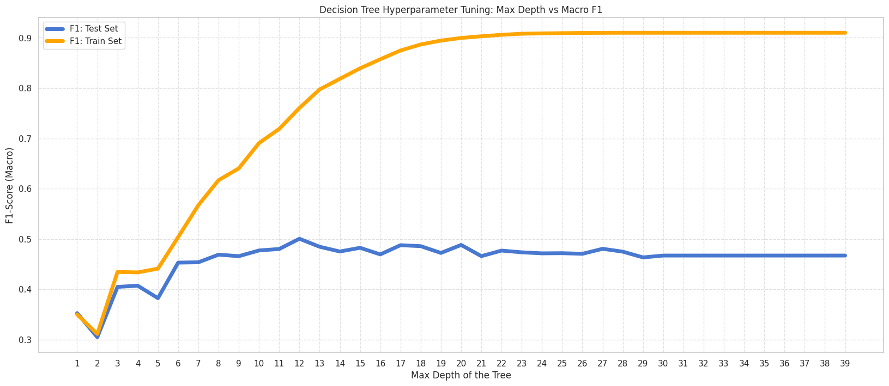
    


#### 🆒 Visualizing the Tree 🌳
> Cool part, Once again !


```python
# --- Multiclass Decision Tree ---
dt_2 = DecisionTreeClassifier(criterion='gini', max_depth=2, random_state=42)
dt_2.fit(X_train_scaled_mc, y_train_mc)

fig, axes = plt.subplots(nrows = 1,ncols = 1,figsize = (20,10))
tree.plot_tree(dt_2,feature_names = labels, filled = True,fontsize=12)
```


    [Text(0.5, 0.8333333333333334, 'num_senders <= 0.344\ngini = 0.359\nsamples = 8580\nvalue = [214, 257, 1390, 6719]'),
     Text(0.25, 0.5, 'artists_total_reactions <= -0.554\ngini = 0.245\nsamples = 7279\nvalue = [66, 221, 712, 6280]'),
     Text(0.375, 0.6666666666666667, 'True  '),
     Text(0.125, 0.16666666666666666, 'gini = 0.031\nsamples = 1925\nvalue = [2, 14, 14, 1895]'),
     Text(0.375, 0.16666666666666666, 'gini = 0.311\nsamples = 5354\nvalue = [64.0, 207.0, 698.0, 4385.0]'),
     Text(0.75, 0.5, 'num_senders <= 1.702\ngini = 0.601\nsamples = 1301\nvalue = [148, 36, 678, 439]'),
     Text(0.625, 0.6666666666666667, '  False'),
     Text(0.625, 0.16666666666666666, 'gini = 0.597\nsamples = 856\nvalue = [66.0, 29.0, 360.0, 401.0]'),
     Text(0.875, 0.16666666666666666, 'gini = 0.448\nsamples = 445\nvalue = [82, 7, 318, 38]')]


    
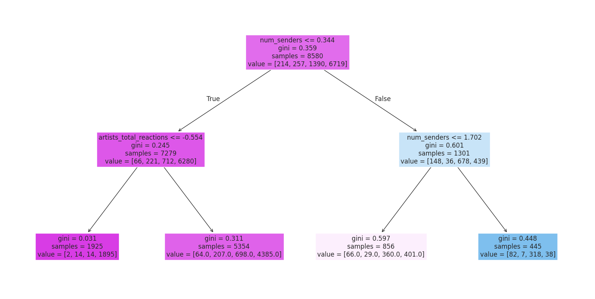
    


### 3.5 Advanced Boosting Techniques & Random Forest 

Boosting iteratively applies weights to incorrect classifications, allowing sequential models to specialize in correcting the errors of their predecessors. We'll run **XGBoost, LightGBM, AdaBoost, CatBoost** alongside a standard parallel ensemble **Random Forest**.

#### Random Forest 🌳🌲🌳


```python
# --- Random Forest (Parallel Ensemble) ---
rf_mc = RandomForestClassifier(n_estimators=150, max_depth=8, random_state=42)
rf_mc.fit(X_train_scaled_mc, y_train_mc)
```


<style>#sk-container-id-20 {
  /* Definition of color scheme common for light and dark mode */
  --sklearn-color-text: #000;
  --sklearn-color-text-muted: #666;
  --sklearn-color-line: gray;
  /* Definition of color scheme for unfitted estimators */
  --sklearn-color-unfitted-level-0: #fff5e6;
  --sklearn-color-unfitted-level-1: #f6e4d2;
  --sklearn-color-unfitted-level-2: #ffe0b3;
  --sklearn-color-unfitted-level-3: chocolate;
  /* Definition of color scheme for fitted estimators */
  --sklearn-color-fitted-level-0: #f0f8ff;
  --sklearn-color-fitted-level-1: #d4ebff;
  --sklearn-color-fitted-level-2: #b3dbfd;
  --sklearn-color-fitted-level-3: cornflowerblue;
}

#sk-container-id-20.light {
  /* Specific color for light theme */
  --sklearn-color-text-on-default-background: black;
  --sklearn-color-background: white;
  --sklearn-color-border-box: black;
  --sklearn-color-icon: #696969;
}

#sk-container-id-20.dark {
  --sklearn-color-text-on-default-background: white;
  --sklearn-color-background: #111;
  --sklearn-color-border-box: white;
  --sklearn-color-icon: #878787;
}

#sk-container-id-20 {
  color: var(--sklearn-color-text);
}

#sk-container-id-20 pre {
  padding: 0;
}

#sk-container-id-20 input.sk-hidden--visually {
  border: 0;
  clip: rect(1px 1px 1px 1px);
  clip: rect(1px, 1px, 1px, 1px);
  height: 1px;
  margin: -1px;
  overflow: hidden;
  padding: 0;
  position: absolute;
  width: 1px;
}

#sk-container-id-20 div.sk-dashed-wrapped {
  border: 1px dashed var(--sklearn-color-line);
  margin: 0 0.4em 0.5em 0.4em;
  box-sizing: border-box;
  padding-bottom: 0.4em;
  background-color: var(--sklearn-color-background);
}

#sk-container-id-20 div.sk-container {
  /* jupyter's `normalize.less` sets `[hidden] { display: none; }`
     but bootstrap.min.css set `[hidden] { display: none !important; }`
     so we also need the `!important` here to be able to override the
     default hidden behavior on the sphinx rendered scikit-learn.org.
     See: https://github.com/scikit-learn/scikit-learn/issues/21755 */
  display: inline-block !important;
  position: relative;
}

#sk-container-id-20 div.sk-text-repr-fallback {
  display: none;
}

div.sk-parallel-item,
div.sk-serial,
div.sk-item {
  /* draw centered vertical line to link estimators */
  background-image: linear-gradient(var(--sklearn-color-text-on-default-background), var(--sklearn-color-text-on-default-background));
  background-size: 2px 100%;
  background-repeat: no-repeat;
  background-position: center center;
}

/* Parallel-specific style estimator block */

#sk-container-id-20 div.sk-parallel-item::after {
  content: "";
  width: 100%;
  border-bottom: 2px solid var(--sklearn-color-text-on-default-background);
  flex-grow: 1;
}

#sk-container-id-20 div.sk-parallel {
  display: flex;
  align-items: stretch;
  justify-content: center;
  background-color: var(--sklearn-color-background);
  position: relative;
}

#sk-container-id-20 div.sk-parallel-item {
  display: flex;
  flex-direction: column;
}

#sk-container-id-20 div.sk-parallel-item:first-child::after {
  align-self: flex-end;
  width: 50%;
}

#sk-container-id-20 div.sk-parallel-item:last-child::after {
  align-self: flex-start;
  width: 50%;
}

#sk-container-id-20 div.sk-parallel-item:only-child::after {
  width: 0;
}

/* Serial-specific style estimator block */

#sk-container-id-20 div.sk-serial {
  display: flex;
  flex-direction: column;
  align-items: center;
  background-color: var(--sklearn-color-background);
  padding-right: 1em;
  padding-left: 1em;
}


/* Toggleable style: style used for estimator/Pipeline/ColumnTransformer box that is
clickable and can be expanded/collapsed.
- Pipeline and ColumnTransformer use this feature and define the default style
- Estimators will overwrite some part of the style using the `sk-estimator` class
*/

/* Pipeline and ColumnTransformer style (default) */

#sk-container-id-20 div.sk-toggleable {
  /* Default theme specific background. It is overwritten whether we have a
  specific estimator or a Pipeline/ColumnTransformer */
  background-color: var(--sklearn-color-background);
}

/* Toggleable label */
#sk-container-id-20 label.sk-toggleable__label {
  cursor: pointer;
  display: flex;
  width: 100%;
  margin-bottom: 0;
  padding: 0.5em;
  box-sizing: border-box;
  text-align: center;
  align-items: center;
  justify-content: center;
  gap: 0.5em;
}

#sk-container-id-20 label.sk-toggleable__label .caption {
  font-size: 0.6rem;
  font-weight: lighter;
  color: var(--sklearn-color-text-muted);
}

#sk-container-id-20 label.sk-toggleable__label-arrow:before {
  /* Arrow on the left of the label */
  content: "▸";
  float: left;
  margin-right: 0.25em;
  color: var(--sklearn-color-icon);
}

#sk-container-id-20 label.sk-toggleable__label-arrow:hover:before {
  color: var(--sklearn-color-text);
}

/* Toggleable content - dropdown */

#sk-container-id-20 div.sk-toggleable__content {
  display: none;
  text-align: left;
  /* unfitted */
  background-color: var(--sklearn-color-unfitted-level-0);
}

#sk-container-id-20 div.sk-toggleable__content.fitted {
  /* fitted */
  background-color: var(--sklearn-color-fitted-level-0);
}

#sk-container-id-20 div.sk-toggleable__content pre {
  margin: 0.2em;
  border-radius: 0.25em;
  color: var(--sklearn-color-text);
  /* unfitted */
  background-color: var(--sklearn-color-unfitted-level-0);
}

#sk-container-id-20 div.sk-toggleable__content.fitted pre {
  /* unfitted */
  background-color: var(--sklearn-color-fitted-level-0);
}

#sk-container-id-20 input.sk-toggleable__control:checked~div.sk-toggleable__content {
  /* Expand drop-down */
  display: block;
  width: 100%;
  overflow: visible;
}

#sk-container-id-20 input.sk-toggleable__control:checked~label.sk-toggleable__label-arrow:before {
  content: "▾";
}

/* Pipeline/ColumnTransformer-specific style */

#sk-container-id-20 div.sk-label input.sk-toggleable__control:checked~label.sk-toggleable__label {
  color: var(--sklearn-color-text);
  background-color: var(--sklearn-color-unfitted-level-2);
}

#sk-container-id-20 div.sk-label.fitted input.sk-toggleable__control:checked~label.sk-toggleable__label {
  background-color: var(--sklearn-color-fitted-level-2);
}

/* Estimator-specific style */

/* Colorize estimator box */
#sk-container-id-20 div.sk-estimator input.sk-toggleable__control:checked~label.sk-toggleable__label {
  /* unfitted */
  background-color: var(--sklearn-color-unfitted-level-2);
}

#sk-container-id-20 div.sk-estimator.fitted input.sk-toggleable__control:checked~label.sk-toggleable__label {
  /* fitted */
  background-color: var(--sklearn-color-fitted-level-2);
}

#sk-container-id-20 div.sk-label label.sk-toggleable__label,
#sk-container-id-20 div.sk-label label {
  /* The background is the default theme color */
  color: var(--sklearn-color-text-on-default-background);
}

/* On hover, darken the color of the background */
#sk-container-id-20 div.sk-label:hover label.sk-toggleable__label {
  color: var(--sklearn-color-text);
  background-color: var(--sklearn-color-unfitted-level-2);
}

/* Label box, darken color on hover, fitted */
#sk-container-id-20 div.sk-label.fitted:hover label.sk-toggleable__label.fitted {
  color: var(--sklearn-color-text);
  background-color: var(--sklearn-color-fitted-level-2);
}

/* Estimator label */

#sk-container-id-20 div.sk-label label {
  font-family: monospace;
  font-weight: bold;
  line-height: 1.2em;
}

#sk-container-id-20 div.sk-label-container {
  text-align: center;
}

/* Estimator-specific */
#sk-container-id-20 div.sk-estimator {
  font-family: monospace;
  border: 1px dotted var(--sklearn-color-border-box);
  border-radius: 0.25em;
  box-sizing: border-box;
  margin-bottom: 0.5em;
  /* unfitted */
  background-color: var(--sklearn-color-unfitted-level-0);
}

#sk-container-id-20 div.sk-estimator.fitted {
  /* fitted */
  background-color: var(--sklearn-color-fitted-level-0);
}

/* on hover */
#sk-container-id-20 div.sk-estimator:hover {
  /* unfitted */
  background-color: var(--sklearn-color-unfitted-level-2);
}

#sk-container-id-20 div.sk-estimator.fitted:hover {
  /* fitted */
  background-color: var(--sklearn-color-fitted-level-2);
}

/* Specification for estimator info (e.g. "i" and "?") */

/* Common style for "i" and "?" */

.sk-estimator-doc-link,
a:link.sk-estimator-doc-link,
a:visited.sk-estimator-doc-link {
  float: right;
  font-size: smaller;
  line-height: 1em;
  font-family: monospace;
  background-color: var(--sklearn-color-unfitted-level-0);
  border-radius: 1em;
  height: 1em;
  width: 1em;
  text-decoration: none !important;
  margin-left: 0.5em;
  text-align: center;
  /* unfitted */
  border: var(--sklearn-color-unfitted-level-3) 1pt solid;
  color: var(--sklearn-color-unfitted-level-3);
}

.sk-estimator-doc-link.fitted,
a:link.sk-estimator-doc-link.fitted,
a:visited.sk-estimator-doc-link.fitted {
  /* fitted */
  background-color: var(--sklearn-color-fitted-level-0);
  border: var(--sklearn-color-fitted-level-3) 1pt solid;
  color: var(--sklearn-color-fitted-level-3);
}

/* On hover */
div.sk-estimator:hover .sk-estimator-doc-link:hover,
.sk-estimator-doc-link:hover,
div.sk-label-container:hover .sk-estimator-doc-link:hover,
.sk-estimator-doc-link:hover {
  /* unfitted */
  background-color: var(--sklearn-color-unfitted-level-3);
  border: var(--sklearn-color-fitted-level-0) 1pt solid;
  color: var(--sklearn-color-unfitted-level-0);
  text-decoration: none;
}

div.sk-estimator.fitted:hover .sk-estimator-doc-link.fitted:hover,
.sk-estimator-doc-link.fitted:hover,
div.sk-label-container:hover .sk-estimator-doc-link.fitted:hover,
.sk-estimator-doc-link.fitted:hover {
  /* fitted */
  background-color: var(--sklearn-color-fitted-level-3);
  border: var(--sklearn-color-fitted-level-0) 1pt solid;
  color: var(--sklearn-color-fitted-level-0);
  text-decoration: none;
}

/* Span, style for the box shown on hovering the info icon */
.sk-estimator-doc-link span {
  display: none;
  z-index: 9999;
  position: relative;
  font-weight: normal;
  right: .2ex;
  padding: .5ex;
  margin: .5ex;
  width: min-content;
  min-width: 20ex;
  max-width: 50ex;
  color: var(--sklearn-color-text);
  box-shadow: 2pt 2pt 4pt #999;
  /* unfitted */
  background: var(--sklearn-color-unfitted-level-0);
  border: .5pt solid var(--sklearn-color-unfitted-level-3);
}

.sk-estimator-doc-link.fitted span {
  /* fitted */
  background: var(--sklearn-color-fitted-level-0);
  border: var(--sklearn-color-fitted-level-3);
}

.sk-estimator-doc-link:hover span {
  display: block;
}

/* "?"-specific style due to the `<a>` HTML tag */

#sk-container-id-20 a.estimator_doc_link {
  float: right;
  font-size: 1rem;
  line-height: 1em;
  font-family: monospace;
  background-color: var(--sklearn-color-unfitted-level-0);
  border-radius: 1rem;
  height: 1rem;
  width: 1rem;
  text-decoration: none;
  /* unfitted */
  color: var(--sklearn-color-unfitted-level-1);
  border: var(--sklearn-color-unfitted-level-1) 1pt solid;
}

#sk-container-id-20 a.estimator_doc_link.fitted {
  /* fitted */
  background-color: var(--sklearn-color-fitted-level-0);
  border: var(--sklearn-color-fitted-level-1) 1pt solid;
  color: var(--sklearn-color-fitted-level-1);
}

/* On hover */
#sk-container-id-20 a.estimator_doc_link:hover {
  /* unfitted */
  background-color: var(--sklearn-color-unfitted-level-3);
  color: var(--sklearn-color-background);
  text-decoration: none;
}

#sk-container-id-20 a.estimator_doc_link.fitted:hover {
  /* fitted */
  background-color: var(--sklearn-color-fitted-level-3);
}

.estimator-table {
    font-family: monospace;
}

.estimator-table summary {
    padding: .5rem;
    cursor: pointer;
}

.estimator-table summary::marker {
    font-size: 0.7rem;
}

.estimator-table details[open] {
    padding-left: 0.1rem;
    padding-right: 0.1rem;
    padding-bottom: 0.3rem;
}

.estimator-table .parameters-table {
    margin-left: auto !important;
    margin-right: auto !important;
    margin-top: 0;
}

.estimator-table .parameters-table tr:nth-child(odd) {
    background-color: #fff;
}

.estimator-table .parameters-table tr:nth-child(even) {
    background-color: #f6f6f6;
}

.estimator-table .parameters-table tr:hover {
    background-color: #e0e0e0;
}

.estimator-table table td {
    border: 1px solid rgba(106, 105, 104, 0.232);
}

/*
    `table td`is set in notebook with right text-align.
    We need to overwrite it.
*/
.estimator-table table td.param {
    text-align: left;
    position: relative;
    padding: 0;
}

.user-set td {
    color:rgb(255, 94, 0);
    text-align: left !important;
}

.user-set td.value {
    color:rgb(255, 94, 0);
    background-color: transparent;
}

.default td {
    color: black;
    text-align: left !important;
}

.user-set td i,
.default td i {
    color: black;
}

/*
    Styles for parameter documentation links
    We need styling for visited so jupyter doesn't overwrite it
*/
a.param-doc-link,
a.param-doc-link:link,
a.param-doc-link:visited {
    text-decoration: underline dashed;
    text-underline-offset: .3em;
    color: inherit;
    display: block;
    padding: .5em;
}

/* "hack" to make the entire area of the cell containing the link clickable */
a.param-doc-link::before {
    position: absolute;
    content: "";
    inset: 0;
}

.param-doc-description {
    display: none;
    position: absolute;
    z-index: 9999;
    left: 0;
    padding: .5ex;
    margin-left: 1.5em;
    color: var(--sklearn-color-text);
    box-shadow: .3em .3em .4em #999;
    width: max-content;
    text-align: left;
    max-height: 10em;
    overflow-y: auto;

    /* unfitted */
    background: var(--sklearn-color-unfitted-level-0);
    border: thin solid var(--sklearn-color-unfitted-level-3);
}

/* Fitted state for parameter tooltips */
.fitted .param-doc-description {
    /* fitted */
    background: var(--sklearn-color-fitted-level-0);
    border: thin solid var(--sklearn-color-fitted-level-3);
}

.param-doc-link:hover .param-doc-description {
    display: block;
}

.copy-paste-icon {
    background-image: url();
    background-repeat: no-repeat;
    background-size: 14px 14px;
    background-position: 0;
    display: inline-block;
    width: 14px;
    height: 14px;
    cursor: pointer;
}
</style><body><div id="sk-container-id-20" class="sk-top-container"><div class="sk-text-repr-fallback"><pre>RandomForestClassifier(max_depth=8, n_estimators=150, random_state=42)</pre><b>In a Jupyter environment, please rerun this cell to show the HTML representation or trust the notebook. <br />On GitHub, the HTML representation is unable to render, please try loading this page with nbviewer.org.</b></div><div class="sk-container" hidden><div class="sk-item"><div class="sk-estimator fitted sk-toggleable"><input class="sk-toggleable__control sk-hidden--visually" id="sk-estimator-id-30" type="checkbox" checked><label for="sk-estimator-id-30" class="sk-toggleable__label fitted sk-toggleable__label-arrow"><div><div>RandomForestClassifier</div></div><div><a class="sk-estimator-doc-link fitted" rel="noreferrer" target="_blank" href="https://scikit-learn.org/1.8/modules/generated/sklearn.ensemble.RandomForestClassifier.html">?<span>Documentation for RandomForestClassifier</span></a><span class="sk-estimator-doc-link fitted">i<span>Fitted</span></span></div></label><div class="sk-toggleable__content fitted" data-param-prefix="">
        <div class="estimator-table">
            <details>
                <summary>Parameters</summary>
                <table class="parameters-table">
                  <tbody>

        <tr class="user-set">
            <td><i class="copy-paste-icon"
                 onclick="copyToClipboard('n_estimators',
                          this.parentElement.nextElementSibling)"
            ></i></td>
            <td class="param">
        <a class="param-doc-link"
            rel="noreferrer" target="_blank" href="https://scikit-learn.org/1.8/modules/generated/sklearn.ensemble.RandomForestClassifier.html#:~:text=n_estimators,-int%2C%20default%3D100">
            n_estimators
            <span class="param-doc-description">n_estimators: int, default=100<br><br>The number of trees in the forest.<br><br>.. versionchanged:: 0.22<br>   The default value of ``n_estimators`` changed from 10 to 100<br>   in 0.22.</span>
        </a>
    </td>
            <td class="value">150</td>
        </tr>


        <tr class="default">
            <td><i class="copy-paste-icon"
                 onclick="copyToClipboard('criterion',
                          this.parentElement.nextElementSibling)"
            ></i></td>
            <td class="param">
        <a class="param-doc-link"
            rel="noreferrer" target="_blank" href="https://scikit-learn.org/1.8/modules/generated/sklearn.ensemble.RandomForestClassifier.html#:~:text=criterion,-%7B%22gini%22%2C%20%22entropy%22%2C%20%22log_loss%22%7D%2C%20default%3D%22gini%22">
            criterion
            <span class="param-doc-description">criterion: {"gini", "entropy", "log_loss"}, default="gini"<br><br>The function to measure the quality of a split. Supported criteria are<br>"gini" for the Gini impurity and "log_loss" and "entropy" both for the<br>Shannon information gain, see :ref:`tree_mathematical_formulation`.<br>Note: This parameter is tree-specific.</span>
        </a>
    </td>
            <td class="value">&#x27;gini&#x27;</td>
        </tr>


        <tr class="user-set">
            <td><i class="copy-paste-icon"
                 onclick="copyToClipboard('max_depth',
                          this.parentElement.nextElementSibling)"
            ></i></td>
            <td class="param">
        <a class="param-doc-link"
            rel="noreferrer" target="_blank" href="https://scikit-learn.org/1.8/modules/generated/sklearn.ensemble.RandomForestClassifier.html#:~:text=max_depth,-int%2C%20default%3DNone">
            max_depth
            <span class="param-doc-description">max_depth: int, default=None<br><br>The maximum depth of the tree. If None, then nodes are expanded until<br>all leaves are pure or until all leaves contain less than<br>min_samples_split samples.</span>
        </a>
    </td>
            <td class="value">8</td>
        </tr>


        <tr class="default">
            <td><i class="copy-paste-icon"
                 onclick="copyToClipboard('min_samples_split',
                          this.parentElement.nextElementSibling)"
            ></i></td>
            <td class="param">
        <a class="param-doc-link"
            rel="noreferrer" target="_blank" href="https://scikit-learn.org/1.8/modules/generated/sklearn.ensemble.RandomForestClassifier.html#:~:text=min_samples_split,-int%20or%20float%2C%20default%3D2">
            min_samples_split
            <span class="param-doc-description">min_samples_split: int or float, default=2<br><br>The minimum number of samples required to split an internal node:<br><br>- If int, then consider `min_samples_split` as the minimum number.<br>- If float, then `min_samples_split` is a fraction and<br>  `ceil(min_samples_split * n_samples)` are the minimum<br>  number of samples for each split.<br><br>.. versionchanged:: 0.18<br>   Added float values for fractions.</span>
        </a>
    </td>
            <td class="value">2</td>
        </tr>


        <tr class="default">
            <td><i class="copy-paste-icon"
                 onclick="copyToClipboard('min_samples_leaf',
                          this.parentElement.nextElementSibling)"
            ></i></td>
            <td class="param">
        <a class="param-doc-link"
            rel="noreferrer" target="_blank" href="https://scikit-learn.org/1.8/modules/generated/sklearn.ensemble.RandomForestClassifier.html#:~:text=min_samples_leaf,-int%20or%20float%2C%20default%3D1">
            min_samples_leaf
            <span class="param-doc-description">min_samples_leaf: int or float, default=1<br><br>The minimum number of samples required to be at a leaf node.<br>A split point at any depth will only be considered if it leaves at<br>least ``min_samples_leaf`` training samples in each of the left and<br>right branches.  This may have the effect of smoothing the model,<br>especially in regression.<br><br>- If int, then consider `min_samples_leaf` as the minimum number.<br>- If float, then `min_samples_leaf` is a fraction and<br>  `ceil(min_samples_leaf * n_samples)` are the minimum<br>  number of samples for each node.<br><br>.. versionchanged:: 0.18<br>   Added float values for fractions.</span>
        </a>
    </td>
            <td class="value">1</td>
        </tr>


        <tr class="default">
            <td><i class="copy-paste-icon"
                 onclick="copyToClipboard('min_weight_fraction_leaf',
                          this.parentElement.nextElementSibling)"
            ></i></td>
            <td class="param">
        <a class="param-doc-link"
            rel="noreferrer" target="_blank" href="https://scikit-learn.org/1.8/modules/generated/sklearn.ensemble.RandomForestClassifier.html#:~:text=min_weight_fraction_leaf,-float%2C%20default%3D0.0">
            min_weight_fraction_leaf
            <span class="param-doc-description">min_weight_fraction_leaf: float, default=0.0<br><br>The minimum weighted fraction of the sum total of weights (of all<br>the input samples) required to be at a leaf node. Samples have<br>equal weight when sample_weight is not provided.</span>
        </a>
    </td>
            <td class="value">0.0</td>
        </tr>


        <tr class="default">
            <td><i class="copy-paste-icon"
                 onclick="copyToClipboard('max_features',
                          this.parentElement.nextElementSibling)"
            ></i></td>
            <td class="param">
        <a class="param-doc-link"
            rel="noreferrer" target="_blank" href="https://scikit-learn.org/1.8/modules/generated/sklearn.ensemble.RandomForestClassifier.html#:~:text=max_features,-%7B%22sqrt%22%2C%20%22log2%22%2C%20None%7D%2C%20int%20or%20float%2C%20default%3D%22sqrt%22">
            max_features
            <span class="param-doc-description">max_features: {"sqrt", "log2", None}, int or float, default="sqrt"<br><br>The number of features to consider when looking for the best split:<br><br>- If int, then consider `max_features` features at each split.<br>- If float, then `max_features` is a fraction and<br>  `max(1, int(max_features * n_features_in_))` features are considered at each<br>  split.<br>- If "sqrt", then `max_features=sqrt(n_features)`.<br>- If "log2", then `max_features=log2(n_features)`.<br>- If None, then `max_features=n_features`.<br><br>.. versionchanged:: 1.1<br>    The default of `max_features` changed from `"auto"` to `"sqrt"`.<br><br>Note: the search for a split does not stop until at least one<br>valid partition of the node samples is found, even if it requires to<br>effectively inspect more than ``max_features`` features.</span>
        </a>
    </td>
            <td class="value">&#x27;sqrt&#x27;</td>
        </tr>


        <tr class="default">
            <td><i class="copy-paste-icon"
                 onclick="copyToClipboard('max_leaf_nodes',
                          this.parentElement.nextElementSibling)"
            ></i></td>
            <td class="param">
        <a class="param-doc-link"
            rel="noreferrer" target="_blank" href="https://scikit-learn.org/1.8/modules/generated/sklearn.ensemble.RandomForestClassifier.html#:~:text=max_leaf_nodes,-int%2C%20default%3DNone">
            max_leaf_nodes
            <span class="param-doc-description">max_leaf_nodes: int, default=None<br><br>Grow trees with ``max_leaf_nodes`` in best-first fashion.<br>Best nodes are defined as relative reduction in impurity.<br>If None then unlimited number of leaf nodes.</span>
        </a>
    </td>
            <td class="value">None</td>
        </tr>


        <tr class="default">
            <td><i class="copy-paste-icon"
                 onclick="copyToClipboard('min_impurity_decrease',
                          this.parentElement.nextElementSibling)"
            ></i></td>
            <td class="param">
        <a class="param-doc-link"
            rel="noreferrer" target="_blank" href="https://scikit-learn.org/1.8/modules/generated/sklearn.ensemble.RandomForestClassifier.html#:~:text=min_impurity_decrease,-float%2C%20default%3D0.0">
            min_impurity_decrease
            <span class="param-doc-description">min_impurity_decrease: float, default=0.0<br><br>A node will be split if this split induces a decrease of the impurity<br>greater than or equal to this value.<br><br>The weighted impurity decrease equation is the following::<br><br>    N_t / N * (impurity - N_t_R / N_t * right_impurity<br>                        - N_t_L / N_t * left_impurity)<br><br>where ``N`` is the total number of samples, ``N_t`` is the number of<br>samples at the current node, ``N_t_L`` is the number of samples in the<br>left child, and ``N_t_R`` is the number of samples in the right child.<br><br>``N``, ``N_t``, ``N_t_R`` and ``N_t_L`` all refer to the weighted sum,<br>if ``sample_weight`` is passed.<br><br>.. versionadded:: 0.19</span>
        </a>
    </td>
            <td class="value">0.0</td>
        </tr>


        <tr class="default">
            <td><i class="copy-paste-icon"
                 onclick="copyToClipboard('bootstrap',
                          this.parentElement.nextElementSibling)"
            ></i></td>
            <td class="param">
        <a class="param-doc-link"
            rel="noreferrer" target="_blank" href="https://scikit-learn.org/1.8/modules/generated/sklearn.ensemble.RandomForestClassifier.html#:~:text=bootstrap,-bool%2C%20default%3DTrue">
            bootstrap
            <span class="param-doc-description">bootstrap: bool, default=True<br><br>Whether bootstrap samples are used when building trees. If False, the<br>whole dataset is used to build each tree.</span>
        </a>
    </td>
            <td class="value">True</td>
        </tr>


        <tr class="default">
            <td><i class="copy-paste-icon"
                 onclick="copyToClipboard('oob_score',
                          this.parentElement.nextElementSibling)"
            ></i></td>
            <td class="param">
        <a class="param-doc-link"
            rel="noreferrer" target="_blank" href="https://scikit-learn.org/1.8/modules/generated/sklearn.ensemble.RandomForestClassifier.html#:~:text=oob_score,-bool%20or%20callable%2C%20default%3DFalse">
            oob_score
            <span class="param-doc-description">oob_score: bool or callable, default=False<br><br>Whether to use out-of-bag samples to estimate the generalization score.<br>By default, :func:`~sklearn.metrics.accuracy_score` is used.<br>Provide a callable with signature `metric(y_true, y_pred)` to use a<br>custom metric. Only available if `bootstrap=True`.<br><br>For an illustration of out-of-bag (OOB) error estimation, see the example<br>:ref:`sphx_glr_auto_examples_ensemble_plot_ensemble_oob.py`.</span>
        </a>
    </td>
            <td class="value">False</td>
        </tr>


        <tr class="default">
            <td><i class="copy-paste-icon"
                 onclick="copyToClipboard('n_jobs',
                          this.parentElement.nextElementSibling)"
            ></i></td>
            <td class="param">
        <a class="param-doc-link"
            rel="noreferrer" target="_blank" href="https://scikit-learn.org/1.8/modules/generated/sklearn.ensemble.RandomForestClassifier.html#:~:text=n_jobs,-int%2C%20default%3DNone">
            n_jobs
            <span class="param-doc-description">n_jobs: int, default=None<br><br>The number of jobs to run in parallel. :meth:`fit`, :meth:`predict`,<br>:meth:`decision_path` and :meth:`apply` are all parallelized over the<br>trees. ``None`` means 1 unless in a :obj:`joblib.parallel_backend`<br>context. ``-1`` means using all processors. See :term:`Glossary<br><n_jobs>` for more details.</span>
        </a>
    </td>
            <td class="value">None</td>
        </tr>


        <tr class="user-set">
            <td><i class="copy-paste-icon"
                 onclick="copyToClipboard('random_state',
                          this.parentElement.nextElementSibling)"
            ></i></td>
            <td class="param">
        <a class="param-doc-link"
            rel="noreferrer" target="_blank" href="https://scikit-learn.org/1.8/modules/generated/sklearn.ensemble.RandomForestClassifier.html#:~:text=random_state,-int%2C%20RandomState%20instance%20or%20None%2C%20default%3DNone">
            random_state
            <span class="param-doc-description">random_state: int, RandomState instance or None, default=None<br><br>Controls both the randomness of the bootstrapping of the samples used<br>when building trees (if ``bootstrap=True``) and the sampling of the<br>features to consider when looking for the best split at each node<br>(if ``max_features < n_features``).<br>See :term:`Glossary <random_state>` for details.</span>
        </a>
    </td>
            <td class="value">42</td>
        </tr>


        <tr class="default">
            <td><i class="copy-paste-icon"
                 onclick="copyToClipboard('verbose',
                          this.parentElement.nextElementSibling)"
            ></i></td>
            <td class="param">
        <a class="param-doc-link"
            rel="noreferrer" target="_blank" href="https://scikit-learn.org/1.8/modules/generated/sklearn.ensemble.RandomForestClassifier.html#:~:text=verbose,-int%2C%20default%3D0">
            verbose
            <span class="param-doc-description">verbose: int, default=0<br><br>Controls the verbosity when fitting and predicting.</span>
        </a>
    </td>
            <td class="value">0</td>
        </tr>


        <tr class="default">
            <td><i class="copy-paste-icon"
                 onclick="copyToClipboard('warm_start',
                          this.parentElement.nextElementSibling)"
            ></i></td>
            <td class="param">
        <a class="param-doc-link"
            rel="noreferrer" target="_blank" href="https://scikit-learn.org/1.8/modules/generated/sklearn.ensemble.RandomForestClassifier.html#:~:text=warm_start,-bool%2C%20default%3DFalse">
            warm_start
            <span class="param-doc-description">warm_start: bool, default=False<br><br>When set to ``True``, reuse the solution of the previous call to fit<br>and add more estimators to the ensemble, otherwise, just fit a whole<br>new forest. See :term:`Glossary <warm_start>` and<br>:ref:`tree_ensemble_warm_start` for details.</span>
        </a>
    </td>
            <td class="value">False</td>
        </tr>


        <tr class="default">
            <td><i class="copy-paste-icon"
                 onclick="copyToClipboard('class_weight',
                          this.parentElement.nextElementSibling)"
            ></i></td>
            <td class="param">
        <a class="param-doc-link"
            rel="noreferrer" target="_blank" href="https://scikit-learn.org/1.8/modules/generated/sklearn.ensemble.RandomForestClassifier.html#:~:text=class_weight,-%7B%22balanced%22%2C%20%22balanced_subsample%22%7D%2C%20dict%20or%20list%20of%20dicts%2C%20%20%20%20%20%20%20%20%20%20%20%20%20default%3DNone">
            class_weight
            <span class="param-doc-description">class_weight: {"balanced", "balanced_subsample"}, dict or list of dicts,             default=None<br><br>Weights associated with classes in the form ``{class_label: weight}``.<br>If not given, all classes are supposed to have weight one. For<br>multi-output problems, a list of dicts can be provided in the same<br>order as the columns of y.<br><br>Note that for multioutput (including multilabel) weights should be<br>defined for each class of every column in its own dict. For example,<br>for four-class multilabel classification weights should be<br>[{0: 1, 1: 1}, {0: 1, 1: 5}, {0: 1, 1: 1}, {0: 1, 1: 1}] instead of<br>[{1:1}, {2:5}, {3:1}, {4:1}].<br><br>The "balanced" mode uses the values of y to automatically adjust<br>weights inversely proportional to class frequencies in the input data<br>as ``n_samples / (n_classes * np.bincount(y))``<br><br>The "balanced_subsample" mode is the same as "balanced" except that<br>weights are computed based on the bootstrap sample for every tree<br>grown.<br><br>For multi-output, the weights of each column of y will be multiplied.<br><br>Note that these weights will be multiplied with sample_weight (passed<br>through the fit method) if sample_weight is specified.</span>
        </a>
    </td>
            <td class="value">None</td>
        </tr>


        <tr class="default">
            <td><i class="copy-paste-icon"
                 onclick="copyToClipboard('ccp_alpha',
                          this.parentElement.nextElementSibling)"
            ></i></td>
            <td class="param">
        <a class="param-doc-link"
            rel="noreferrer" target="_blank" href="https://scikit-learn.org/1.8/modules/generated/sklearn.ensemble.RandomForestClassifier.html#:~:text=ccp_alpha,-non-negative%20float%2C%20default%3D0.0">
            ccp_alpha
            <span class="param-doc-description">ccp_alpha: non-negative float, default=0.0<br><br>Complexity parameter used for Minimal Cost-Complexity Pruning. The<br>subtree with the largest cost complexity that is smaller than<br>``ccp_alpha`` will be chosen. By default, no pruning is performed. See<br>:ref:`minimal_cost_complexity_pruning` for details. See<br>:ref:`sphx_glr_auto_examples_tree_plot_cost_complexity_pruning.py`<br>for an example of such pruning.<br><br>.. versionadded:: 0.22</span>
        </a>
    </td>
            <td class="value">0.0</td>
        </tr>


        <tr class="default">
            <td><i class="copy-paste-icon"
                 onclick="copyToClipboard('max_samples',
                          this.parentElement.nextElementSibling)"
            ></i></td>
            <td class="param">
        <a class="param-doc-link"
            rel="noreferrer" target="_blank" href="https://scikit-learn.org/1.8/modules/generated/sklearn.ensemble.RandomForestClassifier.html#:~:text=max_samples,-int%20or%20float%2C%20default%3DNone">
            max_samples
            <span class="param-doc-description">max_samples: int or float, default=None<br><br>If bootstrap is True, the number of samples to draw from X<br>to train each base estimator.<br><br>- If None (default), then draw `X.shape[0]` samples.<br>- If int, then draw `max_samples` samples.<br>- If float, then draw `max(round(n_samples * max_samples), 1)` samples. Thus,<br>  `max_samples` should be in the interval `(0.0, 1.0]`.<br><br>.. versionadded:: 0.22</span>
        </a>
    </td>
            <td class="value">None</td>
        </tr>


        <tr class="default">
            <td><i class="copy-paste-icon"
                 onclick="copyToClipboard('monotonic_cst',
                          this.parentElement.nextElementSibling)"
            ></i></td>
            <td class="param">
        <a class="param-doc-link"
            rel="noreferrer" target="_blank" href="https://scikit-learn.org/1.8/modules/generated/sklearn.ensemble.RandomForestClassifier.html#:~:text=monotonic_cst,-array-like%20of%20int%20of%20shape%20%28n_features%29%2C%20default%3DNone">
            monotonic_cst
            <span class="param-doc-description">monotonic_cst: array-like of int of shape (n_features), default=None<br><br>Indicates the monotonicity constraint to enforce on each feature.<br>  - 1: monotonic increase<br>  - 0: no constraint<br>  - -1: monotonic decrease<br><br>If monotonic_cst is None, no constraints are applied.<br><br>Monotonicity constraints are not supported for:<br>  - multiclass classifications (i.e. when `n_classes > 2`),<br>  - multioutput classifications (i.e. when `n_outputs_ > 1`),<br>  - classifications trained on data with missing values.<br><br>The constraints hold over the probability of the positive class.<br><br>Read more in the :ref:`User Guide <monotonic_cst_gbdt>`.<br><br>.. versionadded:: 1.4</span>
        </a>
    </td>
            <td class="value">None</td>
        </tr>

                  </tbody>
                </table>
            </details>
        </div>
    </div></div></div></div></div><script>function copyToClipboard(text, element) {
    // Get the parameter prefix from the closest toggleable content
    const toggleableContent = element.closest('.sk-toggleable__content');
    const paramPrefix = toggleableContent ? toggleableContent.dataset.paramPrefix : '';
    const fullParamName = paramPrefix ? `${paramPrefix}${text}` : text;

    const originalStyle = element.style;
    const computedStyle = window.getComputedStyle(element);
    const originalWidth = computedStyle.width;
    const originalHTML = element.innerHTML.replace('Copied!', '');

    navigator.clipboard.writeText(fullParamName)
        .then(() => {
            element.style.width = originalWidth;
            element.style.color = 'green';
            element.innerHTML = "Copied!";

            setTimeout(() => {
                element.innerHTML = originalHTML;
                element.style = originalStyle;
            }, 2000);
        })
        .catch(err => {
            console.error('Failed to copy:', err);
            element.style.color = 'red';
            element.innerHTML = "Failed!";
            setTimeout(() => {
                element.innerHTML = originalHTML;
                element.style = originalStyle;
            }, 2000);
        });
    return false;
}

document.querySelectorAll('.copy-paste-icon').forEach(function(element) {
    const toggleableContent = element.closest('.sk-toggleable__content');
    const paramPrefix = toggleableContent ? toggleableContent.dataset.paramPrefix : '';
    const paramName = element.parentElement.nextElementSibling
        .textContent.trim().split(' ')[0];
    const fullParamName = paramPrefix ? `${paramPrefix}${paramName}` : paramName;

    element.setAttribute('title', fullParamName);
});


/**
 * Adapted from Skrub
 * https://github.com/skrub-data/skrub/blob/403466d1d5d4dc76a7ef569b3f8228db59a31dc3/skrub/_reporting/_data/templates/report.js#L789
 * @returns "light" or "dark"
 */
function detectTheme(element) {
    const body = document.querySelector('body');

    // Check VSCode theme
    const themeKindAttr = body.getAttribute('data-vscode-theme-kind');
    const themeNameAttr = body.getAttribute('data-vscode-theme-name');

    if (themeKindAttr && themeNameAttr) {
        const themeKind = themeKindAttr.toLowerCase();
        const themeName = themeNameAttr.toLowerCase();

        if (themeKind.includes("dark") || themeName.includes("dark")) {
            return "dark";
        }
        if (themeKind.includes("light") || themeName.includes("light")) {
            return "light";
        }
    }

    // Check Jupyter theme
    if (body.getAttribute('data-jp-theme-light') === 'false') {
        return 'dark';
    } else if (body.getAttribute('data-jp-theme-light') === 'true') {
        return 'light';
    }

    // Guess based on a parent element's color
    const color = window.getComputedStyle(element.parentNode, null).getPropertyValue('color');
    const match = color.match(/^rgb\s*\(\s*(\d+)\s*,\s*(\d+)\s*,\s*(\d+)\s*\)\s*$/i);
    if (match) {
        const [r, g, b] = [
            parseFloat(match[1]),
            parseFloat(match[2]),
            parseFloat(match[3])
        ];

        // https://en.wikipedia.org/wiki/HSL_and_HSV#Lightness
        const luma = 0.299 * r + 0.587 * g + 0.114 * b;

        if (luma > 180) {
            // If the text is very bright we have a dark theme
            return 'dark';
        }
        if (luma < 75) {
            // If the text is very dark we have a light theme
            return 'light';
        }
        // Otherwise fall back to the next heuristic.
    }

    // Fallback to system preference
    return window.matchMedia('(prefers-color-scheme: dark)').matches ? 'dark' : 'light';
}


function forceTheme(elementId) {
    const estimatorElement = document.querySelector(`#${elementId}`);
    if (estimatorElement === null) {
        console.error(`Element with id ${elementId} not found.`);
    } else {
        const theme = detectTheme(estimatorElement);
        estimatorElement.classList.add(theme);
    }
}

forceTheme('sk-container-id-20');</script></body>


```python
y_pred_rf_mc = rf_mc.predict(X_test_scaled_mc)
y_prob_rf_mc = rf_mc.predict_proba(X_test_scaled_mc)
evaluate_multiclass("Random Forest", y_test_mc, y_pred_rf_mc, y_prob=y_prob_rf_mc, labels=mc_labels)
```

    
    ============================================================
    🌟 Multiclass Evaluation: Random Forest
    ============================================================
    🔸 Accuracy:            0.8308
    🔸 F1-Score (Macro):    0.4573
    🔸 F1-Score (Micro):    0.8308
    🔸 F1-Score (Weighted): 0.7962
    🔸 Log Loss:            0.4805
    
    📋 Detailed Per-Class Report:


<style type="text/css">
#T_5b148_row0_col0, #T_5b148_row1_col1, #T_5b148_row1_col2, #T_5b148_row2_col0 {
  background-color: #fcfbfd;
  color: #000000;
}
#T_5b148_row0_col1 {
  background-color: #f1f0f6;
  color: #000000;
}
#T_5b148_row0_col2 {
  background-color: #e8e6f2;
  color: #000000;
}
#T_5b148_row1_col0, #T_5b148_row3_col1, #T_5b148_row3_col2 {
  background-color: #3f007d;
  color: #f1f1f1;
}
#T_5b148_row2_col1 {
  background-color: #d4d4e8;
  color: #000000;
}
#T_5b148_row2_col2 {
  background-color: #b7b7d9;
  color: #000000;
}
#T_5b148_row3_col0 {
  background-color: #51228d;
  color: #f1f1f1;
}
</style>
<table id="T_5b148">
  <thead>
    <tr>
      <th class="blank level0" >&nbsp;</th>
      <th id="T_5b148_level0_col0" class="col_heading level0 col0" >Precision</th>
      <th id="T_5b148_level0_col1" class="col_heading level0 col1" >Recall</th>
      <th id="T_5b148_level0_col2" class="col_heading level0 col2" >F1-Score</th>
      <th id="T_5b148_level0_col3" class="col_heading level0 col3" >Support</th>
    </tr>
  </thead>
  <tbody>
    <tr>
      <th id="T_5b148_level0_row0" class="row_heading level0 row0" >Controversial</th>
      <td id="T_5b148_row0_col0" class="data row0 col0" >0.7143</td>
      <td id="T_5b148_row0_col1" class="data row0 col1" >0.1852</td>
      <td id="T_5b148_row0_col2" class="data row0 col2" >0.2941</td>
      <td id="T_5b148_row0_col3" class="data row0 col3" >54</td>
    </tr>
    <tr>
      <th id="T_5b148_level0_row1" class="row_heading level0 row1" >Hated</th>
      <td id="T_5b148_row1_col0" class="data row1 col0" >0.8571</td>
      <td id="T_5b148_row1_col1" class="data row1 col1" >0.0938</td>
      <td id="T_5b148_row1_col2" class="data row1 col2" >0.1690</td>
      <td id="T_5b148_row1_col3" class="data row1 col3" >64</td>
    </tr>
    <tr>
      <th id="T_5b148_level0_row2" class="row_heading level0 row2" >Loved</th>
      <td id="T_5b148_row2_col0" class="data row2 col0" >0.7152</td>
      <td id="T_5b148_row2_col1" class="data row2 col1" >0.3391</td>
      <td id="T_5b148_row2_col2" class="data row2 col2" >0.4600</td>
      <td id="T_5b148_row2_col3" class="data row2 col3" >348</td>
    </tr>
    <tr>
      <th id="T_5b148_level0_row3" class="row_heading level0 row3" >Neutral</th>
      <td id="T_5b148_row3_col0" class="data row3 col0" >0.8412</td>
      <td id="T_5b148_row3_col1" class="data row3 col1" >0.9815</td>
      <td id="T_5b148_row3_col2" class="data row3 col2" >0.9060</td>
      <td id="T_5b148_row3_col3" class="data row3 col3" >1,679</td>
    </tr>
  </tbody>
</table>


    
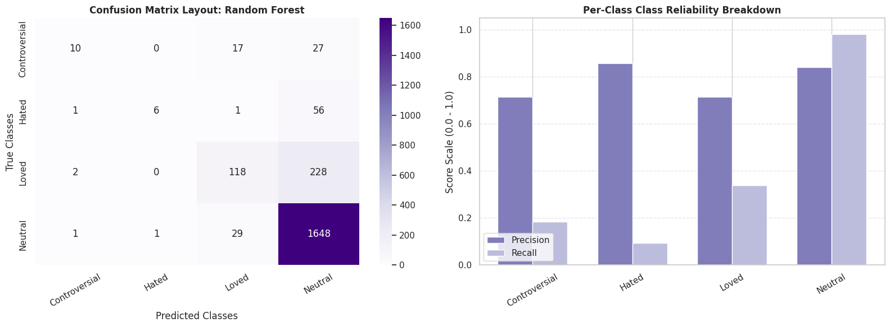
    


##### 📝 Model Analysis: Random Forest

* **Ensemble Overfitting Mitigation:** By averaging multiple randomized decision trees, the ensemble smooths out the severe overfitting seen in individual trees, yielding a superior global Log Loss of 0.4805.
* **Sharp Precision Enhancements:** Feature bagging forces unique split variations, dramatically boosting prediction reliability for minority classes, reaching a high precision of 0.7143 for `Controversial` and 0.8571 for `Hated`.
* **Persistent Minority Recall Bottleneck:** Despite highly accurate positive predictions, the model remains intensely conservative, missing over 80% of actual minority instances and misclassifying them into the dominant `Neutral` reservoir.
* **Optimization Takeaway:** While random forest successfully corrects structural variance and stabilizes joint probabilities, resolving the ongoing recall bottleneck requires altering class balancing hyper-parameters like `class_weight='balanced'`.

##### Effect of n_estimators
One of the most important parameters of the random forests is the number of decision trees we want to train. If this number (a.k.a. n_estimators) is 1, we are basically dealing with a single decision tree. A higher number should lead to better predictions. But it comes at a higher computational cost. So it is better to find a nice balance as usual:


```python
no_estimators = [1, 2, 5, 10, 15, 20, 30, 40, 50, 60, 70, 80, 90, 100, 110, 120, 130, 140, 150, 160, 170, 180, 190, 200]
scores = []
scores_train = []

for no_estimator in no_estimators:
    model = RandomForestClassifier(n_estimators=no_estimator, random_state=42, max_depth=8)
    model.fit(X_train_scaled_mc, y_train_mc)
    
    predictions_train = model.predict(X_train_scaled_mc)
    F1_train = f1_score(y_train_mc, predictions_train, average='macro')
    scores_train.append(F1_train)
    
    predictions = model.predict(X_test_scaled_mc)
    F1 = f1_score(y_test_mc, predictions, average='macro')
    scores.append(F1)

plt.figure(figsize=(20, 8))
plt.plot(no_estimators, scores, lw=5, label='F1: Test Set')
plt.plot(no_estimators, scores_train, lw=5, color='orange', label='F1: Train Set')
plt.xlabel('Number of Estimators (Trees)')
plt.ylabel('F1-Score (Macro)')
plt.title('Random Forest Hyperparameter Tuning: Estimators vs Macro F1')
plt.xticks(no_estimators)
plt.legend()
plt.grid(True, linestyle='--', alpha=0.6)
plt.show()
```


    
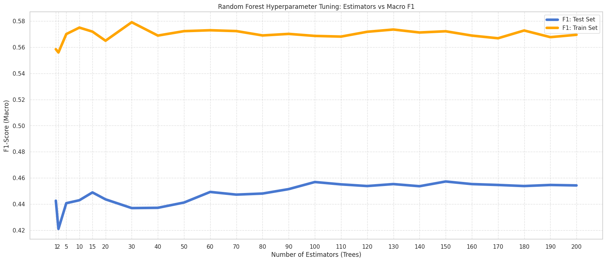
    


**So we choose `no_estimator=150` as our optimal choice**.

##### Effect of max_samples


```python
max_samples_list = [1000, 1200, 1500, 1700, 2000, 2500, 5000, 9000]
scores = []
scores_train = []

for max_samples in max_samples_list:
    current_max_samples = min(max_samples, X_train_scaled_mc.shape[0])
    
    model = RandomForestClassifier(n_estimators=50, max_depth=10, max_samples=current_max_samples, random_state=42)
    model.fit(X_train_scaled_mc, y_train_mc)
    
    predictions_train = model.predict(X_train_scaled_mc)
    F1_train = f1_score(y_train_mc, predictions_train, average='macro')
    scores_train.append(F1_train)
    
    predictions = model.predict(X_test_scaled_mc)
    F1 = f1_score(y_test_mc, predictions, average='macro')
    scores.append(F1)

plt.figure(figsize=(20, 8))
plt.plot(max_samples_list, scores, lw=5, label='F1: Test Set')
plt.plot(max_samples_list, scores_train, lw=5, color='orange', label='F1: Train Set')
plt.xlabel('Number of Bootstrap Samples (max_samples)')
plt.ylabel('F1-Score (Macro)')
plt.title('Random Forest Hyperparameter Tuning: Max Samples vs Macro F1')
plt.xticks(max_samples_list)
plt.legend()
plt.grid(True, linestyle='--', alpha=0.6)
plt.show()
```


    
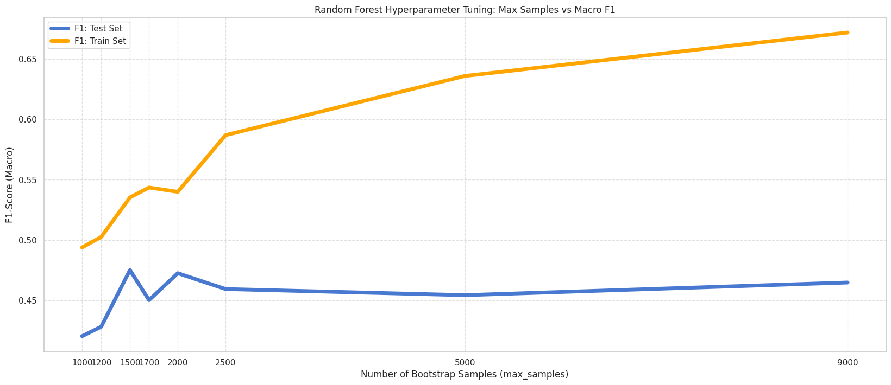
    


**So the optimal value in our case is `max_samples=1500`**.

#### XGBoost 🚀


```python
# --- XGBoost ---
xgb = XGBClassifier(eval_metric='mlogloss', random_state=42)
xgb.fit(X_train_scaled_mc, y_train_mc)
```


<style>#sk-container-id-21 {
  /* Definition of color scheme common for light and dark mode */
  --sklearn-color-text: #000;
  --sklearn-color-text-muted: #666;
  --sklearn-color-line: gray;
  /* Definition of color scheme for unfitted estimators */
  --sklearn-color-unfitted-level-0: #fff5e6;
  --sklearn-color-unfitted-level-1: #f6e4d2;
  --sklearn-color-unfitted-level-2: #ffe0b3;
  --sklearn-color-unfitted-level-3: chocolate;
  /* Definition of color scheme for fitted estimators */
  --sklearn-color-fitted-level-0: #f0f8ff;
  --sklearn-color-fitted-level-1: #d4ebff;
  --sklearn-color-fitted-level-2: #b3dbfd;
  --sklearn-color-fitted-level-3: cornflowerblue;
}

#sk-container-id-21.light {
  /* Specific color for light theme */
  --sklearn-color-text-on-default-background: black;
  --sklearn-color-background: white;
  --sklearn-color-border-box: black;
  --sklearn-color-icon: #696969;
}

#sk-container-id-21.dark {
  --sklearn-color-text-on-default-background: white;
  --sklearn-color-background: #111;
  --sklearn-color-border-box: white;
  --sklearn-color-icon: #878787;
}

#sk-container-id-21 {
  color: var(--sklearn-color-text);
}

#sk-container-id-21 pre {
  padding: 0;
}

#sk-container-id-21 input.sk-hidden--visually {
  border: 0;
  clip: rect(1px 1px 1px 1px);
  clip: rect(1px, 1px, 1px, 1px);
  height: 1px;
  margin: -1px;
  overflow: hidden;
  padding: 0;
  position: absolute;
  width: 1px;
}

#sk-container-id-21 div.sk-dashed-wrapped {
  border: 1px dashed var(--sklearn-color-line);
  margin: 0 0.4em 0.5em 0.4em;
  box-sizing: border-box;
  padding-bottom: 0.4em;
  background-color: var(--sklearn-color-background);
}

#sk-container-id-21 div.sk-container {
  /* jupyter's `normalize.less` sets `[hidden] { display: none; }`
     but bootstrap.min.css set `[hidden] { display: none !important; }`
     so we also need the `!important` here to be able to override the
     default hidden behavior on the sphinx rendered scikit-learn.org.
     See: https://github.com/scikit-learn/scikit-learn/issues/21755 */
  display: inline-block !important;
  position: relative;
}

#sk-container-id-21 div.sk-text-repr-fallback {
  display: none;
}

div.sk-parallel-item,
div.sk-serial,
div.sk-item {
  /* draw centered vertical line to link estimators */
  background-image: linear-gradient(var(--sklearn-color-text-on-default-background), var(--sklearn-color-text-on-default-background));
  background-size: 2px 100%;
  background-repeat: no-repeat;
  background-position: center center;
}

/* Parallel-specific style estimator block */

#sk-container-id-21 div.sk-parallel-item::after {
  content: "";
  width: 100%;
  border-bottom: 2px solid var(--sklearn-color-text-on-default-background);
  flex-grow: 1;
}

#sk-container-id-21 div.sk-parallel {
  display: flex;
  align-items: stretch;
  justify-content: center;
  background-color: var(--sklearn-color-background);
  position: relative;
}

#sk-container-id-21 div.sk-parallel-item {
  display: flex;
  flex-direction: column;
}

#sk-container-id-21 div.sk-parallel-item:first-child::after {
  align-self: flex-end;
  width: 50%;
}

#sk-container-id-21 div.sk-parallel-item:last-child::after {
  align-self: flex-start;
  width: 50%;
}

#sk-container-id-21 div.sk-parallel-item:only-child::after {
  width: 0;
}

/* Serial-specific style estimator block */

#sk-container-id-21 div.sk-serial {
  display: flex;
  flex-direction: column;
  align-items: center;
  background-color: var(--sklearn-color-background);
  padding-right: 1em;
  padding-left: 1em;
}


/* Toggleable style: style used for estimator/Pipeline/ColumnTransformer box that is
clickable and can be expanded/collapsed.
- Pipeline and ColumnTransformer use this feature and define the default style
- Estimators will overwrite some part of the style using the `sk-estimator` class
*/

/* Pipeline and ColumnTransformer style (default) */

#sk-container-id-21 div.sk-toggleable {
  /* Default theme specific background. It is overwritten whether we have a
  specific estimator or a Pipeline/ColumnTransformer */
  background-color: var(--sklearn-color-background);
}

/* Toggleable label */
#sk-container-id-21 label.sk-toggleable__label {
  cursor: pointer;
  display: flex;
  width: 100%;
  margin-bottom: 0;
  padding: 0.5em;
  box-sizing: border-box;
  text-align: center;
  align-items: center;
  justify-content: center;
  gap: 0.5em;
}

#sk-container-id-21 label.sk-toggleable__label .caption {
  font-size: 0.6rem;
  font-weight: lighter;
  color: var(--sklearn-color-text-muted);
}

#sk-container-id-21 label.sk-toggleable__label-arrow:before {
  /* Arrow on the left of the label */
  content: "▸";
  float: left;
  margin-right: 0.25em;
  color: var(--sklearn-color-icon);
}

#sk-container-id-21 label.sk-toggleable__label-arrow:hover:before {
  color: var(--sklearn-color-text);
}

/* Toggleable content - dropdown */

#sk-container-id-21 div.sk-toggleable__content {
  display: none;
  text-align: left;
  /* unfitted */
  background-color: var(--sklearn-color-unfitted-level-0);
}

#sk-container-id-21 div.sk-toggleable__content.fitted {
  /* fitted */
  background-color: var(--sklearn-color-fitted-level-0);
}

#sk-container-id-21 div.sk-toggleable__content pre {
  margin: 0.2em;
  border-radius: 0.25em;
  color: var(--sklearn-color-text);
  /* unfitted */
  background-color: var(--sklearn-color-unfitted-level-0);
}

#sk-container-id-21 div.sk-toggleable__content.fitted pre {
  /* unfitted */
  background-color: var(--sklearn-color-fitted-level-0);
}

#sk-container-id-21 input.sk-toggleable__control:checked~div.sk-toggleable__content {
  /* Expand drop-down */
  display: block;
  width: 100%;
  overflow: visible;
}

#sk-container-id-21 input.sk-toggleable__control:checked~label.sk-toggleable__label-arrow:before {
  content: "▾";
}

/* Pipeline/ColumnTransformer-specific style */

#sk-container-id-21 div.sk-label input.sk-toggleable__control:checked~label.sk-toggleable__label {
  color: var(--sklearn-color-text);
  background-color: var(--sklearn-color-unfitted-level-2);
}

#sk-container-id-21 div.sk-label.fitted input.sk-toggleable__control:checked~label.sk-toggleable__label {
  background-color: var(--sklearn-color-fitted-level-2);
}

/* Estimator-specific style */

/* Colorize estimator box */
#sk-container-id-21 div.sk-estimator input.sk-toggleable__control:checked~label.sk-toggleable__label {
  /* unfitted */
  background-color: var(--sklearn-color-unfitted-level-2);
}

#sk-container-id-21 div.sk-estimator.fitted input.sk-toggleable__control:checked~label.sk-toggleable__label {
  /* fitted */
  background-color: var(--sklearn-color-fitted-level-2);
}

#sk-container-id-21 div.sk-label label.sk-toggleable__label,
#sk-container-id-21 div.sk-label label {
  /* The background is the default theme color */
  color: var(--sklearn-color-text-on-default-background);
}

/* On hover, darken the color of the background */
#sk-container-id-21 div.sk-label:hover label.sk-toggleable__label {
  color: var(--sklearn-color-text);
  background-color: var(--sklearn-color-unfitted-level-2);
}

/* Label box, darken color on hover, fitted */
#sk-container-id-21 div.sk-label.fitted:hover label.sk-toggleable__label.fitted {
  color: var(--sklearn-color-text);
  background-color: var(--sklearn-color-fitted-level-2);
}

/* Estimator label */

#sk-container-id-21 div.sk-label label {
  font-family: monospace;
  font-weight: bold;
  line-height: 1.2em;
}

#sk-container-id-21 div.sk-label-container {
  text-align: center;
}

/* Estimator-specific */
#sk-container-id-21 div.sk-estimator {
  font-family: monospace;
  border: 1px dotted var(--sklearn-color-border-box);
  border-radius: 0.25em;
  box-sizing: border-box;
  margin-bottom: 0.5em;
  /* unfitted */
  background-color: var(--sklearn-color-unfitted-level-0);
}

#sk-container-id-21 div.sk-estimator.fitted {
  /* fitted */
  background-color: var(--sklearn-color-fitted-level-0);
}

/* on hover */
#sk-container-id-21 div.sk-estimator:hover {
  /* unfitted */
  background-color: var(--sklearn-color-unfitted-level-2);
}

#sk-container-id-21 div.sk-estimator.fitted:hover {
  /* fitted */
  background-color: var(--sklearn-color-fitted-level-2);
}

/* Specification for estimator info (e.g. "i" and "?") */

/* Common style for "i" and "?" */

.sk-estimator-doc-link,
a:link.sk-estimator-doc-link,
a:visited.sk-estimator-doc-link {
  float: right;
  font-size: smaller;
  line-height: 1em;
  font-family: monospace;
  background-color: var(--sklearn-color-unfitted-level-0);
  border-radius: 1em;
  height: 1em;
  width: 1em;
  text-decoration: none !important;
  margin-left: 0.5em;
  text-align: center;
  /* unfitted */
  border: var(--sklearn-color-unfitted-level-3) 1pt solid;
  color: var(--sklearn-color-unfitted-level-3);
}

.sk-estimator-doc-link.fitted,
a:link.sk-estimator-doc-link.fitted,
a:visited.sk-estimator-doc-link.fitted {
  /* fitted */
  background-color: var(--sklearn-color-fitted-level-0);
  border: var(--sklearn-color-fitted-level-3) 1pt solid;
  color: var(--sklearn-color-fitted-level-3);
}

/* On hover */
div.sk-estimator:hover .sk-estimator-doc-link:hover,
.sk-estimator-doc-link:hover,
div.sk-label-container:hover .sk-estimator-doc-link:hover,
.sk-estimator-doc-link:hover {
  /* unfitted */
  background-color: var(--sklearn-color-unfitted-level-3);
  border: var(--sklearn-color-fitted-level-0) 1pt solid;
  color: var(--sklearn-color-unfitted-level-0);
  text-decoration: none;
}

div.sk-estimator.fitted:hover .sk-estimator-doc-link.fitted:hover,
.sk-estimator-doc-link.fitted:hover,
div.sk-label-container:hover .sk-estimator-doc-link.fitted:hover,
.sk-estimator-doc-link.fitted:hover {
  /* fitted */
  background-color: var(--sklearn-color-fitted-level-3);
  border: var(--sklearn-color-fitted-level-0) 1pt solid;
  color: var(--sklearn-color-fitted-level-0);
  text-decoration: none;
}

/* Span, style for the box shown on hovering the info icon */
.sk-estimator-doc-link span {
  display: none;
  z-index: 9999;
  position: relative;
  font-weight: normal;
  right: .2ex;
  padding: .5ex;
  margin: .5ex;
  width: min-content;
  min-width: 20ex;
  max-width: 50ex;
  color: var(--sklearn-color-text);
  box-shadow: 2pt 2pt 4pt #999;
  /* unfitted */
  background: var(--sklearn-color-unfitted-level-0);
  border: .5pt solid var(--sklearn-color-unfitted-level-3);
}

.sk-estimator-doc-link.fitted span {
  /* fitted */
  background: var(--sklearn-color-fitted-level-0);
  border: var(--sklearn-color-fitted-level-3);
}

.sk-estimator-doc-link:hover span {
  display: block;
}

/* "?"-specific style due to the `<a>` HTML tag */

#sk-container-id-21 a.estimator_doc_link {
  float: right;
  font-size: 1rem;
  line-height: 1em;
  font-family: monospace;
  background-color: var(--sklearn-color-unfitted-level-0);
  border-radius: 1rem;
  height: 1rem;
  width: 1rem;
  text-decoration: none;
  /* unfitted */
  color: var(--sklearn-color-unfitted-level-1);
  border: var(--sklearn-color-unfitted-level-1) 1pt solid;
}

#sk-container-id-21 a.estimator_doc_link.fitted {
  /* fitted */
  background-color: var(--sklearn-color-fitted-level-0);
  border: var(--sklearn-color-fitted-level-1) 1pt solid;
  color: var(--sklearn-color-fitted-level-1);
}

/* On hover */
#sk-container-id-21 a.estimator_doc_link:hover {
  /* unfitted */
  background-color: var(--sklearn-color-unfitted-level-3);
  color: var(--sklearn-color-background);
  text-decoration: none;
}

#sk-container-id-21 a.estimator_doc_link.fitted:hover {
  /* fitted */
  background-color: var(--sklearn-color-fitted-level-3);
}

.estimator-table {
    font-family: monospace;
}

.estimator-table summary {
    padding: .5rem;
    cursor: pointer;
}

.estimator-table summary::marker {
    font-size: 0.7rem;
}

.estimator-table details[open] {
    padding-left: 0.1rem;
    padding-right: 0.1rem;
    padding-bottom: 0.3rem;
}

.estimator-table .parameters-table {
    margin-left: auto !important;
    margin-right: auto !important;
    margin-top: 0;
}

.estimator-table .parameters-table tr:nth-child(odd) {
    background-color: #fff;
}

.estimator-table .parameters-table tr:nth-child(even) {
    background-color: #f6f6f6;
}

.estimator-table .parameters-table tr:hover {
    background-color: #e0e0e0;
}

.estimator-table table td {
    border: 1px solid rgba(106, 105, 104, 0.232);
}

/*
    `table td`is set in notebook with right text-align.
    We need to overwrite it.
*/
.estimator-table table td.param {
    text-align: left;
    position: relative;
    padding: 0;
}

.user-set td {
    color:rgb(255, 94, 0);
    text-align: left !important;
}

.user-set td.value {
    color:rgb(255, 94, 0);
    background-color: transparent;
}

.default td {
    color: black;
    text-align: left !important;
}

.user-set td i,
.default td i {
    color: black;
}

/*
    Styles for parameter documentation links
    We need styling for visited so jupyter doesn't overwrite it
*/
a.param-doc-link,
a.param-doc-link:link,
a.param-doc-link:visited {
    text-decoration: underline dashed;
    text-underline-offset: .3em;
    color: inherit;
    display: block;
    padding: .5em;
}

/* "hack" to make the entire area of the cell containing the link clickable */
a.param-doc-link::before {
    position: absolute;
    content: "";
    inset: 0;
}

.param-doc-description {
    display: none;
    position: absolute;
    z-index: 9999;
    left: 0;
    padding: .5ex;
    margin-left: 1.5em;
    color: var(--sklearn-color-text);
    box-shadow: .3em .3em .4em #999;
    width: max-content;
    text-align: left;
    max-height: 10em;
    overflow-y: auto;

    /* unfitted */
    background: var(--sklearn-color-unfitted-level-0);
    border: thin solid var(--sklearn-color-unfitted-level-3);
}

/* Fitted state for parameter tooltips */
.fitted .param-doc-description {
    /* fitted */
    background: var(--sklearn-color-fitted-level-0);
    border: thin solid var(--sklearn-color-fitted-level-3);
}

.param-doc-link:hover .param-doc-description {
    display: block;
}

.copy-paste-icon {
    background-image: url();
    background-repeat: no-repeat;
    background-size: 14px 14px;
    background-position: 0;
    display: inline-block;
    width: 14px;
    height: 14px;
    cursor: pointer;
}
</style><body><div id="sk-container-id-21" class="sk-top-container"><div class="sk-text-repr-fallback"><pre>XGBClassifier(base_score=None, booster=None, callbacks=None,
              colsample_bylevel=None, colsample_bynode=None,
              colsample_bytree=None, device=None, early_stopping_rounds=None,
              enable_categorical=False, eval_metric=&#x27;mlogloss&#x27;,
              feature_types=None, feature_weights=None, gamma=None,
              grow_policy=None, importance_type=None,
              interaction_constraints=None, learning_rate=None, max_bin=None,
              max_cat_threshold=None, max_cat_to_onehot=None,
              max_delta_step=None, max_depth=None, max_leaves=None,
              min_child_weight=None, missing=nan, monotone_constraints=None,
              multi_strategy=None, n_estimators=None, n_jobs=None,
              num_parallel_tree=None, ...)</pre><b>In a Jupyter environment, please rerun this cell to show the HTML representation or trust the notebook. <br />On GitHub, the HTML representation is unable to render, please try loading this page with nbviewer.org.</b></div><div class="sk-container" hidden><div class="sk-item"><div class="sk-estimator fitted sk-toggleable"><input class="sk-toggleable__control sk-hidden--visually" id="sk-estimator-id-31" type="checkbox" checked><label for="sk-estimator-id-31" class="sk-toggleable__label fitted sk-toggleable__label-arrow"><div><div>XGBClassifier</div></div><div><a class="sk-estimator-doc-link fitted" rel="noreferrer" target="_blank" href="https://xgboost.readthedocs.io/en/release_3.2.0/python/python_api.html#xgboost.XGBClassifier">?<span>Documentation for XGBClassifier</span></a><span class="sk-estimator-doc-link fitted">i<span>Fitted</span></span></div></label><div class="sk-toggleable__content fitted" data-param-prefix="">
        <div class="estimator-table">
            <details>
                <summary>Parameters</summary>
                <table class="parameters-table">
                  <tbody>

        <tr class="user-set">
            <td><i class="copy-paste-icon"
                 onclick="copyToClipboard('objective',
                          this.parentElement.nextElementSibling)"
            ></i></td>
            <td class="param">
        <a class="param-doc-link"
            rel="noreferrer" target="_blank" href="https://xgboost.readthedocs.io/en/release_3.2.0/python/python_api.html#xgboost.XGBClassifier#:~:text=objective,-typing.Union%5Bstr%2C%20xgboost.sklearn._SklObjWProto%2C%20typing.Callable%5B%5Btyping.Any%2C%20typing.Any%5D%2C%20typing.Tuple%5Bnumpy.ndarray%2C%20numpy.ndarray%5D%5D%2C%20NoneType%5D">
            objective
            <span class="param-doc-description">objective: typing.Union[str, xgboost.sklearn._SklObjWProto, typing.Callable[[typing.Any, typing.Any], typing.Tuple[numpy.ndarray, numpy.ndarray]], NoneType]<br><br>Specify the learning task and the corresponding learning objective or a custom<br>objective function to be used.<br><br>For custom objective, see :doc:`/tutorials/custom_metric_obj` and<br>:ref:`custom-obj-metric` for more information, along with the end note for<br>function signatures.</span>
        </a>
    </td>
            <td class="value">&#x27;multi:softprob&#x27;</td>
        </tr>


        <tr class="user-set">
            <td><i class="copy-paste-icon"
                 onclick="copyToClipboard('base_score',
                          this.parentElement.nextElementSibling)"
            ></i></td>
            <td class="param">
        <a class="param-doc-link"
            rel="noreferrer" target="_blank" href="https://xgboost.readthedocs.io/en/release_3.2.0/python/python_api.html#xgboost.XGBClassifier#:~:text=base_score,-typing.Union%5Bfloat%2C%20typing.List%5Bfloat%5D%2C%20NoneType%5D">
            base_score
            <span class="param-doc-description">base_score: typing.Union[float, typing.List[float], NoneType]<br><br>The initial prediction score of all instances, global bias.</span>
        </a>
    </td>
            <td class="value">None</td>
        </tr>


        <tr class="user-set">
            <td><i class="copy-paste-icon"
                 onclick="copyToClipboard('booster',
                          this.parentElement.nextElementSibling)"
            ></i></td>
            <td class="param">booster</td>
            <td class="value">None</td>
        </tr>


        <tr class="user-set">
            <td><i class="copy-paste-icon"
                 onclick="copyToClipboard('callbacks',
                          this.parentElement.nextElementSibling)"
            ></i></td>
            <td class="param">
        <a class="param-doc-link"
            rel="noreferrer" target="_blank" href="https://xgboost.readthedocs.io/en/release_3.2.0/python/python_api.html#xgboost.XGBClassifier#:~:text=callbacks,-typing.Optional%5Btyping.List%5Bxgboost.callback.TrainingCallback%5D%5D">
            callbacks
            <span class="param-doc-description">callbacks: typing.Optional[typing.List[xgboost.callback.TrainingCallback]]<br><br>List of callback functions that are applied at end of each iteration.<br>It is possible to use predefined callbacks by using<br>:ref:`Callback API <callback_api>`.<br><br>.. note::<br><br>   States in callback are not preserved during training, which means callback<br>   objects can not be reused for multiple training sessions without<br>   reinitialization or deepcopy.<br><br>.. code-block:: python<br><br>    for params in parameters_grid:<br>        # be sure to (re)initialize the callbacks before each run<br>        callbacks = [xgb.callback.LearningRateScheduler(custom_rates)]<br>        reg = xgboost.XGBRegressor(**params, callbacks=callbacks)<br>        reg.fit(X, y)</span>
        </a>
    </td>
            <td class="value">None</td>
        </tr>


        <tr class="user-set">
            <td><i class="copy-paste-icon"
                 onclick="copyToClipboard('colsample_bylevel',
                          this.parentElement.nextElementSibling)"
            ></i></td>
            <td class="param">
        <a class="param-doc-link"
            rel="noreferrer" target="_blank" href="https://xgboost.readthedocs.io/en/release_3.2.0/python/python_api.html#xgboost.XGBClassifier#:~:text=colsample_bylevel,-typing.Optional%5Bfloat%5D">
            colsample_bylevel
            <span class="param-doc-description">colsample_bylevel: typing.Optional[float]<br><br>Subsample ratio of columns for each level.</span>
        </a>
    </td>
            <td class="value">None</td>
        </tr>


        <tr class="user-set">
            <td><i class="copy-paste-icon"
                 onclick="copyToClipboard('colsample_bynode',
                          this.parentElement.nextElementSibling)"
            ></i></td>
            <td class="param">
        <a class="param-doc-link"
            rel="noreferrer" target="_blank" href="https://xgboost.readthedocs.io/en/release_3.2.0/python/python_api.html#xgboost.XGBClassifier#:~:text=colsample_bynode,-typing.Optional%5Bfloat%5D">
            colsample_bynode
            <span class="param-doc-description">colsample_bynode: typing.Optional[float]<br><br>Subsample ratio of columns for each split.</span>
        </a>
    </td>
            <td class="value">None</td>
        </tr>


        <tr class="user-set">
            <td><i class="copy-paste-icon"
                 onclick="copyToClipboard('colsample_bytree',
                          this.parentElement.nextElementSibling)"
            ></i></td>
            <td class="param">
        <a class="param-doc-link"
            rel="noreferrer" target="_blank" href="https://xgboost.readthedocs.io/en/release_3.2.0/python/python_api.html#xgboost.XGBClassifier#:~:text=colsample_bytree,-typing.Optional%5Bfloat%5D">
            colsample_bytree
            <span class="param-doc-description">colsample_bytree: typing.Optional[float]<br><br>Subsample ratio of columns when constructing each tree.</span>
        </a>
    </td>
            <td class="value">None</td>
        </tr>


        <tr class="user-set">
            <td><i class="copy-paste-icon"
                 onclick="copyToClipboard('device',
                          this.parentElement.nextElementSibling)"
            ></i></td>
            <td class="param">
        <a class="param-doc-link"
            rel="noreferrer" target="_blank" href="https://xgboost.readthedocs.io/en/release_3.2.0/python/python_api.html#xgboost.XGBClassifier#:~:text=device,-typing.Optional%5Bstr%5D">
            device
            <span class="param-doc-description">device: typing.Optional[str]<br><br>.. versionadded:: 2.0.0<br><br>Device ordinal, available options are `cpu`, `cuda`, and `gpu`.</span>
        </a>
    </td>
            <td class="value">None</td>
        </tr>


        <tr class="user-set">
            <td><i class="copy-paste-icon"
                 onclick="copyToClipboard('early_stopping_rounds',
                          this.parentElement.nextElementSibling)"
            ></i></td>
            <td class="param">
        <a class="param-doc-link"
            rel="noreferrer" target="_blank" href="https://xgboost.readthedocs.io/en/release_3.2.0/python/python_api.html#xgboost.XGBClassifier#:~:text=early_stopping_rounds,-typing.Optional%5Bint%5D">
            early_stopping_rounds
            <span class="param-doc-description">early_stopping_rounds: typing.Optional[int]<br><br>.. versionadded:: 1.6.0<br><br>- Activates early stopping. Validation metric needs to improve at least once in<br>  every **early_stopping_rounds** round(s) to continue training.  Requires at<br>  least one item in **eval_set** in :py:meth:`fit`.<br><br>- If early stopping occurs, the model will have two additional attributes:<br>  :py:attr:`best_score` and :py:attr:`best_iteration`. These are used by the<br>  :py:meth:`predict` and :py:meth:`apply` methods to determine the optimal<br>  number of trees during inference. If users want to access the full model<br>  (including trees built after early stopping), they can specify the<br>  `iteration_range` in these inference methods. In addition, other utilities<br>  like model plotting can also use the entire model.<br><br>- If you prefer to discard the trees after `best_iteration`, consider using the<br>  callback function :py:class:`xgboost.callback.EarlyStopping`.<br><br>- If there's more than one item in **eval_set**, the last entry will be used for<br>  early stopping.  If there's more than one metric in **eval_metric**, the last<br>  metric will be used for early stopping.</span>
        </a>
    </td>
            <td class="value">None</td>
        </tr>


        <tr class="user-set">
            <td><i class="copy-paste-icon"
                 onclick="copyToClipboard('enable_categorical',
                          this.parentElement.nextElementSibling)"
            ></i></td>
            <td class="param">
        <a class="param-doc-link"
            rel="noreferrer" target="_blank" href="https://xgboost.readthedocs.io/en/release_3.2.0/python/python_api.html#xgboost.XGBClassifier#:~:text=enable_categorical,-bool">
            enable_categorical
            <span class="param-doc-description">enable_categorical: bool<br><br>See the same parameter of :py:class:`DMatrix` for details.</span>
        </a>
    </td>
            <td class="value">False</td>
        </tr>


        <tr class="user-set">
            <td><i class="copy-paste-icon"
                 onclick="copyToClipboard('eval_metric',
                          this.parentElement.nextElementSibling)"
            ></i></td>
            <td class="param">
        <a class="param-doc-link"
            rel="noreferrer" target="_blank" href="https://xgboost.readthedocs.io/en/release_3.2.0/python/python_api.html#xgboost.XGBClassifier#:~:text=eval_metric,-typing.Union%5Bstr%2C%20typing.List%5Btyping.Union%5Bstr%2C%20typing.Callable%5D%5D%2C%20typing.Callable%2C%20NoneType%5D">
            eval_metric
            <span class="param-doc-description">eval_metric: typing.Union[str, typing.List[typing.Union[str, typing.Callable]], typing.Callable, NoneType]<br><br>.. versionadded:: 1.6.0<br><br>Metric used for monitoring the training result and early stopping.  It can be a<br>string or list of strings as names of predefined metric in XGBoost (See<br>:doc:`/parameter`), one of the metrics in :py:mod:`sklearn.metrics`, or any<br>other user defined metric that looks like `sklearn.metrics`.<br><br>If custom objective is also provided, then custom metric should implement the<br>corresponding reverse link function.<br><br>Unlike the `scoring` parameter commonly used in scikit-learn, when a callable<br>object is provided, it's assumed to be a cost function and by default XGBoost<br>will minimize the result during early stopping.<br><br>For advanced usage on Early stopping like directly choosing to maximize instead<br>of minimize, see :py:obj:`xgboost.callback.EarlyStopping`.<br><br>See :doc:`/tutorials/custom_metric_obj` and :ref:`custom-obj-metric` for more<br>information.<br><br>.. code-block:: python<br><br>    from sklearn.datasets import load_diabetes<br>    from sklearn.metrics import mean_absolute_error<br>    X, y = load_diabetes(return_X_y=True)<br>    reg = xgb.XGBRegressor(<br>        tree_method="hist",<br>        eval_metric=mean_absolute_error,<br>    )<br>    reg.fit(X, y, eval_set=[(X, y)])</span>
        </a>
    </td>
            <td class="value">&#x27;mlogloss&#x27;</td>
        </tr>


        <tr class="user-set">
            <td><i class="copy-paste-icon"
                 onclick="copyToClipboard('feature_types',
                          this.parentElement.nextElementSibling)"
            ></i></td>
            <td class="param">
        <a class="param-doc-link"
            rel="noreferrer" target="_blank" href="https://xgboost.readthedocs.io/en/release_3.2.0/python/python_api.html#xgboost.XGBClassifier#:~:text=feature_types,-typing.Optional%5Btyping.Sequence%5Bstr%5D%5D">
            feature_types
            <span class="param-doc-description">feature_types: typing.Optional[typing.Sequence[str]]<br><br>.. versionadded:: 1.7.0<br><br>Used for specifying feature types without constructing a dataframe. See<br>the :py:class:`DMatrix` for details.</span>
        </a>
    </td>
            <td class="value">None</td>
        </tr>


        <tr class="user-set">
            <td><i class="copy-paste-icon"
                 onclick="copyToClipboard('feature_weights',
                          this.parentElement.nextElementSibling)"
            ></i></td>
            <td class="param">
        <a class="param-doc-link"
            rel="noreferrer" target="_blank" href="https://xgboost.readthedocs.io/en/release_3.2.0/python/python_api.html#xgboost.XGBClassifier#:~:text=feature_weights,-Optional%5BArrayLike%5D">
            feature_weights
            <span class="param-doc-description">feature_weights: Optional[ArrayLike]<br><br>Weight for each feature, defines the probability of each feature being selected<br>when colsample is being used.  All values must be greater than 0, otherwise a<br>`ValueError` is thrown.</span>
        </a>
    </td>
            <td class="value">None</td>
        </tr>


        <tr class="user-set">
            <td><i class="copy-paste-icon"
                 onclick="copyToClipboard('gamma',
                          this.parentElement.nextElementSibling)"
            ></i></td>
            <td class="param">
        <a class="param-doc-link"
            rel="noreferrer" target="_blank" href="https://xgboost.readthedocs.io/en/release_3.2.0/python/python_api.html#xgboost.XGBClassifier#:~:text=gamma,-typing.Optional%5Bfloat%5D">
            gamma
            <span class="param-doc-description">gamma: typing.Optional[float]<br><br>(min_split_loss) Minimum loss reduction required to make a further partition on<br>a leaf node of the tree.</span>
        </a>
    </td>
            <td class="value">None</td>
        </tr>


        <tr class="user-set">
            <td><i class="copy-paste-icon"
                 onclick="copyToClipboard('grow_policy',
                          this.parentElement.nextElementSibling)"
            ></i></td>
            <td class="param">
        <a class="param-doc-link"
            rel="noreferrer" target="_blank" href="https://xgboost.readthedocs.io/en/release_3.2.0/python/python_api.html#xgboost.XGBClassifier#:~:text=grow_policy,-typing.Optional%5Bstr%5D">
            grow_policy
            <span class="param-doc-description">grow_policy: typing.Optional[str]<br><br>Tree growing policy.<br><br>- depthwise: Favors splitting at nodes closest to the node,<br>- lossguide: Favors splitting at nodes with highest loss change.</span>
        </a>
    </td>
            <td class="value">None</td>
        </tr>


        <tr class="user-set">
            <td><i class="copy-paste-icon"
                 onclick="copyToClipboard('importance_type',
                          this.parentElement.nextElementSibling)"
            ></i></td>
            <td class="param">importance_type</td>
            <td class="value">None</td>
        </tr>


        <tr class="user-set">
            <td><i class="copy-paste-icon"
                 onclick="copyToClipboard('interaction_constraints',
                          this.parentElement.nextElementSibling)"
            ></i></td>
            <td class="param">
        <a class="param-doc-link"
            rel="noreferrer" target="_blank" href="https://xgboost.readthedocs.io/en/release_3.2.0/python/python_api.html#xgboost.XGBClassifier#:~:text=interaction_constraints,-typing.Union%5Bstr%2C%20typing.List%5Btyping.Tuple%5Bstr%5D%5D%2C%20NoneType%5D">
            interaction_constraints
            <span class="param-doc-description">interaction_constraints: typing.Union[str, typing.List[typing.Tuple[str]], NoneType]<br><br>Constraints for interaction representing permitted interactions.  The<br>constraints must be specified in the form of a nested list, e.g. ``[[0, 1], [2,<br>3, 4]]``, where each inner list is a group of indices of features that are<br>allowed to interact with each other.  See :doc:`tutorial<br></tutorials/feature_interaction_constraint>` for more information</span>
        </a>
    </td>
            <td class="value">None</td>
        </tr>


        <tr class="user-set">
            <td><i class="copy-paste-icon"
                 onclick="copyToClipboard('learning_rate',
                          this.parentElement.nextElementSibling)"
            ></i></td>
            <td class="param">
        <a class="param-doc-link"
            rel="noreferrer" target="_blank" href="https://xgboost.readthedocs.io/en/release_3.2.0/python/python_api.html#xgboost.XGBClassifier#:~:text=learning_rate,-typing.Optional%5Bfloat%5D">
            learning_rate
            <span class="param-doc-description">learning_rate: typing.Optional[float]<br><br>Boosting learning rate (xgb's "eta")</span>
        </a>
    </td>
            <td class="value">None</td>
        </tr>


        <tr class="user-set">
            <td><i class="copy-paste-icon"
                 onclick="copyToClipboard('max_bin',
                          this.parentElement.nextElementSibling)"
            ></i></td>
            <td class="param">
        <a class="param-doc-link"
            rel="noreferrer" target="_blank" href="https://xgboost.readthedocs.io/en/release_3.2.0/python/python_api.html#xgboost.XGBClassifier#:~:text=max_bin,-typing.Optional%5Bint%5D">
            max_bin
            <span class="param-doc-description">max_bin: typing.Optional[int]<br><br>If using histogram-based algorithm, maximum number of bins per feature</span>
        </a>
    </td>
            <td class="value">None</td>
        </tr>


        <tr class="user-set">
            <td><i class="copy-paste-icon"
                 onclick="copyToClipboard('max_cat_threshold',
                          this.parentElement.nextElementSibling)"
            ></i></td>
            <td class="param">
        <a class="param-doc-link"
            rel="noreferrer" target="_blank" href="https://xgboost.readthedocs.io/en/release_3.2.0/python/python_api.html#xgboost.XGBClassifier#:~:text=max_cat_threshold,-typing.Optional%5Bint%5D">
            max_cat_threshold
            <span class="param-doc-description">max_cat_threshold: typing.Optional[int]<br><br>.. versionadded:: 1.7.0<br><br>.. note:: This parameter is experimental<br><br>Maximum number of categories considered for each split. Used only by<br>partition-based splits for preventing over-fitting. Also, `enable_categorical`<br>needs to be set to have categorical feature support. See :doc:`Categorical Data<br></tutorials/categorical>` and :ref:`cat-param` for details.</span>
        </a>
    </td>
            <td class="value">None</td>
        </tr>


        <tr class="user-set">
            <td><i class="copy-paste-icon"
                 onclick="copyToClipboard('max_cat_to_onehot',
                          this.parentElement.nextElementSibling)"
            ></i></td>
            <td class="param">
        <a class="param-doc-link"
            rel="noreferrer" target="_blank" href="https://xgboost.readthedocs.io/en/release_3.2.0/python/python_api.html#xgboost.XGBClassifier#:~:text=max_cat_to_onehot,-Optional%5Bint%5D">
            max_cat_to_onehot
            <span class="param-doc-description">max_cat_to_onehot: Optional[int]<br><br>.. versionadded:: 1.6.0<br><br>.. note:: This parameter is experimental<br><br>A threshold for deciding whether XGBoost should use one-hot encoding based split<br>for categorical data.  When number of categories is lesser than the threshold<br>then one-hot encoding is chosen, otherwise the categories will be partitioned<br>into children nodes. Also, `enable_categorical` needs to be set to have<br>categorical feature support. See :doc:`Categorical Data<br></tutorials/categorical>` and :ref:`cat-param` for details.</span>
        </a>
    </td>
            <td class="value">None</td>
        </tr>


        <tr class="user-set">
            <td><i class="copy-paste-icon"
                 onclick="copyToClipboard('max_delta_step',
                          this.parentElement.nextElementSibling)"
            ></i></td>
            <td class="param">
        <a class="param-doc-link"
            rel="noreferrer" target="_blank" href="https://xgboost.readthedocs.io/en/release_3.2.0/python/python_api.html#xgboost.XGBClassifier#:~:text=max_delta_step,-typing.Optional%5Bfloat%5D">
            max_delta_step
            <span class="param-doc-description">max_delta_step: typing.Optional[float]<br><br>Maximum delta step we allow each tree's weight estimation to be.</span>
        </a>
    </td>
            <td class="value">None</td>
        </tr>


        <tr class="user-set">
            <td><i class="copy-paste-icon"
                 onclick="copyToClipboard('max_depth',
                          this.parentElement.nextElementSibling)"
            ></i></td>
            <td class="param">
        <a class="param-doc-link"
            rel="noreferrer" target="_blank" href="https://xgboost.readthedocs.io/en/release_3.2.0/python/python_api.html#xgboost.XGBClassifier#:~:text=max_depth,-%20typing.Optional%5Bint%5D">
            max_depth
            <span class="param-doc-description">max_depth:  typing.Optional[int]<br><br>Maximum tree depth for base learners.</span>
        </a>
    </td>
            <td class="value">None</td>
        </tr>


        <tr class="user-set">
            <td><i class="copy-paste-icon"
                 onclick="copyToClipboard('max_leaves',
                          this.parentElement.nextElementSibling)"
            ></i></td>
            <td class="param">
        <a class="param-doc-link"
            rel="noreferrer" target="_blank" href="https://xgboost.readthedocs.io/en/release_3.2.0/python/python_api.html#xgboost.XGBClassifier#:~:text=max_leaves,-typing.Optional%5Bint%5D">
            max_leaves
            <span class="param-doc-description">max_leaves: typing.Optional[int]<br><br>Maximum number of leaves; 0 indicates no limit.</span>
        </a>
    </td>
            <td class="value">None</td>
        </tr>


        <tr class="user-set">
            <td><i class="copy-paste-icon"
                 onclick="copyToClipboard('min_child_weight',
                          this.parentElement.nextElementSibling)"
            ></i></td>
            <td class="param">
        <a class="param-doc-link"
            rel="noreferrer" target="_blank" href="https://xgboost.readthedocs.io/en/release_3.2.0/python/python_api.html#xgboost.XGBClassifier#:~:text=min_child_weight,-typing.Optional%5Bfloat%5D">
            min_child_weight
            <span class="param-doc-description">min_child_weight: typing.Optional[float]<br><br>Minimum sum of instance weight(hessian) needed in a child.</span>
        </a>
    </td>
            <td class="value">None</td>
        </tr>


        <tr class="user-set">
            <td><i class="copy-paste-icon"
                 onclick="copyToClipboard('missing',
                          this.parentElement.nextElementSibling)"
            ></i></td>
            <td class="param">
        <a class="param-doc-link"
            rel="noreferrer" target="_blank" href="https://xgboost.readthedocs.io/en/release_3.2.0/python/python_api.html#xgboost.XGBClassifier#:~:text=missing,-float">
            missing
            <span class="param-doc-description">missing: float<br><br>Value in the data which needs to be present as a missing value. Default to<br>:py:data:`numpy.nan`.</span>
        </a>
    </td>
            <td class="value">nan</td>
        </tr>


        <tr class="user-set">
            <td><i class="copy-paste-icon"
                 onclick="copyToClipboard('monotone_constraints',
                          this.parentElement.nextElementSibling)"
            ></i></td>
            <td class="param">
        <a class="param-doc-link"
            rel="noreferrer" target="_blank" href="https://xgboost.readthedocs.io/en/release_3.2.0/python/python_api.html#xgboost.XGBClassifier#:~:text=monotone_constraints,-typing.Union%5Btyping.Dict%5Bstr%2C%20int%5D%2C%20str%2C%20NoneType%5D">
            monotone_constraints
            <span class="param-doc-description">monotone_constraints: typing.Union[typing.Dict[str, int], str, NoneType]<br><br>Constraint of variable monotonicity.  See :doc:`tutorial </tutorials/monotonic>`<br>for more information.</span>
        </a>
    </td>
            <td class="value">None</td>
        </tr>


        <tr class="user-set">
            <td><i class="copy-paste-icon"
                 onclick="copyToClipboard('multi_strategy',
                          this.parentElement.nextElementSibling)"
            ></i></td>
            <td class="param">
        <a class="param-doc-link"
            rel="noreferrer" target="_blank" href="https://xgboost.readthedocs.io/en/release_3.2.0/python/python_api.html#xgboost.XGBClassifier#:~:text=multi_strategy,-typing.Optional%5Bstr%5D">
            multi_strategy
            <span class="param-doc-description">multi_strategy: typing.Optional[str]<br><br>.. versionadded:: 2.0.0<br><br>.. note:: This parameter is working-in-progress.<br><br>The strategy used for training multi-target models, including multi-target<br>regression and multi-class classification. See :doc:`/tutorials/multioutput` for<br>more information.<br><br>- ``one_output_per_tree``: One model for each target.<br>- ``multi_output_tree``:  Use multi-target trees.</span>
        </a>
    </td>
            <td class="value">None</td>
        </tr>


        <tr class="user-set">
            <td><i class="copy-paste-icon"
                 onclick="copyToClipboard('n_estimators',
                          this.parentElement.nextElementSibling)"
            ></i></td>
            <td class="param">
        <a class="param-doc-link"
            rel="noreferrer" target="_blank" href="https://xgboost.readthedocs.io/en/release_3.2.0/python/python_api.html#xgboost.XGBClassifier#:~:text=n_estimators,-Optional%5Bint%5D">
            n_estimators
            <span class="param-doc-description">n_estimators: Optional[int]<br><br>Number of boosting rounds.</span>
        </a>
    </td>
            <td class="value">None</td>
        </tr>


        <tr class="user-set">
            <td><i class="copy-paste-icon"
                 onclick="copyToClipboard('n_jobs',
                          this.parentElement.nextElementSibling)"
            ></i></td>
            <td class="param">
        <a class="param-doc-link"
            rel="noreferrer" target="_blank" href="https://xgboost.readthedocs.io/en/release_3.2.0/python/python_api.html#xgboost.XGBClassifier#:~:text=n_jobs,-typing.Optional%5Bint%5D">
            n_jobs
            <span class="param-doc-description">n_jobs: typing.Optional[int]<br><br>Number of parallel threads used to run xgboost.  When used with other<br>Scikit-Learn algorithms like grid search, you may choose which algorithm to<br>parallelize and balance the threads.  Creating thread contention will<br>significantly slow down both algorithms.</span>
        </a>
    </td>
            <td class="value">None</td>
        </tr>


        <tr class="user-set">
            <td><i class="copy-paste-icon"
                 onclick="copyToClipboard('num_parallel_tree',
                          this.parentElement.nextElementSibling)"
            ></i></td>
            <td class="param">num_parallel_tree</td>
            <td class="value">None</td>
        </tr>


        <tr class="user-set">
            <td><i class="copy-paste-icon"
                 onclick="copyToClipboard('random_state',
                          this.parentElement.nextElementSibling)"
            ></i></td>
            <td class="param">
        <a class="param-doc-link"
            rel="noreferrer" target="_blank" href="https://xgboost.readthedocs.io/en/release_3.2.0/python/python_api.html#xgboost.XGBClassifier#:~:text=random_state,-typing.Union%5Bnumpy.random.mtrand.RandomState%2C%20numpy.random._generator.Generator%2C%20int%2C%20NoneType%5D">
            random_state
            <span class="param-doc-description">random_state: typing.Union[numpy.random.mtrand.RandomState, numpy.random._generator.Generator, int, NoneType]<br><br>Random number seed.<br><br>.. note::<br><br>   Using gblinear booster with shotgun updater is nondeterministic as<br>   it uses Hogwild algorithm.</span>
        </a>
    </td>
            <td class="value">42</td>
        </tr>


        <tr class="user-set">
            <td><i class="copy-paste-icon"
                 onclick="copyToClipboard('reg_alpha',
                          this.parentElement.nextElementSibling)"
            ></i></td>
            <td class="param">
        <a class="param-doc-link"
            rel="noreferrer" target="_blank" href="https://xgboost.readthedocs.io/en/release_3.2.0/python/python_api.html#xgboost.XGBClassifier#:~:text=reg_alpha,-typing.Optional%5Bfloat%5D">
            reg_alpha
            <span class="param-doc-description">reg_alpha: typing.Optional[float]<br><br>L1 regularization term on weights (xgb's alpha).</span>
        </a>
    </td>
            <td class="value">None</td>
        </tr>


        <tr class="user-set">
            <td><i class="copy-paste-icon"
                 onclick="copyToClipboard('reg_lambda',
                          this.parentElement.nextElementSibling)"
            ></i></td>
            <td class="param">
        <a class="param-doc-link"
            rel="noreferrer" target="_blank" href="https://xgboost.readthedocs.io/en/release_3.2.0/python/python_api.html#xgboost.XGBClassifier#:~:text=reg_lambda,-typing.Optional%5Bfloat%5D">
            reg_lambda
            <span class="param-doc-description">reg_lambda: typing.Optional[float]<br><br>L2 regularization term on weights (xgb's lambda).</span>
        </a>
    </td>
            <td class="value">None</td>
        </tr>


        <tr class="user-set">
            <td><i class="copy-paste-icon"
                 onclick="copyToClipboard('sampling_method',
                          this.parentElement.nextElementSibling)"
            ></i></td>
            <td class="param">
        <a class="param-doc-link"
            rel="noreferrer" target="_blank" href="https://xgboost.readthedocs.io/en/release_3.2.0/python/python_api.html#xgboost.XGBClassifier#:~:text=sampling_method,-typing.Optional%5Bstr%5D">
            sampling_method
            <span class="param-doc-description">sampling_method: typing.Optional[str]<br><br>Sampling method. Used only by the GPU version of ``hist`` tree method.<br><br>- ``uniform``: Select random training instances uniformly.<br>- ``gradient_based``: Select random training instances with higher probability<br>    when the gradient and hessian are larger. (cf. CatBoost)</span>
        </a>
    </td>
            <td class="value">None</td>
        </tr>


        <tr class="user-set">
            <td><i class="copy-paste-icon"
                 onclick="copyToClipboard('scale_pos_weight',
                          this.parentElement.nextElementSibling)"
            ></i></td>
            <td class="param">
        <a class="param-doc-link"
            rel="noreferrer" target="_blank" href="https://xgboost.readthedocs.io/en/release_3.2.0/python/python_api.html#xgboost.XGBClassifier#:~:text=scale_pos_weight,-typing.Optional%5Bfloat%5D">
            scale_pos_weight
            <span class="param-doc-description">scale_pos_weight: typing.Optional[float]<br><br>Balancing of positive and negative weights.</span>
        </a>
    </td>
            <td class="value">None</td>
        </tr>


        <tr class="user-set">
            <td><i class="copy-paste-icon"
                 onclick="copyToClipboard('subsample',
                          this.parentElement.nextElementSibling)"
            ></i></td>
            <td class="param">
        <a class="param-doc-link"
            rel="noreferrer" target="_blank" href="https://xgboost.readthedocs.io/en/release_3.2.0/python/python_api.html#xgboost.XGBClassifier#:~:text=subsample,-typing.Optional%5Bfloat%5D">
            subsample
            <span class="param-doc-description">subsample: typing.Optional[float]<br><br>Subsample ratio of the training instance.</span>
        </a>
    </td>
            <td class="value">None</td>
        </tr>


        <tr class="user-set">
            <td><i class="copy-paste-icon"
                 onclick="copyToClipboard('tree_method',
                          this.parentElement.nextElementSibling)"
            ></i></td>
            <td class="param">
        <a class="param-doc-link"
            rel="noreferrer" target="_blank" href="https://xgboost.readthedocs.io/en/release_3.2.0/python/python_api.html#xgboost.XGBClassifier#:~:text=tree_method,-typing.Optional%5Bstr%5D">
            tree_method
            <span class="param-doc-description">tree_method: typing.Optional[str]<br><br>Specify which tree method to use.  Default to auto.  If this parameter is set to<br>default, XGBoost will choose the most conservative option available.  It's<br>recommended to study this option from the parameters document :doc:`tree method<br></treemethod>`</span>
        </a>
    </td>
            <td class="value">None</td>
        </tr>


        <tr class="user-set">
            <td><i class="copy-paste-icon"
                 onclick="copyToClipboard('validate_parameters',
                          this.parentElement.nextElementSibling)"
            ></i></td>
            <td class="param">
        <a class="param-doc-link"
            rel="noreferrer" target="_blank" href="https://xgboost.readthedocs.io/en/release_3.2.0/python/python_api.html#xgboost.XGBClassifier#:~:text=validate_parameters,-typing.Optional%5Bbool%5D">
            validate_parameters
            <span class="param-doc-description">validate_parameters: typing.Optional[bool]<br><br>Give warnings for unknown parameter.</span>
        </a>
    </td>
            <td class="value">None</td>
        </tr>


        <tr class="user-set">
            <td><i class="copy-paste-icon"
                 onclick="copyToClipboard('verbosity',
                          this.parentElement.nextElementSibling)"
            ></i></td>
            <td class="param">
        <a class="param-doc-link"
            rel="noreferrer" target="_blank" href="https://xgboost.readthedocs.io/en/release_3.2.0/python/python_api.html#xgboost.XGBClassifier#:~:text=verbosity,-typing.Optional%5Bint%5D">
            verbosity
            <span class="param-doc-description">verbosity: typing.Optional[int]<br><br>The degree of verbosity. Valid values are 0 (silent) - 3 (debug).</span>
        </a>
    </td>
            <td class="value">None</td>
        </tr>

                  </tbody>
                </table>
            </details>
        </div>
    </div></div></div></div></div><script>function copyToClipboard(text, element) {
    // Get the parameter prefix from the closest toggleable content
    const toggleableContent = element.closest('.sk-toggleable__content');
    const paramPrefix = toggleableContent ? toggleableContent.dataset.paramPrefix : '';
    const fullParamName = paramPrefix ? `${paramPrefix}${text}` : text;

    const originalStyle = element.style;
    const computedStyle = window.getComputedStyle(element);
    const originalWidth = computedStyle.width;
    const originalHTML = element.innerHTML.replace('Copied!', '');

    navigator.clipboard.writeText(fullParamName)
        .then(() => {
            element.style.width = originalWidth;
            element.style.color = 'green';
            element.innerHTML = "Copied!";

            setTimeout(() => {
                element.innerHTML = originalHTML;
                element.style = originalStyle;
            }, 2000);
        })
        .catch(err => {
            console.error('Failed to copy:', err);
            element.style.color = 'red';
            element.innerHTML = "Failed!";
            setTimeout(() => {
                element.innerHTML = originalHTML;
                element.style = originalStyle;
            }, 2000);
        });
    return false;
}

document.querySelectorAll('.copy-paste-icon').forEach(function(element) {
    const toggleableContent = element.closest('.sk-toggleable__content');
    const paramPrefix = toggleableContent ? toggleableContent.dataset.paramPrefix : '';
    const paramName = element.parentElement.nextElementSibling
        .textContent.trim().split(' ')[0];
    const fullParamName = paramPrefix ? `${paramPrefix}${paramName}` : paramName;

    element.setAttribute('title', fullParamName);
});


/**
 * Adapted from Skrub
 * https://github.com/skrub-data/skrub/blob/403466d1d5d4dc76a7ef569b3f8228db59a31dc3/skrub/_reporting/_data/templates/report.js#L789
 * @returns "light" or "dark"
 */
function detectTheme(element) {
    const body = document.querySelector('body');

    // Check VSCode theme
    const themeKindAttr = body.getAttribute('data-vscode-theme-kind');
    const themeNameAttr = body.getAttribute('data-vscode-theme-name');

    if (themeKindAttr && themeNameAttr) {
        const themeKind = themeKindAttr.toLowerCase();
        const themeName = themeNameAttr.toLowerCase();

        if (themeKind.includes("dark") || themeName.includes("dark")) {
            return "dark";
        }
        if (themeKind.includes("light") || themeName.includes("light")) {
            return "light";
        }
    }

    // Check Jupyter theme
    if (body.getAttribute('data-jp-theme-light') === 'false') {
        return 'dark';
    } else if (body.getAttribute('data-jp-theme-light') === 'true') {
        return 'light';
    }

    // Guess based on a parent element's color
    const color = window.getComputedStyle(element.parentNode, null).getPropertyValue('color');
    const match = color.match(/^rgb\s*\(\s*(\d+)\s*,\s*(\d+)\s*,\s*(\d+)\s*\)\s*$/i);
    if (match) {
        const [r, g, b] = [
            parseFloat(match[1]),
            parseFloat(match[2]),
            parseFloat(match[3])
        ];

        // https://en.wikipedia.org/wiki/HSL_and_HSV#Lightness
        const luma = 0.299 * r + 0.587 * g + 0.114 * b;

        if (luma > 180) {
            // If the text is very bright we have a dark theme
            return 'dark';
        }
        if (luma < 75) {
            // If the text is very dark we have a light theme
            return 'light';
        }
        // Otherwise fall back to the next heuristic.
    }

    // Fallback to system preference
    return window.matchMedia('(prefers-color-scheme: dark)').matches ? 'dark' : 'light';
}


function forceTheme(elementId) {
    const estimatorElement = document.querySelector(`#${elementId}`);
    if (estimatorElement === null) {
        console.error(`Element with id ${elementId} not found.`);
    } else {
        const theme = detectTheme(estimatorElement);
        estimatorElement.classList.add(theme);
    }
}

forceTheme('sk-container-id-21');</script></body>


```python
y_pred_xgb = xgb.predict(X_test_scaled_mc)
y_prob_xgb = xgb.predict_proba(X_test_scaled_mc)
evaluate_multiclass("XGBoost", y_test_mc, y_pred_xgb, y_prob=y_prob_xgb, labels=mc_labels)
```

    
    ============================================================
    🌟 Multiclass Evaluation: XGBoost
    ============================================================
    🔸 Accuracy:            0.8345
    🔸 F1-Score (Macro):    0.5372
    🔸 F1-Score (Micro):    0.8345
    🔸 F1-Score (Weighted): 0.8158
    🔸 Log Loss:            0.4909
    
    📋 Detailed Per-Class Report:


<style type="text/css">
#T_91734_row0_col0, #T_91734_row0_col1, #T_91734_row0_col2, #T_91734_row1_col1 {
  background-color: #fcfbfd;
  color: #000000;
}
#T_91734_row1_col0 {
  background-color: #f4f2f8;
  color: #000000;
}
#T_91734_row1_col2 {
  background-color: #faf9fc;
  color: #000000;
}
#T_91734_row2_col0 {
  background-color: #aba9d0;
  color: #000000;
}
#T_91734_row2_col1 {
  background-color: #e1e0ee;
  color: #000000;
}
#T_91734_row2_col2 {
  background-color: #d2d2e7;
  color: #000000;
}
#T_91734_row3_col0, #T_91734_row3_col1, #T_91734_row3_col2 {
  background-color: #3f007d;
  color: #f1f1f1;
}
</style>
<table id="T_91734">
  <thead>
    <tr>
      <th class="blank level0" >&nbsp;</th>
      <th id="T_91734_level0_col0" class="col_heading level0 col0" >Precision</th>
      <th id="T_91734_level0_col1" class="col_heading level0 col1" >Recall</th>
      <th id="T_91734_level0_col2" class="col_heading level0 col2" >F1-Score</th>
      <th id="T_91734_level0_col3" class="col_heading level0 col3" >Support</th>
    </tr>
  </thead>
  <tbody>
    <tr>
      <th id="T_91734_level0_row0" class="row_heading level0 row0" >Controversial</th>
      <td id="T_91734_row0_col0" class="data row0 col0" >0.5000</td>
      <td id="T_91734_row0_col1" class="data row0 col1" >0.2778</td>
      <td id="T_91734_row0_col2" class="data row0 col2" >0.3571</td>
      <td id="T_91734_row0_col3" class="data row0 col3" >54</td>
    </tr>
    <tr>
      <th id="T_91734_level0_row1" class="row_heading level0 row1" >Hated</th>
      <td id="T_91734_row1_col0" class="data row1 col0" >0.5294</td>
      <td id="T_91734_row1_col1" class="data row1 col1" >0.2812</td>
      <td id="T_91734_row1_col2" class="data row1 col2" >0.3673</td>
      <td id="T_91734_row1_col3" class="data row1 col3" >64</td>
    </tr>
    <tr>
      <th id="T_91734_level0_row2" class="row_heading level0 row2" >Loved</th>
      <td id="T_91734_row2_col0" class="data row2 col0" >0.6636</td>
      <td id="T_91734_row2_col1" class="data row2 col1" >0.4195</td>
      <td id="T_91734_row2_col2" class="data row2 col2" >0.5141</td>
      <td id="T_91734_row2_col3" class="data row2 col3" >348</td>
    </tr>
    <tr>
      <th id="T_91734_level0_row3" class="row_heading level0 row3" >Neutral</th>
      <td id="T_91734_row3_col0" class="data row3 col0" >0.8657</td>
      <td id="T_91734_row3_col1" class="data row3 col1" >0.9595</td>
      <td id="T_91734_row3_col2" class="data row3 col2" >0.9102</td>
      <td id="T_91734_row3_col3" class="data row3 col3" >1,679</td>
    </tr>
  </tbody>
</table>


    

    


##### 📝 Model Analysis: XGBoost

* **Top-Tier Ensemble Performance:** Extreme Gradient Boosting achieves the highest overall accuracy (83.45%) and a strong global Log Loss of 0.4909.
* **Balanced Macro F1 Leader:** Sequential boosting optimizes gradient errors on misclassified instances, driving the Macro F1-Score to a section-best 0.5372.
* **Significant Minority Recall Recovery:** Sequential correction noticeably minimizes the minority data sink hole, lifting recall to 27.78% for `Controversial` and 28.12% for `Hated`.
* **Robust Probability Metrics:** Unlike KNN's noisy boundary calculations, XGBoost retains highly calibrated class probabilities, making it the most balanced model across all metrics.

#### LightGBM 🪶


```python
# --- LightGBM ---
lgb = LGBMClassifier(random_state=42, verbose=-1)
lgb.fit(X_train_scaled_mc, y_train_mc)
```


<style>#sk-container-id-22 {
  /* Definition of color scheme common for light and dark mode */
  --sklearn-color-text: #000;
  --sklearn-color-text-muted: #666;
  --sklearn-color-line: gray;
  /* Definition of color scheme for unfitted estimators */
  --sklearn-color-unfitted-level-0: #fff5e6;
  --sklearn-color-unfitted-level-1: #f6e4d2;
  --sklearn-color-unfitted-level-2: #ffe0b3;
  --sklearn-color-unfitted-level-3: chocolate;
  /* Definition of color scheme for fitted estimators */
  --sklearn-color-fitted-level-0: #f0f8ff;
  --sklearn-color-fitted-level-1: #d4ebff;
  --sklearn-color-fitted-level-2: #b3dbfd;
  --sklearn-color-fitted-level-3: cornflowerblue;
}

#sk-container-id-22.light {
  /* Specific color for light theme */
  --sklearn-color-text-on-default-background: black;
  --sklearn-color-background: white;
  --sklearn-color-border-box: black;
  --sklearn-color-icon: #696969;
}

#sk-container-id-22.dark {
  --sklearn-color-text-on-default-background: white;
  --sklearn-color-background: #111;
  --sklearn-color-border-box: white;
  --sklearn-color-icon: #878787;
}

#sk-container-id-22 {
  color: var(--sklearn-color-text);
}

#sk-container-id-22 pre {
  padding: 0;
}

#sk-container-id-22 input.sk-hidden--visually {
  border: 0;
  clip: rect(1px 1px 1px 1px);
  clip: rect(1px, 1px, 1px, 1px);
  height: 1px;
  margin: -1px;
  overflow: hidden;
  padding: 0;
  position: absolute;
  width: 1px;
}

#sk-container-id-22 div.sk-dashed-wrapped {
  border: 1px dashed var(--sklearn-color-line);
  margin: 0 0.4em 0.5em 0.4em;
  box-sizing: border-box;
  padding-bottom: 0.4em;
  background-color: var(--sklearn-color-background);
}

#sk-container-id-22 div.sk-container {
  /* jupyter's `normalize.less` sets `[hidden] { display: none; }`
     but bootstrap.min.css set `[hidden] { display: none !important; }`
     so we also need the `!important` here to be able to override the
     default hidden behavior on the sphinx rendered scikit-learn.org.
     See: https://github.com/scikit-learn/scikit-learn/issues/21755 */
  display: inline-block !important;
  position: relative;
}

#sk-container-id-22 div.sk-text-repr-fallback {
  display: none;
}

div.sk-parallel-item,
div.sk-serial,
div.sk-item {
  /* draw centered vertical line to link estimators */
  background-image: linear-gradient(var(--sklearn-color-text-on-default-background), var(--sklearn-color-text-on-default-background));
  background-size: 2px 100%;
  background-repeat: no-repeat;
  background-position: center center;
}

/* Parallel-specific style estimator block */

#sk-container-id-22 div.sk-parallel-item::after {
  content: "";
  width: 100%;
  border-bottom: 2px solid var(--sklearn-color-text-on-default-background);
  flex-grow: 1;
}

#sk-container-id-22 div.sk-parallel {
  display: flex;
  align-items: stretch;
  justify-content: center;
  background-color: var(--sklearn-color-background);
  position: relative;
}

#sk-container-id-22 div.sk-parallel-item {
  display: flex;
  flex-direction: column;
}

#sk-container-id-22 div.sk-parallel-item:first-child::after {
  align-self: flex-end;
  width: 50%;
}

#sk-container-id-22 div.sk-parallel-item:last-child::after {
  align-self: flex-start;
  width: 50%;
}

#sk-container-id-22 div.sk-parallel-item:only-child::after {
  width: 0;
}

/* Serial-specific style estimator block */

#sk-container-id-22 div.sk-serial {
  display: flex;
  flex-direction: column;
  align-items: center;
  background-color: var(--sklearn-color-background);
  padding-right: 1em;
  padding-left: 1em;
}


/* Toggleable style: style used for estimator/Pipeline/ColumnTransformer box that is
clickable and can be expanded/collapsed.
- Pipeline and ColumnTransformer use this feature and define the default style
- Estimators will overwrite some part of the style using the `sk-estimator` class
*/

/* Pipeline and ColumnTransformer style (default) */

#sk-container-id-22 div.sk-toggleable {
  /* Default theme specific background. It is overwritten whether we have a
  specific estimator or a Pipeline/ColumnTransformer */
  background-color: var(--sklearn-color-background);
}

/* Toggleable label */
#sk-container-id-22 label.sk-toggleable__label {
  cursor: pointer;
  display: flex;
  width: 100%;
  margin-bottom: 0;
  padding: 0.5em;
  box-sizing: border-box;
  text-align: center;
  align-items: center;
  justify-content: center;
  gap: 0.5em;
}

#sk-container-id-22 label.sk-toggleable__label .caption {
  font-size: 0.6rem;
  font-weight: lighter;
  color: var(--sklearn-color-text-muted);
}

#sk-container-id-22 label.sk-toggleable__label-arrow:before {
  /* Arrow on the left of the label */
  content: "▸";
  float: left;
  margin-right: 0.25em;
  color: var(--sklearn-color-icon);
}

#sk-container-id-22 label.sk-toggleable__label-arrow:hover:before {
  color: var(--sklearn-color-text);
}

/* Toggleable content - dropdown */

#sk-container-id-22 div.sk-toggleable__content {
  display: none;
  text-align: left;
  /* unfitted */
  background-color: var(--sklearn-color-unfitted-level-0);
}

#sk-container-id-22 div.sk-toggleable__content.fitted {
  /* fitted */
  background-color: var(--sklearn-color-fitted-level-0);
}

#sk-container-id-22 div.sk-toggleable__content pre {
  margin: 0.2em;
  border-radius: 0.25em;
  color: var(--sklearn-color-text);
  /* unfitted */
  background-color: var(--sklearn-color-unfitted-level-0);
}

#sk-container-id-22 div.sk-toggleable__content.fitted pre {
  /* unfitted */
  background-color: var(--sklearn-color-fitted-level-0);
}

#sk-container-id-22 input.sk-toggleable__control:checked~div.sk-toggleable__content {
  /* Expand drop-down */
  display: block;
  width: 100%;
  overflow: visible;
}

#sk-container-id-22 input.sk-toggleable__control:checked~label.sk-toggleable__label-arrow:before {
  content: "▾";
}

/* Pipeline/ColumnTransformer-specific style */

#sk-container-id-22 div.sk-label input.sk-toggleable__control:checked~label.sk-toggleable__label {
  color: var(--sklearn-color-text);
  background-color: var(--sklearn-color-unfitted-level-2);
}

#sk-container-id-22 div.sk-label.fitted input.sk-toggleable__control:checked~label.sk-toggleable__label {
  background-color: var(--sklearn-color-fitted-level-2);
}

/* Estimator-specific style */

/* Colorize estimator box */
#sk-container-id-22 div.sk-estimator input.sk-toggleable__control:checked~label.sk-toggleable__label {
  /* unfitted */
  background-color: var(--sklearn-color-unfitted-level-2);
}

#sk-container-id-22 div.sk-estimator.fitted input.sk-toggleable__control:checked~label.sk-toggleable__label {
  /* fitted */
  background-color: var(--sklearn-color-fitted-level-2);
}

#sk-container-id-22 div.sk-label label.sk-toggleable__label,
#sk-container-id-22 div.sk-label label {
  /* The background is the default theme color */
  color: var(--sklearn-color-text-on-default-background);
}

/* On hover, darken the color of the background */
#sk-container-id-22 div.sk-label:hover label.sk-toggleable__label {
  color: var(--sklearn-color-text);
  background-color: var(--sklearn-color-unfitted-level-2);
}

/* Label box, darken color on hover, fitted */
#sk-container-id-22 div.sk-label.fitted:hover label.sk-toggleable__label.fitted {
  color: var(--sklearn-color-text);
  background-color: var(--sklearn-color-fitted-level-2);
}

/* Estimator label */

#sk-container-id-22 div.sk-label label {
  font-family: monospace;
  font-weight: bold;
  line-height: 1.2em;
}

#sk-container-id-22 div.sk-label-container {
  text-align: center;
}

/* Estimator-specific */
#sk-container-id-22 div.sk-estimator {
  font-family: monospace;
  border: 1px dotted var(--sklearn-color-border-box);
  border-radius: 0.25em;
  box-sizing: border-box;
  margin-bottom: 0.5em;
  /* unfitted */
  background-color: var(--sklearn-color-unfitted-level-0);
}

#sk-container-id-22 div.sk-estimator.fitted {
  /* fitted */
  background-color: var(--sklearn-color-fitted-level-0);
}

/* on hover */
#sk-container-id-22 div.sk-estimator:hover {
  /* unfitted */
  background-color: var(--sklearn-color-unfitted-level-2);
}

#sk-container-id-22 div.sk-estimator.fitted:hover {
  /* fitted */
  background-color: var(--sklearn-color-fitted-level-2);
}

/* Specification for estimator info (e.g. "i" and "?") */

/* Common style for "i" and "?" */

.sk-estimator-doc-link,
a:link.sk-estimator-doc-link,
a:visited.sk-estimator-doc-link {
  float: right;
  font-size: smaller;
  line-height: 1em;
  font-family: monospace;
  background-color: var(--sklearn-color-unfitted-level-0);
  border-radius: 1em;
  height: 1em;
  width: 1em;
  text-decoration: none !important;
  margin-left: 0.5em;
  text-align: center;
  /* unfitted */
  border: var(--sklearn-color-unfitted-level-3) 1pt solid;
  color: var(--sklearn-color-unfitted-level-3);
}

.sk-estimator-doc-link.fitted,
a:link.sk-estimator-doc-link.fitted,
a:visited.sk-estimator-doc-link.fitted {
  /* fitted */
  background-color: var(--sklearn-color-fitted-level-0);
  border: var(--sklearn-color-fitted-level-3) 1pt solid;
  color: var(--sklearn-color-fitted-level-3);
}

/* On hover */
div.sk-estimator:hover .sk-estimator-doc-link:hover,
.sk-estimator-doc-link:hover,
div.sk-label-container:hover .sk-estimator-doc-link:hover,
.sk-estimator-doc-link:hover {
  /* unfitted */
  background-color: var(--sklearn-color-unfitted-level-3);
  border: var(--sklearn-color-fitted-level-0) 1pt solid;
  color: var(--sklearn-color-unfitted-level-0);
  text-decoration: none;
}

div.sk-estimator.fitted:hover .sk-estimator-doc-link.fitted:hover,
.sk-estimator-doc-link.fitted:hover,
div.sk-label-container:hover .sk-estimator-doc-link.fitted:hover,
.sk-estimator-doc-link.fitted:hover {
  /* fitted */
  background-color: var(--sklearn-color-fitted-level-3);
  border: var(--sklearn-color-fitted-level-0) 1pt solid;
  color: var(--sklearn-color-fitted-level-0);
  text-decoration: none;
}

/* Span, style for the box shown on hovering the info icon */
.sk-estimator-doc-link span {
  display: none;
  z-index: 9999;
  position: relative;
  font-weight: normal;
  right: .2ex;
  padding: .5ex;
  margin: .5ex;
  width: min-content;
  min-width: 20ex;
  max-width: 50ex;
  color: var(--sklearn-color-text);
  box-shadow: 2pt 2pt 4pt #999;
  /* unfitted */
  background: var(--sklearn-color-unfitted-level-0);
  border: .5pt solid var(--sklearn-color-unfitted-level-3);
}

.sk-estimator-doc-link.fitted span {
  /* fitted */
  background: var(--sklearn-color-fitted-level-0);
  border: var(--sklearn-color-fitted-level-3);
}

.sk-estimator-doc-link:hover span {
  display: block;
}

/* "?"-specific style due to the `<a>` HTML tag */

#sk-container-id-22 a.estimator_doc_link {
  float: right;
  font-size: 1rem;
  line-height: 1em;
  font-family: monospace;
  background-color: var(--sklearn-color-unfitted-level-0);
  border-radius: 1rem;
  height: 1rem;
  width: 1rem;
  text-decoration: none;
  /* unfitted */
  color: var(--sklearn-color-unfitted-level-1);
  border: var(--sklearn-color-unfitted-level-1) 1pt solid;
}

#sk-container-id-22 a.estimator_doc_link.fitted {
  /* fitted */
  background-color: var(--sklearn-color-fitted-level-0);
  border: var(--sklearn-color-fitted-level-1) 1pt solid;
  color: var(--sklearn-color-fitted-level-1);
}

/* On hover */
#sk-container-id-22 a.estimator_doc_link:hover {
  /* unfitted */
  background-color: var(--sklearn-color-unfitted-level-3);
  color: var(--sklearn-color-background);
  text-decoration: none;
}

#sk-container-id-22 a.estimator_doc_link.fitted:hover {
  /* fitted */
  background-color: var(--sklearn-color-fitted-level-3);
}

.estimator-table {
    font-family: monospace;
}

.estimator-table summary {
    padding: .5rem;
    cursor: pointer;
}

.estimator-table summary::marker {
    font-size: 0.7rem;
}

.estimator-table details[open] {
    padding-left: 0.1rem;
    padding-right: 0.1rem;
    padding-bottom: 0.3rem;
}

.estimator-table .parameters-table {
    margin-left: auto !important;
    margin-right: auto !important;
    margin-top: 0;
}

.estimator-table .parameters-table tr:nth-child(odd) {
    background-color: #fff;
}

.estimator-table .parameters-table tr:nth-child(even) {
    background-color: #f6f6f6;
}

.estimator-table .parameters-table tr:hover {
    background-color: #e0e0e0;
}

.estimator-table table td {
    border: 1px solid rgba(106, 105, 104, 0.232);
}

/*
    `table td`is set in notebook with right text-align.
    We need to overwrite it.
*/
.estimator-table table td.param {
    text-align: left;
    position: relative;
    padding: 0;
}

.user-set td {
    color:rgb(255, 94, 0);
    text-align: left !important;
}

.user-set td.value {
    color:rgb(255, 94, 0);
    background-color: transparent;
}

.default td {
    color: black;
    text-align: left !important;
}

.user-set td i,
.default td i {
    color: black;
}

/*
    Styles for parameter documentation links
    We need styling for visited so jupyter doesn't overwrite it
*/
a.param-doc-link,
a.param-doc-link:link,
a.param-doc-link:visited {
    text-decoration: underline dashed;
    text-underline-offset: .3em;
    color: inherit;
    display: block;
    padding: .5em;
}

/* "hack" to make the entire area of the cell containing the link clickable */
a.param-doc-link::before {
    position: absolute;
    content: "";
    inset: 0;
}

.param-doc-description {
    display: none;
    position: absolute;
    z-index: 9999;
    left: 0;
    padding: .5ex;
    margin-left: 1.5em;
    color: var(--sklearn-color-text);
    box-shadow: .3em .3em .4em #999;
    width: max-content;
    text-align: left;
    max-height: 10em;
    overflow-y: auto;

    /* unfitted */
    background: var(--sklearn-color-unfitted-level-0);
    border: thin solid var(--sklearn-color-unfitted-level-3);
}

/* Fitted state for parameter tooltips */
.fitted .param-doc-description {
    /* fitted */
    background: var(--sklearn-color-fitted-level-0);
    border: thin solid var(--sklearn-color-fitted-level-3);
}

.param-doc-link:hover .param-doc-description {
    display: block;
}

.copy-paste-icon {
    background-image: url();
    background-repeat: no-repeat;
    background-size: 14px 14px;
    background-position: 0;
    display: inline-block;
    width: 14px;
    height: 14px;
    cursor: pointer;
}
</style><body><div id="sk-container-id-22" class="sk-top-container"><div class="sk-text-repr-fallback"><pre>LGBMClassifier(random_state=42, verbose=-1)</pre><b>In a Jupyter environment, please rerun this cell to show the HTML representation or trust the notebook. <br />On GitHub, the HTML representation is unable to render, please try loading this page with nbviewer.org.</b></div><div class="sk-container" hidden><div class="sk-item"><div class="sk-estimator fitted sk-toggleable"><input class="sk-toggleable__control sk-hidden--visually" id="sk-estimator-id-32" type="checkbox" checked><label for="sk-estimator-id-32" class="sk-toggleable__label fitted sk-toggleable__label-arrow"><div><div>LGBMClassifier</div></div><div><span class="sk-estimator-doc-link fitted">i<span>Fitted</span></span></div></label><div class="sk-toggleable__content fitted" data-param-prefix="">
        <div class="estimator-table">
            <details>
                <summary>Parameters</summary>
                <table class="parameters-table">
                  <tbody>

        <tr class="default">
            <td><i class="copy-paste-icon"
                 onclick="copyToClipboard('boosting_type',
                          this.parentElement.nextElementSibling)"
            ></i></td>
            <td class="param">boosting_type</td>
            <td class="value">&#x27;gbdt&#x27;</td>
        </tr>


        <tr class="default">
            <td><i class="copy-paste-icon"
                 onclick="copyToClipboard('num_leaves',
                          this.parentElement.nextElementSibling)"
            ></i></td>
            <td class="param">num_leaves</td>
            <td class="value">31</td>
        </tr>


        <tr class="default">
            <td><i class="copy-paste-icon"
                 onclick="copyToClipboard('max_depth',
                          this.parentElement.nextElementSibling)"
            ></i></td>
            <td class="param">max_depth</td>
            <td class="value">-1</td>
        </tr>


        <tr class="default">
            <td><i class="copy-paste-icon"
                 onclick="copyToClipboard('learning_rate',
                          this.parentElement.nextElementSibling)"
            ></i></td>
            <td class="param">learning_rate</td>
            <td class="value">0.1</td>
        </tr>


        <tr class="default">
            <td><i class="copy-paste-icon"
                 onclick="copyToClipboard('n_estimators',
                          this.parentElement.nextElementSibling)"
            ></i></td>
            <td class="param">n_estimators</td>
            <td class="value">100</td>
        </tr>


        <tr class="default">
            <td><i class="copy-paste-icon"
                 onclick="copyToClipboard('subsample_for_bin',
                          this.parentElement.nextElementSibling)"
            ></i></td>
            <td class="param">subsample_for_bin</td>
            <td class="value">200000</td>
        </tr>


        <tr class="default">
            <td><i class="copy-paste-icon"
                 onclick="copyToClipboard('objective',
                          this.parentElement.nextElementSibling)"
            ></i></td>
            <td class="param">objective</td>
            <td class="value">None</td>
        </tr>


        <tr class="default">
            <td><i class="copy-paste-icon"
                 onclick="copyToClipboard('class_weight',
                          this.parentElement.nextElementSibling)"
            ></i></td>
            <td class="param">class_weight</td>
            <td class="value">None</td>
        </tr>


        <tr class="default">
            <td><i class="copy-paste-icon"
                 onclick="copyToClipboard('min_split_gain',
                          this.parentElement.nextElementSibling)"
            ></i></td>
            <td class="param">min_split_gain</td>
            <td class="value">0.0</td>
        </tr>


        <tr class="default">
            <td><i class="copy-paste-icon"
                 onclick="copyToClipboard('min_child_weight',
                          this.parentElement.nextElementSibling)"
            ></i></td>
            <td class="param">min_child_weight</td>
            <td class="value">0.001</td>
        </tr>


        <tr class="default">
            <td><i class="copy-paste-icon"
                 onclick="copyToClipboard('min_child_samples',
                          this.parentElement.nextElementSibling)"
            ></i></td>
            <td class="param">min_child_samples</td>
            <td class="value">20</td>
        </tr>


        <tr class="default">
            <td><i class="copy-paste-icon"
                 onclick="copyToClipboard('subsample',
                          this.parentElement.nextElementSibling)"
            ></i></td>
            <td class="param">subsample</td>
            <td class="value">1.0</td>
        </tr>


        <tr class="default">
            <td><i class="copy-paste-icon"
                 onclick="copyToClipboard('subsample_freq',
                          this.parentElement.nextElementSibling)"
            ></i></td>
            <td class="param">subsample_freq</td>
            <td class="value">0</td>
        </tr>


        <tr class="default">
            <td><i class="copy-paste-icon"
                 onclick="copyToClipboard('colsample_bytree',
                          this.parentElement.nextElementSibling)"
            ></i></td>
            <td class="param">colsample_bytree</td>
            <td class="value">1.0</td>
        </tr>


        <tr class="default">
            <td><i class="copy-paste-icon"
                 onclick="copyToClipboard('reg_alpha',
                          this.parentElement.nextElementSibling)"
            ></i></td>
            <td class="param">reg_alpha</td>
            <td class="value">0.0</td>
        </tr>


        <tr class="default">
            <td><i class="copy-paste-icon"
                 onclick="copyToClipboard('reg_lambda',
                          this.parentElement.nextElementSibling)"
            ></i></td>
            <td class="param">reg_lambda</td>
            <td class="value">0.0</td>
        </tr>


        <tr class="user-set">
            <td><i class="copy-paste-icon"
                 onclick="copyToClipboard('random_state',
                          this.parentElement.nextElementSibling)"
            ></i></td>
            <td class="param">random_state</td>
            <td class="value">42</td>
        </tr>


        <tr class="default">
            <td><i class="copy-paste-icon"
                 onclick="copyToClipboard('n_jobs',
                          this.parentElement.nextElementSibling)"
            ></i></td>
            <td class="param">n_jobs</td>
            <td class="value">None</td>
        </tr>


        <tr class="default">
            <td><i class="copy-paste-icon"
                 onclick="copyToClipboard('importance_type',
                          this.parentElement.nextElementSibling)"
            ></i></td>
            <td class="param">importance_type</td>
            <td class="value">&#x27;split&#x27;</td>
        </tr>


        <tr class="user-set">
            <td><i class="copy-paste-icon"
                 onclick="copyToClipboard('verbose',
                          this.parentElement.nextElementSibling)"
            ></i></td>
            <td class="param">verbose</td>
            <td class="value">-1</td>
        </tr>

                  </tbody>
                </table>
            </details>
        </div>
    </div></div></div></div></div><script>function copyToClipboard(text, element) {
    // Get the parameter prefix from the closest toggleable content
    const toggleableContent = element.closest('.sk-toggleable__content');
    const paramPrefix = toggleableContent ? toggleableContent.dataset.paramPrefix : '';
    const fullParamName = paramPrefix ? `${paramPrefix}${text}` : text;

    const originalStyle = element.style;
    const computedStyle = window.getComputedStyle(element);
    const originalWidth = computedStyle.width;
    const originalHTML = element.innerHTML.replace('Copied!', '');

    navigator.clipboard.writeText(fullParamName)
        .then(() => {
            element.style.width = originalWidth;
            element.style.color = 'green';
            element.innerHTML = "Copied!";

            setTimeout(() => {
                element.innerHTML = originalHTML;
                element.style = originalStyle;
            }, 2000);
        })
        .catch(err => {
            console.error('Failed to copy:', err);
            element.style.color = 'red';
            element.innerHTML = "Failed!";
            setTimeout(() => {
                element.innerHTML = originalHTML;
                element.style = originalStyle;
            }, 2000);
        });
    return false;
}

document.querySelectorAll('.copy-paste-icon').forEach(function(element) {
    const toggleableContent = element.closest('.sk-toggleable__content');
    const paramPrefix = toggleableContent ? toggleableContent.dataset.paramPrefix : '';
    const paramName = element.parentElement.nextElementSibling
        .textContent.trim().split(' ')[0];
    const fullParamName = paramPrefix ? `${paramPrefix}${paramName}` : paramName;

    element.setAttribute('title', fullParamName);
});


/**
 * Adapted from Skrub
 * https://github.com/skrub-data/skrub/blob/403466d1d5d4dc76a7ef569b3f8228db59a31dc3/skrub/_reporting/_data/templates/report.js#L789
 * @returns "light" or "dark"
 */
function detectTheme(element) {
    const body = document.querySelector('body');

    // Check VSCode theme
    const themeKindAttr = body.getAttribute('data-vscode-theme-kind');
    const themeNameAttr = body.getAttribute('data-vscode-theme-name');

    if (themeKindAttr && themeNameAttr) {
        const themeKind = themeKindAttr.toLowerCase();
        const themeName = themeNameAttr.toLowerCase();

        if (themeKind.includes("dark") || themeName.includes("dark")) {
            return "dark";
        }
        if (themeKind.includes("light") || themeName.includes("light")) {
            return "light";
        }
    }

    // Check Jupyter theme
    if (body.getAttribute('data-jp-theme-light') === 'false') {
        return 'dark';
    } else if (body.getAttribute('data-jp-theme-light') === 'true') {
        return 'light';
    }

    // Guess based on a parent element's color
    const color = window.getComputedStyle(element.parentNode, null).getPropertyValue('color');
    const match = color.match(/^rgb\s*\(\s*(\d+)\s*,\s*(\d+)\s*,\s*(\d+)\s*\)\s*$/i);
    if (match) {
        const [r, g, b] = [
            parseFloat(match[1]),
            parseFloat(match[2]),
            parseFloat(match[3])
        ];

        // https://en.wikipedia.org/wiki/HSL_and_HSV#Lightness
        const luma = 0.299 * r + 0.587 * g + 0.114 * b;

        if (luma > 180) {
            // If the text is very bright we have a dark theme
            return 'dark';
        }
        if (luma < 75) {
            // If the text is very dark we have a light theme
            return 'light';
        }
        // Otherwise fall back to the next heuristic.
    }

    // Fallback to system preference
    return window.matchMedia('(prefers-color-scheme: dark)').matches ? 'dark' : 'light';
}


function forceTheme(elementId) {
    const estimatorElement = document.querySelector(`#${elementId}`);
    if (estimatorElement === null) {
        console.error(`Element with id ${elementId} not found.`);
    } else {
        const theme = detectTheme(estimatorElement);
        estimatorElement.classList.add(theme);
    }
}

forceTheme('sk-container-id-22');</script></body>


```python
y_pred_lgb = lgb.predict(X_test_scaled_mc)
y_prob_lgb = lgb.predict_proba(X_test_scaled_mc)
evaluate_multiclass("LightGBM", y_test_mc, y_pred_lgb, y_prob=y_prob_lgb, labels=mc_labels)
```

    
    ============================================================
    🌟 Multiclass Evaluation: LightGBM
    ============================================================
    🔸 Accuracy:            0.8256
    🔸 F1-Score (Macro):    0.4910
    🔸 F1-Score (Micro):    0.8256
    🔸 F1-Score (Weighted): 0.8027
    🔸 Log Loss:            0.4884
    
    📋 Detailed Per-Class Report:


<style type="text/css">
#T_4342d_row0_col0, #T_4342d_row0_col1, #T_4342d_row0_col2 {
  background-color: #fcfbfd;
  color: #000000;
}
#T_4342d_row1_col0 {
  background-color: #f1eff6;
  color: #000000;
}
#T_4342d_row1_col1 {
  background-color: #f6f4f9;
  color: #000000;
}
#T_4342d_row1_col2 {
  background-color: #f4f2f8;
  color: #000000;
}
#T_4342d_row2_col0 {
  background-color: #9591c4;
  color: #f1f1f1;
}
#T_4342d_row2_col1 {
  background-color: #e0dfee;
  color: #000000;
}
#T_4342d_row2_col2 {
  background-color: #cccce4;
  color: #000000;
}
#T_4342d_row3_col0, #T_4342d_row3_col1, #T_4342d_row3_col2 {
  background-color: #3f007d;
  color: #f1f1f1;
}
</style>
<table id="T_4342d">
  <thead>
    <tr>
      <th class="blank level0" >&nbsp;</th>
      <th id="T_4342d_level0_col0" class="col_heading level0 col0" >Precision</th>
      <th id="T_4342d_level0_col1" class="col_heading level0 col1" >Recall</th>
      <th id="T_4342d_level0_col2" class="col_heading level0 col2" >F1-Score</th>
      <th id="T_4342d_level0_col3" class="col_heading level0 col3" >Support</th>
    </tr>
  </thead>
  <tbody>
    <tr>
      <th id="T_4342d_level0_row0" class="row_heading level0 row0" >Controversial</th>
      <td id="T_4342d_row0_col0" class="data row0 col0" >0.3929</td>
      <td id="T_4342d_row0_col1" class="data row0 col1" >0.2037</td>
      <td id="T_4342d_row0_col2" class="data row0 col2" >0.2683</td>
      <td id="T_4342d_row0_col3" class="data row0 col3" >54</td>
    </tr>
    <tr>
      <th id="T_4342d_level0_row1" class="row_heading level0 row1" >Hated</th>
      <td id="T_4342d_row1_col0" class="data row1 col0" >0.4444</td>
      <td id="T_4342d_row1_col1" class="data row1 col1" >0.2500</td>
      <td id="T_4342d_row1_col2" class="data row1 col2" >0.3200</td>
      <td id="T_4342d_row1_col3" class="data row1 col3" >64</td>
    </tr>
    <tr>
      <th id="T_4342d_level0_row2" class="row_heading level0 row2" >Loved</th>
      <td id="T_4342d_row2_col0" class="data row2 col0" >0.6432</td>
      <td id="T_4342d_row2_col1" class="data row2 col1" >0.3678</td>
      <td id="T_4342d_row2_col2" class="data row2 col2" >0.4680</td>
      <td id="T_4342d_row2_col3" class="data row2 col3" >348</td>
    </tr>
    <tr>
      <th id="T_4342d_level0_row3" class="row_heading level0 row3" >Neutral</th>
      <td id="T_4342d_row3_col0" class="data row3 col0" >0.8587</td>
      <td id="T_4342d_row3_col1" class="data row3 col1" >0.9625</td>
      <td id="T_4342d_row3_col2" class="data row3 col2" >0.9076</td>
      <td id="T_4342d_row3_col3" class="data row3 col3" >1,679</td>
    </tr>
  </tbody>
</table>


    
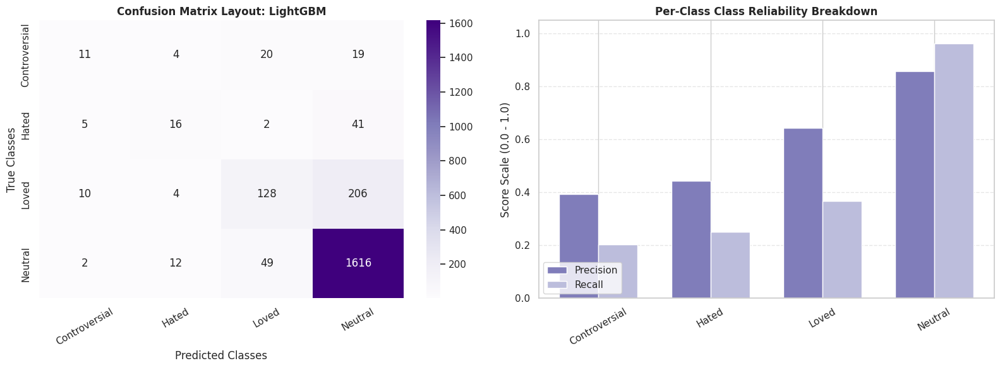
    


##### 📝 Model Analysis: LightGBM

* **Highly Optimized Probability Map:** LightGBM's leaf-wise tree growth architecture yields a highly competitive global Log Loss of 0.4884, indicating well-calibrated class assignment probabilities.
* **Balanced Class Feature Capture:** The model manages a balanced Macro F1-Score of 0.4910, showing solid multi-class sensitivity without eroding the accuracy core of the major class.
* **Minority Recall Traction:** Leaf-wise splitting structures capture minority variance better than standard trees, securing a recall of 20.37% for `Controversial` and 25.00% for `Hated`.
* **Imbalance Distribution Drag:** Despite structural speed and histogram optimization, the vast majority of rare class instances still leak into the `Neutral` class reservoir.

#### AdaBoost 🚀


```python
# --- AdaBoost ---
ada = AdaBoostClassifier(n_estimators=100, random_state=42)
ada.fit(X_train_scaled_mc, y_train_mc)
```


<style>#sk-container-id-23 {
  /* Definition of color scheme common for light and dark mode */
  --sklearn-color-text: #000;
  --sklearn-color-text-muted: #666;
  --sklearn-color-line: gray;
  /* Definition of color scheme for unfitted estimators */
  --sklearn-color-unfitted-level-0: #fff5e6;
  --sklearn-color-unfitted-level-1: #f6e4d2;
  --sklearn-color-unfitted-level-2: #ffe0b3;
  --sklearn-color-unfitted-level-3: chocolate;
  /* Definition of color scheme for fitted estimators */
  --sklearn-color-fitted-level-0: #f0f8ff;
  --sklearn-color-fitted-level-1: #d4ebff;
  --sklearn-color-fitted-level-2: #b3dbfd;
  --sklearn-color-fitted-level-3: cornflowerblue;
}

#sk-container-id-23.light {
  /* Specific color for light theme */
  --sklearn-color-text-on-default-background: black;
  --sklearn-color-background: white;
  --sklearn-color-border-box: black;
  --sklearn-color-icon: #696969;
}

#sk-container-id-23.dark {
  --sklearn-color-text-on-default-background: white;
  --sklearn-color-background: #111;
  --sklearn-color-border-box: white;
  --sklearn-color-icon: #878787;
}

#sk-container-id-23 {
  color: var(--sklearn-color-text);
}

#sk-container-id-23 pre {
  padding: 0;
}

#sk-container-id-23 input.sk-hidden--visually {
  border: 0;
  clip: rect(1px 1px 1px 1px);
  clip: rect(1px, 1px, 1px, 1px);
  height: 1px;
  margin: -1px;
  overflow: hidden;
  padding: 0;
  position: absolute;
  width: 1px;
}

#sk-container-id-23 div.sk-dashed-wrapped {
  border: 1px dashed var(--sklearn-color-line);
  margin: 0 0.4em 0.5em 0.4em;
  box-sizing: border-box;
  padding-bottom: 0.4em;
  background-color: var(--sklearn-color-background);
}

#sk-container-id-23 div.sk-container {
  /* jupyter's `normalize.less` sets `[hidden] { display: none; }`
     but bootstrap.min.css set `[hidden] { display: none !important; }`
     so we also need the `!important` here to be able to override the
     default hidden behavior on the sphinx rendered scikit-learn.org.
     See: https://github.com/scikit-learn/scikit-learn/issues/21755 */
  display: inline-block !important;
  position: relative;
}

#sk-container-id-23 div.sk-text-repr-fallback {
  display: none;
}

div.sk-parallel-item,
div.sk-serial,
div.sk-item {
  /* draw centered vertical line to link estimators */
  background-image: linear-gradient(var(--sklearn-color-text-on-default-background), var(--sklearn-color-text-on-default-background));
  background-size: 2px 100%;
  background-repeat: no-repeat;
  background-position: center center;
}

/* Parallel-specific style estimator block */

#sk-container-id-23 div.sk-parallel-item::after {
  content: "";
  width: 100%;
  border-bottom: 2px solid var(--sklearn-color-text-on-default-background);
  flex-grow: 1;
}

#sk-container-id-23 div.sk-parallel {
  display: flex;
  align-items: stretch;
  justify-content: center;
  background-color: var(--sklearn-color-background);
  position: relative;
}

#sk-container-id-23 div.sk-parallel-item {
  display: flex;
  flex-direction: column;
}

#sk-container-id-23 div.sk-parallel-item:first-child::after {
  align-self: flex-end;
  width: 50%;
}

#sk-container-id-23 div.sk-parallel-item:last-child::after {
  align-self: flex-start;
  width: 50%;
}

#sk-container-id-23 div.sk-parallel-item:only-child::after {
  width: 0;
}

/* Serial-specific style estimator block */

#sk-container-id-23 div.sk-serial {
  display: flex;
  flex-direction: column;
  align-items: center;
  background-color: var(--sklearn-color-background);
  padding-right: 1em;
  padding-left: 1em;
}


/* Toggleable style: style used for estimator/Pipeline/ColumnTransformer box that is
clickable and can be expanded/collapsed.
- Pipeline and ColumnTransformer use this feature and define the default style
- Estimators will overwrite some part of the style using the `sk-estimator` class
*/

/* Pipeline and ColumnTransformer style (default) */

#sk-container-id-23 div.sk-toggleable {
  /* Default theme specific background. It is overwritten whether we have a
  specific estimator or a Pipeline/ColumnTransformer */
  background-color: var(--sklearn-color-background);
}

/* Toggleable label */
#sk-container-id-23 label.sk-toggleable__label {
  cursor: pointer;
  display: flex;
  width: 100%;
  margin-bottom: 0;
  padding: 0.5em;
  box-sizing: border-box;
  text-align: center;
  align-items: center;
  justify-content: center;
  gap: 0.5em;
}

#sk-container-id-23 label.sk-toggleable__label .caption {
  font-size: 0.6rem;
  font-weight: lighter;
  color: var(--sklearn-color-text-muted);
}

#sk-container-id-23 label.sk-toggleable__label-arrow:before {
  /* Arrow on the left of the label */
  content: "▸";
  float: left;
  margin-right: 0.25em;
  color: var(--sklearn-color-icon);
}

#sk-container-id-23 label.sk-toggleable__label-arrow:hover:before {
  color: var(--sklearn-color-text);
}

/* Toggleable content - dropdown */

#sk-container-id-23 div.sk-toggleable__content {
  display: none;
  text-align: left;
  /* unfitted */
  background-color: var(--sklearn-color-unfitted-level-0);
}

#sk-container-id-23 div.sk-toggleable__content.fitted {
  /* fitted */
  background-color: var(--sklearn-color-fitted-level-0);
}

#sk-container-id-23 div.sk-toggleable__content pre {
  margin: 0.2em;
  border-radius: 0.25em;
  color: var(--sklearn-color-text);
  /* unfitted */
  background-color: var(--sklearn-color-unfitted-level-0);
}

#sk-container-id-23 div.sk-toggleable__content.fitted pre {
  /* unfitted */
  background-color: var(--sklearn-color-fitted-level-0);
}

#sk-container-id-23 input.sk-toggleable__control:checked~div.sk-toggleable__content {
  /* Expand drop-down */
  display: block;
  width: 100%;
  overflow: visible;
}

#sk-container-id-23 input.sk-toggleable__control:checked~label.sk-toggleable__label-arrow:before {
  content: "▾";
}

/* Pipeline/ColumnTransformer-specific style */

#sk-container-id-23 div.sk-label input.sk-toggleable__control:checked~label.sk-toggleable__label {
  color: var(--sklearn-color-text);
  background-color: var(--sklearn-color-unfitted-level-2);
}

#sk-container-id-23 div.sk-label.fitted input.sk-toggleable__control:checked~label.sk-toggleable__label {
  background-color: var(--sklearn-color-fitted-level-2);
}

/* Estimator-specific style */

/* Colorize estimator box */
#sk-container-id-23 div.sk-estimator input.sk-toggleable__control:checked~label.sk-toggleable__label {
  /* unfitted */
  background-color: var(--sklearn-color-unfitted-level-2);
}

#sk-container-id-23 div.sk-estimator.fitted input.sk-toggleable__control:checked~label.sk-toggleable__label {
  /* fitted */
  background-color: var(--sklearn-color-fitted-level-2);
}

#sk-container-id-23 div.sk-label label.sk-toggleable__label,
#sk-container-id-23 div.sk-label label {
  /* The background is the default theme color */
  color: var(--sklearn-color-text-on-default-background);
}

/* On hover, darken the color of the background */
#sk-container-id-23 div.sk-label:hover label.sk-toggleable__label {
  color: var(--sklearn-color-text);
  background-color: var(--sklearn-color-unfitted-level-2);
}

/* Label box, darken color on hover, fitted */
#sk-container-id-23 div.sk-label.fitted:hover label.sk-toggleable__label.fitted {
  color: var(--sklearn-color-text);
  background-color: var(--sklearn-color-fitted-level-2);
}

/* Estimator label */

#sk-container-id-23 div.sk-label label {
  font-family: monospace;
  font-weight: bold;
  line-height: 1.2em;
}

#sk-container-id-23 div.sk-label-container {
  text-align: center;
}

/* Estimator-specific */
#sk-container-id-23 div.sk-estimator {
  font-family: monospace;
  border: 1px dotted var(--sklearn-color-border-box);
  border-radius: 0.25em;
  box-sizing: border-box;
  margin-bottom: 0.5em;
  /* unfitted */
  background-color: var(--sklearn-color-unfitted-level-0);
}

#sk-container-id-23 div.sk-estimator.fitted {
  /* fitted */
  background-color: var(--sklearn-color-fitted-level-0);
}

/* on hover */
#sk-container-id-23 div.sk-estimator:hover {
  /* unfitted */
  background-color: var(--sklearn-color-unfitted-level-2);
}

#sk-container-id-23 div.sk-estimator.fitted:hover {
  /* fitted */
  background-color: var(--sklearn-color-fitted-level-2);
}

/* Specification for estimator info (e.g. "i" and "?") */

/* Common style for "i" and "?" */

.sk-estimator-doc-link,
a:link.sk-estimator-doc-link,
a:visited.sk-estimator-doc-link {
  float: right;
  font-size: smaller;
  line-height: 1em;
  font-family: monospace;
  background-color: var(--sklearn-color-unfitted-level-0);
  border-radius: 1em;
  height: 1em;
  width: 1em;
  text-decoration: none !important;
  margin-left: 0.5em;
  text-align: center;
  /* unfitted */
  border: var(--sklearn-color-unfitted-level-3) 1pt solid;
  color: var(--sklearn-color-unfitted-level-3);
}

.sk-estimator-doc-link.fitted,
a:link.sk-estimator-doc-link.fitted,
a:visited.sk-estimator-doc-link.fitted {
  /* fitted */
  background-color: var(--sklearn-color-fitted-level-0);
  border: var(--sklearn-color-fitted-level-3) 1pt solid;
  color: var(--sklearn-color-fitted-level-3);
}

/* On hover */
div.sk-estimator:hover .sk-estimator-doc-link:hover,
.sk-estimator-doc-link:hover,
div.sk-label-container:hover .sk-estimator-doc-link:hover,
.sk-estimator-doc-link:hover {
  /* unfitted */
  background-color: var(--sklearn-color-unfitted-level-3);
  border: var(--sklearn-color-fitted-level-0) 1pt solid;
  color: var(--sklearn-color-unfitted-level-0);
  text-decoration: none;
}

div.sk-estimator.fitted:hover .sk-estimator-doc-link.fitted:hover,
.sk-estimator-doc-link.fitted:hover,
div.sk-label-container:hover .sk-estimator-doc-link.fitted:hover,
.sk-estimator-doc-link.fitted:hover {
  /* fitted */
  background-color: var(--sklearn-color-fitted-level-3);
  border: var(--sklearn-color-fitted-level-0) 1pt solid;
  color: var(--sklearn-color-fitted-level-0);
  text-decoration: none;
}

/* Span, style for the box shown on hovering the info icon */
.sk-estimator-doc-link span {
  display: none;
  z-index: 9999;
  position: relative;
  font-weight: normal;
  right: .2ex;
  padding: .5ex;
  margin: .5ex;
  width: min-content;
  min-width: 20ex;
  max-width: 50ex;
  color: var(--sklearn-color-text);
  box-shadow: 2pt 2pt 4pt #999;
  /* unfitted */
  background: var(--sklearn-color-unfitted-level-0);
  border: .5pt solid var(--sklearn-color-unfitted-level-3);
}

.sk-estimator-doc-link.fitted span {
  /* fitted */
  background: var(--sklearn-color-fitted-level-0);
  border: var(--sklearn-color-fitted-level-3);
}

.sk-estimator-doc-link:hover span {
  display: block;
}

/* "?"-specific style due to the `<a>` HTML tag */

#sk-container-id-23 a.estimator_doc_link {
  float: right;
  font-size: 1rem;
  line-height: 1em;
  font-family: monospace;
  background-color: var(--sklearn-color-unfitted-level-0);
  border-radius: 1rem;
  height: 1rem;
  width: 1rem;
  text-decoration: none;
  /* unfitted */
  color: var(--sklearn-color-unfitted-level-1);
  border: var(--sklearn-color-unfitted-level-1) 1pt solid;
}

#sk-container-id-23 a.estimator_doc_link.fitted {
  /* fitted */
  background-color: var(--sklearn-color-fitted-level-0);
  border: var(--sklearn-color-fitted-level-1) 1pt solid;
  color: var(--sklearn-color-fitted-level-1);
}

/* On hover */
#sk-container-id-23 a.estimator_doc_link:hover {
  /* unfitted */
  background-color: var(--sklearn-color-unfitted-level-3);
  color: var(--sklearn-color-background);
  text-decoration: none;
}

#sk-container-id-23 a.estimator_doc_link.fitted:hover {
  /* fitted */
  background-color: var(--sklearn-color-fitted-level-3);
}

.estimator-table {
    font-family: monospace;
}

.estimator-table summary {
    padding: .5rem;
    cursor: pointer;
}

.estimator-table summary::marker {
    font-size: 0.7rem;
}

.estimator-table details[open] {
    padding-left: 0.1rem;
    padding-right: 0.1rem;
    padding-bottom: 0.3rem;
}

.estimator-table .parameters-table {
    margin-left: auto !important;
    margin-right: auto !important;
    margin-top: 0;
}

.estimator-table .parameters-table tr:nth-child(odd) {
    background-color: #fff;
}

.estimator-table .parameters-table tr:nth-child(even) {
    background-color: #f6f6f6;
}

.estimator-table .parameters-table tr:hover {
    background-color: #e0e0e0;
}

.estimator-table table td {
    border: 1px solid rgba(106, 105, 104, 0.232);
}

/*
    `table td`is set in notebook with right text-align.
    We need to overwrite it.
*/
.estimator-table table td.param {
    text-align: left;
    position: relative;
    padding: 0;
}

.user-set td {
    color:rgb(255, 94, 0);
    text-align: left !important;
}

.user-set td.value {
    color:rgb(255, 94, 0);
    background-color: transparent;
}

.default td {
    color: black;
    text-align: left !important;
}

.user-set td i,
.default td i {
    color: black;
}

/*
    Styles for parameter documentation links
    We need styling for visited so jupyter doesn't overwrite it
*/
a.param-doc-link,
a.param-doc-link:link,
a.param-doc-link:visited {
    text-decoration: underline dashed;
    text-underline-offset: .3em;
    color: inherit;
    display: block;
    padding: .5em;
}

/* "hack" to make the entire area of the cell containing the link clickable */
a.param-doc-link::before {
    position: absolute;
    content: "";
    inset: 0;
}

.param-doc-description {
    display: none;
    position: absolute;
    z-index: 9999;
    left: 0;
    padding: .5ex;
    margin-left: 1.5em;
    color: var(--sklearn-color-text);
    box-shadow: .3em .3em .4em #999;
    width: max-content;
    text-align: left;
    max-height: 10em;
    overflow-y: auto;

    /* unfitted */
    background: var(--sklearn-color-unfitted-level-0);
    border: thin solid var(--sklearn-color-unfitted-level-3);
}

/* Fitted state for parameter tooltips */
.fitted .param-doc-description {
    /* fitted */
    background: var(--sklearn-color-fitted-level-0);
    border: thin solid var(--sklearn-color-fitted-level-3);
}

.param-doc-link:hover .param-doc-description {
    display: block;
}

.copy-paste-icon {
    background-image: url();
    background-repeat: no-repeat;
    background-size: 14px 14px;
    background-position: 0;
    display: inline-block;
    width: 14px;
    height: 14px;
    cursor: pointer;
}
</style><body><div id="sk-container-id-23" class="sk-top-container"><div class="sk-text-repr-fallback"><pre>AdaBoostClassifier(n_estimators=100, random_state=42)</pre><b>In a Jupyter environment, please rerun this cell to show the HTML representation or trust the notebook. <br />On GitHub, the HTML representation is unable to render, please try loading this page with nbviewer.org.</b></div><div class="sk-container" hidden><div class="sk-item"><div class="sk-estimator fitted sk-toggleable"><input class="sk-toggleable__control sk-hidden--visually" id="sk-estimator-id-33" type="checkbox" checked><label for="sk-estimator-id-33" class="sk-toggleable__label fitted sk-toggleable__label-arrow"><div><div>AdaBoostClassifier</div></div><div><a class="sk-estimator-doc-link fitted" rel="noreferrer" target="_blank" href="https://scikit-learn.org/1.8/modules/generated/sklearn.ensemble.AdaBoostClassifier.html">?<span>Documentation for AdaBoostClassifier</span></a><span class="sk-estimator-doc-link fitted">i<span>Fitted</span></span></div></label><div class="sk-toggleable__content fitted" data-param-prefix="">
        <div class="estimator-table">
            <details>
                <summary>Parameters</summary>
                <table class="parameters-table">
                  <tbody>

        <tr class="default">
            <td><i class="copy-paste-icon"
                 onclick="copyToClipboard('estimator',
                          this.parentElement.nextElementSibling)"
            ></i></td>
            <td class="param">
        <a class="param-doc-link"
            rel="noreferrer" target="_blank" href="https://scikit-learn.org/1.8/modules/generated/sklearn.ensemble.AdaBoostClassifier.html#:~:text=estimator,-object%2C%20default%3DNone">
            estimator
            <span class="param-doc-description">estimator: object, default=None<br><br>The base estimator from which the boosted ensemble is built.<br>Support for sample weighting is required, as well as proper<br>``classes_`` and ``n_classes_`` attributes. If ``None``, then<br>the base estimator is :class:`~sklearn.tree.DecisionTreeClassifier`<br>initialized with `max_depth=1`.<br><br>.. versionadded:: 1.2<br>   `base_estimator` was renamed to `estimator`.</span>
        </a>
    </td>
            <td class="value">None</td>
        </tr>


        <tr class="user-set">
            <td><i class="copy-paste-icon"
                 onclick="copyToClipboard('n_estimators',
                          this.parentElement.nextElementSibling)"
            ></i></td>
            <td class="param">
        <a class="param-doc-link"
            rel="noreferrer" target="_blank" href="https://scikit-learn.org/1.8/modules/generated/sklearn.ensemble.AdaBoostClassifier.html#:~:text=n_estimators,-int%2C%20default%3D50">
            n_estimators
            <span class="param-doc-description">n_estimators: int, default=50<br><br>The maximum number of estimators at which boosting is terminated.<br>In case of perfect fit, the learning procedure is stopped early.<br>Values must be in the range `[1, inf)`.</span>
        </a>
    </td>
            <td class="value">100</td>
        </tr>


        <tr class="default">
            <td><i class="copy-paste-icon"
                 onclick="copyToClipboard('learning_rate',
                          this.parentElement.nextElementSibling)"
            ></i></td>
            <td class="param">
        <a class="param-doc-link"
            rel="noreferrer" target="_blank" href="https://scikit-learn.org/1.8/modules/generated/sklearn.ensemble.AdaBoostClassifier.html#:~:text=learning_rate,-float%2C%20default%3D1.0">
            learning_rate
            <span class="param-doc-description">learning_rate: float, default=1.0<br><br>Weight applied to each classifier at each boosting iteration. A higher<br>learning rate increases the contribution of each classifier. There is<br>a trade-off between the `learning_rate` and `n_estimators` parameters.<br>Values must be in the range `(0.0, inf)`.</span>
        </a>
    </td>
            <td class="value">1.0</td>
        </tr>


        <tr class="user-set">
            <td><i class="copy-paste-icon"
                 onclick="copyToClipboard('random_state',
                          this.parentElement.nextElementSibling)"
            ></i></td>
            <td class="param">
        <a class="param-doc-link"
            rel="noreferrer" target="_blank" href="https://scikit-learn.org/1.8/modules/generated/sklearn.ensemble.AdaBoostClassifier.html#:~:text=random_state,-int%2C%20RandomState%20instance%20or%20None%2C%20default%3DNone">
            random_state
            <span class="param-doc-description">random_state: int, RandomState instance or None, default=None<br><br>Controls the random seed given at each `estimator` at each<br>boosting iteration.<br>Thus, it is only used when `estimator` exposes a `random_state`.<br>Pass an int for reproducible output across multiple function calls.<br>See :term:`Glossary <random_state>`.</span>
        </a>
    </td>
            <td class="value">42</td>
        </tr>

                  </tbody>
                </table>
            </details>
        </div>
    </div></div></div></div></div><script>function copyToClipboard(text, element) {
    // Get the parameter prefix from the closest toggleable content
    const toggleableContent = element.closest('.sk-toggleable__content');
    const paramPrefix = toggleableContent ? toggleableContent.dataset.paramPrefix : '';
    const fullParamName = paramPrefix ? `${paramPrefix}${text}` : text;

    const originalStyle = element.style;
    const computedStyle = window.getComputedStyle(element);
    const originalWidth = computedStyle.width;
    const originalHTML = element.innerHTML.replace('Copied!', '');

    navigator.clipboard.writeText(fullParamName)
        .then(() => {
            element.style.width = originalWidth;
            element.style.color = 'green';
            element.innerHTML = "Copied!";

            setTimeout(() => {
                element.innerHTML = originalHTML;
                element.style = originalStyle;
            }, 2000);
        })
        .catch(err => {
            console.error('Failed to copy:', err);
            element.style.color = 'red';
            element.innerHTML = "Failed!";
            setTimeout(() => {
                element.innerHTML = originalHTML;
                element.style = originalStyle;
            }, 2000);
        });
    return false;
}

document.querySelectorAll('.copy-paste-icon').forEach(function(element) {
    const toggleableContent = element.closest('.sk-toggleable__content');
    const paramPrefix = toggleableContent ? toggleableContent.dataset.paramPrefix : '';
    const paramName = element.parentElement.nextElementSibling
        .textContent.trim().split(' ')[0];
    const fullParamName = paramPrefix ? `${paramPrefix}${paramName}` : paramName;

    element.setAttribute('title', fullParamName);
});


/**
 * Adapted from Skrub
 * https://github.com/skrub-data/skrub/blob/403466d1d5d4dc76a7ef569b3f8228db59a31dc3/skrub/_reporting/_data/templates/report.js#L789
 * @returns "light" or "dark"
 */
function detectTheme(element) {
    const body = document.querySelector('body');

    // Check VSCode theme
    const themeKindAttr = body.getAttribute('data-vscode-theme-kind');
    const themeNameAttr = body.getAttribute('data-vscode-theme-name');

    if (themeKindAttr && themeNameAttr) {
        const themeKind = themeKindAttr.toLowerCase();
        const themeName = themeNameAttr.toLowerCase();

        if (themeKind.includes("dark") || themeName.includes("dark")) {
            return "dark";
        }
        if (themeKind.includes("light") || themeName.includes("light")) {
            return "light";
        }
    }

    // Check Jupyter theme
    if (body.getAttribute('data-jp-theme-light') === 'false') {
        return 'dark';
    } else if (body.getAttribute('data-jp-theme-light') === 'true') {
        return 'light';
    }

    // Guess based on a parent element's color
    const color = window.getComputedStyle(element.parentNode, null).getPropertyValue('color');
    const match = color.match(/^rgb\s*\(\s*(\d+)\s*,\s*(\d+)\s*,\s*(\d+)\s*\)\s*$/i);
    if (match) {
        const [r, g, b] = [
            parseFloat(match[1]),
            parseFloat(match[2]),
            parseFloat(match[3])
        ];

        // https://en.wikipedia.org/wiki/HSL_and_HSV#Lightness
        const luma = 0.299 * r + 0.587 * g + 0.114 * b;

        if (luma > 180) {
            // If the text is very bright we have a dark theme
            return 'dark';
        }
        if (luma < 75) {
            // If the text is very dark we have a light theme
            return 'light';
        }
        // Otherwise fall back to the next heuristic.
    }

    // Fallback to system preference
    return window.matchMedia('(prefers-color-scheme: dark)').matches ? 'dark' : 'light';
}


function forceTheme(elementId) {
    const estimatorElement = document.querySelector(`#${elementId}`);
    if (estimatorElement === null) {
        console.error(`Element with id ${elementId} not found.`);
    } else {
        const theme = detectTheme(estimatorElement);
        estimatorElement.classList.add(theme);
    }
}

forceTheme('sk-container-id-23');</script></body>


```python
y_pred_ada = ada.predict(X_test_scaled_mc)
y_prob_ada = ada.predict_proba(X_test_scaled_mc)
evaluate_multiclass("AdaBoost", y_test_mc, y_pred_ada, y_prob=y_prob_ada, labels=mc_labels)
```

    
    ============================================================
    🌟 Multiclass Evaluation: AdaBoost
    ============================================================
    🔸 Accuracy:            0.8196
    🔸 F1-Score (Macro):    0.4249
    🔸 F1-Score (Micro):    0.8196
    🔸 F1-Score (Weighted): 0.7897
    🔸 Log Loss:            1.3271
    
    📋 Detailed Per-Class Report:


<style type="text/css">
#T_28ea9_row0_col0 {
  background-color: #dbdbec;
  color: #000000;
}
#T_28ea9_row0_col1 {
  background-color: #e5e4f0;
  color: #000000;
}
#T_28ea9_row0_col2 {
  background-color: #d8d8ea;
  color: #000000;
}
#T_28ea9_row1_col0, #T_28ea9_row1_col1, #T_28ea9_row1_col2 {
  background-color: #fcfbfd;
  color: #000000;
}
#T_28ea9_row2_col0 {
  background-color: #817ebb;
  color: #f1f1f1;
}
#T_28ea9_row2_col1 {
  background-color: #bebfdd;
  color: #000000;
}
#T_28ea9_row2_col2 {
  background-color: #a19eca;
  color: #f1f1f1;
}
#T_28ea9_row3_col0, #T_28ea9_row3_col1, #T_28ea9_row3_col2 {
  background-color: #3f007d;
  color: #f1f1f1;
}
</style>
<table id="T_28ea9">
  <thead>
    <tr>
      <th class="blank level0" >&nbsp;</th>
      <th id="T_28ea9_level0_col0" class="col_heading level0 col0" >Precision</th>
      <th id="T_28ea9_level0_col1" class="col_heading level0 col1" >Recall</th>
      <th id="T_28ea9_level0_col2" class="col_heading level0 col2" >F1-Score</th>
      <th id="T_28ea9_level0_col3" class="col_heading level0 col3" >Support</th>
    </tr>
  </thead>
  <tbody>
    <tr>
      <th id="T_28ea9_level0_row0" class="row_heading level0 row0" >Controversial</th>
      <td id="T_28ea9_row0_col0" class="data row0 col0" >0.4231</td>
      <td id="T_28ea9_row0_col1" class="data row0 col1" >0.2037</td>
      <td id="T_28ea9_row0_col2" class="data row0 col2" >0.2750</td>
      <td id="T_28ea9_row0_col3" class="data row0 col3" >54</td>
    </tr>
    <tr>
      <th id="T_28ea9_level0_row1" class="row_heading level0 row1" >Hated</th>
      <td id="T_28ea9_row1_col0" class="data row1 col0" >0.2857</td>
      <td id="T_28ea9_row1_col1" class="data row1 col1" >0.0312</td>
      <td id="T_28ea9_row1_col2" class="data row1 col2" >0.0563</td>
      <td id="T_28ea9_row1_col3" class="data row1 col3" >64</td>
    </tr>
    <tr>
      <th id="T_28ea9_level0_row2" class="row_heading level0 row2" >Loved</th>
      <td id="T_28ea9_row2_col0" class="data row2 col0" >0.6324</td>
      <td id="T_28ea9_row2_col1" class="data row2 col1" >0.3707</td>
      <td id="T_28ea9_row2_col2" class="data row2 col2" >0.4674</td>
      <td id="T_28ea9_row2_col3" class="data row2 col3" >348</td>
    </tr>
    <tr>
      <th id="T_28ea9_level0_row3" class="row_heading level0 row3" >Neutral</th>
      <td id="T_28ea9_row3_col0" class="data row3 col0" >0.8470</td>
      <td id="T_28ea9_row3_col1" class="data row3 col1" >0.9625</td>
      <td id="T_28ea9_row3_col2" class="data row3 col2" >0.9010</td>
      <td id="T_28ea9_row3_col3" class="data row3 col3" >1,679</td>
    </tr>
  </tbody>
</table>


    
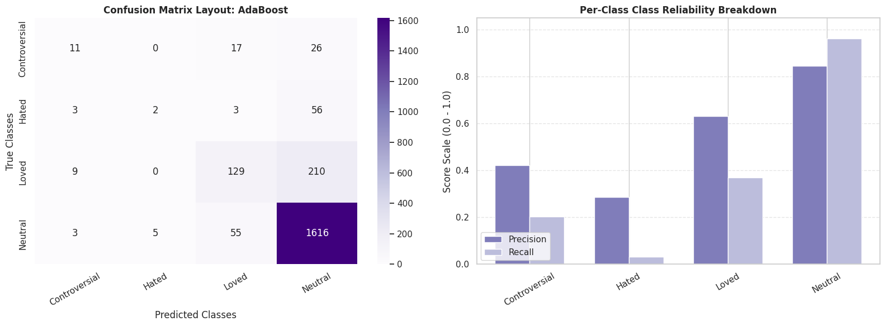
    


##### 📝 Model Analysis: AdaBoost (Re-Evaluation)

* **Sub-Optimal Sequential Focus:** AdaBoost achieves an overall accuracy of 81.96% and a Macro F1-Score of 0.4249. While exponential loss adjustments attempt to correct misclassifications, the algorithm gets trapped trying to fix overlapping boundaries between `Loved` and `Neutral` instances rather than recovering minority classes.
* **Severe Hated Class Blind Spot:** The model nearly collapses on the `Hated` category, yielding a poor recall of 3.12% and a minimal F1-Score of 0.0563. It only manages 2 true positive predictions out of 64 sample cases, dumping 56 of them directly into the dominant `Neutral` core.
* **Exponential Loss Penalty:** The high Log Loss of 1.3271 shows severe probability distortions. AdaBoost's traditional focus on updating sample weights—rather than optimizing a direct, calibrated multi-class probability framework—results in highly overconfident mistakes at the decision edges.

#### CatBoost 😺🚀


```python
# --- CatBoost ---
cat = CatBoostClassifier(iterations=150, verbose=0, random_state=42)
cat.fit(X_train_scaled_mc, y_train_mc)
```


    CatBoostClassifier(iterations=150, random_state=42, verbose=0)


```python
y_pred_cat = cat.predict(X_test_scaled_mc)
y_prob_cat = cat.predict_proba(X_test_scaled_mc)
evaluate_multiclass("CatBoost", y_test_mc, y_pred_cat, y_prob=y_prob_cat, labels=mc_labels)
```

    
    ============================================================
    🌟 Multiclass Evaluation: CatBoost
    ============================================================
    🔸 Accuracy:            0.8308
    🔸 F1-Score (Macro):    0.5283
    🔸 F1-Score (Micro):    0.8308
    🔸 F1-Score (Weighted): 0.8116
    🔸 Log Loss:            0.4640
    
    📋 Detailed Per-Class Report:


<style type="text/css">
#T_2663c_row0_col0, #T_2663c_row0_col1, #T_2663c_row0_col2 {
  background-color: #fcfbfd;
  color: #000000;
}
#T_2663c_row1_col0 {
  background-color: #eae8f2;
  color: #000000;
}
#T_2663c_row1_col1 {
  background-color: #f4f2f8;
  color: #000000;
}
#T_2663c_row1_col2 {
  background-color: #f1eff6;
  color: #000000;
}
#T_2663c_row2_col0 {
  background-color: #9e9ac8;
  color: #f1f1f1;
}
#T_2663c_row2_col1 {
  background-color: #dcdcec;
  color: #000000;
}
#T_2663c_row2_col2 {
  background-color: #c8c8e2;
  color: #000000;
}
#T_2663c_row3_col0, #T_2663c_row3_col1, #T_2663c_row3_col2 {
  background-color: #3f007d;
  color: #f1f1f1;
}
</style>
<table id="T_2663c">
  <thead>
    <tr>
      <th class="blank level0" >&nbsp;</th>
      <th id="T_2663c_level0_col0" class="col_heading level0 col0" >Precision</th>
      <th id="T_2663c_level0_col1" class="col_heading level0 col1" >Recall</th>
      <th id="T_2663c_level0_col2" class="col_heading level0 col2" >F1-Score</th>
      <th id="T_2663c_level0_col3" class="col_heading level0 col3" >Support</th>
    </tr>
  </thead>
  <tbody>
    <tr>
      <th id="T_2663c_level0_row0" class="row_heading level0 row0" >Controversial</th>
      <td id="T_2663c_row0_col0" class="data row0 col0" >0.4643</td>
      <td id="T_2663c_row0_col1" class="data row0 col1" >0.2407</td>
      <td id="T_2663c_row0_col2" class="data row0 col2" >0.3171</td>
      <td id="T_2663c_row0_col3" class="data row0 col3" >54</td>
    </tr>
    <tr>
      <th id="T_2663c_level0_row1" class="row_heading level0 row1" >Hated</th>
      <td id="T_2663c_row1_col0" class="data row1 col0" >0.5278</td>
      <td id="T_2663c_row1_col1" class="data row1 col1" >0.2969</td>
      <td id="T_2663c_row1_col2" class="data row1 col2" >0.3800</td>
      <td id="T_2663c_row1_col3" class="data row1 col3" >64</td>
    </tr>
    <tr>
      <th id="T_2663c_level0_row2" class="row_heading level0 row2" >Loved</th>
      <td id="T_2663c_row2_col0" class="data row2 col0" >0.6636</td>
      <td id="T_2663c_row2_col1" class="data row2 col1" >0.4138</td>
      <td id="T_2663c_row2_col2" class="data row2 col2" >0.5097</td>
      <td id="T_2663c_row2_col3" class="data row2 col3" >348</td>
    </tr>
    <tr>
      <th id="T_2663c_level0_row3" class="row_heading level0 row3" >Neutral</th>
      <td id="T_2663c_row3_col0" class="data row3 col0" >0.8616</td>
      <td id="T_2663c_row3_col1" class="data row3 col1" >0.9565</td>
      <td id="T_2663c_row3_col2" class="data row3 col2" >0.9066</td>
      <td id="T_2663c_row3_col3" class="data row3 col3" >1,679</td>
    </tr>
  </tbody>
</table>


    
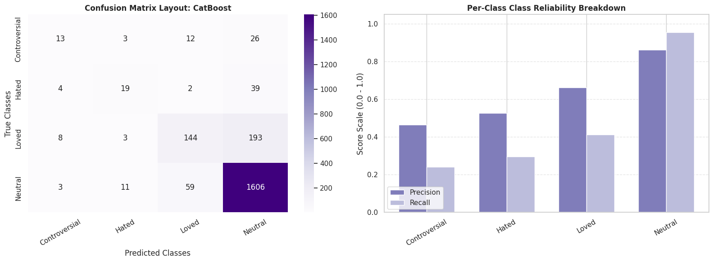
    


##### 📝 Model Analysis: CatBoost

* **Section-Best Probability Calibration:** Symmetric tree structures and ordered boosting mechanics minimize gradient bias, driving Log Loss to a section-best **0.4640**.
* **Robust Categorical Alignment:** Effectively captures non-linear boundary constraints without suffering from the high prediction variance typical of deep decision tree patterns, reaching a strong Macro F1-Score of **0.5283**.
* **Balanced Minority Recall Trajectory:** Demonstrates dependable detection rates across underrepresented target spaces, capturing a recall of **24.07%** for `Controversial` and **29.69%** for `Hated`.
* **Mitigated Majority Class Overfitting:** The symmetric split technique reduces random noise overfitting, keeping precision metrics stable while handling the severe background class balance imbalance.

### 🗣️ Discussion & Questions (Multiclass Classification)

**1. Choose the best multiclass-classification metric for your dataset and justify.**
> Given our severe target imbalance where `Neutral` possesses a massive support of 1,679 compared to only 54 for `Controversial` and 64 for `Hated`, the **Macro F1-Score** is definitively the best evaluation metric. Overall Accuracy is highly misleading here; for instance, the Multiclass SVM (OVR) achieves a high accuracy of 82.00% despite completely failing to predict a single true positive for the `Hated` class (0.00% recall). The Macro F1-Score calculates the unweighted mean of all class F1-scores symmetrically. This ensures that a model's inability to isolate minority classes is explicitly penalized—as seen in the low Macro F1-score of 0.3607 for the SVM versus the much higher 0.5372 achieved by XGBoost, which balances minority predictions more effectively.

**2. Explain how KNN and Decision Trees can be extended to multi-label classification problems.**
> Multi-label classification requires algorithms to handle instances that simultaneously belong to multiple non-mutually exclusive categories.
> * **KNN Extension:** Instead of utilizing a single majority vote among the $k$-nearest neighbors to output one label, the algorithm computes the neighborhood average over multi-hot encoded label vectors. For $k$ nearest neighbors, the fraction of neighbors possessing label $j$ is treated as its independent probability $P(L_j)$. The final output vector activates all labels whose individual neighborhood probabilities exceed a predefined, independent decision threshold (e.g., $P(L_j) \geq 0.5$).
> * **Decision Trees Extension:** The tree modification requires altering the split criterion (such as Gini Impurity or Entropy) to compute the average impurity across *all* labels simultaneously. A split is chosen to maximize the joint impurity reduction over the full target vector:
> $$Gini_{multi} = \frac{1}{|L|}\sum_{j \in L} \left(1 - \sum_{i \in \{0,1\}} p_{ji}^2\right)$$
> Upon reaching a leaf node, instead of assigning a single class vote, the leaf records and outputs an independent probability vector containing the fraction of training samples that carry each respective label label.

**3. What accuracy metric would you use to best evaluate a classification algorithm that predicts the football players' multi-label classes, and why?**
> The optimal evaluation approach requires using **Micro-averaged F1-Score (or Jaccard Index)** alongside **Hamming Loss**, depending on the precise clinical or administrative objective. 
> * **Justification against Subset Accuracy:** Using standard binary accuracy (Exact Match Ratio) is highly suboptimal here. If a player truly has a history of heart problems and knee injuries `[0, 1, 1, 0]`, and the model predicts `[1, 1, 1, 0]` (mistakenly flagging them as a former national player), Subset Accuracy treats this as a 0% completely incorrect prediction. 
> * **Why Hamming Loss and Micro-F1 excel:** In this specific scenario, Class 2 (heart problems) carries critical, life-threatening health risks, whereas Class 1 and Class 4 are purely sports-history markers. **Hamming Loss** evaluates the model at a granular level by measuring the fraction of individual label mistakes (giving a score of 0.25 error instead of a total failure). Concurrently, because critical labels like heart conditions and team captaincy are likely sparse across the player population, the **Micro-averaged F1-Score** or **Sample-averaged Jaccard Index** provides a robust, imbalance-resistant measure of how well the true positive label assignments overlap with the ground truth.


```python
df_summary = pd.DataFrame(mc_results_storage).T
df_summary.style.background_gradient(cmap='Purples', subset=['Accuracy', 'F1_Macro'])
```


<style type="text/css">
#T_9431d_row0_col0 {
  background-color: #8e8ac0;
  color: #f1f1f1;
}
#T_9431d_row0_col1, #T_9431d_row5_col0 {
  background-color: #fcfbfd;
  color: #000000;
}
#T_9431d_row1_col0 {
  background-color: #a19eca;
  color: #f1f1f1;
}
#T_9431d_row1_col1 {
  background-color: #faf9fc;
  color: #000000;
}
#T_9431d_row2_col0 {
  background-color: #8a86bf;
  color: #f1f1f1;
}
#T_9431d_row2_col1 {
  background-color: #d7d7e9;
  color: #000000;
}
#T_9431d_row3_col0, #T_9431d_row4_col0 {
  background-color: #e8e7f2;
  color: #000000;
}
#T_9431d_row3_col1 {
  background-color: #807dba;
  color: #f1f1f1;
}
#T_9431d_row4_col1 {
  background-color: #62429c;
  color: #f1f1f1;
}
#T_9431d_row5_col1 {
  background-color: #6f5ba8;
  color: #f1f1f1;
}
#T_9431d_row6_col0, #T_9431d_row10_col0 {
  background-color: #51228d;
  color: #f1f1f1;
}
#T_9431d_row6_col1 {
  background-color: #928fc3;
  color: #f1f1f1;
}
#T_9431d_row7_col0, #T_9431d_row7_col1 {
  background-color: #3f007d;
  color: #f1f1f1;
}
#T_9431d_row8_col0, #T_9431d_row8_col1 {
  background-color: #6c55a5;
  color: #f1f1f1;
}
#T_9431d_row9_col0 {
  background-color: #908dc2;
  color: #f1f1f1;
}
#T_9431d_row9_col1 {
  background-color: #bebfdd;
  color: #000000;
}
#T_9431d_row10_col1 {
  background-color: #470f84;
  color: #f1f1f1;
}
</style>
<table id="T_9431d">
  <thead>
    <tr>
      <th class="blank level0" >&nbsp;</th>
      <th id="T_9431d_level0_col0" class="col_heading level0 col0" >Accuracy</th>
      <th id="T_9431d_level0_col1" class="col_heading level0 col1" >F1_Macro</th>
      <th id="T_9431d_level0_col2" class="col_heading level0 col2" >F1_Micro</th>
      <th id="T_9431d_level0_col3" class="col_heading level0 col3" >F1_Weighted</th>
      <th id="T_9431d_level0_col4" class="col_heading level0 col4" >Log_Loss</th>
      <th id="T_9431d_level0_col5" class="col_heading level0 col5" >Controversial_Precision</th>
      <th id="T_9431d_level0_col6" class="col_heading level0 col6" >Controversial_Recall</th>
      <th id="T_9431d_level0_col7" class="col_heading level0 col7" >Hated_Precision</th>
      <th id="T_9431d_level0_col8" class="col_heading level0 col8" >Hated_Recall</th>
      <th id="T_9431d_level0_col9" class="col_heading level0 col9" >Loved_Precision</th>
      <th id="T_9431d_level0_col10" class="col_heading level0 col10" >Loved_Recall</th>
      <th id="T_9431d_level0_col11" class="col_heading level0 col11" >Neutral_Precision</th>
      <th id="T_9431d_level0_col12" class="col_heading level0 col12" >Neutral_Recall</th>
    </tr>
  </thead>
  <tbody>
    <tr>
      <th id="T_9431d_level0_row0" class="row_heading level0 row0" >Multiclass SVM (OVR)</th>
      <td id="T_9431d_row0_col0" class="data row0 col0" >0.820047</td>
      <td id="T_9431d_row0_col1" class="data row0 col1" >0.360701</td>
      <td id="T_9431d_row0_col2" class="data row0 col2" >0.820047</td>
      <td id="T_9431d_row0_col3" class="data row0 col3" >0.775361</td>
      <td id="T_9431d_row0_col4" class="data row0 col4" >0.570950</td>
      <td id="T_9431d_row0_col5" class="data row0 col5" >0.500000</td>
      <td id="T_9431d_row0_col6" class="data row0 col6" >0.074074</td>
      <td id="T_9431d_row0_col7" class="data row0 col7" >0.000000</td>
      <td id="T_9431d_row0_col8" class="data row0 col8" >0.000000</td>
      <td id="T_9431d_row0_col9" class="data row0 col9" >0.698630</td>
      <td id="T_9431d_row0_col10" class="data row0 col10" >0.293103</td>
      <td id="T_9431d_row0_col11" class="data row0 col11" >0.830236</td>
      <td id="T_9431d_row0_col12" class="data row0 col12" >0.984515</td>
    </tr>
    <tr>
      <th id="T_9431d_level0_row1" class="row_heading level0 row1" >Logistic Regression (OVR)</th>
      <td id="T_9431d_row1_col0" class="data row1 col0" >0.817249</td>
      <td id="T_9431d_row1_col1" class="data row1 col1" >0.364417</td>
      <td id="T_9431d_row1_col2" class="data row1 col2" >0.817249</td>
      <td id="T_9431d_row1_col3" class="data row1 col3" >0.774259</td>
      <td id="T_9431d_row1_col4" class="data row1 col4" >0.535948</td>
      <td id="T_9431d_row1_col5" class="data row1 col5" >0.200000</td>
      <td id="T_9431d_row1_col6" class="data row1 col6" >0.018519</td>
      <td id="T_9431d_row1_col7" class="data row1 col7" >0.277778</td>
      <td id="T_9431d_row1_col8" class="data row1 col8" >0.078125</td>
      <td id="T_9431d_row1_col9" class="data row1 col9" >0.718519</td>
      <td id="T_9431d_row1_col10" class="data row1 col10" >0.278736</td>
      <td id="T_9431d_row1_col11" class="data row1 col11" >0.830398</td>
      <td id="T_9431d_row1_col12" class="data row1 col12" >0.982728</td>
    </tr>
    <tr>
      <th id="T_9431d_level0_row2" class="row_heading level0 row2" >Logistic Regression (Multinomial)</th>
      <td id="T_9431d_row2_col0" class="data row2 col0" >0.820513</td>
      <td id="T_9431d_row2_col1" class="data row2 col1" >0.407576</td>
      <td id="T_9431d_row2_col2" class="data row2 col2" >0.820513</td>
      <td id="T_9431d_row2_col3" class="data row2 col3" >0.785153</td>
      <td id="T_9431d_row2_col4" class="data row2 col4" >0.528726</td>
      <td id="T_9431d_row2_col5" class="data row2 col5" >0.444444</td>
      <td id="T_9431d_row2_col6" class="data row2 col6" >0.074074</td>
      <td id="T_9431d_row2_col7" class="data row2 col7" >0.280000</td>
      <td id="T_9431d_row2_col8" class="data row2 col8" >0.109375</td>
      <td id="T_9431d_row2_col9" class="data row2 col9" >0.722581</td>
      <td id="T_9431d_row2_col10" class="data row2 col10" >0.321839</td>
      <td id="T_9431d_row2_col11" class="data row2 col11" >0.836912</td>
      <td id="T_9431d_row2_col12" class="data row2 col12" >0.974985</td>
    </tr>
    <tr>
      <th id="T_9431d_level0_row3" class="row_heading level0 row3" >Tuned KNN (k=6)</th>
      <td id="T_9431d_row3_col0" class="data row3 col0" >0.806527</td>
      <td id="T_9431d_row3_col1" class="data row3 col1" >0.470726</td>
      <td id="T_9431d_row3_col2" class="data row3 col2" >0.806527</td>
      <td id="T_9431d_row3_col3" class="data row3 col3" >0.791897</td>
      <td id="T_9431d_row3_col4" class="data row3 col4" >2.397983</td>
      <td id="T_9431d_row3_col5" class="data row3 col5" >0.269231</td>
      <td id="T_9431d_row3_col6" class="data row3 col6" >0.129630</td>
      <td id="T_9431d_row3_col7" class="data row3 col7" >0.447368</td>
      <td id="T_9431d_row3_col8" class="data row3 col8" >0.265625</td>
      <td id="T_9431d_row3_col9" class="data row3 col9" >0.539286</td>
      <td id="T_9431d_row3_col10" class="data row3 col10" >0.433908</td>
      <td id="T_9431d_row3_col11" class="data row3 col11" >0.863409</td>
      <td id="T_9431d_row3_col12" class="data row3 col12" >0.926147</td>
    </tr>
    <tr>
      <th id="T_9431d_level0_row4" class="row_heading level0 row4" >Decision Tree (Gini)</th>
      <td id="T_9431d_row4_col0" class="data row4 col0" >0.806527</td>
      <td id="T_9431d_row4_col1" class="data row4 col1" >0.500659</td>
      <td id="T_9431d_row4_col2" class="data row4 col2" >0.806527</td>
      <td id="T_9431d_row4_col3" class="data row4 col3" >0.791978</td>
      <td id="T_9431d_row4_col4" class="data row4 col4" >2.815258</td>
      <td id="T_9431d_row4_col5" class="data row4 col5" >0.405405</td>
      <td id="T_9431d_row4_col6" class="data row4 col6" >0.277778</td>
      <td id="T_9431d_row4_col7" class="data row4 col7" >0.338983</td>
      <td id="T_9431d_row4_col8" class="data row4 col8" >0.312500</td>
      <td id="T_9431d_row4_col9" class="data row4 col9" >0.561702</td>
      <td id="T_9431d_row4_col10" class="data row4 col10" >0.379310</td>
      <td id="T_9431d_row4_col11" class="data row4 col11" >0.861632</td>
      <td id="T_9431d_row4_col12" class="data row4 col12" >0.930911</td>
    </tr>
    <tr>
      <th id="T_9431d_level0_row5" class="row_heading level0 row5" >Decision Tree (Entropy)</th>
      <td id="T_9431d_row5_col0" class="data row5 col0" >0.800932</td>
      <td id="T_9431d_row5_col1" class="data row5 col1" >0.487573</td>
      <td id="T_9431d_row5_col2" class="data row5 col2" >0.800932</td>
      <td id="T_9431d_row5_col3" class="data row5 col3" >0.786422</td>
      <td id="T_9431d_row5_col4" class="data row5 col4" >3.354517</td>
      <td id="T_9431d_row5_col5" class="data row5 col5" >0.327273</td>
      <td id="T_9431d_row5_col6" class="data row5 col6" >0.333333</td>
      <td id="T_9431d_row5_col7" class="data row5 col7" >0.365854</td>
      <td id="T_9431d_row5_col8" class="data row5 col8" >0.234375</td>
      <td id="T_9431d_row5_col9" class="data row5 col9" >0.543933</td>
      <td id="T_9431d_row5_col10" class="data row5 col10" >0.373563</td>
      <td id="T_9431d_row5_col11" class="data row5 col11" >0.859116</td>
      <td id="T_9431d_row5_col12" class="data row5 col12" >0.926147</td>
    </tr>
    <tr>
      <th id="T_9431d_level0_row6" class="row_heading level0 row6" >Random Forest</th>
      <td id="T_9431d_row6_col0" class="data row6 col0" >0.830769</td>
      <td id="T_9431d_row6_col1" class="data row6 col1" >0.457291</td>
      <td id="T_9431d_row6_col2" class="data row6 col2" >0.830769</td>
      <td id="T_9431d_row6_col3" class="data row6 col3" >0.796249</td>
      <td id="T_9431d_row6_col4" class="data row6 col4" >0.480515</td>
      <td id="T_9431d_row6_col5" class="data row6 col5" >0.714286</td>
      <td id="T_9431d_row6_col6" class="data row6 col6" >0.185185</td>
      <td id="T_9431d_row6_col7" class="data row6 col7" >0.857143</td>
      <td id="T_9431d_row6_col8" class="data row6 col8" >0.093750</td>
      <td id="T_9431d_row6_col9" class="data row6 col9" >0.715152</td>
      <td id="T_9431d_row6_col10" class="data row6 col10" >0.339080</td>
      <td id="T_9431d_row6_col11" class="data row6 col11" >0.841246</td>
      <td id="T_9431d_row6_col12" class="data row6 col12" >0.981537</td>
    </tr>
    <tr>
      <th id="T_9431d_level0_row7" class="row_heading level0 row7" >XGBoost</th>
      <td id="T_9431d_row7_col0" class="data row7 col0" >0.834499</td>
      <td id="T_9431d_row7_col1" class="data row7 col1" >0.537186</td>
      <td id="T_9431d_row7_col2" class="data row7 col2" >0.834499</td>
      <td id="T_9431d_row7_col3" class="data row7 col3" >0.815791</td>
      <td id="T_9431d_row7_col4" class="data row7 col4" >0.490876</td>
      <td id="T_9431d_row7_col5" class="data row7 col5" >0.500000</td>
      <td id="T_9431d_row7_col6" class="data row7 col6" >0.277778</td>
      <td id="T_9431d_row7_col7" class="data row7 col7" >0.529412</td>
      <td id="T_9431d_row7_col8" class="data row7 col8" >0.281250</td>
      <td id="T_9431d_row7_col9" class="data row7 col9" >0.663636</td>
      <td id="T_9431d_row7_col10" class="data row7 col10" >0.419540</td>
      <td id="T_9431d_row7_col11" class="data row7 col11" >0.865664</td>
      <td id="T_9431d_row7_col12" class="data row7 col12" >0.959500</td>
    </tr>
    <tr>
      <th id="T_9431d_level0_row8" class="row_heading level0 row8" >LightGBM</th>
      <td id="T_9431d_row8_col0" class="data row8 col0" >0.825641</td>
      <td id="T_9431d_row8_col1" class="data row8 col1" >0.490978</td>
      <td id="T_9431d_row8_col2" class="data row8 col2" >0.825641</td>
      <td id="T_9431d_row8_col3" class="data row8 col3" >0.802663</td>
      <td id="T_9431d_row8_col4" class="data row8 col4" >0.488414</td>
      <td id="T_9431d_row8_col5" class="data row8 col5" >0.392857</td>
      <td id="T_9431d_row8_col6" class="data row8 col6" >0.203704</td>
      <td id="T_9431d_row8_col7" class="data row8 col7" >0.444444</td>
      <td id="T_9431d_row8_col8" class="data row8 col8" >0.250000</td>
      <td id="T_9431d_row8_col9" class="data row8 col9" >0.643216</td>
      <td id="T_9431d_row8_col10" class="data row8 col10" >0.367816</td>
      <td id="T_9431d_row8_col11" class="data row8 col11" >0.858661</td>
      <td id="T_9431d_row8_col12" class="data row8 col12" >0.962478</td>
    </tr>
    <tr>
      <th id="T_9431d_level0_row9" class="row_heading level0 row9" >AdaBoost</th>
      <td id="T_9431d_row9_col0" class="data row9 col0" >0.819580</td>
      <td id="T_9431d_row9_col1" class="data row9 col1" >0.424940</td>
      <td id="T_9431d_row9_col2" class="data row9 col2" >0.819580</td>
      <td id="T_9431d_row9_col3" class="data row9 col3" >0.789715</td>
      <td id="T_9431d_row9_col4" class="data row9 col4" >1.327124</td>
      <td id="T_9431d_row9_col5" class="data row9 col5" >0.423077</td>
      <td id="T_9431d_row9_col6" class="data row9 col6" >0.203704</td>
      <td id="T_9431d_row9_col7" class="data row9 col7" >0.285714</td>
      <td id="T_9431d_row9_col8" class="data row9 col8" >0.031250</td>
      <td id="T_9431d_row9_col9" class="data row9 col9" >0.632353</td>
      <td id="T_9431d_row9_col10" class="data row9 col10" >0.370690</td>
      <td id="T_9431d_row9_col11" class="data row9 col11" >0.846960</td>
      <td id="T_9431d_row9_col12" class="data row9 col12" >0.962478</td>
    </tr>
    <tr>
      <th id="T_9431d_level0_row10" class="row_heading level0 row10" >CatBoost</th>
      <td id="T_9431d_row10_col0" class="data row10 col0" >0.830769</td>
      <td id="T_9431d_row10_col1" class="data row10 col1" >0.528346</td>
      <td id="T_9431d_row10_col2" class="data row10 col2" >0.830769</td>
      <td id="T_9431d_row10_col3" class="data row10 col3" >0.811642</td>
      <td id="T_9431d_row10_col4" class="data row10 col4" >0.464004</td>
      <td id="T_9431d_row10_col5" class="data row10 col5" >0.464286</td>
      <td id="T_9431d_row10_col6" class="data row10 col6" >0.240741</td>
      <td id="T_9431d_row10_col7" class="data row10 col7" >0.527778</td>
      <td id="T_9431d_row10_col8" class="data row10 col8" >0.296875</td>
      <td id="T_9431d_row10_col9" class="data row10 col9" >0.663594</td>
      <td id="T_9431d_row10_col10" class="data row10 col10" >0.413793</td>
      <td id="T_9431d_row10_col11" class="data row10 col11" >0.861588</td>
      <td id="T_9431d_row10_col12" class="data row10 col12" >0.956522</td>
    </tr>
  </tbody>
</table>


```python
def multiclass_classification_plotter():
    # 1. Convert storage cache to a clean DataFrame
    df_plot = pd.DataFrame(mc_results_storage).T.reset_index()
    df_plot.rename(columns={'index': 'Model'}, inplace=True)

# 2. Setup the visualization matrix (Three distinct metrics axes)
    fig, axes = plt.subplots(1, 3, figsize=(20, 6))
    colors = ['#807dba', '#9e9ac8', '#bcbddc']

# Chart A: Accuracy Comparison
    sns.barplot(x='Accuracy', y='Model', data=df_plot, ax=axes[0], color=colors[0])
    axes[0].set_title('Overall Accuracy Comparison', fontsize=12, fontweight='bold')
    axes[0].set_xlabel('Score Scale')
    axes[0].set_xlim(0, 1.05)
    axes[0].grid(axis='x', linestyle='--', alpha=0.5)

# Chart B: Macro F1-Score Comparison (Crucial for your imbalanced classes!)
    sns.barplot(x='F1_Macro', y='Model', data=df_plot, ax=axes[1], color=colors[1])
    axes[1].set_title('Macro F1-Score Leaderboard', fontsize=12, fontweight='bold')
    axes[1].set_xlabel('Score Scale')
    axes[1].set_ylabel('') # Clear y-label to avoid repetition
    axes[1].set_xlim(0, 1.05)
    axes[1].grid(axis='x', linestyle='--', alpha=0.5)

# Chart C: Log Loss (Lower is better)
# Filters out any model that missing probability outputs safely
    df_loss = df_plot.dropna(subset=['Log_Loss'])
    if not df_loss.empty:
        sns.barplot(x='Log_Loss', y='Model', data=df_loss, ax=axes[2], color=colors[2])
        axes[2].set_title('Model Log Loss (Lower = Better)', fontsize=12, fontweight='bold')
        axes[2].set_xlabel('Loss Scale')
        axes[2].set_ylabel('')
        axes[2].grid(axis='x', linestyle='--', alpha=0.5)
    else:
        axes[2].text(0.5, 0.5, 'No Log Loss Data Available', ha='center', va='center', fontsize=14)
        axes[2].set_title('Model Log Loss', fontsize=12, fontweight='bold')

    plt.tight_layout()
    plt.show()

multiclass_classification_plotter()
```


    
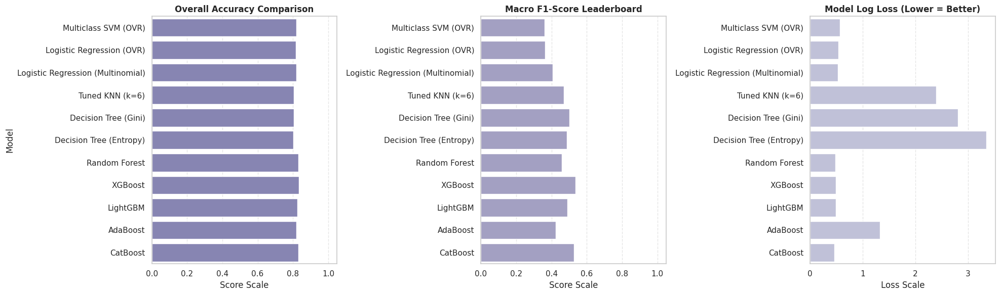
    


---

## 4️⃣ 🤔 Challenging Questions (Bonus)

**1. Explain bias–variance trade-off in regression models**
> The bias-variance trade-off decomposes a model's expected prediction error into three components: $(\text{Bias})^2 + \text{Variance} + \text{Irreducible Error}$. 
> * **Bias:** Erroneous assumptions made by the model to make a target function easier to learn (leading to underfitting). High-bias models (e.g., linear regression on non-linear data) consistently miss structural signals.
> * **Variance:** The model's sensitivity to small fluctuations in the training dataset (leading to overfitting). High-variance models (e.g., unpruned decision trees) model the random noise in the training data rather than the true underlying distribution.
> * Minimizing total error requires finding an optimal complexity threshold that balances both factors.

**2. When does Kernel Regression outperform Linear Regression**
> Kernel Regression outperforms Linear Regression when the true underlying relationship between the independent and dependent variables is highly non-linear, non-monotonic, or complexly multi-modal. Linear regression assumes a global constant change parameter. Kernel regression applies a localized weight mapping (e.g., using a Gaussian Kernel) where predictions are dictated primarily by nearby data points, allowing it to adapt effortlessly to intricate local curves and surfaces without explicit feature engineering.

**3. Compare L1 vs L2 regularization**
* **When does LASSO perform better?** 
> LASSO ($L_1$) performs better when the dataset has high dimensionality with a sparse true underlying feature landscape—meaning only a small subset of features actually impact the target variable.
* **When does Ridge perform better?** 
> Ridge ($L_2$) performs better when most features have a small but active impact on the target, or when the features exhibit severe multicollinearity (high correlation). Ridge distributes the coefficient penalties smoothly across all correlated features, whereas LASSO randomly keeps one and drops the rest.
* **Why does LASSO produce sparsity?** 
> Mathematically, the $L_1$ penalty constrains the coefficient space using an absolute-value diamond/cross-polytope budget geometry ($|w_1| + |w_2| \leq t$). The contours of the objective loss function are highly likely to hit this constraint budget at its sharp corners, where one or more axis coordinates equal exactly zero ($w_j = 0$). Conversely, Ridge constrains via a circular hypersphere ($w_1^2 + w_2^2 \leq t$), causing loss contours to hit tangentially without forcing weights exactly to zero.

**4. Explain why MAPE is unreliable in some datasets**
> Mean Absolute Percentage Error (MAPE) is calculated as:
> $$\text{MAPE} = \frac{100\%}{n}\sum_{i=1}^n \left|\frac{y_i - \hat{y}_i}{y_i}\right|$$
> This formula makes MAPE systematically unreliable due to two structural flaws:
> * **Division by Zero / Near-Zero:** If any actual value $y_i$ equals zero, the formula is undefined. If $y_i$ is very close to zero, the ratio explodes, causing massive outliers in the metric even for minor absolute mistakes.
> * **Asymmetry Penalty:** MAPE penalizes overpredictions much more severely than underpredictions. If $y_i = 10$, a prediction of $\hat{y}_i = 0$ (underprediction) yields a 100% error, but a prediction of $\hat{y}_i = 30$ (overprediction) yields a 200% error. This biases models evaluated on MAPE to systematically underpredict.

**5. Discuss the effect of outliers on regression models**
> Outliers exert disproportionate leverage on traditional regression models that optimize ordinary least squares (OLS) loss ($L_2$ norm). Because errors are squared, a single data point located far from the main regression line creates a massive penalty. The optimization process skews the entire line of best fit toward the outlier to minimize its extreme squared residual, compromising performance across the remaining, standard data points. Mitigating this requires utilizing robust estimators like Huber Loss, RANSAC, or absolute loss ($L_1$ norm).

**6. Explain the effect of class imbalance on binary metrics. Why is accuracy misleading in imbalanced datasets**
> In imbalanced datasets, the majority class completely dominates the calculation of overall accuracy. For example, if a dataset contains 98% negative samples and 2% positive samples, a completely uneducated model that blindly predicts "negative" for every instance will achieve a stellar 98% accuracy. Accuracy completely masks the fact that the model has zero predictive power for the positive class. Under severe imbalance, binary performance must instead be assessed via Precision, Recall, and the Precision-Recall Area Under Curve (PR-AUC) to capture minority class transitions safely.

**7. Explain how the decision boundaries of your models differ fundamentally (bonus)**
> * **Logistic Regression / SVM (Linear):** Formulate continuous linear hyperplanes ($w^T x + b = 0$). The boundary is flat, global, and cuts through the entire input space smoothly.
> * **KNN:** Constructs localized, piece-wise Voronoi tessellations. The boundary is non-linear, highly intricate, and shifts dynamically based on local instance densities.
> * **Decision Trees / Random Forest / XGBoost:** Build orthogonal, axis-aligned step functions. The boundary consists of hyper-rectangular decision boxes generated by sequential threshold rules (e.g., $x_i \le \theta$).

**8. Explain effect of K in KNN**
> * **Low $K$ (e.g., $K=1$):** High model complexity, low bias, and high variance. The decision boundary is highly sensitive to local noise and individual outliers, creating a jagged, overfitted boundary.
> * **High $K$ (e.g., $K=50$):** Low model complexity, high bias, and low variance. The boundary becomes overly smooth, erasing fine structural details and dragging local predictions toward the global class majority.

**9. Overfitting in Decision Trees:**
* **Why do decision trees overfit easily?**
> They use a recursive, greedy splitting approach that continues partitioning data points down to absolute purity. If unrestricted, a tree will simply memorize every unique combination of training features, creating isolated leaf paths for individual data points.
* **Why is max depth not enough?**
> Setting a global maximum depth restricts vertical growth but doesn't prevent the tree from making weak, high-variance splits on noisy features within upper layers. A node can still be split based on tiny, unrepresentative differences in small sample slices.
* **How pruning works?**
> Cost-complexity pruning applies a penalty to the tree's objective function based on the total number of terminal leaves ($|T|$). It tracks the cost function $R_\alpha(T) = R(T) + \alpha|T|$, systematically collapsing weak bottom leaves that fail to reduce impurity by a critical threshold factor ($\alpha$), converting those branches back into standard leaf nodes.

**10. Explain why Tree-based models are good feature selectors**
> Tree-based algorithms naturally rank features through their greedy top-down splitting mechanism. At each node, the model evaluates all available features and selects the exact split point that maximizes information gain (or Gini impurity reduction). Features positioned at the top of the tree carry the highest global predictive value. By aggregating the total impurity reduction contributed by each feature across all internal nodes, the model constructs an explicit, non-linear feature importance ranking that automatically ignores irrelevant or highly redundant features.

**11. Micro vs Macro vs Weighted F1**
* **When is Macro F1 a better reflection?**
> Macro F1 is a better reflection when you care equally about performance across all target classes, regardless of how few samples they contain. It treats every class as an equal contributor to the final score.
* **When is Weighted F1 misleading?**
> Weighted F1 is misleading under severe class imbalance because it multiplies each class's F1-score by its structural proportion in the dataset. If the dominant majority class performs perfectly, it will pull the Weighted F1 score up to a high value (e.g., 0.85), completely hiding the fact that the model is failing on rare classes.
* **Why does Micro F1 favor large classes?**
> Micro F1 pools the total true positives, false positives, and false negatives globally across all instances before calculating a single score. Because the majority class accounts for the vast majority of all individual test instances, its performance dominates the global counts, making the final Micro F1 mirror the majority class outcome.

**12. Multi-label vs Multiclass**
* **Fundamental Difference:**
> Multiclass classification assumes an instance belongs to exactly one mutually exclusive category out of $N$ choices. Multi-label classification allows an instance to be simultaneously assigned to multiple, independent categories.
* **Output Space:**
> In multiclass, the output space is a single class identifier vector or a single probability distribution summing to 1. In multi-label, the output space is a binary bitmask vector of size $N$ (e.g., `[1, 0, 1, 1]`), where each entry represents an independent presence/absence marker.
* **Loss Functions:**
> Multiclass optimizes Cross-Entropy Loss across a softmax probability layer. Multi-label optimizes Binary Cross-Entropy Loss independently across each output node, treating the problem as a collection of separate binary tasks.
* **Thresholding:**
> Multiclass applies an `argmax` operation to pick the single highest probability index. Multi-label evaluates each output node against independent decision thresholds (e.g., $\text{output}_j \ge 0.5$) to decide which tags to activate.
* **Metrics:**
> Multiclass relies on standard Accuracy, Macro F1, and Categorical Log Loss. Multi-label requires Subset Accuracy, Hamming Loss, and Jaccard Index metrics.
* **Why KNN and Trees extend naturally:**
> KNN easily scales because neighbor lookups occur entirely within feature space; the label aggregation can be replaced with element-wise vector averaging. Decision trees extend naturally because their internal nodes can evaluate split choices based on joint multi-label variance reductions, and the leaf nodes can output independent activation probabilities for every target category.

**13. Explain precision–recall trade-off**
> Precision (the fraction of positive predictions that are truly positive) and Recall (the fraction of actual positive instances captured) exist in an inverse relationship controlled by the model's decision threshold. Raising the activation threshold makes the model highly conservative; it only predicts a positive class when it is absolutely certain, which drives **Precision up** but causes it to miss borderline cases, dragging **Recall down**. Lowering the threshold causes the model to predict the positive class aggressively, capturing almost all true instances (**high Recall**) at the expense of introducing many false positives (**low Precision**).

**14. Explain ROC vs PR curve**
> * **ROC Curve:** Plots True Positive Rate (Recall) against False Positive Rate. The False Positive Rate calculation includes True Negatives in its denominator, making the ROC curve highly resilient to changes in class distributions. It is the preferred choice when evaluating stable models on balanced or mildly imbalanced datasets.
> * **PR Curve:** Plots Precision against Recall. Both metrics focus exclusively on the positive class and do not incorporate true negatives. Consequently, when dealing with severe class imbalances where the negative class dominates the dataset, the PR curve provides a much sharper, more accurate visual reflection of model degradation when false positives start leaking in.

**15. If you had unlimited time and resources, how would you improve your models?**
* **Better Preprocessing:**
> Implement advanced data augmentation strategies to handle minority target categories. Apply robust scaling transformations to non-linear variables and deploy specialized target-guided categorical encodings to minimize noise injection.
* **Better Features:**
> Engineer interaction terms, aggregate historical statistical windows, and extract deep feature representations using specialized unsupervised models (like autoencoders) to map underlying domain-specific behaviors.
* **Better Models:**
> Move beyond shallow trees into deep neural architectures, build heterogeneous stacking ensembles that fuse gradient-boosted machines with deep networks, and integrate automated hyperparameter optimization (like multi-generation genetic algorithms or Bayesian optimization).
* **Better Metrics:**
> Transition optimization objective functions directly to cost-sensitive loss profiles that map real-world penalties. Utilize specialized threshold-moving optimizations tailored to maximize the PR-AUC space for rare target groups.
