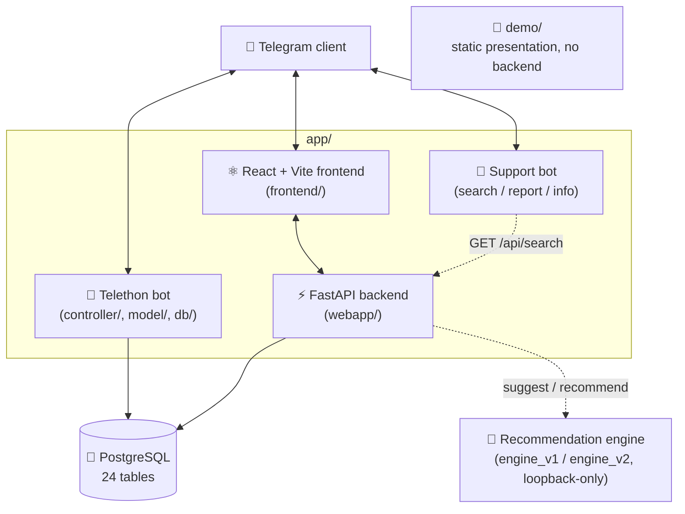

<div align="center">

# 🎵 SUT Music

**From a chaotic, meme-filled Telegram group to a full data platform —**
**a 24-table database, a recommendation engine, and a Telegram Mini App, built on top of it.**

[](https://t.me/SharifMusic)
[](https://t.me/SUTMusic_Bot)
[](https://t.me/SUTMusic_Bot?startapp)
[](https://github.com/MaximumAsp66915/Applied_Data_Science_Course)

</div>

---

## 📖 What is this?

**[SUT Music](https://t.me/SharifMusic)** started as a public Telegram group where students of Sharif University's
Electrical Engineering department shared songs — and grew into a university-wide, multi-thousand-track music
community. This repository is the story (and the code) of turning that group into a real product:

- **Scraping** years of shared tracks, artists, reactions, and users out of Telegram into a clean dataset.
- **Housing** all of it in a properly designed, 24-table **PostgreSQL** database with a caching model layer.
- **Cleaning & exploring** the data to make it usable.
- **Training a recommendation engine** — two generations of it — that learns what a person would want to hear next.
- **Shipping a product**: a Telegram bot, a support/search bot, and a full **Telegram Mini App** (React frontend +
  FastAPI backend) that anyone in the group can open and use, with zero signup.
- **Presenting it all** through a self-contained, phone-frame demo.

Every part of that pipeline lives in this repo, organized as its own independently runnable component.

---

## 📊 By the numbers

| Metric | Value |
|---|---:|
| Tracks | **14,843** |
| Artists | **5,349** |
| Contributing users | **~1,300** |
| Track reactions | **86,917** |
| Artist reactions | **71,770** |
| Database tables | **24** |
| Full scrape cycle | **~16 hours** |

---

## 🧩 Repository layout

```
.
├── app/                  # The product: Telegram bot + Mini App backend/frontend + support bot
│   ├── main.py             # Telethon bot entrypoint
│   ├── controller/          # Bot logic (main bot + support bot)
│   ├── model/                # Cached data-model layer (Track, Artist, User, Chat, ...)
│   ├── db/                    # Postgres access layer (internal + external connectors)
│   ├── webapp/                 # FastAPI backend for the Mini App
│   ├── frontend/                # React + Vite + Tailwind Mini App UI
│   ├── config/, utils/           # Shared config & helpers
│   └── run_support_bot.py         # Support bot entrypoint (search / report / info)
│
├── engine_v1/            # Recommendation engine, generation 1 — single matrix-factorization model
├── engine_v2/            # Recommendation engine, generation 2 — two-stage ensemble (artist → track)
│
├── notebooks/            # The full written story of the project, chapter by chapter
│   ├── 1.scrapping.md
│   ├── 2.database-management.md
│   ├── 3.datacleaning-EDA.ipynb
│   ├── 4.recommendation-engine.ipynb
│   ├── 5.webapp.md
│   └── 6.demo.md
│
├── demo/                 # Static, backend-free phone-frame walkthrough of the product
│   ├── v1/
│   └── v2/
│
└── .github/workflows/    # CI/CD — independent deploy pipelines per component
```

---

## 🏗️ How it fits together



- **One shared brain.** The bot and the Mini App backend both go through the same `model/` + `db/` layer and the
  same PostgreSQL database — a reaction given in the group and a reaction given in the Mini App are the exact
  same database write. No sync jobs, no drift.
- **The recommendation engine is its own microservice.** It binds to `127.0.0.1` only, has no database access of
  its own, and is deployed and restarted completely independently of the bot/webapp/frontend. `engine_v2` is a
  drop-in replacement for `engine_v1` — same HTTP contract, better model underneath.
- **The support bot never touches the database.** It's a thin, independently-deployable client that only calls
  the webapp's own public search endpoint.
- **The demo is deliberately disconnected.** Flat HTML + Tailwind, hardcoded content, zero backend — built to
  *present* the product reliably, without depending on a live server, database, or Telegram session.

---

## ⚙️ Components at a glance

| Component | What it is | Stack |
|---|---|---|
| **Telegram bot** (`app/`, `main.py`) | The original SUT Music userbot — group scraping, reactions, chat state | Python, [Telethon](https://docs.telethon.dev/) |
| **Mini App backend** (`app/webapp/`) | REST API behind the Mini App — auth, tracks, artists, search, ranks, suggestions, media proxy | FastAPI, asyncpg/psycopg2 |
| **Mini App frontend** (`app/frontend/`) | The actual UI users tap and scroll through inside Telegram | React 18, Vite, Tailwind CSS, Framer Motion, `@twa-dev/sdk` |
| **Support bot** (`app/run_support_bot.py`) | Chat-based search, bug reports, About/Terms, opens the Mini App | [aiogram](https://docs.aiogram.dev/) |
| **Recommendation engine v1** (`engine_v1/`) | Matrix-factorization model, single-stage ranking | FastAPI, NumPy |
| **Recommendation engine v2** (`engine_v2/`) | Two-stage ensemble — artist-level ranking, then track-level re-ranking | FastAPI, NumPy, scikit-learn |
| **Data pipeline** (`notebooks/`) | Scraping, database design, cleaning/EDA, and the recommender training story | Jupyter, pandas, PostgreSQL |
| **Demo** (`demo/`) | Self-contained phone-frame product walkthrough — two presentation modes, nine screens | Static HTML, Tailwind |

---

## 🔐 Security & data integrity highlights

- **Signed Mini App auth** — every request from the frontend carries Telegram's own `initData`, re-verified
  server-side via an HMAC-SHA256 chain rooted in the bot token; nothing about "who's asking" is ever trusted from
  a query param.
- **Loopback-only recommendation engine** — no public interface, no auth of its own; binding to `127.0.0.1` *is*
  the security boundary.
- **Hardcoded per-function access levels** at the database layer — no code path can casually query more than it's
  explicitly allowed to.
- **Internal vs. external database split** — most data lives on a fast internal server; users and chats, which
  must stay consistent across servers, are synced through a separate external layer.

---

## 🎓 About the project

SUT Music began as an Applied Data Science course project, built on top of a real, years-old Telegram community —
turning a genuinely messy, real-world dataset into a working product end to end: scraping, database design, data
cleaning, model training, and a shipped user-facing app.

<div align="center">

### 🔗 Links

[](https://t.me/SharifMusic)
[](https://t.me/SUTMusic_Bot)
[](https://t.me/SUTMusic_Bot?startapp)
[](https://github.com/MaximumAsp66915/Applied_Data_Science_Course)

</div>
