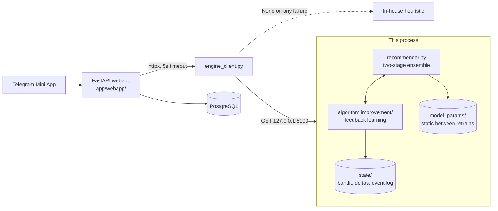
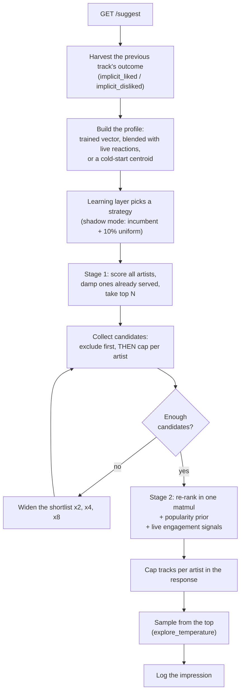

# SUT Music recommendation engine — R&D build

A rewrite of the `engine_v2` serving microservice, plus a feedback-learning
layer that lets it improve from use instead of standing still between weekly
retrains.

Same two-stage ensemble model, same trained artifacts, same HTTP contract — so
`app/webapp/engine_client.py` cannot tell it apart from `engine_v2`. Everything
else is different.

Three documents, three purposes:

| | |
|---|---|
| **This file** | How the engine works end to end, and how to run it |
| **[ANALYSIS.md](ANALYSIS.md)** | The study of `engine_v2` this rewrite came out of: ~30 findings with evidence |
| **[algorithm improvement/README.md](algorithm%20improvement/README.md)** | The learning layer in depth: the bandit, the reward model, and the measurements that set its defaults |

---

## 1. What this thing is

A standalone FastAPI process, bound to loopback, that answers one question:
*given what we know about this listener, which track should they hear next?*

It holds about 11 MB of trained arrays in memory and answers in well under a
millisecond. It never touches a database — the app passes in whatever signal it
has on each call — and it never writes to the model files.



The engine failing degrades suggestions; it does not take the app down.
`engine_client.py` returns `None` on any error and the webapp falls back to its
own heuristic.

---

## 2. How a recommendation gets made

### The model (unchanged from v2, and correct)

The interaction matrix is **0.55% dense** with a median of **four** positive
reactions per track (Chapter 3). A latent vector fitted from four observations
is barely an estimate, so ranking 12,433 tracks directly does not work. Artist
level is denser — aggregating triples the mean observation count — so the
architecture ranks artists first and only asks the track model to order a
shortlist it has already vouched for.

**Stage 1 — `HybridArtistMF`.** Scores all 5,107 artists for the listener:

```
score(user, artist) = user_emb · (artist_id_emb + genre_proj(genre_features))
                      + artist_bias
```

The genre projection is what lets the model say anything about an artist with
almost no interactions: their id embedding is near its initialisation, so their
representation is carried by their genres instead.

**Stage 2 — `TrackMF`.** Plain matrix factorisation over user × track. Never
asked to rank the catalogue, only to order a few dozen candidates — which is
exactly the regime where a noisy model is still useful.

### The request path



Nine numbered fixes separate that path from `engine_v2`'s. Each is marked
`[FIX n]` in [`recommender.py`](recommender.py) and written up in
[ANALYSIS.md](ANALYSIS.md); the four that mattered most:

- **Exclusion before truncation.** `engine_v2` sliced each artist's list to its
  top 10 and *then* removed tracks the listener had heard — so an artist with
  129 tracks contributed nothing once its top 10 were played. It penalised the
  most engaged users first.
- **2,410 unreachable tracks made reachable.** The candidate index skipped any
  track absent from `track_pop`, i.e. anything nobody had reacted to yet — 16%
  of the catalogue, structurally invisible to a discovery product.
- **The trained artist bias is available.** It exists only inside
  `artist_model_state.pt` and was never exported, so v2 ranked with a function
  it had not trained. `tools/build_params.py` recovers it without importing
  torch.
- **Diversity control.** v2's own notebook shows a listener handed five
  consecutive Eminem tracks. There is now a per-response cap and a stateless
  session-level damping term.

### Learning from use

The engine also gets better over time. In one paragraph: every served
recommendation is logged with the decision that produced it; the app's existing
"completed"/"skipped" reports are matched back to those impressions; and three
learners consume the resulting reward — a contextual bandit over serving
strategies, a Beta posterior per track, and (currently off, for measured
reasons) an online per-user preference vector.

The default posture is **shadow mode**: the bandit trains from day one but does
not steer traffic, and 10% of requests explore uniformly to build a valid
off-policy dataset. Turning the learned policy on is a deliberate act, gated on
an off-policy estimate showing it beats the incumbent.

Measured in simulation against no learning at all: **+0.4 points of completion
rate** with the shipped defaults, with attribution at 1.0 and 3,038 tracks
accumulating live evidence. The full write-up, including the component that
measured *worse* and therefore ships disabled, is in
[algorithm improvement/README.md](algorithm%20improvement/README.md).

---

## 3. Running it

```bash
cd "engine RND"
bash setup_venv.sh          # creates .venv, installs deps, builds model_params/
source .venv/bin/activate
uvicorn main:app --host 127.0.0.1 --port 8100
```

Binds to **127.0.0.1 only**. There is no auth of its own; loopback is the entire
security boundary, as in v1 and v2 — except that the systemd unit now enforces
it with `IPAddressAllow=localhost` rather than trusting a default argument.

The folder name contains a space, so paths need quoting: `cd "engine RND"`.
That is deliberate — `.github/workflows/deploy-engine.yml` deploys folders
matching `engine_v*`, so this one can never be auto-deployed. Promoting it means
copying it to `engine_v3/`; the internal layout is identical to `engine_v1` and
`engine_v2` on purpose.

Without a built bundle the engine falls back to reading
`../engine_v2/model_params/` read-only. That works for a look, but needs
`scikit-learn` and cannot use the artist bias — see
[`model_params/README.md`](model_params/README.md).

### Tests

```bash
python -m pytest            # 197 tests
```

`engine_v1` and `engine_v2` have none between them. 99 cover the engine — each
naming the v2 behaviour it exists to prevent coming back — and 98 cover the
learning layer, weighted toward its safety properties.

### Benchmark

```bash
python tools/benchmark.py --users 300 --session-length 20
```

Runs `engine_v2`'s exact serving algorithm and this one over the same artifacts:

| | `engine_v2` | here |
|---|---:|---:|
| Distinct artists in a 10-track response | 6.95 | **7.74** |
| Distinct artists over a 20-track session | 11.25 | **14.48** |
| Requests falling through to popularity | 0.07% | **0.00%** |
| Catalogue coverage across all sessions | 12.86% | **14.07%** |
| Exposure Gini (lower is less concentrated) | 0.545 | **0.523** |
| Tracks the algorithm can *ever* return | 12,024 | **14,291** |
| Latency p50 / p95 | 0.27 / 0.43 ms | 0.40 / 0.58 ms |

No accuracy comparison appears there, deliberately. Producing a trustworthy one
needs the raw interaction CSVs and a retrain under the protocol in
[ANALYSIS.md §4](ANALYSIS.md); quoting `engine_v2`'s published figures as a
baseline would mean quoting numbers that document explains are unsound.

### Learning simulation

```bash
python "algorithm improvement/simulate.py" --users 250 --rounds 40 --compare --quiet
```

---

## 4. HTTP contract

Unchanged from `engine_v2`. Every field it returned is still returned with the
same name and meaning; new fields are additive and can be ignored.
`tests/test_api.py::TestEngineV2Contract` pins this down field by field.

### `GET /health`

```json
{"status": "ok", "n_users": 1310, "n_artists": 5107, "n_tracks": 14843,
 "layout": "v3", "fingerprint": "sha256:4b3bb9501a5f924b",
 "stats": {...}, "config": {...},
 "learning": {"enabled": true, "attribution_rate": 0.94, "tracks_observed": 3038}}
```

Returns 503 with `{"status": "degraded", "error": ...}` if the artifacts failed
to load. `engine_v2` answered every request with a `KeyError` traceback in that
situation.

### `GET /suggest`

One next-track pick. All parameters optional.

| param | meaning |
|---|---|
| `user_id` | Internal user id; the trained profile is used when it exists |
| `reacted_artist_ids` | Comma-separated. Used for unknown users **and** blended into a known user's profile |
| `reacted_track_ids` | Comma-separated. Resolved to primary artists and to a track-space centroid |
| `exclude_track_ids` | Never return these; also drives session-level artist damping |
| `implicit_liked_track_id` | Previous track played to the end. Nudges this response **and trains the learner** |
| `implicit_disliked_track_id` | Previous track skipped. Same |

```json
{"track_id": 4821, "reason": "Based on your listening history",
 "source": "trained_embedding", "pool_size": 137, "policy": "exploit"}
```

`source` ∈ `trained_embedding`, `blended_profile`, `reacted_artists`,
`reacted_tracks`, `popular_fallback`. Only `blended_profile` is new.

### `GET /recommend`

Same parameters plus `top_k` (default 10, max 50) →
`{"track_ids": [...], "source": ..., "pool_size": ..., "reranked": true}`.

### `GET /onboarding`

`count` tracks (default 5, max 20) from `count` different popular artists,
filtered so the chosen artists are not near-duplicates in embedding space.

### `GET /explain` — new

The ranking `/recommend` would produce, plus the shortlisted artists and their
scores, the pool size, how far the search widened, and which policy was chosen.
Answering "why did it pick that?" against `engine_v2` meant reproducing the
request in a notebook. It is a dry run: nothing is logged as an impression.

### `POST /feedback` — new, optional

```json
{"user_id": 123, "track_id": 456, "outcome": "completed"}
```

For the richer signals the app has but does not yet forward (explicit reactions,
downloads). The loop already runs without it.

### `GET /learning` — new

What has been learned and from how much: arm registry, per-arm pulls and mean
rewards, users with a learned delta, tracks with engagement evidence, and the
attribution rate.

---

## 5. Configuration

Three layers, lowest priority first: dataclass defaults in
[`config.py`](config.py), the `serving` block of the bundle's `bundle.json`, then
`ENGINE_*` environment variables. Whatever wins is reported by `/health` —
`engine_v2` had four sources that disagreed and no way to tell which was in
force.

### Serving

| variable | default | what it does |
|---|---:|---|
| `ENGINE_HOST` / `ENGINE_PORT` | `127.0.0.1` / `8100` | as in v1/v2 |
| `ENGINE_PARAMS_DIR` | auto | override artifact location |
| `ENGINE_N_ARTIST_CANDIDATES` | 20 | stage-1 shortlist size |
| `ENGINE_TRACKS_PER_ARTIST` | 10 | per-artist candidate cap |
| `ENGINE_ARTIST_BIAS_WEIGHT` | 0.0 | 1.0 reproduces the trained scoring function |
| `ENGINE_POP_PRIOR_WEIGHT` | 0.10 | popularity tie-breaker strength |
| `ENGINE_MAX_TRACKS_PER_ARTIST_IN_RESULT` | 2 | diversity cap per response |
| `ENGINE_SESSION_DAMPING` | 0.6 | penalty on already-served artists |
| `ENGINE_FRESH_SIGNAL_WEIGHT` | 0.35 | pull of live reactions on a trained profile |
| `ENGINE_EXPLORE_TEMPERATURE` | 3.0 | 0 = deterministic `/suggest` |
| `ENGINE_INCLUDE_UNSCORED_TRACKS` | true | allow zero-reaction tracks as candidates |

`artist_bias_weight` defaults to **off** even though 1.0 is what the model was
trained with. The bias is essentially a learned popularity term, and switching
it on measurably costs diversity — coverage falls from 8.2% to 6.3%, exposure
Gini rises from 0.41 to 0.51. With no accuracy evaluation yet to weigh against
that, the default is the behaviour that does not regress against `engine_v2`.

### Learning

Full table in [algorithm improvement/README.md §7](algorithm%20improvement/README.md).
The two that matter most:

| variable | default | what it does |
|---|---:|---|
| `ENGINE_LEARN_ENABLED` | `1` | Master switch |
| `ENGINE_LEARN_TRUST_POLICY` | `0` | Let the learned policy steer traffic |

Setting `ENGINE_LEARN_ENABLED=0` together with `artist_bias_weight=0`,
`pop_prior_weight=0`, `session_damping=0`, `explore_temperature=0`,
`max_tracks_per_artist_in_result=0` and `fresh_signal_weight=0` reproduces
`engine_v2`'s behaviour minus its bugs — a useful A/B baseline.

---

## 6. Layout

```
main.py                  FastAPI app: seven endpoints, error handling
recommender.py           the two-stage ensemble; nine numbered fixes vs v2
artifacts.py             loading, validation, request-path indexes; v3 and v2 layouts
config.py                serving knobs, one resolution order
evaluation.py            offline split protocol and ranking metrics
conftest.py              test path setup (this folder's name has a space)

algorithm improvement/   the feedback-learning layer -- see its own README
  events.py                impression/outcome log, attribution index
  rewards.py               outcome -> scalar reward
  policies.py              the five serving strategies the bandit chooses between
  bandit.py                LinUCB, context features, shadow-mode selection
  user_model.py            per-user online deltas (bounded, decaying)
  item_model.py            per-track engagement posteriors
  learner.py               orchestration, attribution, persistence
  service.py               the seam main.py talks to
  offline_eval.py          replay and capped-IPS estimators
  simulate.py              end-to-end validation
  state/                   generated: event log + learned state (gitignored)

tools/
  build_params.py        engine_v2 exports -> validated v3 bundle
  torch_pickle.py        read .pt state dicts as numpy, without torch
  benchmark.py           engine_v2's algorithm vs this one, same artifacts
tests/                   99 engine tests
deploy/                  systemd unit + launcher, same contract as v1/v2
model_params/            generated bundle; see its README
ANALYSIS.md              the study this rewrite came out of
```

---

## 7. Operations

### Artifacts

`tools/build_params.py` converts an `engine_v2` export into a validated v3
bundle: 11 MB instead of 29, no pickles (which removes `scikit-learn` from the
serving venv entirely), the artist bias recovered from the `.pt` files, a content
fingerprint, and eight consistency checks that fail at build time rather than at
3 a.m. on the server.

After a retrain: point `--source` at the new export folder, rebuild, restart.
`/health` reports the fingerprint, so which artifacts a running process holds is
always answerable from outside.

### Deployment

`deploy/sutengine.service` is a systemd **user** unit, deliberately separate from
the app stack's `sutmusic.service` so the two restart independently. Three
differences from v2's launcher, all about not depending on the network at boot:
no `pip install` on every restart (a PyPI hiccup turned a routine restart into an
outage), a startup health gate so a bundle that fails to load surfaces at deploy
time, and no log truncation on restart so the evidence of why the last process
died survives.

### What to watch

| Signal | Where | Healthy |
|---|---|---|
| Artifacts loaded | `GET /health` `.status` | `ok` |
| Which model | `.fingerprint` | matches the last build |
| Feedback loop closed | `GET /learning` `.attribution_rate` | well above 0 |
| Learner errors | `.counters.errors` | flat |
| Bandit posture | `.bandit.mode` | `shadow` until deliberately changed |

### Rolling back

Learning: delete `algorithm improvement/state/` and restart, or set
`ENGINE_LEARN_ENABLED=0`. The trained artifacts are never modified, so there is
nothing else to undo.

Engine: the folder is self-contained and the contract is v2-compatible, so
reverting to `engine_v2` is a redeploy.

---

## 8. What this deliberately does not do

Unchanged from v2, and right in both:

- **No database access.** The app gathers whatever signal it has and passes it
  in per request. The engine stays a stateless ranking service — the learned
  state is its own, and disposable.
- **No retraining, no writes to `model_params/`.** Retraining is out of band:
  export from the notebook, run `tools/build_params.py`, restart.
- **Nothing public-facing.** See the binding note in §3.

One documentation bug inherited from v2, noted rather than fixed since it is
outside this folder: `engine_v2/README.md` points at a `.env.example` for the
host/port knobs, but the repository's `.gitignore` matches `.env*`, so that file
has never been committed. The tables in §5 replace it.

---

## 9. Open questions

Named because a system that changes its own behaviour should be explicit about
what it has not yet proven:

1. **Does any of this recommend *better* tracks?** The benchmark shows more
   variety from more of the catalogue and no dry sessions. Accuracy needs a
   retrain under the leakage-free protocol in [ANALYSIS.md §4](ANALYSIS.md);
   `evaluation.py` has the tested pieces.
2. **Should the learned policy steer traffic?** Answerable from a few weeks of
   shadow-mode logs with `offline_eval.py`. Not before.
3. **Can per-user online learning be made to work here?** The blocker is
   identified precisely — feedback only ever concerns items the current profile
   already likes — and the fix is an item-space exploration budget, not a
   different update rule.
4. **Item cold start.** 2,410 tracks are now reachable and can earn exposure
   from live behaviour, but nothing predicts their quality before the first play.
   The genre matrix already solves the equivalent problem for artists.
