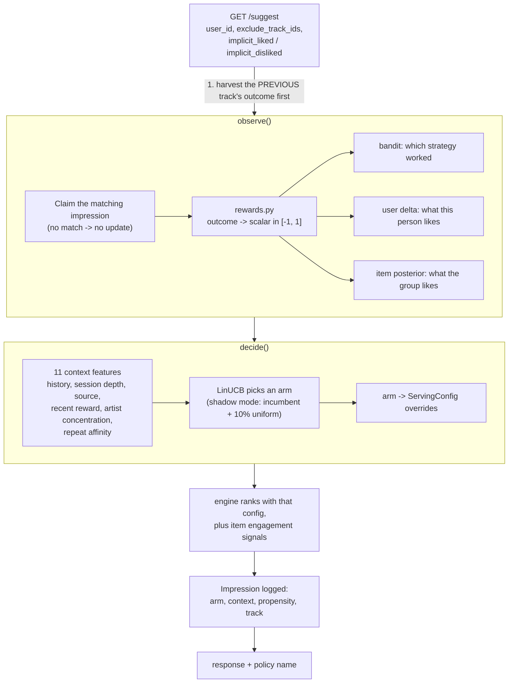

# Learning from use: the algorithm-improvement layer

The engine one directory up is a good recommender that never gets any better.
It is fitted once a week from a database snapshot, and between retrains it is
frozen: a listener can skip the same artist twenty times and be handed a
twenty-first, because nothing the listener does reaches the model until the next
training run.

This package closes that loop. It learns three different things from three
different signals, and — the part that took the most work — it is honest about
which of the three currently pays for itself.

---

## 1. What the app already tells us

Before designing anything, it is worth being precise about the feedback that
actually exists, because that is what bounds the design. Reading the app
(`app/webapp/`, `app/frontend/src/`) turns up four channels:

| Signal | Where it comes from | Reaches the engine today? |
|---|---|---|
| Track finished playing | `PlayerContext.jsx` sends `lastOutcome: "completed"` to `GET /tracks/{id}/queue` | **Yes** — `repository.record_play_and_get_queue` forwards it to `/suggest` as `implicit_liked_track_id` |
| Track skipped | same, `lastOutcome: "skipped"` | **Yes** — forwarded as `implicit_disliked_track_id` |
| Explicit like / dislike | `POST /tracks/{id}/reactions` | No — written to Postgres only |
| Download | `POST /tracks/{id}/download` | No |

The first two matter enormously, and they were hiding in plain sight.
`engine_v2` already received them and used them to tilt a single response
(`nudge_profile`) before throwing them away. They are exactly the reward signal
a learner needs, and they arrive **on the existing contract, with no change to
the app at all.**

That is why this package needs no integration work to start learning. The
optional `POST /feedback` endpoint exists so the two richer signals can be
adopted later — the group bot even knows the full `reaction_types` strength
scale from Chapter 3, so a fire emoji (+4.5) and a shrug (−1.5) can be
distinguished — but nothing waits on that.

---

## 2. Why a contextual bandit, and not deep RL

The brief said reinforcement learning. What is implemented is a **contextual
bandit**, which is the one-step special case of RL, and the choice is
deliberate.

Reinforcement learning earns its complexity when actions change state and
payoffs arrive many steps later. Recommending one track has neither property:
the listener finishes it or skips it within minutes, and the next request starts
from a state that barely depends on which of five reasonable strategies produced
the last one. Full RL here would mean fitting a value function over a state
space we have ~1,300 users' worth of data to cover, and evaluating it offline
would be impossible without exactly the leakage this project has already been
burned by once ([ANALYSIS.md](../ANALYSIS.md), findings E-1 to E-4).

So: solve the degenerate case properly rather than the general case badly. If
the product later grows genuinely sequential structure — playlists built as a
whole, multi-track arcs with delayed payoff — the event log this package writes
is precisely the dataset an RL formulation would need, and the arms below become
its action space.

Three levels of learning were possible. This package does the second and third,
and explains why not the first:

1. **Learn the ranking function end to end.** Rejected. A network with enough
   capacity to rank 14,843 items would memorise a few thousand weekly feedback
   events long before it generalised.
2. **Learn per-item quality from behaviour** → `item_model.py`.
3. **Learn which serving strategy suits which listener and situation** →
   `bandit.py` + `policies.py`.

Plus a fourth that is implemented but currently switched off, for reasons §6
covers: **learn each listener's taste vector online** → `user_model.py`.

---

## 3. The loop



Two properties of that diagram are load-bearing:

**Feedback is harvested before the decision.** `implicit_*` describes the
*previous* track, so folding it in first means the current request is decided
with the freshest information the engine will ever have.

**Nothing is credited that we did not serve.** `PendingImpressions` holds the
last 32 impressions per user. An outcome is only turned into a reward if that
index confirms this engine served that track to that user and has not already
credited it. A track the listener found through search teaches the engine
nothing, and a replay from history does not pay twice.

---

## 4. The pieces

| File | Responsibility |
|---|---|
| `events.py` | Impression/outcome schema, append-only JSONL log with rotation, the bounded pending-impression index for attribution |
| `rewards.py` | Outcome → scalar reward. The objective function, and the easiest thing here to get wrong |
| `policies.py` | The five arms: named bundles of `ServingConfig` overrides |
| `bandit.py` | Context features and LinUCB, with the shadow-mode selection rule |
| `user_model.py` | Per-user online preference deltas, bounded and decaying |
| `item_model.py` | Beta-Bernoulli engagement posteriors per track and artist |
| `learner.py` | Orchestration, attribution, persistence, failure isolation |
| `service.py` | The seam `main.py` talks to. Three methods |
| `offline_eval.py` | Replay and capped-IPS estimators, for evaluating a change before shipping it |
| `simulate.py` | End-to-end validation against simulated listeners |

### The arms

Each is a coherent way to behave, not a random parameter jiggle:

| Arm | Idea |
|---|---|
| `exploit` | Trust the model. Narrow shortlist, low exploration. The incumbent |
| `discover` | Wide shortlist, no popularity prior, zero-reaction tracks fully in play |
| `popular` | Lean on the crowd — the safe answer for a nearly-cold user |
| `diversify` | One track per artist, heavy damping. Breaks a rut |
| `deep_cut` | Few artists, many tracks each. For working through a catalogue on purpose |

### The reward

```
completed  +0.60      liked      +0.80  (or strength/5 when the emoji is known)
skipped    -0.35      disliked   -0.80
ignored    -0.10      downloaded +1.00
```

Contributions add, then clip to [−1, 1]. Three principles behind the numbers:
only credit what we served; **absence of signal is not negative signal** (a
served track with no reported outcome contributes nothing, because silence
mostly encodes which screen the user was on); and bound every contribution, so
one furious user cannot outweigh a hundred happy ones.

Skipping is deliberately weaker evidence than completing. People skip tracks
they like — wrong mood, already know it, hunting for something specific — and
treating a skip as symmetric would make the engine timid.

### The item model

One Beta posterior per track over "will someone served this finish it?".
Beta-Bernoulli is used for the property that matters most here: **the posterior
mean is pulled towards the prior in proportion to how little data there is**, so
a track served twice and finished twice does not leap to the top. Both
parameters decay towards the prior on a 30-day half-life, because taste in a
group chat is not stationary and a model with no forgetting slowly becomes a
record of the past.

This is the mechanism that finally gives the 2,410 zero-reaction tracks a route
upward. They were made *reachable* by the engine rewrite ([FIX 6](../recommender.py));
being *rankable* needs evidence, and being played is the only evidence they can
generate.

---

## 5. Shadow mode, and why the default is not textbook LinUCB

Standard LinUCB explores on every request: the confidence bonus is always in the
score. Asymptotically correct, logarithmic regret, and — measured here — it made
the product slightly worse for weeks. Two findings drove the shipped design.

**The headroom is small.** Running each arm alone over 200 simulated listeners
for 40 rounds:

| Arm | Completion rate |
|---|---:|
| `exploit` | **0.7228** |
| `diversify` | 0.7064 |
| `discover` | 0.7021 |
| `deep_cut` | 0.6904 |
| `popular` | 0.6830 |
| *oracle: best arm per listener* | *0.7476* |

So a perfect contextual policy would win **+2.5 points** over always serving the
incumbent. That is worth having, and it is not much to pay for.

**Cross-arm comparison is confounded.** In disjoint LinUCB each arm's weights
are fitted only on the contexts where that arm was chosen, so comparing
predicted means *across* arms compares models trained on different
distributions. This showed up starkly: `deep_cut` had the **highest** observed
mean reward of any arm (0.36) while being the second **worst** by actual
completion rate (0.69 vs the incumbent's 0.72). It was simply chosen more often
for listeners who were already doing well. Acting on that comparison is acting
on confounding, and doing so cost 1–2 points of completion rate.

The shipped rule, therefore:

- **90% of requests** serve the **incumbent** arm — what the engine would have
  done with no learning at all.
- **10%** draw an arm **uniformly at random**. Uniform is what makes the log a
  valid off-policy dataset: inverse propensity scoring needs to know the
  probability each arm actually had, and uniform is the only choice that
  observes every arm across the whole context distribution.
- The bandit trains on everything and its estimates are visible on
  `GET /learning`, but it does not steer traffic until
  `trust_learned_policy` is switched on.
- When it is switched on, deviating from the incumbent still requires evidence:
  ≥150 observations of the challenger and a ≥0.02 reward margin.

The cost of learning is then bounded and knowable in advance:
`exploration_share × (incumbent − mean other arm)`, about **0.3 points** of
completion rate. What it buys is an unbiased dataset that
[`offline_eval.py`](offline_eval.py) can use to decide whether to flip the
switch — rather than finding out in production.

**Turning it on properly:**

```bash
# 1. Let it collect. Weeks, not hours.
curl -s localhost:8100/learning | jq '.counters, .bandit.arms'

# 2. Estimate candidate policies against the incumbent from the log.
python - <<'PY'
from events import EventLog
from offline_eval import evaluate, fixed_policy, load_dataset
from policies import POLICY_NAMES
rows = load_dataset(EventLog("algorithm improvement/state/events.jsonl"))
print(evaluate(rows, {n: fixed_policy(n) for n in POLICY_NAMES}))
PY

# 3. Only if a candidate wins with an adequate effective sample size:
ENGINE_LEARN_TRUST_POLICY=1
```

Step 2 reports `effective_sample_size` next to every estimate for a reason: an
estimate over 40 matched events is not evidence, and the number that says so
should be impossible to miss.

---

## 6. What the simulator showed, including the awkward part

[`simulate.py`](simulate.py) runs the real components — the real learner, the
real bandit, the real engine over the real trained artifacts — against
simulated listeners. Each listener has a latent taste, a tolerance for
repetition, and a `drift` parameter placing their true taste away from their
trained profile, modelling both fitting error and staleness.

That last parameter is worth dwelling on, because getting it wrong invalidated
the first round of results. The initial simulator set each listener's true taste
*equal to* their trained embedding — which made the exercise unwinnable by
construction: the stored profile was already ground truth, so any online
personalisation could only move it away from the right answer. The measurement
duly showed learning losing to no-learning, for a reason that had nothing to do
with the learning.

With `drift = 0.5`, decomposing the shipped system component by component (250
listeners, 40 rounds each, 10,000 decisions):

| Configuration | Completion rate | vs. no learning |
|---|---:|---:|
| No learning (control) | 0.6375 | — |
| Exploration slice only | 0.6320* | +0.0008* |
| \+ item engagement signals | 0.6329* | +0.0016* |
| \+ per-user deltas (rate 0.08) | 0.6269* | **−0.0044*** |
| \+ per-user deltas (rate 0.25) | 0.6128* | **−0.0185*** |
| **Shipped defaults** | **0.6414** | **+0.0039** |

<sub>\* measured in a separate 200-listener decomposition run; the shipped row
is the 250-listener run. Absolute rates are not comparable across the two, the
deltas within each are.</sub>

Attribution was 1.0 throughout, 3,038 tracks accumulated live evidence, and the
state survived save/load.

### The per-user deltas make things worse, and that is a real finding

The mechanism works exactly as designed: deltas stay inside their trust region,
decay correctly, and demonstrably change what gets served. They also *hurt* —
and the effect scales monotonically with the learning rate, which is what makes
it a finding rather than noise.

The reason is a genuine limitation. **The engine only ever serves items it
already ranks highly**, so nearly all feedback concerns artists already near the
top of the current profile. A negative reward pushes the profile away from those
artists — but in a 200-dimensional space, "away from wrong" is not "toward
right": there are vastly more wrong directions than right ones. Learning a taste
vector from feedback on items chosen by the current estimate of that same taste
vector requires exploration in **item** space, not just in policy space, and in
shadow mode only a tenth of traffic explores.

So it ships **off** (`ENGINE_LEARN_USER_DELTA=1` to experiment). It becomes
viable with a much larger item-exploration budget or far more observations per
listener than 40 rounds provides. Shipping it on, on the strength of the theory,
would have made the product worse — which is the same trap
[ANALYSIS.md](../ANALYSIS.md) documents `engine_v2` falling into with its
evaluation.

### What the simulator does not prove

It generates behaviour from the same embeddings the engine ranks with, so it is
a friendlier world than reality. It establishes that the machinery is correct
and that the safety properties hold. It does **not** establish that real
listeners will be better served. That needs `offline_eval.py` on production
logs, and the shadow-mode default is what makes those logs worth having.

---

## 7. Operating it

### Endpoints

`POST /feedback` — optional, for the richer signals:

```json
{"user_id": 123, "track_id": 456, "outcome": "completed", "strength": 4.5}
```

`outcome` ∈ `completed`, `skipped`, `liked`, `disliked`, `downloaded`,
`ignored`. The response says whether the outcome was attributed, so an
integrator finds out immediately rather than discovering weeks later that
nothing landed:

```json
{"attributed": true, "reward": 0.6, "arm": "exploit", "impression_id": "5ae9a614a530436a"}
```

`GET /learning` — what has been learned, from how much. **The first number to
look at is `attribution_rate`**: if it is near zero the loop is not closed,
however healthy everything else looks.

`POST /learning/snapshot` — force a state write before a deliberate restart.

### Configuration

| Variable | Default | Meaning |
|---|---:|---|
| `ENGINE_LEARN_ENABLED` | `1` | Master switch |
| `ENGINE_LEARN_STATE_DIR` | `algorithm improvement/state` | Where state and the event log live |
| `ENGINE_LEARN_EXPLORE_SHARE` | `0.10` | Share of requests that explore uniformly |
| `ENGINE_LEARN_TRUST_POLICY` | `0` | Let the learned policy steer traffic |
| `ENGINE_LEARN_MIN_PULLS` | `150` | Observations before a challenger may displace the incumbent |
| `ENGINE_LEARN_MARGIN` | `0.02` | Reward margin a challenger must clear |
| `ENGINE_LEARN_ITEM_WEIGHT` | `0.25` | Weight of live engagement on a candidate's score |
| `ENGINE_LEARN_USER_DELTA` | `0` | Per-user online preference learning |
| `ENGINE_LEARN_RATE` | `0.08` | Delta step size |
| `ENGINE_LEARN_ALPHA` | `0.6` | LinUCB exploration coefficient |
| `ENGINE_LEARN_SNAPSHOT_EVERY` | `200` | Updates between snapshots |
| `ENGINE_LEARN_STOCHASTIC` | `0` | Softmax arm sampling instead of the uniform slice |

### State on disk

```
algorithm improvement/state/
  events.jsonl          append-only log, rotates at 32 MB, keeps 3 generations
  learner_state.npz     bandit matrices, user deltas, item posteriors
```

Both are gitignored. The `.npz` is written temp-file-then-rename, so a crash
mid-snapshot cannot leave a truncated file that fails to load. The event log is
the durable record — a lost snapshot costs replay time, not data.

### Safety properties

Each of these is covered by a test, because an online learner that is merely
"not crashing" can still be quietly ruining a product:

- **The trained artifacts are never modified.** Deltas are separate, bounded
  (‖δ‖ ≤ 0.5 × mean user norm, enforced by projection) and decaying. Rollback
  is deleting one file.
- **Learning cannot fail a request.** Every entry point catches its own
  exceptions and falls back to unlearned behaviour. Failures are counted and
  reported, so degrading silently is not the same as degrading invisibly.
- **The engine runs without this package at all.** `main.py` holds an
  `ImprovementLayer | None`; a missing package or an unwritable state directory
  logs a warning and serves normally.
- **Memory is bounded everywhere.** Pending impressions, user deltas and item
  posteriors all evict least-recently-used past a cap.
- **Events carry no personal data** — internal integer ids and derived numbers
  only. No names, no Telegram ids, nothing about what a track is. A user can be
  forgotten with `UserDeltaStore.reset`.

### Tests

```bash
python -m pytest                    # 197: the engine's 99 plus 98 here
```

---

## 8. What would come next

1. **Run the shadow window and do the off-policy evaluation.** Everything else
   is downstream of having real logged traffic.
2. **Wire the two unused signals.** Explicit reactions and downloads are the
   strongest evidence the product generates and currently never reach the
   engine. Two `POST /feedback` calls in `app/webapp/routers/tracks.py`.
3. **Give item-space exploration a real budget** and re-measure the per-user
   deltas. That is the specific blocker identified in §6, not a vague hope.
4. **Content-based cold start for items.** The genre matrix already helps
   cold-start *artists*; the same idea for tracks would give the engine
   something to say about a new upload before anyone has played it — which is
   the last remaining piece of the 16%-of-catalogue problem.
5. **Then, if the product grows sequential structure**, revisit full RL. The
   event log is already the dataset it would need.
