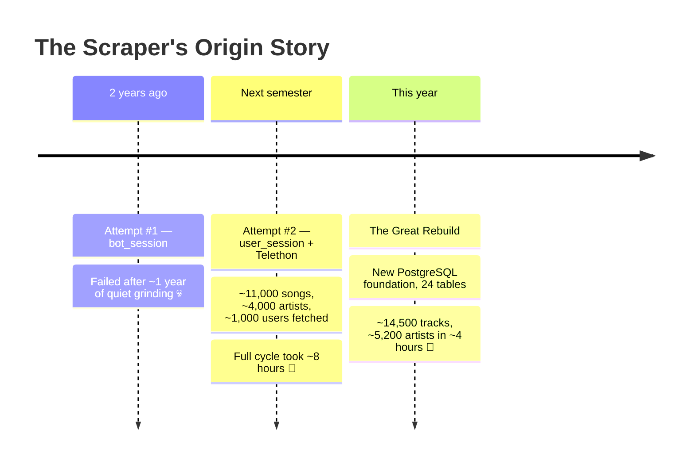
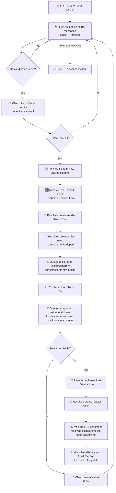

# 📡 Chapter 1 — The Scraping Saga

> *"How do you turn a chaotic, meme-filled, 3-years-old Telegram group into a clean, queryable, 24-table PostgreSQL database?"*
> Very, very carefully. And twice. 😅

This isn't a conventional README. Those scripts weren't built to be run by hand, prodded with `--help`, or fed CLI flags at 2 AM — they're meant to be scheduled, supervised, and forgotten about by an upper system (systemd, in our case). So instead of documenting *flags*, this document tells the **story** of how the data got here, why it looks the way it does, and what battles were fought along the way. Grab a coffee ☕.

---

## 🕰️ Chapter 1.1 — Two Years Ago, A Dream Was Born

It all started with an obsession: *fetch **everything**. Not a sample. Not "recent messages." Everything.*

The test subject was [**SUT Music**](https://t.me/SharifMusic) — a public Telegram group that began as a hangout for undergrad students of Sharif University's Electrical Engineering department, and eventually outgrew its roots to become a university-wide music-sharing community. At the time, it held roughly **5,000 shared songs**. A perfect, messy, real-world playground.

### 🥇 Attempt #1 — `bot_session`
The first try leaned on a regular Telegram **bot** session. Bots, as it turns out, are second-class citizens when it comes to reading full message history, reactions, and certain metadata in groups they weren't specifically empowered for. This attempt quietly died about a year in — not with a bang, but with a shrug.

### 🥈 Attempt #2 — `user_session` (Telethon enters the chat)
The next semester brought a new plan: authenticate as an actual **user** account via [Telethon](https://docs.telethon.dev/), sidestepping the bot-API's limitations entirely. This worked — after *a lot* of trial and error. The result: around **11,000 songs**, spread across **~4,000 artists**, contributed by **~1,000 users**.

The catch? A full fetch cycle took a gruelling **~8 hours**, riding on an unstable network connection, with no real resilience story if it died halfway through. It worked, but it wasn't something you'd trust to run unattended. 😬

---

## 🔨 Chapter 1.2 — This Year: The Great Rebuild

Fast-forward to this year, when the SUT Music project was agreed on as our project topic. Revisiting the old scraper was... humbling. It had highs, it had lows, and — worse — it was no longer compatible with the current Telegram client landscape.

So the decision was made: **rebuild the entire thing from scratch.** 🏗️

The new scraper was designed hand-in-hand with a brand-new **PostgreSQL** database — faster, properly indexed, and dramatically more expressive than what came before. The old world had **4 flat tables** (users, tracks, artists, albums). The new world spreads the same concepts (and many new ones — reactions, states, chats, playlists, relations…) across **24 tables**. More complex? Absolutely. Worth it? Also absolutely — the boost in speed, integrity, and query power was enormous.

### 📊 The Numbers: Before vs. After

| Metric | Old Scraper (2 years ago) | New Scraper (this year) |
|---|---:|---:|
| Tracks fetched | ~11,000 | **14,496** |
| Artists fetched | ~3,000 | **5,182** |
| Contributing users | ~700 | **~1,300** |
| Track reactions | — (Embeded in Tracks) | **86,129** |
| Artist reactions | — (Embeded in Artists) | **69,408** |
| DB schema | 4 tables | **24 tables** |
| Full cycle time | ~8 hours | **~4 hours** |
| Network setup | Local, unstable | Dedicated 🇳🇱 server |

Twice the data, half the time, and a hundred and fifty thousand-ish reactions that simply didn't exist as an standalone data before. Not bad for round two. 🎉

---

## 🧠 Chapter 1.3 — What The Scraper Actually Does

The live implementation lives here, fully commented and ready to be read top-to-bottom:

> **`app/controller/bot/bots/SUT_Music_bot.py`**

It's a single class, `SUT_Music_bot`, driven by one entrypoint: `collect_data()`. Here's the story it tells, beat by beat.

### 🔑 Step 1 — Waking Up
The bot initiates a `TelegramClient` using an API ID + API hash pair, and — since it's authenticating as a **real user account**, not a bot — walks through a one-time interactive two-step login. In our case, that user was the writer of this very document. 👋 Once the session file (`collect_data.session`) exists, every future run reuses it silently — no more logins required.

### 📜 Step 2 — Walking the Group, Oldest to Newest
This is a deliberate design choice: messages are fetched with `reverse=True`, meaning the scraper walks from the **oldest** message forward to the **newest**. Why? Because preserving chronological order matters for a music history — track #1 should really be the *first* song anyone ever shared, not a random one from whatever page the API handed back.

Progress is checkpointed to a small JSON file (`app/db/db_files/collect_data.json`) after every processed track, so a crash, a restart, or a deliberate stop never means starting from message zero again. The scraper simply picks up exactly where it left off.

### 🎵 Step 3 — Per-Message Processing
For every message containing a document/media attachment, `_process_message()` takes over:

1. **Extract file metadata** — MIME type, extension, and (when present) the embedded `DocumentAttributeAudio` fields: title, performer, duration. If the file has no audio attributes at all, it falls back to parsing the filename.
2. **Strip invisible characters** from the title, and pull out any featured-artist credit hiding *inside the title itself* — a real, surprisingly common pattern (`"I Like You (A Happier Song) (feat. Doja Cat)"` with `performer` tagged as just `"Post Malone"`). Since artist extraction otherwise only ever looks at the performer tag, a credit living only in the title used to vanish entirely — `_extract_featured_artists_from_title` fixes that and hands the title back cleaned of that segment.
3. **Skip the message entirely if there's still no usable title** — empty, a bare `.`/`...`, or a handful of other known placeholder values. Nothing gets forwarded, nothing gets written; see Battle #3 below.
4. **Clean the performer string** — strip bracketed junk (`[]`, `()`, `{}`, `<>`), promotional trailers after `•` or `@`, using a couple of surgical regexes (`_get_clean_performer`).
5. **Split into individual artists** — a cleaned performer string like `"Daft Punk ft. Pharrell Williams"` gets split on delimiters (`ft`, `feat`, `vs`, `&`, `/`, `,`, `-`, …) into a proper artist list (`_extract_artists`), merged with any featured artist(s) found in the title. Every resulting name then goes through a normalization pass (`_normalize_artist_name`) that strips invisible/format characters, rejects bare domain-shaped strings (`"Fa.Com"`), rejects a small blocklist of session-descriptor junk (`"(Live)"`, `"remix"`, `"unknown"`...), and de-dupes case-insensitively — so a messy caption that splits into the same artist twice doesn't create two identical credits on one track.
6. **Forward the file to a private backup channel.** This is one of the most important reliability decisions in the whole pipeline: if the *original* message ever gets deleted from the public group, the bot doesn't end up holding a dangling, unplayable reference — the backup copy keeps the actual bytes safe and permanently accessible. From that backup copy, the bot then resolves a genuine, Bot-API-usable `file_id` for it — a materially different thing from the userbot session's own internal document id, and a distinction that caused real trouble (see Battle #5 below). If the file happens to carry embedded cover art, that same step seeds the track's cover straight from it, no external API call needed.
7. **Resolve (or create) the sender's `User` + `Chat` records.**
8. **Resolve (or create) every artist**, matching case-insensitively against what's already in the database before ever inserting a duplicate. A genuinely new artist gets a background Last.fm + MusicBrainz/fanart.tv enrichment job queued for it immediately (see the note at the end of this step).
9. **Resolve (or create) the `Track` record itself**, matched by `(title, performer)` — if it already exists (someone re-shared the same file), the new uploader is simply appended to `uploaded_by` instead of creating a duplicate row. A genuinely new track also gets a background Last.fm enrichment job queued — always for its details/summary, and for a cover too, but only if the file didn't already come with embedded artwork in step 6.
10. **Kick off reaction collection** for that message, if any reactions are visible.

> 🧵 **A quiet architectural note:** that enrichment queueing in steps 8–9 is the *exact same* background-job machinery (`EnrichmentQueue`, from `webapp/enrichment_queue.py`) the webapp itself uses when a real user's request discovers a track/artist still missing a cover or bio — same class, same underlying Last.fm/fanart.tv calls. The scraper and the webapp run as two separate OS processes (see Ch.5), so they can't share one running queue, but nothing stops them from both instantiating their own pool against the same functions. Enrichment used to be purely *reactive* — triggered the first time someone actually asked for that track/artist. Now it's proactive too: the moment the scraper creates a row, its enrichment job is already queued, well before any user ever sees it.

### ❤️ Step 4 — Harvesting Reactions
`_collect_reactions()` pages through Telegram's `GetMessageReactionsListRequest` (100 at a time) until every reactor on a message has been captured. For each one, it:

- Resolves the reactor's `User`/`Chat` records (same dedup logic as senders).
- Maps the raw emoji to a `ReactionType` — and if it's never been seen before, it's logged and auto-registered on the fly, defaulting to `"neutral"` sentiment until a human tags it properly. Telegram's custom/premium emoji reactions (which carry an opaque document id, not a plain Unicode character) get resolved to the ordinary emoji they're a reskin of before that lookup happens, so a custom fire-emoji reaction is correctly treated the same as a regular 🔥 instead of collapsing into a meaningless placeholder.
- Fans out the sentiment (`like` / `dislike` / `neutral`) into **both** the reacting user's and the track-sender's running stats (`UserMusicBotState`), the `Track`/`Artist` aggregate counters, **and** a durable row in `TrackReaction` / `ArtistReaction` — one per artist tied to the track, so a 3-artist collab correctly fans a single reaction out to all 3 artist profiles.

### 🗺️ The Whole Pipeline, Visually

---

## 🧗 Chapter 1.4 — The Battles Fought

No good scraper story is complete without its scars. Here are the four that left the deepest marks.

### 1️⃣ Merging With BotOS
The new scraper wasn't built as an island — it had to plug cleanly into **BotOS** (Bot Operating System Manager), a general-purpose foundation for Telegram bots built a year earlier **by me**. Syncing the SUT Music-specific data model (users, chats, states) with BotOS's existing abstractions took real, deliberate engineering effort — it's the kind of integration work that's invisible when done right and painfully obvious when done wrong.

### 2️⃣ Network Latency & API Rate Pressure
Fetching this much data means *a lot* of Telegram API calls. Running the scraper from its original location meant fighting high ping and an unstable connection the entire time. The fix: move the whole operation to a dedicated server in the **Netherlands** 🇳🇱, physically closer to Telegram's infrastructure. The result was a dramatic, immediate speed boost — lower latency, steadier throughput, fewer retries.

### 3️⃣ The Great Malformed File Purge 🗑️
The group, as public groups do, had accumulated *plenty* of junk over the years — files with no track name, garbage metadata, or formats that made no structural sense. The first full run fetched all of them anyway, in the naive hope that "we'll figure out how to handle these later." We didn't. 😅 The final call: these files simply aren't worth keeping. The scraper itself was updated to detect and skip them at the source, so the database now stays clean by construction rather than by later cleanup.

### 4️⃣ The Ban Hammer Looming Overhead ⚠️
Because this scraper authenticates as a **real user account** (not a bot), the stakes for misbehaving were genuinely scary — hit Telegram's rate limits too aggressively, and the very account doing the scraping could get flagged or banned. This is handled with real respect: every request path is wrapped to catch `FloodWaitError` and sleep for exactly as long as Telegram asks, no shortcuts, no impatience. The scraper would rather take longer than take risks.

### 5️⃣ The `file_id` That Wasn't 🆔
For a long time, tracks were saved with `file_id = str(msg.document.id)` — a raw internal document id from the Telethon **user** session. It looks like a plausible identifier, prints fine, sits in the database without complaint... and then quietly fails the moment the webapp tries to actually play the track, because Telegram's Bot API `getFile` has no idea what a userbot's internal document id even is. It's not the same *kind* of identifier at all — calling the Bot API with it 400s outright.

The fix: after the userbot archives a file to the backup channel, the **bot account itself** now forwards that same message once more, purely to get a fresh `Message` object back with a real, Bot-API-usable `file_id` on it — then immediately deletes that scratch copy again, so the backup channel doesn't end up permanently holding two copies of every track. That same forward, as a nice side effect, is also where an embedded cover thumbnail (when the file has one) gets picked up — no extra API call needed to get both fixes out of one round-trip.

### 6️⃣ Featured Artists Hiding in Plain Sight 🕵️
Artist extraction only ever looked at the performer tag — reasonably, since that's where a featured-artist credit is *supposed* to live. In practice, a lot of uploaders instead cram it straight into the **title**: `title = "I Like You (A Happier Song) (feat. Doja Cat)"`, `performer = "Post Malone"`. Doja Cat, entirely absent from the artists table, despite being right there in plain text.

The fix pulls any `(feat. X)` / `(ft. X)` segment out of the title before anything else happens, splits `X` the same way a performer string gets split (it can itself be `"A, B & C"`), folds those names into the artist list, and hands back a title with that segment cleanly removed. Titles end up shorter and more accurate, and the artist credit finally shows up where it belongs.

---

## ⏱️ Chapter 1.5 — Why Wait Two Weeks?

The scraper is scheduled via **systemd** to run once every **fortnight** (every two weeks) on its server. That cadence isn't arbitrary — it's a direct answer to a subtle timing problem:

> If a track is fetched the moment it's posted, any likes/dislikes it receives *afterward* are missed entirely, because the scraper has already moved on.

By waiting roughly two weeks before a track's history is considered "settled," it gets a real chance to accumulate the reactions the community actually gives it — before the scraper commits its final snapshot to the database. Patience, in this case, is a feature. 🕊️

---

## 🧘 Chapter 1.6 — Surprisingly Chill on Resources

Despite everything described above, the scraper is not a resource hog. It idles along at roughly **1–3% CPU usage** on its server. Two design choices make this possible:

- **Fully async**, top to bottom — no blocking calls sitting around waiting on the network.
- **`asyncpg`** for all database writes, which pairs naturally with the async event loop and keeps I/O — both to Telegram and to Postgres — cheap and non-blocking.

The end result: a scraper that quietly chugs through thousands of messages, reactions, and metadata lookups without ever breaking a sweat on its host machine.

---

## 📍 Where To Find Things

| What | Where |
|---|---|
| The scraper itself | `app/controller/bot/bots/SUT_Music_bot.py` |
| Offset/progress checkpoint | `app/db/db_files/collect_data.json` |
| Telethon session file | `app/collect_data.session` (repo root) |

---

## 🎬 Closing Note

Two years, two attempts, one rebuild, and a whole lot of `FloodWaitError` handling later — **SUT Music** now has a scraper that's fast, polite to Telegram, gentle on its host CPU, and — most importantly — actually trustworthy enough to run unattended, every two weeks, forever. 🎶

*Next up in the notebooks series: how that data gets shaped, ranked, and served back out through the API. Stay tuned.*
