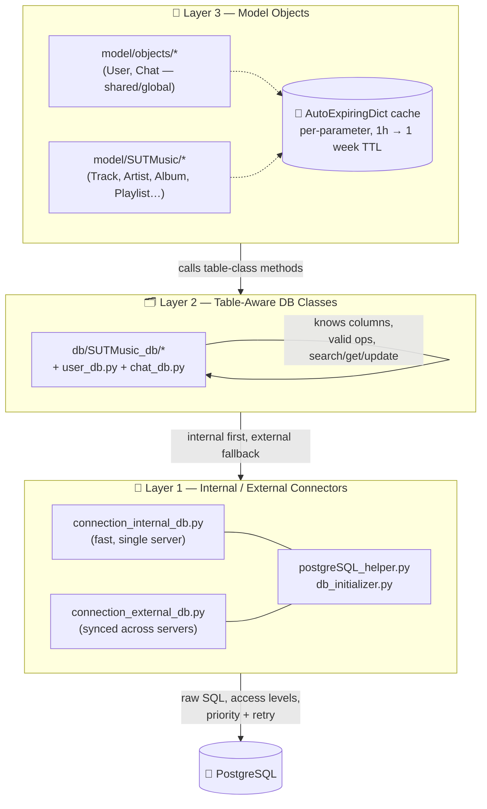

# 🗄️ Chapter 2 — The Database Management Saga

> *"Any fool can write a query. It takes a special kind of stubbornness to build the thing that decides, on your behalf, whether that query was even allowed to happen."*
> — probably me, at 3 AM, a year before SUT Music existed. 😤

If Chapter 1 was about *getting* the data, this chapter is about *where it lives, who's allowed to touch it, and how it doesn't fall over.* Buckle up — this one has layers. Literally. 🧅

---

## 🌱 2.1 — Year One3: The Birth of BotOS

This story doesn't actually start with SUT Music. It starts a full year earlier, with a much more ambitious itch: **BotOS** — a *Bot Operating System Manager* — a general-purpose foundation meant to run and manage Telegram bots without each new bot reinventing its own database plumbing from scratch.

For that to work, the database underneath it couldn't just be "a database." It had to be **robust** and **expandable** — because a foundation that only fits today's bot is not a foundation, it's a coincidence. Months of settling on the right shape later, the result was an infrastructure that connects raw, low-level database rows to proper Python objects — cleanly, safely, and (eventually) *quickly*.

That infrastructure — the **database manager** — is the bridge between the `db/` files and the `model/` files. Everything in this chapter is about how that bridge is built. 🌉

---

## 🧱 2.2 — Three Layers, One Bridge

The database manager isn't a single blob of code — it's **three distinct layers**, each one only trusting the layer directly below it. Think of it as a very well-mannered game of telephone.

### 2.2.1 — Layer 1: The Internal/External Connectors 🔌
This is the ground floor — `connection_internal_db.py` and `connection_external_db.py`, both leaning on a shared `postgreSQL_helper.py` and `db_initializer.py` to actually talk to Postgres.

Here's the split that matters most: **most data lives on a single, fast internal server** (the `internal_db` side) — but a few things, most notably **users** and **chats**, need to stay consistent *across multiple servers*, so they're synced through the `external_db` side instead. That gives us a genuinely two-layered database: an **internal** layer that's quick and local, and an **external** layer that's the shared, general-purpose, synced-everywhere source of truth.

This layer is also where the *guardrails* live:
- **Hardcoded access levels** per function — no function anywhere gets to casually "dump the whole database." If a query isn't explicitly allowed for that function, it doesn't run. 🚫
- **Priority levels** — some operations matter more than others, and get treated that way.
- **Retry budgets** — every function knows how many times it's allowed to fail before it gives up and surfaces the error, instead of hammering Postgres forever.

And because security doesn't take a day off: connection credentials live in **session and key files that rotate constantly** — a database session is only valid for **5 minutes** before it's forced to die and a fresh one takes its place. 🔑💀🔑

### 2.2.2 — Layer 2: The Table-Aware DB Classes 🗂️
One level up sits the `db/SUTMusic_db/` folder (plus `user_db.py` and `chat_db.py` for the cross-server entities). This is where the code actually *learns what a table looks like* — its columns, which operations are legal, and how to search/get/update/fetch from it.

This is also where the internal/external split from Layer 1 gets **merged into a single coherent story**:
- If something isn't found in `internal_db`, the search quietly continues into `external_db` before giving up.
- If something gets updated in `internal_db`, the corresponding `external_db` copy is flagged as stale, and picks up the change later through a **lazy update** — no synchronous round-trip required, just an eventual, unhurried correction.

### 2.2.3 — Layer 3: The Model Objects 🧠
At the top sits `model/objects/` (for the shared `User`/`Chat` concepts) and `model/SUTMusic/` (for `Track`, `Artist`, `Album`, `Playlist`, and friends) — the actual Python objects the rest of the app interacts with. Every method on these classes is really just a well-dressed call down into Layer 2.

This is also the **caching layer**, and it's smart about it: data sits in auto-expiring Python dictionaries, with a lifetime tuned per field — anywhere from **1 hour to 1 week**, depending on how important (or how volatile) that particular piece of data is. Cache invalidation is famously one of the two hard problems in computer science, and yes, we absolutely had to sit down and actually solve it here. 😅

---

## 🧊 2.3 — The Golden Rule: Never Fetch What You Don't Need

Some of these table rows are **big** — a `metadata` JSONB blob alone can be kilobytes of data. Pull the *whole row* into the cache every time you just wanted one field, and you'll fill up the cache dictionary fast — which pushes other, more useful entries out sooner, which raises the miss rate, which means more trips back down to Postgres. A vicious little cycle. 🌀

So the rule, enforced pretty much everywhere in the model layer, is:

> **Fetch and work with the `id` first.** Only pull the *specific parameter* you actually need — never the entire row "just in case." Updating works the same way in reverse: update *that one field*, not the whole row.

It's a small discipline that pays for itself constantly: smaller cache entries, way fewer evictions, and a noticeably lower cache-miss rate across the board.

---

## 🔢 2.4 — By the Numbers

| Metric | Count |
|---|---:|
| SUT Music domain tables | 22 |
| Plus shared `users` + `chats` tables | +2 |
| **Total tables** | **24** |
| DB-layer + internal-DB-layer + model-layer classes (24 × 3) | **~72** |
| New/updated Python code for this rebuild | **~15,000 lines** |

### 🗺️ The Shape of the 24, At a Glance

```mermaid
classDiagram
direction BT
class album_comments {
   integer album_id
   bigint user_id
   text comment
   timestamp with time zone commented_at
   integer id
}
class album_genres {
   integer album_id
   integer genre_id
   numeric confidence
   text source
   timestamp with time zone updated_at
   integer id
}
class album_reactions {
   integer album_id
   bigint user_id
   text sentiment
   bigint on_user_id
   bigint message_id
   timestamp with time zone reacted_at
   integer reaction_id
   integer id
}
class albums {
   text title
   integer artist_id
   date release_date
   integer cover_id
   text description
   numeric score
   text rank
   integer likes_count
   integer dislikes_count
   integer reactions_count
   jsonb metadata
   timestamp with time zone created_at
   timestamp with time zone updated_at
   integer id
}
class artist_comments {
   integer artist_id
   bigint user_id
   text comment
   timestamp with time zone commented_at
   integer id
}
class artist_genres {
   integer artist_id
   integer genre_id
   numeric confidence
   text source
   timestamp with time zone updated_at
   integer id
}
class artist_reactions {
   integer artist_id
   bigint user_id
   text sentiment
   bigint on_user_id
   bigint message_id
   timestamp with time zone reacted_at
   integer reaction_id
   integer id
}
class artists {
   text name
   integer cover_id
   text description
   numeric score
   text rank
   integer likes_count
   integer dislikes_count
   integer reactions_count
   jsonb metadata
   timestamp with time zone created_at
   timestamp with time zone updated_at
   integer id
}
class audio_features {
   integer track_id
   numeric bpm
   text key
   text mode
   integer duration_ms
   numeric loudness
   numeric energy
   numeric danceability
   numeric acousticness
   numeric instrumentalness
   numeric liveness
   numeric speechiness
   numeric valence
   integer inferred_genre_id
   jsonb llm_prediction
   text model_version
   timestamp with time zone created_at
   timestamp with time zone updated_at
   integer id
}
class chats {
   bigint chat_id
   varchar(20) chat_type
   bigint user_id
   jsonb title
   jsonb username
   jsonb first_name
   jsonb last_name
   jsonb bio
   jsonb description
   jsonb invite_link
   jsonb sticker_set_name
   bigint linked_chat_id
   jsonb permissions
   jsonb member_count
   boolean is_verified
   boolean is_scam
   boolean is_fake
   boolean is_restricted
   jsonb metadata
   timestamp with time zone created_at
   timestamp with time zone updated_at
   timestamp with time zone last_activity_at
   integer id
}
class covers {
   text file_id
   text unique_file_id
   text file_format
   text mime_type
   integer file_size
   text file_url
   integer width
   integer height
   bigint uploaded_by
   text source
   jsonb metadata
   timestamp with time zone updated_at
   timestamp with time zone created_at
   integer id
}
class genres {
   text name
   integer cover_id
   text description
   numeric score
   text rank
   timestamp with time zone created_at
   timestamp with time zone updated_at
   integer id
}
class playlist_comments {
   integer playlist_id
   bigint user_id
   text comment
   timestamp with time zone commented_at
   integer id
}
class playlist_reactions {
   integer playlist_id
   bigint user_id
   text sentiment
   bigint on_user_id
   bigint message_id
   timestamp with time zone reacted_at
   integer reaction_id
   integer id
}
class playlist_tracks {
   integer playlist_id
   integer track_id
   integer position
   timestamp with time zone added_at
   integer id
}
class playlists {
   bigint owner_id
   text name
   text description
   boolean is_public
   integer cover_id
   numeric score
   text rank
   integer likes_count
   integer dislikes_count
   integer reactions_count
   jsonb metadata
   timestamp with time zone created_at
   timestamp with time zone updated_at
   integer id
}
class reaction_types {
   text emoji
   text sentiment
   numeric score
   text description
   integer id
}
class track_comments {
   integer track_id
   bigint user_id
   text comment
   timestamp with time zone commented_at
   integer id
}
class track_genres {
   integer track_id
   integer genre_id
   numeric confidence
   text source
   timestamp with time zone updated_at
   integer id
}
class track_reactions {
   integer track_id
   bigint user_id
   text sentiment
   bigint on_user_id
   bigint message_id
   integer genre_id
   timestamp with time zone reacted_at
   integer reaction_id
   integer id
}
class tracks {
   text file_id
   text unique_file_id
   text file_type
   text mime_type
   text extension
   text title
   integer duration
   text performer
   integer cover_id
   integer album_id
   integer[] artists_id
   bigint[] uploaded_by
   bigint chat_id
   bigint message_id
   numeric score
   text rank
   integer likes_count
   integer dislikes_count
   integer reactions_count
   jsonb metadata
   timestamp with time zone created_at
   timestamp with time zone updated_at
   integer id
}
class user_comments {
   bigint target_user_id
   bigint commented_by
   text comment
   timestamp with time zone commented_at
   integer id
}
class user_musicbot_state {
   integer cover_id
   text description
   integer total_likes
   integer total_dislikes
   integer total_reactions
   numeric score
   text rank
   jsonb recent_actions
   jsonb metadata
   timestamp with time zone updated_at
   timestamp with time zone created_at
   integer total_received_likes
   integer total_received_dislikes
   integer total_received_reactions
   integer total_uploaded_tracks
   bigint user_id
}
class users {
   integer id
   jsonb username
   jsonb first_name
   jsonb last_name
   jsonb profile_photo
   jsonb bio
   jsonb birthday
   varchar(50) language_code
   boolean is_bot
   boolean is_premium
   boolean is_verified
   boolean flag
   jsonb activity
   timestamp with time zone created_at
   timestamp with time zone updated_at
   timestamp with time zone last_activity_at
   bigint user_id
}

album_comments  -->  albums : album_id.id
album_comments  -->  users : user_id
album_comments  -->  users : user_id.id
album_genres  -->  albums : album_id.id
album_genres  -->  genres : genre_id.id
album_reactions  -->  albums : album_id.id
album_reactions  -->  reaction_types : reaction_id.id
album_reactions  -->  users : user_id
album_reactions  -->  users : on_user_id.user_id
album_reactions  -->  users : user_id.id
albums  -->  artists : artist_id.id
albums  -->  covers : cover_id.id
artist_comments  -->  artists : artist_id.id
artist_comments  -->  users : user_id
artist_comments  -->  users : user_id.id
artist_genres  -->  artists : artist_id.id
artist_genres  -->  genres : genre_id.id
artist_reactions  -->  artists : artist_id.id
artist_reactions  -->  reaction_types : reaction_id.id
artist_reactions  -->  users : on_user_id.user_id
artist_reactions  -->  users : user_id.id
artist_reactions  -->  users : user_id
artists  -->  covers : cover_id.id
audio_features  -->  genres : inferred_genre_id.id
audio_features  -->  tracks : track_id.id
chats  -->  chats : chat_id.id
chats  -->  users : user_id
chats  -->  users : user_id.id
covers  -->  users : uploaded_by.user_id
genres  -->  covers : cover_id.id
playlist_comments  -->  playlists : playlist_id.id
playlist_comments  -->  users : user_id.id
playlist_comments  -->  users : user_id
playlist_reactions  -->  playlists : playlist_id.id
playlist_reactions  -->  reaction_types : reaction_id.id
playlist_reactions  -->  users : on_user_id.user_id
playlist_reactions  -->  users : user_id.id
playlist_reactions  -->  users : user_id
playlist_tracks  -->  playlists : playlist_id.id
playlist_tracks  -->  tracks : track_id.id
playlists  -->  covers : cover_id.id
playlists  -->  users : owner_id.user_id
track_comments  -->  tracks : track_id.id
track_comments  -->  users : user_id
track_comments  -->  users : user_id.id
track_genres  -->  genres : genre_id.id
track_genres  -->  tracks : track_id.id
track_reactions  -->  genres : genre_id.id
track_reactions  -->  reaction_types : reaction_id.id
track_reactions  -->  tracks : track_id.id
track_reactions  -->  users : user_id
track_reactions  -->  users : user_id.id
track_reactions  -->  users : on_user_id.user_id
tracks  -->  albums : album_id.id
tracks  -->  artists : artists_id.id
tracks  -->  chats : chat_id.id
tracks  -->  chats : chat_id
tracks  -->  covers : cover_id.id
user_comments  -->  users : commented_by.user_id
user_comments  -->  users : target_user_id.user_id
user_musicbot_state  -->  covers : cover_id.id
user_musicbot_state  -->  users : user_id.id
user_musicbot_state  -->  users : user_id
users  -->  users : user_id.id
```

*(Above mermaid diagram is auto generated by DataGrip Diagram Generator)* 📸

---

## 🚧 2.5 — The Great Dev/Prod Split (and the Merge That Followed)

Originally, there was just **one** database, sitting on the Netherlands server, reachable over SSH sessions whenever code needed poking at it directly. Simple. Also, in hindsight, a little terrifying — because active development means constantly adding, removing, and rewriting code, and doing *that* directly against the same database serving production traffic is asking for trouble.

So the databases were split: a **development** database to break things in peace, and a **production** database that real users depend on. Correct call. 👍

The *less* fun part: eventually, development needed to catch up to production again — meaning someone had to carefully merge a development database's schema and data drift back into an already-running, already-heavily-used production database, without breaking anything currently depending on it. That someone was, once again, me. 🫡 It worked out. You're using the app right now, aren't you?

---

## 🐳 2.6 — Today's Setup: Docker & Backups That Don't Panic

These days, both databases live on the same Netherlands server, but on genuinely separate footing:

- **Production** runs inside a **Docker**-managed setup, with **daily backups** following a classic **son → father → grandfather** rotation scheme — so "oops" has several different escape hatches depending on how far back you need to reach.
- **Development** runs alongside it on the *same server*, but on a **completely different platform**, keeping the two worlds from ever stepping on each other's toes.

---

## 🔐 2.7 — Still Just Good Old PostgreSQL

For all the layers, caching tricks, and access-level gatekeeping described above, the actual database engine underneath all of it is exactly what it's always been: **PostgreSQL** — properly **indexed**, and **authorized per-user**, so each caller only gets to perform the actions it's actually been granted. No layer here is decorative; every one of them is pulling real weight. 💪

---

## 📍 Where To Find Things

| What | Where |
|---|---|
| Low-level Postgres helper | `db/postgreSQL_helper.py` |
| DB bootstrap / schema setup | `db/db_initializer.py` |
| Internal DB connector | `db/internal_db/connection_internal_db.py` |
| External DB connector | `db/external_db/connection_external_db.py` |
| Shared entities (cross-server) | `db/user_db.py`, `db/chat_db.py` |
| SUT Music table-aware DB classes | `db/SUTMusic_db/*` |
| SUT Music internal-DB-bound classes | `db/internal_db/SUTMusic/*` |
| Shared model objects (cached) | `model/objects/*` |
| SUT Music model objects (cached) | `model/SUTMusic/*` |
| Full auto-generated ERD | `notebooks/album_comments.md` |

---

## 🎬 Closing Note

A database manager born a year before the project it would eventually serve, three layers deep, guarding a 24-table schema across two synced worlds (internal ⚡ + external 🌐), caching by the parameter instead of the row, and quietly backing itself up every single night — that's the bridge everything else in SUT Music stands on. It doesn't get the glory the scraper or the webapp get, but nothing else in this project works without it. 🙏

*Next up in the notebooks series: from raw rows to ranked lists — how scores, ranks, and recommendations actually get computed. Stay tuned.*
