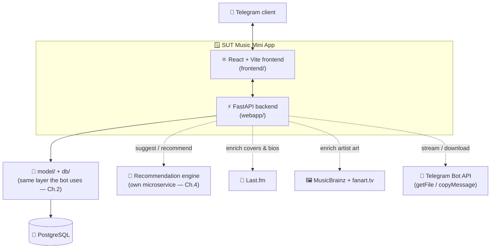
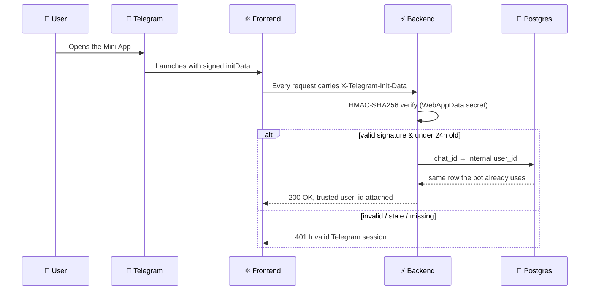
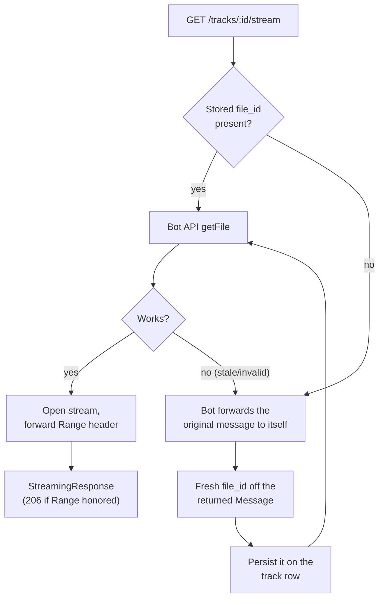
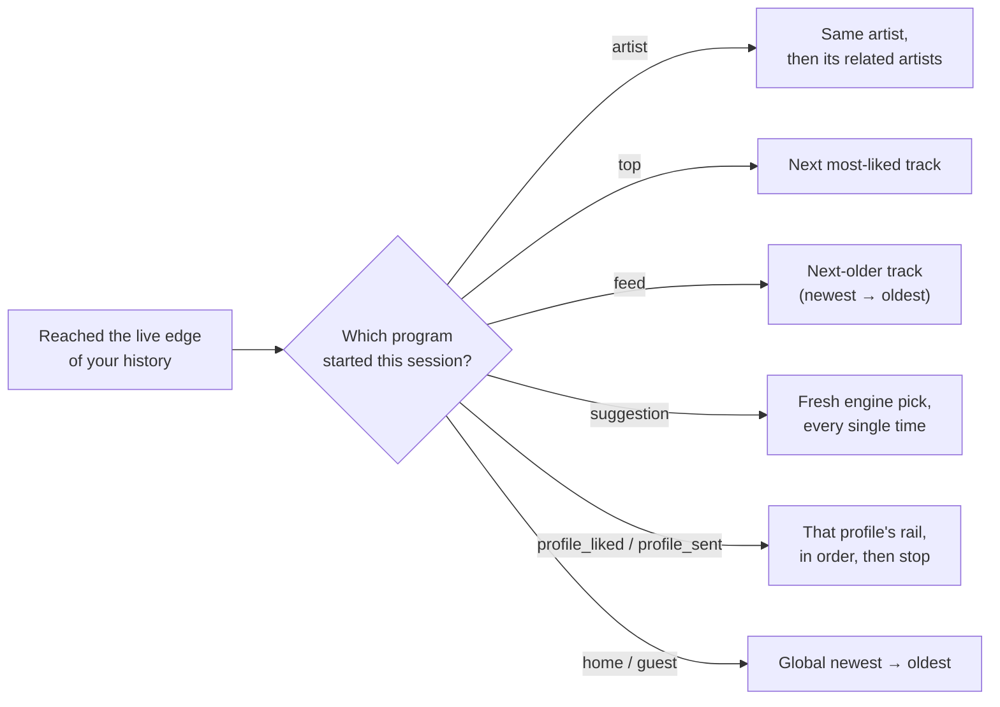
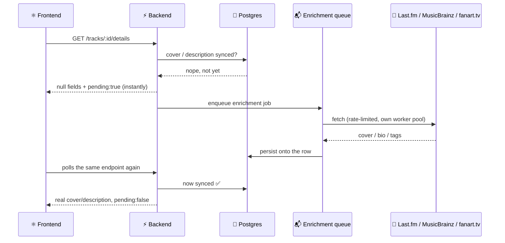
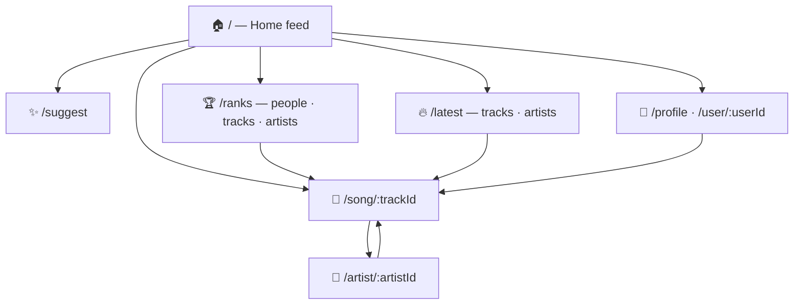
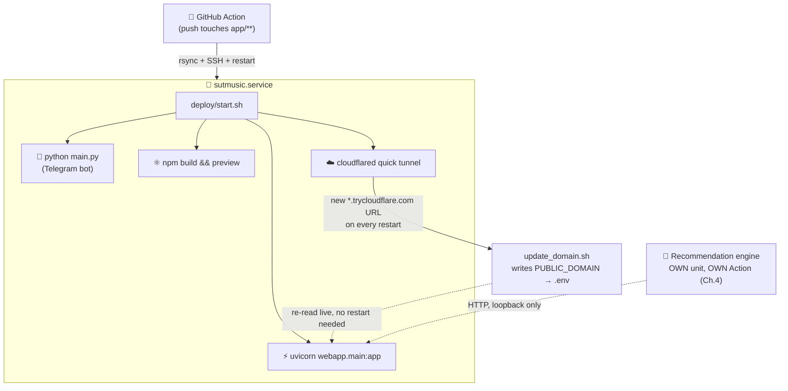

# 🎛️ Chapter 5 — The Web App Saga

> *"Cool, we scraped 14,500 songs into a proper 24-table database with rankings, reactions, and a recommendation engine. Now how does anyone who isn't us actually **listen** to any of it?"*
> That question is this entire chapter. 🎧

Chapters 1–4 were about *getting* the data, *housing* it, *cleaning* it, and teaching a model to *reason* about it. This one is about the part everyone in the group actually sees: a Telegram Mini App that turns all of that machinery into something you tap, scroll, and hum along to. Two codebases, one shared brain, and a genuinely alarming number of small bugs that all turned out to have the same shape. Let's go. 🚀

---

## 🎬 5.1 — Why a Mini App, and Not "Just a Website"

The audience for this thing already exists, in one place, forever: the [**SUT Music**](https://t.me/SharifMusic) Telegram group. Building a separate website would mean asking a few thousand people to trust a login system, remember another URL, and context-switch out of the app they're already in — for something that's fundamentally *about* that Telegram group.

A **Telegram Mini App** sidesteps all of that. It opens *inside* Telegram, inherits Telegram's own theming (dark mode just works), and — most importantly — comes with a signed, tamper-proof identity handed to it for free. No signup form, no password, no "verify your email." If you're in the group, you're already logged in. 🪄

---

## 🧩 5.2 — The Shape of the Beast

Under the hood, this is really **two runtimes sharing one brain**:

- A **FastAPI backend** (`webapp/`) — the API the Mini App actually talks to.
- A **React + Vite frontend** (`frontend/`) — what you actually see and tap.

Both live inside `app/`, right next to the Telegram bot from Chapters 1–2, and — this is the important bit — **neither one opens a second database connection.** `webapp/db_conn.py` reaches straight into the exact same `model/`/`db/` layer the bot already uses. Same Postgres, same caching, same counters. A like given through the Mini App and a like given by reacting to a message in the group are, as far as the database is concerned, *the exact same operation.* No sync job, no drift, no "webapp DB" quietly diverging from "bot DB" a year from now. 🧠

---

## 🔑 5.3 — Getting Past the Bouncer: Telegram's `initData` Handshake

Every request the frontend makes carries a header, `X-Telegram-Init-Data` — a string Telegram itself signs when it launches the Mini App. The backend (`webapp/telegram_auth.py`) re-derives the signature using an HMAC-SHA256 chain rooted in the bot token, and only trusts the embedded `user` object (id, name, username, photo) if that signature checks out **and** the payload isn't older than 24 hours. Nothing about "who's making this request" is ever taken from a query param or a request body — it's cryptographically checked, every single time. 🔏

Two flavors of this exist as FastAPI dependencies: `require_telegram_user` (401s if the session's bad — for anything that writes, like reactions or downloads) and `optional_telegram_user` (quietly returns `None` — for anything a guest should still be able to browse, just without personalization).

> 🔗 **Continuity note from Chapter 2:** the `user_id` this resolves to is *not* the raw Telegram id — it's the same bot-side `chat_id → user_id` mapping the Telegram bot itself creates. So someone who's only ever reacted inside the group, and someone who only ever opens the Mini App, land on the **same** row the moment they overlap. One identity, two front doors.

---

## 🗺️ 5.4 — The API, Mapped

Ten routers, each doing one clearly-scoped job:

| Router | Prefix | What it's for |
|---|---|---|
| `auth.py` | `/api/auth` | `POST /telegram` — verifies initData, upserts the user row, hands back a full profile. |
| `users.py` | `/api/users` | `me` (own profile), visibility toggle, a user's uploads / liked tracks / stats / "community pulse" relations. |
| `tracks.py` | `/api/tracks` | Get a track, its details sheet, its next/prev **queue**, its audio **stream**, its **download**, and reactions. |
| `artists.py` | `/api/artists` | An artist's profile + their tracks. |
| `home.py` | `/api/home` | `GET /feed` — latest tracks, latest artists, top artists in one call. |
| `ranks.py` | `/api/ranks` | Paged leaderboards: people, tracks, or artists, most-liked first. |
| `latest.py` | `/api/latest` | Paged newest-first lists: tracks or artists. |
| `search.py` | `/api/search` | One query, three scopes (tracks / artists / users) or all at once. |
| `suggestions.py` | `/api/suggestions` | `GET /next` — the "Suggest me a song" button's brain. |
| `media.py` | `/api/media` | Cover-image proxy (audio has its own route, see below). |

Every list-shaped endpoint here (`ranks`, `latest`, a user's tracks, search results) speaks the same `{ items: [...] }` shape with `limit`/`offset` paging — one consistent contract, so the frontend's infinite-scroll logic (§5.10) didn't need a bespoke adapter per page.

---

## 🎧 5.5 — Streaming Music We Don't Actually Own

Here's a fun constraint: none of this audio lives on *our* server. Every track is a Telegram file, referenced by a `file_id`. So playing a song means asking Telegram's Bot API for a short-lived download URL (`getFile`) and piping the bytes through — and that's where things got interesting. 😅

The other detail worth a mention: seeking. Without forwarding the client's `Range` header straight through to Telegram's CDN and passing Telegram's response headers straight back, dragging the scrub bar just... restarts the song from zero, because the browser can only seek within bytes it's already buffered. And every one of these Telegram connection attempts happens **before** the `StreamingResponse` is constructed — not inside the streamed generator — because once headers are sent to the client, an exception from inside a generator can't cleanly become an HTTP error anymore; it just corrupts the response mid-stream. Lesson learned the noisy way, via a log full of `ConnectTimeout`s. 🙃

---

## 📤 5.6 — Sending It Back: The Download Button

Pressing "download" doesn't hand you a file — it has the **bot** deliver the track straight into your Telegram DMs, via `copyMessage` (not `forwardMessage`, deliberately: a forward carries an ugly "Forwarded from..." header and can't touch the caption; a copy is clean and fully re-captionable). That caption is two Telegram deep-links: one straight to the song's page inside the Mini App (`https://t.me/{bot}?startapp=track_{id}`), one to the bot itself — so wherever the file ends up, it always opens back *inside* Telegram, never a dead-end browser tab. If the recipient has never started a chat with the bot, that's detected and surfaced as a friendly "start the bot first" instead of a generic failure.

---

## ▶️ 5.7 — What Plays Next? The Invisible DJ

This is the part that makes the player feel less like "one song at a time" and more like a real listening session. Every time you start playing from somewhere specific — an artist page, the Ranks leaderboard, the Latest page, a profile's tracks, "Suggest me a song" — the backend remembers **which program is driving your queue** for that session, and Next/Prev keep following that program's own logic once you reach the edge of your own play history.

That "which program" state, plus a rolling "don't suggest the same thing twice a session" list and a "just liked this artist, reopen their catalog even from old history" flag, all live in short-TTL, per-user in-memory caches (`webapp/cache.py`) — 24-hour windows, long enough to cover a full day of listening, short enough to never permanently exclude a track from ever coming back around.

And the song page tells you the truth about what's happening: instead of a flat "Now playing," it shows a context-specific label — *"By most liked," "Playing suggestions,"* or, for that newest-to-oldest walk the Latest page uses, *"Playing from newest tracks."* Small detail, but it's the difference between a player that feels automatic and one that feels *designed*.

---

## 🖼️ 5.8 — Covers & Bios That Show Up Late (On Purpose)

Not every track/artist arrives with a cover or a bio baked in — those get enriched from Last.fm (and, for artist art specifically, MusicBrainz + fanart.tv) after the fact. But nobody should ever sit on a spinner waiting for a third-party API. So the rule is: **check the DB, and only the DB, on the request path.** Found it → return it. Not found → return `null` + a `_pending: true` flag *immediately*, and drop a job on a background queue.

Tracks and artists get **two entirely separate queues**, on purpose: Last.fm alone is a fast ~5 req/s call for tracks, but an artist can also need a 1 req/s MusicBrainz lookup *plus* a multi-second fanart.tv retry-sleep. Sharing one queue would mean a slow artist job head-of-line-blocking a batch of fast track covers behind it. Each queue also has its own "lazy backfill" — whenever it runs dry, it tops itself up by scanning the DB for anything still un-synced, at a lower priority than anything a real user is actively waiting on. Idle capacity never goes to waste, and a real request never waits behind a background chore.

---

## 🤖 5.9 — Borrowing a Brain: The Recommendation Engine

"Suggest me a song" doesn't guess randomly — it asks the standalone recommendation engine from Chapter 4 (a separate process entirely, reachable only over loopback) via a small, honest client (`webapp/engine_client.py`) that **never raises**: not configured, unreachable, timed out, bad response — every failure mode just quietly returns `None`/`[]`, so the caller always has a safe, deterministic fallback (a simple "top-liked track you haven't reacted to yet" pick) to lean on instead. The webapp doesn't know or care how the engine's model works internally — that's a whole chapter of its own — it just knows how to ask nicely and take "no" for an answer gracefully.

---

## 📱 5.10 — The Frontend: A Small, Telegram-Native SPA

| Piece | Tool |
|---|---|
| UI framework | React 18 + Vite |
| Styling | Tailwind CSS |
| Routing | React Router v6 |
| HTTP | axios |
| Motion | framer-motion |
| Icons | lucide-react |
| Telegram bridge | `@twa-dev/sdk` |

Two React contexts hold everything together: `UserContext` (resolves to a real logged-in profile or a clean `Guest` fallback — never a broken in-between state) and `PlayerContext` (the actual audio element, queue, and playback state, so the mini-player at the bottom of every page and the full song page are always looking at the exact same source of truth).

The Telegram-specific touches matter more than they sound like they would:
- **Theming** follows Telegram's own colors on launch — no separate dark-mode toggle to build or forget.
- **The hardware back button** is wired to Telegram's native `BackButton` API, which — while shown — also intercepts the *phone's own* system back button, so it navigates within the app instead of just minimizing it back to Telegram.
- **The swipe-down-to-close gesture** is deliberately disabled (`disableVerticalSwipes`), so an enthusiastic scroll-to-top doesn't accidentally boot you out of the app. Telegram's own native close control up top still works exactly as it should.
- **Deep links** (`?startapp=track_123`, from a download caption) get parsed on launch and routed straight to that song's page.

---

## 🐛 5.11 — Little Wars, Constantly Won

No frontend ships bug-free on the first try, and this one's little scars are worth a laugh:

- **The gradient that wouldn't stop repeating.** The moody top-left-to-bottom-right background gradient looked great on a short page and turned into a tiled, seamed mess on a long feed — because `<body>`'s background gets propagated to the *entire scrollable canvas*, not just one viewport height. The one-line fix (`background-attachment: fixed` + no-repeat) pins it to the viewport instead, so it never tiles no matter how long the page gets.
- **The infinite scroll that stopped at exactly 50.** An `IntersectionObserver` was attached inside a `useEffect` keyed on state that didn't happen to change at the exact moment the "load more" sentinel element first appeared in the DOM — so it just never attached, silently, forever. Swapping it for a ref-callback (fired the instant the element actually mounts) fixed it for good.
- **The "broken build" that wasn't.** A scary-looking terminal wall of text turned out to be routine `npm audit` noise sitting next to a perfectly successful `vite build` — the real issue was a Cloudflare quick-tunnel hiccup at the deploy layer, several logs away from where it looked like it was happening.

None of these are dramatic. All of them are the kind of thing that quietly ruins a demo if nobody catches them. 😄

---

## 🚀 5.12 — Shipping It: One Script, Four Processes, One Cloud Tunnel

The whole stack — bot, backend, frontend, and public tunnel — runs as **one systemd user unit**, deliberately, so a single `systemctl --user restart sutmusic.service` (which is exactly what the GitHub Action does on every push to `app/**`) brings all four back up together instead of leaving mismatched versions running against each other.

If any one of the four processes dies, the script tears the *rest* down and exits non-zero on purpose, so systemd's `Restart=always` brings the whole quartet back up together rather than three services quietly running against a dead fourth. And because Cloudflare's free "quick tunnel" reissues a brand-new random URL on every restart, `update_domain.sh` re-reads it and rewrites `.env` — read fresh from disk on every call, never cached at process start — so the webapp always knows its own public URL without needing a redeploy just to learn its own address. The recommendation engine deliberately sits *outside* this unit entirely, with its own systemd service and its own GitHub Action, so an engine-only change never has to bounce the bot/webapp/frontend, and vice versa.

---

## 📍 Where To Find Things

| What | Where |
|---|---|
| FastAPI entrypoint | `app/webapp/main.py` |
| Telegram initData verification | `app/webapp/telegram_auth.py` |
| Data access / playback-program logic | `app/webapp/repository.py` |
| Audio streaming & file_id recovery | `app/webapp/media.py` |
| Background enrichment queues | `app/webapp/enrichment_queue.py` |
| Read-through TTL caches | `app/webapp/cache.py` |
| Recommendation-engine client | `app/webapp/engine_client.py` |
| API routers | `app/webapp/routers/*.py` |
| React frontend root | `app/frontend/src/App.jsx` |
| Player / user state | `app/frontend/src/context/*.jsx` |
| Telegram WebApp bridge | `app/frontend/src/lib/telegram.js` |
| One-unit deploy script | `app/deploy/start.sh` |
| Deploy docs | `app/deploy/README.md` |

---

## 🎬 Closing Note

Zoom all the way out, and it's a genuinely satisfying shape: a scraper patiently harvested the group's history (Ch.1), a database learned to hold and query it properly (Ch.2), a cleaning pass made the mess usable (Ch.3), a model learned what the group actually likes (Ch.4) — and this chapter is where all of that quietly becomes a button someone can tap on their phone. 🎶

Two years, one full rebuild, a lot of `FloodWaitError` handling, a handful of gradient/scroll/tunnel gremlins, and it still comes down to the same simple thing it always was: hit play, and a song the group loves starts playing. Everything else was just making sure that moment never has to think twice. 🎧✨
