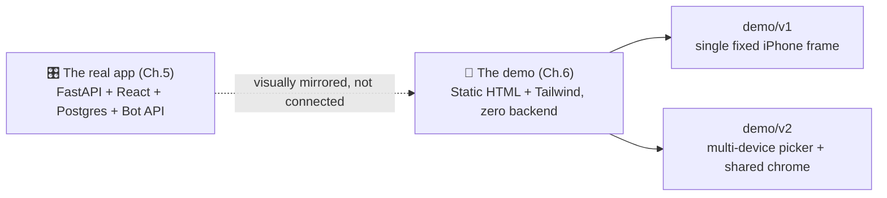

# 🎥 Chapter 6 — The Demo Saga

> *"Chapter 5 shipped a real Telegram Mini App, backed by a real database, a real recommendation engine, and a real bot. So why does the demo everyone actually watches run on zero backend, zero audio, and zero database rows?"*
> Because the fastest way to show someone what SUT Music *feels* like was never to hand them a server — it was to hand them a phone that never breaks. 📱

Chapters 1–5 were about building the thing for real: scraping the group, standing up the database, cleaning the mess, teaching a model to recommend, and shipping a Mini App people actually use. This chapter is about something smaller and, in its own way, just as deliberate — a **static, self-contained phone-frame mockup** built to *present* all of that work without needing a live server, a Telegram session, or an internet connection to show it off.

---

## 🎭 6.1 — Why Fake a Phone At All?

A live demo is a liability. A flaky tunnel URL (see Ch.5 §5.12), a cold-started backend, a database with no fresh data to show, a phone with no Telegram session logged in — any one of those can quietly sink a presentation at the worst possible moment. 😬

The `demo/` folder sidesteps every one of those failure modes on purpose: it's **flat HTML, Tailwind, and hardcoded content** — no backend, no build step, no real audio playback. Track art, names, waveforms, and stats are all typed directly into the markup. Open a file in a browser and it just works, everywhere, every time. Reliability, not realism, was the design goal.

---

## 📱 6.2 — Two Versions, Kept Side By Side

The folder went through one significant revision, and rather than overwrite the original, both live on as `v1/` and `v2/`:

| | `demo/v1/` | `demo/v2/` |
|---|---|---|
| Device support | One fixed iPhone frame, baked into the markup | A device picker — iPhone 17 Pro Max, Samsung S24 Ultra, Samsung S26 Ultra, Galaxy Z Fold 7, Galaxy Z Flip 7, iPad Pro, MacBook Pro 14" |
| Device chrome | Duplicated inline in every HTML file that needs a phone frame | Centralized once in `device/device-preview.js` + `device/device-preview.css`, reused everywhere |
| `index.html` | A grid showing **every** screen at once, each in its own small phone | A single device + single screen, switchable via the picker |
| Sizing / zoom | `100vw`/`100vh`-based; browser zoom could shrink or shift the layout | Page fills its real document box and each device shell sizes itself via plain CSS (`aspect-ratio` + `max-width`/`max-height`) — no JS measures the container, so browser/OS zoom just enlarges everything in place like a normal webpage |
| Label above the device | N/A (v1 has no shared label element) | Static "SUT MUSIC - DEMO" caption, fixed regardless of which device is selected |

Both versions offer the same two presentation modes, and both point at the exact same nine screens under their own `pages/` folder:

| File | What it's for |
|---|---|
| `index.html` | v1: a grid of every screen at once, each in its own small phone. v2: one device + one screen at a time, picked via a dropdown. |
| `demo-clip.html` | The "cinematic demo" in both versions — the fake device floats in 3D space and auto-cycles through every screen on its own, with a floating camera, captions, and on-screen playback controls (previous / pause / mute / next). In v2 this also uses whatever device is selected in the picker. |

Under each version's `pages/`, the same nine self-contained screens make up the actual app tour: `demo-home.html`, `demo-song.html`, `demo-song-details.html`, `demo-artist.html`, `demo-ranks.html`, `demo-search.html`, `demo-profile.html`, `demo-suggest.html`, and `demo-latest.html` — one file per real route from the Mini App's own router (§5.10), so anyone who's seen this demo already knows their way around the live app. This content is identical between v1 and v2; only the framing/presentation changed.

v2 additionally has a `device/` folder holding the reusable device-frame chrome (`device-preview.css`, `device-preview.js`, `index.html`, `iphone-preview.html`) that both its `index.html` and `demo-clip.html` wrapper pages dress their screens up in. v1 has no equivalent folder — its phone chrome is written directly into `index.html` and `demo-clip.html`.

---

## 🧵 6.3 — No Shared Data Source, By Design

Here's the one honest trade-off worth naming, true of both versions: unlike the real app (where a track's title, artist, and cover live in exactly one row, per Ch.2's "never fetch what you don't need" rule), **every demo screen carries its own copy of everything** — track titles, artist names, "shared by" credits, reaction counts, durations, cover-art URLs, even the waveform bars, are all typed straight into that screen's HTML.

That means the same track can legitimately show up on more than one screen — "Midnight City" / M83, for instance, appears in both `demo-song.html` and `demo-song-details.html`, in both v1 and v2 — and changing it means editing every file it appears in by hand, not once in a database. It's the deliberate opposite of Chapter 2's whole philosophy, and that's fine here: a presentation layer with nothing to keep consistent across requests doesn't need a database to stay correct, it just needs someone to `grep` carefully. 🔍

---

## 🎨 6.4 — What's Actually Editable, and Where

| Want to change... | Where it lives |
|---|---|
| Cover art / avatars | `` tags — swap the URL, or point at a local `images/` folder |
| Track title / artist name | Plain text inside tags like `<h1 class="font-display...">` and `` |
| "Shared by" names, reaction counts, durations | Hardcoded per screen — search for the text/number and edit directly |
| Waveform shape | A row of `` elements with inline `height:` percentages — visual only, not driven by real audio data |
| Screen order (cinematic demo) | The `sequence` array near the top of `demo-clip.html`'s `<script>` (v2: inside `device/iphone-preview.html`) — one entry per screen, with `url`, `label`, and CSS `cam`/`stageT` transforms for the camera angle |
| Timing (cinematic demo) | `STEP_MS` (how long each screen stays up, in ms) and the `transition` durations for the crossfade/camera-move speed |
| HUD position (cinematic demo) | v1: the `.hud` CSS rule's `bottom` value. v2: the equivalent rule in `device/device-preview.css` |
| Available devices (v2 only) | The `deviceDefinitions` object in `device/device-preview.js`, plus a matching `<option>` in the `<select id="devicePicker">` in `device/index.html` and `device/iphone-preview.html` |

---

## 🔇 6.5 — Sound Without a Server

Neither the individual screens nor the cinematic demo touch a real music file by default, in either version — the player UI (play/pause, waveform, progress) in `demo-song.html` is visual only, no `<audio>` element in sight. Wiring up a real song is a three-step, no-backend affair: drop an audio file next to the HTML, add an `<audio>` element pointing at it, and hook the existing play/pause button to `audio.play()`/`audio.pause()` with a few lines of vanilla JS.

The cinematic demo takes a different, cleverer shortcut for its own ambient background music: it's **fully synthetic, generated in-browser with the Web Audio API** — no audio file involved at all, tucked away in that file's own `<script>` block (v1: `demo-clip.html`; v2: `device/iphone-preview.html`). Two completely independent sound stories, neither one needing a server to make noise.

---

## 📍 Where To Find Things

| What | Where |
|---|---|
| Top-level explainer / which version to use | `demo/README.md` |
| v1 (single iPhone) docs | `demo/v1/README.md` |
| v2 (multi-device) docs | `demo/v2/README.md` |
| v1 phone-frame preview (grid of all screens) | `demo/v1/index.html` |
| v1 cinematic auto-cycling demo | `demo/v1/demo-clip.html` |
| v2 device-picker preview (one screen at a time) | `demo/v2/index.html` |
| v2 cinematic auto-cycling demo | `demo/v2/demo-clip.html` |
| Individual app screens | `demo/v1/pages/*.html` and `demo/v2/pages/*.html` (identical content) |
| Reusable device-frame chrome (v2 only) | `demo/v2/device/*` |
| Screen order / camera angles / timing | `sequence` array + `STEP_MS`, inside the relevant `demo-clip.html` (v1) or `device/iphone-preview.html` (v2) |

---

## 🎬 Closing Note

The real SUT Music — the scraper, the 24-table database, the cleaning pass, the recommendation engine, the Mini App — is chapters 1 through 5. This chapter is the sixth thing: not a new piece of the machine, but a deliberately fragile-proof window into it, built so that showing the project off never has to depend on a tunnel staying up, a bot session staying logged in, or a database having anything interesting in it that day. Open a file, and the phone just plays along — and now, thanks to v2, it can be almost any phone (or tablet, or laptop) you like. 🎬📱
